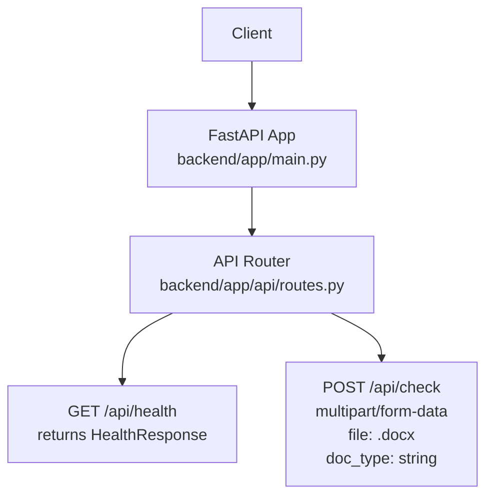
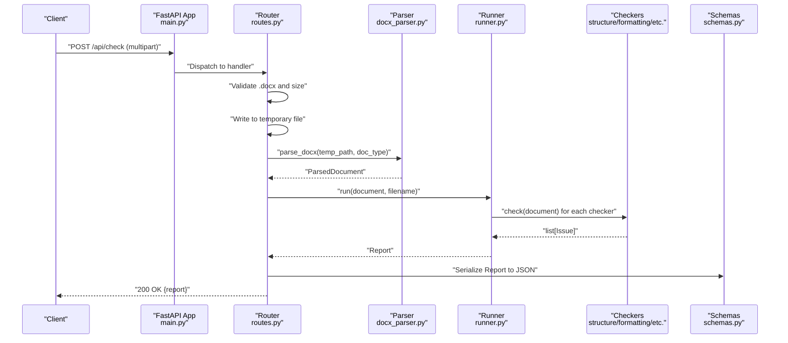
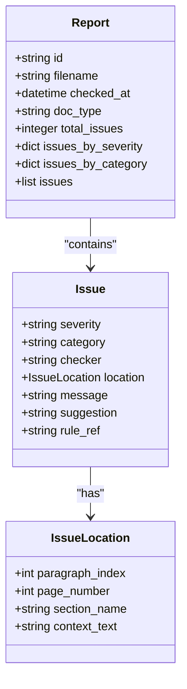
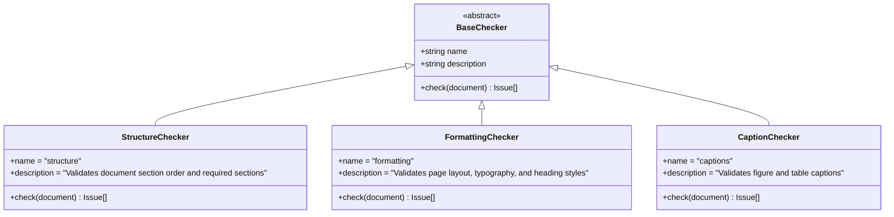
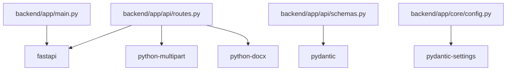

# API Documentation

<cite>
**Referenced Files in This Document**
- [main.py](file://backend/app/main.py)
- [routes.py](file://backend/app/api/routes.py)
- [schemas.py](file://backend/app/api/schemas.py)
- [config.py](file://backend/app/core/config.py)
- [runner.py](file://backend/app/runner.py)
- [docx_parser.py](file://backend/app/parser/docx_parser.py)
- [models.py](file://backend/app/core/models.py)
- [structure.py](file://backend/app/checkers/structure.py)
- [formatting.py](file://backend/app/checkers/formatting.py)
- [captions.py](file://backend/app/checkers/captions.py)
- [pyproject.toml](file://backend/pyproject.toml)
- [design.md](file://docs/design.md)
</cite>

## Table of Contents
1. [Introduction](#introduction)
2. [Project Structure](#project-structure)
3. [Core Components](#core-components)
4. [Architecture Overview](#architecture-overview)
5. [Detailed Component Analysis](#detailed-component-analysis)
6. [Dependency Analysis](#dependency-analysis)
7. [Performance Considerations](#performance-considerations)
8. [Troubleshooting Guide](#troubleshooting-guide)
9. [Conclusion](#conclusion)
10. [Appendices](#appendices)

## Introduction
This document provides comprehensive API documentation for the Dissertation Checker RESTful endpoints. It covers:
- POST /api/check for document validation with multipart/form-data uploads (.docx)
- GET /api/health for service status monitoring
- Request/response schemas, parameter specifications, file handling, authentication, error responses, and HTTP status codes
- Practical curl examples and integration guidelines for frontend applications
- Error handling patterns, rate limiting considerations, and processing flow

## Project Structure
The backend is a FastAPI application that exposes two primary endpoints under /api:
- GET /api/health
- POST /api/check

Endpoints are registered in the router and bound to the FastAPI app with CORS enabled.

**Diagram sources**
- [main.py:1-20](file://backend/app/main.py#L1-L20)
- [routes.py:30-32](file://backend/app/api/routes.py#L30-L32)
- [routes.py:35-65](file://backend/app/api/routes.py#L35-L65)

**Section sources**
- [main.py:1-20](file://backend/app/main.py#L1-L20)
- [routes.py:1-66](file://backend/app/api/routes.py#L1-L66)

## Core Components
- Application entrypoint initializes FastAPI, registers CORS, and mounts the router under /api.
- Router defines:
  - GET /api/health returning a simple health status
  - POST /api/check validating .docx uploads, enforcing size limits, and returning a structured validation report
- Schemas define the response models for health and validation reports.
- Runner orchestrates multiple checkers to produce a unified report.
- Parser converts .docx into a structured document model used by checkers.

Key configuration:
- Maximum upload size is configurable via settings.
- CORS origins are configurable for frontend integration.

**Section sources**
- [main.py:9-19](file://backend/app/main.py#L9-L19)
- [routes.py:30-32](file://backend/app/api/routes.py#L30-L32)
- [routes.py:35-65](file://backend/app/api/routes.py#L35-L65)
- [schemas.py:25-38](file://backend/app/api/schemas.py#L25-L38)
- [runner.py:8-25](file://backend/app/runner.py#L8-L25)
- [docx_parser.py:161-238](file://backend/app/parser/docx_parser.py#L161-L238)
- [config.py:6-16](file://backend/app/core/config.py#L6-L16)

## Architecture Overview
The POST /api/check endpoint follows a clear processing pipeline:
- Accept multipart/form-data with a .docx file and optional doc_type
- Validate file extension and size
- Persist file temporarily
- Parse DOCX into a structured document
- Run all registered checkers
- Aggregate issues into a report
- Return standardized JSON

**Diagram sources**
- [routes.py:35-65](file://backend/app/api/routes.py#L35-L65)
- [docx_parser.py:161-238](file://backend/app/parser/docx_parser.py#L161-L238)
- [runner.py:15-24](file://backend/app/runner.py#L15-L24)
- [structure.py:51-57](file://backend/app/checkers/structure.py#L51-L57)
- [formatting.py:19-24](file://backend/app/checkers/formatting.py#L19-L24)
- [schemas.py:25-38](file://backend/app/api/schemas.py#L25-L38)

## Detailed Component Analysis

### Endpoint: GET /api/health
- Method: GET
- Path: /api/health
- Authentication: Not required
- Response model: HealthResponse
- Typical response: {"status": "ok"}
- Status codes:
  - 200 OK

Parameters:
- None

Example curl:
- curl -i http://localhost:8000/api/health

Notes:
- Designed for health checks and readiness probes.

**Section sources**
- [routes.py:30-32](file://backend/app/api/routes.py#L30-L32)
- [schemas.py:36-38](file://backend/app/api/schemas.py#L36-L38)

### Endpoint: POST /api/check
- Method: POST
- Path: /api/check
- Authentication: Not required
- Content-Type: multipart/form-data
- Request form fields:
  - file: .docx document (required)
  - doc_type: string (optional, default value applied server-side)
    - Allowed values: "thesis_science", "thesis_humanities", "project"
    - Purpose: influences thresholds (e.g., page volume)
- Response model: ReportSchema
- Status codes:
  - 200 OK: Successful validation report
  - 400 Bad Request: Invalid file format or file too large
  - 422 Unprocessable Entity: Error during parsing/document processing
- Notes:
  - Only .docx files are accepted
  - Enforces maximum upload size from settings
  - Temporary file handling ensures cleanup

Request schema (multipart/form-data):
- file: binary (.docx)
- doc_type: string (optional)

Response schema (ReportSchema):
- id: string (UUID)
- filename: string
- checked_at: datetime (UTC)
- doc_type: string
- total_issues: integer
- issues_by_severity: dict<string, integer> ("error", "warning", "info")
- issues_by_category: dict<string, integer>
- issues: list of IssueSchema

IssueSchema:
- severity: "error" | "warning" | "info"
- category: string
- checker: string
- location: IssueLocationSchema
  - paragraph_index: integer | null
  - page_number: integer | null
  - section_name: string | null
  - context_text: string
- message: string
- suggestion: string
- rule_ref: string

HealthResponse:
- status: "ok"

Example curl:
- curl -i -X POST "http://localhost:8000/api/check" -F "file=@/path/to/dissertation.docx" -F "doc_type=thesis_science"

Processing flow:
- Validate file extension ends with .docx
- Validate file size <= max_upload_size_mb (from settings)
- Write uploaded bytes to a temporary .docx file
- Parse DOCX to structured document
- Instantiate runner and register all checkers
- Execute checkers and aggregate issues
- Build report with counts and categorized issues
- Delete temporary file
- Return JSON report

Error handling:
- 400 for invalid file type or oversized file
- 422 for parsing errors or unexpected exceptions during processing
- Temporary file deletion occurs in finally block

**Section sources**
- [routes.py:35-65](file://backend/app/api/routes.py#L35-L65)
- [schemas.py:8-38](file://backend/app/api/schemas.py#L8-L38)
- [config.py:6-16](file://backend/app/core/config.py#L6-L16)
- [docx_parser.py:161-238](file://backend/app/parser/docx_parser.py#L161-L238)
- [runner.py:15-24](file://backend/app/runner.py#L15-L24)
- [structure.py:51-57](file://backend/app/checkers/structure.py#L51-L57)
- [formatting.py:19-24](file://backend/app/checkers/formatting.py#L19-L24)

### Validation Report Details
The report aggregates issues from all checkers and provides counts by severity and category. The runner composes the final report from collected issues.

**Diagram sources**
- [models.py:28-58](file://backend/app/core/models.py#L28-L58)
- [schemas.py:8-38](file://backend/app/api/schemas.py#L8-L38)

**Section sources**
- [runner.py:15-24](file://backend/app/runner.py#L15-L24)
- [models.py:28-58](file://backend/app/core/models.py#L28-L58)
- [schemas.py:25-38](file://backend/app/api/schemas.py#L25-L38)

### Checkers Overview
The system registers multiple checkers that contribute issues to the report. The current implementation includes:
- StructureChecker
- FormattingChecker
- CaptionChecker (placeholder/stub)
- Additional checkers are part of the plugin architecture

**Diagram sources**
- [structure.py:47-57](file://backend/app/checkers/structure.py#L47-L57)
- [formatting.py:15-24](file://backend/app/checkers/formatting.py#L15-L24)
- [captions.py:8-14](file://backend/app/checkers/captions.py#L8-L14)

**Section sources**
- [structure.py:47-57](file://backend/app/checkers/structure.py#L47-L57)
- [formatting.py:15-24](file://backend/app/checkers/formatting.py#L15-L24)
- [captions.py:8-14](file://backend/app/checkers/captions.py#L8-L14)

## Dependency Analysis
External dependencies relevant to the API:
- FastAPI for routing and request/response handling
- python-multipart for multipart/form-data parsing
- python-docx for DOCX parsing
- Pydantic for request/response models
- pydantic-settings for configuration

**Diagram sources**
- [pyproject.toml:5-12](file://backend/pyproject.toml#L5-L12)
- [main.py:3-6](file://backend/app/main.py#L3-L6)
- [routes.py:3-6](file://backend/app/api/routes.py#L3-L6)
- [schemas.py:3-5](file://backend/app/api/schemas.py#L3-L5)
- [config.py:3](file://backend/app/core/config.py#L3)

**Section sources**
- [pyproject.toml:1-29](file://backend/pyproject.toml#L1-L29)

## Performance Considerations
- Max upload size: 50 MB by default; adjust via configuration if needed.
- Temporary file handling: Uploaded files are written to disk and removed after processing.
- Processing time: Target < 30 seconds for a 100-page document (non-functional requirement).
- CORS: Origins configured for frontend integration.

Recommendations:
- Implement client-side file size checks before upload.
- Consider streaming uploads for very large files if extending beyond current limits.
- Monitor CPU and memory usage during parsing and checking phases.

**Section sources**
- [config.py:6-16](file://backend/app/core/config.py#L6-L16)
- [routes.py:44-49](file://backend/app/api/routes.py#L44-L49)
- [design.md:309-314](file://docs/design.md#L309-L314)

## Troubleshooting Guide
Common issues and resolutions:
- 400 Bad Request
  - Cause: File is not a .docx or exceeds max size
  - Resolution: Ensure file extension is .docx and file size ≤ configured limit
- 422 Unprocessable Entity
  - Cause: Error while parsing or processing the document
  - Resolution: Verify the .docx is valid; check server logs for details
- Health check failures
  - Cause: Service not running or misconfigured
  - Resolution: Confirm GET /api/health returns {"status": "ok"}

Rate limiting:
- Requirement: 10 requests/minute per IP (non-functional requirement)
- Implementation note: Not implemented in current code; consider adding middleware or gateway enforcement

CORS:
- Origins are configurable; ensure frontend origin is included

**Section sources**
- [routes.py:40-49](file://backend/app/api/routes.py#L40-L49)
- [routes.py:61-62](file://backend/app/api/routes.py#L61-L62)
- [routes.py:30-32](file://backend/app/api/routes.py#L30-L32)
- [config.py:6-16](file://backend/app/core/config.py#L6-L16)
- [design.md:313](file://docs/design.md#L313)

## Conclusion
The Dissertation Checker exposes two essential endpoints:
- GET /api/health for service monitoring
- POST /api/check for document validation with structured reporting

The API enforces file type and size constraints, parses .docx into a structured model, runs a suite of validators, and returns a comprehensive report. The design supports extensibility via a plugin-based checker architecture and is ready for frontend integration with appropriate CORS configuration.

## Appendices

### API Definitions

- GET /api/health
  - Response: 200 OK with {"status": "ok"}

- POST /api/check
  - Content-Type: multipart/form-data
  - Fields:
    - file: .docx (required)
    - doc_type: "thesis_science" | "thesis_humanities" | "project" (optional)
  - Responses:
    - 200 OK: Report JSON
    - 400 Bad Request: Invalid file format or oversized file
    - 422 Unprocessable Entity: Parsing or processing error

### Example Requests

- curl -i -X POST "http://localhost:8000/api/check" -F "file=@/path/to/dissertation.docx" -F "doc_type=thesis_science"

### Frontend Integration Guidelines
- Use multipart/form-data to upload .docx files
- Support optional doc_type selection
- Display health endpoint status for readiness checks
- Handle 400 and 422 responses gracefully with user-friendly messages
- Respect rate limiting (if enforced externally)

**Section sources**
- [routes.py:30-32](file://backend/app/api/routes.py#L30-L32)
- [routes.py:35-65](file://backend/app/api/routes.py#L35-L65)
- [design.md:168-186](file://docs/design.md#L168-L186)