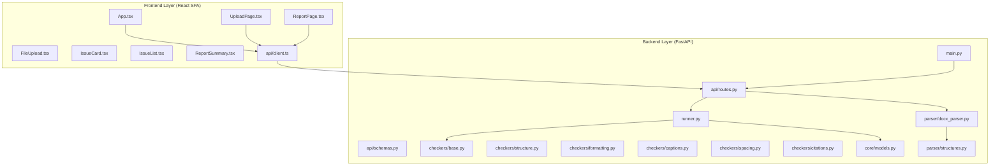
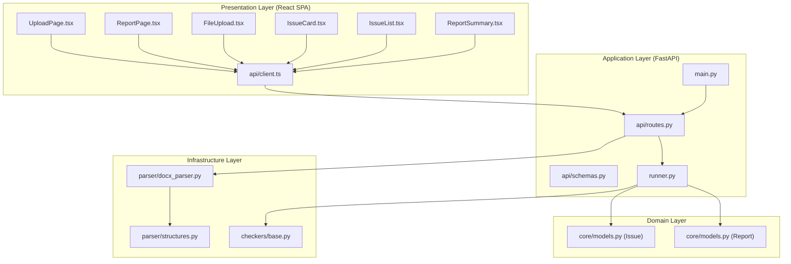
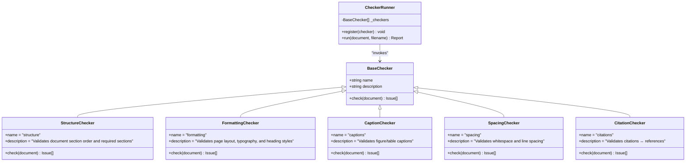
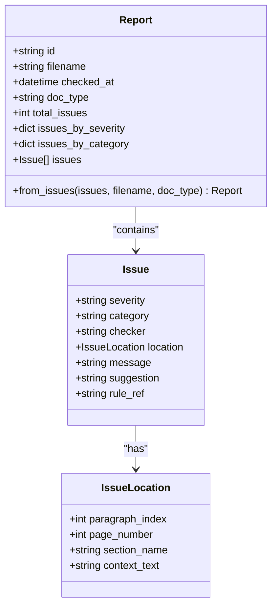
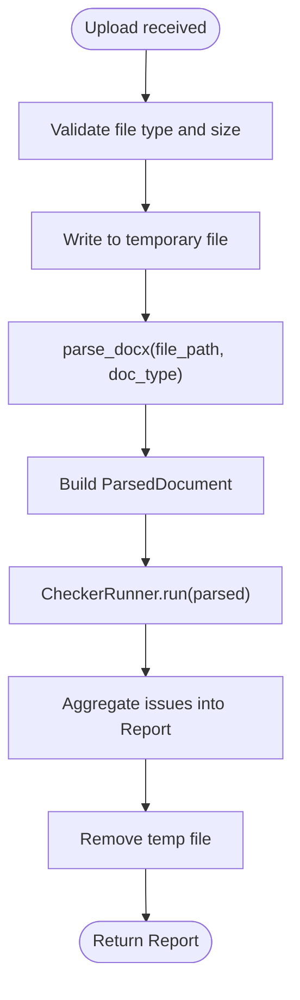
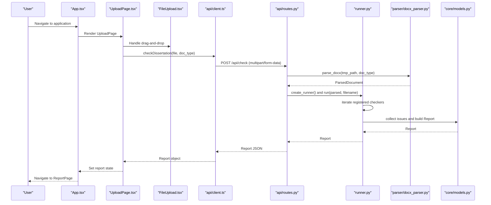
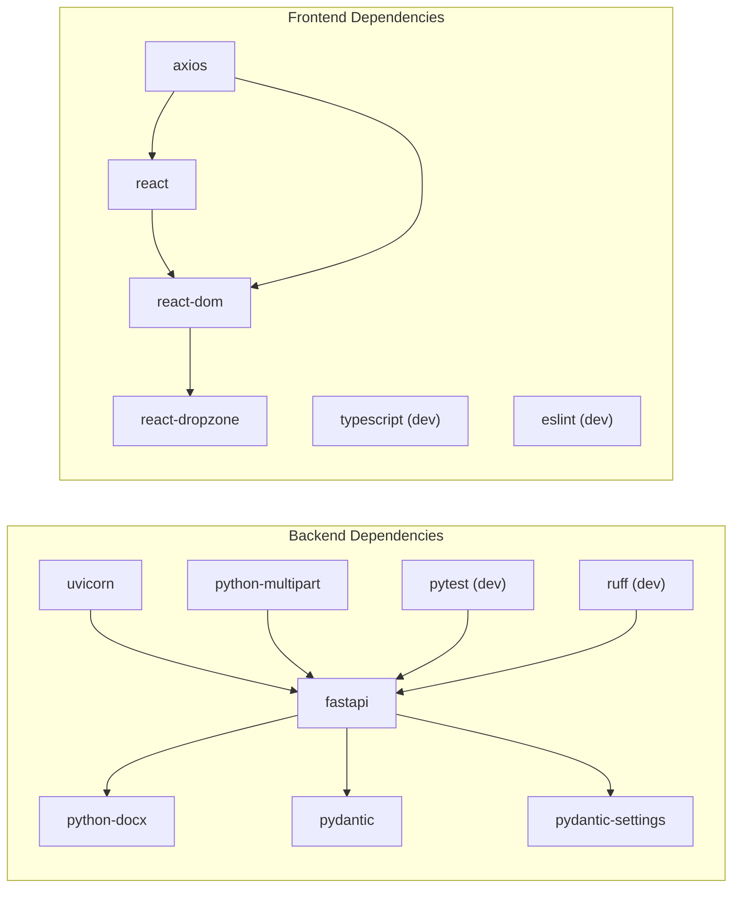

# Architecture Overview

<cite>
**Referenced Files in This Document**
- [README.md](file://README.md)
- [backend/app/main.py](file://backend/app/main.py)
- [backend/app/api/routes.py](file://backend/app/api/routes.py)
- [backend/app/api/schemas.py](file://backend/app/api/schemas.py)
- [backend/app/runner.py](file://backend/app/runner.py)
- [backend/app/checkers/base.py](file://backend/app/checkers/base.py)
- [backend/app/checkers/structure.py](file://backend/app/checkers/structure.py)
- [backend/app/checkers/formatting.py](file://backend/app/checkers/formatting.py)
- [backend/app/checkers/captions.py](file://backend/app/checkers/captions.py)
- [backend/app/checkers/spacing.py](file://backend/app/checkers/spacing.py)
- [backend/app/checkers/citations.py](file://backend/app/checkers/citations.py)
- [backend/app/core/models.py](file://backend/app/core/models.py)
- [backend/app/parser/docx_parser.py](file://backend/app/parser/docx_parser.py)
- [backend/app/parser/structures.py](file://backend/app/parser/structures.py)
- [backend/pyproject.toml](file://backend/pyproject.toml)
- [frontend/src/App.tsx](file://frontend/src/App.tsx)
- [frontend/src/pages/UploadPage.tsx](file://frontend/src/pages/UploadPage.tsx)
- [frontend/src/pages/ReportPage.tsx](file://frontend/src/pages/ReportPage.tsx)
- [frontend/src/components/FileUpload.tsx](file://frontend/src/components/FileUpload.tsx)
- [frontend/src/components/IssueCard.tsx](file://frontend/src/components/IssueCard.tsx)
- [frontend/src/components/IssueList.tsx](file://frontend/src/components/IssueList.tsx)
- [frontend/src/components/ReportSummary.tsx](file://frontend/src/components/ReportSummary.tsx)
- [frontend/src/api/client.ts](file://frontend/src/api/client.ts)
- [frontend/package.json](file://frontend/package.json)
</cite>

## Update Summary
**Changes Made**
- Updated architecture overview to reflect the complete dual-layer system transformation
- Enhanced frontend-backend interaction diagrams showing the React-Express communication flow
- Added comprehensive component relationship explanations for the new dual-layer architecture
- Updated technology stack documentation to emphasize FastAPI backend and React frontend separation
- Revised system boundaries and integration patterns to show clear separation between layers

## Table of Contents
1. [Introduction](#introduction)
2. [Project Structure](#project-structure)
3. [Core Components](#core-components)
4. [Architecture Overview](#architecture-overview)
5. [Detailed Component Analysis](#detailed-component-analysis)
6. [Dependency Analysis](#dependency-analysis)
7. [Performance Considerations](#performance-considerations)
8. [Security Measures](#security-measures)
9. [Deployment Topology](#deployment-topology)
10. [Troubleshooting Guide](#troubleshooting-guide)
11. [Conclusion](#conclusion)

## Introduction
This document describes the full-stack architecture of the Dissertation Checker system. The platform validates .docx documents against Kazakhstani university standards (GOST 7.32-2017) and produces a compliance report. The system comprises:

- **Frontend**: React Single Page Application (SPA) for uploading documents and viewing reports
- **Backend**: FastAPI service exposing REST endpoints and orchestrating validation
- **DOCX Processing Pipeline**: Parser extracting structured content and checkers applying rule-based validations

**Updated** The system now operates as a complete dual-layer architecture with clear separation between the React frontend and FastAPI backend, implementing a traditional client-server architecture pattern.

The backend implements a layered architecture:
- **Presentation layer**: FastAPI routes handling HTTP requests and responses
- **Application layer**: Runner orchestrator and checker registration
- **Domain layer**: Issue and Report models
- **Infrastructure layer**: DOCX parsing and shared structures

The validation engine uses a plugin-based checker system following the strategy pattern, enabling modular addition of new validators.

## Project Structure
The repository is organized into two primary modules with clear architectural separation:
- **backend**: FastAPI application, API routes, models, parsers, checkers, and runner
- **frontend**: React SPA with pages, components, and API client
- **docs**: Design and development plan documentation
- **Root README**: Quick start, tech stack, and project structure overview

**Diagram sources**
- [backend/app/main.py:1-20](file://backend/app/main.py#L1-L20)
- [backend/app/api/routes.py:1-66](file://backend/app/api/routes.py#L1-L66)
- [backend/app/runner.py:1-25](file://backend/app/runner.py#L1-L25)
- [backend/app/checkers/base.py:1-17](file://backend/app/checkers/base.py#L1-L17)
- [backend/app/checkers/structure.py:1-148](file://backend/app/checkers/structure.py#L1-L148)
- [backend/app/checkers/formatting.py:1-174](file://backend/app/checkers/formatting.py#L1-L174)
- [backend/app/checkers/captions.py:1-108](file://backend/app/checkers/captions.py#L1-L108)
- [backend/app/checkers/spacing.py:1-136](file://backend/app/checkers/spacing.py#L1-L136)
- [backend/app/checkers/citations.py:1-14](file://backend/app/checkers/citations.py#L1-L14)
- [backend/app/core/models.py:1-58](file://backend/app/core/models.py#L1-L58)
- [backend/app/parser/docx_parser.py:1-8](file://backend/app/parser/docx_parser.py#L1-L8)
- [backend/app/parser/structures.py:1-89](file://backend/app/parser/structures.py#L1-L89)
- [frontend/src/App.tsx:1-58](file://frontend/src/App.tsx#L1-L58)
- [frontend/src/pages/UploadPage.tsx:1-153](file://frontend/src/pages/UploadPage.tsx#L1-L153)
- [frontend/src/pages/ReportPage.tsx:1-95](file://frontend/src/pages/ReportPage.tsx#L1-L95)
- [frontend/src/components/FileUpload.tsx:1-48](file://frontend/src/components/FileUpload.tsx#L1-L48)
- [frontend/src/components/IssueCard.tsx:1-40](file://frontend/src/components/IssueCard.tsx#L1-L40)
- [frontend/src/components/IssueList.tsx:1-60](file://frontend/src/components/IssueList.tsx#L1-L60)
- [frontend/src/components/ReportSummary.tsx:1-50](file://frontend/src/components/ReportSummary.tsx#L1-L50)
- [frontend/src/api/client.ts:1-50](file://frontend/src/api/client.ts#L1-L50)

**Section sources**
- [README.md:160-195](file://README.md#L160-L195)
- [backend/pyproject.toml:1-29](file://backend/pyproject.toml#L1-L29)
- [frontend/package.json:1-32](file://frontend/package.json#L1-L32)

## Core Components
- **FastAPI application entry** and CORS middleware configuration
- **API router** with health endpoint, document upload, and report retrieval handlers
- **Runner orchestrator** registering and invoking checkers
- **Base checker interface** and concrete implementations (structure, formatting, captions, spacing, citations)
- **Domain models** for Issue and Report, and Pydantic schemas for API serialization
- **DOCX parser** and shared structures for parsed document representation
- **React frontend** pages and components with an Axios-based API client

**Updated** The frontend now consists of multiple specialized components including FileUpload, IssueCard, IssueList, and ReportSummary, providing a rich user interface for document validation results.

Key implementation references:
- Application bootstrap and CORS: [backend/app/main.py:1-20](file://backend/app/main.py#L1-L20)
- Route handlers and runner creation: [backend/app/api/routes.py:1-66](file://backend/app/api/routes.py#L1-L66)
- Runner orchestration: [backend/app/runner.py:1-25](file://backend/app/runner.py#L1-L25)
- Base checker interface: [backend/app/checkers/base.py:1-17](file://backend/app/checkers/base.py#L1-L17)
- Issue and Report models: [backend/app/core/models.py:1-58](file://backend/app/core/models.py#L1-L58)
- DOCX parser and structures: [backend/app/parser/docx_parser.py:1-8](file://backend/app/parser/docx_parser.py#L1-L8), [backend/app/parser/structures.py:1-89](file://backend/app/parser/structures.py#L1-L89)
- Frontend pages and API client: [frontend/src/pages/UploadPage.tsx:1-153](file://frontend/src/pages/UploadPage.tsx#L1-L153), [frontend/src/pages/ReportPage.tsx:1-95](file://frontend/src/pages/ReportPage.tsx#L1-L95), [frontend/src/api/client.ts:1-50](file://frontend/src/api/client.ts#L1-L50)

**Section sources**
- [backend/app/main.py:1-20](file://backend/app/main.py#L1-L20)
- [backend/app/api/routes.py:1-66](file://backend/app/api/routes.py#L1-L66)
- [backend/app/runner.py:1-25](file://backend/app/runner.py#L1-L25)
- [backend/app/checkers/base.py:1-17](file://backend/app/checkers/base.py#L1-L17)
- [backend/app/core/models.py:1-58](file://backend/app/core/models.py#L1-L58)
- [backend/app/parser/docx_parser.py:1-8](file://backend/app/parser/docx_parser.py#L1-L8)
- [backend/app/parser/structures.py:1-89](file://backend/app/parser/structures.py#L1-L89)
- [frontend/src/pages/UploadPage.tsx:1-153](file://frontend/src/pages/UploadPage.tsx#L1-L153)
- [frontend/src/pages/ReportPage.tsx:1-95](file://frontend/src/pages/ReportPage.tsx#L1-L95)
- [frontend/src/api/client.ts:1-50](file://frontend/src/api/client.ts#L1-L50)

## Architecture Overview
The system follows a clean dual-layer architecture with clear separation of concerns:
- **Presentation layer**: React components render upload and report views and communicate via an API client
- **Application layer**: FastAPI routes handle requests, enforce validation rules, and delegate to the Runner
- **Domain layer**: Issue and Report models encapsulate validation outcomes and metadata
- **Infrastructure layer**: DOCX parser transforms uploaded files into structured data consumed by checkers

**Updated** The architecture now represents a traditional client-server pattern where the React frontend acts as the client and the FastAPI backend serves as the server, communicating over HTTP REST APIs.

**Diagram sources**
- [frontend/src/pages/UploadPage.tsx:1-153](file://frontend/src/pages/UploadPage.tsx#L1-L153)
- [frontend/src/pages/ReportPage.tsx:1-95](file://frontend/src/pages/ReportPage.tsx#L1-L95)
- [frontend/src/components/FileUpload.tsx:1-48](file://frontend/src/components/FileUpload.tsx#L1-L48)
- [frontend/src/components/IssueCard.tsx:1-40](file://frontend/src/components/IssueCard.tsx#L1-L40)
- [frontend/src/components/IssueList.tsx:1-60](file://frontend/src/components/IssueList.tsx#L1-L60)
- [frontend/src/components/ReportSummary.tsx:1-50](file://frontend/src/components/ReportSummary.tsx#L1-L50)
- [frontend/src/api/client.ts:1-50](file://frontend/src/api/client.ts#L1-L50)
- [backend/app/main.py:1-20](file://backend/app/main.py#L1-L20)
- [backend/app/api/routes.py:1-66](file://backend/app/api/routes.py#L1-L66)
- [backend/app/api/schemas.py:1-38](file://backend/app/api/schemas.py#L1-L38)
- [backend/app/runner.py:1-25](file://backend/app/runner.py#L1-L25)
- [backend/app/core/models.py:1-58](file://backend/app/core/models.py#L1-L58)
- [backend/app/parser/docx_parser.py:1-8](file://backend/app/parser/docx_parser.py#L1-L8)
- [backend/app/parser/structures.py:1-89](file://backend/app/parser/structures.py#L1-L89)
- [backend/app/checkers/base.py:1-17](file://backend/app/checkers/base.py#L1-L17)

## Detailed Component Analysis

### Plugin-Based Checker System (Strategy Pattern)
The system employs a strategy-like plugin architecture:
- **BaseChecker** defines a uniform interface for all checkers
- **Concrete checkers** implement specific validation logic
- **CheckerRunner** aggregates and invokes registered checkers
- **Routes** instantiate and register all checkers during runtime

**Updated** The checker system now operates as a true plugin architecture where checkers are dynamically registered and executed in sequence, providing extensible validation capabilities.

**Diagram sources**
- [backend/app/checkers/base.py:1-17](file://backend/app/checkers/base.py#L1-L17)
- [backend/app/checkers/structure.py:1-148](file://backend/app/checkers/structure.py#L1-L148)
- [backend/app/checkers/formatting.py:1-174](file://backend/app/checkers/formatting.py#L1-L174)
- [backend/app/checkers/captions.py:1-108](file://backend/app/checkers/captions.py#L1-L108)
- [backend/app/checkers/spacing.py:1-136](file://backend/app/checkers/spacing.py#L1-L136)
- [backend/app/checkers/citations.py:1-14](file://backend/app/checkers/citations.py#L1-L14)
- [backend/app/runner.py:1-25](file://backend/app/runner.py#L1-L25)

**Section sources**
- [backend/app/checkers/base.py:1-17](file://backend/app/checkers/base.py#L1-L17)
- [backend/app/checkers/structure.py:1-148](file://backend/app/checkers/structure.py#L1-L148)
- [backend/app/checkers/formatting.py:1-174](file://backend/app/checkers/formatting.py#L1-L174)
- [backend/app/checkers/captions.py:1-108](file://backend/app/checkers/captions.py#L1-L108)
- [backend/app/checkers/spacing.py:1-136](file://backend/app/checkers/spacing.py#L1-L136)
- [backend/app/checkers/citations.py:1-14](file://backend/app/checkers/citations.py#L1-L14)
- [backend/app/runner.py:1-25](file://backend/app/runner.py#L1-L25)

### Data Model Layer
The domain layer defines the canonical data structures for validation outcomes and reports.

**Updated** The data model layer now includes both Python dataclasses for internal processing and Pydantic schemas for API serialization, ensuring type safety across the entire application stack.

**Diagram sources**
- [backend/app/core/models.py:1-58](file://backend/app/core/models.py#L1-L58)

**Section sources**
- [backend/app/core/models.py:1-58](file://backend/app/core/models.py#L1-L58)

### DOCX Processing Pipeline
The DOCX pipeline converts uploaded files into a structured representation consumed by checkers.

**Updated** The processing pipeline now includes comprehensive error handling, temporary file management, and validation of upload constraints before processing begins.

**Diagram sources**
- [backend/app/api/routes.py:35-66](file://backend/app/api/routes.py#L35-L66)
- [backend/app/parser/docx_parser.py:5-8](file://backend/app/parser/docx_parser.py#L5-L8)
- [backend/app/parser/structures.py:77-89](file://backend/app/parser/structures.py#L77-L89)
- [backend/app/runner.py:15-24](file://backend/app/runner.py#L15-L24)

**Section sources**
- [backend/app/api/routes.py:35-66](file://backend/app/api/routes.py#L35-L66)
- [backend/app/parser/docx_parser.py:5-8](file://backend/app/parser/docx_parser.py#L5-L8)
- [backend/app/parser/structures.py:77-89](file://backend/app/parser/structures.py#L77-L89)
- [backend/app/runner.py:15-24](file://backend/app/runner.py#L15-L24)

### Frontend Interaction Flow
The frontend drives the end-to-end process from upload to report rendering through a sophisticated React component hierarchy.

**Updated** The frontend now implements a complete SPA architecture with proper state management, component composition, and comprehensive error handling for the entire document validation workflow.

**Diagram sources**
- [frontend/src/App.tsx:43-55](file://frontend/src/App.tsx#L43-L55)
- [frontend/src/pages/UploadPage.tsx:21-35](file://frontend/src/pages/UploadPage.tsx#L21-L35)
- [frontend/src/components/FileUpload.tsx:9-23](file://frontend/src/components/FileUpload.tsx#L9-L23)
- [frontend/src/api/client.ts:33-44](file://frontend/src/api/client.ts#L33-L44)
- [backend/app/api/routes.py:35-66](file://backend/app/api/routes.py#L35-L66)
- [backend/app/runner.py:15-24](file://backend/app/runner.py#L15-L24)
- [backend/app/parser/docx_parser.py:5-8](file://backend/app/parser/docx_parser.py#L5-L8)
- [backend/app/core/models.py:39-58](file://backend/app/core/models.py#L39-L58)

**Section sources**
- [frontend/src/App.tsx:1-58](file://frontend/src/App.tsx#L1-L58)
- [frontend/src/pages/UploadPage.tsx:1-153](file://frontend/src/pages/UploadPage.tsx#L1-L153)
- [frontend/src/components/FileUpload.tsx:1-48](file://frontend/src/components/FileUpload.tsx#L1-L48)
- [frontend/src/api/client.ts:1-50](file://frontend/src/api/client.ts#L1-L50)
- [backend/app/api/routes.py:1-66](file://backend/app/api/routes.py#L1-L66)
- [backend/app/runner.py:1-25](file://backend/app/runner.py#L1-L25)
- [backend/app/parser/docx_parser.py:1-8](file://backend/app/parser/docx_parser.py#L1-L8)
- [backend/app/core/models.py:1-58](file://backend/app/core/models.py#L1-L58)

## Dependency Analysis
The backend declares explicit dependencies and optional development tools. The frontend depends on React, React DOM, Axios, and react-dropzone.

**Updated** The dependency structure now reflects the complete separation between frontend and backend technologies, with clear boundaries and minimal coupling between layers.

**Diagram sources**
- [backend/pyproject.toml:5-20](file://backend/pyproject.toml#L5-L20)
- [frontend/package.json:12-30](file://frontend/package.json#L12-L30)

**Section sources**
- [backend/pyproject.toml:1-29](file://backend/pyproject.toml#L1-L29)
- [frontend/package.json:1-32](file://frontend/package.json#L1-L32)

## Performance Considerations
- **Asynchronous I/O**: FastAPI and Uvicorn support asynchronous request handling; ensure long-running checks remain non-blocking
- **Temporary file management**: Uploaded files are written to disk; ensure cleanup occurs reliably and avoid holding handles open
- **Memory footprint**: Large .docx files increase memory usage during parsing; consider streaming or chunked processing if needed
- **Concurrency**: Runner executes checkers sequentially; parallelization can be introduced per checker if independent
- **Caching**: In-memory report storage is acceptable for demos; for production, use scalable cache or database
- **Validation limits**: Enforce maximum upload size and reject oversized files early to prevent resource exhaustion
- **Frontend optimization**: React components should implement proper memoization and lazy loading for large reports

**Updated** Performance considerations now include both backend and frontend optimization strategies, with particular attention to React component performance and efficient data fetching patterns.

## Security Measures
- **CORS policy**: Configure origins explicitly in settings to restrict cross-origin access
- **Input validation**: Reject non-.docx uploads and enforce size limits
- **Sanitization**: Treat uploaded files as untrusted; parse only with trusted libraries and avoid executing embedded content
- **Error handling**: Return generic errors to clients while logging detailed server-side errors
- **Secrets and configuration**: Store sensitive settings in environment variables or secure secret stores
- **Frontend security**: Implement proper input sanitization and XSS protection in React components

**Updated** Security measures now encompass both backend API security and frontend application security, ensuring comprehensive protection across the entire dual-layer architecture.

## Deployment Topology
Recommended deployment model:
- **Single container per service**: Frontend static assets served by Nginx or CDN; backend containerized with Uvicorn
- **Reverse proxy**: Optional reverse proxy for HTTPS termination and load balancing
- **Persistent storage**: Reports if caching is required
- **Environment-specific configurations**: Via secrets and config maps

**Updated** The deployment topology now supports the dual-layer architecture with clear separation between frontend and backend services, enabling independent scaling and deployment strategies.

Containerization and orchestration are supported by the repository's container-related files and compose configurations.

## Troubleshooting Guide
Common issues and remedies:
- **Upload failures**: Verify file type and size constraints; confirm multipart form submission
- **Parser errors**: Ensure python-docx is installed and compatible; validate temporary file permissions
- **CORS errors**: Confirm allowed origins and credentials policies in settings
- **Report retrieval**: Confirm in-memory storage keys and existence checks
- **Frontend API errors**: Check VITE_API_URL and network connectivity to backend
- **Component rendering issues**: Verify React component prop types and state management
- **Build errors**: Ensure proper TypeScript compilation and asset bundling

**Updated** Troubleshooting guidance now covers both frontend and backend issues specific to the dual-layer architecture, including React component debugging and API communication problems.

**Section sources**
- [backend/app/api/routes.py:40-49](file://backend/app/api/routes.py#L40-L49)
- [backend/app/api/routes.py:61-65](file://backend/app/api/routes.py#L61-L65)
- [backend/app/main.py:11-17](file://backend/app/main.py#L11-L17)
- [frontend/src/api/client.ts:3](file://frontend/src/api/client.ts#L3)

## Conclusion
The Dissertation Checker system applies a clean dual-layer architecture with a plugin-based validation engine. The React frontend provides a sophisticated user interface for document upload and report visualization, while the FastAPI backend orchestrates DOCX parsing and checker execution. The design supports modularity, maintainability, and extensibility, with straightforward paths to enhance scalability and security for production deployments.

**Updated** The system now represents a mature full-stack application with clear architectural boundaries, comprehensive error handling, and robust separation of concerns between the presentation and application layers.