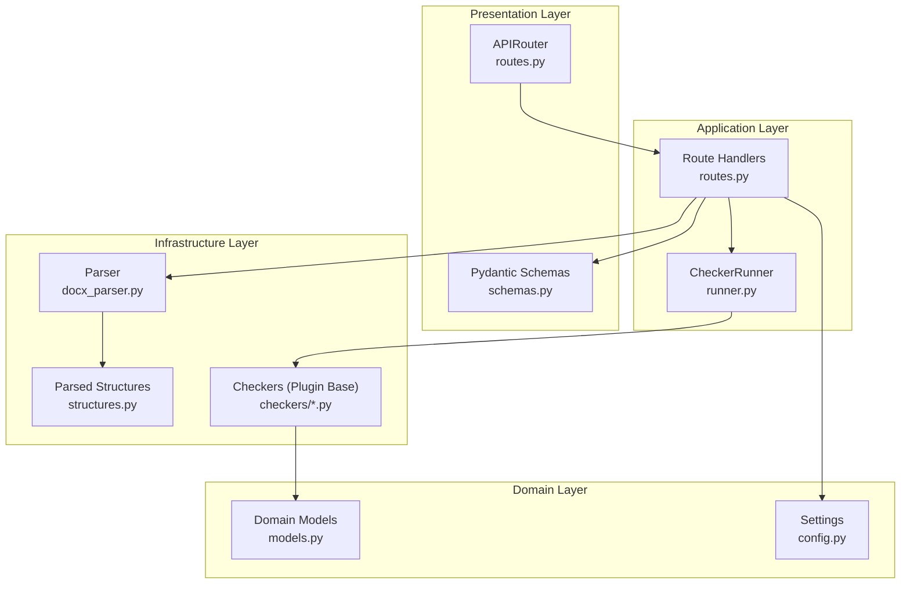
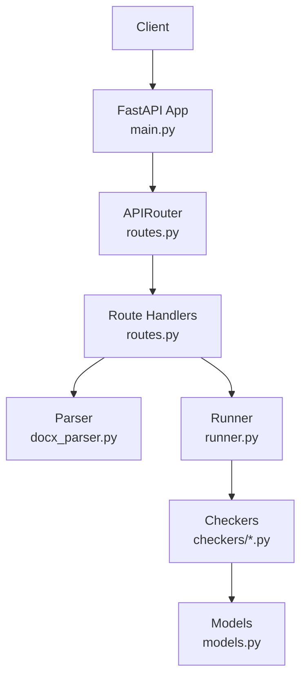
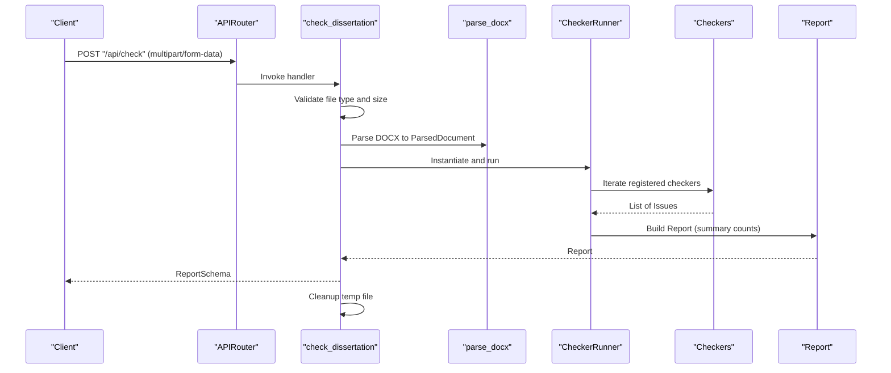
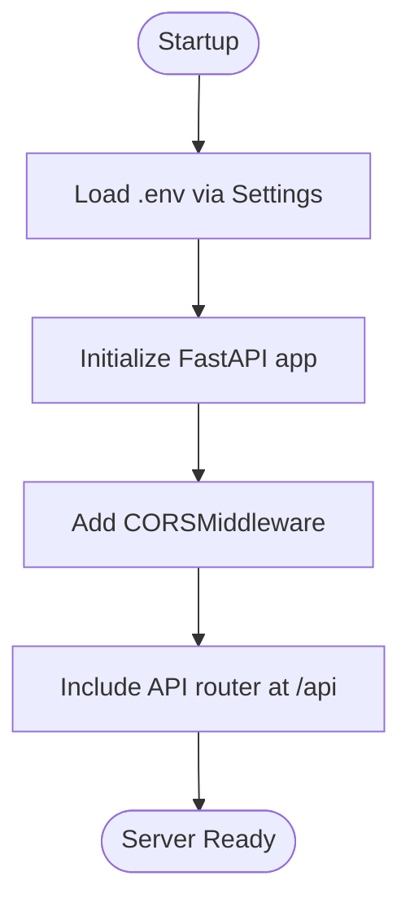
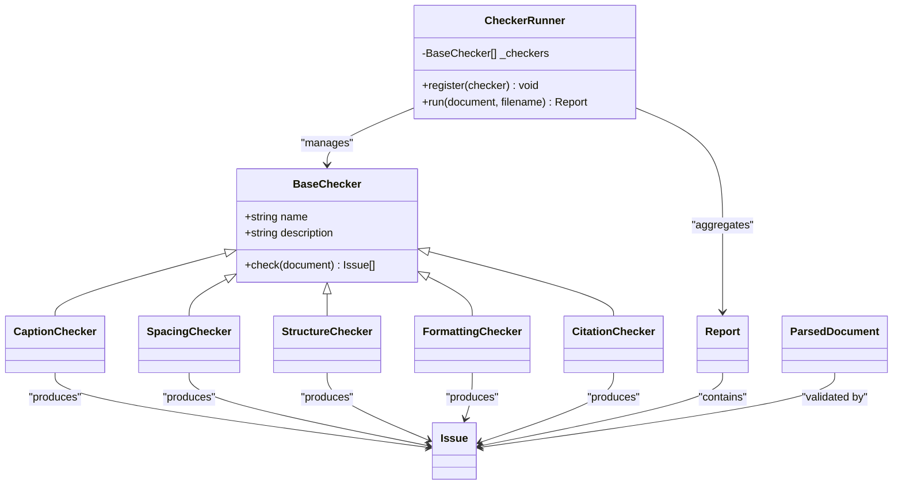
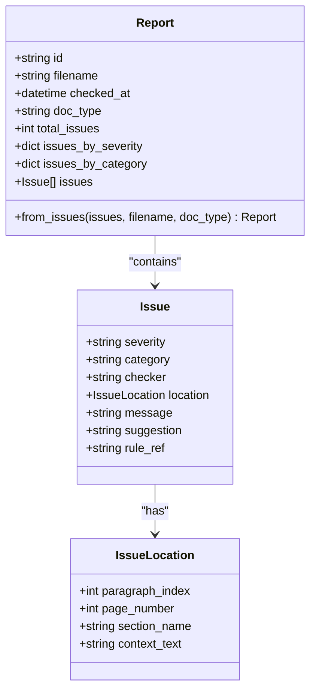
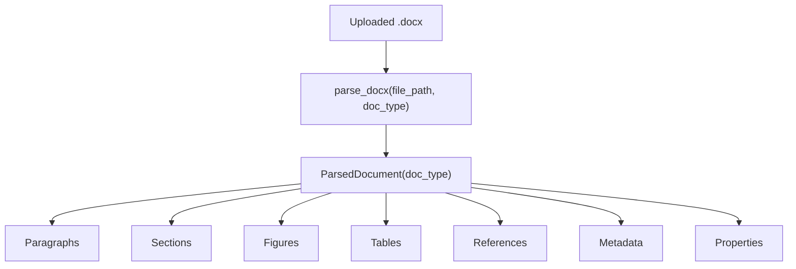
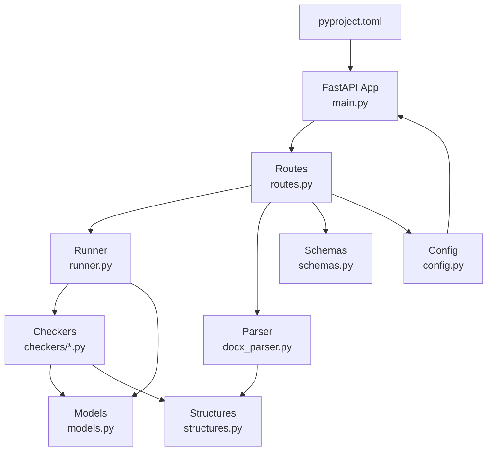
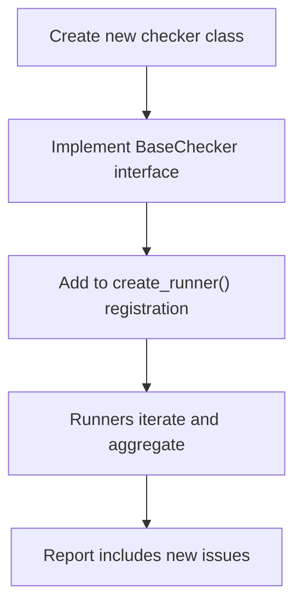

# Backend Architecture

<cite>
**Referenced Files in This Document**
- [main.py](file://backend/app/main.py)
- [routes.py](file://backend/app/api/routes.py)
- [schemas.py](file://backend/app/api/schemas.py)
- [runner.py](file://backend/app/runner.py)
- [base.py](file://backend/app/checkers/base.py)
- [structure.py](file://backend/app/checkers/structure.py)
- [formatting.py](file://backend/app/checkers/formatting.py)
- [captions.py](file://backend/app/checkers/captions.py)
- [spacing.py](file://backend/app/checkers/spacing.py)
- [citations.py](file://backend/app/checkers/citations.py)
- [config.py](file://backend/app/core/config.py)
- [models.py](file://backend/app/core/models.py)
- [docx_parser.py](file://backend/app/parser/docx_parser.py)
- [structures.py](file://backend/app/parser/structures.py)
- [pyproject.toml](file://backend/pyproject.toml)
</cite>

## Table of Contents
1. [Introduction](#introduction)
2. [Project Structure](#project-structure)
3. [Core Components](#core-components)
4. [Architecture Overview](#architecture-overview)
5. [Detailed Component Analysis](#detailed-component-analysis)
6. [Dependency Analysis](#dependency-analysis)
7. [Performance Considerations](#performance-considerations)
8. [Troubleshooting Guide](#troubleshooting-guide)
9. [Conclusion](#conclusion)
10. [Appendices](#appendices)

## Introduction
This document describes the backend architecture of a FastAPI-based dissertation checking service. It covers the layered architecture (presentation, application, domain, and infrastructure), FastAPI routing and request/response handling, configuration management, security considerations, startup process, middleware usage, error handling, the checker orchestration system, the Runner class, and the plugin-based architecture for validators. It also includes guidance on scalability, performance optimization, and deployment considerations.

## Project Structure
The backend is organized into distinct layers:
- Presentation layer: FastAPI router and schemas
- Application layer: Orchestration via a Runner and route handlers
- Domain layer: Typed models and report aggregation
- Infrastructure layer: Parser and document structures

**Diagram sources**
- [routes.py:1-75](file://backend/app/api/routes.py#L1-L75)
- [runner.py:1-25](file://backend/app/runner.py#L1-L25)
- [schemas.py:1-38](file://backend/app/api/schemas.py#L1-L38)
- [config.py:1-17](file://backend/app/core/config.py#L1-L17)
- [models.py:1-58](file://backend/app/core/models.py#L1-L58)
- [docx_parser.py:1-8](file://backend/app/parser/docx_parser.py#L1-L8)
- [structures.py:1-89](file://backend/app/parser/structures.py#L1-L89)
- [base.py:1-17](file://backend/app/checkers/base.py#L1-L17)
- [captions.py:1-108](file://backend/app/checkers/captions.py#L1-L108)
- [spacing.py:1-136](file://backend/app/checkers/spacing.py#L1-L136)

**Section sources**
- [main.py:1-20](file://backend/app/main.py#L1-L20)
- [routes.py:1-75](file://backend/app/api/routes.py#L1-L75)
- [schemas.py:1-38](file://backend/app/api/schemas.py#L1-L38)
- [runner.py:1-25](file://backend/app/runner.py#L1-L25)
- [config.py:1-17](file://backend/app/core/config.py#L1-L17)
- [models.py:1-58](file://backend/app/core/models.py#L1-L58)
- [docx_parser.py:1-8](file://backend/app/parser/docx_parser.py#L1-L8)
- [structures.py:1-89](file://backend/app/parser/structures.py#L1-L89)
- [base.py:1-17](file://backend/app/checkers/base.py#L1-L17)
- [captions.py:1-108](file://backend/app/checkers/captions.py#L1-L108)
- [spacing.py:1-136](file://backend/app/checkers/spacing.py#L1-L136)

## Core Components
- FastAPI application entry point initializes CORS middleware and mounts the API router under /api.
- Route handlers manage upload, validation, and report retrieval with request validation and error handling.
- The Runner orchestrates multiple checkers and aggregates results into a Report.
- Pydantic schemas define request/response contracts.
- Settings encapsulate environment-based configuration loaded from .env.
- Domain models represent issues, reports, and locations; Report.from_issues computes summary statistics.
- Parser produces a ParsedDocument from uploaded .docx files.
- Plugin-based checkers implement a shared BaseChecker interface.

**Section sources**
- [main.py:1-20](file://backend/app/main.py#L1-L20)
- [routes.py:1-75](file://backend/app/api/routes.py#L1-L75)
- [runner.py:1-25](file://backend/app/runner.py#L1-L25)
- [schemas.py:1-38](file://backend/app/api/schemas.py#L1-L38)
- [config.py:1-17](file://backend/app/core/config.py#L1-L17)
- [models.py:1-58](file://backend/app/core/models.py#L1-L58)
- [docx_parser.py:1-8](file://backend/app/parser/docx_parser.py#L1-L8)
- [structures.py:1-89](file://backend/app/parser/structures.py#L1-L89)
- [base.py:1-17](file://backend/app/checkers/base.py#L1-L17)

## Architecture Overview
The system follows a layered FastAPI architecture:
- Presentation: APIRouter exposes GET /health and POST /api/check, returning Pydantic models.
- Application: Route handlers validate inputs, parse the document, instantiate a Runner, and collect results.
- Domain: Strongly typed Issue and Report models with computed summaries.
- Infrastructure: Parser converts DOCX to structured data; checkers apply validation rules.

**Diagram sources**
- [main.py:1-20](file://backend/app/main.py#L1-L20)
- [routes.py:1-75](file://backend/app/api/routes.py#L1-L75)
- [runner.py:1-25](file://backend/app/runner.py#L1-L25)
- [docx_parser.py:1-8](file://backend/app/parser/docx_parser.py#L1-L8)
- [models.py:1-58](file://backend/app/core/models.py#L1-L58)
- [captions.py:1-108](file://backend/app/checkers/captions.py#L1-L108)
- [spacing.py:1-136](file://backend/app/checkers/spacing.py#L1-L136)

## Detailed Component Analysis

### FastAPI Routing and Request/Response Handling
- Health endpoint returns a simple model.
- Upload endpoint accepts multipart/form-data with file and doc_type form fields.
- Validation enforces .docx extension and a configurable maximum upload size.
- Temporary file handling ensures cleanup after processing.
- Error handling raises HTTP exceptions for invalid inputs and parsing failures.
- Responses are serialized via Pydantic models.

**Diagram sources**
- [routes.py:36-68](file://backend/app/api/routes.py#L36-L68)
- [docx_parser.py:5-8](file://backend/app/parser/docx_parser.py#L5-L8)
- [runner.py:15-24](file://backend/app/runner.py#L15-L24)
- [models.py:39-57](file://backend/app/core/models.py#L39-L57)

**Section sources**
- [routes.py:31-75](file://backend/app/api/routes.py#L31-L75)
- [schemas.py:25-37](file://backend/app/api/schemas.py#L25-L37)

### Configuration Management and Security
- Settings are loaded from .env using pydantic-settings and include app_name, max_upload_size_mb, cors_origins, and temp_dir.
- CORS middleware is configured globally with allow_origins, credentials, methods, and headers.
- Security considerations:
  - Enforce .docx uploads and size limits.
  - Sanitize temporary file lifecycle.
  - Return structured error messages instead of raw exceptions.

**Diagram sources**
- [config.py:6-16](file://backend/app/core/config.py#L6-L16)
- [main.py:9-19](file://backend/app/main.py#L9-L19)

**Section sources**
- [config.py:1-17](file://backend/app/core/config.py#L1-L17)
- [main.py:1-20](file://backend/app/main.py#L1-L20)

### Checker Orchestration and Plugin Architecture
- Runner maintains a list of BaseChecker instances and runs them sequentially.
- Each checker implements a check method that takes a ParsedDocument and returns a list of Issue objects.
- Report.from_issues aggregates totals and counts by severity and category.

**Diagram sources**
- [base.py:9-16](file://backend/app/checkers/base.py#L9-L16)
- [structure.py:5-10](file://backend/app/checkers/structure.py#L5-L10)
- [formatting.py:5-10](file://backend/app/checkers/formatting.py#L5-L10)
- [captions.py:8-16](file://backend/app/checkers/captions.py#L8-L16)
- [spacing.py:13-24](file://backend/app/checkers/spacing.py#L13-L24)
- [citations.py:5-10](file://backend/app/checkers/citations.py#L5-L10)
- [runner.py:8-24](file://backend/app/runner.py#L8-L24)
- [models.py:18-57](file://backend/app/core/models.py#L18-L57)
- [structures.py:78-89](file://backend/app/parser/structures.py#L78-L89)

**Section sources**
- [runner.py:1-25](file://backend/app/runner.py#L1-L25)
- [base.py:1-17](file://backend/app/checkers/base.py#L1-L17)
- [captions.py:1-108](file://backend/app/checkers/captions.py#L1-L108)
- [spacing.py:1-136](file://backend/app/checkers/spacing.py#L1-L136)
- [models.py:1-58](file://backend/app/core/models.py#L1-L58)

### Data Models and Report Aggregation
- IssueLocation captures contextual information such as paragraph index, page number, and section name.
- Issue defines severity, category, checker name, location, message, suggestion, and optional rule reference.
- Report aggregates issues, computes totals, and counts by severity and category.
- from_issues static method builds a Report from a flat list of issues.

**Diagram sources**
- [models.py:9-57](file://backend/app/core/models.py#L9-L57)
- [schemas.py:8-37](file://backend/app/api/schemas.py#L8-L37)

**Section sources**
- [models.py:1-58](file://backend/app/core/models.py#L1-L58)
- [schemas.py:1-38](file://backend/app/api/schemas.py#L1-L38)

### Parser and Document Structures
- parse_docx returns a ParsedDocument constructed from the uploaded file and doc_type.
- ParsedDocument includes paragraphs, sections, figures, tables, references, metadata, page counts, and document properties.

**Diagram sources**
- [docx_parser.py:5-8](file://backend/app/parser/docx_parser.py#L5-L8)
- [structures.py:78-89](file://backend/app/parser/structures.py#L78-L89)

**Section sources**
- [docx_parser.py:1-8](file://backend/app/parser/docx_parser.py#L1-L8)
- [structures.py:1-89](file://backend/app/parser/structures.py#L1-L89)

## Dependency Analysis
External dependencies include FastAPI, Uvicorn, python-multipart, python-docx, Pydantic, and Pydantic Settings. Optional dev dependencies include pytest, httpx, and ruff. The project targets Python 3.11+.

**Diagram sources**
- [pyproject.toml:1-29](file://backend/pyproject.toml#L1-L29)
- [main.py:1-20](file://backend/app/main.py#L1-L20)
- [routes.py:1-75](file://backend/app/api/routes.py#L1-L75)
- [runner.py:1-25](file://backend/app/runner.py#L1-L25)
- [config.py:1-17](file://backend/app/core/config.py#L1-L17)
- [models.py:1-58](file://backend/app/core/models.py#L1-L58)
- [docx_parser.py:1-8](file://backend/app/parser/docx_parser.py#L1-L8)
- [structures.py:1-89](file://backend/app/parser/structures.py#L1-L89)
- [schemas.py:1-38](file://backend/app/api/schemas.py#L1-L38)

**Section sources**
- [pyproject.toml:1-29](file://backend/pyproject.toml#L1-L29)

## Performance Considerations
- Asynchronous FastAPI handlers enable concurrency; keep I/O-bound operations asynchronous (e.g., file reads/writes).
- Limit memory usage by streaming uploads and avoiding loading entire documents into memory unnecessarily.
- Use pagination or caching for report retrieval if scaling to many concurrent users.
- Offload heavy computations to background workers if validation becomes CPU-intensive.
- Tune max_upload_size_mb to balance usability and resource consumption.
- Monitor parser throughput and consider parallelizing checker execution if independent validations can be decoupled.

[No sources needed since this section provides general guidance]

## Troubleshooting Guide
Common issues and resolutions:
- Invalid file type: Ensure uploads are .docx; route handler rejects other formats.
- File too large: Enforced by settings.max_upload_size_mb; adjust environment variable accordingly.
- Parsing errors: Catch-all HTTP 422 with a descriptive message; inspect server logs for stack traces.
- Report not found: GET /api/reports/{report_id} returns 404 if ID does not exist.

Operational tips:
- Verify CORS settings for frontend origin.
- Confirm .env presence and correctness of environment variables.
- Clean up temporary files post-processing to prevent disk pressure.

**Section sources**
- [routes.py:41-50](file://backend/app/api/routes.py#L41-L50)
- [routes.py:63-64](file://backend/app/api/routes.py#L63-L64)
- [routes.py:72-73](file://backend/app/api/routes.py#L72-L73)
- [config.py:6-16](file://backend/app/core/config.py#L6-L16)

## Conclusion
The backend employs a clean layered architecture with FastAPI at its core. The presentation layer handles requests and responses, the application layer orchestrates validation, the domain layer defines robust models, and the infrastructure layer parses documents and applies validator plugins. The system is designed for extensibility via the BaseChecker interface and supports environment-driven configuration and secure cross-origin access.

[No sources needed since this section summarizes without analyzing specific files]

## Appendices

### API Endpoints Summary
- GET /api/health: Returns a health status payload.
- POST /api/check: Accepts multipart/form-data with file and doc_type; returns a validated report.
- GET /api/reports/{report_id}: Retrieves a previously generated report by ID.

**Section sources**
- [routes.py:31-75](file://backend/app/api/routes.py#L31-L75)
- [schemas.py:25-37](file://backend/app/api/schemas.py#L25-L37)

### Adding a New Checker (Plugin Pattern)
Steps to integrate a new validator:
- Create a new checker class inheriting from BaseChecker.
- Implement the check method to return a list of Issue objects derived from ParsedDocument.
- Register the checker in the create_runner factory within routes.py.

**Diagram sources**
- [base.py:9-16](file://backend/app/checkers/base.py#L9-L16)
- [routes.py:21-28](file://backend/app/api/routes.py#L21-L28)
- [runner.py:12-24](file://backend/app/runner.py#L12-L24)

**Section sources**
- [base.py:1-17](file://backend/app/checkers/base.py#L1-L17)
- [routes.py:21-28](file://backend/app/api/routes.py#L21-L28)
- [runner.py:1-25](file://backend/app/runner.py#L1-L25)