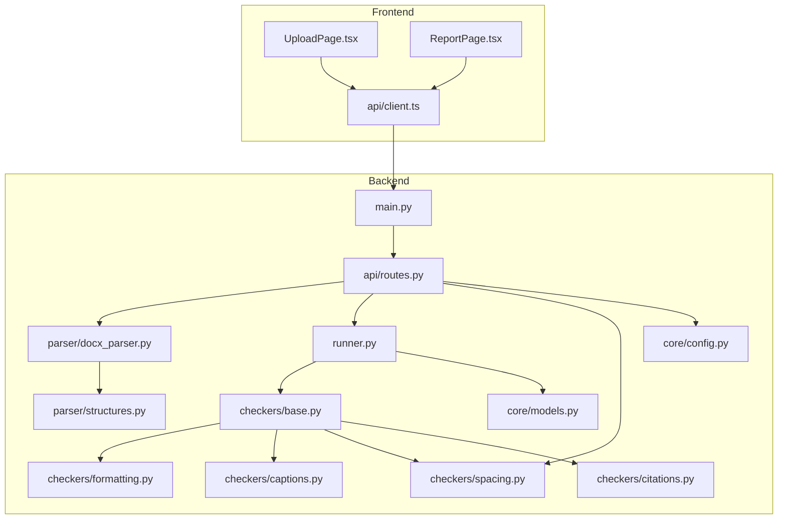
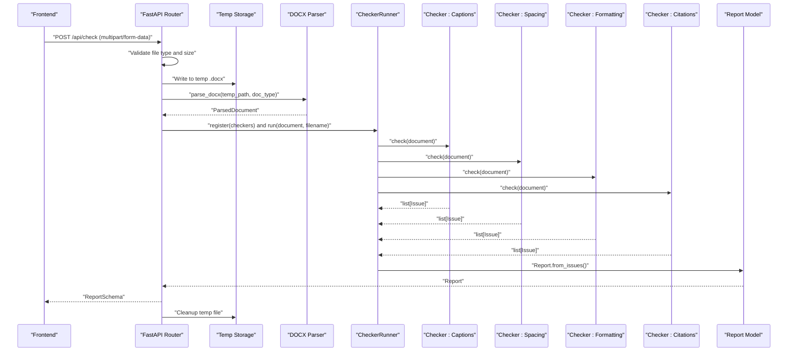
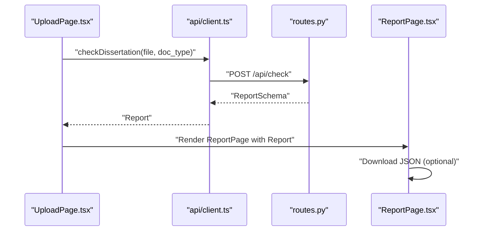
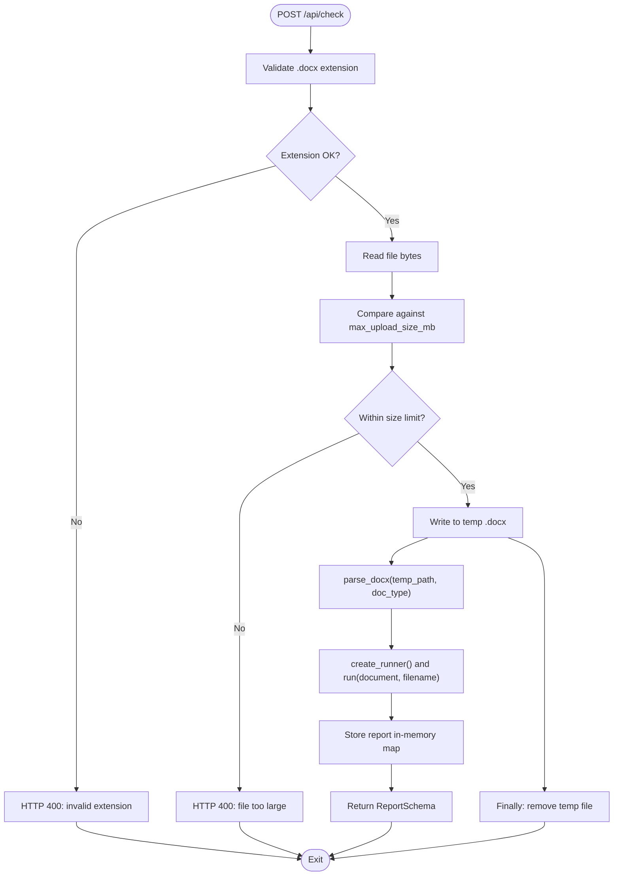
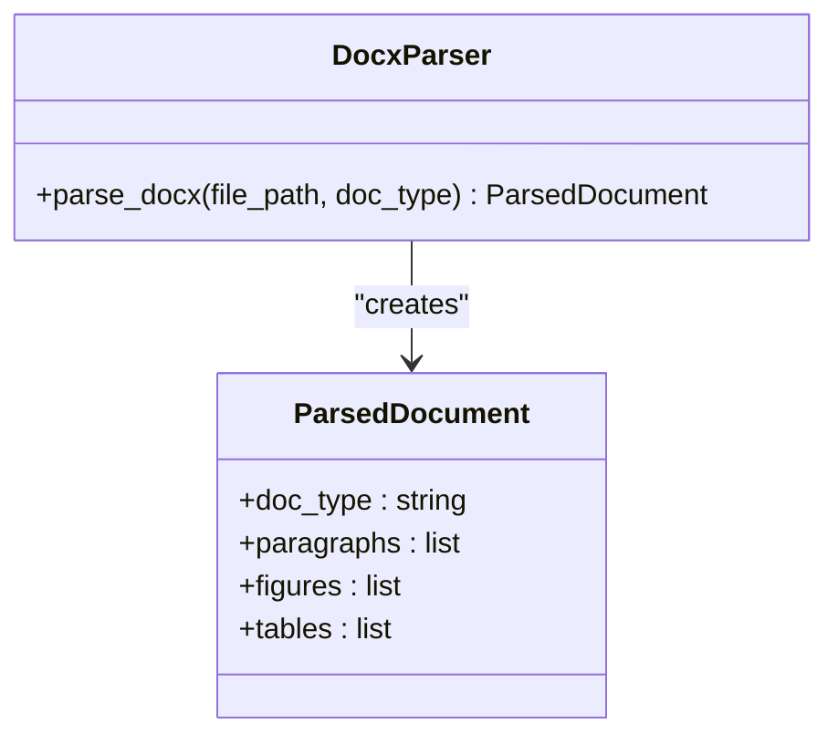
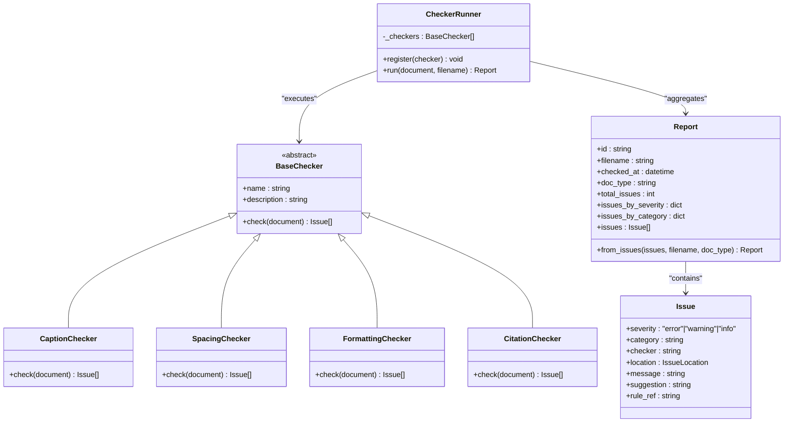
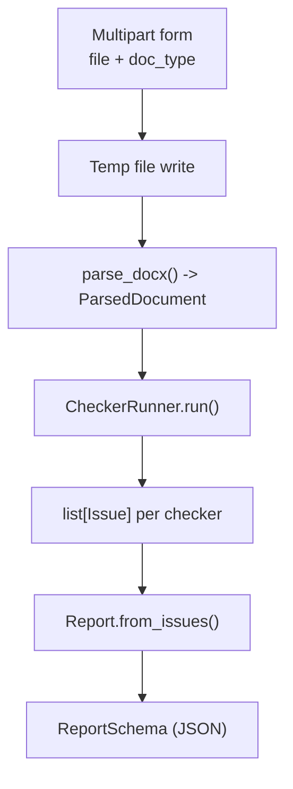
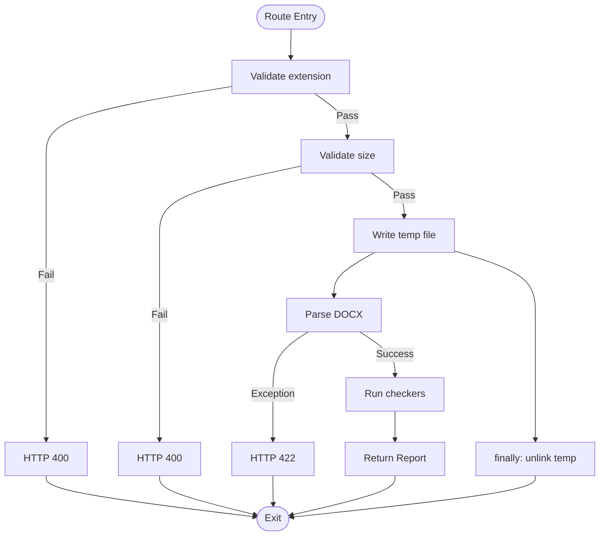
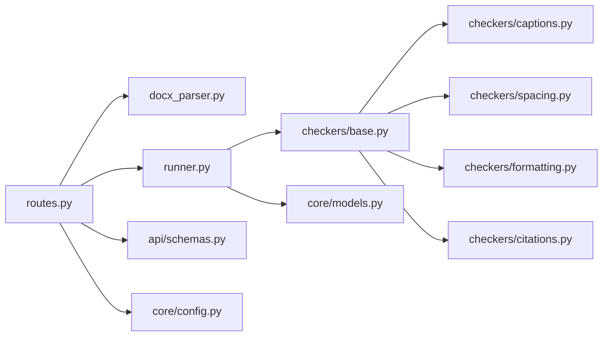

# Data Flow and Processing Pipeline

<cite>
**Referenced Files in This Document**
- [backend/app/main.py](file://backend/app/main.py)
- [backend/app/api/routes.py](file://backend/app/api/routes.py)
- [backend/app/api/schemas.py](file://backend/app/api/schemas.py)
- [backend/app/core/config.py](file://backend/app/core/config.py)
- [backend/app/core/models.py](file://backend/app/core/models.py)
- [backend/app/parser/docx_parser.py](file://backend/app/parser/docx_parser.py)
- [backend/app/parser/structures.py](file://backend/app/parser/structures.py)
- [backend/app/runner.py](file://backend/app/runner.py)
- [backend/app/checkers/base.py](file://backend/app/checkers/base.py)
- [backend/app/checkers/formatting.py](file://backend/app/checkers/formatting.py)
- [backend/app/checkers/captions.py](file://backend/app/checkers/captions.py)
- [backend/app/checkers/spacing.py](file://backend/app/checkers/spacing.py)
- [backend/app/checkers/citations.py](file://backend/app/checkers/citations.py)
- [frontend/src/api/client.ts](file://frontend/src/api/client.ts)
- [frontend/src/pages/UploadPage.tsx](file://frontend/src/pages/UploadPage.tsx)
- [frontend/src/pages/ReportPage.tsx](file://frontend/src/pages/ReportPage.tsx)
</cite>

## Table of Contents
1. [Introduction](#introduction)
2. [Project Structure](#project-structure)
3. [Core Components](#core-components)
4. [Architecture Overview](#architecture-overview)
5. [Detailed Component Analysis](#detailed-component-analysis)
6. [Dependency Analysis](#dependency-analysis)
7. [Performance Considerations](#performance-considerations)
8. [Troubleshooting Guide](#troubleshooting-guide)
9. [Conclusion](#conclusion)

## Introduction
This document traces the complete data flow and processing pipeline of the Dissertation Checker system, from document upload through validation to report generation. It covers frontend-to-backend data transfer, backend processing stages (temporary file handling, DOCX parsing, structured document representation, checker execution, and report aggregation), error handling, and security measures. Asynchronous processing and batch operations are discussed conceptually, along with performance optimization strategies.

## Project Structure
The system comprises a FastAPI backend and a React/TypeScript frontend. The backend exposes REST endpoints for health checks, document checking, and report retrieval. The frontend provides a user interface for uploading DOCX files, selecting document type, and viewing results.

**Diagram sources**
- [backend/app/main.py:1-20](file://backend/app/main.py#L1-L20)
- [backend/app/api/routes.py:1-75](file://backend/app/api/routes.py#L1-L75)
- [backend/app/api/schemas.py:1-38](file://backend/app/api/schemas.py#L1-L38)
- [backend/app/core/config.py:1-17](file://backend/app/core/config.py#L1-L17)
- [backend/app/core/models.py:1-58](file://backend/app/core/models.py#L1-L58)
- [backend/app/parser/docx_parser.py:1-8](file://backend/app/parser/docx_parser.py#L1-L8)
- [backend/app/parser/structures.py](file://backend/app/parser/structures.py)
- [backend/app/runner.py:1-25](file://backend/app/runner.py#L1-L25)
- [backend/app/checkers/base.py:1-17](file://backend/app/checkers/base.py#L1-L17)
- [backend/app/checkers/formatting.py:1-11](file://backend/app/checkers/formatting.py#L1-L11)
- [backend/app/checkers/captions.py:1-108](file://backend/app/checkers/captions.py#L1-L108)
- [backend/app/checkers/spacing.py:1-136](file://backend/app/checkers/spacing.py#L1-L136)
- [backend/app/checkers/citations.py:1-11](file://backend/app/checkers/citations.py#L1-L11)
- [frontend/src/api/client.ts:1-50](file://frontend/src/api/client.ts#L1-L50)
- [frontend/src/pages/UploadPage.tsx:1-62](file://frontend/src/pages/UploadPage.tsx#L1-L62)
- [frontend/src/pages/ReportPage.tsx:1-37](file://frontend/src/pages/ReportPage.tsx#L1-L37)

**Section sources**
- [backend/app/main.py:1-20](file://backend/app/main.py#L1-L20)
- [backend/app/api/routes.py:1-75](file://backend/app/api/routes.py#L1-L75)
- [frontend/src/pages/UploadPage.tsx:1-62](file://frontend/src/pages/UploadPage.tsx#L1-L62)
- [frontend/src/pages/ReportPage.tsx:1-37](file://frontend/src/pages/ReportPage.tsx#L1-L37)

## Core Components
- Frontend API client: Sends multipart form data to the backend and retrieves reports.
- Backend FastAPI app: Registers CORS middleware and mounts the router under /api.
- Routes: Handles health checks, document upload, and report retrieval.
- Runner: Orchestrates checker registration and execution.
- Checkers: Implement validation logic for formatting, captions, spacing, and citations.
- Parser: Converts DOCX to a structured document model.
- Models and Schemas: Define domain data structures and API response models.

**Section sources**
- [frontend/src/api/client.ts:1-50](file://frontend/src/api/client.ts#L1-L50)
- [backend/app/main.py:1-20](file://backend/app/main.py#L1-L20)
- [backend/app/api/routes.py:1-75](file://backend/app/api/routes.py#L1-L75)
- [backend/app/runner.py:1-25](file://backend/app/runner.py#L1-L25)
- [backend/app/checkers/base.py:1-17](file://backend/app/checkers/base.py#L1-L17)
- [backend/app/parser/docx_parser.py:1-8](file://backend/app/parser/docx_parser.py#L1-L8)
- [backend/app/core/models.py:1-58](file://backend/app/core/models.py#L1-L58)
- [backend/app/api/schemas.py:1-38](file://backend/app/api/schemas.py#L1-L38)

## Architecture Overview
The system follows a request-response pattern:
- The frontend uploads a DOCX file and selects a document type via multipart form submission.
- The backend validates the file type and size, writes the file to a temporary location, parses it into a structured document, runs registered checkers, aggregates issues into a report, and returns the report to the client.
- Reports are stored in-memory keyed by ID for retrieval.

**Diagram sources**
- [backend/app/api/routes.py:36-68](file://backend/app/api/routes.py#L36-L68)
- [backend/app/parser/docx_parser.py:5-7](file://backend/app/parser/docx_parser.py#L5-L7)
- [backend/app/runner.py:15-24](file://backend/app/runner.py#L15-L24)
- [backend/app/checkers/captions.py:12-16](file://backend/app/checkers/captions.py#L12-L16)
- [backend/app/checkers/spacing.py:17-24](file://backend/app/checkers/spacing.py#L17-L24)
- [backend/app/checkers/formatting.py:9-10](file://backend/app/checkers/formatting.py#L9-L10)
- [backend/app/checkers/citations.py:9-10](file://backend/app/checkers/citations.py#L9-L10)
- [backend/app/core/models.py:39-57](file://backend/app/core/models.py#L39-L57)

## Detailed Component Analysis

### Frontend Data Transfer and UI Flow
- UploadPage collects a File and document type, disables the submit button until a file is selected, and invokes the API client to submit a multipart form.
- The API client composes FormData with the file and doc_type and posts to /api/check.
- On success, the page triggers navigation to ReportPage, which displays summary statistics and a list of issues, and allows downloading the report as JSON.

**Diagram sources**
- [frontend/src/pages/UploadPage.tsx:15-27](file://frontend/src/pages/UploadPage.tsx#L15-L27)
- [frontend/src/api/client.ts:33-44](file://frontend/src/api/client.ts#L33-L44)
- [backend/app/api/routes.py:36-68](file://backend/app/api/routes.py#L36-L68)
- [frontend/src/pages/ReportPage.tsx:10-19](file://frontend/src/pages/ReportPage.tsx#L10-L19)

**Section sources**
- [frontend/src/pages/UploadPage.tsx:1-62](file://frontend/src/pages/UploadPage.tsx#L1-L62)
- [frontend/src/api/client.ts:1-50](file://frontend/src/api/client.ts#L1-L50)
- [frontend/src/pages/ReportPage.tsx:1-37](file://frontend/src/pages/ReportPage.tsx#L1-L37)

### Backend Route Handlers and Validation
- Health endpoint returns a simple status payload.
- Check endpoint enforces:
  - File extension validation (.docx).
  - Size validation using configured maximum upload size.
  - Temporary file creation and cleanup.
  - Parsing and checker orchestration.
  - Error handling with appropriate HTTP exceptions.
- Report retrieval endpoint serves in-memory reports by ID.

**Diagram sources**
- [backend/app/api/routes.py:31-74](file://backend/app/api/routes.py#L31-L74)
- [backend/app/core/config.py:6-10](file://backend/app/core/config.py#L6-L10)

**Section sources**
- [backend/app/api/routes.py:31-74](file://backend/app/api/routes.py#L31-L74)
- [backend/app/core/config.py:1-17](file://backend/app/core/config.py#L1-L17)

### DOCX Parsing and Structured Representation
- The DOCX parser currently constructs a ParsedDocument from the doc_type argument. In a later task, the parser will extract paragraphs, figures, tables, and other elements into the structured model.
- The ParsedDocument is consumed by checkers to produce issues.

**Diagram sources**
- [backend/app/parser/docx_parser.py:5-7](file://backend/app/parser/docx_parser.py#L5-L7)
- [backend/app/parser/structures.py](file://backend/app/parser/structures.py)

**Section sources**
- [backend/app/parser/docx_parser.py:1-8](file://backend/app/parser/docx_parser.py#L1-L8)

### Checker Execution Pipeline
- The Runner maintains a list of BaseChecker instances and executes them sequentially, collecting all issues.
- Each checker implements a check method that inspects the ParsedDocument and returns a list of Issue objects.
- Issues are aggregated into a Report, which computes counts by severity and category.

**Diagram sources**
- [backend/app/checkers/base.py:9-16](file://backend/app/checkers/base.py#L9-L16)
- [backend/app/checkers/captions.py:8-16](file://backend/app/checkers/captions.py#L8-L16)
- [backend/app/checkers/spacing.py:13-24](file://backend/app/checkers/spacing.py#L13-L24)
- [backend/app/checkers/formatting.py:5-10](file://backend/app/checkers/formatting.py#L5-L10)
- [backend/app/checkers/citations.py:5-10](file://backend/app/checkers/citations.py#L5-L10)
- [backend/app/runner.py:8-24](file://backend/app/runner.py#L8-L24)
- [backend/app/core/models.py:17-57](file://backend/app/core/models.py#L17-L57)

**Section sources**
- [backend/app/runner.py:1-25](file://backend/app/runner.py#L1-L25)
- [backend/app/checkers/base.py:1-17](file://backend/app/checkers/base.py#L1-L17)
- [backend/app/checkers/captions.py:1-108](file://backend/app/checkers/captions.py#L1-L108)
- [backend/app/checkers/spacing.py:1-136](file://backend/app/checkers/spacing.py#L1-L136)
- [backend/app/checkers/formatting.py:1-11](file://backend/app/checkers/formatting.py#L1-L11)
- [backend/app/checkers/citations.py:1-11](file://backend/app/checkers/citations.py#L1-L11)
- [backend/app/core/models.py:1-58](file://backend/app/core/models.py#L1-L58)

### Data Transformation Stages
- File upload: Multipart form data received by the backend.
- Temporary storage: Bytes written to a named temporary file with .docx suffix.
- Parsing: DOCX converted into a ParsedDocument abstraction.
- Validation: Each checker produces a list of Issue objects.
- Aggregation: Issues grouped into a Report with computed metrics.
- Response: Report serialized to ReportSchema for the client.

**Diagram sources**
- [backend/app/api/routes.py:44-60](file://backend/app/api/routes.py#L44-L60)
- [backend/app/parser/docx_parser.py:5-7](file://backend/app/parser/docx_parser.py#L5-L7)
- [backend/app/runner.py:15-24](file://backend/app/runner.py#L15-L24)
- [backend/app/core/models.py:39-57](file://backend/app/core/models.py#L39-L57)
- [backend/app/api/schemas.py:25-33](file://backend/app/api/schemas.py#L25-L33)

### Error Handling and Security Measures
- Validation:
  - Extension enforcement ensures only .docx files are processed.
  - Size enforcement prevents oversized uploads using a configurable maximum.
- Cleanup:
  - Temporary file deletion occurs in a finally block after processing.
- Exceptions:
  - HTTP 400 for invalid extension and size violations.
  - HTTP 404 for missing reports.
  - HTTP 422 for parsing errors with a descriptive message.
- Security:
  - CORS is configured with allowed origins and credentials support.
  - Input is sanitized by rejecting non-.docx files and enforcing size limits.

**Diagram sources**
- [backend/app/api/routes.py:41-67](file://backend/app/api/routes.py#L41-L67)
- [backend/app/core/config.py:6-10](file://backend/app/core/config.py#L6-L10)

**Section sources**
- [backend/app/api/routes.py:31-74](file://backend/app/api/routes.py#L31-L74)
- [backend/app/core/config.py:1-17](file://backend/app/core/config.py#L1-L17)

### Asynchronous Processing, Batch Operations, and Performance
- Current implementation:
  - Synchronous request-response handling in the route handler.
  - In-memory report storage keyed by ID.
- Recommended enhancements (conceptual):
  - Asynchronous processing: Offload parsing and checking to background tasks with job IDs and polling endpoints.
  - Batch operations: Accept multiple files, queue jobs, and aggregate a consolidated report.
  - Performance optimizations:
    - Stream large file uploads to avoid loading entire content into memory.
    - Use connection pooling and rate limiting.
    - Cache parsed documents or intermediate results where applicable.
    - Parallelize independent checkers (ensure thread-safe stateless checkers).
    - Compress report responses if bandwidth is constrained.

[No sources needed since this section provides general guidance]

## Dependency Analysis
The backend components exhibit clear separation of concerns:
- Routes depend on the parser, runner, and schemas.
- Runner depends on BaseChecker implementations.
- Checkers depend on ParsedDocument and produce Issue objects.
- Models define the canonical data structures used across the pipeline.
- Configuration supplies runtime settings such as CORS and upload limits.

**Diagram sources**
- [backend/app/api/routes.py:1-17](file://backend/app/api/routes.py#L1-L17)
- [backend/app/parser/docx_parser.py:1-8](file://backend/app/parser/docx_parser.py#L1-L8)
- [backend/app/runner.py:1-25](file://backend/app/runner.py#L1-L25)
- [backend/app/checkers/base.py:1-17](file://backend/app/checkers/base.py#L1-L17)
- [backend/app/checkers/captions.py:1-108](file://backend/app/checkers/captions.py#L1-L108)
- [backend/app/checkers/spacing.py:1-136](file://backend/app/checkers/spacing.py#L1-L136)
- [backend/app/checkers/formatting.py:1-11](file://backend/app/checkers/formatting.py#L1-L11)
- [backend/app/checkers/citations.py:1-11](file://backend/app/checkers/citations.py#L1-L11)
- [backend/app/core/models.py:1-58](file://backend/app/core/models.py#L1-L58)
- [backend/app/core/config.py:1-17](file://backend/app/core/config.py#L1-L17)

**Section sources**
- [backend/app/api/routes.py:1-75](file://backend/app/api/routes.py#L1-L75)
- [backend/app/runner.py:1-25](file://backend/app/runner.py#L1-L25)
- [backend/app/checkers/base.py:1-17](file://backend/app/checkers/base.py#L1-L17)

## Performance Considerations
- Upload handling:
  - Validate size early to prevent unnecessary processing.
  - Consider streaming uploads to reduce peak memory usage.
- Parsing:
  - Ensure the parser efficiently traverses document elements without redundant scans.
- Checking:
  - Stateless checkers enable potential parallelization.
  - Minimize repeated computations by caching derived properties from ParsedDocument.
- Reporting:
  - Keep Issue and Report structures compact; avoid deep copies where possible.
- Caching and persistence:
  - Persist reports to a database for long-term retrieval instead of in-memory storage.
  - Add report expiration policies to manage storage growth.

[No sources needed since this section provides general guidance]

## Troubleshooting Guide
Common issues and resolutions:
- File rejected with “invalid extension”:
  - Ensure the uploaded file has a .docx extension.
- “File too large” error:
  - Reduce file size or adjust the maximum upload size setting.
- “Error parsing document”:
  - Verify the DOCX is valid and unencrypted; check server logs for underlying parser errors.
- “Report not found”:
  - Confirm the report ID exists and has not expired from in-memory storage.

Operational checks:
- Health endpoint: Call GET /api/health to verify service availability.
- CORS: Confirm frontend origin is included in allowed CORS origins.

**Section sources**
- [backend/app/api/routes.py:31-74](file://backend/app/api/routes.py#L31-L74)
- [backend/app/core/config.py:1-17](file://backend/app/core/config.py#L1-L17)

## Conclusion
The Dissertation Checker implements a clear, extensible pipeline from upload to report. The frontend submits a DOCX with metadata, the backend validates inputs, persists the file temporarily, parses it into a structured document, executes a suite of checkers, aggregates results, and returns a standardized report. Security and performance are addressed through validation, cleanup, and CORS configuration. Future enhancements can introduce asynchronous processing, batch operations, and improved scalability while maintaining the current modular design.