# Frontend Architecture

<cite>
**Referenced Files in This Document**
- [App.tsx](file://frontend/src/App.tsx)
- [main.tsx](file://frontend/src/main.tsx)
- [UploadPage.tsx](file://frontend/src/pages/UploadPage.tsx)
- [ReportPage.tsx](file://frontend/src/pages/ReportPage.tsx)
- [FileUpload.tsx](file://frontend/src/components/FileUpload.tsx)
- [IssueList.tsx](file://frontend/src/components/IssueList.tsx)
- [IssueCard.tsx](file://frontend/src/components/IssueCard.tsx)
- [ReportSummary.tsx](file://frontend/src/components/ReportSummary.tsx)
- [client.ts](file://frontend/src/api/client.ts)
- [vite.config.ts](file://frontend/vite.config.ts)
- [package.json](file://frontend/package.json)
- [tsconfig.json](file://frontend/tsconfig.json)
- [index.css](file://frontend/src/index.css)
- [App.css](file://frontend/src/App.css)
- [schemas.py](file://backend/app/api/schemas.py)
- [routes.py](file://backend/app/api/routes.py)
</cite>

## Table of Contents
1. [Introduction](#introduction)
2. [Project Structure](#project-structure)
3. [Core Components](#core-components)
4. [Architecture Overview](#architecture-overview)
5. [Detailed Component Analysis](#detailed-component-analysis)
6. [Dependency Analysis](#dependency-analysis)
7. [Performance Considerations](#performance-considerations)
8. [Troubleshooting Guide](#troubleshooting-guide)
9. [Conclusion](#conclusion)
10. [Appendices](#appendices)

## Introduction
This document describes the frontend architecture of the React-based Dissertation Checker application. It explains the component hierarchy, routing model, state management, data flow from API responses to UI rendering, TypeScript interfaces, API client design, and build configuration. It also covers styling approaches, component reusability, performance considerations, and UX design principles.

## Project Structure
The frontend is organized by feature and responsibility:
- Pages: top-level views (UploadPage and ReportPage)
- Components: reusable UI building blocks (FileUpload, IssueList, IssueCard, ReportSummary)
- API client: typed HTTP client for backend communication
- Build and configuration: Vite, TypeScript, and CSS modules

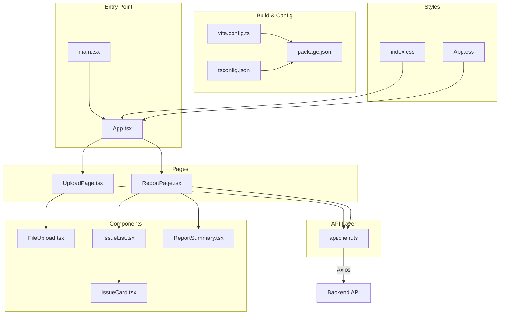

**Diagram sources**
- [main.tsx:1-11](file://frontend/src/main.tsx#L1-L11)
- [App.tsx:1-16](file://frontend/src/App.tsx#L1-L16)
- [UploadPage.tsx:1-62](file://frontend/src/pages/UploadPage.tsx#L1-L62)
- [ReportPage.tsx:1-37](file://frontend/src/pages/ReportPage.tsx#L1-L37)
- [FileUpload.tsx:1-48](file://frontend/src/components/FileUpload.tsx#L1-L48)
- [IssueList.tsx:1-43](file://frontend/src/components/IssueList.tsx#L1-L43)
- [IssueCard.tsx:1-54](file://frontend/src/components/IssueCard.tsx#L1-L54)
- [ReportSummary.tsx:1-46](file://frontend/src/components/ReportSummary.tsx#L1-L46)
- [client.ts:1-50](file://frontend/src/api/client.ts#L1-L50)
- [vite.config.ts:1-8](file://frontend/vite.config.ts#L1-L8)
- [package.json:1-32](file://frontend/package.json#L1-L32)
- [tsconfig.json:1-8](file://frontend/tsconfig.json#L1-L8)
- [index.css:1-69](file://frontend/src/index.css#L1-L69)
- [App.css:1-43](file://frontend/src/App.css#L1-L43)

**Section sources**
- [main.tsx:1-11](file://frontend/src/main.tsx#L1-L11)
- [vite.config.ts:1-8](file://frontend/vite.config.ts#L1-L8)
- [package.json:1-32](file://frontend/package.json#L1-L32)
- [tsconfig.json:1-8](file://frontend/tsconfig.json#L1-L8)
- [index.css:1-69](file://frontend/src/index.css#L1-L69)
- [App.css:1-43](file://frontend/src/App.css#L1-L43)

## Core Components
- App: orchestrates page-level navigation via a single piece of state holding a Report object. It conditionally renders UploadPage or ReportPage.
- UploadPage: manages local form state (selected file, document type, loading/error), triggers API checks, and forwards the resulting Report to the parent.
- ReportPage: displays a downloadable JSON summary and renders ReportSummary and IssueList.
- FileUpload: integrates react-dropzone for .docx uploads with drag-and-drop UX.
- IssueList: filters issues by severity and category and renders IssueCard items.
- IssueCard: renders a single issue with severity badges, category tag, rule reference, message, suggestion, and contextual text.
- ReportSummary: presents aggregated counts by severity and category, plus metadata like filename and document type.
- API client: defines typed interfaces and exposes functions to check a dissertation and fetch reports.

Key TypeScript interfaces used across the frontend:
- IssueLocation: shape of issue location metadata
- Issue: shape of a single issue with severity, category, checker, location, message, suggestion, and rule reference
- Report: shape of the complete report including identifiers, timestamps, counts, and collections

**Section sources**
- [App.tsx:1-16](file://frontend/src/App.tsx#L1-L16)
- [UploadPage.tsx:1-62](file://frontend/src/pages/UploadPage.tsx#L1-L62)
- [ReportPage.tsx:1-37](file://frontend/src/pages/ReportPage.tsx#L1-L37)
- [FileUpload.tsx:1-48](file://frontend/src/components/FileUpload.tsx#L1-L48)
- [IssueList.tsx:1-43](file://frontend/src/components/IssueList.tsx#L1-L43)
- [IssueCard.tsx:1-54](file://frontend/src/components/IssueCard.tsx#L1-L54)
- [ReportSummary.tsx:1-46](file://frontend/src/components/ReportSummary.tsx#L1-L46)
- [client.ts:1-50](file://frontend/src/api/client.ts#L1-L50)

## Architecture Overview
The frontend follows a unidirectional data flow:
- User actions occur in UploadPage (selecting a file, choosing document type, submitting).
- UploadPage calls the API client to check the dissertation, receiving a typed Report.
- App receives the Report and switches to ReportPage.
- ReportPage renders ReportSummary and IssueList, which consume the Report’s data.

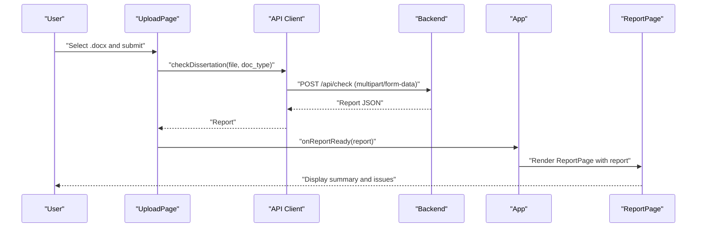

**Diagram sources**
- [UploadPage.tsx:15-27](file://frontend/src/pages/UploadPage.tsx#L15-L27)
- [client.ts:33-44](file://frontend/src/api/client.ts#L33-L44)
- [routes.py:36-68](file://backend/app/api/routes.py#L36-L68)
- [App.tsx:6-13](file://frontend/src/App.tsx#L6-L13)
- [ReportPage.tsx:10-36](file://frontend/src/pages/ReportPage.tsx#L10-L36)

## Detailed Component Analysis

### App Component
- Purpose: Root container managing the current view (Upload vs Report).
- State: Holds a nullable Report object.
- Behavior: Renders UploadPage initially; when a report is present, renders ReportPage and passes an onBack handler to clear the report.

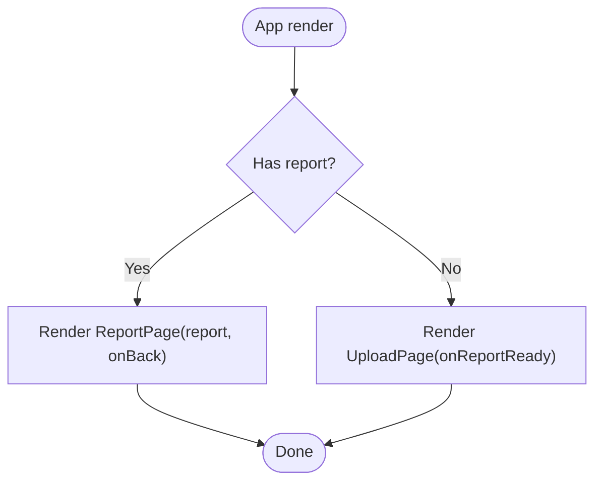

**Diagram sources**
- [App.tsx:6-13](file://frontend/src/App.tsx#L6-L13)

**Section sources**
- [App.tsx:1-16](file://frontend/src/App.tsx#L1-L16)

### UploadPage Component
- Responsibilities:
  - Manage local state for file selection, document type, loading, and error.
  - Integrate FileUpload for drag-and-drop selection.
  - Submit the file to the backend via the API client.
  - Propagate the returned Report to the parent via onReportReady.
- UX: Clear labels, disabled submit when no file or loading, error messaging.

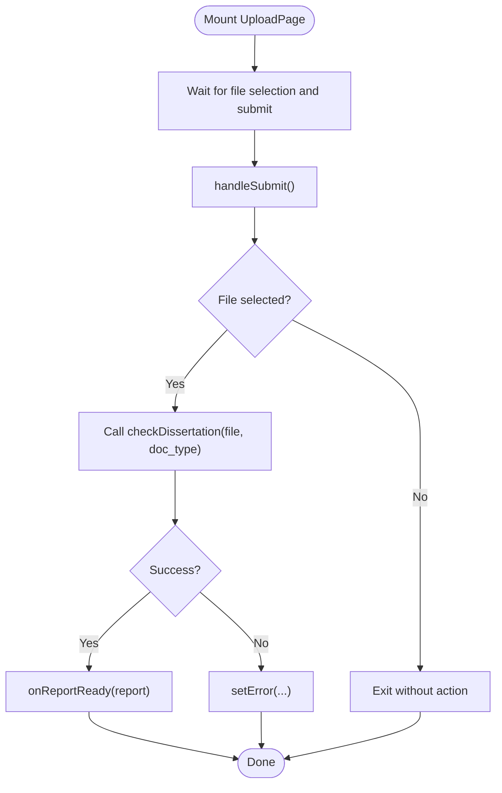

**Diagram sources**
- [UploadPage.tsx:9-27](file://frontend/src/pages/UploadPage.tsx#L9-L27)
- [client.ts:33-44](file://frontend/src/api/client.ts#L33-L44)

**Section sources**
- [UploadPage.tsx:1-62](file://frontend/src/pages/UploadPage.tsx#L1-L62)

### ReportPage Component
- Responsibilities:
  - Provide navigation back to UploadPage.
  - Offer a JSON download of the report.
  - Render ReportSummary and IssueList with the Report data.

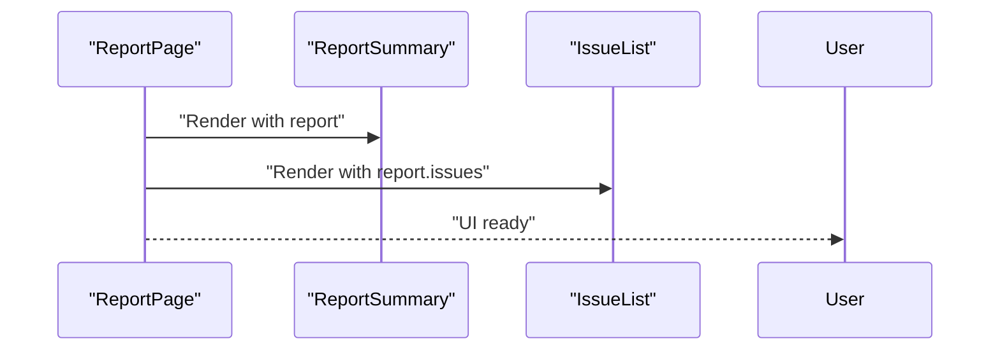

**Diagram sources**
- [ReportPage.tsx:10-36](file://frontend/src/pages/ReportPage.tsx#L10-L36)
- [ReportSummary.tsx:13-44](file://frontend/src/components/ReportSummary.tsx#L13-L44)
- [IssueList.tsx:9-42](file://frontend/src/components/IssueList.tsx#L9-L42)

**Section sources**
- [ReportPage.tsx:1-37](file://frontend/src/pages/ReportPage.tsx#L1-L37)

### FileUpload Component
- Integrates react-dropzone to accept a single .docx file.
- Provides visual feedback during drag-and-drop and shows the selected filename.
- Emits the selected File to the parent via onFileSelect.

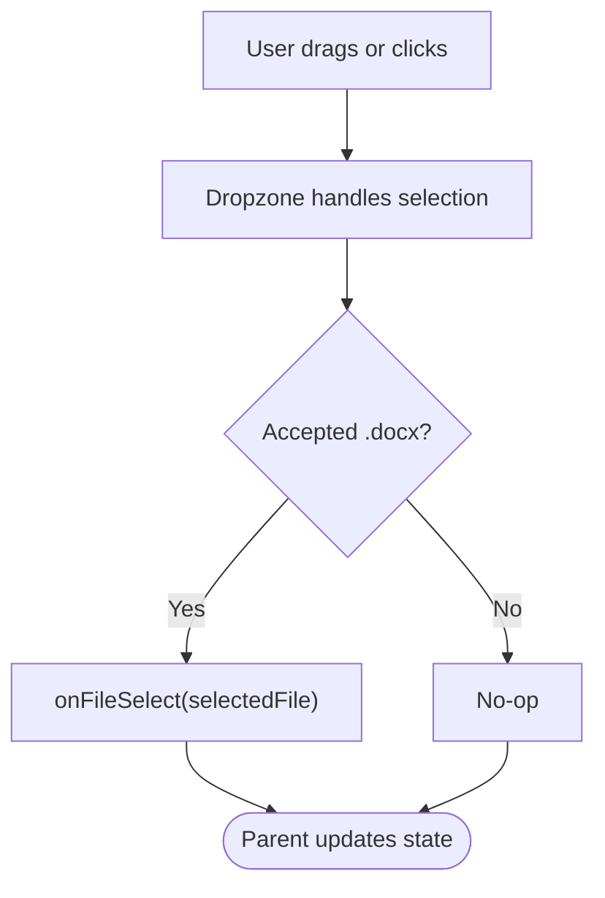

**Diagram sources**
- [FileUpload.tsx:9-23](file://frontend/src/components/FileUpload.tsx#L9-L23)

**Section sources**
- [FileUpload.tsx:1-48](file://frontend/src/components/FileUpload.tsx#L1-L48)

### IssueList Component
- Responsibilities:
  - Maintains local filters for severity and category.
  - Computes unique categories from the issues list.
  - Filters issues based on selected filters and renders IssueCard for each item.
- UX: Real-time filtering with counters indicating visible vs total issues.

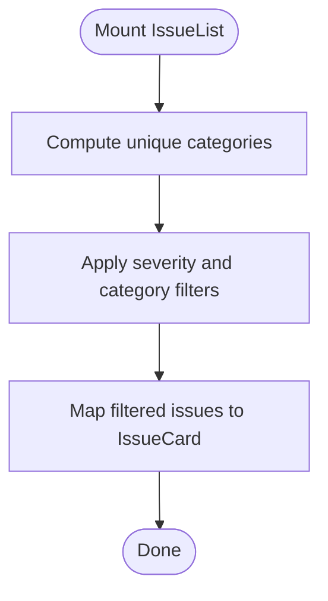

**Diagram sources**
- [IssueList.tsx:9-42](file://frontend/src/components/IssueList.tsx#L9-L42)

**Section sources**
- [IssueList.tsx:1-43](file://frontend/src/components/IssueList.tsx#L1-L43)

### IssueCard Component
- Displays a single issue with:
  - Severity badge (color-coded)
  - Category tag
  - Optional rule reference
  - Message and suggestion
  - Contextual text when available

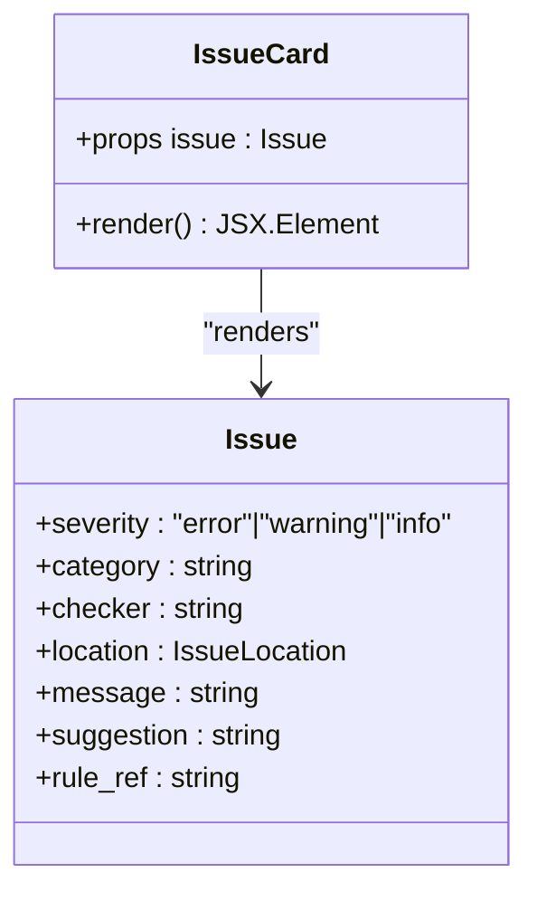

**Diagram sources**
- [IssueCard.tsx:13-52](file://frontend/src/components/IssueCard.tsx#L13-L52)
- [client.ts:5-20](file://frontend/src/api/client.ts#L5-L20)

**Section sources**
- [IssueCard.tsx:1-54](file://frontend/src/components/IssueCard.tsx#L1-L54)

### ReportSummary Component
- Displays:
  - Filename and document type
  - Total issues count
  - Aggregated counts per severity with color-coded cards
  - Issues by category as a list

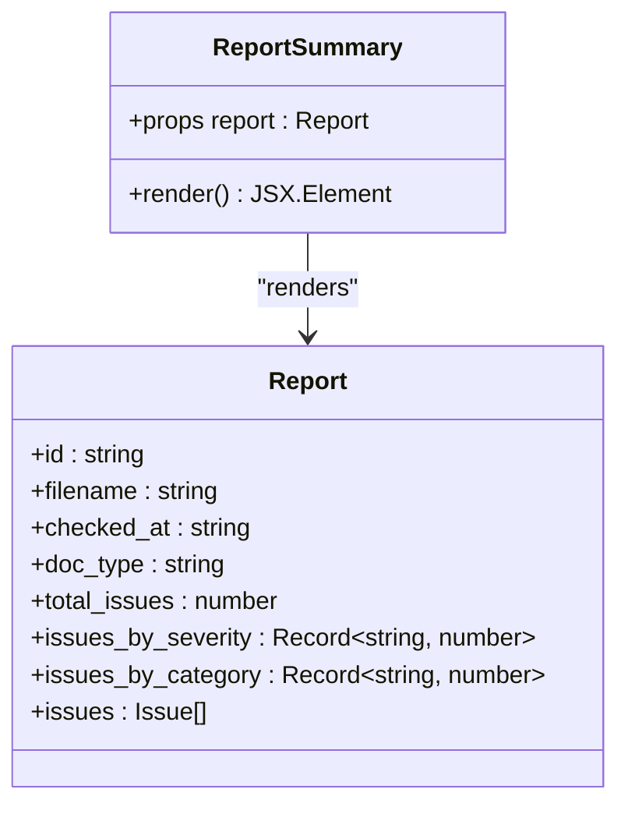

**Diagram sources**
- [ReportSummary.tsx:13-44](file://frontend/src/components/ReportSummary.tsx#L13-L44)
- [client.ts:22-31](file://frontend/src/api/client.ts#L22-L31)

**Section sources**
- [ReportSummary.tsx:1-46](file://frontend/src/components/ReportSummary.tsx#L1-L46)

### API Client
- Defines typed interfaces for IssueLocation, Issue, and Report.
- Exposes:
  - checkDissertation(file, doc_type): posts multipart/form-data to /api/check and returns a Report
  - getReport(id): fetches a previously generated report by ID
- Uses axios with environment-driven base URL (VITE_API_URL).

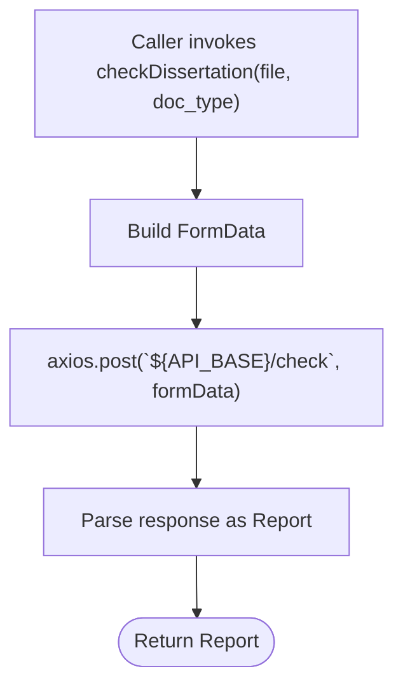

**Diagram sources**
- [client.ts:33-44](file://frontend/src/api/client.ts#L33-L44)
- [routes.py:36-68](file://backend/app/api/routes.py#L36-L68)

**Section sources**
- [client.ts:1-50](file://frontend/src/api/client.ts#L1-L50)

## Dependency Analysis
- Runtime dependencies include React, React DOM, axios, and react-dropzone.
- Build-time dependencies include Vite, @vitejs/plugin-react, TypeScript, ESLint, and related plugins.
- TypeScript configuration references separate app and node configs.

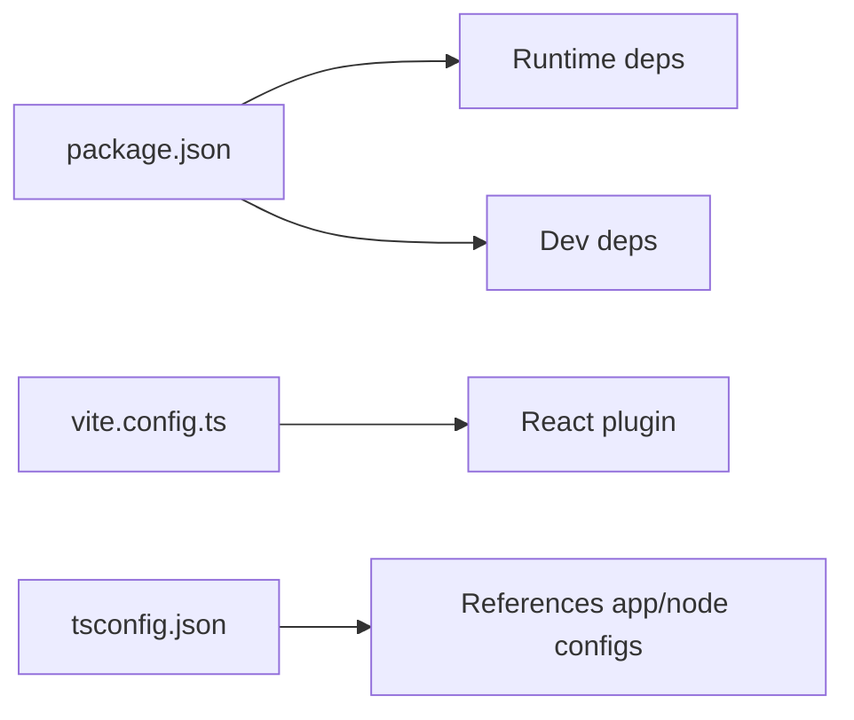

**Diagram sources**
- [package.json:12-30](file://frontend/package.json#L12-L30)
- [vite.config.ts:5-7](file://frontend/vite.config.ts#L5-L7)
- [tsconfig.json:3-6](file://frontend/tsconfig.json#L3-L6)

**Section sources**
- [package.json:1-32](file://frontend/package.json#L1-L32)
- [vite.config.ts:1-8](file://frontend/vite.config.ts#L1-L8)
- [tsconfig.json:1-8](file://frontend/tsconfig.json#L1-L8)

## Performance Considerations
- Rendering cost:
  - IssueList computes unique categories and filters issues on each render. For large lists, consider memoizing derived data (e.g., categories) and using stable keys for filtered arrays.
  - IssueCard renders lightweight DOM; ensure minimal re-renders by passing stable props.
- Network cost:
  - checkDissertation uses multipart/form-data; keep file sizes reasonable and avoid unnecessary retries.
  - Consider adding request cancellation if the user navigates away quickly.
- UI responsiveness:
  - Loading states in UploadPage prevent duplicate submissions and improve perceived performance.
  - Debounce filter inputs in IssueList if users type rapidly.
- Memory:
  - ReportPage downloads a JSON blob; ensure URLs are revoked after download to free memory.

[No sources needed since this section provides general guidance]

## Troubleshooting Guide
- Upload fails with file type error:
  - Backend enforces .docx extension; ensure the selected file has the correct extension.
- Upload fails due to size limits:
  - Backend enforces a maximum upload size; reduce file size or split content.
- API errors:
  - UploadPage catches and displays error messages from the backend response.
- JSON download:
  - ReportPage constructs a Blob and triggers a download; ensure browser allows programmatic downloads.

**Section sources**
- [routes.py:41-50](file://backend/app/api/routes.py#L41-L50)
- [UploadPage.tsx:22-26](file://frontend/src/pages/UploadPage.tsx#L22-L26)
- [ReportPage.tsx:11-19](file://frontend/src/pages/ReportPage.tsx#L11-L19)

## Conclusion
The frontend employs a clean, component-driven architecture with a small amount of local state and a clear data flow to the backend. TypeScript interfaces ensure type safety across the boundary, while the API client encapsulates HTTP concerns. The UI emphasizes clarity and usability with immediate feedback and filtering capabilities.

[No sources needed since this section summarizes without analyzing specific files]

## Appendices

### Backend Schema Alignment
The frontend Report and Issue types align with the backend Pydantic schemas, ensuring consistent serialization and deserialization.

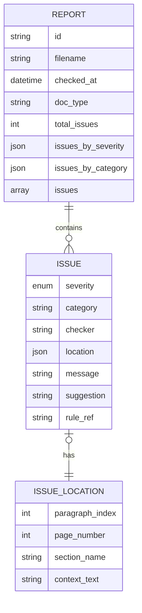

**Diagram sources**
- [client.ts:22-31](file://frontend/src/api/client.ts#L22-L31)
- [client.ts:12-20](file://frontend/src/api/client.ts#L12-L20)
- [client.ts:5-10](file://frontend/src/api/client.ts#L5-L10)
- [schemas.py:25-34](file://backend/app/api/schemas.py#L25-L34)
- [schemas.py:15-23](file://backend/app/api/schemas.py#L15-L23)
- [schemas.py:8-13](file://backend/app/api/schemas.py#L8-L13)