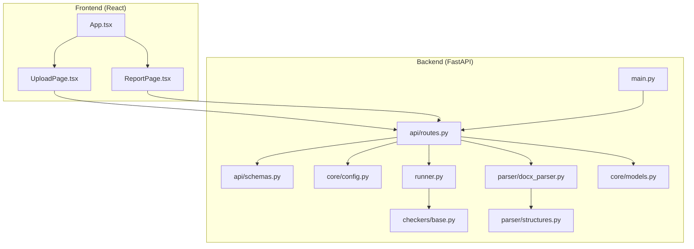
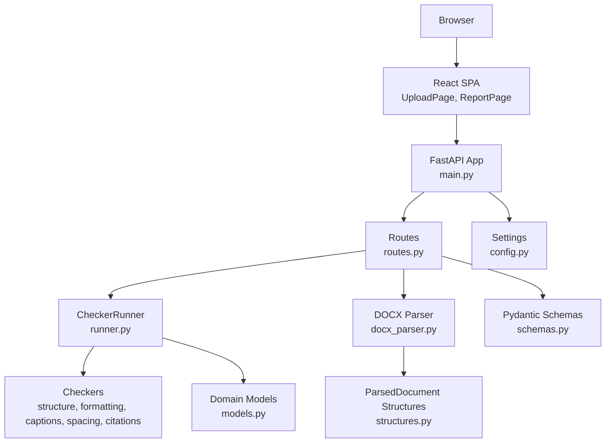
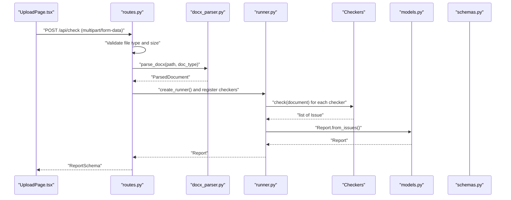
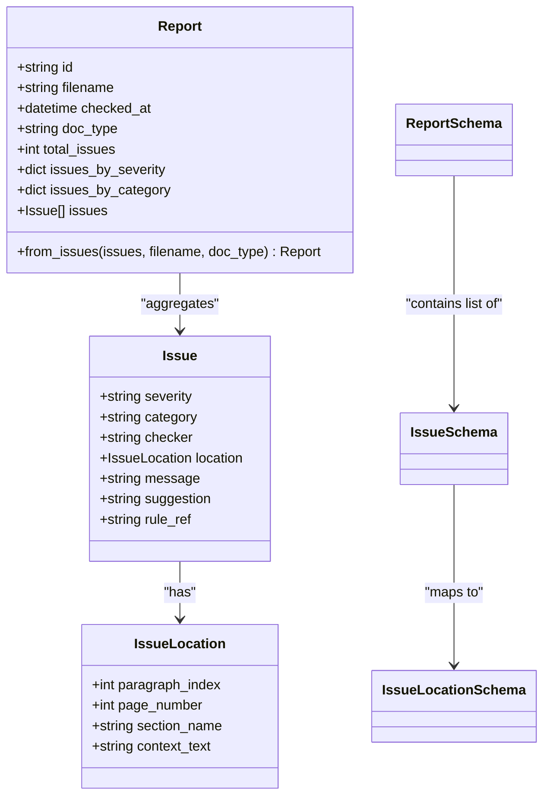
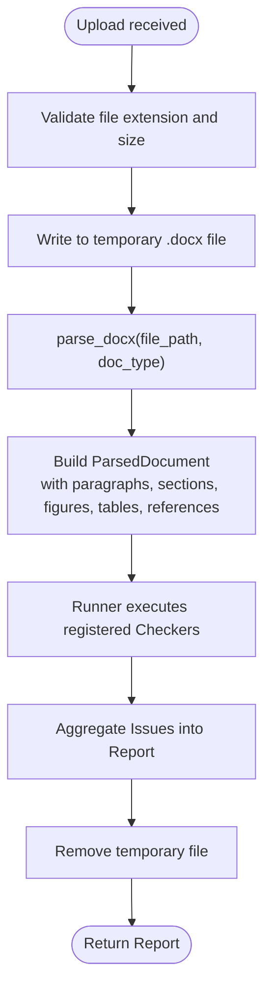
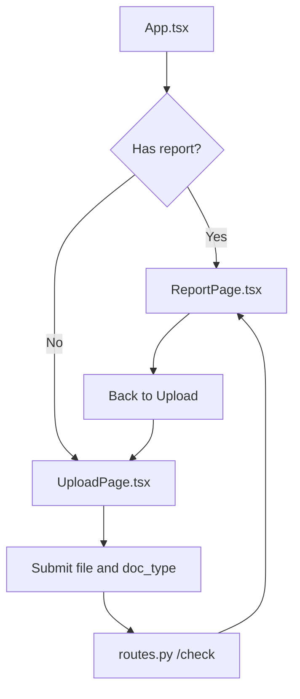
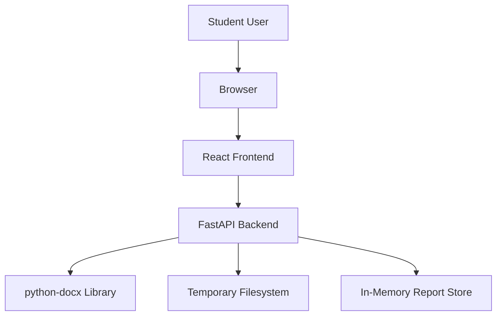

# System Design

<cite>
**Referenced Files in This Document**
- [README.md](file://README.md)
- [backend/pyproject.toml](file://backend/pyproject.toml)
- [frontend/package.json](file://frontend/package.json)
- [backend/app/main.py](file://backend/app/main.py)
- [backend/app/api/routes.py](file://backend/app/api/routes.py)
- [backend/app/api/schemas.py](file://backend/app/api/schemas.py)
- [backend/app/core/config.py](file://backend/app/core/config.py)
- [backend/app/core/models.py](file://backend/app/core/models.py)
- [backend/app/parser/docx_parser.py](file://backend/app/parser/docx_parser.py)
- [backend/app/parser/structures.py](file://backend/app/parser/structures.py)
- [backend/app/runner.py](file://backend/app/runner.py)
- [backend/app/checkers/base.py](file://backend/app/checkers/base.py)
- [frontend/src/App.tsx](file://frontend/src/App.tsx)
- [frontend/src/pages/UploadPage.tsx](file://frontend/src/pages/UploadPage.tsx)
- [frontend/src/pages/ReportPage.tsx](file://frontend/src/pages/ReportPage.tsx)
</cite>

## Table of Contents
1. [Introduction](#introduction)
2. [Project Structure](#project-structure)
3. [Core Components](#core-components)
4. [Architecture Overview](#architecture-overview)
5. [Detailed Component Analysis](#detailed-component-analysis)
6. [Dependency Analysis](#dependency-analysis)
7. [Performance Considerations](#performance-considerations)
8. [Troubleshooting Guide](#troubleshooting-guide)
9. [Conclusion](#conclusion)
10. [Appendices](#appendices)

## Introduction
Dissertation Checker is a web service that validates .docx documents against GOST 7.32-2017 (Kazakhstani university standard). The system consists of:
- A React frontend for uploading documents and displaying compliance reports
- A FastAPI backend that orchestrates document parsing and rule-based checking
- A DOCX processing pipeline using python-docx to extract structured content
- A modular checker framework enabling independent rule sets for structure, formatting, captions, spacing, and citations

The system emphasizes separation of concerns:
- Presentation layer (React pages/components)
- Business logic (FastAPI routes, Runner, individual Checkers)
- Data layer (ParsedDocument structures, Pydantic schemas, domain models)

## Project Structure
The repository is organized into two primary modules:
- backend: FastAPI application, API routes, checkers, parser, core models, and configuration
- frontend: React SPA with pages, components, and an API client

**Diagram sources**
- [backend/app/main.py:1-20](file://backend/app/main.py#L1-L20)
- [backend/app/api/routes.py:1-75](file://backend/app/api/routes.py#L1-L75)
- [backend/app/api/schemas.py:1-38](file://backend/app/api/schemas.py#L1-L38)
- [backend/app/core/config.py:1-17](file://backend/app/core/config.py#L1-L17)
- [backend/app/runner.py:1-25](file://backend/app/runner.py#L1-L25)
- [backend/app/checkers/base.py:1-17](file://backend/app/checkers/base.py#L1-L17)
- [backend/app/parser/docx_parser.py:1-8](file://backend/app/parser/docx_parser.py#L1-L8)
- [backend/app/parser/structures.py:1-89](file://backend/app/parser/structures.py#L1-L89)
- [backend/app/core/models.py:1-58](file://backend/app/core/models.py#L1-L58)
- [frontend/src/App.tsx:1-16](file://frontend/src/App.tsx#L1-L16)
- [frontend/src/pages/UploadPage.tsx:1-62](file://frontend/src/pages/UploadPage.tsx#L1-L62)
- [frontend/src/pages/ReportPage.tsx:1-37](file://frontend/src/pages/ReportPage.tsx#L1-L37)

**Section sources**
- [README.md:160-195](file://README.md#L160-L195)
- [backend/pyproject.toml:1-29](file://backend/pyproject.toml#L1-L29)
- [frontend/package.json:1-32](file://frontend/package.json#L1-L32)

## Core Components
- FastAPI Application Entry
  - Creates the ASGI app, registers CORS middleware, and mounts the API router under /api.
  - Exposes health and document checking endpoints.
  - References: [backend/app/main.py:1-20](file://backend/app/main.py#L1-L20)

- API Routes
  - /health: Returns a simple health status.
  - /check: Accepts multipart form data (file and doc_type), validates file type and size, writes to a temporary file, parses the DOCX, runs all registered checkers via the Runner, stores the report, and returns it.
  - /reports/{report_id}: Retrieves a previously generated report by ID.
  - References: [backend/app/api/routes.py:1-75](file://backend/app/api/routes.py#L1-L75)

- Pydantic Schemas
  - Define request/response contracts for issues, reports, and health responses.
  - References: [backend/app/api/schemas.py:1-38](file://backend/app/api/schemas.py#L1-L38)

- Configuration
  - Centralized settings for app name, CORS origins, max upload size, and temp directory.
  - References: [backend/app/core/config.py:1-17](file://backend/app/core/config.py#L1-L17)

- Domain Models
  - Issue, IssueLocation, and Report dataclasses with helpers to aggregate counts by severity/category.
  - References: [backend/app/core/models.py:1-58](file://backend/app/core/models.py#L1-L58)

- Parser and Structures
  - ParsedDocument and related structures (paragraphs, sections, figures, tables, references, metadata, properties) define the internal representation of a parsed DOCX.
  - References: [backend/app/parser/structures.py:1-89](file://backend/app/parser/structures.py#L1-L89)

- DOCX Parser
  - Adapter function returning a ParsedDocument given a file path and document type.
  - References: [backend/app/parser/docx_parser.py:1-8](file://backend/app/parser/docx_parser.py#L1-L8)

- Checker Framework
  - BaseChecker defines the contract for implementing checkers.
  - References: [backend/app/checkers/base.py:1-17](file://backend/app/checkers/base.py#L1-L17)

- Runner
  - Orchestrates checker registration and execution, aggregates issues, and produces a Report.
  - References: [backend/app/runner.py:1-25](file://backend/app/runner.py#L1-L25)

- Frontend Pages and Components
  - UploadPage handles file selection, document type selection, submission, and error handling.
  - ReportPage displays summary and issue lists, and supports JSON download.
  - References: [frontend/src/pages/UploadPage.tsx:1-62](file://frontend/src/pages/UploadPage.tsx#L1-L62), [frontend/src/pages/ReportPage.tsx:1-37](file://frontend/src/pages/ReportPage.tsx#L1-L37)

**Section sources**
- [backend/app/main.py:1-20](file://backend/app/main.py#L1-L20)
- [backend/app/api/routes.py:1-75](file://backend/app/api/routes.py#L1-L75)
- [backend/app/api/schemas.py:1-38](file://backend/app/api/schemas.py#L1-L38)
- [backend/app/core/config.py:1-17](file://backend/app/core/config.py#L1-L17)
- [backend/app/core/models.py:1-58](file://backend/app/core/models.py#L1-L58)
- [backend/app/parser/docx_parser.py:1-8](file://backend/app/parser/docx_parser.py#L1-L8)
- [backend/app/parser/structures.py:1-89](file://backend/app/parser/structures.py#L1-L89)
- [backend/app/runner.py:1-25](file://backend/app/runner.py#L1-L25)
- [backend/app/checkers/base.py:1-17](file://backend/app/checkers/base.py#L1-L17)
- [frontend/src/pages/UploadPage.tsx:1-62](file://frontend/src/pages/UploadPage.tsx#L1-L62)
- [frontend/src/pages/ReportPage.tsx:1-37](file://frontend/src/pages/ReportPage.tsx#L1-L37)

## Architecture Overview
The system follows a clean, layered architecture:
- Presentation: React SPA with pages and components
- API: FastAPI endpoints handling uploads, orchestration, and retrieval
- Processing: DOCX parsing and modular checker plugins
- Data Contracts: Pydantic models and domain dataclasses

**Diagram sources**
- [backend/app/main.py:1-20](file://backend/app/main.py#L1-L20)
- [backend/app/api/routes.py:1-75](file://backend/app/api/routes.py#L1-L75)
- [backend/app/runner.py:1-25](file://backend/app/runner.py#L1-L25)
- [backend/app/checkers/base.py:1-17](file://backend/app/checkers/base.py#L1-L17)
- [backend/app/parser/docx_parser.py:1-8](file://backend/app/parser/docx_parser.py#L1-L8)
- [backend/app/parser/structures.py:1-89](file://backend/app/parser/structures.py#L1-L89)
- [backend/app/core/models.py:1-58](file://backend/app/core/models.py#L1-L58)
- [backend/app/api/schemas.py:1-38](file://backend/app/api/schemas.py#L1-L38)
- [backend/app/core/config.py:1-17](file://backend/app/core/config.py#L1-L17)
- [frontend/src/pages/UploadPage.tsx:1-62](file://frontend/src/pages/UploadPage.tsx#L1-L62)
- [frontend/src/pages/ReportPage.tsx:1-37](file://frontend/src/pages/ReportPage.tsx#L1-L37)

## Detailed Component Analysis

### Backend Orchestration Flow
End-to-end flow from upload to report generation.

**Diagram sources**
- [frontend/src/pages/UploadPage.tsx:15-27](file://frontend/src/pages/UploadPage.tsx#L15-L27)
- [backend/app/api/routes.py:36-68](file://backend/app/api/routes.py#L36-L68)
- [backend/app/parser/docx_parser.py:5-7](file://backend/app/parser/docx_parser.py#L5-L7)
- [backend/app/runner.py:15-24](file://backend/app/runner.py#L15-L24)
- [backend/app/checkers/base.py:13-16](file://backend/app/checkers/base.py#L13-L16)
- [backend/app/core/models.py:39-57](file://backend/app/core/models.py#L39-L57)
- [backend/app/api/schemas.py:25-34](file://backend/app/api/schemas.py#L25-L34)

**Section sources**
- [backend/app/api/routes.py:36-68](file://backend/app/api/routes.py#L36-L68)
- [backend/app/runner.py:15-24](file://backend/app/runner.py#L15-L24)
- [backend/app/core/models.py:39-57](file://backend/app/core/models.py#L39-L57)

### Data Model and Schema Definitions

**Diagram sources**
- [backend/app/core/models.py:9-58](file://backend/app/core/models.py#L9-L58)
- [backend/app/api/schemas.py:8-37](file://backend/app/api/schemas.py#L8-L37)

**Section sources**
- [backend/app/core/models.py:9-58](file://backend/app/core/models.py#L9-L58)
- [backend/app/api/schemas.py:8-37](file://backend/app/api/schemas.py#L8-L37)

### DOCX Parsing Pipeline

**Diagram sources**
- [backend/app/api/routes.py:41-67](file://backend/app/api/routes.py#L41-L67)
- [backend/app/parser/docx_parser.py:5-7](file://backend/app/parser/docx_parser.py#L5-L7)
- [backend/app/parser/structures.py:77-89](file://backend/app/parser/structures.py#L77-L89)
- [backend/app/runner.py:15-24](file://backend/app/runner.py#L15-L24)

**Section sources**
- [backend/app/api/routes.py:41-67](file://backend/app/api/routes.py#L41-L67)
- [backend/app/parser/docx_parser.py:5-7](file://backend/app/parser/docx_parser.py#L5-L7)
- [backend/app/parser/structures.py:77-89](file://backend/app/parser/structures.py#L77-L89)
- [backend/app/runner.py:15-24](file://backend/app/runner.py#L15-L24)

### Frontend Navigation and State

**Diagram sources**
- [frontend/src/App.tsx:6-13](file://frontend/src/App.tsx#L6-L13)
- [frontend/src/pages/UploadPage.tsx:15-27](file://frontend/src/pages/UploadPage.tsx#L15-L27)
- [frontend/src/pages/ReportPage.tsx:10-35](file://frontend/src/pages/ReportPage.tsx#L10-L35)
- [backend/app/api/routes.py:36-68](file://backend/app/api/routes.py#L36-L68)

**Section sources**
- [frontend/src/App.tsx:6-13](file://frontend/src/App.tsx#L6-L13)
- [frontend/src/pages/UploadPage.tsx:15-27](file://frontend/src/pages/UploadPage.tsx#L15-L27)
- [frontend/src/pages/ReportPage.tsx:10-35](file://frontend/src/pages/ReportPage.tsx#L10-L35)

## Dependency Analysis
Technology stack and module-level dependencies:
- Backend
  - FastAPI for routing and ASGI server
  - python-docx for DOCX parsing
  - Pydantic for data validation and serialization
  - pydantic-settings for configuration management
  - Optional dev dependencies for testing and linting
  - References: [backend/pyproject.toml:1-29](file://backend/pyproject.toml#L1-L29)

- Frontend
  - React 18 with Vite and TypeScript
  - axios for HTTP requests
  - react-dropzone for drag-and-drop file handling
  - References: [frontend/package.json:1-32](file://frontend/package.json#L1-L32)

- Internal Dependencies
  - Routes depend on Runner, Parser, and Schemas
  - Runner depends on BaseChecker and models
  - Parser depends on structures
  - Frontend pages depend on the API client and shared types
  - References: [backend/app/api/routes.py:1-17](file://backend/app/api/routes.py#L1-L17), [backend/app/runner.py:1-14](file://backend/app/runner.py#L1-L14), [backend/app/parser/docx_parser.py:1-8](file://backend/app/parser/docx_parser.py#L1-L8), [backend/app/parser/structures.py:1-89](file://backend/app/parser/structures.py#L1-L89), [frontend/src/pages/UploadPage.tsx:1-7](file://frontend/src/pages/UploadPage.tsx#L1-L7)

**Section sources**
- [backend/pyproject.toml:1-29](file://backend/pyproject.toml#L1-L29)
- [frontend/package.json:1-32](file://frontend/package.json#L1-L32)
- [backend/app/api/routes.py:1-17](file://backend/app/api/routes.py#L1-L17)
- [backend/app/runner.py:1-14](file://backend/app/runner.py#L1-L14)
- [backend/app/parser/docx_parser.py:1-8](file://backend/app/parser/docx_parser.py#L1-L8)
- [backend/app/parser/structures.py:1-89](file://backend/app/parser/structures.py#L1-L89)
- [frontend/src/pages/UploadPage.tsx:1-7](file://frontend/src/pages/UploadPage.tsx#L1-L7)

## Performance Considerations
- Upload limits
  - Maximum upload size is configurable and enforced at the route handler.
  - References: [backend/app/core/config.py:8-8](file://backend/app/core/config.py#L8-L8), [backend/app/api/routes.py:45-50](file://backend/app/api/routes.py#L45-L50)

- Temporary file handling
  - DOCX content is written to a temporary file during processing and removed afterward.
  - References: [backend/app/api/routes.py:52-67](file://backend/app/api/routes.py#L52-L67)

- In-memory report storage
  - Reports are stored in memory keyed by ID for retrieval.
  - References: [backend/app/api/routes.py:18-18](file://backend/app/api/routes.py#L18-L18), [backend/app/api/routes.py:70-74](file://backend/app/api/routes.py#L70-L74)

- Scalability notes
  - Current in-memory storage is suitable for single-instance deployments.
  - For horizontal scaling, replace in-memory storage with persistent storage (e.g., Redis or database) and add load balancing.
  - Consider asynchronous processing for long-running checks to improve responsiveness.

[No sources needed since this section provides general guidance]

## Troubleshooting Guide
- Common errors and resolutions
  - Unsupported file type: Ensure the uploaded file has a .docx extension.
    - References: [backend/app/api/routes.py:41-42](file://backend/app/api/routes.py#L41-L42)

  - File too large: Reduce file size or adjust max_upload_size_mb.
    - References: [backend/app/core/config.py:8-8](file://backend/app/core/config.py#L8-L8), [backend/app/api/routes.py:45-50](file://backend/app/api/routes.py#L45-L50)

  - Parsing errors: Verify DOCX integrity and python-docx compatibility.
    - References: [backend/app/api/routes.py:63-64](file://backend/app/api/routes.py#L63-L64), [backend/app/parser/docx_parser.py:5-7](file://backend/app/parser/docx_parser.py#L5-L7)

  - Report not found: Confirm report_id correctness and that the report exists in storage.
    - References: [backend/app/api/routes.py:72-73](file://backend/app/api/routes.py#L72-L73)

- CORS issues
  - Ensure frontend origin matches configured CORS origins.
  - References: [backend/app/core/config.py:9-9](file://backend/app/core/config.py#L9-L9), [backend/app/main.py:11-17](file://backend/app/main.py#L11-L17)

**Section sources**
- [backend/app/api/routes.py:41-74](file://backend/app/api/routes.py#L41-L74)
- [backend/app/core/config.py:8-9](file://backend/app/core/config.py#L8-L9)
- [backend/app/main.py:11-17](file://backend/app/main.py#L11-L17)
- [backend/app/parser/docx_parser.py:5-7](file://backend/app/parser/docx_parser.py#L5-L7)

## Conclusion
Dissertation Checker implements a clear separation of concerns across presentation, business logic, and data layers. The React frontend provides a simple user experience, while the FastAPI backend orchestrates a modular checker system and integrates with python-docx for structured parsing. The current design is production-ready for small-scale use with straightforward persistence and concurrency strategies. For larger deployments, consider persistent report storage, asynchronous task queues, and container orchestration.

[No sources needed since this section summarizes without analyzing specific files]

## Appendices

### System Context Diagram
External integrations and boundaries:
- python-docx: DOCX parsing library used internally by the backend
- Browser/React SPA: Student-facing UI
- Storage: Local filesystem for temporary files; in-memory storage for reports (replaceable)

[No sources needed since this diagram shows conceptual workflow, not actual code structure]

### Technology Choices Justification
- React for frontend
  - Component-based architecture, strong type safety with TypeScript, and ecosystem support align well with rapid development and maintainability.
  - References: [frontend/package.json:12-30](file://frontend/package.json#L12-L30)

- FastAPI for backend
  - Automatic OpenAPI schema generation, excellent async support, robust validation via Pydantic, and developer ergonomics.
  - References: [backend/pyproject.toml:5-12](file://backend/pyproject.toml#L5-L12), [backend/app/main.py:1-20](file://backend/app/main.py#L1-L20)

- DOCX processing
  - python-docx provides reliable parsing capabilities for extracting structured content from .docx files.
  - References: [backend/pyproject.toml:9-9](file://backend/pyproject.toml#L9-L9), [backend/app/parser/docx_parser.py:5-7](file://backend/app/parser/docx_parser.py#L5-L7)