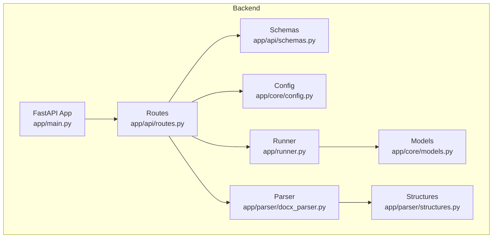
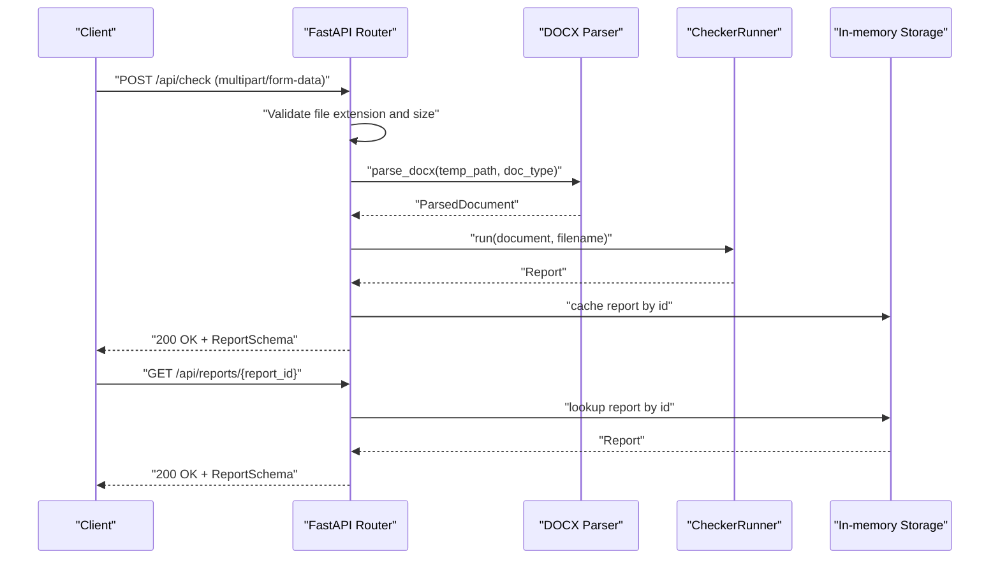
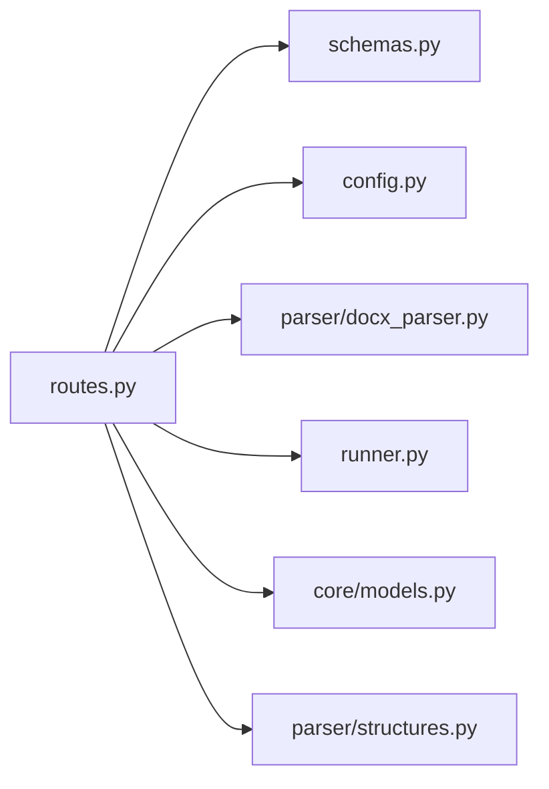

# API Endpoints

<cite>
**Referenced Files in This Document**
- [backend/app/main.py](file://backend/app/main.py)
- [backend/app/api/routes.py](file://backend/app/api/routes.py)
- [backend/app/api/schemas.py](file://backend/app/api/schemas.py)
- [backend/app/core/config.py](file://backend/app/core/config.py)
- [backend/app/runner.py](file://backend/app/runner.py)
- [backend/app/parser/docx_parser.py](file://backend/app/parser/docx_parser.py)
- [backend/app/parser/structures.py](file://backend/app/parser/structures.py)
- [backend/app/core/models.py](file://backend/app/core/models.py)
- [frontend/src/api/client.ts](file://frontend/src/api/client.ts)
- [backend/pyproject.toml](file://backend/pyproject.toml)
</cite>

## Table of Contents
1. [Introduction](#introduction)
2. [Project Structure](#project-structure)
3. [Core Components](#core-components)
4. [Architecture Overview](#architecture-overview)
5. [Detailed Endpoint Documentation](#detailed-endpoint-documentation)
6. [Dependency Analysis](#dependency-analysis)
7. [Performance Considerations](#performance-considerations)
8. [Troubleshooting Guide](#troubleshooting-guide)
9. [Conclusion](#conclusion)

## Introduction
This document provides comprehensive API endpoint documentation for the Dissertation Checker backend. It covers the three primary endpoints:
- POST /api/check: Validates a .docx document and returns a structured report
- GET /api/reports/{report_id}: Retrieves a previously generated validation report
- GET /api/health: Returns system health status

Each endpoint's HTTP method, URL pattern, request parameters, response schema, and expected status codes are documented. Parameter validation rules, file size limits, error scenarios, and the temporary file handling/report storage mechanism are explained. Practical client integration examples are included for both manual testing and programmatic usage.

## Project Structure
The backend is a FastAPI application that exposes REST endpoints under the /api prefix. The routing module defines the endpoints, while schemas define the response models. The runner orchestrates multiple checkers against parsed document structures. Configuration controls upload size limits and CORS settings.

**Diagram sources**
- [backend/app/main.py:1-20](file://backend/app/main.py#L1-L20)
- [backend/app/api/routes.py:1-75](file://backend/app/api/routes.py#L1-L75)
- [backend/app/api/schemas.py:1-38](file://backend/app/api/schemas.py#L1-L38)
- [backend/app/core/config.py:1-17](file://backend/app/core/config.py#L1-L17)
- [backend/app/runner.py:1-25](file://backend/app/runner.py#L1-L25)
- [backend/app/parser/docx_parser.py:1-8](file://backend/app/parser/docx_parser.py#L1-L8)
- [backend/app/parser/structures.py:1-89](file://backend/app/parser/structures.py#L1-L89)
- [backend/app/core/models.py:1-58](file://backend/app/core/models.py#L1-L58)

**Section sources**
- [backend/app/main.py:1-20](file://backend/app/main.py#L1-L20)
- [backend/app/api/routes.py:1-75](file://backend/app/api/routes.py#L1-L75)
- [backend/app/api/schemas.py:1-38](file://backend/app/api/schemas.py#L1-L38)
- [backend/app/core/config.py:1-17](file://backend/app/core/config.py#L1-L17)
- [backend/app/runner.py:1-25](file://backend/app/runner.py#L1-L25)
- [backend/app/parser/docx_parser.py:1-8](file://backend/app/parser/docx_parser.py#L1-L8)
- [backend/app/parser/structures.py:1-89](file://backend/app/parser/structures.py#L1-L89)
- [backend/app/core/models.py:1-58](file://backend/app/core/models.py#L1-L58)

## Core Components
- FastAPI Application: Initializes CORS middleware and mounts the router under /api.
- Routes Module: Implements the three endpoints, handles file uploads, validates inputs, parses documents, runs checkers, and manages temporary files and in-memory report storage.
- Schemas: Define Pydantic models for responses (ReportSchema, HealthResponse) and nested structures (IssueLocationSchema, IssueSchema).
- Runner: Orchestrates multiple checkers and aggregates results into a Report.
- Parser: Converts uploaded .docx files into a structured ParsedDocument.
- Models: Domain dataclasses for Issues and Reports, including aggregation helpers.
- Configuration: Controls upload size limits, CORS origins, and temp directory.

**Section sources**
- [backend/app/main.py:1-20](file://backend/app/main.py#L1-L20)
- [backend/app/api/routes.py:1-75](file://backend/app/api/routes.py#L1-L75)
- [backend/app/api/schemas.py:1-38](file://backend/app/api/schemas.py#L1-L38)
- [backend/app/runner.py:1-25](file://backend/app/runner.py#L1-L25)
- [backend/app/parser/docx_parser.py:1-8](file://backend/app/parser/docx_parser.py#L1-L8)
- [backend/app/core/models.py:1-58](file://backend/app/core/models.py#L1-L58)
- [backend/app/core/config.py:1-17](file://backend/app/core/config.py#L1-L17)

## Architecture Overview
The system follows a layered architecture:
- Presentation Layer: FastAPI routes expose endpoints
- Business Logic Layer: Runner coordinates checkers
- Data Access Layer: Parser converts .docx to structured data
- Persistence Layer: Reports are stored in memory during runtime

**Diagram sources**
- [backend/app/api/routes.py:36-75](file://backend/app/api/routes.py#L36-L75)
- [backend/app/parser/docx_parser.py:5-8](file://backend/app/parser/docx_parser.py#L5-L8)
- [backend/app/runner.py:15-25](file://backend/app/runner.py#L15-L25)
- [backend/app/api/schemas.py:25-38](file://backend/app/api/schemas.py#L25-L38)

## Detailed Endpoint Documentation

### POST /api/check
Purpose: Validates a .docx document and returns a structured report containing issues detected by registered checkers.

- Method: POST
- URL: /api/check
- Content-Type: multipart/form-data
- Authentication: Not required by the implementation

Request Parameters
- file: UploadFile (required)
  - Must be a .docx file
  - Size limit enforced by configuration
- doc_type: string (optional, default: "thesis_science")
  - Allowed values: "thesis_humanities", "thesis_science", "project"

Validation Rules
- File extension: Only .docx files are accepted
- File size: Enforced via settings.max_upload_size_mb
- doc_type: Must be one of the allowed values (validated by downstream logic)

Response Schema (Pydantic model)
- ReportSchema fields:
  - id: string
  - filename: string
  - checked_at: datetime (UTC)
  - doc_type: string
  - total_issues: integer
  - issues_by_severity: dict[string, integer] (keys: "error", "warning", "info")
  - issues_by_category: dict[string, integer]
  - issues: list[IssueSchema]

IssueSchema fields:
- severity: "error" | "warning" | "info"
- category: string
- checker: string
- location: IssueLocationSchema
- message: string
- suggestion: string
- rule_ref: string (default: empty)

IssueLocationSchema fields:
- paragraph_index: integer | null
- page_number: integer | null
- section_name: string | null
- context_text: string (default: empty)

Expected Status Codes
- 200 OK: Successful validation and report generation
- 400 Bad Request: Invalid file type or exceeding size limit
- 422 Unprocessable Entity: Error parsing document or internal processing failure

Error Scenarios
- Non-.docx file uploaded
- File larger than configured maximum
- Parser or checker exceptions during processing
- Unexpected internal errors

Temporary File Handling
- The uploaded file is written to a temporary .docx file
- The parser reads from this temporary path
- On completion, the temporary file is deleted regardless of success or failure

Report Storage
- Reports are cached in memory keyed by report id
- Suitable for short-term caching during development/testing

Example Request (curl)
- curl -X POST "http://localhost:8000/api/check" -F "file=@/path/to/document.docx" -F "doc_type=thesis_science"

Example Response (JSON)
{
  "id": "string",
  "filename": "string",
  "checked_at": "2024-01-01T00:00:00Z",
  "doc_type": "thesis_science",
  "total_issues": 0,
  "issues_by_severity": {"error": 0, "warning": 0, "info": 0},
  "issues_by_category": {},
  "issues": []
}

Client Integration Notes
- Use multipart/form-data with keys "file" and "doc_type"
- Handle 400 and 422 responses appropriately
- On success, persist the returned report id for later retrieval

**Section sources**
- [backend/app/api/routes.py:36-68](file://backend/app/api/routes.py#L36-L68)
- [backend/app/api/schemas.py:8-38](file://backend/app/api/schemas.py#L8-L38)
- [backend/app/core/config.py:6-11](file://backend/app/core/config.py#L6-L11)
- [backend/app/parser/docx_parser.py:5-8](file://backend/app/parser/docx_parser.py#L5-L8)
- [backend/app/runner.py:15-25](file://backend/app/runner.py#L15-L25)

### GET /api/reports/{report_id}
Purpose: Retrieves a previously generated validation report by its id.

- Method: GET
- URL: /api/reports/{report_id}
- Path Parameter: report_id (string, required)
- Authentication: Not required by the implementation

Response Schema (Pydantic model)
- Same as ReportSchema described above

Expected Status Codes
- 200 OK: Report found and returned
- 404 Not Found: Report id does not exist in cache

Error Scenarios
- report_id not present in in-memory cache

Example Request (curl)
- curl "http://localhost:8000/api/reports/<report_id>"

Example Response (JSON)
{
  "id": "string",
  "filename": "string",
  "checked_at": "2024-01-01T00:00:00Z",
  "doc_type": "thesis_science",
  "total_issues": 0,
  "issues_by_severity": {"error": 0, "warning": 0, "info": 0},
  "issues_by_category": {},
  "issues": []
}

Client Integration Notes
- Ensure to call POST /api/check first to obtain a valid report id
- Handle 404 gracefully and prompt the user to re-run validation

**Section sources**
- [backend/app/api/routes.py:70-75](file://backend/app/api/routes.py#L70-L75)
- [backend/app/api/schemas.py:25-38](file://backend/app/api/schemas.py#L25-L38)

### GET /api/health
Purpose: Returns system health status.

- Method: GET
- URL: /api/health
- Authentication: Not required by the implementation

Response Schema (Pydantic model)
- HealthResponse fields:
  - status: string (default: "ok")

Expected Status Codes
- 200 OK: Service is healthy

Example Request (curl)
- curl "http://localhost:8000/api/health"

Example Response (JSON)
{
  "status": "ok"
}

Client Integration Notes
- Use this endpoint for readiness/liveness probes
- No special error handling required for this endpoint

**Section sources**
- [backend/app/api/routes.py:31-34](file://backend/app/api/routes.py#L31-L34)
- [backend/app/api/schemas.py:36-38](file://backend/app/api/schemas.py#L36-L38)

## Dependency Analysis
The routes module depends on:
- Schemas for request/response models
- Config for upload size limits and CORS
- Parser for converting .docx to structured data
- Runner for orchestrating checkers and producing reports
- In-memory dictionary for report caching

**Diagram sources**
- [backend/app/api/routes.py:1-17](file://backend/app/api/routes.py#L1-L17)
- [backend/app/api/schemas.py:1-38](file://backend/app/api/schemas.py#L1-L38)
- [backend/app/core/config.py:1-17](file://backend/app/core/config.py#L1-L17)
- [backend/app/runner.py:1-25](file://backend/app/runner.py#L1-L25)
- [backend/app/parser/docx_parser.py:1-8](file://backend/app/parser/docx_parser.py#L1-L8)
- [backend/app/parser/structures.py:1-89](file://backend/app/parser/structures.py#L1-L89)
- [backend/app/core/models.py:1-58](file://backend/app/core/models.py#L1-L58)

**Section sources**
- [backend/app/api/routes.py:1-17](file://backend/app/api/routes.py#L1-L17)
- [backend/app/api/schemas.py:1-38](file://backend/app/api/schemas.py#L1-L38)
- [backend/app/core/config.py:1-17](file://backend/app/core/config.py#L1-L17)
- [backend/app/runner.py:1-25](file://backend/app/runner.py#L1-L25)
- [backend/app/parser/docx_parser.py:1-8](file://backend/app/parser/docx_parser.py#L1-L8)
- [backend/app/parser/structures.py:1-89](file://backend/app/parser/structures.py#L1-L89)
- [backend/app/core/models.py:1-58](file://backend/app/core/models.py#L1-L58)

## Performance Considerations
- File size limits: Controlled by settings.max_upload_size_mb to prevent excessive memory usage and slow processing
- Temporary file cleanup: Ensures no disk leaks by deleting the temporary .docx file after parsing
- In-memory storage: Suitable for development/testing; consider persistent storage for production deployments
- Parallelism: Current implementation runs checkers sequentially; consider concurrency for large documents or many checkers

[No sources needed since this section provides general guidance]

## Troubleshooting Guide
Common Issues and Resolutions
- 400 Bad Request
  - Cause: File is not a .docx or exceeds size limit
  - Resolution: Verify file extension and reduce file size
- 404 Not Found
  - Cause: report_id not found in cache
  - Resolution: Re-run validation to obtain a new report id
- 422 Unprocessable Entity
  - Cause: Error parsing document or internal processing failure
  - Resolution: Inspect server logs and retry with a valid .docx file

Error Handling Recommendations
- Always check status codes before parsing JSON
- Implement retries for transient failures
- Log request ids and timestamps for debugging

**Section sources**
- [backend/app/api/routes.py:41-50](file://backend/app/api/routes.py#L41-L50)
- [backend/app/api/routes.py:72-74](file://backend/app/api/routes.py#L72-L74)
- [backend/app/api/routes.py:63-67](file://backend/app/api/routes.py#L63-L67)

## Conclusion
The Dissertation Checker backend provides three essential endpoints for document validation and reporting. The POST /api/check endpoint accepts .docx files, enforces size limits, and returns a structured report. The GET /api/reports/{report_id} endpoint retrieves cached reports, while GET /api/health confirms service availability. The implementation uses FastAPI, Pydantic models, and a simple in-memory cache, making it straightforward to integrate and extend.