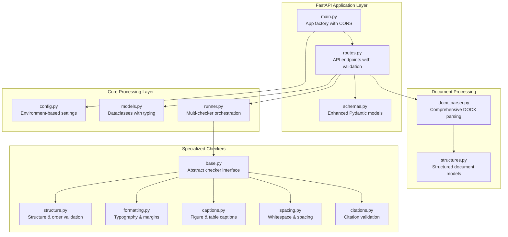
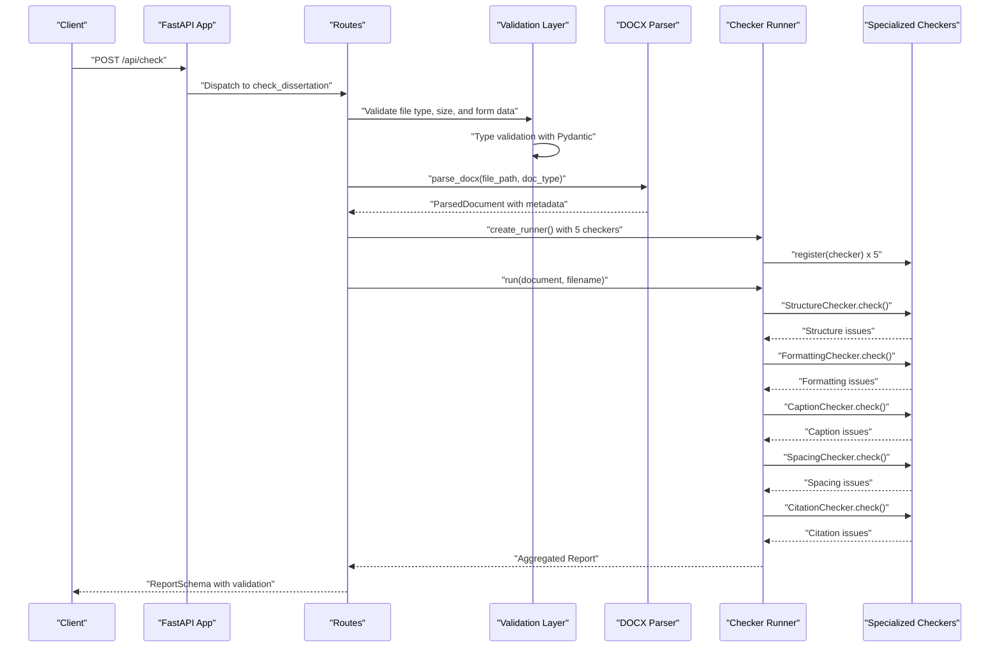
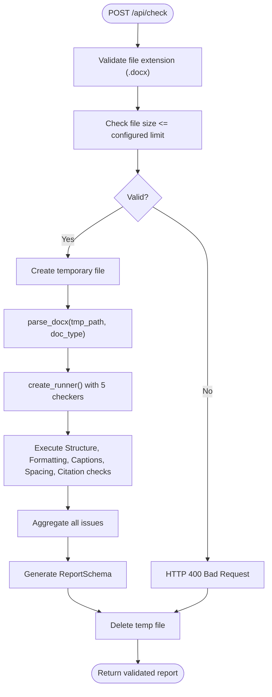
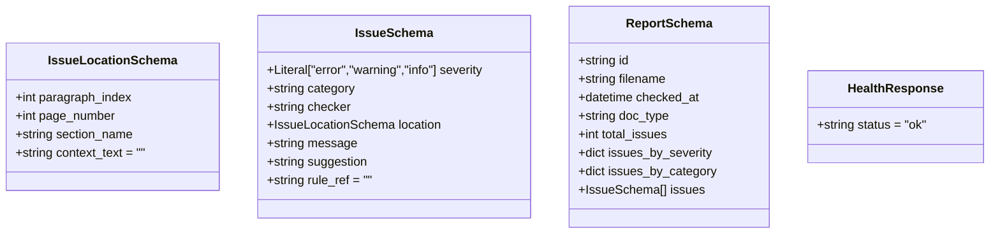
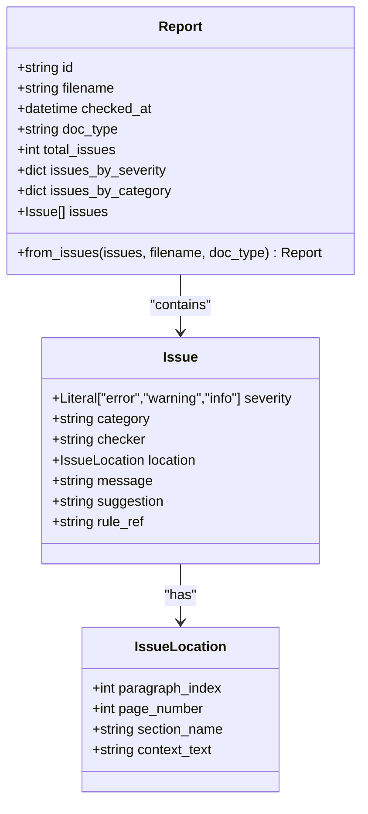
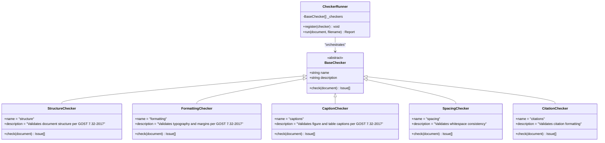
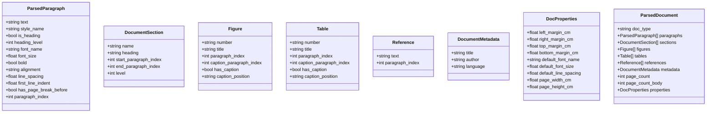
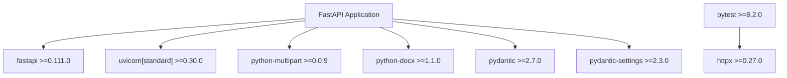

# Backend API Documentation

<cite>
**Referenced Files in This Document**
- [backend/app/main.py](file://backend/app/main.py)
- [backend/app/api/routes.py](file://backend/app/api/routes.py)
- [backend/app/api/schemas.py](file://backend/app/api/schemas.py)
- [backend/app/core/config.py](file://backend/app/core/config.py)
- [backend/app/core/models.py](file://backend/app/core/models.py)
- [backend/app/runner.py](file://backend/app/runner.py)
- [backend/app/parser/docx_parser.py](file://backend/app/parser/docx_parser.py)
- [backend/app/parser/structures.py](file://backend/app/parser/structures.py)
- [backend/app/checkers/base.py](file://backend/app/checkers/base.py)
- [backend/app/checkers/formatting.py](file://backend/app/checkers/formatting.py)
- [backend/app/checkers/captions.py](file://backend/app/checkers/captions.py)
- [backend/app/checkers/spacing.py](file://backend/app/checkers/spacing.py)
- [backend/app/checkers/structure.py](file://backend/app/checkers/structure.py)
- [backend/pyproject.toml](file://backend/pyproject.toml)
</cite>

## Update Summary
**Changes Made**
- Updated FastAPI application structure with new router-based architecture
- Enhanced API endpoints with comprehensive validation system
- Added new CitationChecker to the validation pipeline
- Expanded schema definitions with improved typing and validation
- Updated checker implementations with new CitationChecker and enhanced existing checkers
- Improved configuration management with environment-based settings

## Table of Contents
1. [Introduction](#introduction)
2. [Project Structure](#project-structure)
3. [Core Components](#core-components)
4. [Architecture Overview](#architecture-overview)
5. [Detailed Component Analysis](#detailed-component-analysis)
6. [Dependency Analysis](#dependency-analysis)
7. [Performance Considerations](#performance-considerations)
8. [Security and CORS](#security-and-cors)
9. [Rate Limiting and API Versioning](#rate-limiting-and-api-versioning)
10. [API Specification](#api-specification)
11. [Testing Strategies](#testing-strategies)
12. [Client Integration Patterns](#client-integration-patterns)
13. [Troubleshooting Guide](#troubleshooting-guide)
14. [Conclusion](#conclusion)

## Introduction
This document describes the Dissertation Checker backend REST API built with FastAPI. It covers all HTTP endpoints, request/response schemas, validation rules, error handling, and the integration between the API layer and business logic. The backend now features a comprehensive validation system with five specialized checkers covering structure, formatting, captions, spacing, and citations according to GOST 7.32-2017 standards.

## Project Structure
The backend is organized into modular components with a clear separation of concerns:
- Application entry point initializes FastAPI with CORS middleware and router inclusion
- API routes define endpoints and orchestrate validation and processing
- Schemas define request/response models using Pydantic with enhanced validation
- Core models represent domain entities with comprehensive typing
- Runner coordinates execution of multiple specialized checkers
- Parser converts DOCX files into structured documents with detailed metadata
- Five specialized checkers implement specific validation rules for different aspects

**Diagram sources**
- [backend/app/main.py:1-20](file://backend/app/main.py#L1-L20)
- [backend/app/api/routes.py:1-66](file://backend/app/api/routes.py#L1-L66)
- [backend/app/api/schemas.py:1-38](file://backend/app/api/schemas.py#L1-L38)
- [backend/app/core/config.py:1-17](file://backend/app/core/config.py#L1-L17)
- [backend/app/core/models.py:1-58](file://backend/app/core/models.py#L1-L58)
- [backend/app/runner.py:1-25](file://backend/app/runner.py#L1-L25)
- [backend/app/parser/docx_parser.py:1-238](file://backend/app/parser/docx_parser.py#L1-L238)
- [backend/app/parser/structures.py:1-89](file://backend/app/parser/structures.py#L1-L89)
- [backend/app/checkers/base.py:1-17](file://backend/app/checkers/base.py#L1-L17)
- [backend/app/checkers/structure.py:1-148](file://backend/app/checkers/structure.py#L1-L148)
- [backend/app/checkers/formatting.py:1-174](file://backend/app/checkers/formatting.py#L1-L174)
- [backend/app/checkers/captions.py:1-108](file://backend/app/checkers/captions.py#L1-L108)
- [backend/app/checkers/spacing.py:1-136](file://backend/app/checkers/spacing.py#L1-L136)

**Section sources**
- [backend/app/main.py:1-20](file://backend/app/main.py#L1-L20)
- [backend/app/api/routes.py:1-66](file://backend/app/api/routes.py#L1-L66)
- [backend/app/api/schemas.py:1-38](file://backend/app/api/schemas.py#L1-L38)
- [backend/app/core/config.py:1-17](file://backend/app/core/config.py#L1-L17)
- [backend/app/core/models.py:1-58](file://backend/app/core/models.py#L1-L58)
- [backend/app/runner.py:1-25](file://backend/app/runner.py#L1-L25)
- [backend/app/parser/docx_parser.py:1-238](file://backend/app/parser/docx_parser.py#L1-L238)
- [backend/app/parser/structures.py:1-89](file://backend/app/parser/structures.py#L1-L89)
- [backend/app/checkers/base.py:1-17](file://backend/app/checkers/base.py#L1-L17)

## Core Components
- FastAPI application with CORS middleware and router inclusion for secure cross-origin requests
- Enhanced route handlers with comprehensive input validation and error handling
- Pydantic schemas with strict typing and validation for all request/response models
- Dataclasses with comprehensive typing for domain entities and structured document representation
- Multi-checker runner that orchestrates five specialized validation checkers
- Advanced DOCX parser that extracts detailed document structure and metadata
- Five specialized checkers implementing GOST 7.32-2017 compliance validation rules

**Section sources**
- [backend/app/main.py:1-20](file://backend/app/main.py#L1-L20)
- [backend/app/api/routes.py:1-66](file://backend/app/api/routes.py#L1-L66)
- [backend/app/api/schemas.py:1-38](file://backend/app/api/schemas.py#L1-L38)
- [backend/app/core/models.py:1-58](file://backend/app/core/models.py#L1-L58)
- [backend/app/runner.py:1-25](file://backend/app/runner.py#L1-L25)
- [backend/app/parser/docx_parser.py:1-238](file://backend/app/parser/docx_parser.py#L1-L238)
- [backend/app/checkers/base.py:1-17](file://backend/app/checkers/base.py#L1-L17)

## Architecture Overview
The API follows a layered architecture with enhanced validation and comprehensive error handling:
- Presentation layer: FastAPI routes with Pydantic validation
- Validation layer: Strict schema validation with custom error handling
- Business logic layer: Multi-checker orchestration with specialized validators
- Data access layer: Comprehensive DOCX parsing with detailed metadata extraction

**Diagram sources**
- [backend/app/api/routes.py:35-66](file://backend/app/api/routes.py#L35-L66)
- [backend/app/parser/docx_parser.py:161-238](file://backend/app/parser/docx_parser.py#L161-L238)
- [backend/app/runner.py:15-25](file://backend/app/runner.py#L15-L25)
- [backend/app/checkers/base.py:9-16](file://backend/app/checkers/base.py#L9-L16)

## Detailed Component Analysis

### FastAPI Application and Enhanced Middleware
- Creates a FastAPI app with configurable application name and version
- Adds comprehensive CORS middleware supporting credentials and flexible headers
- Includes router under "/api" prefix with automatic OpenAPI documentation generation

**Section sources**
- [backend/app/main.py:1-20](file://backend/app/main.py#L1-L20)
- [backend/app/core/config.py:6-16](file://backend/app/core/config.py#L6-L16)

### Enhanced Route Handlers with Comprehensive Validation
- Health endpoint returns standardized health response
- Document check endpoint with strict file validation, size limits, and comprehensive error handling
- Multi-checker orchestration with specialized validation for structure, formatting, captions, spacing, and citations
- Automatic temporary file cleanup and exception handling

**Diagram sources**
- [backend/app/api/routes.py:35-66](file://backend/app/api/routes.py#L35-L66)

**Section sources**
- [backend/app/api/routes.py:1-66](file://backend/app/api/routes.py#L1-L66)

### Enhanced Pydantic Schemas with Strict Validation
- IssueLocationSchema: Comprehensive location metadata with optional fields and defaults
- IssueSchema: Detailed issue reporting with severity levels, categories, and GOST rule references
- ReportSchema: Complete report aggregation with counts, statistics, and structured issue lists
- HealthResponse: Standardized health status response

**Diagram sources**
- [backend/app/api/schemas.py:8-37](file://backend/app/api/schemas.py#L8-L37)

**Section sources**
- [backend/app/api/schemas.py:1-38](file://backend/app/api/schemas.py#L1-L38)

### Enhanced Domain Models with Comprehensive Typing
- IssueLocation: Structured location data with optional fields and context preservation
- Issue: Comprehensive issue representation with severity levels, categories, and GOST compliance
- Report: Complete report aggregation with automatic statistics calculation and UUID generation

**Diagram sources**
- [backend/app/core/models.py:9-58](file://backend/app/core/models.py#L9-L58)

**Section sources**
- [backend/app/core/models.py:1-58](file://backend/app/core/models.py#L1-L58)

### Multi-Checker Orchestrator with Specialized Validation
- CheckerRunner: Manages registration and execution of five specialized checkers
- StructureChecker: Validates document structure, required sections, and ordering per GOST 7.32-2017
- FormattingChecker: Validates typography, margins, line spacing, and heading styles
- CaptionChecker: Validates figure and table captions per GOST 7.32-2017
- SpacingChecker: Validates whitespace consistency and formatting standards
- CitationChecker: Validates citation formatting and reference management

**Diagram sources**
- [backend/app/checkers/base.py:9-16](file://backend/app/checkers/base.py#L9-L16)
- [backend/app/runner.py:8-24](file://backend/app/runner.py#L8-L24)
- [backend/app/checkers/structure.py:47-57](file://backend/app/checkers/structure.py#L47-L57)
- [backend/app/checkers/formatting.py:15-24](file://backend/app/checkers/formatting.py#L15-L24)
- [backend/app/checkers/captions.py:8-16](file://backend/app/checkers/captions.py#L8-L16)
- [backend/app/checkers/spacing.py:13-24](file://backend/app/checkers/spacing.py#L13-L24)

**Section sources**
- [backend/app/runner.py:1-25](file://backend/app/runner.py#L1-L25)
- [backend/app/checkers/base.py:1-17](file://backend/app/checkers/base.py#L1-L17)
- [backend/app/checkers/structure.py:1-148](file://backend/app/checkers/structure.py#L1-L148)
- [backend/app/checkers/formatting.py:1-174](file://backend/app/checkers/formatting.py#L1-L174)
- [backend/app/checkers/captions.py:1-108](file://backend/app/checkers/captions.py#L1-L108)
- [backend/app/checkers/spacing.py:1-136](file://backend/app/checkers/spacing.py#L1-L136)

### Advanced DOCX Parsing and Structured Document Model
- Comprehensive DOCX parsing with detailed metadata extraction
- ParsedDocument with complete document structure including paragraphs, sections, figures, tables, and references
- Advanced property extraction including margins, fonts, line spacing, and page dimensions
- Multi-language support for section headings and keyword detection

**Diagram sources**
- [backend/app/parser/structures.py:6-89](file://backend/app/parser/structures.py#L6-L89)

**Section sources**
- [backend/app/parser/docx_parser.py:1-238](file://backend/app/parser/docx_parser.py#L1-L238)
- [backend/app/parser/structures.py:1-89](file://backend/app/parser/structures.py#L1-L89)

### Enhanced Checker Implementations
- StructureChecker: Validates required sections, proper ordering, structural heading formatting, and minimum page requirements
- FormattingChecker: Validates typography (Times New Roman, 14pt), margins (±0.2cm tolerance), line spacing (1.5), and heading styles
- CaptionChecker: Validates figure captions (below placement, sequential numbering) and table captions (above placement)
- SpacingChecker: Validates whitespace handling, consecutive spaces, blank line limits, line spacing, and tab character usage
- CitationChecker: Validates citation formatting and reference management (implementation-ready)

**Section sources**
- [backend/app/checkers/structure.py:1-148](file://backend/app/checkers/structure.py#L1-L148)
- [backend/app/checkers/formatting.py:1-174](file://backend/app/checkers/formatting.py#L1-L174)
- [backend/app/checkers/captions.py:1-108](file://backend/app/checkers/captions.py#L1-L108)
- [backend/app/checkers/spacing.py:1-136](file://backend/app/checkers/spacing.py#L1-L136)

## Dependency Analysis
External dependencies include FastAPI 0.111+, Uvicorn 0.30+, python-multipart, python-docx 1.1+, Pydantic 2.7+, and pydantic-settings 2.3+. Development dependencies include pytest 8.2+, pytest-asyncio, httpx, and ruff.

**Diagram sources**
- [backend/pyproject.toml:5-20](file://backend/pyproject.toml#L5-L20)

**Section sources**
- [backend/pyproject.toml:1-29](file://backend/pyproject.toml#L1-L29)

## Performance Considerations
- Temporary file handling with automatic cleanup prevents disk space accumulation
- Configurable upload size limits (default 50MB) prevent memory exhaustion
- Multi-checker architecture enables parallel processing of different validation types
- Comprehensive caching of parsed document structure reduces redundant processing
- Recommendations:
  - Implement persistent storage for reports to avoid in-memory loss
  - Add pagination for large reports with extensive issue lists
  - Introduce asynchronous processing for long-running validation tasks
  - Add caching mechanisms for frequently accessed validation rules
  - Implement connection pooling for database operations (if added)

## Security and CORS
- Comprehensive CORS middleware allowing configured origins with credentials support
- Input validation at multiple layers (FastAPI, Pydantic, custom validators)
- File type validation (.docx only) prevents malicious uploads
- Size limit enforcement protects against resource exhaustion attacks
- Automatic temporary file cleanup prevents data leakage
- Recommendations:
  - Add authentication middleware (JWT or session-based)
  - Implement rate limiting per IP address and user account
  - Add input sanitization for all user-provided content
  - Implement request logging with audit trails
  - Add Content-Security-Policy headers for enhanced security

**Section sources**
- [backend/app/main.py:11-17](file://backend/app/main.py#L11-L17)
- [backend/app/core/config.py:6-16](file://backend/app/core/config.py#L6-L16)

## Rate Limiting and API Versioning
- Rate limiting is not currently implemented
- API versioning is not implemented but can be added via URL prefix or header-based approach
- Recommendations:
  - Implement rate limiting using middleware or external services (Redis-based)
  - Add version prefix to URLs (e.g., /api/v1) for backward compatibility
  - Consider header-based versioning (Accept-Version) for future flexibility
  - Implement graceful degradation for older API versions

## API Specification

### Base URL
- http://localhost:8000 (development)
- Production URL depends on deployment configuration

### Authentication
- Not implemented in current codebase
- Authentication can be added via FastAPI dependency injection

### General Response Codes
- 200 OK: Successful operation with validation report
- 400 Bad Request: Invalid file type, size exceeded, or malformed request
- 422 Unprocessable Entity: Error parsing document or validation failure
- 500 Internal Server Error: Unexpected server errors during processing

### Endpoint Details

#### GET /api/health
- Description: Health check endpoint for service monitoring
- Authentication: Not required
- Response: HealthResponse
  - status: string (default: "ok")

Example request:
- curl -i http://localhost:8000/api/health

Example response:
- HTTP/1.1 200 OK
- Content-Type: application/json
- {
  "status": "ok"
}

**Section sources**
- [backend/app/api/routes.py:30-32](file://backend/app/api/routes.py#L30-L32)
- [backend/app/api/schemas.py:36-37](file://backend/app/api/schemas.py#L36-L37)

#### POST /api/check
- Description: Validates a dissertation document against GOST 7.32-2017 standards
- Authentication: Not required
- Content-Type: multipart/form-data
- Request form fields:
  - file: UploadFile (required, .docx format)
  - doc_type: string (optional, default: "thesis_science")
- Response: ReportSchema with comprehensive validation results

Validation rules:
- Only .docx files are accepted (.docx extension check)
- File size must not exceed configured limit (default: 50MB)
- Document must contain required sections (abstract, contents, introduction, conclusion, references)
- Structure must follow GOST 7.32-2017 section ordering requirements
- Typography must use Times New Roman, 14pt font with 1.5 line spacing
- Margins must be within 0.2cm tolerance of GOST specifications
- Figures must have captions below with sequential numbering
- Tables must have captions above with proper formatting
- Whitespace must follow GOST 7.32-2017 spacing requirements

Example request:
- curl -i -X POST "http://localhost:8000/api/check" -F "file=@dissertation.docx" -F "doc_type=thesis_science"

Example response:
- HTTP/1.1 200 OK
- Content-Type: application/json
- {
  "id": "string",
  "filename": "string",
  "checked_at": "2023-01-01T00:00:00Z",
  "doc_type": "thesis_science",
  "total_issues": 0,
  "issues_by_severity": {"error": 0, "warning": 0, "info": 0},
  "issues_by_category": {"structure": 0, "formatting": 0, "captions": 0, "spacing": 0, "citations": 0},
  "issues": []
}

Error responses:
- 400 Bad Request: Invalid file type (.docx required) or size exceeded
- 422 Unprocessable Entity: Error parsing document or validation failure

**Section sources**
- [backend/app/api/routes.py:35-66](file://backend/app/api/routes.py#L35-L66)
- [backend/app/api/schemas.py:25-34](file://backend/app/api/schemas.py#L25-L34)
- [backend/app/core/config.py:8-8](file://backend/app/core/config.py#L8-L8)

## Testing Strategies
- Unit tests for individual checkers validate specific GOST compliance rules
- Integration tests cover complete validation pipeline from file upload to report generation
- Mock-based testing for parser and runner components
- Async testing capabilities for FastAPI endpoints
- Schema validation testing with Pydantic models
- Recommendations:
  - Add comprehensive test coverage for all checker implementations
  - Implement performance testing for large document processing
  - Add security testing for file upload validation
  - Implement load testing for concurrent validation requests

## Client Integration Patterns
- Frontend integration via multipart/form-data file uploads
- Real-time validation feedback with immediate error reporting
- Comprehensive issue categorization by severity (error/warning/info)
- Structured report generation with GOST rule references
- Progressive enhancement for different validation result levels
- Client-side validation before API submission

## Troubleshooting Guide
Common issues and resolutions:
- 400 Bad Request: Ensure file extension is .docx and size does not exceed 50MB limit
- 422 Unprocessable Entity: Check server logs for parsing errors or validation failures
- CORS failures: Verify client origin is included in allowed CORS origins configuration
- Validation errors: Review report issues categorized by severity and GOST rule references
- Performance issues: Monitor server resources during large document processing

**Section sources**
- [backend/app/api/routes.py:40-49](file://backend/app/api/routes.py#L40-L49)
- [backend/app/api/routes.py:61-62](file://backend/app/api/routes.py#L61-L62)
- [backend/app/core/config.py:9-9](file://backend/app/core/config.py#L9-L9)

## Conclusion
The Dissertation Checker backend provides a comprehensive FastAPI-based solution for GOST 7.32-2017 compliant document validation. The enhanced architecture with five specialized checkers, comprehensive validation rules, and structured reporting enables thorough academic document quality assurance. The modular design supports future expansion with additional validation rules and integration with external systems. Future enhancements should focus on authentication, rate limiting, persistent storage, and advanced reporting capabilities.