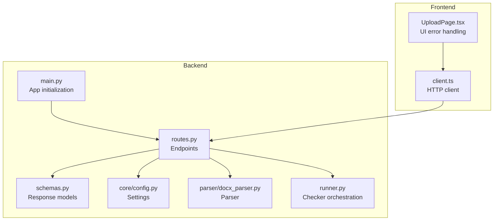
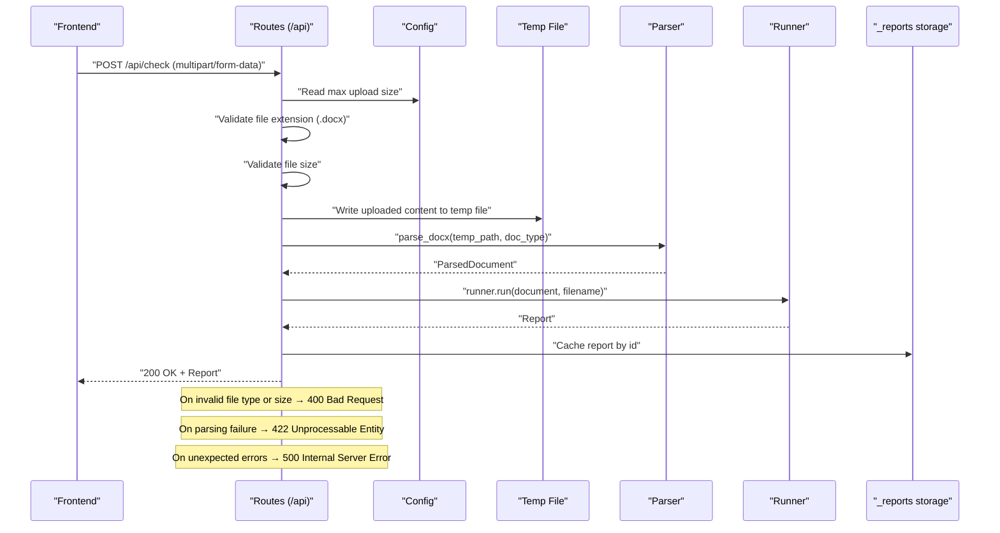
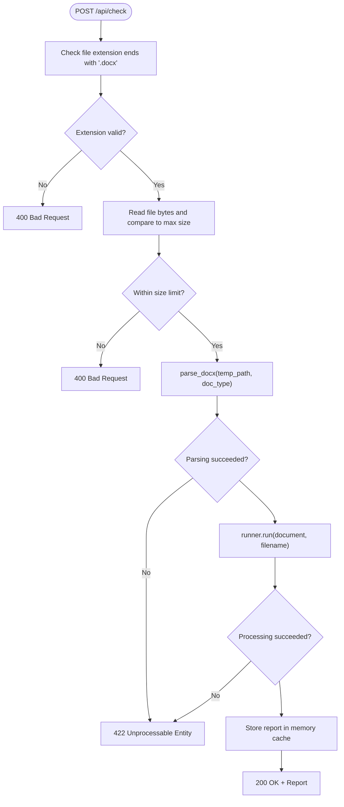
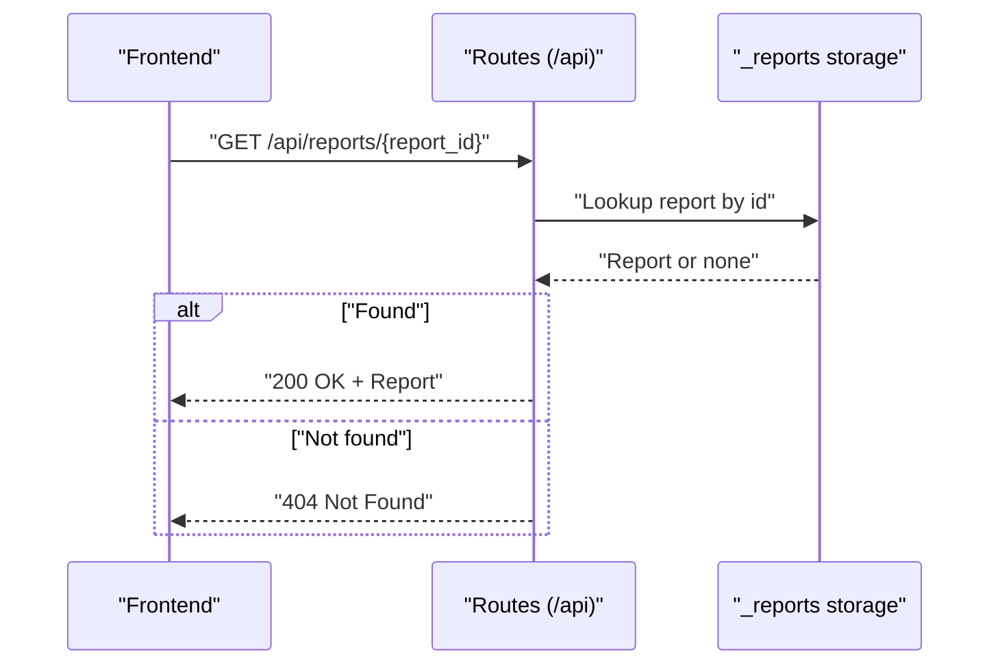
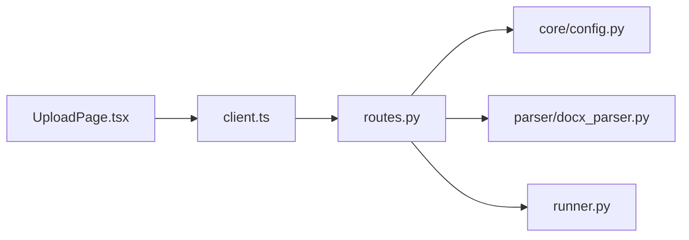

# Error Handling and Status Codes

<cite>
**Referenced Files in This Document**
- [backend/app/main.py](file://backend/app/main.py)
- [backend/app/api/routes.py](file://backend/app/api/routes.py)
- [backend/app/api/schemas.py](file://backend/app/api/schemas.py)
- [backend/app/core/config.py](file://backend/app/core/config.py)
- [backend/app/parser/docx_parser.py](file://backend/app/parser/docx_parser.py)
- [backend/app/runner.py](file://backend/app/runner.py)
- [frontend/src/api/client.ts](file://frontend/src/api/client.ts)
- [frontend/src/pages/UploadPage.tsx](file://frontend/src/pages/UploadPage.tsx)
</cite>

## Table of Contents
1. [Introduction](#introduction)
2. [Project Structure](#project-structure)
3. [Core Components](#core-components)
4. [Architecture Overview](#architecture-overview)
5. [Detailed Component Analysis](#detailed-component-analysis)
6. [Dependency Analysis](#dependency-analysis)
7. [Performance Considerations](#performance-considerations)
8. [Troubleshooting Guide](#troubleshooting-guide)
9. [Conclusion](#conclusion)

## Introduction
This document provides comprehensive error handling documentation for the Dissertation Checker API. It explains the HTTP status codes returned by endpoints, the specific conditions that trigger each code, the error response structure, and recommended client-side handling patterns. It also outlines logging practices for error tracking and debugging.

## Project Structure
The API is implemented using FastAPI and organized into modular components:
- Application entry point initializes the FastAPI app, CORS middleware, and mounts the router under /api.
- Routes define the health, upload, and report retrieval endpoints.
- Schemas define the response models for reports and health checks.
- Runner orchestrates checkers that validate the parsed document.
- Frontend client consumes the API and surfaces errors to users.

**Diagram sources**
- [backend/app/main.py:1-20](file://backend/app/main.py#L1-L20)
- [backend/app/api/routes.py:1-75](file://backend/app/api/routes.py#L1-L75)
- [backend/app/api/schemas.py:1-38](file://backend/app/api/schemas.py#L1-L38)
- [backend/app/core/config.py:1-17](file://backend/app/core/config.py#L1-L17)
- [backend/app/parser/docx_parser.py:1-8](file://backend/app/parser/docx_parser.py#L1-L8)
- [backend/app/runner.py:1-25](file://backend/app/runner.py#L1-L25)
- [frontend/src/api/client.ts:1-50](file://frontend/src/api/client.ts#L1-L50)
- [frontend/src/pages/UploadPage.tsx:1-62](file://frontend/src/pages/UploadPage.tsx#L1-L62)

**Section sources**
- [backend/app/main.py:1-20](file://backend/app/main.py#L1-L20)
- [backend/app/api/routes.py:1-75](file://backend/app/api/routes.py#L1-L75)
- [backend/app/api/schemas.py:1-38](file://backend/app/api/schemas.py#L1-L38)
- [backend/app/core/config.py:1-17](file://backend/app/core/config.py#L1-L17)
- [frontend/src/api/client.ts:1-50](file://frontend/src/api/client.ts#L1-L50)
- [frontend/src/pages/UploadPage.tsx:1-62](file://frontend/src/pages/UploadPage.tsx#L1-L62)

## Core Components
- Health endpoint returns a simple health status.
- Document check endpoint validates file type and size, parses the document, runs checkers, and returns a report.
- Report retrieval endpoint returns stored reports by ID or raises a not-found error.

Key behaviors:
- Validation errors (400) occur for unsupported file types and oversized uploads.
- Parsing or processing errors (422) occur when document parsing fails.
- Resource not found (404) occurs when a report ID does not exist.
- Successful operations return 200 with the report payload.

**Section sources**
- [backend/app/api/routes.py:31-75](file://backend/app/api/routes.py#L31-L75)
- [backend/app/api/schemas.py:25-38](file://backend/app/api/schemas.py#L25-L38)
- [backend/app/core/config.py:6-11](file://backend/app/core/config.py#L6-L11)

## Architecture Overview
The following sequence diagram illustrates the end-to-end flow for document checking and error handling.

**Diagram sources**
- [backend/app/api/routes.py:36-68](file://backend/app/api/routes.py#L36-L68)
- [backend/app/core/config.py:6-11](file://backend/app/core/config.py#L6-L11)
- [backend/app/parser/docx_parser.py:5-8](file://backend/app/parser/docx_parser.py#L5-L8)
- [backend/app/runner.py:15-25](file://backend/app/runner.py#L15-L25)

## Detailed Component Analysis

### Endpoint: GET /api/health
- Purpose: Health check endpoint returning a simple status.
- Response model: HealthResponse with a status field.
- Status codes:
  - 200 OK on success.
- Error conditions: None for this endpoint in current implementation.

**Section sources**
- [backend/app/api/routes.py:31-33](file://backend/app/api/routes.py#L31-L33)
- [backend/app/api/schemas.py:36-38](file://backend/app/api/schemas.py#L36-L38)

### Endpoint: POST /api/check
- Purpose: Accepts a .docx file and optional document type, validates inputs, parses the document, runs checkers, and returns a report.
- Request:
  - multipart/form-data with:
    - file: required, .docx
    - doc_type: optional, defaults to a configured value
- Response:
  - 200 OK with ReportSchema on success.
- Status codes:
  - 200 OK: Successful parsing and processing.
  - 400 Bad Request: Invalid file type or file too large.
  - 422 Unprocessable Entity: Parsing or processing error.
  - 500 Internal Server Error: Unexpected server error (implicit from unhandled exceptions).
- Specific error triggers:
  - Invalid file format: filename missing or not ending with .docx.
  - File size violation: file size exceeds configured max_upload_size_mb.
  - Parsing failures: exceptions raised during parse_docx or runner.run.
- Error response structure:
  - FastAPI HTTPException returns a JSON body with a detail field containing the error message.
- Example error responses:
  - 400 Bad Request:
    - {"detail":"Only .docx files are accepted"}
    - {"detail":"File too large. Max size is N MB"}
  - 422 Unprocessable Entity:
    - {"detail":"Error parsing document: <exception message>"}
  - 500 Internal Server Error:
    - {"detail":"Internal server error"} (implicit when exceptions are not caught)

**Diagram sources**
- [backend/app/api/routes.py:36-68](file://backend/app/api/routes.py#L36-L68)
- [backend/app/core/config.py:8](file://backend/app/core/config.py#L8)
- [backend/app/parser/docx_parser.py:5-8](file://backend/app/parser/docx_parser.py#L5-L8)
- [backend/app/runner.py:15-25](file://backend/app/runner.py#L15-L25)

**Section sources**
- [backend/app/api/routes.py:36-68](file://backend/app/api/routes.py#L36-L68)
- [backend/app/core/config.py:8](file://backend/app/core/config.py#L8)

### Endpoint: GET /api/reports/{report_id}
- Purpose: Retrieve a previously generated report by ID.
- Path parameter:
  - report_id: string identifier of the report.
- Response:
  - 200 OK with ReportSchema on success.
- Status codes:
  - 200 OK: Report exists.
  - 404 Not Found: Report ID not found in storage.
- Error response structure:
  - FastAPI HTTPException returns a JSON body with a detail field.
- Example error response:
  - 404 Not Found:
    - {"detail":"Report not found"}

**Diagram sources**
- [backend/app/api/routes.py:70-75](file://backend/app/api/routes.py#L70-L75)

**Section sources**
- [backend/app/api/routes.py:70-75](file://backend/app/api/routes.py#L70-L75)

### Error Response Structure and Standard Message Format
- All HTTP exceptions are raised via FastAPI’s HTTPException, which produces a JSON response with a detail field containing the error message string.
- Clients should read the detail field for user-facing messages.

Example payloads:
- 400 Bad Request:
  - {"detail":"Only .docx files are accepted"}
  - {"detail":"File too large. Max size is N MB"}
- 404 Not Found:
  - {"detail":"Report not found"}
- 422 Unprocessable Entity:
  - {"detail":"Error parsing document: <exception message>"}

Note: 500 Internal Server Error is not explicitly raised in routes; it may be emitted implicitly by the framework for unhandled exceptions.

**Section sources**
- [backend/app/api/routes.py:41-50](file://backend/app/api/routes.py#L41-L50)
- [backend/app/api/routes.py:63-64](file://backend/app/api/routes.py#L63-L64)
- [backend/app/api/routes.py:72-73](file://backend/app/api/routes.py#L72-L73)

### Client-Side Error Handling Patterns and Retry Strategies
- Frontend client:
  - Uses axios to call the API endpoints.
  - For POST /api/check, catches errors and displays the detail message from the response.
  - For GET /api/reports/{report_id}, expects a 200 with a report or a 404 Not Found.
- Recommended client-side patterns:
  - Always inspect error.response?.data?.detail for user-facing messages.
  - Distinguish between network errors and HTTP error responses.
  - For transient errors (e.g., 422 after retrying with corrected inputs), allow user retry.
  - For 400 errors, inform the user about file type or size constraints.
  - For 404 errors, prompt the user to re-run the check or verify the report ID.
  - For 500 errors, show a generic failure message and suggest retry later.
- Retry strategies:
  - Exponential backoff with jitter for transient failures.
  - Limit retries to avoid prolonged resource consumption.
  - Do not retry 4xx errors caused by invalid inputs (400/404) unless the user changes inputs.

**Section sources**
- [frontend/src/api/client.ts:33-50](file://frontend/src/api/client.ts#L33-L50)
- [frontend/src/pages/UploadPage.tsx:15-27](file://frontend/src/pages/UploadPage.tsx#L15-L27)

## Dependency Analysis
The routes module depends on configuration, parser, and runner components. The frontend client depends on the API endpoints.

**Diagram sources**
- [backend/app/api/routes.py:1-17](file://backend/app/api/routes.py#L1-L17)
- [backend/app/core/config.py:1-17](file://backend/app/core/config.py#L1-L17)
- [backend/app/parser/docx_parser.py:1-8](file://backend/app/parser/docx_parser.py#L1-L8)
- [backend/app/runner.py:1-25](file://backend/app/runner.py#L1-L25)
- [frontend/src/api/client.ts:1-50](file://frontend/src/api/client.ts#L1-L50)
- [frontend/src/pages/UploadPage.tsx:1-62](file://frontend/src/pages/UploadPage.tsx#L1-L62)

**Section sources**
- [backend/app/api/routes.py:1-17](file://backend/app/api/routes.py#L1-L17)
- [backend/app/core/config.py:1-17](file://backend/app/core/config.py#L1-L17)
- [backend/app/parser/docx_parser.py:1-8](file://backend/app/parser/docx_parser.py#L1-L8)
- [backend/app/runner.py:1-25](file://backend/app/runner.py#L1-L25)
- [frontend/src/api/client.ts:1-50](file://frontend/src/api/client.ts#L1-L50)
- [frontend/src/pages/UploadPage.tsx:1-62](file://frontend/src/pages/UploadPage.tsx#L1-L62)

## Performance Considerations
- File size validation prevents excessive memory usage and disk writes.
- Temporary file cleanup ensures resources are released even on errors.
- In-memory report storage simplifies caching but is not persistent; consider persistence for production deployments.

[No sources needed since this section provides general guidance]

## Troubleshooting Guide
- 400 Bad Request:
  - Verify the file extension is .docx.
  - Reduce file size to meet the configured maximum.
- 404 Not Found:
  - Confirm the report ID is correct and was generated by a recent check.
- 422 Unprocessable Entity:
  - Retry the operation; underlying parsing may succeed on subsequent attempts.
  - Inspect logs for the specific exception message included in the detail field.
- Logging practices:
  - Enable server logs to capture stack traces for 422 and 500 errors.
  - Log request IDs and correlation IDs if integrated with middleware.
  - Capture the detail message and timestamps for debugging user-reported issues.

**Section sources**
- [backend/app/api/routes.py:41-50](file://backend/app/api/routes.py#L41-L50)
- [backend/app/api/routes.py:63-64](file://backend/app/api/routes.py#L63-L64)
- [backend/app/api/routes.py:72-73](file://backend/app/api/routes.py#L72-L73)

## Conclusion
The Dissertation Checker API implements clear error semantics with distinct HTTP status codes for validation, processing, and resource-not-found scenarios. Clients should consistently read the detail field for user-facing messages and apply appropriate retry strategies. Logging server-side errors enables effective debugging and monitoring.