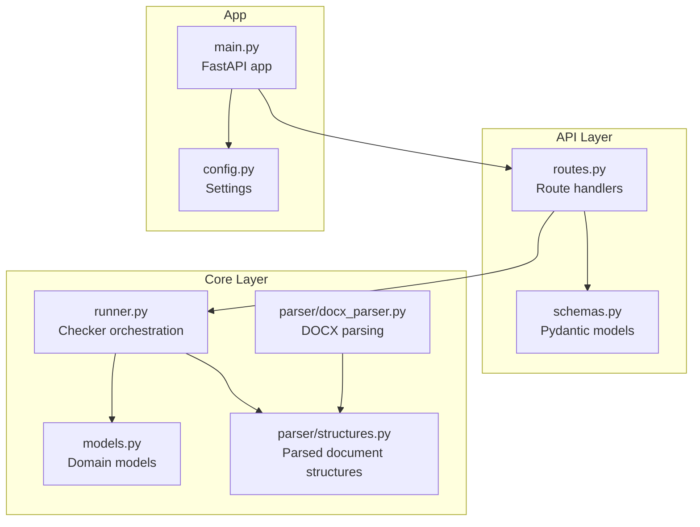
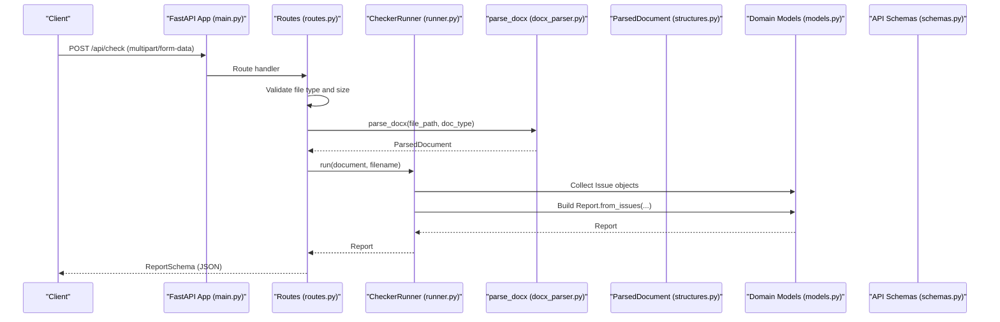
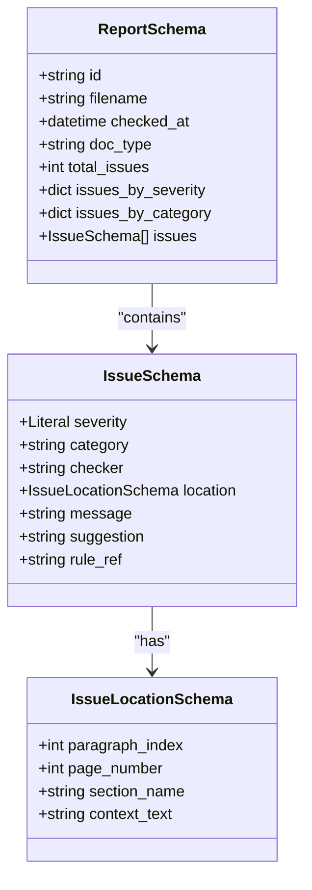
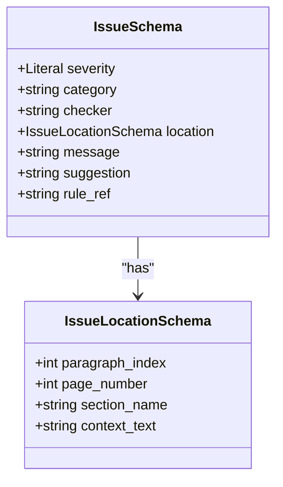
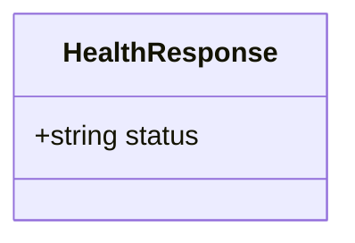
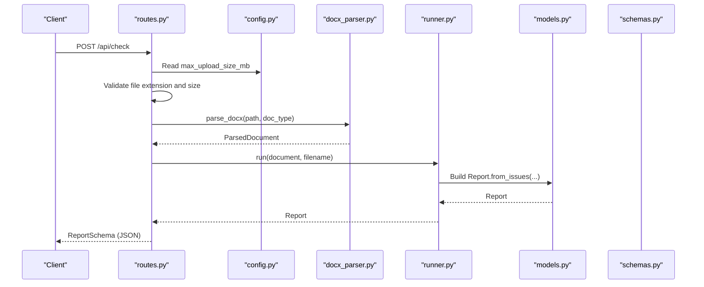
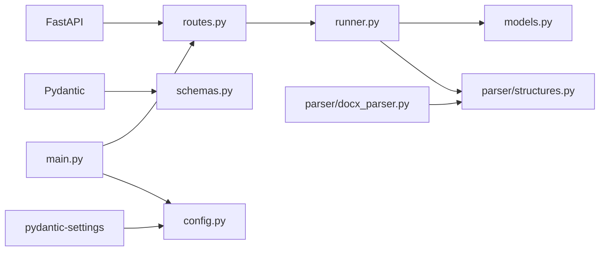

# Request and Response Schemas

<cite>
**Referenced Files in This Document**
- [schemas.py](file://backend/app/api/schemas.py)
- [models.py](file://backend/app/core/models.py)
- [routes.py](file://backend/app/api/routes.py)
- [main.py](file://backend/app/main.py)
- [config.py](file://backend/app/core/config.py)
- [runner.py](file://backend/app/runner.py)
- [docx_parser.py](file://backend/app/parser/docx_parser.py)
- [structures.py](file://backend/app/parser/structures.py)
- [pyproject.toml](file://backend/pyproject.toml)
</cite>

## Table of Contents
1. [Introduction](#introduction)
2. [Project Structure](#project-structure)
3. [Core Components](#core-components)
4. [Architecture Overview](#architecture-overview)
5. [Detailed Component Analysis](#detailed-component-analysis)
6. [Dependency Analysis](#dependency-analysis)
7. [Performance Considerations](#performance-considerations)
8. [Troubleshooting Guide](#troubleshooting-guide)
9. [Conclusion](#conclusion)

## Introduction
This document describes the API request and response schemas used by the Dissertation Checker backend. It focuses on the Pydantic models that define validation and serialization for:
- ReportSchema: the primary response model for checking results
- HealthResponse: system health endpoint response
- IssueSchema and IssueLocationSchema: nested models representing individual issues and their locations
It also explains how these API schemas relate to internal domain models, the serialization/deserialization process, optional vs required fields, defaults, and guidelines for extending schemas while maintaining backward compatibility.

## Project Structure
The API schemas live under the API module and are consumed by route handlers. Domain models reside in the core module and are produced by the checker pipeline. The FastAPI application wires routes and exposes the schemas as response models.

**Diagram sources**
- [routes.py:1-75](file://backend/app/api/routes.py#L1-L75)
- [schemas.py:1-38](file://backend/app/api/schemas.py#L1-L38)
- [models.py:1-58](file://backend/app/core/models.py#L1-L58)
- [runner.py:1-25](file://backend/app/runner.py#L1-L25)
- [docx_parser.py:1-8](file://backend/app/parser/docx_parser.py#L1-L8)
- [structures.py:1-89](file://backend/app/parser/structures.py#L1-L89)
- [main.py:1-20](file://backend/app/main.py#L1-L20)
- [config.py:1-17](file://backend/app/core/config.py#L1-L17)

**Section sources**
- [routes.py:1-75](file://backend/app/api/routes.py#L1-L75)
- [schemas.py:1-38](file://backend/app/api/schemas.py#L1-L38)
- [models.py:1-58](file://backend/app/core/models.py#L1-L58)
- [runner.py:1-25](file://backend/app/runner.py#L1-L25)
- [docx_parser.py:1-8](file://backend/app/parser/docx_parser.py#L1-L8)
- [structures.py:1-89](file://backend/app/parser/structures.py#L1-L89)
- [main.py:1-20](file://backend/app/main.py#L1-L20)
- [config.py:1-17](file://backend/app/core/config.py#L1-L17)

## Core Components
This section documents the Pydantic models used in API requests and responses, their fields, types, validation rules, and constraints.

- ReportSchema
  - Purpose: Encapsulates a complete checking report with counts, categorized metrics, and the list of issues.
  - Fields:
    - id: string (UUID-like identifier)
    - filename: string (original uploaded file name)
    - checked_at: datetime (UTC timestamp)
    - doc_type: string (document type discriminator)
    - total_issues: integer (non-negative count)
    - issues_by_severity: dictionary mapping severity to integer counts
    - issues_by_category: dictionary mapping category to integer counts
    - issues: list of IssueSchema
  - Validation rules and constraints:
    - All fields are required unless marked optional in the model definition.
    - Severity values in nested IssueSchema are constrained to literal values.
    - Counts are non-negative integers.
    - Dictionary keys are strings; values are integers.
  - Serialization/deserialization:
    - Pydantic automatically serializes to JSON and validates incoming data against the schema.
  - Example serialized JSON (response):
    - {
        "id": "string",
        "filename": "string",
        "checked_at": "2024-01-01T00:00:00Z",
        "doc_type": "string",
        "total_issues": 0,
        "issues_by_severity": {"error": 0, "warning": 0, "info": 0},
        "issues_by_category": {"string": 0},
        "issues": []
      }

- IssueSchema
  - Purpose: Represents a single finding from a checker.
  - Fields:
    - severity: literal string ("error", "warning", "info")
    - category: string (checker-defined category)
    - checker: string (checker name)
    - location: IssueLocationSchema (optional fields)
    - message: string (human-readable description)
    - suggestion: string (recommended fix)
    - rule_ref: string (optional, default empty)
  - Validation rules and constraints:
    - severity must be one of the allowed literals.
    - rule_ref is optional with default empty string.
    - Other fields are required strings.
  - Example serialized JSON (nested in ReportSchema):
    - {
        "severity": "error",
        "category": "string",
        "checker": "string",
        "location": {
          "paragraph_index": 0,
          "page_number": 0,
          "section_name": "string",
          "context_text": "string"
        },
        "message": "string",
        "suggestion": "string",
        "rule_ref": "string"
      }

- IssueLocationSchema
  - Purpose: Provides contextual information for an issue.
  - Fields:
    - paragraph_index: integer or null
    - page_number: integer or null
    - section_name: string or null
    - context_text: string (default empty)
  - Validation rules and constraints:
    - paragraph_index and page_number are nullable integers.
    - section_name is nullable string.
    - context_text is a non-empty string when present; defaults to empty string if omitted.
  - Example serialized JSON (nested in IssueSchema):
    - {
        "paragraph_index": 0,
        "page_number": 0,
        "section_name": "string",
        "context_text": "string"
      }

- HealthResponse
  - Purpose: Lightweight health check response.
  - Fields:
    - status: string (default "ok")
  - Validation rules and constraints:
    - status is optional with default "ok".
  - Example serialized JSON (response):
    - {"status": "ok"}

**Section sources**
- [schemas.py:8-38](file://backend/app/api/schemas.py#L8-L38)

## Architecture Overview
The API layer defines schemas that are returned by route handlers. Internally, the system produces domain models that are transformed into API schemas for transport. The FastAPI application registers routes and applies response_model decorators to enforce schema validation and automatic OpenAPI generation.

**Diagram sources**
- [main.py:1-20](file://backend/app/main.py#L1-L20)
- [routes.py:31-75](file://backend/app/api/routes.py#L31-L75)
- [runner.py:15-25](file://backend/app/runner.py#L15-L25)
- [docx_parser.py:5-8](file://backend/app/parser/docx_parser.py#L5-L8)
- [structures.py:78-89](file://backend/app/parser/structures.py#L78-L89)
- [models.py:28-58](file://backend/app/core/models.py#L28-L58)
- [schemas.py:25-38](file://backend/app/api/schemas.py#L25-L38)

## Detailed Component Analysis

### ReportSchema Analysis
- Relationship to domain models:
  - ReportSchema mirrors the domain Report model, which is constructed from a list of Issue objects and computed counts.
  - The Report.from_issues static method aggregates severity and category counts and sets timestamps and identifiers.
- Serialization and deserialization:
  - Pydantic ensures strict validation and serialization to JSON.
  - The route handler returns a Report object; FastAPI converts it to ReportSchema for the response.
- Optional vs required fields:
  - All fields in ReportSchema are required for the response payload.
- Defaults:
  - No defaults are defined in the schema; defaults are computed in the domain model during construction.
- Extending schemas:
  - Add new fields to ReportSchema cautiously to preserve backward compatibility.
  - Consider adding optional fields with defaults and deprecating old fields gradually.

**Diagram sources**
- [schemas.py:25-38](file://backend/app/api/schemas.py#L25-L38)
- [schemas.py:15-23](file://backend/app/api/schemas.py#L15-L23)
- [schemas.py:8-13](file://backend/app/api/schemas.py#L8-L13)

**Section sources**
- [schemas.py:25-38](file://backend/app/api/schemas.py#L25-L38)
- [models.py:28-58](file://backend/app/core/models.py#L28-L58)

### IssueSchema Analysis
- Relationship to domain models:
  - IssueSchema corresponds to the domain Issue dataclass.
- Validation rules:
  - severity is constrained to a literal set of values.
  - rule_ref is optional with default empty string.
- Serialization:
  - Pydantic handles conversion to JSON and enforces field types.

**Diagram sources**
- [schemas.py:15-23](file://backend/app/api/schemas.py#L15-L23)
- [schemas.py:8-13](file://backend/app/api/schemas.py#L8-L13)

**Section sources**
- [schemas.py:15-23](file://backend/app/api/schemas.py#L15-L23)
- [models.py:17-26](file://backend/app/core/models.py#L17-L26)

### HealthResponse Analysis
- Purpose:
  - Lightweight endpoint for health checks.
- Validation:
  - status is optional with default "ok".

**Diagram sources**
- [schemas.py:36-38](file://backend/app/api/schemas.py#L36-L38)

**Section sources**
- [schemas.py:36-38](file://backend/app/api/schemas.py#L36-L38)
- [routes.py:31-34](file://backend/app/api/routes.py#L31-L34)

### API Route Handlers and Schema Usage
- GET /api/health
  - Returns HealthResponse.
- POST /api/check
  - Accepts multipart/form-data with file and doc_type.
  - Validates file extension and size limits.
  - Parses DOCX to ParsedDocument, runs checkers, constructs Report, and returns ReportSchema.
- GET /api/reports/{report_id}
  - Returns ReportSchema for a previously generated report.

**Diagram sources**
- [routes.py:31-75](file://backend/app/api/routes.py#L31-L75)
- [config.py:6-11](file://backend/app/core/config.py#L6-L11)
- [docx_parser.py:5-8](file://backend/app/parser/docx_parser.py#L5-L8)
- [runner.py:15-25](file://backend/app/runner.py#L15-L25)
- [models.py:28-58](file://backend/app/core/models.py#L28-L58)
- [schemas.py:25-38](file://backend/app/api/schemas.py#L25-L38)

**Section sources**
- [routes.py:31-75](file://backend/app/api/routes.py#L31-L75)
- [config.py:6-11](file://backend/app/core/config.py#L6-L11)
- [docx_parser.py:5-8](file://backend/app/parser/docx_parser.py#L5-L8)
- [runner.py:15-25](file://backend/app/runner.py#L15-L25)
- [models.py:28-58](file://backend/app/core/models.py#L28-L58)
- [schemas.py:25-38](file://backend/app/api/schemas.py#L25-L38)

## Dependency Analysis
- External dependencies:
  - FastAPI, Uvicorn, python-multipart, python-docx, Pydantic, pydantic-settings.
- Internal dependencies:
  - routes.py imports schemas, settings, parsers, and runners.
  - runner.py imports domain models and parsed structures.
  - main.py registers routers and middleware.

**Diagram sources**
- [pyproject.toml:5-12](file://backend/pyproject.toml#L5-L12)
- [routes.py:3-13](file://backend/app/api/routes.py#L3-L13)
- [runner.py:3-6](file://backend/app/runner.py#L3-L6)
- [main.py:3-19](file://backend/app/main.py#L3-L19)
- [config.py:3-16](file://backend/app/core/config.py#L3-L16)
- [schemas.py:3-5](file://backend/app/api/schemas.py#L3-L5)

**Section sources**
- [pyproject.toml:5-12](file://backend/pyproject.toml#L5-L12)
- [routes.py:3-13](file://backend/app/api/routes.py#L3-L13)
- [runner.py:3-6](file://backend/app/runner.py#L3-L6)
- [main.py:3-19](file://backend/app/main.py#L3-L19)
- [config.py:3-16](file://backend/app/core/config.py#L3-L16)
- [schemas.py:3-5](file://backend/app/api/schemas.py#L3-L5)

## Performance Considerations
- Validation overhead:
  - Pydantic validation occurs on every request/response; keep schemas minimal and precise.
- Large payloads:
  - Reports can be large depending on the number of issues. Consider pagination or streaming for very large reports.
- File size limits:
  - Enforce reasonable upload sizes to prevent memory pressure during parsing and processing.

## Troubleshooting Guide
- Validation errors:
  - If a request fails schema validation, FastAPI returns a 422 Unprocessable Entity with details pointing to invalid fields.
- Common issues:
  - Incorrect file type: Only .docx uploads are accepted; otherwise a 400 error is raised.
  - File too large: Exceeding configured max upload size triggers a 400 error.
  - Report not found: Accessing a non-existent report ID yields a 404 error.
- Error messages:
  - Typical messages include file type and size constraints and parsing errors.
- Recommendations:
  - Log exceptions in the route handlers for debugging.
  - Ensure clients handle 400/404/422 responses gracefully.

**Section sources**
- [routes.py:41-64](file://backend/app/api/routes.py#L41-L64)
- [routes.py:70-75](file://backend/app/api/routes.py#L70-L75)

## Conclusion
The Dissertation Checker backend uses Pydantic schemas to define strict request and response contracts. ReportSchema encapsulates the complete checking result, IssueSchema models individual findings, and HealthResponse provides a lightweight health indicator. These schemas align with internal domain models, ensuring robust validation and predictable serialization. When extending schemas, favor optional fields with defaults and gradual deprecation to maintain backward compatibility.