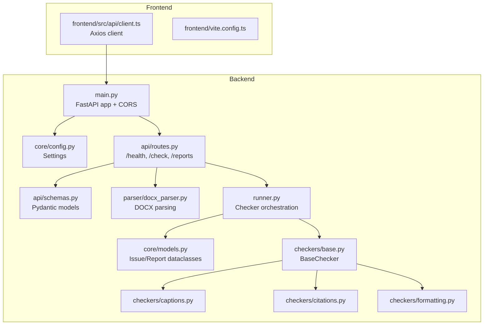
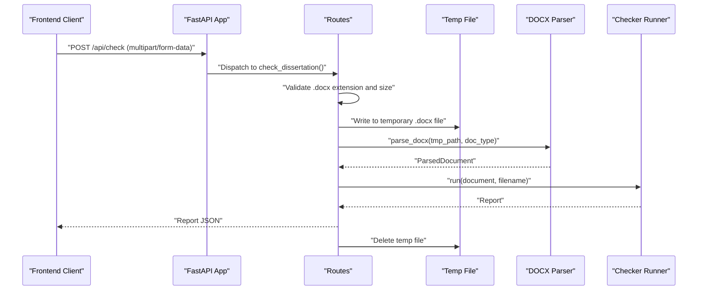
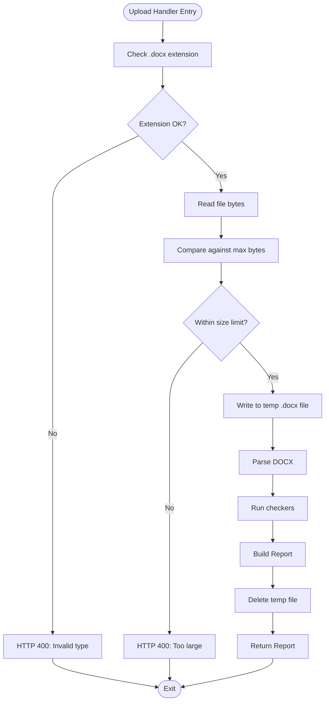
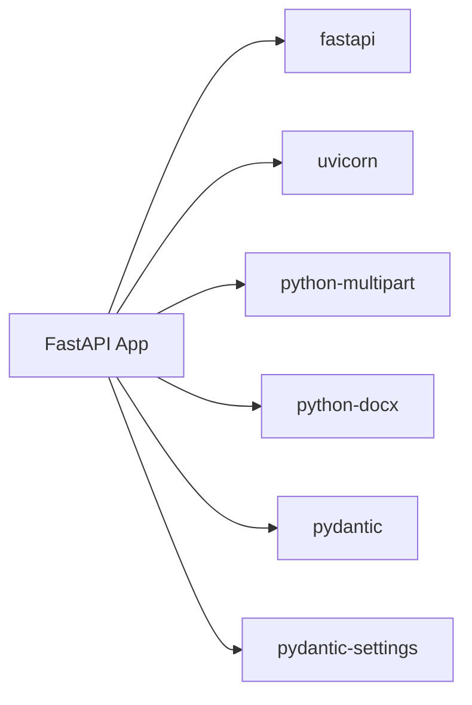

# Security and Authentication

<cite>
**Referenced Files in This Document**
- [backend/app/main.py](file://backend/app/main.py)
- [backend/app/core/config.py](file://backend/app/core/config.py)
- [backend/app/api/routes.py](file://backend/app/api/routes.py)
- [backend/app/api/schemas.py](file://backend/app/api/schemas.py)
- [backend/app/parser/docx_parser.py](file://backend/app/parser/docx_parser.py)
- [backend/app/runner.py](file://backend/app/runner.py)
- [backend/app/core/models.py](file://backend/app/core/models.py)
- [backend/app/checkers/base.py](file://backend/app/checkers/base.py)
- [backend/app/checkers/captions.py](file://backend/app/checkers/captions.py)
- [backend/app/checkers/citations.py](file://backend/app/checkers/citations.py)
- [backend/app/checkers/formatting.py](file://backend/app/checkers/formatting.py)
- [backend/pyproject.toml](file://backend/pyproject.toml)
- [frontend/src/api/client.ts](file://frontend/src/api/client.ts)
- [frontend/vite.config.ts](file://frontend/vite.config.ts)
</cite>

## Table of Contents
1. [Introduction](#introduction)
2. [Project Structure](#project-structure)
3. [Core Components](#core-components)
4. [Architecture Overview](#architecture-overview)
5. [Detailed Component Analysis](#detailed-component-analysis)
6. [Dependency Analysis](#dependency-analysis)
7. [Performance Considerations](#performance-considerations)
8. [Troubleshooting Guide](#troubleshooting-guide)
9. [Conclusion](#conclusion)
10. [Appendices](#appendices)

## Introduction
This document provides security-focused documentation for the Dissertation Checker API. It covers authentication, authorization, input validation, file handling, CORS configuration, CSRF considerations, environment-based settings, and production hardening recommendations. It also documents current implementation gaps and provides actionable mitigation strategies aligned with the existing codebase.

## Project Structure
The backend is a FastAPI application with modular components:
- Application entry and middleware configuration
- API routes for health, upload, and report retrieval
- Configuration via environment-backed settings
- Document parsing and checker orchestration
- Pydantic models for request/response validation
- Frontend client integrating with the API

**Diagram sources**
- [backend/app/main.py:1-20](file://backend/app/main.py#L1-L20)
- [backend/app/core/config.py:1-17](file://backend/app/core/config.py#L1-L17)
- [backend/app/api/routes.py:1-75](file://backend/app/api/routes.py#L1-L75)
- [backend/app/api/schemas.py:1-38](file://backend/app/api/schemas.py#L1-L38)
- [backend/app/parser/docx_parser.py:1-8](file://backend/app/parser/docx_parser.py#L1-L8)
- [backend/app/runner.py:1-25](file://backend/app/runner.py#L1-L25)
- [backend/app/core/models.py:1-58](file://backend/app/core/models.py#L1-L58)
- [backend/app/checkers/base.py:1-17](file://backend/app/checkers/base.py#L1-L17)
- [backend/app/checkers/captions.py:1-108](file://backend/app/checkers/captions.py#L1-L108)
- [backend/app/checkers/citations.py:1-11](file://backend/app/checkers/citations.py#L1-L11)
- [backend/app/checkers/formatting.py:1-11](file://backend/app/checkers/formatting.py#L1-L11)
- [frontend/src/api/client.ts:1-50](file://frontend/src/api/client.ts#L1-L50)
- [frontend/vite.config.ts:1-8](file://frontend/vite.config.ts#L1-L8)

**Section sources**
- [backend/app/main.py:1-20](file://backend/app/main.py#L1-L20)
- [backend/app/core/config.py:1-17](file://backend/app/core/config.py#L1-L17)
- [backend/app/api/routes.py:1-75](file://backend/app/api/routes.py#L1-L75)
- [frontend/src/api/client.ts:1-50](file://frontend/src/api/client.ts#L1-L50)

## Core Components
- FastAPI application with CORS middleware configured from environment settings
- Environment-driven configuration for app name, upload size limit, allowed origins, and temporary directory
- Route handlers for health, document upload (.docx only), and report retrieval
- Temporary file handling during upload and parsing
- In-memory report storage keyed by ID
- Pydantic models for typed request/response validation
- Checker orchestration pipeline for document analysis

Key security-relevant observations:
- No explicit authentication or authorization middleware is present
- File type and size validation occurs in the upload handler
- Temporary files are written and deleted in a finally block
- Reports are stored in memory without persistence or access controls
- CORS allows credentials and wildcard headers/methods

**Section sources**
- [backend/app/main.py:1-20](file://backend/app/main.py#L1-L20)
- [backend/app/core/config.py:1-17](file://backend/app/core/config.py#L1-L17)
- [backend/app/api/routes.py:1-75](file://backend/app/api/routes.py#L1-L75)
- [backend/app/api/schemas.py:1-38](file://backend/app/api/schemas.py#L1-L38)
- [backend/app/core/models.py:1-58](file://backend/app/core/models.py#L1-L58)

## Architecture Overview
The API exposes two primary endpoints:
- GET /api/health for service readiness
- POST /api/check for document analysis
- GET /api/reports/{report_id} for retrieving reports

**Diagram sources**
- [backend/app/api/routes.py:36-68](file://backend/app/api/routes.py#L36-L68)
- [backend/app/parser/docx_parser.py:5-7](file://backend/app/parser/docx_parser.py#L5-L7)
- [backend/app/runner.py:15-24](file://backend/app/runner.py#L15-L24)

## Detailed Component Analysis

### Authentication and Authorization
- Current state: No authentication or authorization middleware is configured. The application does not require tokens or sessions for accessing endpoints.
- Implications: All endpoints are publicly accessible. There is no user identity or permission enforcement.
- Recommendations:
  - Add an authentication middleware (e.g., OAuth2 with JWT, session cookies, or API keys) depending on deployment needs.
  - Enforce authorization policies at route level (e.g., per-user report isolation).
  - Implement rate limiting to prevent abuse.

**Section sources**
- [backend/app/main.py:1-20](file://backend/app/main.py#L1-L20)
- [backend/app/api/routes.py:31-74](file://backend/app/api/routes.py#L31-L74)

### CORS Configuration
- Current state: CORS allows origins from environment settings, credentials, wildcard methods, and wildcard headers.
- Implications: Enables cross-origin requests with credentials from configured origins; broad method/header allowances increase attack surface.
- Recommendations:
  - Narrow allow_origins to exact production domains.
  - Limit allow_methods and allow_headers to only what is necessary.
  - Remove allow_credentials unless strictly required; prefer token-based auth over cookies.
  - Add expose_headers and max_age as needed.

**Section sources**
- [backend/app/main.py:11-17](file://backend/app/main.py#L11-L17)
- [backend/app/core/config.py](file://backend/app/core/config.py#L9)

### CSRF Protection Considerations
- Current state: No CSRF protection is implemented. The API accepts multipart form submissions and JSON responses.
- Implications: If consumed via browser forms or embedded HTML, CSRF attacks could be possible.
- Recommendations:
  - Implement CSRF tokens for browser-based form submissions.
  - Prefer stateless APIs with tokens for AJAX/XHR requests.
  - Enforce SameSite cookies and Secure flags if using cookies.

**Section sources**
- [backend/app/api/routes.py:36-68](file://backend/app/api/routes.py#L36-L68)
- [frontend/src/api/client.ts:33-49](file://frontend/src/api/client.ts#L33-L49)

### Input Validation and Sanitization
- File type validation: Only .docx uploads are accepted.
- Size validation: Enforced via configuration-derived maximum bytes.
- Content validation: Filename is passed through to downstream components; no sanitization of filenames or metadata is performed.
- Recommendations:
  - Sanitize filenames to prevent path traversal and OS-specific issues.
  - Validate doc_type against a strict allowlist.
  - Apply schema validation for all inputs using Pydantic models.
  - Consider virus scanning and content inspection for uploaded files.

**Section sources**
- [backend/app/api/routes.py:41-50](file://backend/app/api/routes.py#L41-L50)
- [backend/app/api/schemas.py:25-37](file://backend/app/api/schemas.py#L25-L37)

### File Upload Restrictions and Temporary File Handling
- Upload restrictions:
  - Extension: .docx only
  - Size: bounded by max_upload_size_mb setting
- Temporary file handling:
  - Uses NamedTemporaryFile with delete=False, then unlinks in finally block
  - Temporary directory configurable via temp_dir setting
- Recommendations:
  - Store temp files under a dedicated, restricted directory outside application roots.
  - Use secure random suffixes and enforce umask to avoid world-readable files.
  - Consider streaming and immediate parsing to reduce disk I/O.
  - Add logging around temp file lifecycle for auditability.

**Diagram sources**
- [backend/app/api/routes.py:36-68](file://backend/app/api/routes.py#L36-L68)
- [backend/app/core/config.py:8-10](file://backend/app/core/config.py#L8-L10)

**Section sources**
- [backend/app/api/routes.py:36-68](file://backend/app/api/routes.py#L36-L68)
- [backend/app/core/config.py:8-10](file://backend/app/core/config.py#L8-L10)

### Report Storage and Access Control
- Storage: Reports are kept in-memory in a dictionary keyed by ID.
- Access: GET /api/reports/{report_id} returns the report if present.
- Security concerns:
  - No authentication or authorization for report retrieval
  - No TTL or cleanup policy for reports
  - Reports are globally accessible by ID
- Recommendations:
  - Enforce per-user ownership and access control
  - Implement TTL and periodic cleanup
  - Persist reports to a database with appropriate indexing and encryption at rest

**Section sources**
- [backend/app/api/routes.py:70-74](file://backend/app/api/routes.py#L70-L74)
- [backend/app/core/models.py:28-57](file://backend/app/core/models.py#L28-L57)

### Environment-Based Security Settings
- Available settings:
  - app_name
  - max_upload_size_mb
  - cors_origins
  - temp_dir
- Recommendations:
  - Load secrets from .env and restrict file permissions (600)
  - Avoid exposing sensitive defaults in code
  - Use distinct settings for development vs production

**Section sources**
- [backend/app/core/config.py:6-16](file://backend/app/core/config.py#L6-L16)

### Frontend Integration Security
- Client configuration:
  - API base URL from environment variable
  - Uses Axios for POST and GET requests
- Recommendations:
  - Set VITE_API_URL to HTTPS in production
  - Avoid embedding secrets in frontend bundles
  - Enforce SameSite/Lax cookies if using cookie auth

**Section sources**
- [frontend/src/api/client.ts:3-49](file://frontend/src/api/client.ts#L3-L49)
- [frontend/vite.config.ts:1-8](file://frontend/vite.config.ts#L1-L8)

## Dependency Analysis
External dependencies relevant to security:
- FastAPI and Uvicorn for ASGI server and routing
- python-multipart for multipart/form-data parsing
- python-docx for .docx parsing
- Pydantic and pydantic-settings for validation and configuration

Recommendations:
- Pin dependency versions and monitor advisories
- Use a hardened container image for deployment
- Restrict network egress and apply least-privilege policies

**Diagram sources**
- [backend/pyproject.toml:5-12](file://backend/pyproject.toml#L5-L12)

**Section sources**
- [backend/pyproject.toml:1-29](file://backend/pyproject.toml#L1-L29)

## Performance Considerations
- Current implementation writes uploaded files to disk and parses them synchronously.
- Recommendations:
  - Stream uploads and process incrementally
  - Use asynchronous workers for heavy parsing
  - Cache frequently accessed resources and normalize report queries

[No sources needed since this section provides general guidance]

## Troubleshooting Guide
Common security-related issues and mitigations:
- Excessive upload sizes leading to resource exhaustion:
  - Verify max_upload_size_mb is set appropriately
  - Consider external load balancer limits
- Temporary file leaks:
  - Ensure finally blocks execute and logs indicate cleanup
- CORS misconfiguration causing preflight failures:
  - Align allow_origins, methods, and headers with actual client needs
- Reports not found errors:
  - Confirm report_id correctness and in-memory retention window

**Section sources**
- [backend/app/api/routes.py:44-68](file://backend/app/api/routes.py#L44-L68)
- [backend/app/core/config.py:8-10](file://backend/app/core/config.py#L8-L10)

## Conclusion
The Dissertation Checker API currently lacks authentication, authorization, and robust input sanitization. While it enforces file type and size constraints and cleans up temporary files, production deployments require HTTPS enforcement, rate limiting, strict CORS, CSRF protections, and secure report storage. Implementing these safeguards will significantly improve the system’s resilience and compliance posture.

[No sources needed since this section summarizes without analyzing specific files]

## Appendices

### Production Hardening Checklist
- Enforce HTTPS/TLS termination at ingress/load balancer
- Add authentication/authorization middleware
- Implement rate limiting per IP/user
- Harden CORS: narrow origins, remove credentials if unnecessary
- Sanitize inputs and validate filenames
- Secure temp directory permissions and lifecycle
- Persist reports with access control and TTL
- Monitor and log security events
- Regularly update dependencies and scan for vulnerabilities

[No sources needed since this section provides general guidance]