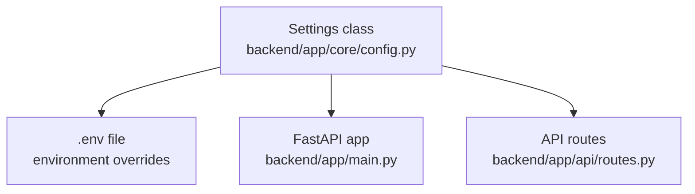
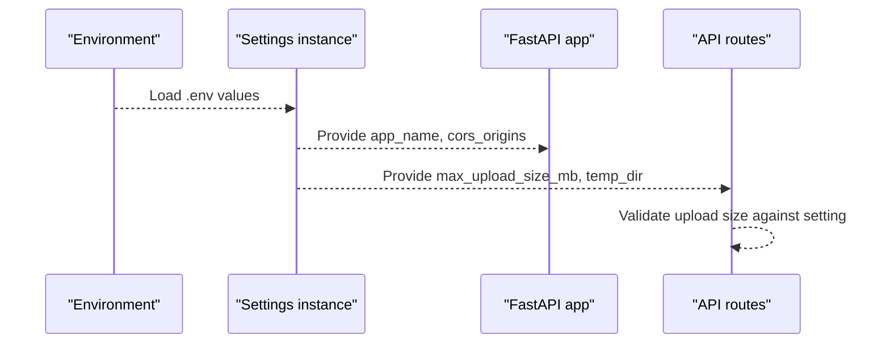
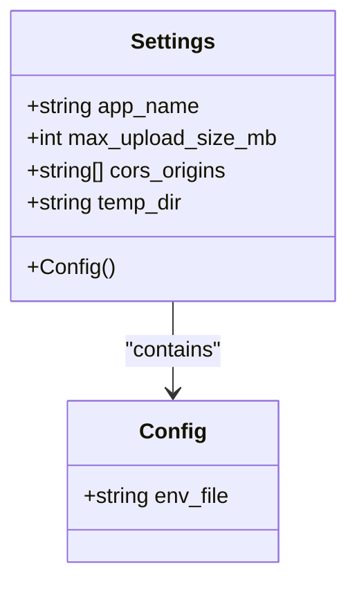
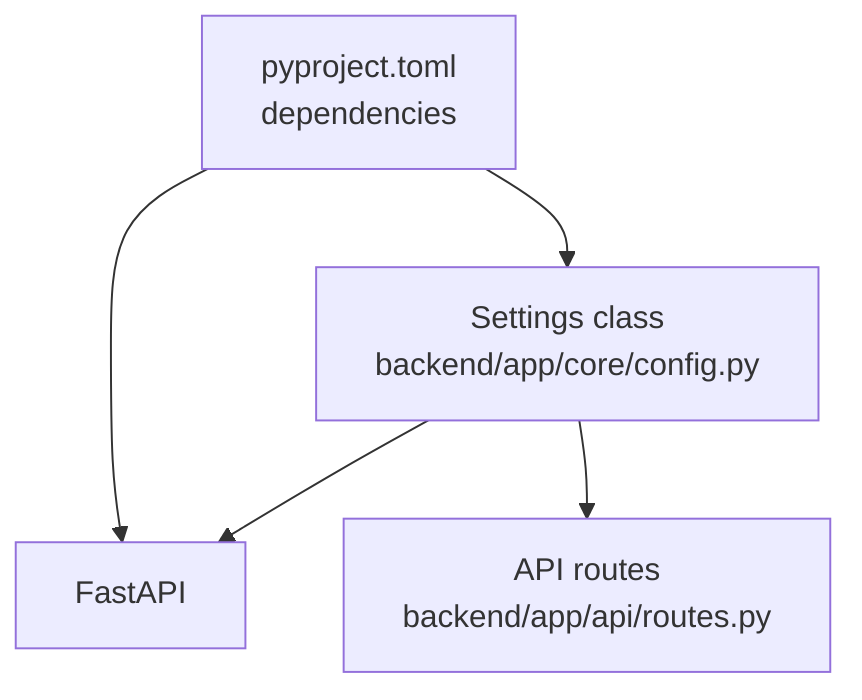

# Configuration Management

<cite>
**Referenced Files in This Document**
- [config.py](file://backend/app/core/config.py)
- [main.py](file://backend/app/main.py)
- [routes.py](file://backend/app/api/routes.py)
- [pyproject.toml](file://backend/pyproject.toml)
- [README.md](file://README.md)
</cite>

## Table of Contents
1. [Introduction](#introduction)
2. [Project Structure](#project-structure)
3. [Core Components](#core-components)
4. [Architecture Overview](#architecture-overview)
5. [Detailed Component Analysis](#detailed-component-analysis)
6. [Dependency Analysis](#dependency-analysis)
7. [Performance Considerations](#performance-considerations)
8. [Troubleshooting Guide](#troubleshooting-guide)
9. [Conclusion](#conclusion)

## Introduction
This document explains the configuration management system for the Dissertation Checker backend. It covers environment-based settings, runtime parameters, validation via Pydantic Settings, default values, and environment variable overrides. It also documents configuration options for development, testing, and production environments, along with logging configuration, feature flags, and deployment-specific settings. Examples of configuration files, environment setup, and troubleshooting common configuration issues are included.

## Project Structure
The configuration system centers around a single Pydantic Settings class that defines typed application settings and loads values from an environment file. The FastAPI application reads these settings to configure application metadata and middleware, while API routes use settings for runtime behavior such as upload size limits.

**Diagram sources**
- [config.py:1-17](file://backend/app/core/config.py#L1-L17)
- [main.py:1-20](file://backend/app/main.py#L1-L20)
- [routes.py:1-66](file://backend/app/api/routes.py#L1-L66)

**Section sources**
- [config.py:1-17](file://backend/app/core/config.py#L1-L17)
- [main.py:1-20](file://backend/app/main.py#L1-L20)
- [routes.py:1-66](file://backend/app/api/routes.py#L1-L66)

## Core Components
The configuration system is implemented as a Pydantic Settings class with the following characteristics:
- Centralized settings definition with defaults
- Environment file loading via a dedicated configuration attribute
- Runtime usage across the FastAPI application and API routes

Key settings and their roles:
- Application name: Used as the FastAPI title
- Maximum upload size (MB): Enforced in API routes to prevent oversized uploads
- CORS origins: Configures allowed origins for cross-origin requests
- Temporary directory: Path used for temporary file handling during processing

Environment variable overrides:
- Values can be overridden by environment variables when the environment file is loaded
- The environment file path is configured in the settings class configuration

Validation and defaults:
- Type hints ensure validated values at runtime
- Defaults are applied when environment variables are not set

**Section sources**
- [config.py:6-16](file://backend/app/core/config.py#L6-L16)
- [main.py:9-17](file://backend/app/main.py#L9-L17)
- [routes.py:43-49](file://backend/app/api/routes.py#L43-L49)

## Architecture Overview
The configuration architecture integrates tightly with the application lifecycle:
- Settings are instantiated once at module import
- FastAPI reads application metadata and middleware settings from the shared settings instance
- API routes enforce runtime policies using settings values

**Diagram sources**
- [config.py:12-16](file://backend/app/core/config.py#L12-L16)
- [main.py:9-17](file://backend/app/main.py#L9-L17)
- [routes.py:43-49](file://backend/app/api/routes.py#L43-L49)

## Detailed Component Analysis

### Settings Class and Environment Loading
The Settings class defines typed configuration fields with defaults and specifies the environment file location. This ensures that environment variables override defaults when present, and that all values are strongly typed at runtime.

**Diagram sources**
- [config.py:6-16](file://backend/app/core/config.py#L6-L16)

**Section sources**
- [config.py:6-16](file://backend/app/core/config.py#L6-L16)

### FastAPI Application Integration
The FastAPI application uses settings to:
- Set the application title
- Configure CORS middleware with allowed origins

This ensures that the application’s identity and cross-origin policy are aligned with configuration.

**Section sources**
- [main.py:9-17](file://backend/app/main.py#L9-L17)

### API Route Runtime Behavior
API routes use settings to:
- Enforce maximum upload size based on the configured limit
- Provide meaningful error messages when limits are exceeded

This pattern centralizes policy enforcement and makes it easy to adjust limits via environment configuration.

**Section sources**
- [routes.py:43-49](file://backend/app/api/routes.py#L43-L49)

### Environment Variable Overrides and Validation
- Environment variables override defaults when present
- Type validation occurs automatically due to Pydantic typing
- The environment file path is configured in the settings class configuration

This mechanism supports flexible deployment configurations without code changes.

**Section sources**
- [config.py:12-16](file://backend/app/core/config.py#L12-L16)

## Dependency Analysis
The configuration system depends on:
- Pydantic Settings for type-safe configuration
- FastAPI for applying settings to application metadata and middleware
- API routes for enforcing runtime policies based on settings

**Diagram sources**
- [pyproject.toml:5-11](file://backend/pyproject.toml#L5-L11)
- [config.py:3](file://backend/app/core/config.py#L3)
- [main.py:3-4](file://backend/app/main.py#L3-L4)
- [routes.py:4](file://backend/app/api/routes.py#L4)

**Section sources**
- [pyproject.toml:5-11](file://backend/pyproject.toml#L5-L11)
- [config.py:3](file://backend/app/core/config.py#L3)
- [main.py:3-4](file://backend/app/main.py#L3-L4)
- [routes.py:4](file://backend/app/api/routes.py#L4)

## Performance Considerations
- Centralized settings reduce repeated parsing and improve startup performance
- Using environment variables avoids hard-coded values and enables quick adjustments without redeployment
- Strong typing prevents runtime errors caused by misconfiguration

## Troubleshooting Guide
Common configuration issues and resolutions:
- Missing environment file: Ensure the environment file exists and is readable by the application process
- Incorrect environment variable names: Verify that environment variable names match the settings field names
- Type mismatches: Confirm that environment values match the expected types (for example, numeric values for integer fields)
- CORS policy errors: Adjust allowed origins in the environment configuration to include frontend URLs
- Upload size errors: Increase the maximum upload size value in the environment configuration when needed

Environment setup examples:
- Development: Use a local environment file with appropriate values for local testing
- Testing: Override settings via environment variables for isolated test runs
- Production: Set secure values via environment variables and avoid committing secrets to source control

**Section sources**
- [config.py:12-16](file://backend/app/core/config.py#L12-L16)
- [main.py:9-17](file://backend/app/main.py#L9-L17)
- [routes.py:43-49](file://backend/app/api/routes.py#L43-L49)

## Conclusion
The configuration management system leverages Pydantic Settings to provide a robust, type-safe, and environment-driven configuration model. It integrates seamlessly with FastAPI and API routes, enabling centralized control over application behavior, runtime policies, and deployment flexibility. By using environment files and environment variable overrides, teams can tailor behavior for development, testing, and production without code changes.