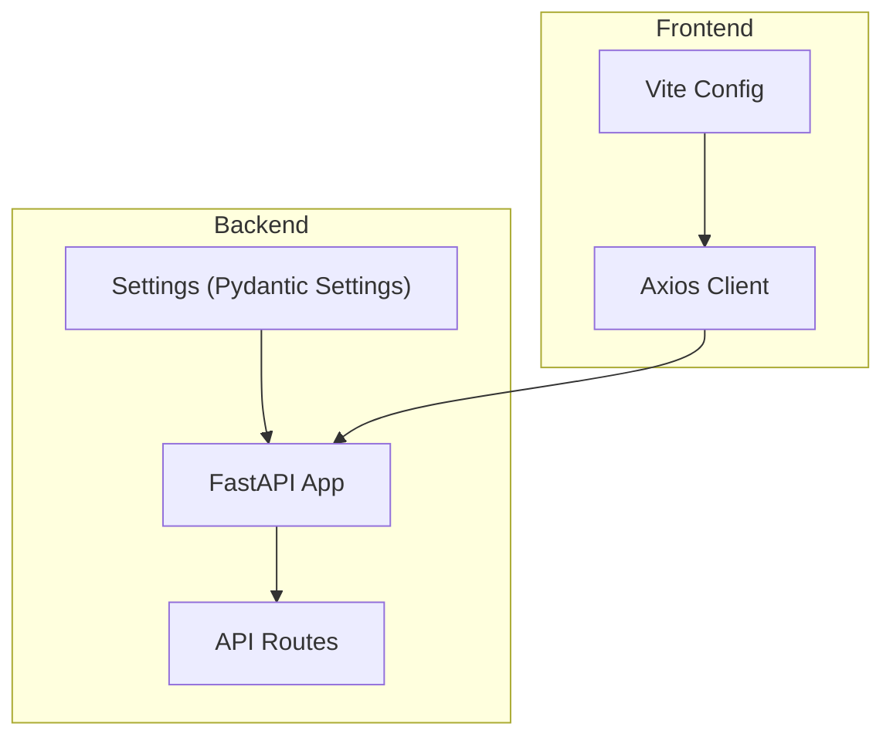
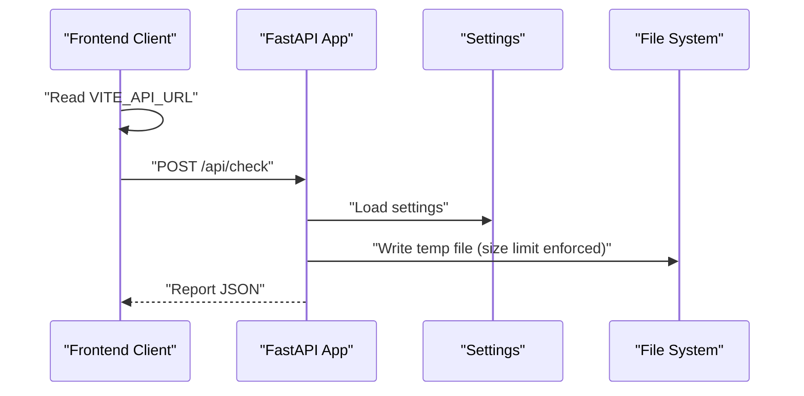
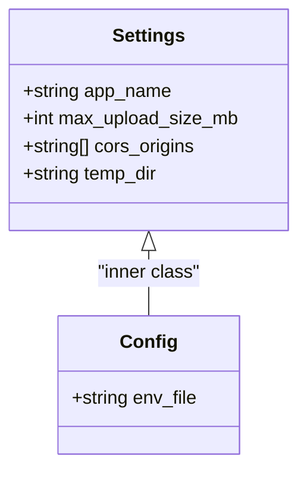
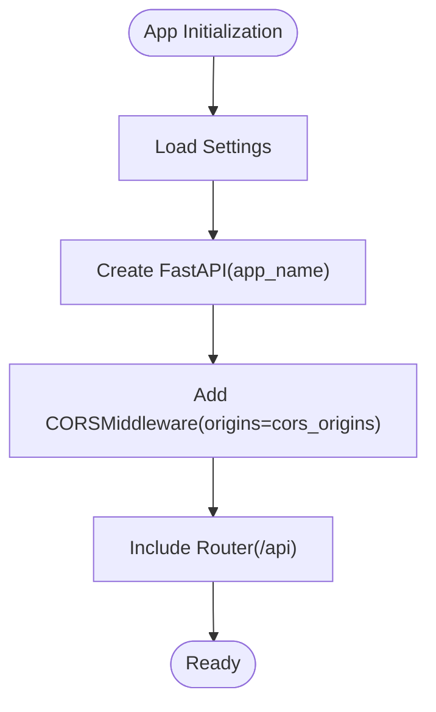
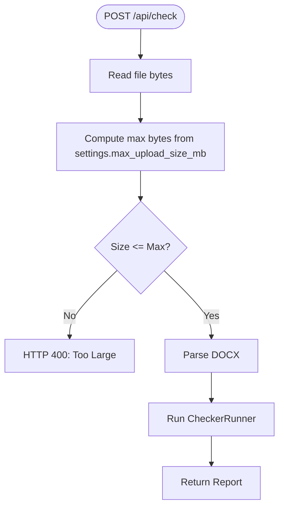
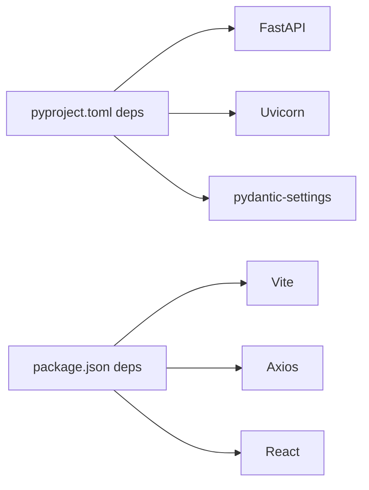

# Configuration Management

<cite>
**Referenced Files in This Document**
- [config.py](file://backend/app/core/config.py)
- [main.py](file://backend/app/main.py)
- [routes.py](file://backend/app/api/routes.py)
- [client.ts](file://frontend/src/api/client.ts)
- [vite.config.ts](file://frontend/vite.config.ts)
- [package.json](file://frontend/package.json)
- [pyproject.toml](file://backend/pyproject.toml)
- [models.py](file://backend/app/core/models.py)
- [schemas.py](file://backend/app/api/schemas.py)
- [runner.py](file://backend/app/runner.py)
</cite>

## Table of Contents
1. [Introduction](#introduction)
2. [Project Structure](#project-structure)
3. [Core Components](#core-components)
4. [Architecture Overview](#architecture-overview)
5. [Detailed Component Analysis](#detailed-component-analysis)
6. [Dependency Analysis](#dependency-analysis)
7. [Performance Considerations](#performance-considerations)
8. [Troubleshooting Guide](#troubleshooting-guide)
9. [Conclusion](#conclusion)
10. [Appendices](#appendices)

## Introduction
This document explains configuration management across the Dissertation Checker system. It covers:
- Environment-based configuration for the backend using Pydantic Settings
- FastAPI application configuration including CORS and server parameters
- Frontend configuration via Vite and environment variables
- Deployment considerations, security settings, and environment-specific overrides
- Best practices for sensitive configuration, organization, and isolation
- Validation, error handling for missing settings, and troubleshooting

## Project Structure
The configuration system spans two layers:
- Backend: Python FastAPI application with environment-driven settings
- Frontend: Vite-based React application with environment variables loaded at build/run time

**Diagram sources**
- [config.py:6-16](file://backend/app/core/config.py#L6-L16)
- [main.py:9-19](file://backend/app/main.py#L9-L19)
- [routes.py:36-50](file://backend/app/api/routes.py#L36-L50)
- [client.ts:3](file://frontend/src/api/client.ts#L3)
- [vite.config.ts:5-7](file://frontend/vite.config.ts#L5-L7)

**Section sources**
- [config.py:6-16](file://backend/app/core/config.py#L6-L16)
- [main.py:9-19](file://backend/app/main.py#L9-L19)
- [client.ts:3](file://frontend/src/api/client.ts#L3)
- [vite.config.ts:5-7](file://frontend/vite.config.ts#L5-L7)

## Core Components
- Backend Settings: Centralized configuration model with defaults and environment override support
- FastAPI App: Uses settings for title, CORS, and router registration
- Frontend Axios Client: Reads API base URL from environment variables
- Vite Config: Minimal configuration enabling React plugin

Key configuration surfaces:
- Backend settings keys: app_name, max_upload_size_mb, cors_origins, temp_dir
- Frontend environment variable: VITE_API_URL
- Build scripts and dependencies for frontend and backend

**Section sources**
- [config.py:6-16](file://backend/app/core/config.py#L6-L16)
- [main.py:9-19](file://backend/app/main.py#L9-L19)
- [client.ts:3](file://frontend/src/api/client.ts#L3)
- [vite.config.ts:5-7](file://frontend/vite.config.ts#L5-L7)
- [package.json:6-11](file://frontend/package.json#L6-L11)
- [pyproject.toml:1-29](file://backend/pyproject.toml#L1-L29)

## Architecture Overview
The configuration architecture integrates environment variables into runtime behavior across layers.

**Diagram sources**
- [client.ts:3](file://frontend/src/api/client.ts#L3)
- [main.py:9-19](file://backend/app/main.py#L9-L19)
- [config.py:6-16](file://backend/app/core/config.py#L6-L16)
- [routes.py:44-50](file://backend/app/api/routes.py#L44-L50)

## Detailed Component Analysis

### Backend Environment-Based Configuration (Pydantic Settings)
- Settings class defines strongly typed configuration with defaults
- Environment file binding: env_file = ".env"
- Access pattern: settings.<key> in application code

Behavior highlights:
- app_name drives the FastAPI title
- max_upload_size_mb controls file size enforcement
- cors_origins configures allowed origins for CORS middleware
- temp_dir is used for temporary file handling during uploads

**Diagram sources**
- [config.py:6-16](file://backend/app/core/config.py#L6-L16)

**Section sources**
- [config.py:6-16](file://backend/app/core/config.py#L6-L16)

### FastAPI Application Configuration
- Title set from settings.app_name
- CORS configured from settings.cors_origins with credentials, headers, and methods allowed
- Router mounted under /api prefix

**Diagram sources**
- [main.py:9-19](file://backend/app/main.py#L9-L19)
- [config.py:6-16](file://backend/app/core/config.py#L6-L16)

**Section sources**
- [main.py:9-19](file://backend/app/main.py#L9-L19)

### Upload Size Enforcement Using Settings
- Route enforces maximum upload size using settings.max_upload_size_mb
- Error responses returned for oversized files

**Diagram sources**
- [routes.py:36-68](file://backend/app/api/routes.py#L36-L68)
- [config.py:8](file://backend/app/core/config.py#L8)

**Section sources**
- [routes.py:36-50](file://backend/app/api/routes.py#L36-L50)

### Frontend Configuration via Vite and Environment Variables
- Vite config enables React plugin
- Frontend reads VITE_API_URL to determine API base URL
- Default fallback to http://localhost:8000/api when unset

Environment variable usage:
- VITE_API_URL controls backend endpoint address

Build and dev scripts:
- Frontend scripts include dev, build, lint, preview

**Section sources**
- [vite.config.ts:5-7](file://frontend/vite.config.ts#L5-L7)
- [client.ts:3](file://frontend/src/api/client.ts#L3)
- [package.json:6-11](file://frontend/package.json#L6-L11)

### Domain Models and Schemas Consumption of Configuration
- Models and schemas are independent of configuration; they represent data contracts
- Runner composes checkers and produces reports; does not depend on settings

**Section sources**
- [models.py:9-57](file://backend/app/core/models.py#L9-L57)
- [schemas.py:8-37](file://backend/app/api/schemas.py#L8-L37)
- [runner.py:8-24](file://backend/app/runner.py#L8-L24)

## Dependency Analysis
- Backend depends on pydantic-settings for environment loading
- Frontend depends on Vite and React ecosystem
- Runtime dependencies include FastAPI, Uvicorn, and pydantic

**Diagram sources**
- [pyproject.toml:5-12](file://backend/pyproject.toml#L5-L12)
- [package.json:12-30](file://frontend/package.json#L12-L30)

**Section sources**
- [pyproject.toml:1-29](file://backend/pyproject.toml#L1-L29)
- [package.json:1-32](file://frontend/package.json#L1-L32)

## Performance Considerations
- Keep settings minimal and centralized to reduce configuration overhead
- Avoid frequent reloads of environment variables; rely on lazy initialization via Settings
- Use conservative defaults for upload sizes to prevent memory pressure
- Ensure CORS allows only necessary origins to minimize cross-origin overhead

## Troubleshooting Guide
Common issues and resolutions:
- Missing VITE_API_URL in frontend
  - Symptom: Frontend attempts to reach http://localhost:8000/api
  - Resolution: Set VITE_API_URL to the backend endpoint
  - Section sources
    - [client.ts:3](file://frontend/src/api/client.ts#L3)

- CORS errors in browser console
  - Symptom: Preflight or blocked requests
  - Resolution: Align settings.cors_origins with frontend origin; ensure allow_credentials, allow_methods, and allow_headers match
  - Section sources
    - [main.py:11-17](file://backend/app/main.py#L11-L17)
    - [config.py:9](file://backend/app/core/config.py#L9)

- Upload size exceeded
  - Symptom: HTTP 400 error indicating file too large
  - Resolution: Increase settings.max_upload_size_mb or reduce client-side file size
  - Section sources
    - [routes.py:46-50](file://backend/app/api/routes.py#L46-L50)
    - [config.py:8](file://backend/app/core/config.py#L8)

- Backend not starting
  - Symptom: Import or dependency errors
  - Resolution: Verify pyproject.toml dependencies and virtual environment activation
  - Section sources
    - [pyproject.toml:1-29](file://backend/pyproject.toml#L1-L29)

- Frontend build failures
  - Symptom: Missing dependencies or TypeScript errors
  - Resolution: Install frontend dependencies and ensure TypeScript configuration is intact
  - Section sources
    - [package.json:1-32](file://frontend/package.json#L1-L32)

## Conclusion
The Dissertation Checker employs a clean separation of concerns for configuration:
- Backend settings are environment-driven and validated via Pydantic Settings
- FastAPI integrates settings for identity and CORS
- Frontend consumes environment variables for endpoint configuration
Adhering to the best practices outlined ensures secure, maintainable, and portable deployments across environments.

## Appendices

### Typical Configuration Scenarios and Customization Patterns
- Local development
  - Backend: .env with app_name, cors_origins including frontend origin, temp_dir for local storage
  - Frontend: VITE_API_URL=http://localhost:8000/api
  - Section sources
    - [config.py:6-16](file://backend/app/core/config.py#L6-L16)
    - [client.ts:3](file://frontend/src/api/client.ts#L3)

- Production deployment
  - Backend: Set app_name, restrict cors_origins to production domains, configure temp_dir on mounted storage
  - Frontend: Set VITE_API_URL to production API domain
  - Section sources
    - [main.py:9-19](file://backend/app/main.py#L9-L19)
    - [client.ts:3](file://frontend/src/api/client.ts#L3)

### Security and Environment Isolation
- Store secrets in .env; exclude .env from version control
- Limit CORS origins to trusted domains only
- Validate environment variables at startup if extending configuration
- Use distinct .env files per environment (local, staging, prod)

### Configuration Validation and Error Handling
- Pydantic Settings automatically validates types and loads from env_file
- For missing required environment variables, consider adding explicit checks or custom error messages
- Example pattern: initialize settings early and log effective values for debugging