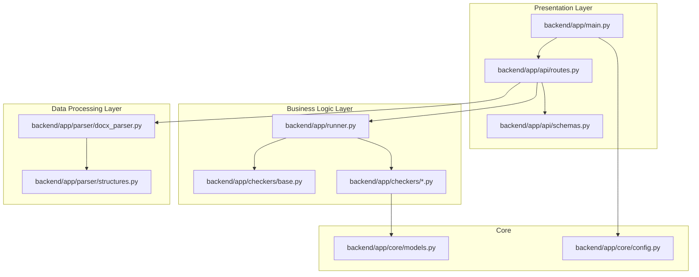
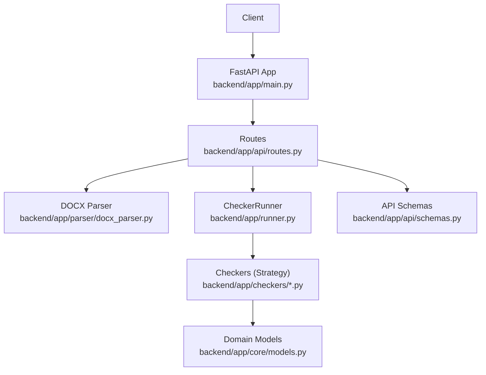
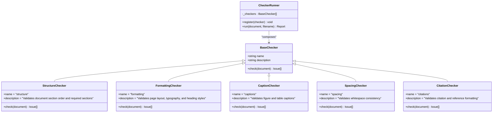
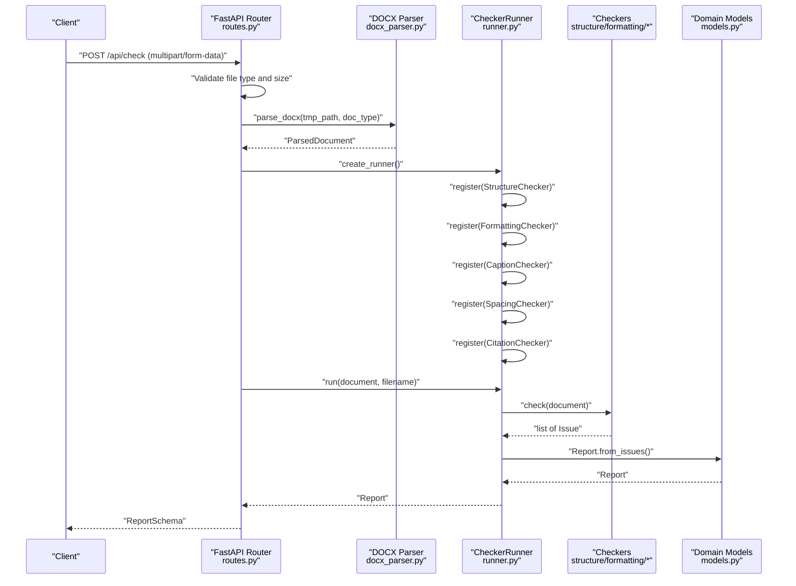
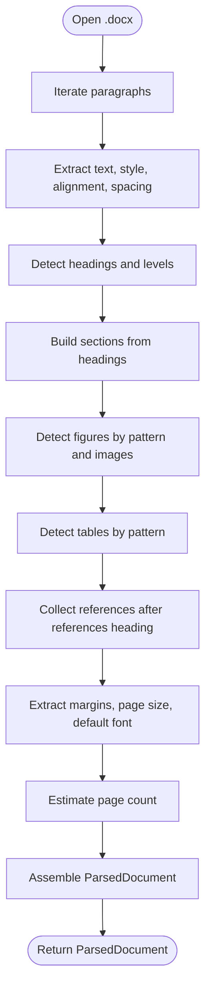
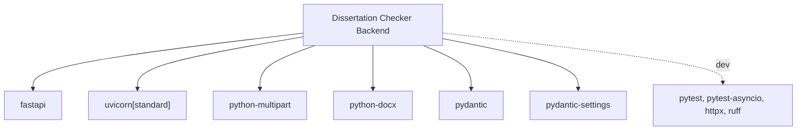

# Core Architecture

<cite>
**Referenced Files in This Document**
- [main.py](file://backend/app/main.py)
- [routes.py](file://backend/app/api/routes.py)
- [schemas.py](file://backend/app/api/schemas.py)
- [runner.py](file://backend/app/runner.py)
- [base.py](file://backend/app/checkers/base.py)
- [structure.py](file://backend/app/checkers/structure.py)
- [formatting.py](file://backend/app/checkers/formatting.py)
- [captions.py](file://backend/app/checkers/captions.py)
- [spacing.py](file://backend/app/checkers/spacing.py)
- [citations.py](file://backend/app/checkers/citations.py)
- [docx_parser.py](file://backend/app/parser/docx_parser.py)
- [structures.py](file://backend/app/parser/structures.py)
- [models.py](file://backend/app/core/models.py)
- [config.py](file://backend/app/core/config.py)
- [pyproject.toml](file://backend/pyproject.toml)
</cite>

## Table of Contents
1. [Introduction](#introduction)
2. [Project Structure](#project-structure)
3. [Core Components](#core-components)
4. [Architecture Overview](#architecture-overview)
5. [Detailed Component Analysis](#detailed-component-analysis)
6. [Dependency Analysis](#dependency-analysis)
7. [Performance Considerations](#performance-considerations)
8. [Troubleshooting Guide](#troubleshooting-guide)
9. [Conclusion](#conclusion)
10. [Appendices](#appendices)

## Introduction
This document describes the core architecture of the Dissertation Checker system. The system follows a layered architecture:
- Presentation layer built on FastAPI for HTTP endpoints and request/response modeling
- Business logic layer centered around a checker runner that orchestrates validation rules
- Data processing layer implementing a DOCX parser that converts uploaded documents into structured data

The system uses a plugin-based checker framework grounded in the Strategy pattern via a shared BaseChecker interface. Checkers are dynamically registered with the runner to produce a unified report of validation issues. The data flow moves from document upload, through parsing and validation, to report generation.

Technology stack decisions emphasize Python 3.11+, FastAPI for performance and type safety, python-docx for DOCX parsing, Pydantic for data modeling, and Pydantic Settings for configuration.

## Project Structure
The backend module organizes functionality by responsibility:
- app/main.py: FastAPI application entrypoint and middleware setup
- app/api/: HTTP routes and schemas for client interaction
- app/runner.py: Orchestrator for checker plugins
- app/checkers/: Strategy-based validation plugins (BaseChecker and concrete implementations)
- app/parser/: DOCX parsing utilities and parsed document structures
- app/core/: Domain models and configuration

**Diagram sources**
- [main.py:1-20](file://backend/app/main.py#L1-L20)
- [routes.py:1-66](file://backend/app/api/routes.py#L1-L66)
- [schemas.py:1-38](file://backend/app/api/schemas.py#L1-L38)
- [runner.py:1-25](file://backend/app/runner.py#L1-L25)
- [base.py:1-17](file://backend/app/checkers/base.py#L1-L17)
- [docx_parser.py:1-238](file://backend/app/parser/docx_parser.py#L1-L238)
- [structures.py:1-89](file://backend/app/parser/structures.py#L1-L89)
- [models.py:1-58](file://backend/app/core/models.py#L1-L58)
- [config.py:1-17](file://backend/app/core/config.py#L1-L17)

**Section sources**
- [main.py:1-20](file://backend/app/main.py#L1-L20)
- [routes.py:1-66](file://backend/app/api/routes.py#L1-L66)
- [runner.py:1-25](file://backend/app/runner.py#L1-L25)
- [docx_parser.py:1-238](file://backend/app/parser/docx_parser.py#L1-L238)
- [base.py:1-17](file://backend/app/checkers/base.py#L1-L17)
- [models.py:1-58](file://backend/app/core/models.py#L1-L58)
- [config.py:1-17](file://backend/app/core/config.py#L1-L17)

## Core Components
- FastAPI Application: Initializes CORS, registers routers, and exposes API endpoints under /api.
- API Routes: Handles file uploads, validates file size/type, parses DOCX, constructs a runner, executes checkers, and returns a structured report.
- Checker Runner: Maintains a registry of BaseChecker instances and aggregates results into a unified Report.
- BaseChecker: Defines the Strategy contract for all validation rules.
- Concrete Checkers: Implement specific validations (structure, formatting, captions, spacing, citations).
- DOCX Parser: Converts a .docx file into a strongly-typed ParsedDocument with paragraphs, sections, figures, tables, references, metadata, and properties.
- Domain Models: Define Issue, IssueLocation, and Report structures, plus Pydantic schemas for API responses.
- Configuration: Centralized settings for app name, CORS origins, max upload size, and temporary directory.

**Section sources**
- [main.py:1-20](file://backend/app/main.py#L1-L20)
- [routes.py:1-66](file://backend/app/api/routes.py#L1-L66)
- [runner.py:1-25](file://backend/app/runner.py#L1-L25)
- [base.py:1-17](file://backend/app/checkers/base.py#L1-L17)
- [structure.py:1-148](file://backend/app/checkers/structure.py#L1-L148)
- [formatting.py:1-174](file://backend/app/checkers/formatting.py#L1-L174)
- [captions.py:1-14](file://backend/app/checkers/captions.py#L1-L14)
- [spacing.py:1-14](file://backend/app/checkers/spacing.py#L1-L14)
- [citations.py:1-14](file://backend/app/checkers/citations.py#L1-L14)
- [docx_parser.py:1-238](file://backend/app/parser/docx_parser.py#L1-L238)
- [structures.py:1-89](file://backend/app/parser/structures.py#L1-L89)
- [models.py:1-58](file://backend/app/core/models.py#L1-L58)
- [schemas.py:1-38](file://backend/app/api/schemas.py#L1-L38)
- [config.py:1-17](file://backend/app/core/config.py#L1-L17)

## Architecture Overview
The system enforces a clean separation of concerns:
- Presentation: FastAPI handles HTTP requests, form parsing, and response serialization.
- Business Logic: The Runner composes and executes checkers, aggregating results into a Report.
- Data Processing: The DOCX parser transforms binary content into a normalized, typed model for downstream validators.

**Diagram sources**
- [main.py:1-20](file://backend/app/main.py#L1-L20)
- [routes.py:1-66](file://backend/app/api/routes.py#L1-L66)
- [docx_parser.py:1-238](file://backend/app/parser/docx_parser.py#L1-L238)
- [runner.py:1-25](file://backend/app/runner.py#L1-L25)
- [base.py:1-17](file://backend/app/checkers/base.py#L1-L17)
- [models.py:1-58](file://backend/app/core/models.py#L1-L58)
- [schemas.py:1-38](file://backend/app/api/schemas.py#L1-L38)

## Detailed Component Analysis

### Plugin-Based Checker System (Strategy Pattern)
The system implements a Strategy pattern via a BaseChecker interface. Each checker encapsulates a specific validation domain and adheres to the same contract. The Runner maintains a registry of checkers and iterates through them to collect issues.

**Diagram sources**
- [base.py:1-17](file://backend/app/checkers/base.py#L1-L17)
- [structure.py:1-148](file://backend/app/checkers/structure.py#L1-L148)
- [formatting.py:1-174](file://backend/app/checkers/formatting.py#L1-L174)
- [captions.py:1-14](file://backend/app/checkers/captions.py#L1-L14)
- [spacing.py:1-14](file://backend/app/checkers/spacing.py#L1-L14)
- [citations.py:1-14](file://backend/app/checkers/citations.py#L1-L14)
- [runner.py:1-25](file://backend/app/runner.py#L1-L25)

Dynamic Registration and Composition
- The Runner holds a list of BaseChecker instances.
- The Routes module creates a Runner and registers concrete checkers during request handling.
- This design allows easy addition of new checkers by subclassing BaseChecker and registering them in the Runner factory.

Extensibility Points
- Add a new checker by extending BaseChecker and implementing the check method.
- Register the new checker in the Runner factory within the routes module.
- Optionally, introduce categories and severities via the Issue model to enrich reporting.

**Section sources**
- [base.py:1-17](file://backend/app/checkers/base.py#L1-L17)
- [runner.py:1-25](file://backend/app/runner.py#L1-L25)
- [routes.py:20-27](file://backend/app/api/routes.py#L20-L27)

### Data Flow: From Upload to Report
The end-to-end flow from file upload to report generation:

**Diagram sources**
- [routes.py:35-66](file://backend/app/api/routes.py#L35-L66)
- [docx_parser.py:161-238](file://backend/app/parser/docx_parser.py#L161-L238)
- [runner.py:15-25](file://backend/app/runner.py#L15-L25)
- [structure.py:47-57](file://backend/app/checkers/structure.py#L47-L57)
- [formatting.py:15-24](file://backend/app/checkers/formatting.py#L15-L24)
- [captions.py:8-13](file://backend/app/checkers/captions.py#L8-L13)
- [spacing.py:8-13](file://backend/app/checkers/spacing.py#L8-L13)
- [citations.py:8-13](file://backend/app/checkers/citations.py#L8-L13)
- [models.py:28-58](file://backend/app/core/models.py#L28-L58)
- [schemas.py:25-34](file://backend/app/api/schemas.py#L25-L34)

### DOCX Parsing Pipeline
The parser extracts typed structures from a .docx file:
- Paragraphs: Text, style, heading detection, font info, alignment, spacing, indentation, page breaks
- Sections: Derived from headings
- Figures and Tables: Detected by localized keywords and presence of captions
- References: Extracted after recognized headings
- Properties: Margins, page dimensions, default font
- Metadata: Title, author
- Page count: Estimated from character counts

**Diagram sources**
- [docx_parser.py:161-238](file://backend/app/parser/docx_parser.py#L161-L238)
- [structures.py:6-89](file://backend/app/parser/structures.py#L6-L89)

**Section sources**
- [docx_parser.py:1-238](file://backend/app/parser/docx_parser.py#L1-L238)
- [structures.py:1-89](file://backend/app/parser/structures.py#L1-L89)

### Validation Rules and Reporting
- StructureChecker: Validates required sections, ordering, structural numbering rules, and minimum page volume thresholds per document type.
- FormattingChecker: Enforces margins, font family/size, line spacing, paragraph alignment, and heading formatting rules.
- Captions/Spacing/Citations: Placeholder checkers indicating future implementation points.

Reporting:
- Issues are aggregated into a Report with counts by severity and category.
- The ReportSchema serializes the response for clients.

**Section sources**
- [structure.py:1-148](file://backend/app/checkers/structure.py#L1-L148)
- [formatting.py:1-174](file://backend/app/checkers/formatting.py#L1-L174)
- [captions.py:1-14](file://backend/app/checkers/captions.py#L1-L14)
- [spacing.py:1-14](file://backend/app/checkers/spacing.py#L1-L14)
- [citations.py:1-14](file://backend/app/checkers/citations.py#L1-L14)
- [models.py:1-58](file://backend/app/core/models.py#L1-L58)
- [schemas.py:1-38](file://backend/app/api/schemas.py#L1-L38)

## Dependency Analysis
External dependencies and their roles:
- FastAPI and Uvicorn: Web server and ASGI framework
- python-multipart: Form parsing for file uploads
- python-docx: DOCX parsing
- Pydantic and Pydantic Settings: Data modeling and configuration
- pytest and ruff: Testing and linting for development

**Diagram sources**
- [pyproject.toml:1-29](file://backend/pyproject.toml#L1-L29)

**Section sources**
- [pyproject.toml:1-29](file://backend/pyproject.toml#L1-L29)

## Performance Considerations
- I/O Bound Operations: DOCX parsing and file uploads dominate runtime. Optimize by:
  - Streaming uploads and minimizing disk writes
  - Reusing temporary directories and cleaning up promptly
- CPU Bound Operations: Validation loops iterate over paragraphs and sections. Optimize by:
  - Early exits in checks when conditions fail
  - Using efficient string operations and precompiled patterns
- Concurrency: FastAPI/Uvicorn supports async; current routes are synchronous. Consider:
  - Making parser and checker operations async-friendly
  - Offloading heavy computations to worker processes or threads
- Scalability:
  - Stateless design enables horizontal scaling behind a load balancer
  - Keep parsers and runners stateless; persist reports externally if needed
  - Use containerization and orchestration for auto-scaling based on request volume

[No sources needed since this section provides general guidance]

## Troubleshooting Guide
Common issues and resolutions:
- File Type Errors: Ensure uploads are .docx; the route rejects other types.
- File Size Exceeded: Adjust max upload size in settings; the route enforces a configurable limit.
- Parsing Errors: Verify DOCX validity; errors during parsing surface as unprocessable entity.
- Temporary File Cleanup: The route ensures temporary files are removed after processing.

Operational checks:
- Health endpoint: GET /api/health returns a simple status payload.
- CORS: Origins configured in settings must include frontend origin.

**Section sources**
- [routes.py:35-66](file://backend/app/api/routes.py#L35-L66)
- [config.py:1-17](file://backend/app/core/config.py#L1-L17)

## Conclusion
The Dissertation Checker employs a layered architecture with clear separation between presentation, business logic, and data processing. The plugin-based checker system, grounded in the Strategy pattern, enables modular and extensible validation. The DOCX parser provides a robust, typed representation of documents, feeding into a flexible validation pipeline that aggregates results into a standardized report. With careful attention to I/O and CPU bottlenecks, and by leveraging asynchronous and distributed computing patterns, the system can scale to serve multiple concurrent users while remaining maintainable and extensible.

[No sources needed since this section summarizes without analyzing specific files]

## Appendices

### Technology Stack Decisions
- FastAPI: Strong typing, automatic OpenAPI docs, excellent async support
- python-docx: Mature, reliable DOCX parsing library
- Pydantic: Robust data validation and serialization
- Pydantic Settings: Environment-driven configuration
- Ruff: Fast linting and formatting
- Pytest: Test automation and fixtures

**Section sources**
- [pyproject.toml:1-29](file://backend/pyproject.toml#L1-L29)