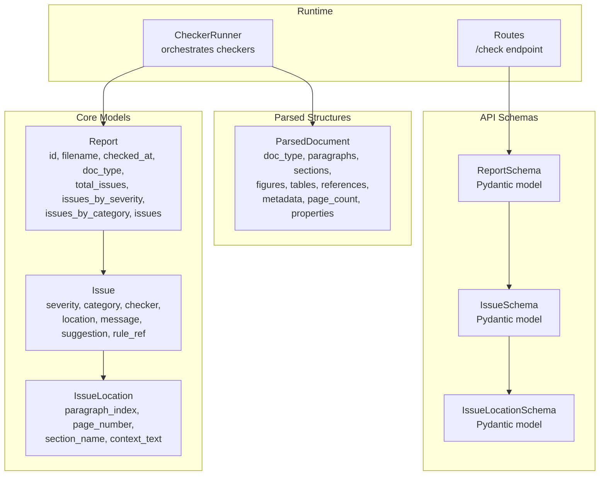
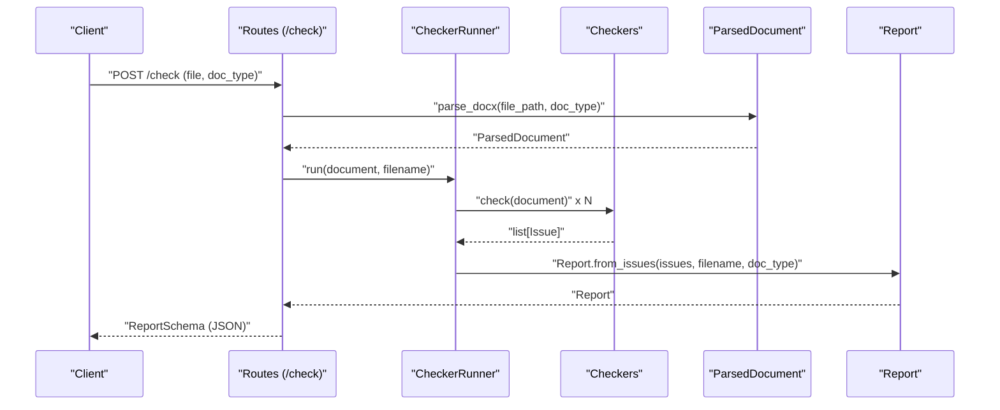
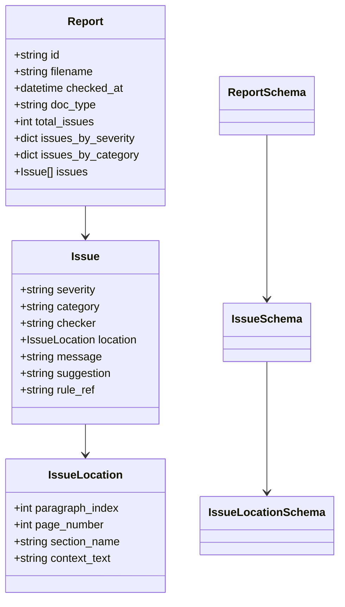
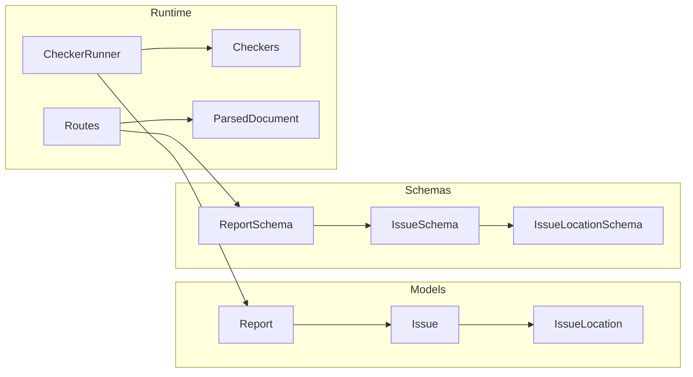

# Data Models and Schemas

<cite>
**Referenced Files in This Document**
- [models.py](file://backend/app/core/models.py)
- [schemas.py](file://backend/app/api/schemas.py)
- [structures.py](file://backend/app/parser/structures.py)
- [routes.py](file://backend/app/api/routes.py)
- [runner.py](file://backend/app/runner.py)
- [base.py](file://backend/app/checkers/base.py)
- [config.py](file://backend/app/core/config.py)
- [README.md](file://README.md)
</cite>

## Table of Contents
1. [Introduction](#introduction)
2. [Project Structure](#project-structure)
3. [Core Components](#core-components)
4. [Architecture Overview](#architecture-overview)
5. [Detailed Component Analysis](#detailed-component-analysis)
6. [Dependency Analysis](#dependency-analysis)
7. [Performance Considerations](#performance-considerations)
8. [Troubleshooting Guide](#troubleshooting-guide)
9. [Conclusion](#conclusion)

## Introduction
This document describes the data models and schemas used by the Dissertation Checker to represent validation issues, reporting results, and precise location information within documents. It explains the Issue model with severity levels and corrective suggestions, the Report structure with compliance metrics, and the Location model for pinpointing issues. It also documents the Pydantic schemas used for API validation and serialization, outlines relationships between models, and provides examples of serialized structures and common use cases.

## Project Structure
The data model layer is organized around three primary concerns:
- Domain models: core Issue, Report, and IssueLocation entities
- API schemas: Pydantic models for request/response validation and serialization
- Parsed document structures: models representing the parsed DOCX content

**Diagram sources**
- [models.py:17-58](file://backend/app/core/models.py#L17-L58)
- [schemas.py:8-38](file://backend/app/api/schemas.py#L8-L38)
- [structures.py:77-89](file://backend/app/parser/structures.py#L77-L89)
- [runner.py:8-25](file://backend/app/runner.py#L8-L25)
- [routes.py:35-66](file://backend/app/api/routes.py#L35-L66)

**Section sources**
- [README.md:160-195](file://README.md#L160-L195)
- [models.py:1-58](file://backend/app/core/models.py#L1-L58)
- [schemas.py:1-38](file://backend/app/api/schemas.py#L1-L38)
- [structures.py:1-89](file://backend/app/parser/structures.py#L1-L89)
- [runner.py:1-25](file://backend/app/runner.py#L1-L25)
- [routes.py:1-66](file://backend/app/api/routes.py#L1-L66)

## Core Components
This section documents the central data structures and their roles in the system.

- Issue: Represents a single validation finding with severity, category, originating checker, precise location, human-readable message, suggested correction, and optional rule reference.
- IssueLocation: Encodes the precise location of an issue within a document, including paragraph index, page number, section name, and contextual text snippet.
- Report: Aggregates all issues into a structured compliance report with counts and distributions by severity and category, plus document metadata.
- Pydantic schemas: Strongly-typed API models mirroring the domain models for validation and serialization.

Key characteristics:
- Severity levels are constrained to "error", "warning", or "info".
- Locations optionally include paragraph_index, page_number, section_name, and context_text.
- Reports are constructed from a list of issues and automatically compute totals and counts.

**Section sources**
- [models.py:17-58](file://backend/app/core/models.py#L17-L58)
- [schemas.py:8-38](file://backend/app/api/schemas.py#L8-L38)

## Architecture Overview
The system transforms a DOCX document into a structured representation, runs multiple checkers to produce issues, aggregates them into a Report, and exposes it via a Pydantic schema for API consumption.

**Diagram sources**
- [routes.py:35-66](file://backend/app/api/routes.py#L35-L66)
- [runner.py:15-25](file://backend/app/runner.py#L15-L25)
- [base.py:9-17](file://backend/app/checkers/base.py#L9-L17)
- [structures.py:77-89](file://backend/app/parser/structures.py#L77-L89)
- [models.py:28-58](file://backend/app/core/models.py#L28-L58)
- [schemas.py:25-38](file://backend/app/api/schemas.py#L25-L38)

## Detailed Component Analysis

### Issue Model
The Issue model captures a single validation finding with:
- severity: One of "error", "warning", "info"
- category: Logical grouping of the issue (e.g., "formatting", "structure", "captions")
- checker: Name of the checker that produced the issue
- location: IssueLocation describing where the issue occurs
- message: Human-readable description of the issue
- suggestion: Actionable recommendation to fix the issue
- rule_ref: Optional reference to the applicable GOST rule section

Validation rules and constraints:
- Severity is restricted to the enumerated literal values.
- Message and suggestion are free-form strings intended for UI presentation.
- rule_ref is optional and defaults to empty string.

Common use cases:
- Formatting violations (font, spacing, margins)
- Structural issues (missing sections, incorrect order)
- Caption problems (missing captions, wrong placement, non-sequential numbering)

**Section sources**
- [models.py:17-26](file://backend/app/core/models.py#L17-L26)
- [schemas.py:15-23](file://backend/app/api/schemas.py#L15-L23)

### IssueLocation Model
IssueLocation enables precise pinpointing of issues:
- paragraph_index: Zero-based index of the paragraph containing the issue
- page_number: Page number where the issue appears
- section_name: Name of the section (e.g., "Contents", "Introduction")
- context_text: Short text snippet providing context around the issue

Usage patterns:
- paragraph_index and context_text are frequently populated for inline formatting issues.
- section_name helps categorize structural issues by document section.
- page_number is useful for navigation and printing.

**Section sources**
- [models.py:9-15](file://backend/app/core/models.py#L9-L15)
- [schemas.py:8-13](file://backend/app/api/schemas.py#L8-L13)

### Report Model
Report aggregates validation outcomes:
- id: Unique identifier for the report
- filename: Original uploaded file name
- checked_at: UTC timestamp when the check completed
- doc_type: Document type (e.g., "thesis_science", "thesis_humanities", "project")
- total_issues: Total number of issues
- issues_by_severity: Counts of issues grouped by severity ("error", "warning", "info")
- issues_by_category: Counts of issues grouped by category
- issues: List of Issue objects

Construction:
- Report.from_issues computes counts and distributions from a list of Issue objects and sets id, checked_at, and related metadata.

Business constraints:
- Severity counts default to zero for missing severities.
- Categories are dynamically counted from the provided issues.

**Section sources**
- [models.py:28-58](file://backend/app/core/models.py#L28-L58)

### Pydantic Schemas for API Validation
The API layer defines Pydantic schemas that mirror the domain models for robust validation and serialization:
- IssueLocationSchema mirrors IssueLocation with the same fields and defaults.
- IssueSchema mirrors Issue with severity constrained to the same literal values and suggestion defaulted to empty string.
- ReportSchema mirrors Report with all fields required for API responses.
- HealthResponse provides a lightweight health check payload.

Validation behavior:
- Fields are validated according to their types and constraints.
- Optional fields are handled gracefully during deserialization.
- Serialization produces JSON suitable for frontend consumption.

**Section sources**
- [schemas.py:8-38](file://backend/app/api/schemas.py#L8-L38)

### Relationship Between Models and Runtime Flow
- ParsedDocument is produced by the DOCX parser and passed to checkers.
- Each checker returns a list of Issue objects.
- CheckerRunner aggregates issues and constructs a Report.
- Routes return ReportSchema for the /check endpoint.

**Diagram sources**
- [models.py:9-58](file://backend/app/core/models.py#L9-L58)
- [schemas.py:8-38](file://backend/app/api/schemas.py#L8-L38)

**Section sources**
- [runner.py:8-25](file://backend/app/runner.py#L8-L25)
- [base.py:9-17](file://backend/app/checkers/base.py#L9-L17)
- [routes.py:35-66](file://backend/app/api/routes.py#L35-L66)

## Dependency Analysis
The following diagram shows how models and schemas depend on each other and on runtime components:

**Diagram sources**
- [models.py:17-58](file://backend/app/core/models.py#L17-L58)
- [schemas.py:8-38](file://backend/app/api/schemas.py#L8-L38)
- [runner.py:8-25](file://backend/app/runner.py#L8-L25)
- [routes.py:35-66](file://backend/app/api/routes.py#L35-L66)
- [structures.py:77-89](file://backend/app/parser/structures.py#L77-L89)

**Section sources**
- [runner.py:1-25](file://backend/app/runner.py#L1-L25)
- [routes.py:1-66](file://backend/app/api/routes.py#L1-L66)
- [structures.py:1-89](file://backend/app/parser/structures.py#L1-L89)

## Performance Considerations
- Report aggregation is O(n) in the number of issues, where n is the total number of findings across all checkers.
- IssueLocation fields are optional; including paragraph_index and context_text improves UI navigation but adds minimal overhead.
- Pydantic validation is efficient for typical report sizes; avoid sending extremely large reports to clients if bandwidth is constrained.

## Troubleshooting Guide
Common issues and resolutions:
- Missing severity values: Ensure severity is one of "error", "warning", "info".
- Empty suggestions: Provide actionable suggestions in checkers; default to empty string in schemas is acceptable for API responses.
- Large uploads: The server enforces a maximum upload size; adjust settings if needed.
- Incorrect locations: Verify that paragraph_index and context_text are populated by checkers for accurate UI rendering.

Operational checks:
- Health endpoint: Use GET /api/health to verify service availability.
- Upload constraints: Only .docx files are accepted; ensure clients upload the correct format.
- Size limits: Exceeding the configured maximum upload size triggers a 400 error.

**Section sources**
- [routes.py:30-66](file://backend/app/api/routes.py#L30-L66)
- [config.py:6-17](file://backend/app/core/config.py#L6-L17)

## Conclusion
The Dissertation Checker’s data model layer cleanly separates domain entities (Issue, IssueLocation, Report) from API schemas (Pydantic models) while maintaining strong validation and serialization guarantees. The models support precise issue localization, clear severity and category semantics, and structured compliance reporting aligned with GOST 7.32-2017 requirements. Together with the runtime orchestration, they enable reliable, user-friendly validation feedback.