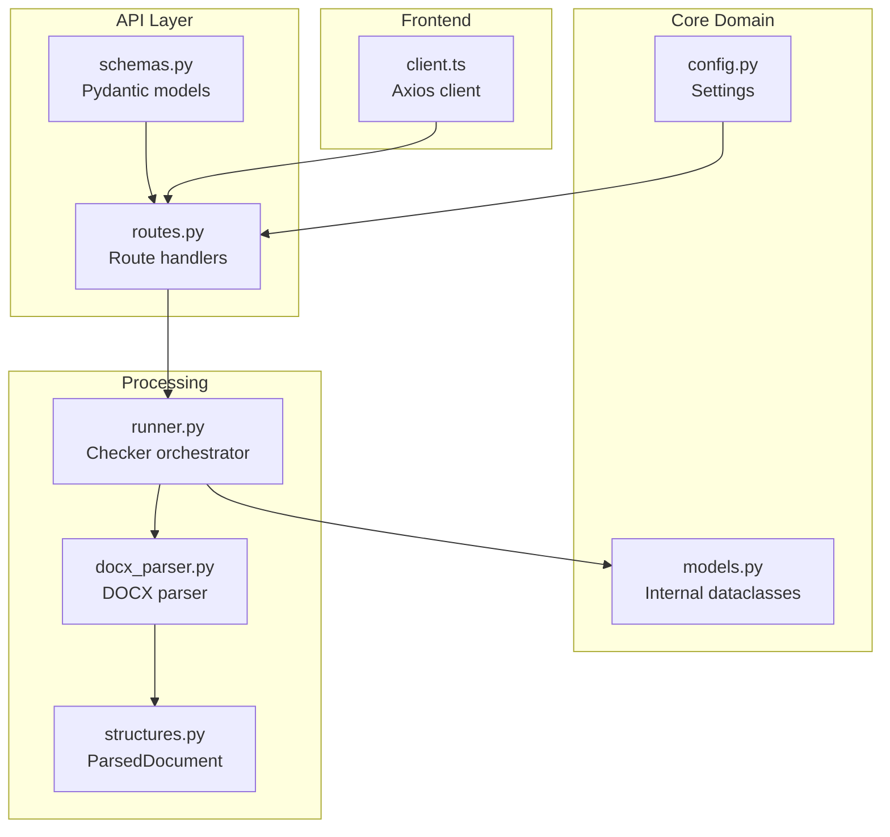
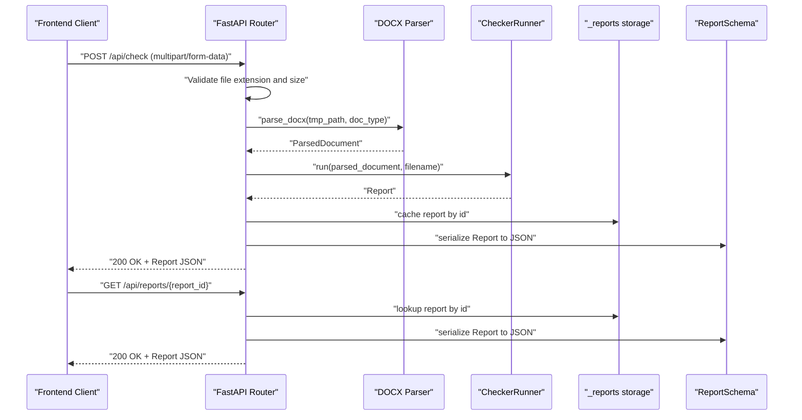
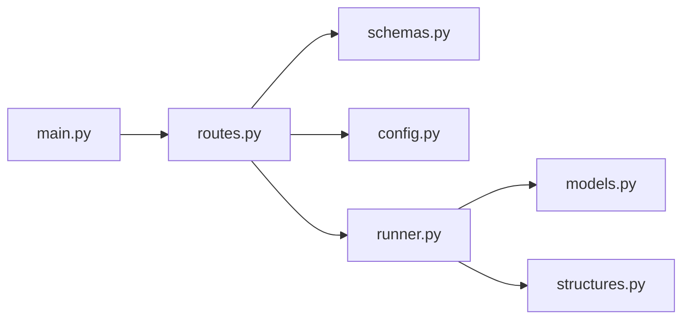

# API Request/Response Schemas

<cite>
**Referenced Files in This Document**
- [schemas.py](file://backend/app/api/schemas.py)
- [routes.py](file://backend/app/api/routes.py)
- [models.py](file://backend/app/core/models.py)
- [main.py](file://backend/app/main.py)
- [config.py](file://backend/app/core/config.py)
- [runner.py](file://backend/app/runner.py)
- [docx_parser.py](file://backend/app/parser/docx_parser.py)
- [structures.py](file://backend/app/parser/structures.py)
- [client.ts](file://frontend/src/api/client.ts)
- [base.py](file://backend/app/checkers/base.py)
</cite>

## Table of Contents
1. [Introduction](#introduction)
2. [Project Structure](#project-structure)
3. [Core Components](#core-components)
4. [Architecture Overview](#architecture-overview)
5. [Detailed Component Analysis](#detailed-component-analysis)
6. [Dependency Analysis](#dependency-analysis)
7. [Performance Considerations](#performance-considerations)
8. [Troubleshooting Guide](#troubleshooting-guide)
9. [Conclusion](#conclusion)
10. [Appendices](#appendices)

## Introduction
This document describes the API schemas that handle external communication in the Dissertation Checker system. It focuses on the Pydantic models used for request validation, response formatting, and data serialization. The schemas define the contract for document upload requests, validation responses, and report retrieval endpoints. It explains field validation rules, type checking mechanisms, and error handling patterns. It also documents the relationship between internal domain models and external API representations, serialization/deserialization patterns, data transformation between layers, and schema evolution strategies. Finally, it explains how these schemas ensure data integrity and support frontend integration patterns.

## Project Structure
The API schemas and related components are organized as follows:
- API layer: request/response schemas and route handlers
- Core domain models: internal representation of issues, reports, and parsed documents
- Runner and parsers: orchestrate checks and transform raw DOCX into structured data
- Frontend client: consumes the API and expects the same schema shapes

**Diagram sources**
- [schemas.py:1-38](file://backend/app/api/schemas.py#L1-L38)
- [routes.py:1-75](file://backend/app/api/routes.py#L1-L75)
- [models.py:1-58](file://backend/app/core/models.py#L1-L58)
- [runner.py:1-25](file://backend/app/runner.py#L1-L25)
- [docx_parser.py:1-8](file://backend/app/parser/docx_parser.py#L1-L8)
- [structures.py:1-89](file://backend/app/parser/structures.py#L1-L89)
- [client.ts:1-50](file://frontend/src/api/client.ts#L1-L50)
- [config.py:1-17](file://backend/app/core/config.py#L1-L17)

**Section sources**
- [main.py:1-20](file://backend/app/main.py#L1-L20)
- [routes.py:1-75](file://backend/app/api/routes.py#L1-L75)
- [schemas.py:1-38](file://backend/app/api/schemas.py#L1-L38)
- [models.py:1-58](file://backend/app/core/models.py#L1-L58)
- [runner.py:1-25](file://backend/app/runner.py#L1-L25)
- [docx_parser.py:1-8](file://backend/app/parser/docx_parser.py#L1-L8)
- [structures.py:1-89](file://backend/app/parser/structures.py#L1-L89)
- [client.ts:1-50](file://frontend/src/api/client.ts#L1-L50)
- [config.py:1-17](file://backend/app/core/config.py#L1-L17)

## Core Components
This section documents the primary Pydantic models used for API communication and their roles in request validation and response formatting.

- IssueLocationSchema: Defines the location context for an issue, including paragraph index, page number, section name, and surrounding context text.
- IssueSchema: Encapsulates a single issue found during validation, including severity, category, checker name, location, message, suggested fix, and optional rule reference.
- ReportSchema: Aggregates validation results, including identifiers, metadata, timestamps, counts, and lists of issues.
- HealthResponse: Lightweight health check response.

These models ensure strong typing and automatic serialization/deserialization for HTTP endpoints.

**Section sources**
- [schemas.py:8-37](file://backend/app/api/schemas.py#L8-L37)

## Architecture Overview
The API layer exposes two primary endpoints:
- GET /api/health: Returns a health status payload.
- POST /api/check: Accepts a DOCX file and a document type, validates the document, and returns a ReportSchema.
- GET /api/reports/{report_id}: Retrieves a previously generated report by ID.

The request flow:
1. Frontend uploads a file and selects a document type.
2. Backend validates file type and size, writes to a temporary file, parses the DOCX, runs checkers, and returns a serialized ReportSchema.
3. Frontend retrieves the report by ID.

**Diagram sources**
- [routes.py:31-75](file://backend/app/api/routes.py#L31-L75)
- [docx_parser.py:5-8](file://backend/app/parser/docx_parser.py#L5-L8)
- [runner.py:15-24](file://backend/app/runner.py#L15-L24)
- [schemas.py:25-34](file://backend/app/api/schemas.py#L25-L34)

## Detailed Component Analysis

### IssueLocationSchema
Purpose:
- Provides structured location information for an issue, including optional indices and contextual text.

Validation and types:
- paragraph_index: integer or null
- page_number: integer or null
- section_name: string or null
- context_text: string (default empty)

Serialization:
- Automatically serialized/deserialized by Pydantic.

**Section sources**
- [schemas.py:8-13](file://backend/app/api/schemas.py#L8-L13)

### IssueSchema
Purpose:
- Represents a single validation finding with severity, category, checker identity, location, message, suggestion, and optional rule reference.

Validation and types:
- severity: literal enum with allowed values
- category: string
- checker: string
- location: IssueLocationSchema
- message: string
- suggestion: string
- rule_ref: string (default empty)

Serialization:
- Nested IssueLocationSchema is embedded automatically.

**Section sources**
- [schemas.py:15-23](file://backend/app/api/schemas.py#L15-L23)

### ReportSchema
Purpose:
- Aggregates validation results for a document, including counts, distributions, and the list of issues.

Validation and types:
- id: string
- filename: string
- checked_at: datetime
- doc_type: string
- total_issues: integer
- issues_by_severity: dictionary mapping severity to integer counts
- issues_by_category: dictionary mapping category to integer counts
- issues: list of IssueSchema

Serialization:
- List of IssueSchema items is serialized recursively.

**Section sources**
- [schemas.py:25-34](file://backend/app/api/schemas.py#L25-L34)

### HealthResponse
Purpose:
- Lightweight endpoint for service health checks.

Validation and types:
- status: string (default "ok")

**Section sources**
- [schemas.py:36-38](file://backend/app/api/schemas.py#L36-L38)

### Route Handlers and Validation Rules
Endpoints:
- GET /api/health: Returns HealthResponse.
- POST /api/check: Validates file type (.docx) and size, parses DOCX, runs checkers, caches report, and returns ReportSchema.
- GET /api/reports/{report_id}: Returns cached ReportSchema or raises 404.

Validation rules:
- File type: Only .docx files are accepted.
- File size: Enforced via settings.max_upload_size_mb.
- Parsing errors: Returned as 422 Unprocessable Entity with a descriptive message.
- Report retrieval: 404 Not Found if report id is missing.

Error handling patterns:
- HTTPException with explicit status codes and messages for invalid inputs and missing resources.
- Temporary file cleanup in a finally block.

**Section sources**
- [routes.py:31-75](file://backend/app/api/routes.py#L31-L75)
- [config.py:6-17](file://backend/app/core/config.py#L6-L17)

### Relationship Between Internal Domain Models and External API Representations
Internal models:
- IssueLocation, Issue, Report are Python dataclasses used internally by the runner and checkers.

External API representations:
- IssueLocationSchema, IssueSchema, ReportSchema are Pydantic models used for API serialization.

Mapping:
- The runner constructs internal Report objects and populates counts and lists.
- FastAPI’s response_model automatically serializes the Report into ReportSchema for the HTTP response.
- The frontend expects the same shape as ReportSchema.

Implications:
- Strong typing ensures consistent serialization.
- Pydantic’s automatic validation enforces schema compliance on the wire.

**Section sources**
- [models.py:9-58](file://backend/app/core/models.py#L9-L58)
- [runner.py:15-24](file://backend/app/runner.py#L15-L24)
- [schemas.py:25-34](file://backend/app/api/schemas.py#L25-L34)

### Serialization and Deserialization Patterns
- Incoming request bodies:
  - multipart/form-data with file and doc_type form fields.
  - FastAPI binds UploadFile and Form parameters automatically.
- Outgoing responses:
  - response_model=ReportSchema triggers Pydantic serialization.
  - Datetime fields are serialized to ISO format strings.
- Frontend consumption:
  - Axios client expects Report and Issue shapes aligned with the API schemas.

Data transformation:
- DOCX parsing produces a ParsedDocument used by checkers.
- Checkers produce internal Issue objects aggregated into a Report.
- ReportSchema mirrors Report for transport.

**Section sources**
- [routes.py:36-68](file://backend/app/api/routes.py#L36-L68)
- [client.ts:33-50](file://frontend/src/api/client.ts#L33-L50)
- [docx_parser.py:5-8](file://backend/app/parser/docx_parser.py#L5-L8)
- [runner.py:15-24](file://backend/app/runner.py#L15-L24)

### Schema Evolution Strategies
Recommended approaches:
- Add optional fields with defaults to preserve backward compatibility.
- Use Literal unions for enums to prevent invalid values.
- Keep nested structures consistent across versions; rename fields carefully.
- Version the API (e.g., /api/v1/) when breaking changes are necessary.
- Maintain separate frontend interfaces that mirror backend schemas to avoid drift.

[No sources needed since this section provides general guidance]

### Frontend Integration Patterns
The frontend client aligns with the API schemas:
- IssueLocation and Issue interfaces match IssueLocationSchema and IssueSchema.
- Report interface matches ReportSchema.
- The client posts multipart/form-data and retrieves reports by id.

This alignment simplifies integration and reduces runtime mismatches.

**Section sources**
- [client.ts:5-31](file://frontend/src/api/client.ts#L5-L31)
- [schemas.py:8-34](file://backend/app/api/schemas.py#L8-L34)

## Dependency Analysis
Key dependencies and relationships:
- routes.py depends on schemas.py for response_model types and on settings for upload limits.
- runner.py depends on core models and parser structures to build Report objects.
- main.py wires the router under /api and applies CORS middleware.

**Diagram sources**
- [routes.py:1-75](file://backend/app/api/routes.py#L1-L75)
- [schemas.py:1-38](file://backend/app/api/schemas.py#L1-L38)
- [runner.py:1-25](file://backend/app/runner.py#L1-L25)
- [models.py:1-58](file://backend/app/core/models.py#L1-L58)
- [structures.py:1-89](file://backend/app/parser/structures.py#L1-L89)
- [main.py:1-20](file://backend/app/main.py#L1-L20)

**Section sources**
- [routes.py:1-75](file://backend/app/api/routes.py#L1-L75)
- [runner.py:1-25](file://backend/app/runner.py#L1-L25)
- [main.py:1-20](file://backend/app/main.py#L1-L20)

## Performance Considerations
- File size limits: Enforced early to prevent memory pressure and disk I/O overhead.
- Temporary file handling: Ensures cleanup even on exceptions.
- In-memory caching: Reports stored in memory for quick retrieval; consider persistence for production.
- Serialization cost: Pydantic serialization is efficient; keep nested lists concise.

[No sources needed since this section provides general guidance]

## Troubleshooting Guide
Common issues and resolutions:
- Invalid file type:
  - Symptom: 400 Bad Request with a message indicating only .docx files are accepted.
  - Resolution: Ensure the uploaded file has a .docx extension.
- File too large:
  - Symptom: 400 Bad Request with a message indicating maximum allowed size.
  - Resolution: Reduce file size or adjust settings.max_upload_size_mb.
- Parsing errors:
  - Symptom: 422 Unprocessable Entity with a descriptive message.
  - Resolution: Verify DOCX integrity and supported content.
- Report not found:
  - Symptom: 404 Not Found when retrieving a report by id.
  - Resolution: Ensure the report was generated and the id is correct.

**Section sources**
- [routes.py:41-50](file://backend/app/api/routes.py#L41-L50)
- [routes.py:63-64](file://backend/app/api/routes.py#L63-L64)
- [routes.py:72-74](file://backend/app/api/routes.py#L72-L74)

## Conclusion
The API schemas in the Dissertation Checker system provide a robust contract for external communication. Pydantic models enforce strict typing, automatic serialization, and consistent data structures across the request/response pipeline. The separation between internal domain models and external API representations enables clean abstractions while maintaining data integrity. Together with route-level validation and error handling, these schemas support reliable frontend integration and scalable evolution strategies.

## Appendices

### Endpoint Definitions and Payloads
- GET /api/health
  - Response: HealthResponse
  - Example: {"status": "ok"}

- POST /api/check
  - Request: multipart/form-data
    - file: UploadFile (.docx)
    - doc_type: string (default "thesis_science")
  - Response: ReportSchema
  - Example response fields:
    - id: string
    - filename: string
    - checked_at: datetime (ISO string)
    - doc_type: string
    - total_issues: integer
    - issues_by_severity: object mapping severity to count
    - issues_by_category: object mapping category to count
    - issues: array of Issue entries

- GET /api/reports/{report_id}
  - Path parameter: report_id (string)
  - Response: ReportSchema
  - Example response: Same as POST /api/check

**Section sources**
- [routes.py:31-75](file://backend/app/api/routes.py#L31-L75)
- [schemas.py:25-34](file://backend/app/api/schemas.py#L25-L34)
- [schemas.py:36-38](file://backend/app/api/schemas.py#L36-L38)

### Validation Rules Summary
- Severity enum: Must be one of "error", "warning", "info".
- File type: Must be ".docx".
- File size: Must not exceed settings.max_upload_size_mb.
- Report id: Must exist in cache for retrieval.

**Section sources**
- [schemas.py:16](file://backend/app/api/schemas.py#L16)
- [routes.py:41-50](file://backend/app/api/routes.py#L41-L50)
- [config.py:8](file://backend/app/core/config.py#L8)