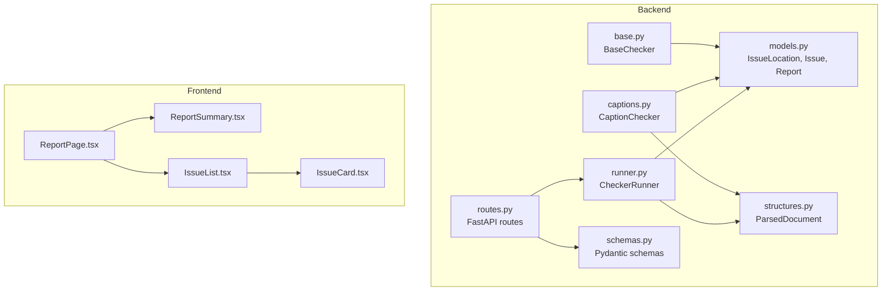
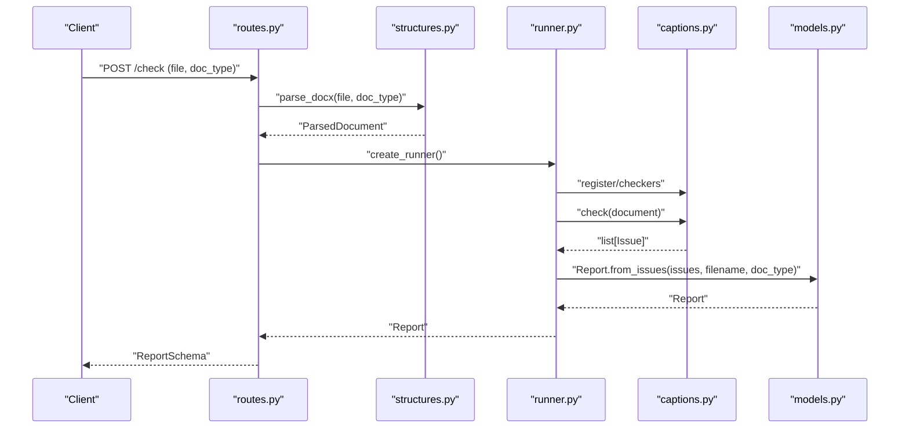
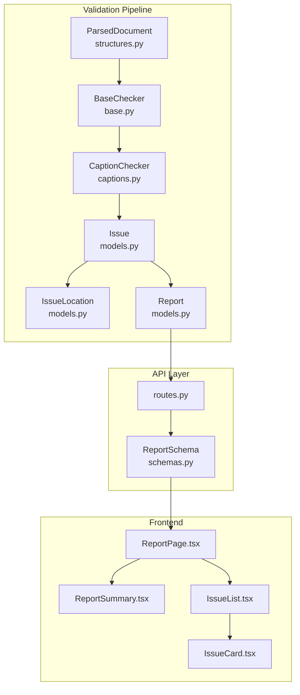
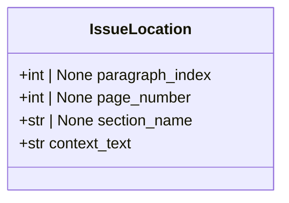
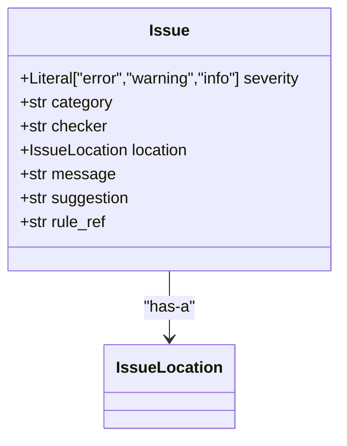
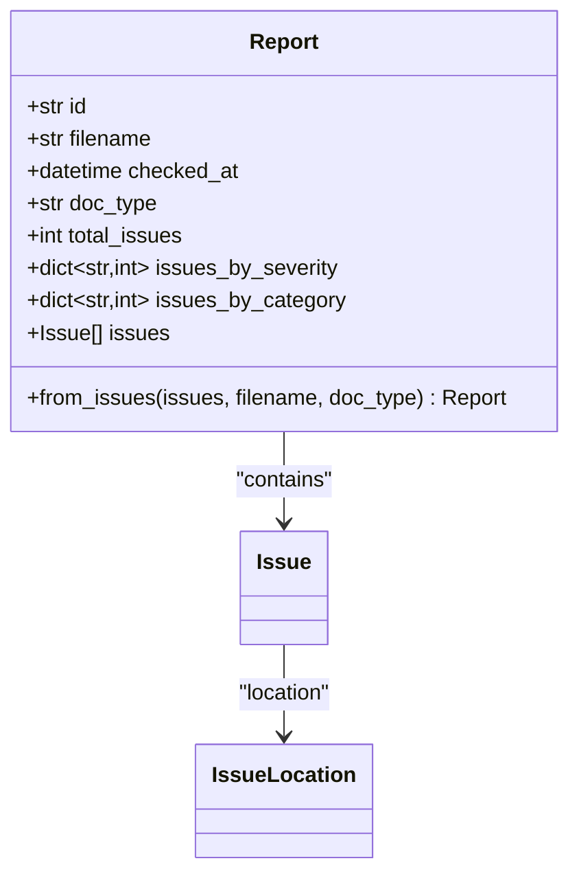
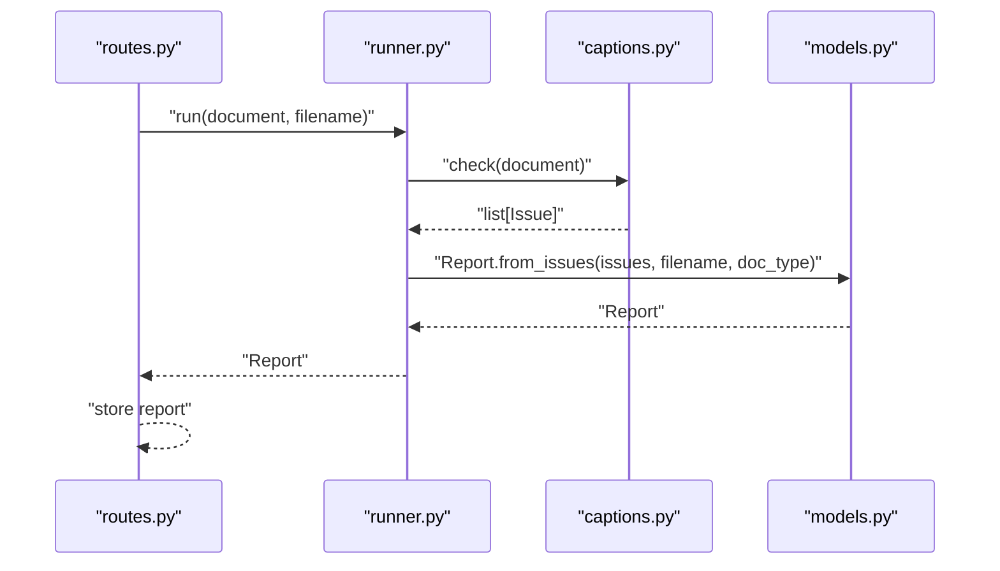
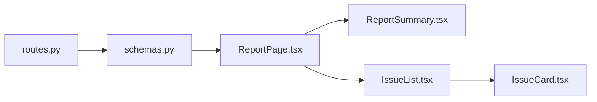
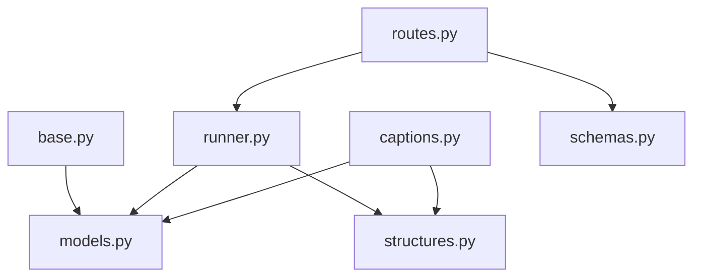

# Core Domain Models

<cite>
**Referenced Files in This Document**
- [models.py](file://backend/app/core/models.py)
- [routes.py](file://backend/app/api/routes.py)
- [schemas.py](file://backend/app/api/schemas.py)
- [runner.py](file://backend/app/runner.py)
- [base.py](file://backend/app/checkers/base.py)
- [captions.py](file://backend/app/checkers/captions.py)
- [structures.py](file://backend/app/parser/structures.py)
- [ReportPage.tsx](file://frontend/src/pages/ReportPage.tsx)
- [IssueList.tsx](file://frontend/src/components/IssueList.tsx)
- [IssueCard.tsx](file://frontend/src/components/IssueCard.tsx)
- [ReportSummary.tsx](file://frontend/src/components/ReportSummary.tsx)
</cite>

## Table of Contents
1. [Introduction](#introduction)
2. [Project Structure](#project-structure)
3. [Core Components](#core-components)
4. [Architecture Overview](#architecture-overview)
5. [Detailed Component Analysis](#detailed-component-analysis)
6. [Dependency Analysis](#dependency-analysis)
7. [Performance Considerations](#performance-considerations)
8. [Troubleshooting Guide](#troubleshooting-guide)
9. [Conclusion](#conclusion)

## Introduction
This document describes the core domain models that underpin the Dissertation Checker system: IssueLocation, Issue, and Report. These models define the structure and semantics of validation results, enabling consistent reporting across checkers and the user interface. The documentation explains field definitions, relationships, immutability patterns, UUID generation, and datetime handling, and demonstrates how these models support the validation workflow and report generation process.

## Project Structure
The domain models live in the backend core module and are consumed by checkers, the runner, API routes, and the frontend components. The following diagram shows how these pieces fit together.

**Diagram sources**
- [models.py:1-58](file://backend/app/core/models.py#L1-L58)
- [runner.py:1-25](file://backend/app/runner.py#L1-L25)
- [base.py:1-17](file://backend/app/checkers/base.py#L1-L17)
- [captions.py:1-108](file://backend/app/checkers/captions.py#L1-L108)
- [schemas.py:1-38](file://backend/app/api/schemas.py#L1-L38)
- [routes.py:1-75](file://backend/app/api/routes.py#L1-L75)
- [structures.py:1-89](file://backend/app/parser/structures.py#L1-L89)
- [ReportPage.tsx:1-36](file://frontend/src/pages/ReportPage.tsx#L1-L36)
- [ReportSummary.tsx:1-45](file://frontend/src/components/ReportSummary.tsx#L1-L45)
- [IssueList.tsx:1-42](file://frontend/src/components/IssueList.tsx#L1-L42)
- [IssueCard.tsx:1-53](file://frontend/src/components/IssueCard.tsx#L1-L53)

**Section sources**
- [models.py:1-58](file://backend/app/core/models.py#L1-L58)
- [runner.py:1-25](file://backend/app/runner.py#L1-L25)
- [routes.py:1-75](file://backend/app/api/routes.py#L1-L75)
- [structures.py:1-89](file://backend/app/parser/structures.py#L1-L89)
- [ReportPage.tsx:1-36](file://frontend/src/pages/ReportPage.tsx#L1-L36)
- [ReportSummary.tsx:1-45](file://frontend/src/components/ReportSummary.tsx#L1-L45)
- [IssueList.tsx:1-42](file://frontend/src/components/IssueList.tsx#L1-L42)
- [IssueCard.tsx:1-53](file://frontend/src/components/IssueCard.tsx#L1-L53)

## Core Components
This section documents the three core domain models and their roles.

- IssueLocation: Encapsulates the spatial and contextual information for where an issue occurs.
- Issue: Represents a single validation finding with severity, category, checker attribution, and textual guidance.
- Report: Aggregates all issues into a structured report with counts, timestamps, and identifiers.

Key characteristics:
- Immutability pattern: Defined as dataclasses, these models are intended for immutable use after construction.
- UUID generation: Reports receive a unique identifier generated at creation time.
- Datetime handling: Reports capture a UTC timestamp upon creation.
- Factory method: Report provides a static factory method to build reports from a list of issues.

**Section sources**
- [models.py:9-57](file://backend/app/core/models.py#L9-L57)

## Architecture Overview
The validation workflow transforms a parsed document into a report via registered checkers. The sequence below maps the actual code paths.

**Diagram sources**
- [routes.py:36-68](file://backend/app/api/routes.py#L36-L68)
- [runner.py:15-24](file://backend/app/runner.py#L15-L24)
- [captions.py:12-16](file://backend/app/checkers/captions.py#L12-L16)
- [structures.py:78-89](file://backend/app/parser/structures.py#L78-L89)
- [models.py:39-57](file://backend/app/core/models.py#L39-L57)

## Detailed Component Analysis

### IssueLocation
Purpose:
- Provides precise location and context for an issue within the document.

Fields:
- paragraph_index: Optional integer indicating the paragraph index where the issue resides.
- page_number: Optional integer indicating the page number.
- section_name: Optional string identifying the section name.
- context_text: String containing surrounding context text; defaults to empty string.

Usage:
- Constructed by checkers to anchor each Issue to a location within the parsed document.

Immutability:
- As a dataclass, typical usage treats fields as immutable after initialization.

**Section sources**
- [models.py:10-14](file://backend/app/core/models.py#L10-L14)
- [captions.py:24-35](file://backend/app/checkers/captions.py#L24-L35)
- [captions.py:39-50](file://backend/app/checkers/captions.py#L39-L50)
- [captions.py:79-90](file://backend/app/checkers/captions.py#L79-L90)
- [captions.py:94-105](file://backend/app/checkers/captions.py#L94-L105)

### Issue
Purpose:
- Encapsulates a single validation finding with severity, category, and guidance.

Fields:
- severity: Literal string constrained to "error", "warning", or "info".
- category: String grouping related issues (e.g., "captions").
- checker: String identifying the checker that produced the issue.
- location: IssueLocation instance describing the issue's location.
- message: Human-readable description of the issue.
- suggestion: Actionable recommendation to resolve the issue.
- rule_ref: Optional string referencing a specific rule or section.

Usage:
- Created by individual checkers during validation and aggregated into a Report.

Immutability:
- As a dataclass, typical usage treats fields as immutable after initialization.

**Section sources**
- [models.py:18-25](file://backend/app/core/models.py#L18-L25)
- [captions.py:24-35](file://backend/app/checkers/captions.py#L24-L35)
- [captions.py:39-50](file://backend/app/checkers/captions.py#L39-L50)
- [captions.py:79-90](file://backend/app/checkers/captions.py#L79-L90)
- [captions.py:94-105](file://backend/app/checkers/captions.py#L94-L105)

### Report
Purpose:
- Aggregates validation results into a single, immutable report with counts and metadata.

Fields:
- id: Unique string identifier generated at report creation.
- filename: Original uploaded filename.
- checked_at: UTC datetime marking when the report was created.
- doc_type: Document type string (e.g., thesis type).
- total_issues: Integer count of all issues.
- issues_by_severity: Dictionary mapping severity to counts.
- issues_by_category: Dictionary mapping category to counts.
- issues: List of Issue instances.

Factory method:
- from_issues(issues, filename, doc_type): Computes counts, generates UUID, captures UTC timestamp, and constructs a Report.

Immutability:
- As a dataclass, typical usage treats fields as immutable after initialization.

UUID and datetime:
- UUID is generated via uuid.uuid4() and stored as a string.
- Timestamp is captured via datetime.utcnow().

**Section sources**
- [models.py:29-57](file://backend/app/core/models.py#L29-L57)
- [runner.py:15-24](file://backend/app/runner.py#L15-L24)

## Architecture Overview
The following diagram shows how the domain models integrate with the validation pipeline and frontend rendering.

**Diagram sources**
- [structures.py:78-89](file://backend/app/parser/structures.py#L78-L89)
- [base.py:9-16](file://backend/app/checkers/base.py#L9-L16)
- [captions.py:12-73](file://backend/app/checkers/captions.py#L12-L73)
- [models.py:18-57](file://backend/app/core/models.py#L18-L57)
- [routes.py:36-68](file://backend/app/api/routes.py#L36-L68)
- [schemas.py:25-33](file://backend/app/api/schemas.py#L25-L33)
- [ReportPage.tsx:1-36](file://frontend/src/pages/ReportPage.tsx#L1-L36)
- [ReportSummary.tsx:13-44](file://frontend/src/components/ReportSummary.tsx#L13-L44)
- [IssueList.tsx:9-41](file://frontend/src/components/IssueList.tsx#L9-L41)
- [IssueCard.tsx:13-52](file://frontend/src/components/IssueCard.tsx#L13-L52)

## Detailed Component Analysis

### IssueLocation Class

- Used by Issue to describe location.
- Constructed with optional fields; context_text defaults to empty string.

**Diagram sources**
- [models.py:10-14](file://backend/app/core/models.py#L10-L14)

**Section sources**
- [models.py:10-14](file://backend/app/core/models.py#L10-L14)
- [captions.py:24-35](file://backend/app/checkers/captions.py#L24-L35)
- [captions.py:39-50](file://backend/app/checkers/captions.py#L39-L50)
- [captions.py:79-90](file://backend/app/checkers/captions.py#L79-L90)
- [captions.py:94-105](file://backend/app/checkers/captions.py#L94-L105)

### Issue Class

- Severity constrained to a literal type.
- Includes rule reference for traceability.

**Diagram sources**
- [models.py:18-25](file://backend/app/core/models.py#L18-L25)
- [models.py:10-14](file://backend/app/core/models.py#L10-L14)

**Section sources**
- [models.py:18-25](file://backend/app/core/models.py#L18-L25)
- [captions.py:24-35](file://backend/app/checkers/captions.py#L24-L35)
- [captions.py:39-50](file://backend/app/checkers/captions.py#L39-L50)
- [captions.py:79-90](file://backend/app/checkers/captions.py#L79-L90)
- [captions.py:94-105](file://backend/app/checkers/captions.py#L94-L105)

### Report Class and Factory Method

- Factory method computes severity and category distributions and sets metadata.

**Diagram sources**
- [models.py:29-57](file://backend/app/core/models.py#L29-L57)
- [models.py:18-25](file://backend/app/core/models.py#L18-L25)
- [models.py:10-14](file://backend/app/core/models.py#L10-L14)

**Section sources**
- [models.py:29-57](file://backend/app/core/models.py#L29-L57)
- [runner.py:15-24](file://backend/app/runner.py#L15-L24)

### Validation Workflow and Report Generation

**Diagram sources**
- [routes.py:58-62](file://backend/app/api/routes.py#L58-L62)
- [runner.py:15-24](file://backend/app/runner.py#L15-L24)
- [captions.py:12-16](file://backend/app/checkers/captions.py#L12-L16)
- [models.py:39-57](file://backend/app/core/models.py#L39-L57)

**Section sources**
- [routes.py:36-68](file://backend/app/api/routes.py#L36-L68)
- [runner.py:15-24](file://backend/app/runner.py#L15-L24)
- [captions.py:12-73](file://backend/app/checkers/captions.py#L12-L73)
- [models.py:39-57](file://backend/app/core/models.py#L39-L57)

### Frontend Consumption of Report Data

- The frontend consumes the report for display and filtering.

**Diagram sources**
- [routes.py:36-68](file://backend/app/api/routes.py#L36-L68)
- [schemas.py:25-33](file://backend/app/api/schemas.py#L25-L33)
- [ReportPage.tsx:10-35](file://frontend/src/pages/ReportPage.tsx#L10-L35)
- [ReportSummary.tsx:13-44](file://frontend/src/components/ReportSummary.tsx#L13-L44)
- [IssueList.tsx:9-41](file://frontend/src/components/IssueList.tsx#L9-L41)
- [IssueCard.tsx:13-52](file://frontend/src/components/IssueCard.tsx#L13-L52)

**Section sources**
- [ReportPage.tsx:1-36](file://frontend/src/pages/ReportPage.tsx#L1-L36)
- [ReportSummary.tsx:1-45](file://frontend/src/components/ReportSummary.tsx#L1-L45)
- [IssueList.tsx:1-42](file://frontend/src/components/IssueList.tsx#L1-L42)
- [IssueCard.tsx:1-53](file://frontend/src/components/IssueCard.tsx#L1-L53)

## Dependency Analysis
The following diagram shows how the domain models relate to each other and to external components.

**Diagram sources**
- [models.py:1-58](file://backend/app/core/models.py#L1-L58)
- [runner.py:1-25](file://backend/app/runner.py#L1-L25)
- [base.py:1-17](file://backend/app/checkers/base.py#L1-L17)
- [captions.py:1-108](file://backend/app/checkers/captions.py#L1-L108)
- [schemas.py:1-38](file://backend/app/api/schemas.py#L1-L38)
- [routes.py:1-75](file://backend/app/api/routes.py#L1-L75)
- [structures.py:1-89](file://backend/app/parser/structures.py#L1-L89)

**Section sources**
- [models.py:1-58](file://backend/app/core/models.py#L1-L58)
- [runner.py:1-25](file://backend/app/runner.py#L1-L25)
- [routes.py:1-75](file://backend/app/api/routes.py#L1-L75)
- [structures.py:1-89](file://backend/app/parser/structures.py#L1-L89)

## Performance Considerations
- Aggregation cost: Report.from_issues iterates through all issues once to compute severity and category counts. This is O(n) and efficient for typical report sizes.
- Immutability: Using dataclasses avoids mutation overhead and simplifies concurrent access.
- UUID generation: Per-report UUID generation is negligible compared to validation costs.
- Datetime handling: UTC timestamps avoid timezone conversion overhead.

## Troubleshooting Guide
Common issues and resolutions:
- Missing location context: Ensure IssueLocation.context_text is populated when available to aid user comprehension.
- Incorrect severity values: Verify that severity is one of "error", "warning", or "info" to prevent downstream validation errors.
- Empty categories: Confirm that category strings are non-empty to maintain meaningful aggregations.
- Report ID collisions: The factory method generates a UUID per report; collisions are extremely unlikely but ensure uniqueness in storage/backends.
- Timestamp anomalies: Reports capture UTC time; confirm server timezone settings to avoid confusion.

**Section sources**
- [models.py:39-57](file://backend/app/core/models.py#L39-L57)
- [captions.py:24-35](file://backend/app/checkers/captions.py#L24-L35)
- [captions.py:39-50](file://backend/app/checkers/captions.py#L39-L50)
- [captions.py:79-90](file://backend/app/checkers/captions.py#L79-L90)
- [captions.py:94-105](file://backend/app/checkers/captions.py#L94-L105)

## Conclusion
The IssueLocation, Issue, and Report models form a cohesive domain layer that supports robust validation workflows and clear reporting. Their immutability, explicit typing, and factory-driven construction enable reliable composition across checkers, the runner, API routes, and the frontend. Together, they provide a strong foundation for building additional checkers and extending report capabilities.