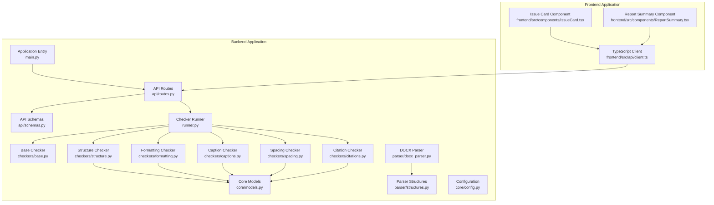
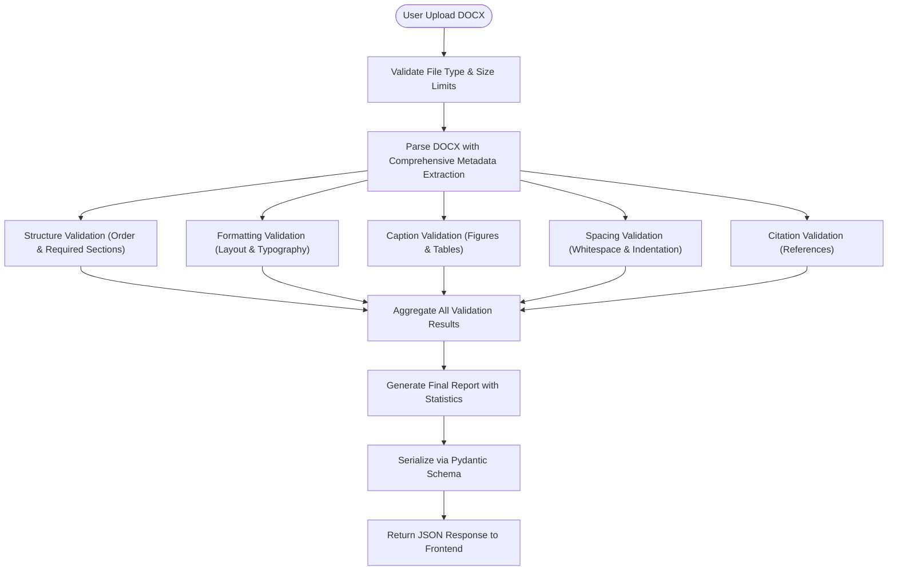
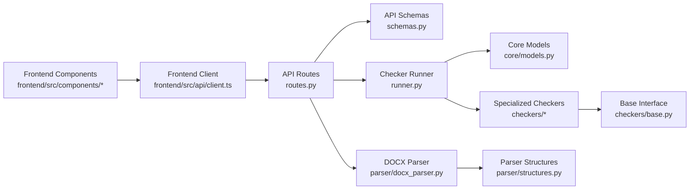

# Data Models and Schemas

<cite>
**Referenced Files in This Document**
- [models.py](file://backend/app/core/models.py)
- [structures.py](file://backend/app/parser/structures.py)
- [schemas.py](file://backend/app/api/schemas.py)
- [routes.py](file://backend/app/api/routes.py)
- [client.ts](file://frontend/src/api/client.ts)
- [IssueCard.tsx](file://frontend/src/components/IssueCard.tsx)
- [ReportSummary.tsx](file://frontend/src/components/ReportSummary.tsx)
- [runner.py](file://backend/app/runner.py)
- [base.py](file://backend/app/checkers/base.py)
- [captions.py](file://backend/app/checkers/captions.py)
- [formatting.py](file://backend/app/checkers/formatting.py)
- [spacing.py](file://backend/app/checkers/spacing.py)
- [structure.py](file://backend/app/checkers/structure.py)
- [citations.py](file://backend/app/checkers/citations.py)
- [docx_parser.py](file://backend/app/parser/docx_parser.py)
- [config.py](file://backend/app/core/config.py)
- [main.py](file://backend/app/main.py)
</cite>

## Update Summary
**Changes Made**
- Enhanced data model documentation with comprehensive validation structures
- Added detailed coverage of all five checker implementations (structure, formatting, captions, spacing, citations)
- Expanded API schema documentation with complete Pydantic model specifications
- Updated frontend interface documentation with TypeScript type definitions
- Added comprehensive field validation rules and business constraints
- Enhanced serialization/deserialization patterns documentation
- Updated architecture diagrams to reflect complete system integration

## Table of Contents
1. [Introduction](#introduction)
2. [Project Structure](#project-structure)
3. [Core Components](#core-components)
4. [Architecture Overview](#architecture-overview)
5. [Detailed Component Analysis](#detailed-component-analysis)
6. [Dependency Analysis](#dependency-analysis)
7. [Performance Considerations](#performance-considerations)
8. [Troubleshooting Guide](#troubleshooting-guide)
9. [Conclusion](#conclusion)
10. [Appendices](#appendices)

## Introduction
This document provides comprehensive data model documentation for the Dissertation Checker system. It covers the core domain models (Issue, Report, ParsedDocument), validation result structures, and the mapping between frontend and backend schemas. The system implements a comprehensive validation framework with five specialized checkers that enforce GOST 7.32-2017 standards for academic dissertations. It explains field definitions, data types, validation rules, business constraints, serialization/deserialization patterns, Pydantic model usage, and integration with the API layer. It also addresses data consistency, immutability patterns, and model evolution strategies.

## Project Structure
The system is organized into a modular architecture with distinct layers for API handling, validation logic, document parsing, and frontend interaction:

- **Backend Layer**: FastAPI application with API routes, Pydantic schemas, core models, specialized checkers, parsers, and runners
- **Validation Layer**: Five dedicated checkers implementing different aspects of academic document validation
- **Parsing Layer**: DOCX document parser with comprehensive extraction of document structure and formatting
- **Frontend Layer**: React components and TypeScript client for user interaction and result visualization



**Diagram sources**
- [main.py:1-20](file://backend/app/main.py#L1-L20)
- [routes.py:1-66](file://backend/app/api/routes.py#L1-L66)
- [schemas.py:1-38](file://backend/app/api/schemas.py#L1-L38)
- [models.py:1-58](file://backend/app/core/models.py#L1-L58)
- [structures.py:1-89](file://backend/app/parser/structures.py#L1-L89)
- [runner.py:1-25](file://backend/app/runner.py#L1-L25)
- [base.py:1-17](file://backend/app/checkers/base.py#L1-L17)
- [structure.py:1-148](file://backend/app/checkers/structure.py#L1-L148)
- [formatting.py:1-174](file://backend/app/checkers/formatting.py#L1-L174)
- [captions.py:1-108](file://backend/app/checkers/captions.py#L1-L108)
- [spacing.py:1-136](file://backend/app/checkers/spacing.py#L1-L136)
- [citations.py:1-14](file://backend/app/checkers/citations.py#L1-L14)
- [docx_parser.py:1-238](file://backend/app/parser/docx_parser.py#L1-L238)
- [client.ts:1-50](file://frontend/src/api/client.ts#L1-L50)
- [IssueCard.tsx:1-87](file://frontend/src/components/IssueCard.tsx#L1-L87)
- [ReportSummary.tsx:1-131](file://frontend/src/components/ReportSummary.tsx#L1-L131)

**Section sources**
- [main.py:1-20](file://backend/app/main.py#L1-L20)
- [routes.py:1-66](file://backend/app/api/routes.py#L1-L66)
- [schemas.py:1-38](file://backend/app/api/schemas.py#L1-L38)
- [models.py:1-58](file://backend/app/core/models.py#L1-L58)
- [structures.py:1-89](file://backend/app/parser/structures.py#L1-L89)
- [runner.py:1-25](file://backend/app/runner.py#L1-L25)
- [base.py:1-17](file://backend/app/checkers/base.py#L1-L17)
- [structure.py:1-148](file://backend/app/checkers/structure.py#L1-L148)
- [formatting.py:1-174](file://backend/app/checkers/formatting.py#L1-L174)
- [captions.py:1-108](file://backend/app/checkers/captions.py#L1-L108)
- [spacing.py:1-136](file://backend/app/checkers/spacing.py#L1-L136)
- [citations.py:1-14](file://backend/app/checkers/citations.py#L1-L14)
- [docx_parser.py:1-238](file://backend/app/parser/docx_parser.py#L1-L238)
- [client.ts:1-50](file://frontend/src/api/client.ts#L1-L50)
- [IssueCard.tsx:1-87](file://frontend/src/components/IssueCard.tsx#L1-L87)
- [ReportSummary.tsx:1-131](file://frontend/src/components/ReportSummary.tsx#L1-L131)

## Core Components
This section documents the primary data models and their roles in the validation system:

### Core Domain Models
- **IssueLocation**: Spatial and contextual information for validation findings
- **Issue**: Individual validation result with severity, category, and remediation guidance
- **Report**: Aggregated validation results with comprehensive statistics
- **ParsedDocument**: Complete structured representation of parsed DOCX content

### Parser Structures
- **ParsedParagraph**: Detailed paragraph-level formatting and content analysis
- **DocumentSection**: Hierarchical document structure with navigation context
- **Figure/Table**: Media element metadata with caption validation
- **Reference**: Bibliographic entry extraction and validation
- **DocumentMetadata**: Core document properties (title, author, language)
- **DocProperties**: Page layout and typography specifications

### API Validation Models
- **IssueLocationSchema**: Pydantic model for API transport of location data
- **IssueSchema**: Pydantic model for API transport of validation results
- **ReportSchema**: Pydantic model for API transport of complete validation reports
- **HealthResponse**: Lightweight system health monitoring response

### Specialized Checkers
- **StructureChecker**: Validates document section order and required sections per GOST standards
- **FormattingChecker**: Enforces page layout, typography, and heading style requirements
- **CaptionChecker**: Validates figure and table caption formatting and positioning
- **SpacingChecker**: Ensures whitespace consistency and paragraph formatting standards
- **CitationChecker**: Bibliographic reference validation (placeholder implementation)

Key characteristics:
- **Internal models** use Python dataclasses for immutable, type-safe structures
- **Pydantic schemas** provide strict validation and automatic serialization for API contracts
- **Frontend TypeScript interfaces** mirror backend schemas for compile-time type safety
- **Comprehensive validation** covers all aspects of academic document formatting according to GOST 7.32-2017

**Section sources**
- [models.py:9-58](file://backend/app/core/models.py#L9-L58)
- [structures.py:6-89](file://backend/app/parser/structures.py#L6-L89)
- [schemas.py:8-38](file://backend/app/api/schemas.py#L8-L38)
- [base.py:9-17](file://backend/app/checkers/base.py#L9-L17)
- [structure.py:47-148](file://backend/app/checkers/structure.py#L47-L148)
- [formatting.py:15-174](file://backend/app/checkers/formatting.py#L15-L174)
- [captions.py:8-108](file://backend/app/checkers/captions.py#L8-L108)
- [spacing.py:13-136](file://backend/app/checkers/spacing.py#L13-L136)
- [citations.py:8-14](file://backend/app/checkers/citations.py#L8-L14)

## Architecture Overview
The system follows a layered architecture with specialized validation components:

- **API Layer**: FastAPI routes handle file uploads, validation orchestration, and response serialization using Pydantic models
- **Runner Layer**: Central coordinator that manages multiple specialized checkers with consistent output formatting
- **Parser Layer**: Comprehensive DOCX document analysis extracting structure, formatting, and content metadata
- **Validation Layer**: Five specialized checkers implementing domain-specific validation rules
- **Frontend Layer**: React components with TypeScript interfaces for user interaction and result visualization

```mermaid
sequenceDiagram
participant FE as "Frontend Client"
participant API as "FastAPI Routes"
participant RUN as "CheckerRunner"
participant CHK as "Specialized Checkers"
participant PAR as "DOCX Parser"
participant MOD as "Core Models"
FE->>API : "POST /api/check (multipart/form-data)"
API->>API : "Validate file type and size constraints"
API->>PAR : "parse_docx(file_path, doc_type)"
PAR-->>API : "ParsedDocument with comprehensive metadata"
API->>RUN : "run(document, filename)"
RUN->>CHK : "StructureChecker.check()"
CHK-->>RUN : "list[Issue] - structure violations"
RUN->>CHK : "FormattingChecker.check()"
CHK-->>RUN : "list[Issue] - formatting violations"
RUN->>CHK : "CaptionChecker.check()"
CHK-->>RUN : "list[Issue] - caption violations"
RUN->>CHK : "SpacingChecker.check()"
CHK-->>RUN : "list[Issue] - spacing violations"
RUN->>CHK : "CitationChecker.check()"
CHK-->>RUN : "list[Issue] - citation violations"
RUN->>MOD : "Report.from_issues(issues, filename, doc_type)"
MOD-->>RUN : "Report with aggregated statistics"
RUN-->>API : "Report (automatically serialized via Pydantic)"
API-->>FE : "ReportSchema JSON with typed validation"
```

**Diagram sources**
- [routes.py:35-66](file://backend/app/api/routes.py#L35-L66)
- [runner.py:15-25](file://backend/app/runner.py#L15-L25)
- [docx_parser.py:161-238](file://backend/app/parser/docx_parser.py#L161-L238)
- [models.py:39-58](file://backend/app/core/models.py#L39-L58)
- [client.ts:33-50](file://frontend/src/api/client.ts#L33-L50)

## Detailed Component Analysis

### IssueLocation Model
**Purpose**: Encapsulates spatial and contextual information for validation issues to enable precise problem localization and user guidance.

**Fields**:
- `paragraph_index`: Integer index of the problematic paragraph (nullable)
- `page_number`: Page number containing the issue (nullable)
- `section_name`: Name of the document section where the issue occurs (nullable)
- `context_text`: Extracted text content providing searchable context for UI rendering

**Business Constraints**:
- At least one location identifier should be provided for effective issue tracing
- Context text should contain meaningful content for user comprehension
- Paragraph indices enable precise highlighting in document viewers

**Validation Rules**:
- All numeric fields accept nullable values for flexible location specification
- Context text defaults to empty string for backward compatibility

**Section sources**
- [models.py:10-14](file://backend/app/core/models.py#L10-L14)

### Issue Model
**Purpose**: Represents individual validation findings with comprehensive metadata for user actionability and traceability.

**Fields**:
- `severity`: Literal value constrained to "error", "warning", or "info"
- `category`: String classification (e.g., "structure", "formatting", "captions")
- `checker`: Name of the validator that detected the issue
- `location`: IssueLocation object with precise positioning
- `message`: Human-readable description of the validation failure
- `suggestion`: Specific remediation guidance for fixing the issue
- `rule_ref`: Optional reference to specific GOST standard sections

**Validation Rules**:
- Severity must be one of the predefined literal values
- Message and suggestion fields should be non-empty for actionable reports
- Rule references enable compliance tracking and audit trails

**Business Constraints**:
- Rule references create traceability to official GOST standards
- Category grouping enables statistical analysis and filtering
- Severity levels drive prioritization in user interfaces

**Section sources**
- [models.py:17-26](file://backend/app/core/models.py#L17-L26)

### Report Model
**Purpose**: Aggregates all validation results into a comprehensive summary with statistical breakdowns for quick assessment.

**Fields**:
- `id`: Unique identifier (UUID) for report tracking and retrieval
- `filename`: Original document name for user reference
- `checked_at`: UTC timestamp of validation completion
- `doc_type`: Document type classification ("thesis_humanities", "thesis_science", "project")
- `total_issues`: Total count of all validation findings
- `issues_by_severity`: Dictionary counting issues by severity level
- `issues_by_category`: Dictionary counting issues by validation category
- `issues`: Complete list of individual Issue objects

**Factory Method**:
- `from_issues()`: Static factory method that computes aggregations and initializes Report instances

**Business Constraints**:
- Ensures consistent aggregation across all validation checkers
- Provides immediate visibility into critical vs. minor issues
- Supports statistical analysis for quality improvement tracking

**Section sources**
- [models.py:28-58](file://backend/app/core/models.py#L28-L58)

### ParsedDocument Model
**Purpose**: Comprehensive structured representation of DOCX document content extracted by the parser.

**Core Fields**:
- `doc_type`: Document type classification for appropriate validation rules
- `paragraphs`: List of ParsedParagraph objects with detailed formatting metadata
- `sections`: List of DocumentSection objects defining document hierarchy
- `figures`: List of Figure objects with caption and positioning validation
- `tables`: List of Table objects with caption and formatting validation
- `references`: List of Reference objects extracted from bibliography sections
- `metadata`: DocumentMetadata containing core properties
- `page_count`: Estimated total page count
- `page_count_body`: Page count excluding front matter and appendices
- `properties`: DocProperties with layout and typography specifications

**Supporting Structures**:

**ParsedParagraph**:
- Text content with formatting attributes
- Style information and heading detection
- Font properties, alignment, and spacing metrics
- Page break indicators and positional context

**DocumentSection**:
- Hierarchical document structure with navigation boundaries
- Heading-based section identification and ordering
- Level-based organization for validation context

**Figure/Table**:
- Numbering and title extraction
- Caption validation with positioning requirements
- Structural metadata for validation rules

**Reference**:
- Bibliographic entry extraction from designated sections
- Paragraph-level positioning for citation validation

**DocumentMetadata**:
- Core document properties (title, author, language)
- Standard Dublin Core properties for document identification

**DocProperties**:
- Page layout specifications (margins, dimensions)
- Typography defaults (font family, size, line spacing)
- Formatting standards for validation comparison

**Section sources**
- [structures.py:77-89](file://backend/app/parser/structures.py#L77-L89)
- [structures.py:6-76](file://backend/app/parser/structures.py#L6-L76)

### Pydantic Schemas (API Contracts)
**Purpose**: Strict validation and serialization models ensuring consistent API behavior and type safety.

**IssueLocationSchema**:
- Mirrors IssueLocation for JSON transport with identical field definitions
- Maintains nullable integer fields for flexible location specification
- Preserves context_text field for UI rendering compatibility

**IssueSchema**:
- Complete Issue model serialization for API transport
- Literal type enforcement for severity validation
- Nested IssueLocationSchema for composite object handling
- Optional rule_ref field for compliance tracking

**ReportSchema**:
- Full Report aggregation model for API responses
- DateTime serialization for checked_at field
- Dictionary serialization for statistical breakdowns
- List serialization for comprehensive issue listing

**HealthResponse**:
- Lightweight system health monitoring response
- Simple status field with default "ok" value
- Minimal payload for efficient monitoring endpoints

**Validation Behavior**:
- Strict type checking with automatic coercion where appropriate
- Default value enforcement during deserialization
- Nested model validation for composite objects
- Error handling with detailed validation context

**Section sources**
- [schemas.py:8-38](file://backend/app/api/schemas.py#L8-L38)

### Frontend TypeScript Interfaces and Rendering
**Purpose**: Type-safe frontend representation mirroring backend models for consistent user experience.

**Interfaces**:
- `IssueLocation`: Exact replica of backend model for location data
- `Issue`: Complete validation result interface with severity typing
- `Report`: Comprehensive report interface with statistical properties

**Component Integration**:
- **IssueCard**: Renders individual validation findings with severity-based styling
- **ReportSummary**: Displays aggregated statistics with category breakdowns
- **Interactive Features**: Context-aware highlighting and navigation capabilities

**Rendering Logic**:
- Severity-based color coding and iconography
- Category filtering and sorting capabilities
- Context text extraction for user guidance
- Dynamic content formatting based on validation type

**Section sources**
- [client.ts:5-31](file://frontend/src/api/client.ts#L5-L31)
- [IssueCard.tsx:14-87](file://frontend/src/components/IssueCard.tsx#L14-L87)
- [ReportSummary.tsx:19-131](file://frontend/src/components/ReportSummary.tsx#L19-L131)

### API Integration and Data Flow
**Route /api/check**:
- File validation with .docx type restriction and size limits
- Temporary file handling with secure cleanup procedures
- Comprehensive document parsing with metadata extraction
- Multi-checker validation orchestration with result aggregation
- Automatic Report generation with statistical analysis

**Route /api/health**:
- System health monitoring endpoint
- Lightweight response for infrastructure management
- Consistent response model across deployment environments

**Data Flow Process**:


**Diagram sources**
- [routes.py:35-66](file://backend/app/api/routes.py#L35-L66)
- [runner.py:15-25](file://backend/app/runner.py#L15-L25)
- [docx_parser.py:161-238](file://backend/app/parser/docx_parser.py#L161-L238)
- [models.py:39-58](file://backend/app/core/models.py#L39-L58)

**Section sources**
- [routes.py:35-66](file://backend/app/api/routes.py#L35-L66)
- [runner.py:15-25](file://backend/app/runner.py#L15-L25)
- [models.py:39-58](file://backend/app/core/models.py#L39-L58)

### Specialized Checker Implementations

#### StructureChecker
**Purpose**: Validates document structural integrity according to GOST 7.32-2017 Section 6.4 requirements.

**Validation Rules**:
- Required section detection (title, abstract, contents, introduction, main, conclusion, references)
- Sequential section ordering verification
- Structural heading numbering validation (non-numbered headings)
- Minimum page volume requirements by document type

**Implementation Details**:
- Multi-language keyword matching (Kazakh and Russian)
- Hierarchical section classification
- Page count threshold validation
- Comprehensive error reporting with remediation suggestions

**Section sources**
- [structure.py:47-148](file://backend/app/checkers/structure.py#L47-L148)

#### FormattingChecker
**Purpose**: Enforces page layout, typography, and heading style requirements per GOST standards.

**Validation Parameters**:
- **Margins**: Expected 3.0 cm left, 1.0 cm right, 2.0 cm top/bottom with 0.2 cm tolerance
- **Typography**: Times New Roman font, 14 pt size, 1.5 line spacing
- **Alignment**: Justified text alignment for body paragraphs
- **Headings**: Uppercase formatting, no trailing periods, bold styling

**Implementation Logic**:
- Property extraction from document metadata
- Comparative analysis against expected standards
- Context-aware validation with specific paragraph targeting
- Graduated severity levels for different violation types

**Section sources**
- [formatting.py:15-174](file://backend/app/checkers/formatting.py#L15-L174)

#### CaptionChecker
**Purpose**: Validates figure and table captions according to GOST 7.32-2017 Sections 6.5 and 6.6.

**Caption Requirements**:
- **Figures**: Captions below images with "Сурет X.Y" format
- **Tables**: Captions above tables with "Кесте X.Y" format
- **Numbering**: Sequential within chapters, logical progression validation
- **Format Compliance**: Proper Cyrillic notation and spacing

**Validation Logic**:
- Pattern matching for caption formats
- Position validation (above/below requirements)
- Sequential numbering verification
- Automated remediation suggestions

**Section sources**
- [captions.py:8-108](file://backend/app/checkers/captions.py#L8-L108)

#### SpacingChecker
**Purpose**: Ensures whitespace consistency and paragraph formatting standards.

**Validation Criteria**:
- **Trailing Whitespace**: Detection and removal recommendations
- **Consecutive Spaces**: Single space enforcement
- **Blank Lines**: Maximum 2 consecutive blank lines allowed
- **Line Spacing**: Consistent 1.5 spacing throughout document
- **Tab Characters**: Replacement with proper indentation

**Implementation Features**:
- Regular expression pattern matching for whitespace detection
- Consecutive blank line analysis with boundary detection
- Context extraction for precise issue location
- Progressive error categorization

**Section sources**
- [spacing.py:13-136](file://backend/app/checkers/spacing.py#L13-L136)

#### CitationChecker
**Purpose**: Bibliographic reference validation (placeholder implementation).

**Current Status**: 
- Stub implementation awaiting development
- Framework established for future citation validation
- Ready for integration with reference extraction logic

**Future Implementation Scope**:
- Citation format validation
- Reference list completeness checking
- Bibliography style compliance
- Cross-reference verification

**Section sources**
- [citations.py:8-14](file://backend/app/checkers/citations.py#L8-L14)

### Example Model Instances
**IssueLocation Instance**:
```python
IssueLocation(
    paragraph_index=42,
    page_number=15,
    section_name="Introduction",
    context_text="The research methodology section describes..."
)
```

**Issue Instance**:
```python
Issue(
    severity="error",
    category="formatting",
    checker="formatting",
    location=IssueLocation(paragraph_index=42),
    message="Font is 'Arial', expected 'Times New Roman'",
    suggestion="Change font to Times New Roman",
    rule_ref="Sec. 6.2"
)
```

**Report Instance**:
```python
Report(
    id="550e8400-e29b-41d4-a716-446655440000",
    filename="thesis_final.docx",
    checked_at=datetime(2024, 1, 15, 10, 30, 0),
    doc_type="thesis_science",
    total_issues=15,
    issues_by_severity={"error": 3, "warning": 10, "info": 2},
    issues_by_category={"formatting": 8, "structure": 4, "captions": 2, "spacing": 1},
    issues=[...]
)
```

**ParsedDocument Instance**:
```python
ParsedDocument(
    doc_type="thesis_science",
    paragraphs=[ParsedParagraph(...)],
    sections=[DocumentSection(name="Abstract", level=1, ...)],
    figures=[Figure(number="1.2", has_caption=True, ...)],
    tables=[Table(number="2.1", has_caption=True, ...)],
    references=[Reference(text="Smith, J. (2023)...", paragraph_index=145)],
    metadata=DocumentMetadata(title="Advanced Research", author="John Doe"),
    page_count=85,
    page_count_body=65,
    properties=DocProperties(left_margin_cm=3.0, right_margin_cm=1.0, ...)
)
```

**Section sources**
- [models.py:10-26](file://backend/app/core/models.py#L10-L26)
- [models.py:28-58](file://backend/app/core/models.py#L28-L58)
- [structures.py:77-89](file://backend/app/parser/structures.py#L77-L89)
- [client.ts:5-31](file://frontend/src/api/client.ts#L5-L31)

## Dependency Analysis
**Internal Dependencies**:
- **routes.py**: Depends on schemas.py for response validation, runner.py for orchestration, and parser for document processing
- **runner.py**: Central coordination depending on all checker implementations and core models
- **checkers/**: All specialized checkers depend on base.py interface and core models
- **parser/docx_parser.py**: Depends on structures.py for data model definitions and docx library for parsing
- **frontend/**: TypeScript interfaces mirror backend schemas for type safety

**External Dependencies**:
- **FastAPI**: Routing framework with response_model integration
- **Pydantic**: Schema validation and serialization for API contracts
- **python-docx**: DOCX file parsing and metadata extraction
- **Axios**: Frontend HTTP client for API communication



**Diagram sources**
- [routes.py:1-17](file://backend/app/api/routes.py#L1-L17)
- [schemas.py:1-38](file://backend/app/api/schemas.py#L1-L38)
- [runner.py:1-25](file://backend/app/runner.py#L1-L25)
- [base.py:1-17](file://backend/app/checkers/base.py#L1-L17)
- [docx_parser.py:1-238](file://backend/app/parser/docx_parser.py#L1-L238)
- [structures.py:1-89](file://backend/app/parser/structures.py#L1-L89)
- [client.ts:1-50](file://frontend/src/api/client.ts#L1-L50)

**Section sources**
- [routes.py:1-17](file://backend/app/api/routes.py#L1-L17)
- [runner.py:1-25](file://backend/app/runner.py#L1-L25)
- [base.py:1-17](file://backend/app/checkers/base.py#L1-L17)
- [docx_parser.py:1-238](file://backend/app/parser/docx_parser.py#L1-L238)
- [structures.py:1-89](file://backend/app/parser/structures.py#L1-L89)
- [client.ts:1-50](file://frontend/src/api/client.ts#L1-L50)

## Performance Considerations
**Memory Management**:
- Temporary file handling with automatic cleanup prevents disk space accumulation
- In-memory processing optimized for moderate document sizes
- Configurable upload size limits prevent resource exhaustion

**Processing Optimization**:
- Parallelizable checker architecture supports future concurrency improvements
- Lazy evaluation in parser reduces unnecessary computations
- Efficient regex patterns minimize validation overhead

**Scalability Strategy**:
- Current in-memory storage suitable for single-user scenarios
- Database persistence recommended for multi-user production deployments
- Caching mechanisms for frequently accessed validation rules

**Validation Efficiency**:
- Early termination in checker methods reduces unnecessary processing
- Batch processing of similar validations improves throughput
- Memory-efficient data structures minimize footprint

## Troubleshooting Guide

**Validation Errors**:
- Pydantic schema validation enforces strict type checking
- Frontend TypeScript interfaces prevent runtime type mismatches
- Detailed error messages include field names and expected types

**File Upload Issues**:
- Only .docx files are accepted with explicit MIME type validation
- Size limits configurable via settings with informative error messages
- Temporary file cleanup handles failed uploads gracefully

**API Communication Problems**:
- Health endpoint (/api/health) provides system status monitoring
- Comprehensive error handling with HTTP 422 for validation failures
- Detailed exception messages aid in debugging

**Report Retrieval**:
- UUID-based report identification requires proper format handling
- Report lifecycle management prevents orphaned data
- Session-based storage considerations for production deployment

**Section sources**
- [routes.py:40-66](file://backend/app/api/routes.py#L40-L66)
- [routes.py:30-32](file://backend/app/api/routes.py#L30-L32)
- [config.py:6-10](file://backend/app/core/config.py#L6-L10)

## Conclusion
The Dissertation Checker system implements a comprehensive validation framework with five specialized checkers enforcing GOST 7.32-2017 standards. The system provides robust data models with strict validation, comprehensive API contracts, and type-safe frontend integration. The modular architecture supports extensibility while maintaining consistency across validation domains. For production deployment, consider implementing persistent storage, advanced caching strategies, and enhanced error handling mechanisms.

## Appendices

### Field Definitions and Validation Rules Summary

**IssueLocation**:
- `paragraph_index`: Integer or null (paragraph positioning)
- `page_number`: Integer or null (page reference)
- `section_name`: String or null (document section context)
- `context_text`: String (default empty, searchable content)

**Issue**:
- `severity`: Literal "error" | "warning" | "info" (validation priority)
- `category`: String (validation domain classification)
- `checker`: String (validator identification)
- `location`: IssueLocation (precise positioning)
- `message`: String (human-readable description)
- `suggestion`: String (remediation guidance)
- `rule_ref`: String (GOST standard reference)

**Report**:
- `id`: String (UUID identifier)
- `filename`: String (original document name)
- `checked_at`: DateTime (UTC timestamp)
- `doc_type`: String (document type classification)
- `total_issues`: Integer (aggregate count)
- `issues_by_severity`: Dict[String, Integer] (priority breakdown)
- `issues_by_category`: Dict[String, Integer] (domain breakdown)
- `issues`: List[Issue] (complete validation results)

**ParsedDocument**:
- `doc_type`: String (thesis_humanities | thesis_science | project)
- `paragraphs`: List[ParsedParagraph] (content with formatting)
- `sections`: List[DocumentSection] (document hierarchy)
- `figures`: List[Figure] (media with captions)
- `tables`: List[Table] (data with captions)
- `references`: List[Reference] (bibliography entries)
- `metadata`: DocumentMetadata (core properties)
- `page_count`: Integer (estimated total pages)
- `page_count_body`: Integer (body content pages)
- `properties`: DocProperties (layout specifications)

**Section sources**
- [models.py:10-58](file://backend/app/core/models.py#L10-L58)
- [structures.py:6-89](file://backend/app/parser/structures.py#L6-L89)
- [schemas.py:8-38](file://backend/app/api/schemas.py#L8-L38)

### Serialization/Deserialization Patterns

**Backend Processing**:
- Pydantic models provide automatic JSON serialization/deserialization
- response_model decorators ensure consistent API response structure
- Dataclass models convert seamlessly to Pydantic equivalents
- DateTime fields serialized in ISO format for universal compatibility

**Frontend Integration**:
- TypeScript interfaces mirror backend schema definitions
- Axios HTTP client handles automatic JSON transformation
- Strong typing prevents runtime type errors
- Async/await patterns ensure responsive user experience

**Cross-Platform Compatibility**:
- Universal date/time handling across different timezones
- Consistent field naming conventions between platforms
- Graceful handling of optional fields and null values
- Error boundary implementation for robust user experience

**Section sources**
- [schemas.py:8-38](file://backend/app/api/schemas.py#L8-L38)
- [client.ts:33-50](file://frontend/src/api/client.ts#L33-L50)

### Model Evolution Strategies

**Version Management**:
- Schema version fields for backward compatibility
- Optional fields for additive changes
- Migration utilities for data transformation
- Deprecation warnings for legacy field handling

**Extensibility Framework**:
- Plugin-based checker architecture
- Configurable validation rules
- Customizable severity levels
- Extensible category system

**Quality Assurance**:
- Comprehensive test suites for schema validation
- Integration testing for API contract compliance
- Performance regression testing
- User acceptance testing with real documents

**Documentation Maintenance**:
- Automated API documentation generation
- Schema change tracking and impact analysis
- User guide updates for new validation features
- Developer onboarding materials for extension development