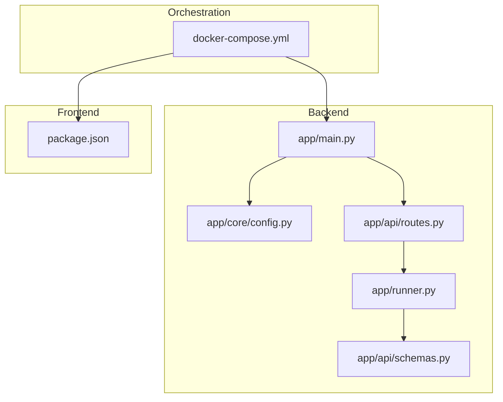
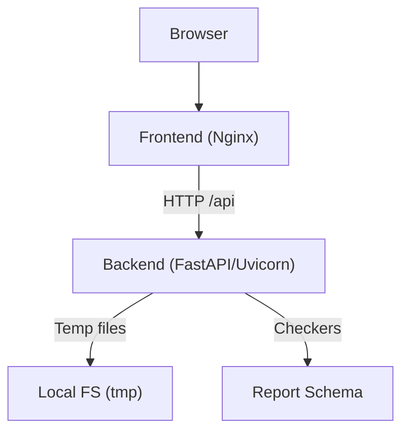
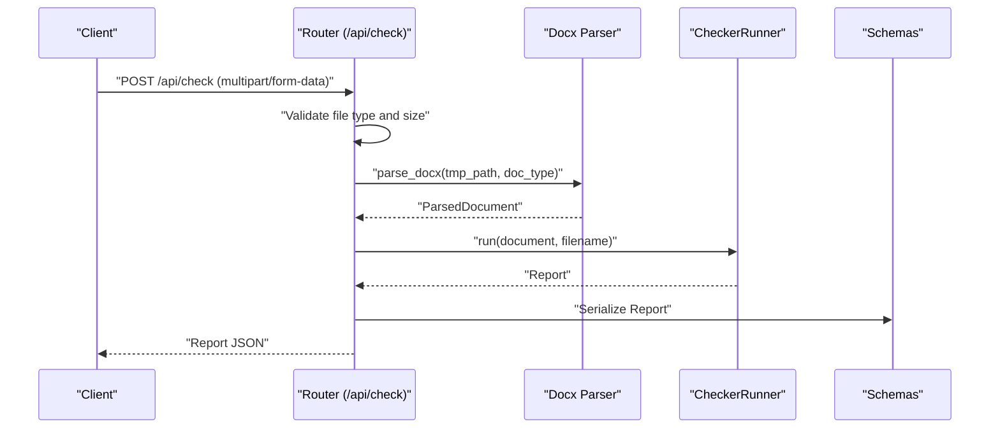
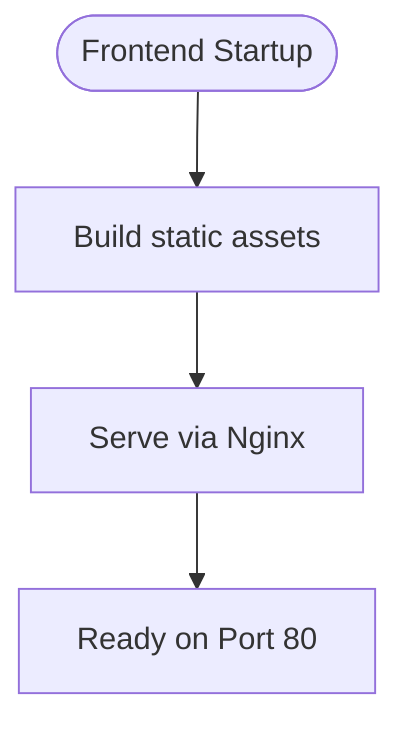
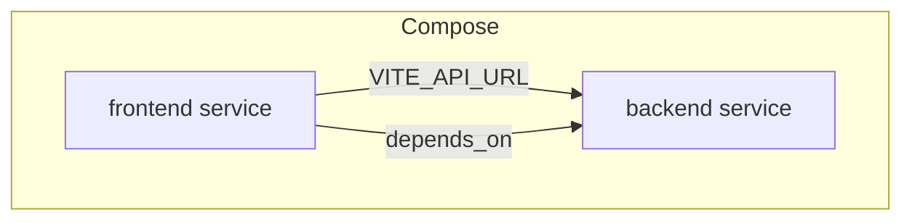
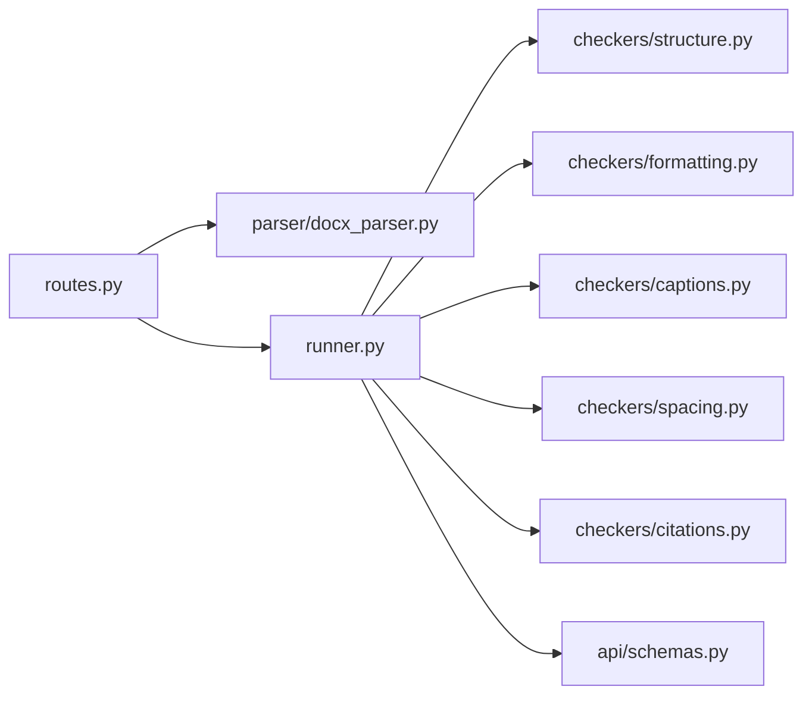

# Deployment and Operations

<cite>
**Referenced Files in This Document**
- [README.md](file://README.md)
- [docs/design.md](file://docs/design.md)
- [docs/plan.md](file://docs/plan.md)
- [backend/pyproject.toml](file://backend/pyproject.toml)
- [backend/app/main.py](file://backend/app/main.py)
- [backend/app/core/config.py](file://backend/app/core/config.py)
- [backend/app/api/routes.py](file://backend/app/api/routes.py)
- [backend/app/api/schemas.py](file://backend/app/api/schemas.py)
- [backend/app/runner.py](file://backend/app/runner.py)
- [.gitignore](file://.gitignore)
</cite>

## Table of Contents
1. [Introduction](#introduction)
2. [Project Structure](#project-structure)
3. [Core Components](#core-components)
4. [Architecture Overview](#architecture-overview)
5. [Detailed Component Analysis](#detailed-component-analysis)
6. [Dependency Analysis](#dependency-analysis)
7. [Performance Considerations](#performance-considerations)
8. [Troubleshooting Guide](#troubleshooting-guide)
9. [Conclusion](#conclusion)
10. [Appendices](#appendices)

## Introduction
This document provides comprehensive deployment and operations guidance for the Dissertation Checker platform. It covers containerization with Docker for both backend and frontend services, docker-compose orchestration, environment configuration, and service dependencies. It also outlines production deployment strategies, scaling considerations, monitoring approaches, CI/CD pipeline setup, automated testing integration, release procedures, security considerations, backup strategies, maintenance procedures, troubleshooting for common deployment issues, and performance optimization tips.

## Project Structure
The project follows a clear separation of concerns:
- Backend: Python FastAPI application with configuration, API routes, document parsing, checkers, and orchestration.
- Frontend: React-based single-page application served via Nginx in a lightweight image.
- Orchestration: docker-compose coordinates backend and frontend services with environment-specific configuration.

**Diagram sources**
- [docs/design.md:28-79](file://docs/design.md#L28-L79)
- [backend/app/main.py:1-20](file://backend/app/main.py#L1-L20)
- [backend/app/core/config.py:1-17](file://backend/app/core/config.py#L1-L17)
- [backend/app/api/routes.py:1-66](file://backend/app/api/routes.py#L1-L66)
- [backend/app/runner.py:1-25](file://backend/app/runner.py#L1-L25)
- [backend/app/api/schemas.py:1-38](file://backend/app/api/schemas.py#L1-L38)

**Section sources**
- [docs/design.md:28-79](file://docs/design.md#L28-L79)
- [README.md:160-167](file://README.md#L160-L167)

## Core Components
- Backend service
  - FastAPI application entrypoint initializes CORS and mounts the API router under /api.
  - Configuration is managed via environment-backed settings with defaults for app name, upload size limits, CORS origins, and temporary directory.
  - API routes expose health and document checking endpoints, validating uploads and enforcing size limits.
  - Runner orchestrates multiple checkers to produce a unified report.
- Frontend service
  - Built with Vite and served statically by Nginx in a minimal Alpine Linux image.
- Orchestration
  - docker-compose defines two services: backend and frontend, with port mappings and environment overrides.

Key operational parameters:
- Backend exposes port 8000 and binds CORS origins via environment variable.
- Frontend exposes port 80 and proxies API requests to the backend service.
- Temporary file handling during document processing is managed within the backend service.

**Section sources**
- [backend/app/main.py:1-20](file://backend/app/main.py#L1-L20)
- [backend/app/core/config.py:1-17](file://backend/app/core/config.py#L1-L17)
- [backend/app/api/routes.py:1-66](file://backend/app/api/routes.py#L1-L66)
- [backend/app/runner.py:1-25](file://backend/app/runner.py#L1-L25)
- [docs/plan.md:2793-2812](file://docs/plan.md#L2793-L2812)

## Architecture Overview
The runtime architecture consists of:
- Client browser accessing the frontend service.
- Frontend service proxying API requests to the backend service.
- Backend service receiving uploaded documents, validating and limiting sizes, parsing DOCX, running checkers, and returning structured reports.
- Temporary files stored locally within the backend container during processing.

**Diagram sources**
- [backend/app/api/routes.py:30-66](file://backend/app/api/routes.py#L30-L66)
- [backend/app/api/schemas.py:25-38](file://backend/app/api/schemas.py#L25-L38)
- [backend/app/core/config.py:6-11](file://backend/app/core/config.py#L6-L11)

## Detailed Component Analysis

### Backend Service
- Entrypoint and middleware
  - Initializes FastAPI with dynamic title/version from settings.
  - Adds CORS middleware configured via environment-backed origins.
  - Includes router under /api prefix.
- Configuration
  - Settings class loads from .env with defaults for app name, upload size limit, CORS origins, and temp directory.
- API routes
  - Health endpoint returns a simple status payload.
  - Document check endpoint validates file type and size, writes to a temporary file, parses the document, runs all registered checkers, and cleans up the temporary file.
- Runner
  - Aggregates issues from multiple checkers and produces a structured report.

**Diagram sources**
- [backend/app/api/routes.py:35-66](file://backend/app/api/routes.py#L35-L66)
- [backend/app/runner.py:15-25](file://backend/app/runner.py#L15-L25)
- [backend/app/api/schemas.py:25-38](file://backend/app/api/schemas.py#L25-L38)

**Section sources**
- [backend/app/main.py:1-20](file://backend/app/main.py#L1-L20)
- [backend/app/core/config.py:1-17](file://backend/app/core/config.py#L1-L17)
- [backend/app/api/routes.py:1-66](file://backend/app/api/routes.py#L1-L66)
- [backend/app/runner.py:1-25](file://backend/app/runner.py#L1-L25)
- [backend/app/api/schemas.py:1-38](file://backend/app/api/schemas.py#L1-L38)

### Frontend Service
- Build and runtime
  - Multi-stage Dockerfile builds static assets with Node, then serves via Nginx Alpine.
  - Exposes port 80 and relies on environment variable to set the API base URL.
- Integration
  - Depends on backend service and proxies API calls to the backend container.

**Diagram sources**
- [docs/plan.md:2775-2791](file://docs/plan.md#L2775-L2791)

**Section sources**
- [docs/plan.md:2775-2791](file://docs/plan.md#L2775-L2791)

### Orchestration with docker-compose
- Services
  - backend: Builds from backend directory, exposes port 8000, sets CORS origins via environment variable.
  - frontend: Builds from frontend directory, exposes port 80, depends_on backend, sets VITE_API_URL to reach backend.
- Verification
  - Compose up with build flag starts both services and validates local operation.

**Diagram sources**
- [docs/plan.md:2793-2812](file://docs/plan.md#L2793-L2812)

**Section sources**
- [docs/plan.md:2793-2812](file://docs/plan.md#L2793-L2812)

## Dependency Analysis
- Internal dependencies
  - Routes depend on parser, runner, and checkers.
  - Runner aggregates checkers and produces report schema-compatible output.
- External dependencies
  - Backend declares FastAPI, Uvicorn, python-multipart, python-docx, Pydantic, and pydantic-settings.
- Runtime dependencies
  - Frontend build-time requires Node.js; runtime requires Nginx serving static assets.

**Diagram sources**
- [backend/app/api/routes.py:6-12](file://backend/app/api/routes.py#L6-L12)
- [backend/app/runner.py:3-5](file://backend/app/runner.py#L3-L5)
- [backend/app/api/schemas.py:1-38](file://backend/app/api/schemas.py#L1-L38)

**Section sources**
- [backend/pyproject.toml:1-29](file://backend/pyproject.toml#L1-L29)
- [backend/app/api/routes.py:1-66](file://backend/app/api/routes.py#L1-L66)
- [backend/app/runner.py:1-25](file://backend/app/runner.py#L1-L25)

## Performance Considerations
- Upload size limits
  - Enforced at the API boundary to prevent oversized payloads from reaching downstream processing.
- Temporary file handling
  - Documents are written to a temporary file and removed in a finally block to avoid disk accumulation.
- Concurrency and scaling
  - Uvicorn supports multiple workers; tune worker count and keep-alive timeouts per deployment needs.
- Static asset delivery
  - Serving frontend via Nginx reduces CPU load on the backend.
- Resource allocation
  - Allocate memory and CPU resources to backend and frontend containers according to expected concurrency and average document size.

[No sources needed since this section provides general guidance]

## Troubleshooting Guide
- CORS errors in browser console
  - Ensure the backend CORS origins include the frontend origin(s). Adjust environment variable for allowed origins.
- Frontend cannot reach API
  - Confirm VITE_API_URL points to the backend service host and path. Verify network connectivity inside the compose network.
- File too large errors
  - Reduce upload size or increase max upload size setting in backend configuration.
- Health endpoint failing
  - Verify backend service is reachable on port 8000 and that the health route returns the expected payload.
- Temporary file cleanup failures
  - Check filesystem permissions and available disk space in the backend container.
- Build failures
  - Rebuild with cache disabled if dependency installation fails. Ensure Node and Python environments match the images.

**Section sources**
- [backend/app/api/routes.py:40-49](file://backend/app/api/routes.py#L40-L49)
- [backend/app/core/config.py:6-11](file://backend/app/core/config.py#L6-L11)
- [docs/plan.md:2793-2812](file://docs/plan.md#L2793-L2812)

## Conclusion
The Dissertation Checker platform is designed for straightforward containerized deployment using Docker and docker-compose. The backend FastAPI service integrates configuration-driven CORS, upload validation, and a modular checker pipeline, while the frontend is served efficiently via Nginx. Production readiness involves tuning resource allocations, implementing monitoring, securing ingress, and establishing CI/CD with automated testing.

[No sources needed since this section summarizes without analyzing specific files]

## Appendices

### A. Containerization Setup
- Backend Dockerfile
  - Uses Python slim image, installs dependencies from pyproject.toml, copies application code, exposes port 8000, and runs Uvicorn.
- Frontend Dockerfile
  - Multi-stage build with Node, then serves static assets with Nginx Alpine, exposing port 80.
- docker-compose.yml
  - Defines backend and frontend services, port mappings, environment variables, and service dependencies.

**Section sources**
- [docs/plan.md:2758-2773](file://docs/plan.md#L2758-L2773)
- [docs/plan.md:2775-2791](file://docs/plan.md#L2775-L2791)
- [docs/plan.md:2793-2812](file://docs/plan.md#L2793-L2812)

### B. Environment Configuration
- Backend settings
  - App name, max upload size (MB), CORS origins, and temp directory are configurable via environment variables loaded from .env.
- Frontend environment
  - VITE_API_URL controls the backend API base URL for the frontend.

**Section sources**
- [backend/app/core/config.py:1-17](file://backend/app/core/config.py#L1-L17)
- [docs/plan.md:2801-2811](file://docs/plan.md#L2801-L2811)

### C. Service Dependencies
- Backend depends on:
  - Parser for DOCX processing.
  - Runner to coordinate checkers.
  - Schemas for API responses.
- Frontend depends on backend for API availability.

**Section sources**
- [backend/app/api/routes.py:6-12](file://backend/app/api/routes.py#L6-L12)
- [backend/app/runner.py:3-5](file://backend/app/runner.py#L3-L5)
- [backend/app/api/schemas.py:1-38](file://backend/app/api/schemas.py#L1-L38)

### D. CI/CD Pipeline and Automated Testing
- Testing
  - PyTest configuration is defined in pyproject.toml with test paths and asyncio mode.
  - Integration tests are referenced in the development plan.
- Pipeline outline
  - Lint and test stages using Ruff and PyTest.
  - Build and push Docker images for backend and frontend.
  - Deploy via docker-compose or container orchestration platform.

**Section sources**
- [backend/pyproject.toml:22-29](file://backend/pyproject.toml#L22-L29)
- [docs/plan.md:2737-2747](file://docs/plan.md#L2737-L2747)

### E. Security Considerations
- CORS policy
  - Configure allowed origins carefully; avoid wildcard in production.
- Secrets management
  - Store sensitive configuration in environment files outside version control.
- Network exposure
  - Restrict inbound ports and consider TLS termination at an ingress controller.
- Image hygiene
  - Pin base image versions and rebuild regularly to incorporate security updates.

[No sources needed since this section provides general guidance]

### F. Backup Strategies and Maintenance
- Data persistence
  - Temporary files are ephemeral; ensure logs and persistent volumes are configured if needed.
- Log retention
  - Forward container logs to centralized logging systems.
- Maintenance windows
  - Schedule rolling updates for backend and frontend to minimize downtime.

[No sources needed since this section provides general guidance]

### G. Monitoring Approaches
- Health checks
  - Use the /api/health endpoint for liveness/readiness probes.
- Metrics
  - Add Prometheus metrics and Grafana dashboards for throughput, latency, and error rates.
- Tracing
  - Integrate distributed tracing for end-to-end visibility across frontend and backend.

[No sources needed since this section provides general guidance]

### H. Release Procedures
- Tagging and branching
  - Follow the documented Git workflow for feature branches and pull requests.
- Packaging
  - Build and push tagged Docker images for backend and frontend.
- Rollout
  - Perform staged rollouts with health checks and rollback plans.

**Section sources**
- [README.md:122-139](file://README.md#L122-L139)

### I. Operational Notes
- Local development
  - Use docker compose up --build to validate the full stack locally.
- Ignored artifacts
  - .gitignore excludes environment files, Node modules, and temporary upload directories.

**Section sources**
- [docs/plan.md:2814-2819](file://docs/plan.md#L2814-L2819)
- [.gitignore:10-28](file://.gitignore#L10-L28)