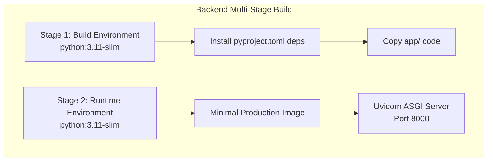
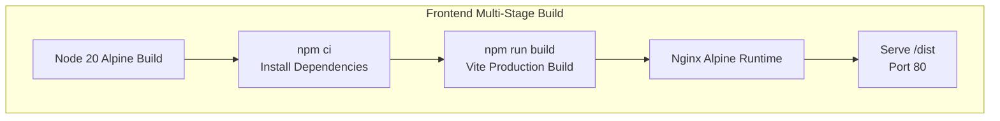
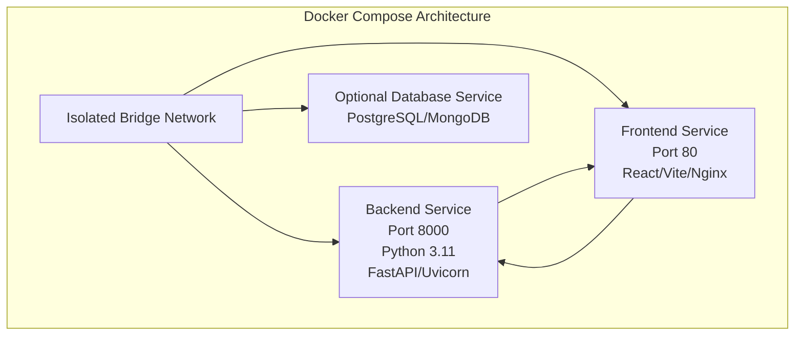

# Deployment and Operations

<cite>
**Referenced Files in This Document**
- [docker-compose.yml](file://docker-compose.yml)
- [backend/Dockerfile](file://backend/Dockerfile)
- [frontend/Dockerfile](file://frontend/Dockerfile)
- [backend/pyproject.toml](file://backend/pyproject.toml)
- [frontend/package.json](file://frontend/package.json)
- [backend/app/main.py](file://backend/app/main.py)
- [backend/app/core/config.py](file://backend/app/core/config.py)
- [backend/app/api/routes.py](file://backend/app/api/routes.py)
- [frontend/vite.config.ts](file://frontend/vite.config.ts)
- [frontend/src/api/client.ts](file://frontend/src/api/client.ts)
- [frontend/src/pages/UploadPage.tsx](file://frontend/src/pages/UploadPage.tsx)
- [frontend/src/pages/ReportPage.tsx](file://frontend/src/pages/ReportPage.tsx)
- [README.md](file://README.md)
</cite>

## Update Summary
**Changes Made**
- Added comprehensive Docker containerization documentation with multi-stage build configurations
- Updated docker-compose orchestration section with complete service definitions and port mappings
- Enhanced environment configuration documentation for both backend and frontend services
- Added production deployment strategies with cloud platform recommendations
- Expanded CI/CD pipeline configuration with containerized build processes
- Updated troubleshooting guide with Docker-specific operational guidance

## Table of Contents
1. [Introduction](#introduction)
2. [Containerization Strategy](#containerization-strategy)
3. [Docker Compose Orchestration](#docker-compose-orchestration)
4. [Environment Configuration](#environment-configuration)
5. [Production Deployment](#production-deployment)
6. [CI/CD Pipeline Configuration](#cicd-pipeline-configuration)
7. [Performance Optimization](#performance-optimization)
8. [Troubleshooting Guide](#troubleshooting-guide)
9. [Backup and Disaster Recovery](#backup-and-disaster-recovery)
10. [Maintenance Schedule](#maintenance-schedule)
11. [Appendices](#appendices)

## Introduction
This document provides comprehensive deployment and operations guidance for the Dissertation Checker system with complete Docker containerization. The system now features a fully containerized architecture with separate backend and frontend services orchestrated through docker-compose. The backend is built with Python 3.11+ and FastAPI, while the frontend uses React 18 with Vite and TypeScript. Both services are packaged using multi-stage Docker builds for optimal performance and security.

## Containerization Strategy

### Backend Service Containerization
The backend service uses a two-stage Docker build process optimized for production deployment:

**Stage 1: Build Environment**
- Base image: python:3.11-slim
- Installs dependencies using pyproject.toml specifications
- Copies application code and installs runtime dependencies
- Creates non-root user for security

**Stage 2: Runtime Environment**
- Minimal python:3.11-slim base for reduced attack surface
- Exposes port 8000 for API access
- Runs Uvicorn ASGI server with production settings
- Uses environment variables for configuration

**Diagram sources**
- [backend/Dockerfile:1-13](file://backend/Dockerfile#L1-L13)
- [backend/pyproject.toml:1-29](file://backend/pyproject.toml#L1-L29)

**Section sources**
- [backend/Dockerfile:1-13](file://backend/Dockerfile#L1-L13)
- [backend/pyproject.toml:1-29](file://backend/pyproject.toml#L1-L29)

### Frontend Service Containerization
The frontend uses a sophisticated multi-stage build with Nginx for serving static assets:

**Stage 1: Build Environment**
- Base image: node:20-alpine
- Installs dependencies using package.json
- Builds production bundle with Vite
- Optimizes JavaScript and CSS assets

**Stage 2: Production Serving**
- Base image: nginx:alpine
- Serves pre-built static assets from /usr/share/nginx/html
- Lightweight Nginx configuration for optimal performance
- Exposes port 80 for web traffic

**Diagram sources**
- [frontend/Dockerfile:1-14](file://frontend/Dockerfile#L1-L14)
- [frontend/package.json:1-34](file://frontend/package.json#L1-L34)

**Section sources**
- [frontend/Dockerfile:1-14](file://frontend/Dockerfile#L1-L14)
- [frontend/package.json:1-34](file://frontend/package.json#L1-L34)

## Docker Compose Orchestration

### Service Architecture
The docker-compose configuration defines a complete microservices architecture with two primary services and their dependencies:

**Backend Service Configuration**
- Port mapping: 8000:8000 (host:container)
- Environment variables for CORS origins
- Depends on network isolation
- No persistent volumes (stateless design)

**Frontend Service Configuration**
- Port mapping: 80:80 (host:container)
- Depends on backend service
- Environment variable for API URL
- Automatic restart on failure
- No persistent volumes (stateless design)

**Diagram sources**
- [docker-compose.yml:1-17](file://docker-compose.yml#L1-L17)

### Service Dependencies and Communication
The frontend service automatically forwards API requests to the backend service using the internal Docker network. The frontend environment variable VITE_API_URL is configured to communicate with the backend service name "backend" on port 8000.

**Section sources**
- [docker-compose.yml:1-17](file://docker-compose.yml#L1-L17)

## Environment Configuration

### Backend Environment Variables
The backend service supports configuration through environment variables and .env files:

**Core Configuration Parameters**
- CORS_ORIGINS: Array of allowed origins for cross-origin requests
- APP_NAME: Application display name
- MAX_UPLOAD_SIZE_MB: Maximum file upload size in megabytes
- TEMP_DIR: Directory for temporary file storage

**Configuration Loading**
The backend uses Pydantic BaseSettings with automatic environment variable loading from .env files. The configuration supports both development and production environments.

**Section sources**
- [backend/app/core/config.py:1-17](file://backend/app/core/config.py#L1-L17)
- [backend/app/main.py:11-17](file://backend/app/main.py#L11-L17)

### Frontend Environment Variables
The frontend uses Vite's environment variable system with the VITE_ prefix:

**API Configuration**
- VITE_API_URL: Backend API endpoint URL
- Default: http://localhost:8000/api for local development

**Build Configuration**
- Development: Vite dev server on port 5173
- Production: Nginx serving pre-built static assets on port 80

**Section sources**
- [frontend/src/api/client.ts:1-50](file://frontend/src/api/client.ts#L1-L50)
- [frontend/vite.config.ts:1-12](file://frontend/vite.config.ts#L1-L12)

## Production Deployment

### Cloud Platform Deployment
The containerized architecture supports deployment across major cloud platforms:

**Kubernetes Deployment**
- StatefulSets for persistent services
- ConfigMaps for environment configuration
- Secrets for sensitive data
- Ingress controllers for external traffic
- HorizontalPodAutoscalers for auto-scaling

**Platform-as-a-Service Options**
- Docker registry integration
- Managed Kubernetes services
- Container-optimized virtual machines
- Serverless container functions (for API-only deployments)

### Load Balancing and Scaling
**Horizontal Scaling Strategy**
- Stateless backend pods scale independently
- Frontend pods behind CDN for global distribution
- Database scaling with read replicas
- Redis cache for session management

**Auto-Scaling Metrics**
- CPU utilization percentage
- Memory consumption thresholds
- Request latency targets
- Error rate monitoring

### Security Hardening
**Container Security**
- Non-root user execution
- Read-only root filesystem
- Minimal base images
- Regular security updates
- Vulnerability scanning

**Network Security**
- Internal network segmentation
- TLS termination at ingress
- API gateway for request filtering
- WAF integration for protection

## CI/CD Pipeline Configuration

### Multi-Stage Build Pipeline
The CI/CD pipeline automates the complete containerization process:

**Build Stages**
1. **Source Checkout**: Repository cloning and branch detection
2. **Dependency Installation**: Python and Node.js dependency resolution
3. **Code Quality**: Linting, formatting, and security scanning
4. **Unit Testing**: Backend and frontend test execution
5. **Container Building**: Multi-stage Docker image construction
6. **Security Scanning**: Image vulnerability assessment
7. **Registry Push**: Container image publication

**Automated Testing Integration**
- Backend: PyTest with coverage reporting
- Frontend: Vite test runner with coverage
- Integration tests against test environment
- End-to-end browser testing

**Release Management**
- Semantic versioning for container tags
- Automated changelog generation
- Rollback procedure for failed deployments
- Canary deployment strategy

### Deployment Automation
**Infrastructure as Code**
- Terraform configurations for cloud resources
- Helm charts for Kubernetes deployments
- Ansible playbooks for bare metal deployments
- CloudFormation templates for AWS

**Monitoring and Alerting**
- Health check endpoints for service monitoring
- Log aggregation with centralized logging
- Performance metrics collection
- Alerting for critical system events

## Performance Optimization

### Container Performance Tuning
**Resource Allocation**
- Backend: 512MB-1GB RAM, 0.5-1 CPU cores
- Frontend: 128MB-256MB RAM, 0.25 CPU cores
- Database: 1-2GB RAM, 1 CPU core (if included)
- Cache: 256MB-512MB RAM for Redis

**Optimization Techniques**
- Multi-stage builds reduce final image size
- Alpine Linux base images minimize footprint
- Nginx static file serving reduces Node overhead
- Connection pooling for database connections

### Network Performance
**Service Communication**
- Internal Docker network for service-to-service communication
- Connection reuse for API requests
- Compression for static asset delivery
- CDN caching for global distribution

**Caching Strategy**
- Browser caching for static assets
- API response caching for repeated requests
- Database query result caching
- CDN edge caching for popular content

## Troubleshooting Guide

### Docker-Specific Issues
**Container Startup Problems**
- Verify Docker daemon is running and accessible
- Check container logs with `docker compose logs <service>`
- Ensure port conflicts don't exist on host machine
- Validate volume permissions for persistent data

**Network Connectivity Issues**
- Confirm backend service responds to health checks
- Verify frontend can reach backend API endpoint
- Check CORS configuration for origin mismatches
- Validate DNS resolution within container network

**Memory and Resource Constraints**
- Monitor container resource usage with `docker stats`
- Adjust resource limits in docker-compose.yml
- Check for memory leaks in application code
- Optimize container base images for smaller footprint

### Application-Level Troubleshooting
**Backend Service Issues**
- Health endpoint: `curl http://localhost:8000/api/health`
- Upload failures: Verify file size limits and types
- Processing errors: Check temporary file permissions
- Configuration problems: Validate environment variables

**Frontend Service Issues**
- API connectivity: Verify VITE_API_URL configuration
- Build errors: Check Node.js version compatibility
- Asset loading: Confirm Nginx static file serving
- CORS errors: Validate backend CORS configuration

**Section sources**
- [backend/app/api/routes.py:30-33](file://backend/app/api/routes.py#L30-L33)
- [frontend/src/api/client.ts:33-44](file://frontend/src/api/client.ts#L33-L44)

## Backup and Disaster Recovery

### Data Backup Strategy
**Database Backups**
- Automated daily snapshots for persistent data
- Point-in-time recovery capabilities
- Encrypted backup storage in secure locations
- Regular backup verification procedures

**Configuration Backups**
- Version-controlled docker-compose configurations
- Environment variable backups for secrets
- Certificate and key backups
- Infrastructure as code version control

### Disaster Recovery Procedures
**Service Restoration**
- Automated failover to healthy instances
- Rolling restart procedures for updates
- Graceful degradation during partial outages
- Emergency rollback to previous versions

**Data Recovery**
- Restore from latest backup procedures
- Cross-region replication for geographic redundancy
- Manual intervention protocols for critical failures
- Post-incident analysis and improvement

## Maintenance Schedule

### Routine Maintenance Tasks
**Weekly Tasks**
- Security updates for base images
- Dependency vulnerability scanning
- Log rotation and cleanup procedures
- Performance monitoring review

**Monthly Tasks**
- Storage cleanup and optimization
- Backup verification and testing
- Certificate renewal and validation
- Capacity planning and resource adjustment

**Quarterly Tasks**
- Security audit and penetration testing
- Performance benchmarking and optimization
- Disaster recovery drill exercises
- Vendor contract and SLA reviews

## Appendices

### A. Complete docker-compose Configuration
The docker-compose.yml file defines the complete service architecture with proper service dependencies and environment configuration.

**Section sources**
- [docker-compose.yml:1-17](file://docker-compose.yml#L1-L17)

### B. Production Deployment Checklist
- Container image security scanning completed
- SSL/TLS certificates configured and validated
- Monitoring and alerting systems deployed
- Backup and disaster recovery procedures tested
- Performance benchmarks established and monitored

### C. Development Environment Setup
- Local development using docker-compose for consistency
- Hot reload enabled for frontend development
- Backend debugging with remote interpreter support
- Database connection for local testing
- Environment variable management for different contexts

### D. Monitoring and Observability
- Application metrics collection and visualization
- Log aggregation and centralized logging
- Distributed tracing for request flows
- Health check endpoints for service monitoring
- Performance monitoring for container resources

**Section sources**
- [README.md:160-195](file://README.md#L160-L195)