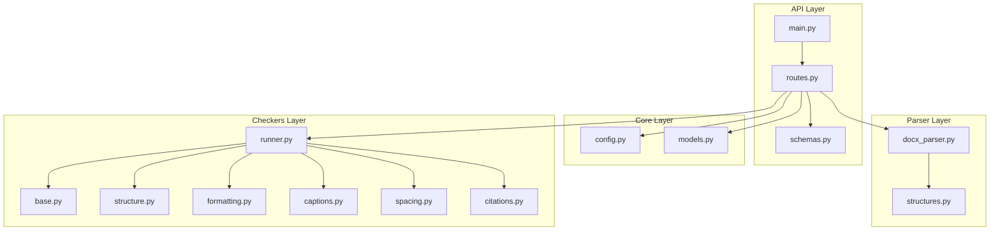
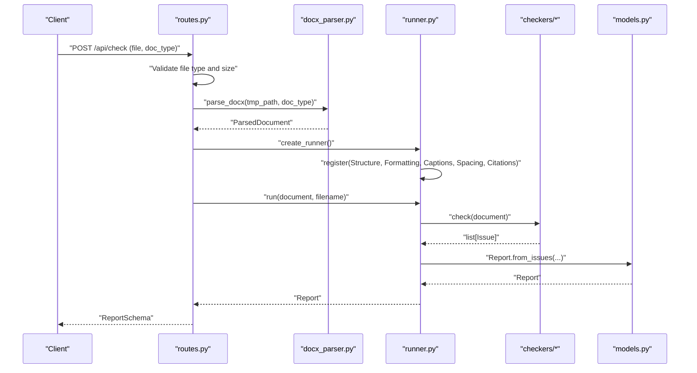
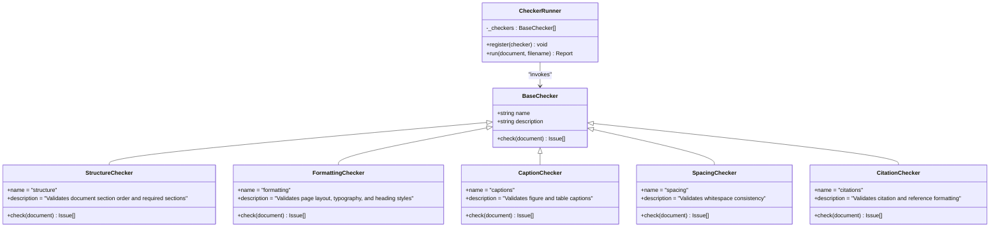
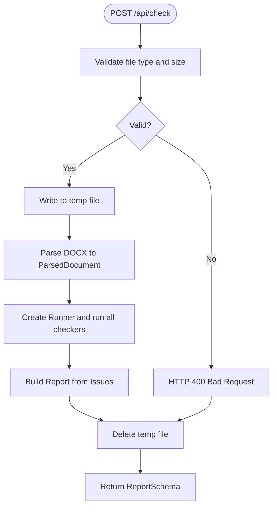
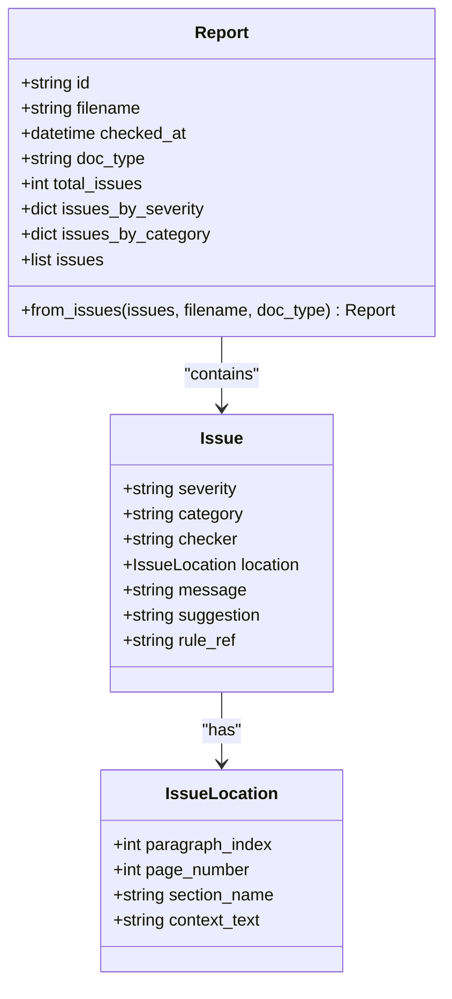
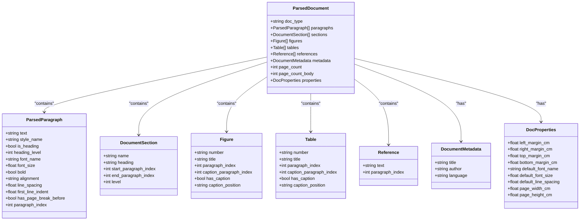
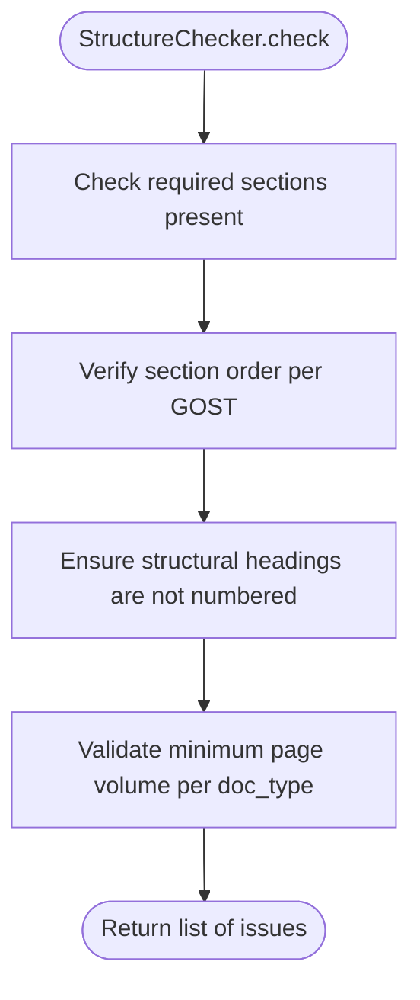
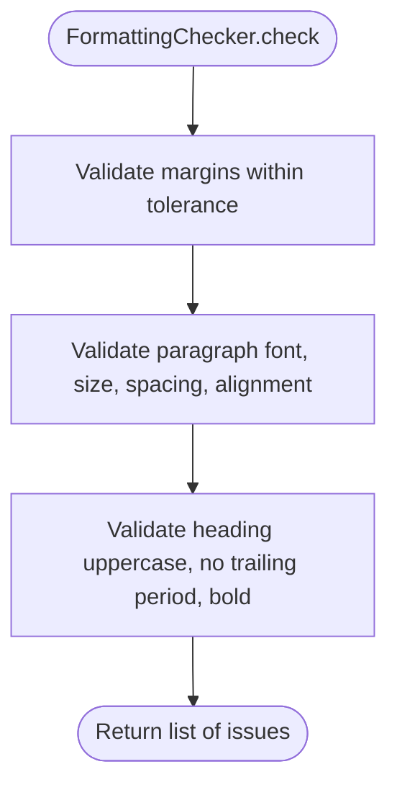
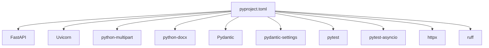

# Development Guidelines

<cite>
**Referenced Files in This Document**
- [README.md](file://README.md)
- [pyproject.toml](file://backend/pyproject.toml)
- [main.py](file://backend/app/main.py)
- [routes.py](file://backend/app/api/routes.py)
- [schemas.py](file://backend/app/api/schemas.py)
- [config.py](file://backend/app/core/config.py)
- [models.py](file://backend/app/core/models.py)
- [structures.py](file://backend/app/parser/structures.py)
- [docx_parser.py](file://backend/app/parser/docx_parser.py)
- [base.py](file://backend/app/checkers/base.py)
- [runner.py](file://backend/app/runner.py)
- [structure.py](file://backend/app/checkers/structure.py)
- [formatting.py](file://backend/app/checkers/formatting.py)
- [captions.py](file://backend/app/checkers/captions.py)
- [spacing.py](file://backend/app/checkers/spacing.py)
- [citations.py](file://backend/app/checkers/citations.py)
</cite>

## Table of Contents
1. [Introduction](#introduction)
2. [Project Structure](#project-structure)
3. [Core Components](#core-components)
4. [Architecture Overview](#architecture-overview)
5. [Detailed Component Analysis](#detailed-component-analysis)
6. [Dependency Analysis](#dependency-analysis)
7. [Performance Considerations](#performance-considerations)
8. [Troubleshooting Guide](#troubleshooting-guide)
9. [Development Workflow and Contribution Guidelines](#development-workflow-and-contribution-guidelines)
10. [Debugging and Profiling Techniques](#debugging-and-profiling-techniques)
11. [Extending the Validation System](#extending-the-validation-system)
12. [Code Style Standards and Naming Conventions](#code-style-standards-and-naming-conventions)
13. [Conclusion](#conclusion)

## Introduction
This document provides comprehensive development guidelines for the Dissertation Checker project. It covers code style standards, naming conventions, architectural patterns, plugin architecture principles, error handling patterns, performance considerations, extension guidelines, development workflow, code review processes, contribution guidelines, debugging techniques, profiling methods, and optimization strategies tailored to the document processing and validation pipeline.

## Project Structure
The backend follows a layered, feature-based organization:
- API layer: FastAPI application entry, routers, and Pydantic schemas
- Core layer: Shared models and configuration
- Parser layer: DOCX parsing and structured document representation
- Checkers layer: Pluggable validation modules implementing a common interface
- Runner orchestration: Aggregates and executes registered checkers
- Tests: Unit and integration tests configured via pyproject.toml

**Diagram sources**
- [main.py:1-20](file://backend/app/main.py#L1-L20)
- [routes.py:1-66](file://backend/app/api/routes.py#L1-L66)
- [schemas.py:1-38](file://backend/app/api/schemas.py#L1-L38)
- [config.py:1-17](file://backend/app/core/config.py#L1-L17)
- [models.py:1-58](file://backend/app/core/models.py#L1-L58)
- [docx_parser.py](file://backend/app/parser/docx_parser.py)
- [structures.py:1-89](file://backend/app/parser/structures.py#L1-L89)
- [base.py:1-17](file://backend/app/checkers/base.py#L1-L17)
- [runner.py:1-25](file://backend/app/runner.py#L1-L25)
- [structure.py:1-148](file://backend/app/checkers/structure.py#L1-L148)
- [formatting.py:1-174](file://backend/app/checkers/formatting.py#L1-L174)
- [captions.py:1-14](file://backend/app/checkers/captions.py#L1-L14)
- [spacing.py:1-14](file://backend/app/checkers/spacing.py#L1-L14)
- [citations.py:1-14](file://backend/app/checkers/citations.py#L1-L14)

**Section sources**
- [README.md:169-195](file://README.md#L169-L195)
- [pyproject.toml:1-29](file://backend/pyproject.toml#L1-L29)

## Core Components
- Application entrypoint initializes FastAPI with CORS middleware and mounts the API router under /api.
- Routes module defines health and document checking endpoints, file validation, temporary file handling, and orchestrates parsing and checker execution.
- Schemas define request/response models for API contracts.
- Configuration encapsulates environment-driven settings.
- Models define domain entities for issues, reports, and locations.
- Parser structures define typed representations of parsed document elements.
- Base checker interface enforces a uniform contract for all validators.
- Runner aggregates checkers and produces consolidated reports.

Key implementation patterns:
- Dependency injection via constructor registration in the runner
- Centralized report aggregation with summary statistics
- Strong typing with dataclasses and Pydantic models
- Explicit error signaling via HTTP exceptions with standardized messages

**Section sources**
- [main.py:1-20](file://backend/app/main.py#L1-L20)
- [routes.py:1-66](file://backend/app/api/routes.py#L1-L66)
- [schemas.py:1-38](file://backend/app/api/schemas.py#L1-L38)
- [config.py:1-17](file://backend/app/core/config.py#L1-L17)
- [models.py:1-58](file://backend/app/core/models.py#L1-L58)
- [structures.py:1-89](file://backend/app/parser/structures.py#L1-L89)
- [base.py:1-17](file://backend/app/checkers/base.py#L1-L17)
- [runner.py:1-25](file://backend/app/runner.py#L1-L25)

## Architecture Overview
The system employs a plugin-based checker architecture:
- A central Runner maintains a registry of BaseChecker instances
- Each checker implements a unified check method operating on a ParsedDocument
- The API layer coordinates parsing, checker execution, and report generation

**Diagram sources**
- [routes.py:35-66](file://backend/app/api/routes.py#L35-L66)
- [runner.py:15-25](file://backend/app/runner.py#L15-L25)
- [structure.py:47-58](file://backend/app/checkers/structure.py#L47-L58)
- [formatting.py:15-25](file://backend/app/checkers/formatting.py#L15-L25)
- [captions.py:8-14](file://backend/app/checkers/captions.py#L8-L14)
- [spacing.py:8-14](file://backend/app/checkers/spacing.py#L8-L14)
- [citations.py:8-14](file://backend/app/checkers/citations.py#L8-L14)
- [models.py:28-58](file://backend/app/core/models.py#L28-L58)

## Detailed Component Analysis

### Plugin Architecture: BaseChecker and Runner
- BaseChecker defines a minimal contract with name, description, and a check method returning a list of issues
- Runner manages a list of BaseChecker instances, invoking each and aggregating results into a Report
- Registration occurs in the routes module factory, ensuring all checkers are wired consistently

**Diagram sources**
- [base.py:9-17](file://backend/app/checkers/base.py#L9-L17)
- [structure.py:47-58](file://backend/app/checkers/structure.py#L47-L58)
- [formatting.py:15-25](file://backend/app/checkers/formatting.py#L15-L25)
- [captions.py:8-14](file://backend/app/checkers/captions.py#L8-L14)
- [spacing.py:8-14](file://backend/app/checkers/spacing.py#L8-L14)
- [citations.py:8-14](file://backend/app/checkers/citations.py#L8-L14)
- [runner.py:8-25](file://backend/app/runner.py#L8-L25)

**Section sources**
- [base.py:1-17](file://backend/app/checkers/base.py#L1-L17)
- [runner.py:1-25](file://backend/app/runner.py#L1-L25)
- [routes.py:20-27](file://backend/app/api/routes.py#L20-L27)

### API Endpoint Flow: Document Checking
- Validates file type and size limits
- Writes uploaded content to a temporary file
- Parses the document and runs all registered checkers
- Returns a structured report or raises HTTP exceptions on errors

**Diagram sources**
- [routes.py:35-66](file://backend/app/api/routes.py#L35-L66)

**Section sources**
- [routes.py:35-66](file://backend/app/api/routes.py#L35-L66)

### Data Models and Reports
- Issue and Report are defined as dataclasses with computed summaries
- Report.from_issues aggregates counts by severity and category
- IssueLocation captures optional contextual indices and text

**Diagram sources**
- [models.py:9-58](file://backend/app/core/models.py#L9-L58)

**Section sources**
- [models.py:1-58](file://backend/app/core/models.py#L1-L58)

### Parser Structures
- ParsedDocument aggregates paragraphs, sections, figures, tables, references, metadata, counts, and page properties
- Typed structures enable precise validation rules across checkers

**Diagram sources**
- [structures.py:6-89](file://backend/app/parser/structures.py#L6-L89)

**Section sources**
- [structures.py:1-89](file://backend/app/parser/structures.py#L1-L89)

### Example Checker: Structure
- Implements required section detection, ordering validation, structural heading numbering rules, and page volume thresholds
- Uses localized keyword sets and regex matching for robust classification

**Diagram sources**
- [structure.py:51-57](file://backend/app/checkers/structure.py#L51-L57)

**Section sources**
- [structure.py:1-148](file://backend/app/checkers/structure.py#L1-L148)

### Example Checker: Formatting
- Enforces margins, font family/size, line spacing, paragraph alignment, and heading formatting rules
- Applies tolerance thresholds for numeric comparisons

**Diagram sources**
- [formatting.py:19-24](file://backend/app/checkers/formatting.py#L19-L24)

**Section sources**
- [formatting.py:1-174](file://backend/app/checkers/formatting.py#L1-L174)

## Dependency Analysis
External dependencies and tooling:
- Web framework and ASGI server: FastAPI and Uvicorn
- File upload handling: python-multipart
- DOCX parsing: python-docx
- Data validation: Pydantic and pydantic-settings
- Development/testing/linting: pytest, pytest-asyncio, httpx, ruff

Tool configuration:
- pytest settings for async mode and test discovery
- ruff configuration for target Python version and line length

**Diagram sources**
- [pyproject.toml:1-29](file://backend/pyproject.toml#L1-L29)

**Section sources**
- [pyproject.toml:1-29](file://backend/pyproject.toml#L1-L29)

## Performance Considerations
- Minimize memory allocations during parsing and checker loops
- Prefer early exits and short-circuit evaluation in validation logic
- Use tolerant thresholds for floating-point comparisons to avoid false positives
- Stream large file processing where possible; current implementation writes to a temporary file
- Cache repeated computations (e.g., keyword lookups) within a single run
- Keep issue messages concise; defer heavy context extraction to diagnostics mode
- Avoid unnecessary conversions between raw and parsed structures

[No sources needed since this section provides general guidance]

## Troubleshooting Guide
Common issues and resolutions:
- File upload failures: Verify file type and size constraints; ensure temporary directory exists and is writable
- Parsing errors: Confirm DOCX validity and supported styles; inspect parsed structures for missing fields
- CORS errors: Validate allowed origins in configuration
- Checker-specific issues: Review rule references and severity thresholds; add targeted logging around failing assertions

Operational checks:
- Health endpoint confirms service availability
- Report summaries help identify dominant categories or severities
- Per-checker registration ensures all validations are executed

**Section sources**
- [routes.py:30-32](file://backend/app/api/routes.py#L30-L32)
- [routes.py:40-49](file://backend/app/api/routes.py#L40-L49)
- [config.py:6-17](file://backend/app/core/config.py#L6-L17)

## Development Workflow and Contribution Guidelines
Branching and collaboration:
- Create feature branches prefixed with developer initials and task scope
- Commit incrementally after completing tasks; push daily
- Open pull requests after local testing and linting

Golden rules:
- Do not modify another developer’s files without prior agreement
- Run tests locally before committing
- Seek help if blocked for extended periods

Testing strategy:
- Unit tests for individual checkers and core utilities
- Integration tests for end-to-end flows
- Linting with ruff to enforce style consistency

**Section sources**
- [README.md:122-159](file://README.md#L122-L159)
- [pyproject.toml:22-29](file://backend/pyproject.toml#L22-L29)

## Debugging and Profiling Techniques
Recommended approaches:
- Add structured logs around checker boundaries and major steps
- Use small, deterministic test documents to reproduce edge cases
- Profile CPU and memory usage during parsing and validation phases
- Instrument slow checkers with timing and count metrics
- Validate rule references and thresholds with known-good/known-bad samples

[No sources needed since this section provides general guidance]

## Extending the Validation System
Adding a new checker:
1. Create a new file under app/checkers implementing BaseChecker
2. Define name, description, and implement check(document) -> list[Issue]
3. Register the checker in the routes factory
4. Add unit tests validating positive and negative cases
5. Optionally integrate with frontend reporting

Best practices:
- Keep check methods pure and deterministic
- Use ParsedDocument fields precisely; avoid assumptions about ordering
- Provide actionable suggestions and rule references
- Respect tolerance thresholds for numeric comparisons

**Section sources**
- [base.py:9-17](file://backend/app/checkers/base.py#L9-L17)
- [runner.py:12-13](file://backend/app/runner.py#L12-L13)
- [routes.py:20-27](file://backend/app/api/routes.py#L20-L27)

## Code Style Standards and Naming Conventions
Consistency guidelines:
- Module names: lowercase with underscores (e.g., routes.py, docx_parser.py)
- Class names: PascalCase (e.g., StructureChecker, IssueLocation)
- Constants: UPPERCASE with underscores (e.g., EXPECTED_FONT, REQUIRED_ORDER)
- Variables: snake_case (e.g., doc_type, paragraph_index)
- Functions: snake_case (e.g., create_runner, _check_margins)
- Paths: feature-based grouping under app/<layer>/ (e.g., app/checkers/structure.py)

Linting and formatting:
- Enforce line length and target Python version via ruff configuration
- Use type hints consistently for parameters and return values
- Favor immutability for configuration and dataclasses for structures

**Section sources**
- [pyproject.toml:26-29](file://backend/pyproject.toml#L26-L29)
- [structure.py:9-28](file://backend/app/checkers/structure.py#L9-L28)
- [formatting.py:8-12](file://backend/app/checkers/formatting.py#L8-L12)

## Conclusion
This guide consolidates the Dissertation Checker’s architecture, patterns, and operational practices. By adhering to the plugin architecture, consistent naming and style conventions, robust error handling, and disciplined development workflows, contributors can reliably extend and maintain the validation system while optimizing performance and usability.