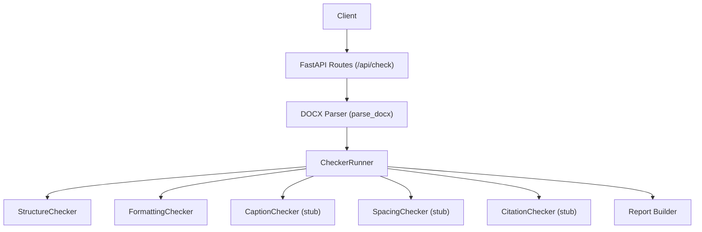
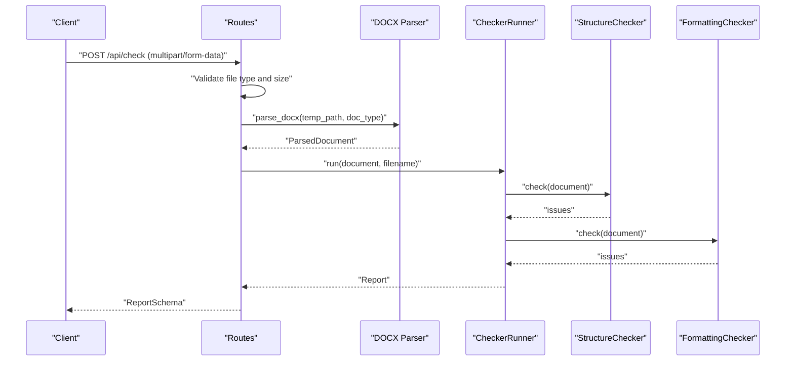
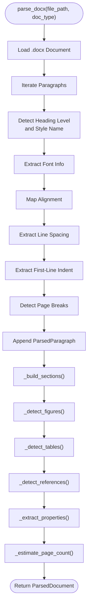
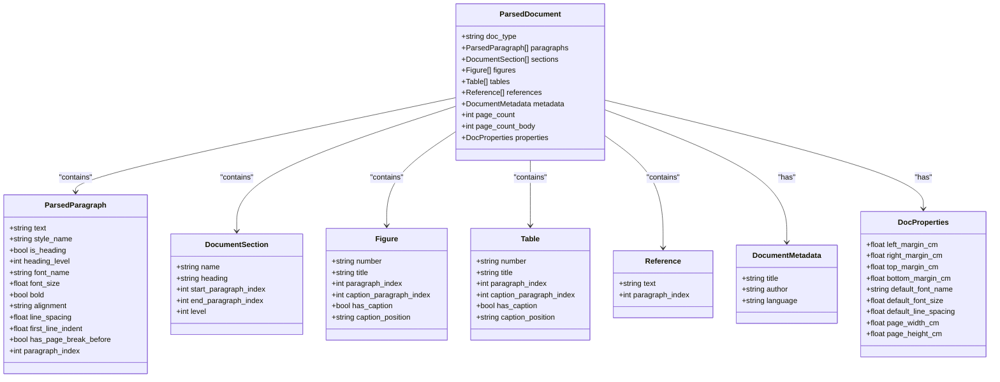
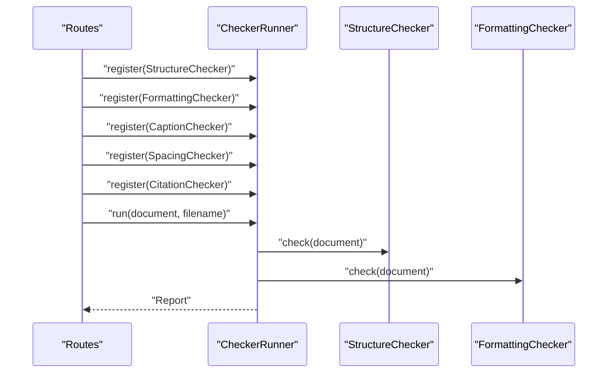
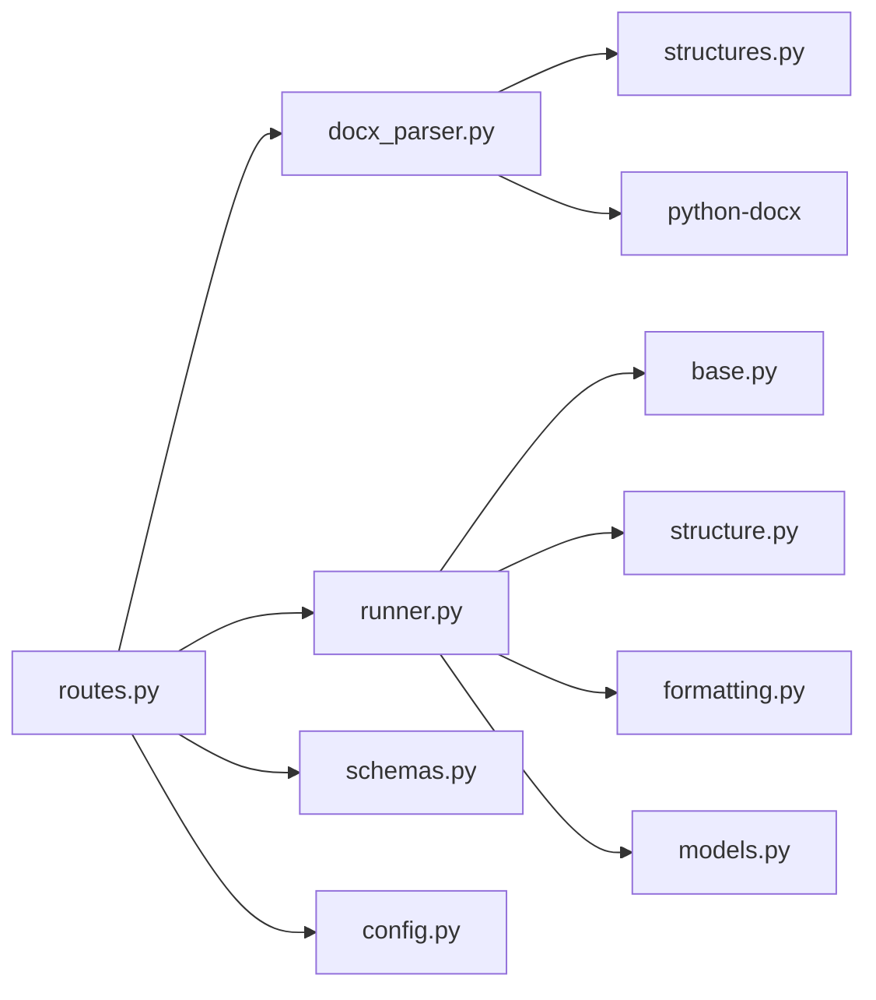
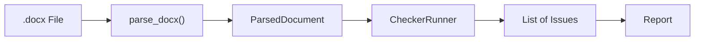

# Document Processing Engine

<cite>
**Referenced Files in This Document**
- [docx_parser.py](file://backend/app/parser/docx_parser.py)
- [structures.py](file://backend/app/parser/structures.py)
- [routes.py](file://backend/app/api/routes.py)
- [runner.py](file://backend/app/runner.py)
- [formatting.py](file://backend/app/checkers/formatting.py)
- [structure.py](file://backend/app/checkers/structure.py)
- [base.py](file://backend/app/checkers/base.py)
- [models.py](file://backend/app/core/models.py)
- [config.py](file://backend/app/core/config.py)
- [schemas.py](file://backend/app/api/schemas.py)
- [test_parser.py](file://backend/tests/test_parser.py)
</cite>

## Table of Contents
1. [Introduction](#introduction)
2. [Project Structure](#project-structure)
3. [Core Components](#core-components)
4. [Architecture Overview](#architecture-overview)
5. [Detailed Component Analysis](#detailed-component-analysis)
6. [Dependency Analysis](#dependency-analysis)
7. [Performance Considerations](#performance-considerations)
8. [Troubleshooting Guide](#troubleshooting-guide)
9. [Conclusion](#conclusion)
10. [Appendices](#appendices)

## Introduction
This document describes the DOCX document processing engine used to extract structured data from Microsoft Word (.docx) files and feed it into a validation pipeline. It explains the DOCX parser implementation, including paragraph extraction, section detection, figure and table identification, and metadata collection. It also documents the parsed document structure, supported features, limitations, examples of processed document objects, data transformation workflows, integration with the validation system, and performance considerations for large documents.

## Project Structure
The DOCX processing engine resides under backend/app/parser and integrates with the validation system under backend/app/checkers. The API layer under backend/app/api exposes an endpoint that accepts .docx uploads, parses them, runs validators, and returns a structured report.

**Diagram sources**
- [routes.py:35-66](file://backend/app/api/routes.py#L35-L66)
- [docx_parser.py:161-238](file://backend/app/parser/docx_parser.py#L161-L238)
- [runner.py:8-25](file://backend/app/runner.py#L8-L25)
- [structure.py:47-148](file://backend/app/checkers/structure.py#L47-L148)
- [formatting.py:15-174](file://backend/app/checkers/formatting.py#L15-L174)

**Section sources**
- [routes.py:1-66](file://backend/app/api/routes.py#L1-L66)
- [docx_parser.py:1-238](file://backend/app/parser/docx_parser.py#L1-L238)
- [runner.py:1-25](file://backend/app/runner.py#L1-L25)

## Core Components
- DOCX Parser: Converts a .docx file into a ParsedDocument containing paragraphs, sections, figures, tables, references, metadata, page counts, and document properties.
- Parsed Document Structures: Dataclasses representing the parsed document model and its parts.
- Validation Pipeline: A runner that applies multiple checkers (structure, formatting, captions, spacing, citations) to the parsed document and aggregates issues into a report.

Key responsibilities:
- Paragraph extraction with style, alignment, spacing, indentation, and page break detection.
- Section detection via heading styles.
- Figure and table detection using localized captions and inline shape inspection.
- Metadata collection from core properties and document-level defaults.
- Page count estimation based on character count.

**Section sources**
- [docx_parser.py:161-238](file://backend/app/parser/docx_parser.py#L161-L238)
- [structures.py:6-89](file://backend/app/parser/structures.py#L6-L89)

## Architecture Overview
The DOCX processing engine follows a layered architecture:
- API Layer: Receives uploads, enforces size limits, writes to a temporary file, invokes the parser, and runs validators.
- Parsing Layer: Reads the .docx, extracts paragraphs and document properties, detects sections, figures, tables, and references.
- Validation Layer: Applies structured checks and produces a report.

**Diagram sources**
- [routes.py:35-66](file://backend/app/api/routes.py#L35-L66)
- [docx_parser.py:161-238](file://backend/app/parser/docx_parser.py#L161-L238)
- [runner.py:15-25](file://backend/app/runner.py#L15-L25)
- [structure.py:51-57](file://backend/app/checkers/structure.py#L51-L57)
- [formatting.py:19-24](file://backend/app/checkers/formatting.py#L19-L24)

## Detailed Component Analysis

### DOCX Parser Implementation
The parser reads a .docx file and builds a ParsedDocument:
- Paragraph extraction: Iterates through doc.paragraphs, infers heading status and level from style names, extracts font info, alignment, line spacing, first-line indent, and page break markers.
- Section detection: Builds top-level sections from first-level headings and sets paragraph ranges.
- Figure detection: Scans paragraph text for figure captions and checks for inline drawing/pict elements.
- Table detection: Identifies tables by caption patterns and marks caption positions.
- References detection: Locates a references section by heading keywords and collects subsequent non-empty paragraphs.
- Properties extraction: Reads margins, page dimensions, and default font from the first section and Normal style.
- Metadata: Extracts core properties (title, author).
- Page count estimation: Estimates total and body page counts based on character count.

**Diagram sources**
- [docx_parser.py:161-238](file://backend/app/parser/docx_parser.py#L161-L238)
- [docx_parser.py:108-123](file://backend/app/parser/docx_parser.py#L108-L123)
- [docx_parser.py:37-65](file://backend/app/parser/docx_parser.py#L37-L65)
- [docx_parser.py:68-84](file://backend/app/parser/docx_parser.py#L68-L84)
- [docx_parser.py:87-105](file://backend/app/parser/docx_parser.py#L87-L105)
- [docx_parser.py:126-151](file://backend/app/parser/docx_parser.py#L126-L151)
- [docx_parser.py:154-158](file://backend/app/parser/docx_parser.py#L154-L158)

**Section sources**
- [docx_parser.py:161-238](file://backend/app/parser/docx_parser.py#L161-L238)
- [docx_parser.py:108-123](file://backend/app/parser/docx_parser.py#L108-L123)
- [docx_parser.py:37-65](file://backend/app/parser/docx_parser.py#L37-L65)
- [docx_parser.py:68-84](file://backend/app/parser/docx_parser.py#L68-L84)
- [docx_parser.py:87-105](file://backend/app/parser/docx_parser.py#L87-L105)
- [docx_parser.py:126-151](file://backend/app/parser/docx_parser.py#L126-L151)
- [docx_parser.py:154-158](file://backend/app/parser/docx_parser.py#L154-L158)

### Parsed Document Structure
The parsed document model consists of:
- ParsedParagraph: Text, style, heading flag and level, font attributes, alignment, spacing, indentation, page break marker, and index.
- DocumentSection: Section name, heading text, indices, and level.
- Figure/Table: Number, title, paragraph index, caption paragraph index, caption presence, and caption position.
- Reference: Text and paragraph index.
- DocumentMetadata: Title, author, language.
- DocProperties: Margins, page dimensions, default font name/size.
- ParsedDocument: Aggregates all above plus doc_type, page counts, and properties.

**Diagram sources**
- [structures.py:6-89](file://backend/app/parser/structures.py#L6-L89)

**Section sources**
- [structures.py:6-89](file://backend/app/parser/structures.py#L6-L89)

### Validation Integration
The API handler:
- Validates file type and size.
- Writes uploaded content to a temporary .docx file.
- Calls parse_docx to produce a ParsedDocument.
- Instantiates a CheckerRunner and registers StructureChecker and FormattingChecker (with stubs for captions, spacing, and citations).
- Produces a Report from collected issues.

**Diagram sources**
- [routes.py:20-27](file://backend/app/api/routes.py#L20-L27)
- [runner.py:12-24](file://backend/app/runner.py#L12-L24)
- [structure.py:47-57](file://backend/app/checkers/structure.py#L47-L57)
- [formatting.py:15-24](file://backend/app/checkers/formatting.py#L15-L24)

**Section sources**
- [routes.py:35-66](file://backend/app/api/routes.py#L35-L66)
- [runner.py:8-25](file://backend/app/runner.py#L8-L25)
- [structure.py:47-148](file://backend/app/checkers/structure.py#L47-L148)
- [formatting.py:15-174](file://backend/app/checkers/formatting.py#L15-L174)

### Supported Features and Limitations
Supported:
- Paragraph extraction with style, alignment, spacing, indentation, and page breaks.
- Section detection via first-level headings.
- Figure detection via localized caption pattern and inline shape presence.
- Table detection via localized caption pattern.
- References detection via heading keywords and subsequent paragraphs.
- Document properties extraction (margins, page dimensions, default font).
- Metadata extraction (title, author).
- Page count estimation.

Limitations:
- Figure caption position detection defaults to below for detected figures.
- Table caption position detection defaults to above for detected tables.
- References detection relies on heading keywords and section boundaries; does not parse reference list semantics.
- Page count estimation is rough and does not account for images, complex layouts, or font variations.
- Inline shape detection for figures is basic and depends on presence of drawing/pict elements.

**Section sources**
- [docx_parser.py:37-65](file://backend/app/parser/docx_parser.py#L37-L65)
- [docx_parser.py:68-84](file://backend/app/parser/docx_parser.py#L68-L84)
- [docx_parser.py:87-105](file://backend/app/parser/docx_parser.py#L87-L105)
- [docx_parser.py:126-151](file://backend/app/parser/docx_parser.py#L126-L151)
- [docx_parser.py:154-158](file://backend/app/parser/docx_parser.py#L154-L158)

### Examples of Processed Document Objects
Examples derived from tests demonstrate:
- Returned object type and doc_type preservation.
- Paragraph extraction with expected text.
- Heading detection and level inference.
- Section extraction from first-level headings.
- Property extraction availability.

These examples confirm the parser’s ability to construct a ParsedDocument with populated paragraphs, sections, and properties.

**Section sources**
- [test_parser.py:9-69](file://backend/tests/test_parser.py#L9-L69)

## Dependency Analysis
The parser depends on:
- python-docx for reading .docx content.
- Localized regular expressions for figure/table caption detection.
- Internal structures for typed data representation.

Validation depends on:
- ParsedDocument for accessing extracted content.
- CheckerRunner for orchestration.
- Issue and Report models for output.

**Diagram sources**
- [docx_parser.py:3-9](file://backend/app/parser/docx_parser.py#L3-L9)
- [routes.py:6-12](file://backend/app/api/routes.py#L6-L12)
- [runner.py:3-5](file://backend/app/runner.py#L3-L5)
- [structure.py:3-6](file://backend/app/checkers/structure.py#L3-L6)
- [formatting.py:3-5](file://backend/app/checkers/formatting.py#L3-L5)
- [models.py:3-6](file://backend/app/core/models.py#L3-L6)
- [schemas.py:3-5](file://backend/app/api/schemas.py#L3-L5)
- [config.py:3-10](file://backend/app/core/config.py#L3-L10)

**Section sources**
- [docx_parser.py:3-9](file://backend/app/parser/docx_parser.py#L3-L9)
- [routes.py:6-12](file://backend/app/api/routes.py#L6-L12)
- [runner.py:3-5](file://backend/app/runner.py#L3-L5)
- [structure.py:3-6](file://backend/app/checkers/structure.py#L3-L6)
- [formatting.py:3-5](file://backend/app/checkers/formatting.py#L3-L5)
- [models.py:3-6](file://backend/app/core/models.py#L3-L6)
- [schemas.py:3-5](file://backend/app/api/schemas.py#L3-L5)
- [config.py:3-10](file://backend/app/core/config.py#L3-L10)

## Performance Considerations
- Memory management:
  - Temporary file handling ensures the .docx is written to disk and removed after processing.
  - Large .docx files are rejected by upload size checks to prevent excessive memory usage.
- Processing cost:
  - Paragraph iteration and regex scanning scale linearly with the number of paragraphs.
  - Inline shape inspection adds overhead proportional to runs per paragraph.
  - Page count estimation is O(n) over paragraphs.
- Recommendations:
  - Validate file size early in the API layer.
  - Consider streaming or chunked processing for extremely large documents if needed.
  - Cache default font properties when available to avoid repeated style lookups.

**Section sources**
- [routes.py:44-49](file://backend/app/api/routes.py#L44-L49)
- [config.py:8](file://backend/app/core/config.py#L8)
- [routes.py:63-65](file://backend/app/api/routes.py#L63-L65)

## Troubleshooting Guide
Common issues and resolutions:
- Unsupported file type: Ensure the uploaded file ends with .docx.
- File too large: Reduce file size or adjust max upload size setting.
- Parsing errors: Verify the .docx is not corrupted and contains readable paragraphs.
- Missing sections or headings: Confirm that first-level headings are properly styled.
- Incorrect figure/table detection: Ensure captions match expected patterns and that inline images are present.
- Empty or partial metadata: Some core properties may be absent; fallback logic still returns a ParsedDocument.

Operational safeguards:
- API layer raises HTTP 400 for invalid file types and oversized files.
- API layer raises HTTP 422 for parsing exceptions with a descriptive message.
- Temporary file cleanup occurs in the finally block.

**Section sources**
- [routes.py:40-49](file://backend/app/api/routes.py#L40-L49)
- [routes.py:61-62](file://backend/app/api/routes.py#L61-L62)
- [routes.py:63-65](file://backend/app/api/routes.py#L63-L65)

## Conclusion
The DOCX processing engine provides a robust foundation for extracting structured content from .docx files and feeding it into a validation pipeline. It supports essential features such as paragraph extraction, section detection, figure/table identification, and metadata collection, while offering clear extension points for additional validations. The API layer ensures safe handling of uploads, and the validation pipeline offers a modular approach to enforcing formatting and structural guidelines.

## Appendices

### Data Transformation Workflows
- From .docx to ParsedDocument: The parser transforms raw paragraphs and document properties into typed structures suitable for validation.
- From ParsedDocument to Report: The runner aggregates issues from multiple checkers into a standardized Report.

**Diagram sources**
- [docx_parser.py:161-238](file://backend/app/parser/docx_parser.py#L161-L238)
- [runner.py:15-24](file://backend/app/runner.py#L15-L24)
- [models.py:29-57](file://backend/app/core/models.py#L29-L57)