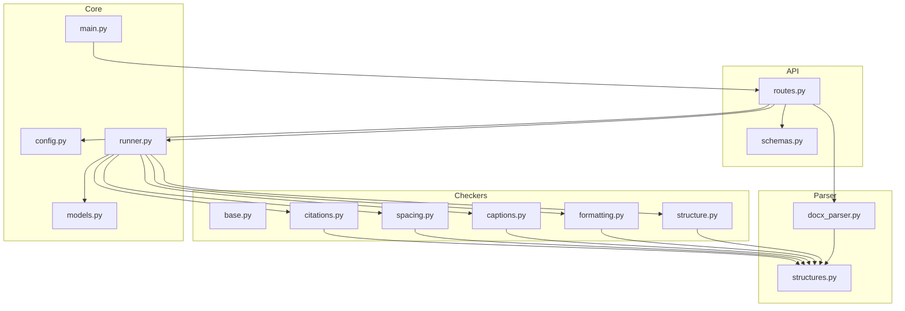
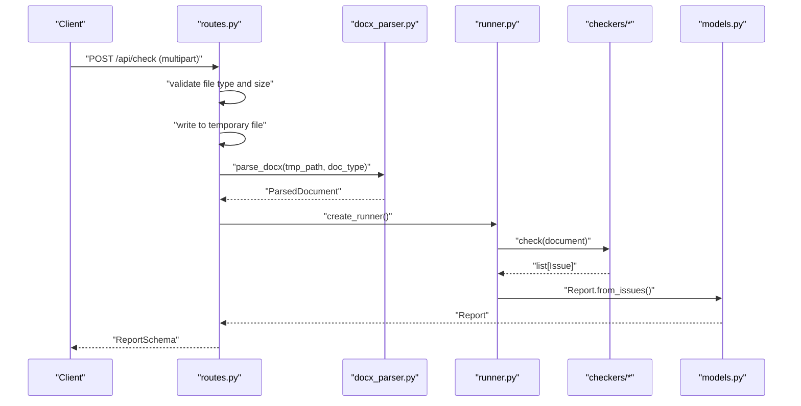
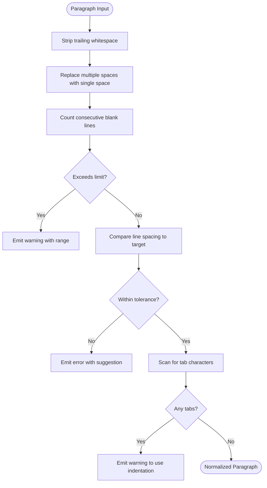
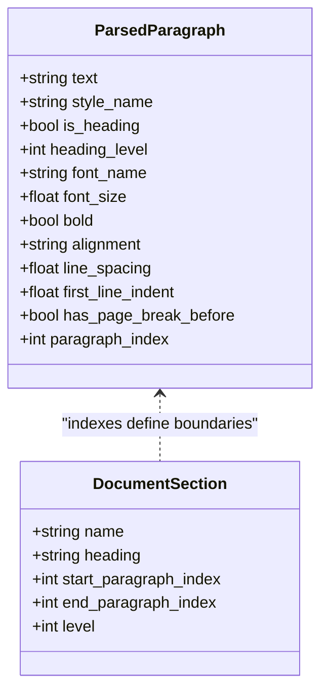
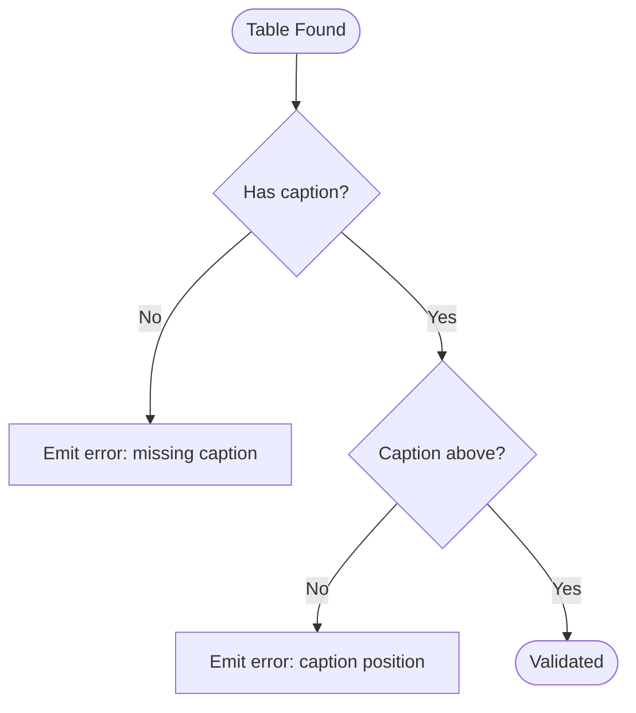
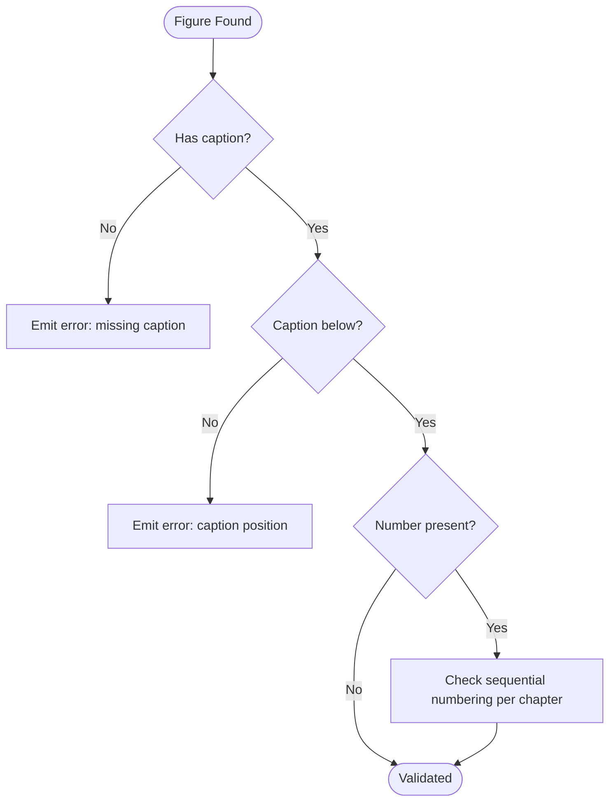
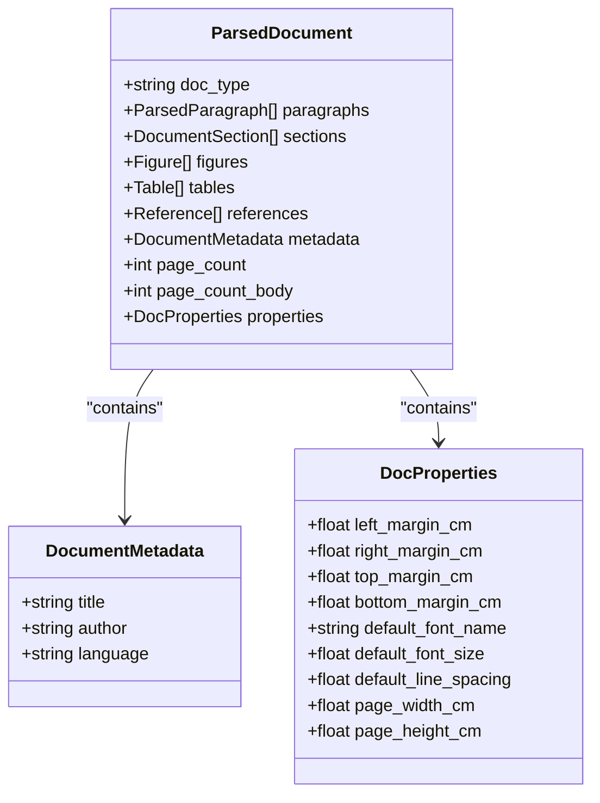
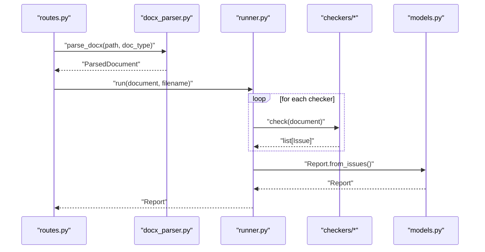
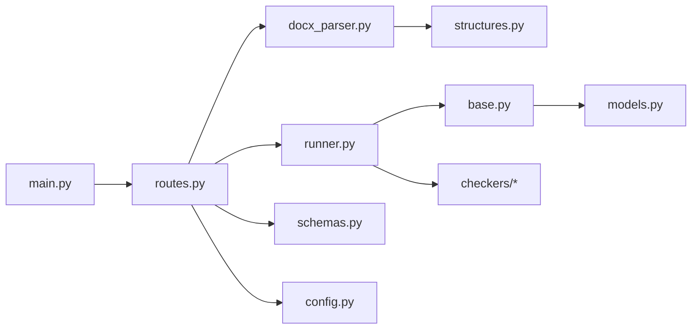

# Content Extraction Methods

<cite>
**Referenced Files in This Document**
- [docx_parser.py](file://backend/app/parser/docx_parser.py)
- [structures.py](file://backend/app/parser/structures.py)
- [routes.py](file://backend/app/api/routes.py)
- [runner.py](file://backend/app/runner.py)
- [base.py](file://backend/app/checkers/base.py)
- [captions.py](file://backend/app/checkers/captions.py)
- [spacing.py](file://backend/app/checkers/spacing.py)
- [models.py](file://backend/app/core/models.py)
- [config.py](file://backend/app/core/config.py)
- [schemas.py](file://backend/app/api/schemas.py)
- [main.py](file://backend/app/main.py)
</cite>

## Table of Contents
1. [Introduction](#introduction)
2. [Project Structure](#project-structure)
3. [Core Components](#core-components)
4. [Architecture Overview](#architecture-overview)
5. [Detailed Component Analysis](#detailed-component-analysis)
6. [Dependency Analysis](#dependency-analysis)
7. [Performance Considerations](#performance-considerations)
8. [Troubleshooting Guide](#troubleshooting-guide)
9. [Conclusion](#conclusion)
10. [Appendices](#appendices)

## Introduction
This document explains the content extraction methods implemented for processing academic documents (e.g., thesis and project documents). It focuses on how paragraphs, headings, tables, figures, and metadata are represented and validated. It also covers whitespace normalization, content filtering, and the orchestration pipeline that transforms uploaded DOCX files into structured reports. Where applicable, it outlines the extraction algorithms and data models, and provides guidance for extending the system to support advanced features such as references, equations, and appendices.

## Project Structure
The backend is organized around:
- Parser: DOCX parsing and structured representation
- Checkers: Validation rules for structure, formatting, captions, spacing, and citations
- API: FastAPI endpoints for upload, parsing, and reporting
- Core: Shared domain models and configuration

**Diagram sources**
- [docx_parser.py:1-8](file://backend/app/parser/docx_parser.py#L1-L8)
- [structures.py:1-89](file://backend/app/parser/structures.py#L1-L89)
- [routes.py:1-75](file://backend/app/api/routes.py#L1-L75)
- [runner.py:1-25](file://backend/app/runner.py#L1-L25)
- [base.py:1-17](file://backend/app/checkers/base.py#L1-L17)
- [captions.py:1-108](file://backend/app/checkers/captions.py#L1-L108)
- [spacing.py:1-136](file://backend/app/checkers/spacing.py#L1-L136)
- [models.py:1-58](file://backend/app/core/models.py#L1-L58)
- [config.py:1-17](file://backend/app/core/config.py#L1-L17)
- [schemas.py:1-38](file://backend/app/api/schemas.py#L1-L38)
- [main.py:1-20](file://backend/app/main.py#L1-L20)

**Section sources**
- [routes.py:1-75](file://backend/app/api/routes.py#L1-L75)
- [docx_parser.py:1-8](file://backend/app/parser/docx_parser.py#L1-L8)
- [structures.py:1-89](file://backend/app/parser/structures.py#L1-L89)
- [runner.py:1-25](file://backend/app/runner.py#L1-L25)
- [base.py:1-17](file://backend/app/checkers/base.py#L1-L17)
- [captions.py:1-108](file://backend/app/checkers/captions.py#L1-L108)
- [spacing.py:1-136](file://backend/app/checkers/spacing.py#L1-L136)
- [models.py:1-58](file://backend/app/core/models.py#L1-L58)
- [config.py:1-17](file://backend/app/core/config.py#L1-L17)
- [schemas.py:1-38](file://backend/app/api/schemas.py#L1-L38)
- [main.py:1-20](file://backend/app/main.py#L1-L20)

## Core Components
- ParsedDocument: Central container holding extracted paragraphs, sections, figures, tables, references, metadata, counts, and document properties.
- ParsedParagraph: Captures text content and formatting attributes (style, heading flag, heading level, font, alignment, spacing, indentation, page break marker, and index).
- DocumentSection: Represents named sections with start/end paragraph indices and heading level.
- Figure/Table: Encapsulate identification, placement, caption presence/position, and caption paragraph index.
- Reference: Minimal record linking a reference text to its paragraph index.
- DocumentMetadata: Stores title, author, and language.
- DocProperties: Holds page and typography defaults/margins.
- Checker interface: BaseChecker defines the contract for validators.
- SpacingChecker: Validates whitespace and line-spacing rules.
- CaptionChecker: Enforces figure/table caption rules and numbering.
- Runner: Orchestrates checker execution and aggregates issues into a report.

**Section sources**
- [structures.py:6-89](file://backend/app/parser/structures.py#L6-L89)
- [base.py:9-17](file://backend/app/checkers/base.py#L9-L17)
- [spacing.py:13-136](file://backend/app/checkers/spacing.py#L13-L136)
- [captions.py:8-108](file://backend/app/checkers/captions.py#L8-L108)
- [runner.py:8-25](file://backend/app/runner.py#L8-L25)
- [models.py:9-58](file://backend/app/core/models.py#L9-L58)

## Architecture Overview
The extraction pipeline begins with an HTTP endpoint receiving a DOCX file. The file is temporarily stored, parsed into a ParsedDocument, and then passed through a suite of checkers. Issues are aggregated into a Report.

**Diagram sources**
- [routes.py:36-68](file://backend/app/api/routes.py#L36-L68)
- [docx_parser.py:5-8](file://backend/app/parser/docx_parser.py#L5-L8)
- [runner.py:15-24](file://backend/app/runner.py#L15-L24)
- [models.py:39-58](file://backend/app/core/models.py#L39-L58)

## Detailed Component Analysis

### Paragraph Extraction and Normalization
- Representation: Each paragraph is modeled as ParsedParagraph with text and formatting fields. Indexing supports precise issue localization.
- Whitespace handling: The SpacingChecker enforces:
  - Removal of trailing whitespace
  - Replacement of multiple spaces with a single space
  - Limiting blank lines to a maximum count
  - Line spacing close to a target value
  - Prefering paragraph indentation over tab characters
- Filtering: Paragraphs are filtered by emptiness for certain validations (e.g., line spacing checks skip empty lines).

**Diagram sources**
- [spacing.py:26-136](file://backend/app/checkers/spacing.py#L26-L136)

**Section sources**
- [structures.py:7-20](file://backend/app/parser/structures.py#L7-L20)
- [spacing.py:17-136](file://backend/app/checkers/spacing.py#L17-L136)

### Heading Detection and Hierarchy Establishment
- Detection: ParsedParagraph includes a heading flag and optional heading level. Headings are identified during parsing and stored accordingly.
- Hierarchy: DocumentSection records section names, associated headings, and paragraph indices. The level indicates the heading level (e.g., 1–9) to support nested section ordering.
- Validation: StructureChecker (placeholder) is intended to enforce section order and completeness.

**Diagram sources**
- [structures.py:7-29](file://backend/app/parser/structures.py#L7-L29)

**Section sources**
- [structures.py:7-29](file://backend/app/parser/structures.py#L7-L29)
- [structure.py:5-11](file://backend/app/checkers/structure.py#L5-L11)

### Table Content Parsing and Caption Processing
- Representation: Table model captures number/title, paragraph index, caption presence/position, and caption paragraph index.
- Validation: CaptionChecker ensures:
  - Tables have captions positioned above the table
  - Caption presence is enforced
- Numbering: While numbering is captured, enforcement of sequential numbering is not implemented in the current code.

**Diagram sources**
- [structures.py:42-49](file://backend/app/parser/structures.py#L42-L49)
- [captions.py:75-107](file://backend/app/checkers/captions.py#L75-L107)

**Section sources**
- [structures.py:42-49](file://backend/app/parser/structures.py#L42-L49)
- [captions.py:75-107](file://backend/app/checkers/captions.py#L75-L107)

### Figure Caption Processing
- Representation: Figure model mirrors Table with number/title, paragraph index, caption presence/position, and caption paragraph index.
- Validation: CaptionChecker ensures:
  - Figures have captions positioned below the figure
  - Caption presence is enforced
  - Sequential numbering within chapters is validated when numbering is present

**Diagram sources**
- [structures.py:32-39](file://backend/app/parser/structures.py#L32-L39)
- [captions.py:18-73](file://backend/app/checkers/captions.py#L18-L73)

**Section sources**
- [structures.py:32-39](file://backend/app/parser/structures.py#L32-L39)
- [captions.py:18-73](file://backend/app/checkers/captions.py#L18-L73)

### Metadata Extraction
- DocumentMetadata stores title, author, and language.
- DocProperties stores margins, default fonts, default line spacing, and page dimensions.
- These are populated by the parser and exposed via ParsedDocument.

**Diagram sources**
- [structures.py:58-89](file://backend/app/parser/structures.py#L58-L89)

**Section sources**
- [structures.py:58-89](file://backend/app/parser/structures.py#L58-L89)

### Academic Elements: References, Equations, Appendices
- References: Present as Reference entries linked to paragraph indices. CitationChecker is a placeholder for citation validation.
- Equations and Appendices: Not implemented in the current codebase; they would extend ParsedDocument with dedicated models and parsers.

**Section sources**
- [structures.py:52-55](file://backend/app/parser/structures.py#L52-L55)
- [citations.py:5-11](file://backend/app/checkers/citations.py#L5-L11)

### Formatted Content Preservation
- Bold and font attributes are captured in ParsedParagraph (bold flag, font name/size).
- Alignment and indentation are preserved to support formatting checks and future rendering.

**Section sources**
- [structures.py:7-19](file://backend/app/parser/structures.py#L7-L19)

### Extraction Orchestration and Reporting
- Routes handle upload, temporary file management, parsing, and checker execution.
- Runner aggregates issues from all registered checkers and produces a Report.
- ReportSchema serializes results for the client.

**Diagram sources**
- [routes.py:58-64](file://backend/app/api/routes.py#L58-L64)
- [runner.py:15-24](file://backend/app/runner.py#L15-L24)
- [models.py:39-58](file://backend/app/core/models.py#L39-L58)

**Section sources**
- [routes.py:36-75](file://backend/app/api/routes.py#L36-L75)
- [runner.py:8-25](file://backend/app/runner.py#L8-L25)
- [models.py:28-58](file://backend/app/core/models.py#L28-L58)
- [schemas.py:25-38](file://backend/app/api/schemas.py#L25-L38)

## Dependency Analysis
- API depends on parser and runner; parser depends on structures; runner depends on checkers and models; checkers depend on structures and base interface.
- Configuration controls upload limits and CORS; schemas define API contracts.

**Diagram sources**
- [routes.py:6-12](file://backend/app/api/routes.py#L6-L12)
- [docx_parser.py:3](file://backend/app/parser/docx_parser.py#L3)
- [runner.py:3-5](file://backend/app/runner.py#L3-L5)
- [base.py:3-6](file://backend/app/checkers/base.py#L3-L6)
- [models.py:3-6](file://backend/app/core/models.py#L3-L6)
- [schemas.py:3-5](file://backend/app/api/schemas.py#L3-L5)
- [config.py:3-10](file://backend/app/core/config.py#L3-L10)
- [main.py:3-19](file://backend/app/main.py#L3-L19)

**Section sources**
- [routes.py:6-12](file://backend/app/api/routes.py#L6-L12)
- [runner.py:3-5](file://backend/app/runner.py#L3-L5)
- [base.py:3-6](file://backend/app/checkers/base.py#L3-L6)
- [models.py:3-6](file://backend/app/core/models.py#L3-L6)
- [schemas.py:3-5](file://backend/app/api/schemas.py#L3-L5)
- [config.py:3-10](file://backend/app/core/config.py#L3-L10)
- [main.py:3-19](file://backend/app/main.py#L3-L19)

## Performance Considerations
- Memory-efficient processing:
  - Temporary file handling prevents loading entire files into memory unnecessarily.
  - Iterative checker execution avoids building intermediate copies of the document.
- Complexity:
  - Paragraph-level validations are O(n) with respect to the number of paragraphs.
  - Caption numbering maintains a small per-chapter state dictionary, keeping overhead low.
- Recommendations:
  - Stream large DOCX reads where possible.
  - Batch process paragraphs in chunks if extending to very large documents.
  - Cache frequently accessed metadata (e.g., chapter numbers) to avoid repeated computation.

[No sources needed since this section provides general guidance]

## Troubleshooting Guide
- Missing or malformed content blocks:
  - CaptionChecker emits errors when figures/tables lack captions or when positions are incorrect.
  - SpacingChecker flags trailing whitespace, excessive blank lines, incorrect line spacing, and tab usage.
- Error handling:
  - Routes catch exceptions during parsing and return standardized HTTP errors.
  - Reports are generated even if partial validation results are available.

**Section sources**
- [captions.py:18-107](file://backend/app/checkers/captions.py#L18-L107)
- [spacing.py:17-136](file://backend/app/checkers/spacing.py#L17-L136)
- [routes.py:63-64](file://backend/app/api/routes.py#L63-L64)

## Conclusion
The system provides a robust foundation for extracting and validating academic document content. Paragraphs, headings, figures, tables, and metadata are modeled clearly, enabling targeted checks. Whitespace normalization and caption validation are implemented, while advanced features like references, equations, and appendices are ready to be integrated. The modular checker architecture and structured report generation support scalable improvements.

[No sources needed since this section summarizes without analyzing specific files]

## Appendices

### Example Extracted Content Structures
- ParsedDocument: Contains lists of paragraphs, sections, figures, tables, references, plus metadata and properties.
- ParsedParagraph: Holds text and formatting attributes for each paragraph.
- DocumentSection: Defines named sections with start/end indices and heading levels.
- Figure/Table: Captures identification, caption presence/position, and paragraph indices.
- Reference: Links a reference text to its paragraph index.
- DocumentMetadata: Stores title, author, language.
- DocProperties: Stores margins, default fonts, and page dimensions.

**Section sources**
- [structures.py:7-89](file://backend/app/parser/structures.py#L7-L89)

### Transformation Processes
- Upload to structured report:
  - Upload DOCX → Parse into ParsedDocument → Run checkers → Aggregate issues → Build Report → Serialize via ReportSchema.

**Section sources**
- [routes.py:36-75](file://backend/app/api/routes.py#L36-L75)
- [runner.py:15-24](file://backend/app/runner.py#L15-L24)
- [models.py:39-58](file://backend/app/core/models.py#L39-L58)
- [schemas.py:25-38](file://backend/app/api/schemas.py#L25-L38)