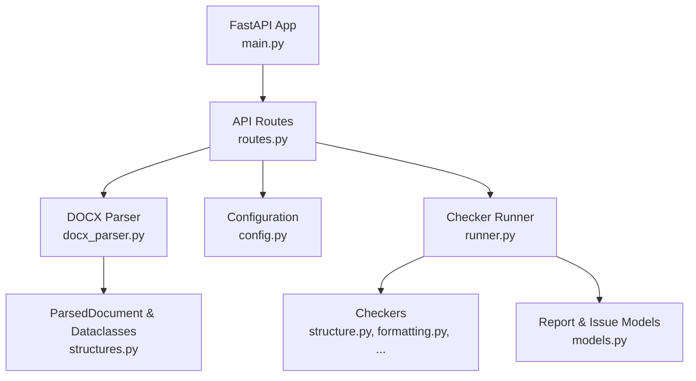
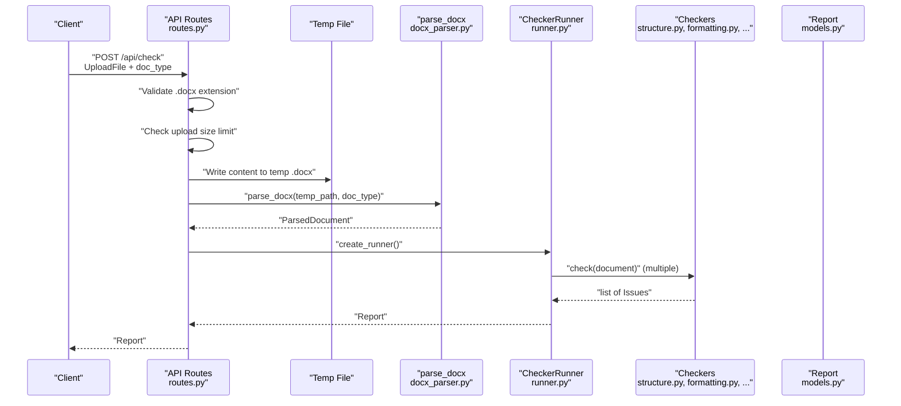
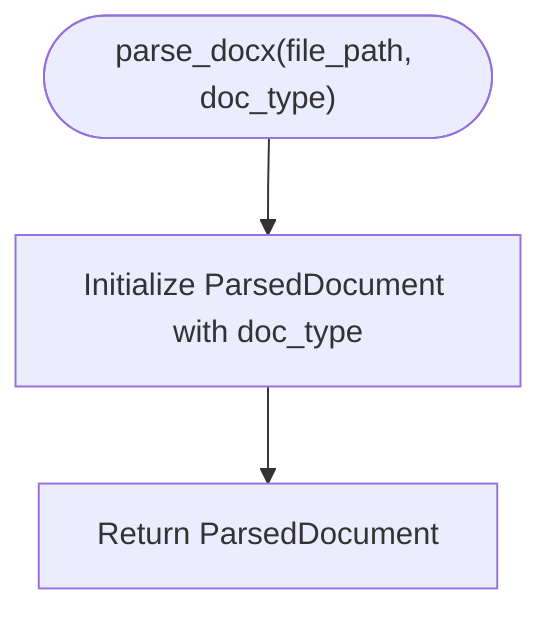
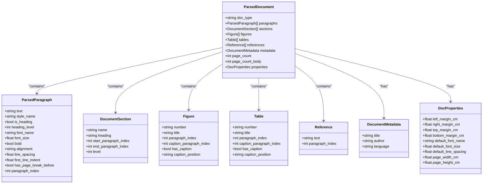
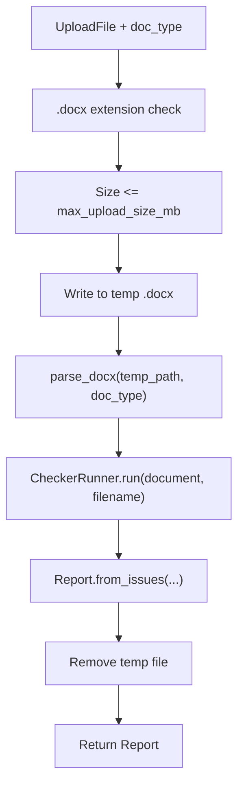
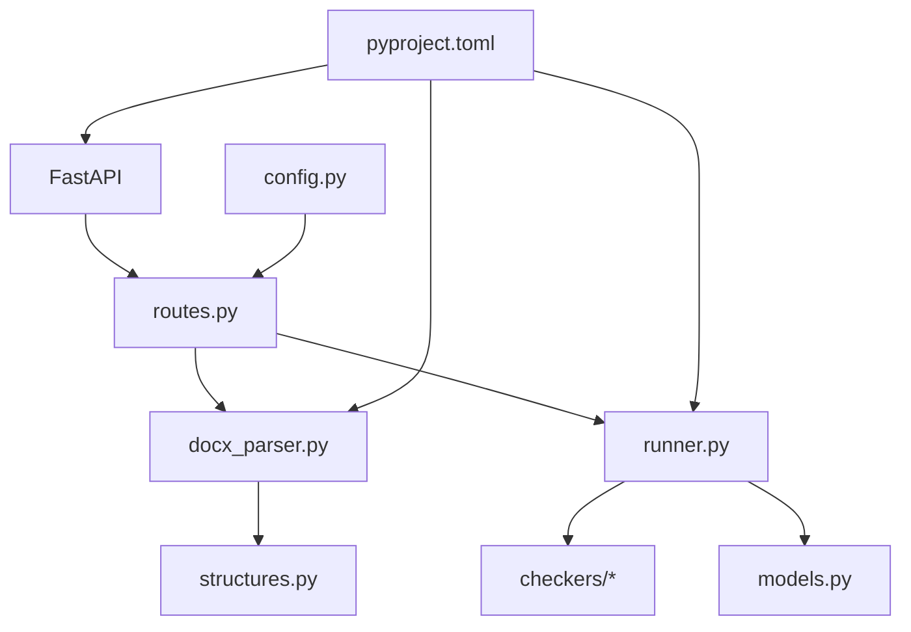

# DOCX Parsing Implementation

<cite>
**Referenced Files in This Document**
- [docx_parser.py](file://backend/app/parser/docx_parser.py)
- [structures.py](file://backend/app/parser/structures.py)
- [routes.py](file://backend/app/api/routes.py)
- [config.py](file://backend/app/core/config.py)
- [main.py](file://backend/app/main.py)
- [runner.py](file://backend/app/runner.py)
- [base.py](file://backend/app/checkers/base.py)
- [models.py](file://backend/app/core/models.py)
- [pyproject.toml](file://backend/pyproject.toml)
- [conftest.py](file://backend/tests/conftest.py)
- [test_captions.py](file://backend/tests/test_captions.py)
</cite>

## Table of Contents
1. [Introduction](#introduction)
2. [Project Structure](#project-structure)
3. [Core Components](#core-components)
4. [Architecture Overview](#architecture-overview)
5. [Detailed Component Analysis](#detailed-component-analysis)
6. [Dependency Analysis](#dependency-analysis)
7. [Performance Considerations](#performance-considerations)
8. [Security Considerations](#security-considerations)
9. [Troubleshooting Guide](#troubleshooting-guide)
10. [Conclusion](#conclusion)

## Introduction
This document provides comprehensive documentation for the DOCX parsing implementation in the dissertation-checker backend. It focuses on the parse_docx function, file path handling, document type validation, error management, and the integration with the ParsedDocument class. It also explains how raw DOCX content is converted into structured data, outlines the parsing workflow from file input to structured output, and addresses security considerations, validation of DOCX format integrity, and handling of corrupted or malformed documents. Performance considerations and memory optimization strategies for large document processing are included, along with examples of successful parsing scenarios and common parsing errors with their solutions.

## Project Structure
The DOCX parsing pipeline resides in the backend module under app/parser and integrates with the API layer, configuration, and checker orchestration. Key components include:
- Parser module: DOCX parsing logic and data structures
- API routes: File upload, validation, temporary file handling, and error propagation
- Configuration: Upload size limits and CORS settings
- Runner: Orchestrates checker execution on parsed documents
- Checkers: Validation logic consuming ParsedDocument instances

**Diagram sources**
- [routes.py:1-75](file://backend/app/api/routes.py#L1-L75)
- [docx_parser.py:1-8](file://backend/app/parser/docx_parser.py#L1-L8)
- [structures.py:1-89](file://backend/app/parser/structures.py#L1-L89)
- [config.py:1-17](file://backend/app/core/config.py#L1-L17)
- [runner.py:1-25](file://backend/app/runner.py#L1-L25)
- [main.py:1-20](file://backend/app/main.py#L1-L20)

**Section sources**
- [routes.py:1-75](file://backend/app/api/routes.py#L1-L75)
- [docx_parser.py:1-8](file://backend/app/parser/docx_parser.py#L1-L8)
- [structures.py:1-89](file://backend/app/parser/structures.py#L1-L89)
- [config.py:1-17](file://backend/app/core/config.py#L1-L17)
- [runner.py:1-25](file://backend/app/runner.py#L1-L25)
- [main.py:1-20](file://backend/app/main.py#L1-L20)

## Core Components
- parse_docx function: Accepts a file path and document type, returning a ParsedDocument instance. Currently initializes a ParsedDocument with the provided doc_type and defaults for other fields.
- ParsedDocument and supporting dataclasses: Define the structured representation of a parsed document, including paragraphs, sections, figures, tables, references, metadata, page counts, and document properties.
- API routes: Validate file extension, enforce upload size limits, write uploaded content to a temporary file, call parse_docx, and orchestrate checker execution via CheckerRunner.
- Configuration: Provides max upload size and CORS settings.
- Runner: Iterates through registered checkers and aggregates issues into a Report.

**Section sources**
- [docx_parser.py:5-8](file://backend/app/parser/docx_parser.py#L5-L8)
- [structures.py:77-89](file://backend/app/parser/structures.py#L77-L89)
- [routes.py:36-68](file://backend/app/api/routes.py#L36-L68)
- [config.py:6-17](file://backend/app/core/config.py#L6-L17)
- [runner.py:8-25](file://backend/app/runner.py#L8-L25)

## Architecture Overview
The DOCX parsing workflow begins at the API endpoint, proceeds through temporary file handling and parsing, and culminates in checker execution and report generation.

**Diagram sources**
- [routes.py:36-68](file://backend/app/api/routes.py#L36-L68)
- [docx_parser.py:5-8](file://backend/app/parser/docx_parser.py#L5-L8)
- [runner.py:15-24](file://backend/app/runner.py#L15-L24)
- [models.py:28-58](file://backend/app/core/models.py#L28-L58)

## Detailed Component Analysis

### parse_docx Function
- Purpose: Parse a .docx file and return a ParsedDocument instance.
- Current Implementation: Initializes a ParsedDocument with the provided doc_type and defaults for other fields. The actual extraction logic is marked as fully implemented in Task 2.
- Input validation: Delegated to the API layer via file extension and size checks.
- Output: ParsedDocument populated with document metadata and structural elements.

**Diagram sources**
- [docx_parser.py:5-8](file://backend/app/parser/docx_parser.py#L5-L8)

**Section sources**
- [docx_parser.py:5-8](file://backend/app/parser/docx_parser.py#L5-L8)

### ParsedDocument and Supporting Dataclasses
- ParsedDocument: Central container holding document type, paragraphs, sections, figures, tables, references, metadata, page counts, and properties.
- ParsedParagraph: Captures text content, style, heading status, font attributes, alignment, spacing, indentation, page break indicators, and paragraph index.
- DocumentSection: Represents named sections with heading, indices, and hierarchy level.
- Figure/Table: Encapsulate numbering, titles, placement, caption presence/position, and caption paragraph indices.
- Reference: Stores textual reference content and its paragraph index.
- DocumentMetadata: Holds optional title, author, and language.
- DocProperties: Stores layout metrics such as margins, default fonts, line spacing, and page dimensions.

**Diagram sources**
- [structures.py:64-89](file://backend/app/parser/structures.py#L64-L89)

**Section sources**
- [structures.py:6-89](file://backend/app/parser/structures.py#L6-L89)

### API Integration and Workflow
- Endpoint: POST /api/check accepts an UploadFile and doc_type form field.
- Validation: Ensures file extension is .docx and enforces max upload size from settings.
- Temporary file handling: Writes uploaded bytes to a temporary .docx file.
- Parsing: Calls parse_docx with the temporary path and doc_type.
- Checker orchestration: Creates a CheckerRunner, registers checkers, runs them against the parsed document, and generates a Report.
- Cleanup: Removes the temporary file in a finally block.

**Diagram sources**
- [routes.py:36-68](file://backend/app/api/routes.py#L36-L68)
- [runner.py:15-24](file://backend/app/runner.py#L15-L24)
- [models.py:39-58](file://backend/app/core/models.py#L39-L58)

**Section sources**
- [routes.py:36-68](file://backend/app/api/routes.py#L36-L68)
- [runner.py:15-24](file://backend/app/runner.py#L15-L24)
- [models.py:39-58](file://backend/app/core/models.py#L39-L58)

### Document Type Handling
- Supported types: thesis_humanities, thesis_science, project.
- The doc_type is passed to parse_docx and stored in ParsedDocument. Checkers consume this value to tailor validations accordingly.

**Section sources**
- [structures.py:78-89](file://backend/app/parser/structures.py#L78-L89)
- [routes.py:39](file://backend/app/api/routes.py#L39)

### Error Management
- API-level validation raises HTTPException for invalid extensions and oversized files.
- parse_docx currently returns a ParsedDocument initialized with defaults; actual parsing logic is pending.
- The API catches exceptions during parsing and returns a 422 error with a descriptive message.
- Temporary file cleanup occurs regardless of success or failure.

**Section sources**
- [routes.py:41-50](file://backend/app/api/routes.py#L41-L50)
- [routes.py:63-67](file://backend/app/api/routes.py#L63-L67)
- [docx_parser.py:5-8](file://backend/app/parser/docx_parser.py#L5-L8)

## Dependency Analysis
The parsing implementation relies on FastAPI for routing, python-docx for DOCX processing, Pydantic for data modeling, and pydantic-settings for configuration. The API layer depends on the parser and runner modules, while checkers depend on the ParsedDocument structure.

**Diagram sources**
- [pyproject.toml:5-12](file://backend/pyproject.toml#L5-L12)
- [routes.py:1-75](file://backend/app/api/routes.py#L1-L75)
- [docx_parser.py:1-8](file://backend/app/parser/docx_parser.py#L1-L8)
- [runner.py:1-25](file://backend/app/runner.py#L1-L25)
- [structures.py:1-89](file://backend/app/parser/structures.py#L1-L89)
- [models.py:1-58](file://backend/app/core/models.py#L1-L58)
- [config.py:1-17](file://backend/app/core/config.py#L1-L17)

**Section sources**
- [pyproject.toml:1-29](file://backend/pyproject.toml#L1-L29)
- [routes.py:1-75](file://backend/app/api/routes.py#L1-L75)
- [docx_parser.py:1-8](file://backend/app/parser/docx_parser.py#L1-L8)
- [runner.py:1-25](file://backend/app/runner.py#L1-L25)
- [structures.py:1-89](file://backend/app/parser/structures.py#L1-L89)
- [models.py:1-58](file://backend/app/core/models.py#L1-L58)
- [config.py:1-17](file://backend/app/core/config.py#L1-L17)

## Performance Considerations
- Upload size limits: Enforced at the API layer to prevent excessive memory usage during upload and parsing.
- Temporary file handling: Writing to disk avoids loading entire content into memory unnecessarily.
- Dataclass usage: Efficient storage and iteration over parsed elements.
- Memory optimization strategies:
  - Stream large uploads to disk and process incrementally.
  - Avoid storing redundant copies of parsed content.
  - Use lazy evaluation for expensive computations within checkers.
  - Monitor and cap resource usage in production deployments.

[No sources needed since this section provides general guidance]

## Security Considerations
- File extension validation: Only .docx files are accepted at the API boundary.
- Upload size limits: Prevents denial-of-service via oversized files.
- Temporary file lifecycle: Files are deleted after processing.
- Input sanitization: Ensure downstream processing does not execute untrusted content; rely on python-docx for safe parsing.
- CORS configuration: Controlled via settings to restrict origins.

**Section sources**
- [routes.py:41-50](file://backend/app/api/routes.py#L41-L50)
- [routes.py:63-67](file://backend/app/api/routes.py#L63-L67)
- [config.py:6-17](file://backend/app/core/config.py#L6-L17)

## Troubleshooting Guide
- Common parsing errors and solutions:
  - Invalid file type: Ensure the uploaded file has a .docx extension. The API rejects non-.docx files.
  - File too large: Reduce file size below the configured max_upload_size_mb limit.
  - Parsing failures: Catch-all exception handler returns a 422 error; inspect server logs for underlying causes.
  - Empty or corrupted DOCX: Verify the file integrity externally; the current parse_docx returns a default ParsedDocument.
- Successful parsing scenarios:
  - Upload a valid .docx file within size limits; the API writes a temporary file, calls parse_docx, executes checkers, and returns a Report.
  - Use the /api/reports/{report_id} endpoint to retrieve previously generated reports.

**Section sources**
- [routes.py:41-50](file://backend/app/api/routes.py#L41-L50)
- [routes.py:63-67](file://backend/app/api/routes.py#L63-L67)
- [routes.py:70-75](file://backend/app/api/routes.py#L70-L75)

## Conclusion
The DOCX parsing implementation establishes a clear pipeline from file upload to structured document representation and subsequent validation. While the parse_docx function currently initializes a ParsedDocument with defaults, the architecture supports incremental enhancement of the parsing logic. Robust API-level validation, temporary file handling, and error management provide a solid foundation for secure and reliable processing. Extending parse_docx to extract content from DOCX files and populate the ParsedDocument dataclasses will complete the integration with the checker suite, enabling comprehensive document quality assessment.