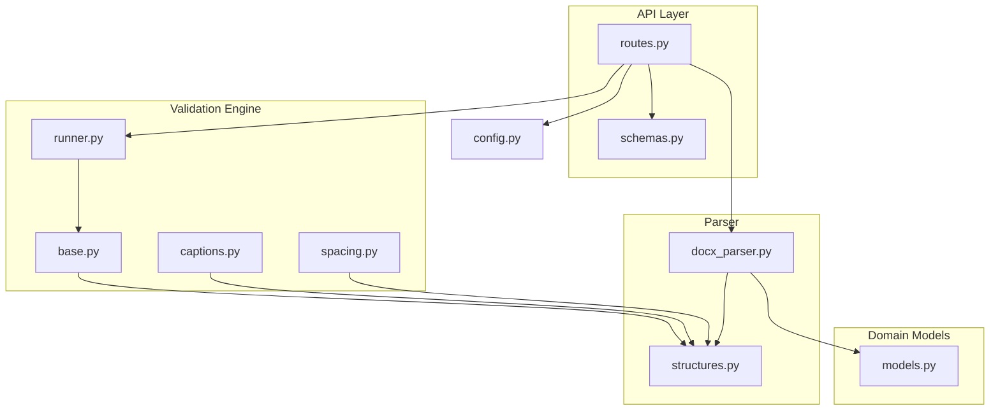
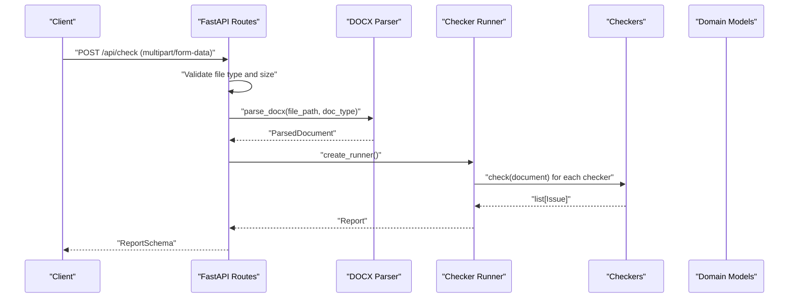
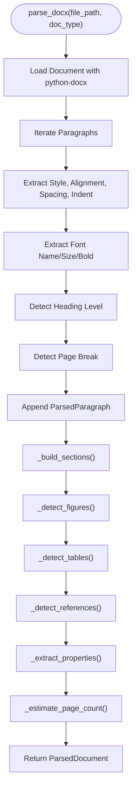
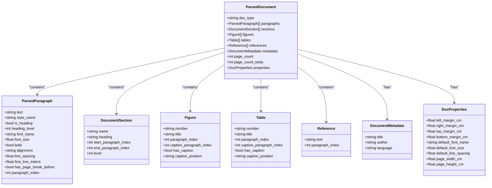
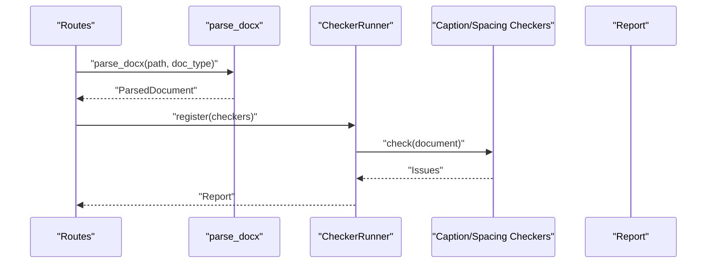
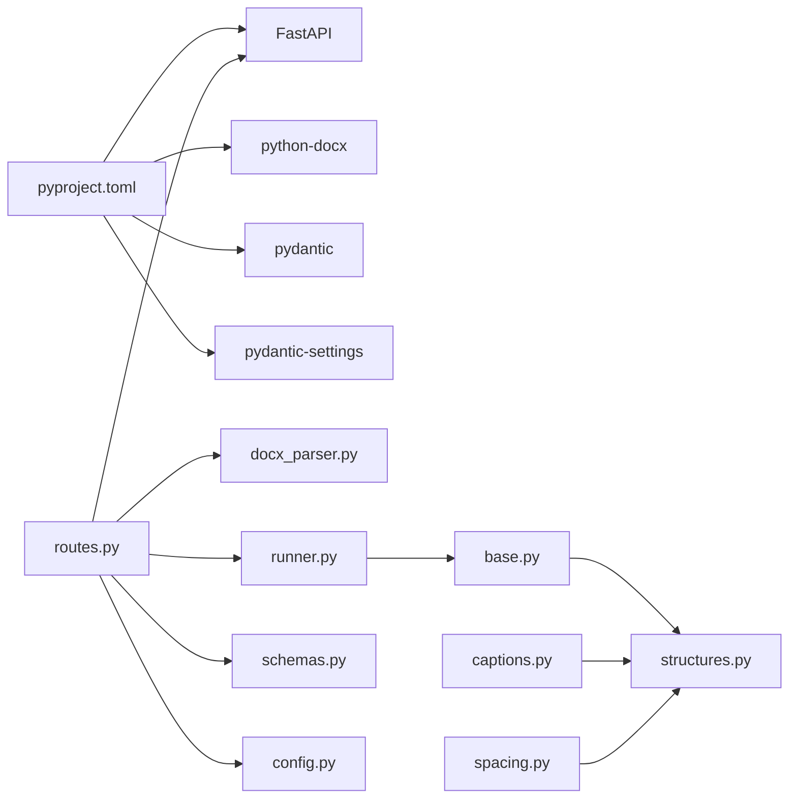

# Document Processing

<cite>
**Referenced Files in This Document**
- [docx_parser.py](file://backend/app/parser/docx_parser.py)
- [structures.py](file://backend/app/parser/structures.py)
- [routes.py](file://backend/app/api/routes.py)
- [runner.py](file://backend/app/runner.py)
- [base.py](file://backend/app/checkers/base.py)
- [captions.py](file://backend/app/checkers/captions.py)
- [spacing.py](file://backend/app/checkers/spacing.py)
- [models.py](file://backend/app/core/models.py)
- [schemas.py](file://backend/app/api/schemas.py)
- [config.py](file://backend/app/core/config.py)
- [pyproject.toml](file://backend/pyproject.toml)
</cite>

## Table of Contents
1. [Introduction](#introduction)
2. [Project Structure](#project-structure)
3. [Core Components](#core-components)
4. [Architecture Overview](#architecture-overview)
5. [Detailed Component Analysis](#detailed-component-analysis)
6. [Dependency Analysis](#dependency-analysis)
7. [Performance Considerations](#performance-considerations)
8. [Troubleshooting Guide](#troubleshooting-guide)
9. [Conclusion](#conclusion)
10. [Appendices](#appendices)

## Introduction
This document explains the DOCX document processing system used by the dissertation-checker backend. It covers how DOCX files are parsed into a structured representation, how the resulting data model supports validation, and how the system integrates with the checker pipeline. It also documents content extraction methods for paragraphs, headings, tables, figures, and references; format conversion and normalization; content filtering; error handling; performance and security considerations; and integration patterns with the validation engine.

## Project Structure
The document processing subsystem resides under backend/app/parser and integrates with the API layer, the checker registry, and the domain models.

**Diagram sources**
- [docx_parser.py](file://backend/app/parser/docx_parser.py)
- [structures.py](file://backend/app/parser/structures.py)
- [routes.py](file://backend/app/api/routes.py)
- [runner.py](file://backend/app/runner.py)
- [base.py](file://backend/app/checkers/base.py)
- [captions.py](file://backend/app/checkers/captions.py)
- [spacing.py](file://backend/app/checkers/spacing.py)
- [models.py](file://backend/app/core/models.py)
- [schemas.py](file://backend/app/api/schemas.py)
- [config.py](file://backend/app/core/config.py)

**Section sources**
- [routes.py](file://backend/app/api/routes.py)
- [docx_parser.py](file://backend/app/parser/docx_parser.py)
- [structures.py](file://backend/app/parser/structures.py)
- [runner.py](file://backend/app/runner.py)
- [base.py](file://backend/app/checkers/base.py)
- [captions.py](file://backend/app/checkers/captions.py)
- [spacing.py](file://backend/app/checkers/spacing.py)
- [models.py](file://backend/app/core/models.py)
- [schemas.py](file://backend/app/api/schemas.py)
- [config.py](file://backend/app/core/config.py)

## Core Components
- DOCX Parser: Reads a .docx file and constructs a ParsedDocument containing paragraphs, sections, figures, tables, references, metadata, and document properties.
- ParsedDocument Data Model: A structured representation of parsed content enabling validation rules to operate consistently across document elements.
- Checker Registry: Orchestrates validation by invoking individual checkers that consume ParsedDocument.
- API Integration: Exposes endpoints to upload DOCX files, parse them, run validations, and return reports.

Key responsibilities:
- Extract paragraphs, headings, tables, figures, and references.
- Normalize text and format attributes (font, alignment, spacing).
- Build document sections and compute page counts.
- Produce a validated, normalized ParsedDocument for downstream checkers.

**Section sources**
- [docx_parser.py](file://backend/app/parser/docx_parser.py)
- [structures.py](file://backend/app/parser/structures.py)
- [routes.py](file://backend/app/api/routes.py)
- [runner.py](file://backend/app/runner.py)

## Architecture Overview
The system follows a layered architecture:
- Presentation: FastAPI routes handle uploads and responses.
- Application: DOCX parsing and checker orchestration.
- Domain: Validation rules and report generation.
- Data: Structured document representation.

**Diagram sources**
- [routes.py](file://backend/app/api/routes.py)
- [docx_parser.py](file://backend/app/parser/docx_parser.py)
- [runner.py](file://backend/app/runner.py)
- [base.py](file://backend/app/checkers/base.py)
- [models.py](file://backend/app/core/models.py)
- [schemas.py](file://backend/app/api/schemas.py)

## Detailed Component Analysis

### DOCX Parser
The parser reads a .docx file via the python-docx library and builds a ParsedDocument. It extracts:
- Paragraphs: Text, style, heading detection, font info, alignment, line spacing, first-line indent, and page break markers.
- Sections: Top-level sections derived from top-level headings.
- Figures: Detected by figure-number patterns; captions assumed below.
- Tables: Detected by table-number patterns; captions assumed above.
- References: Detected after recognized references headings until next top-level heading.
- Properties: Margins, page dimensions, default font from section settings.
- Metadata: Title and author from core properties.
- Page count: Estimated from total character count.

**Diagram sources**
- [docx_parser.py](file://backend/app/parser/docx_parser.py)

**Section sources**
- [docx_parser.py](file://backend/app/parser/docx_parser.py)

### ParsedDocument Data Model
The ParsedDocument aggregates all extracted elements and metadata. Its fields enable targeted validation:
- doc_type: Type of document being checked.
- paragraphs: List of ParsedParagraph with normalized formatting.
- sections: DocumentSection boundaries for structural checks.
- figures: Figure metadata for caption and placement validation.
- tables: Table metadata for caption and placement validation.
- references: Reference entries for citation validation.
- metadata: Title and author.
- page_count/page_count_body: Page estimates for length checks.
- properties: Margins, page sizes, default font.

**Diagram sources**
- [structures.py](file://backend/app/parser/structures.py)

**Section sources**
- [structures.py](file://backend/app/parser/structures.py)

### Content Extraction Methods
- Paragraphs and Headings: Style names and Heading styles are used to detect headings and infer heading levels. Normalized attributes include alignment, line spacing, and first-line indent.
- Tables and Figures: Numbered captions are detected using localized keywords and numeric patterns; placement assumptions are recorded (figure below, table above).
- References: Identified after recognized headings for references/bibliography until the next top-level heading.
- Sections: Derived from top-level headings; section ranges are set by paragraph indices.
- Properties and Metadata: Margins, page dimensions, and default font are extracted from the first section and core properties.

**Section sources**
- [docx_parser.py](file://backend/app/parser/docx_parser.py)

### Format Conversion and Normalization
- Alignment mapping: Converts paragraph alignment constants to normalized strings.
- Line spacing: Stored as numeric values; comparisons enforce standards.
- Indents and margins: Converted to centimeters for consistency.
- Fonts: Captured from paragraph runs; defaults inferred from Normal style.

**Section sources**
- [docx_parser.py](file://backend/app/parser/docx_parser.py)

### Content Filtering and Validation Integration
- Filters are applied implicitly during parsing (e.g., skipping empty paragraphs when building references).
- Validation relies on ParsedDocument fields to locate issues precisely (e.g., paragraph_index for IssueLocation).

**Section sources**
- [docx_parser.py](file://backend/app/parser/docx_parser.py)
- [models.py](file://backend/app/core/models.py)

### Relationship Between Parsing and Validation
- The API route parses the uploaded DOCX into a ParsedDocument.
- The CheckerRunner invokes each checker with the ParsedDocument.
- Checkers produce Issues with locations referencing paragraph indices and section names.

**Diagram sources**
- [routes.py](file://backend/app/api/routes.py)
- [runner.py](file://backend/app/runner.py)
- [base.py](file://backend/app/checkers/base.py)
- [captions.py](file://backend/app/checkers/captions.py)
- [spacing.py](file://backend/app/checkers/spacing.py)
- [models.py](file://backend/app/core/models.py)

**Section sources**
- [routes.py](file://backend/app/api/routes.py)
- [runner.py](file://backend/app/runner.py)
- [base.py](file://backend/app/checkers/base.py)
- [captions.py](file://backend/app/checkers/captions.py)
- [spacing.py](file://backend/app/checkers/spacing.py)
- [models.py](file://backend/app/core/models.py)

### Examples of Parsed Document Structures
- A minimal ParsedDocument contains paragraphs with normalized formatting, top-level sections, and metadata. Figures and tables are present if detected by number patterns; references are captured after recognized headings.
- Example usage pattern: The API route constructs a ParsedDocument from an uploaded file and passes it to the checker runner to produce a Report.

**Section sources**
- [routes.py](file://backend/app/api/routes.py)
- [docx_parser.py](file://backend/app/parser/docx_parser.py)
- [models.py](file://backend/app/core/models.py)

## Dependency Analysis
External dependencies include FastAPI, python-docx, Pydantic, and pydantic-settings. Internal dependencies form a clean separation between parsing, validation, and API layers.

**Diagram sources**
- [pyproject.toml](file://backend/pyproject.toml)
- [routes.py](file://backend/app/api/routes.py)
- [docx_parser.py](file://backend/app/parser/docx_parser.py)
- [runner.py](file://backend/app/runner.py)
- [base.py](file://backend/app/checkers/base.py)
- [captions.py](file://backend/app/checkers/captions.py)
- [spacing.py](file://backend/app/checkers/spacing.py)
- [schemas.py](file://backend/app/api/schemas.py)
- [config.py](file://backend/app/core/config.py)

**Section sources**
- [pyproject.toml](file://backend/pyproject.toml)
- [routes.py](file://backend/app/api/routes.py)
- [runner.py](file://backend/app/runner.py)
- [base.py](file://backend/app/checkers/base.py)
- [captions.py](file://backend/app/checkers/captions.py)
- [spacing.py](file://backend/app/checkers/spacing.py)
- [docx_parser.py](file://backend/app/parser/docx_parser.py)
- [structures.py](file://backend/app/parser/structures.py)
- [schemas.py](file://backend/app/api/schemas.py)
- [config.py](file://backend/app/core/config.py)

## Performance Considerations
- Large documents: The current parser iterates through paragraphs and sections linearly. For very large files, consider:
  - Streaming reads and chunked processing.
  - Lazy evaluation of expensive computations (e.g., page count estimation).
  - Efficient regular expressions and precompiled patterns.
- Memory management:
  - Avoid retaining unnecessary intermediate objects.
  - Use generators for large collections where feasible.
- Parallelism:
  - Validation can be parallelized across checkers if stateless and I/O bound.
- Caching:
  - Cache repeated computations (e.g., normalized alignments) when safe.

[No sources needed since this section provides general guidance]

## Troubleshooting Guide
Common issues and mitigations:
- Unsupported or malformed DOCX:
  - The parser uses python-docx to load the document. Failures surface as exceptions during parsing. The API catches exceptions and returns a 422 error with a descriptive message.
- File size limits:
  - The API enforces a maximum upload size configured in settings. Exceeding this limit triggers a 400 error.
- Temporary file cleanup:
  - The API writes the uploaded file to a temporary file and removes it in a finally block to prevent disk accumulation.
- Validation errors:
  - Checkers return Issues with precise locations (paragraph_index, section_name). Review the Report to locate problem areas.

**Section sources**
- [routes.py](file://backend/app/api/routes.py)
- [config.py](file://backend/app/core/config.py)

## Conclusion
The DOCX processing system cleanly separates parsing, validation, and presentation concerns. The ParsedDocument data model provides a robust foundation for validators to enforce formatting, structure, and content rules. By normalizing format attributes and extracting structured metadata, the system enables accurate, repeatable checks suitable for academic document quality assurance.

[No sources needed since this section summarizes without analyzing specific files]

## Appendices

### API Endpoints and Data Contracts
- POST /api/check: Accepts multipart/form-data with a .docx file and doc_type. Returns a ReportSchema.
- GET /api/reports/{report_id}: Retrieves a previously generated report.

**Section sources**
- [routes.py](file://backend/app/api/routes.py)
- [schemas.py](file://backend/app/api/schemas.py)

### Checker Integration Patterns
- Register checkers in the CheckerRunner to include them in the validation pipeline.
- Each checker consumes ParsedDocument and produces Issues with IssueLocation.

**Section sources**
- [runner.py](file://backend/app/runner.py)
- [base.py](file://backend/app/checkers/base.py)
- [captions.py](file://backend/app/checkers/captions.py)
- [spacing.py](file://backend/app/checkers/spacing.py)
- [models.py](file://backend/app/core/models.py)