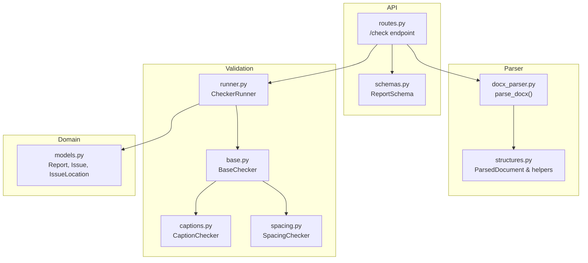
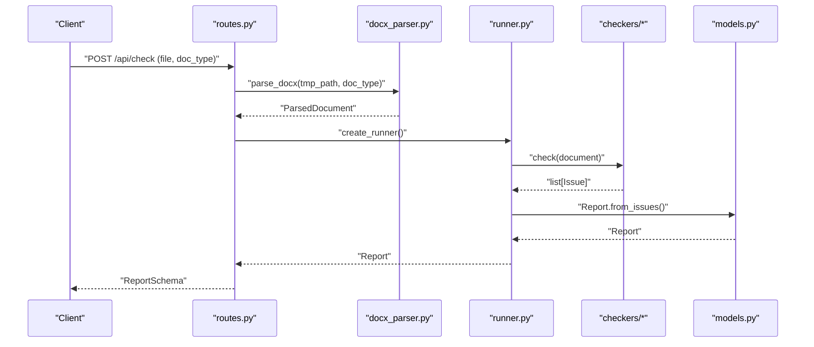
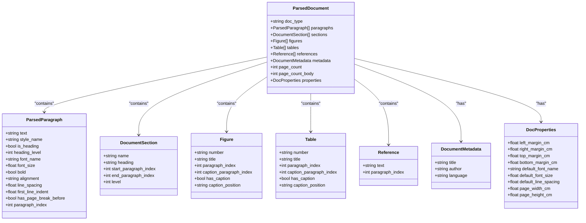
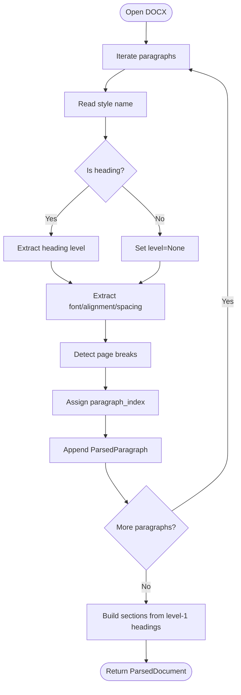
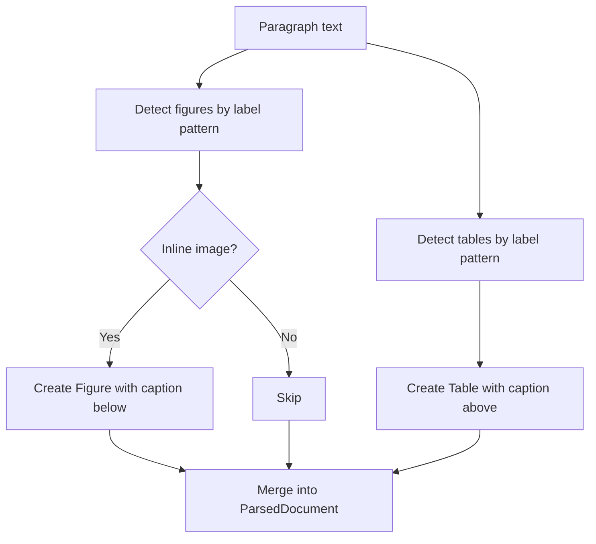
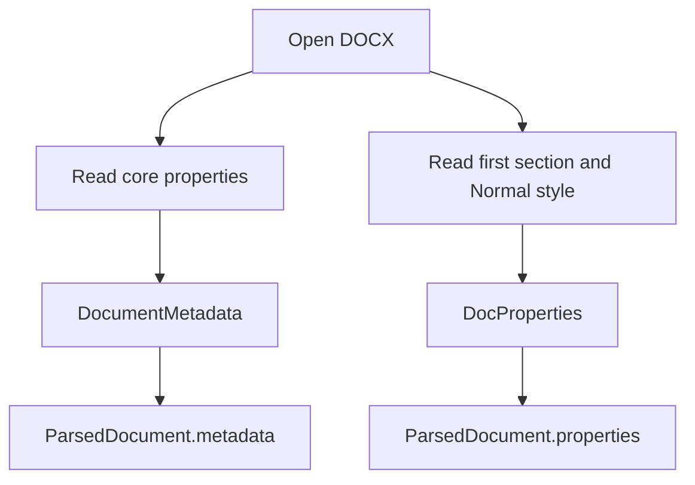
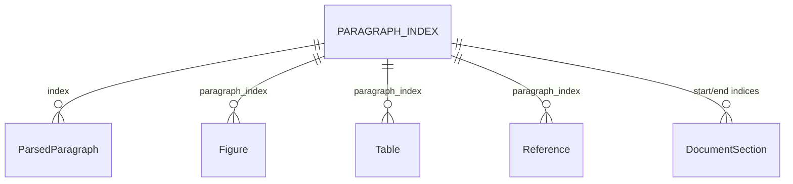
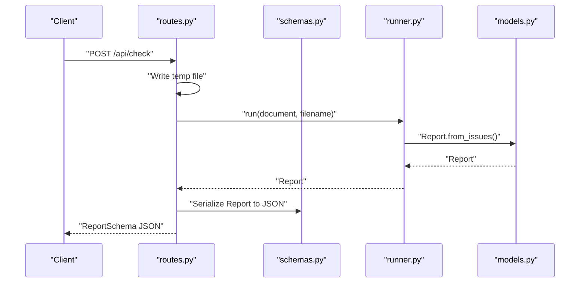
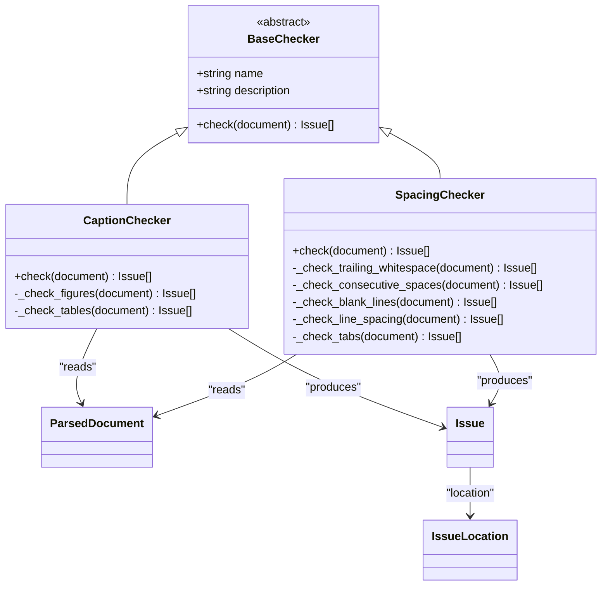
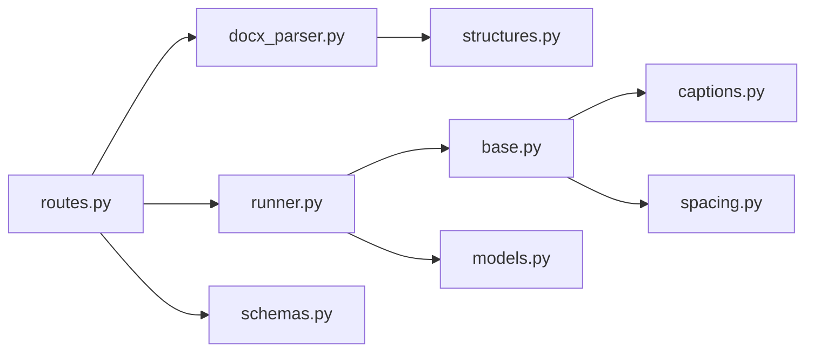

# Parsed Document Model

<cite>
**Referenced Files in This Document**
- [structures.py](file://backend/app/parser/structures.py)
- [docx_parser.py](file://backend/app/parser/docx_parser.py)
- [routes.py](file://backend/app/api/routes.py)
- [runner.py](file://backend/app/runner.py)
- [base.py](file://backend/app/checkers/base.py)
- [captions.py](file://backend/app/checkers/captions.py)
- [spacing.py](file://backend/app/checkers/spacing.py)
- [models.py](file://backend/app/core/models.py)
- [schemas.py](file://backend/app/api/schemas.py)
</cite>

## Table of Contents
1. [Introduction](#introduction)
2. [Project Structure](#project-structure)
3. [Core Components](#core-components)
4. [Architecture Overview](#architecture-overview)
5. [Detailed Component Analysis](#detailed-component-analysis)
6. [Dependency Analysis](#dependency-analysis)
7. [Performance Considerations](#performance-considerations)
8. [Troubleshooting Guide](#troubleshooting-guide)
9. [Conclusion](#conclusion)
10. [Appendices](#appendices)

## Introduction
This document describes the ParsedDocument data model and related structures used to represent and validate academic dissertations. It explains how parsed content is organized for downstream validation, including paragraph extraction, heading hierarchy, table and figure detection, metadata handling, and structural relationships. It also documents how the parsed structures integrate with validation checkers and how content mapping supports checker functionality. Finally, it outlines the parsing pipeline and the current state of implementation.

## Project Structure
The ParsedDocument model lives in the parser module alongside supporting structures. The API layer orchestrates parsing and validation via a runner that invokes specialized checkers. Validation results are aggregated into a domain Report model and serialized for the client.

**Diagram sources**
- [structures.py:1-89](file://backend/app/parser/structures.py#L1-L89)
- [docx_parser.py:1-8](file://backend/app/parser/docx_parser.py#L1-L8)
- [routes.py:1-75](file://backend/app/api/routes.py#L1-L75)
- [runner.py:1-25](file://backend/app/runner.py#L1-L25)
- [base.py:1-17](file://backend/app/checkers/base.py#L1-L17)
- [captions.py:1-108](file://backend/app/checkers/captions.py#L1-L108)
- [spacing.py:1-136](file://backend/app/checkers/spacing.py#L1-L136)
- [models.py:1-58](file://backend/app/core/models.py#L1-L58)
- [schemas.py:1-38](file://backend/app/api/schemas.py#L1-L38)

**Section sources**
- [structures.py:1-89](file://backend/app/parser/structures.py#L1-L89)
- [docx_parser.py:1-8](file://backend/app/parser/docx_parser.py#L1-L8)
- [routes.py:1-75](file://backend/app/api/routes.py#L1-L75)
- [runner.py:1-25](file://backend/app/runner.py#L1-L25)
- [base.py:1-17](file://backend/app/checkers/base.py#L1-L17)
- [captions.py:1-108](file://backend/app/checkers/captions.py#L1-L108)
- [spacing.py:1-136](file://backend/app/checkers/spacing.py#L1-L136)
- [models.py:1-58](file://backend/app/core/models.py#L1-L58)
- [schemas.py:1-38](file://backend/app/api/schemas.py#L1-L38)

## Core Components
This section documents the primary data structures used to represent parsed documents and their relationships.

- ParsedDocument: Top-level container holding all parsed content and metadata.
- ParsedParagraph: Individual paragraph with formatting and structural attributes.
- DocumentSection: Logical sections derived from headings.
- Figure/Table: Detected figures/tables with captions and positions.
- Reference: Detected reference entries.
- DocumentMetadata: Core document properties.
- DocProperties: Page and typography defaults.

Key relationships:
- ParsedDocument aggregates lists of ParsedParagraph, DocumentSection, Figure, Table, Reference, and holds DocumentMetadata and DocProperties.
- Paragraph indices are used to track locations across all structures for precise issue reporting.

**Section sources**
- [structures.py:6-89](file://backend/app/parser/structures.py#L6-L89)

## Architecture Overview
The parsing and validation pipeline transforms a DOCX file into a structured ParsedDocument, which is then validated by multiple checkers. Results are aggregated into a Report.

**Diagram sources**
- [routes.py:36-68](file://backend/app/api/routes.py#L36-L68)
- [docx_parser.py:5-7](file://backend/app/parser/docx_parser.py#L5-L7)
- [runner.py:15-24](file://backend/app/runner.py#L15-L24)
- [base.py:13-16](file://backend/app/checkers/base.py#L13-L16)
- [models.py:39-57](file://backend/app/core/models.py#L39-L57)

## Detailed Component Analysis

### ParsedDocument and Supporting Structures
The ParsedDocument class encapsulates the entire parsed document state. It includes:
- doc_type: Type of document being checked.
- paragraphs: Ordered list of ParsedParagraph with formatting and structural info.
- sections: Derived sections based on heading hierarchy.
- figures/tables: Detected figures and tables with caption metadata.
- references: Extracted reference entries.
- metadata: Title, author, language.
- page_count/page_count_body: Page estimates.
- properties: Defaults for margins, fonts, and page dimensions.

ParsedParagraph attributes include text, style name, heading classification, font metrics, alignment, spacing, indentation, and a paragraph_index for location tracking.

DocumentSection captures section boundaries using paragraph indices.

Figure/Table capture caption presence, position, and paragraph indices for precise issue localization.

Reference stores raw text and paragraph index.

DocumentMetadata and DocProperties provide core properties and defaults.

**Diagram sources**
- [structures.py:6-89](file://backend/app/parser/structures.py#L6-L89)

**Section sources**
- [structures.py:6-89](file://backend/app/parser/structures.py#L6-L89)

### Paragraph Extraction and Heading Hierarchy
Paragraph extraction populates ParsedParagraph with:
- Text content and style name.
- Heading detection and level extraction.
- Font name, size, and bold state.
- Alignment, line spacing, and first-line indent.
- Page break indicators.
- A stable paragraph_index for location tracking.

Heading hierarchy is derived from style names and normalized numeric levels. Sections are built from top-level headings, with paragraph ranges set between subsequent section headings.

**Diagram sources**
- [docx_parser.py:901-977](file://backend/app/parser/docx_parser.py#L901-L977)

**Section sources**
- [docx_parser.py:901-977](file://backend/app/parser/docx_parser.py#L901-L977)

### Table Parsing and Figure Detection
Tables and figures are detected via pattern matching in paragraph text and inline shape inspection:
- Figures: Pattern matching for figure labels and inline drawing/pict elements; captions are assumed to be present and positioned below.
- Tables: Pattern matching for table labels; captions are assumed above.
- Captions: Captions are associated with detected items via paragraph indices for precise issue reporting.

**Diagram sources**
- [docx_parser.py:777-824](file://backend/app/parser/docx_parser.py#L777-L824)

**Section sources**
- [docx_parser.py:777-824](file://backend/app/parser/docx_parser.py#L777-L824)

### Metadata Handling
DocumentMetadata is populated from core properties (title, author). DocProperties captures margins, page dimensions, and default font from the first section and Normal style.

**Diagram sources**
- [docx_parser.py:866-891](file://backend/app/parser/docx_parser.py#L866-L891)
- [docx_parser.py:970-976](file://backend/app/parser/docx_parser.py#L970-L976)

**Section sources**
- [docx_parser.py:866-891](file://backend/app/parser/docx_parser.py#L866-L891)
- [docx_parser.py:970-976](file://backend/app/parser/docx_parser.py#L970-L976)

### Content Indexing, Location Tracking, and Structural Relationships
- paragraph_index: Used consistently across ParsedParagraph, Figure, Table, and Reference to enable precise issue localization.
- sections: Derived from level-1 headings; each section’s start/end paragraph indices define logical boundaries.
- references: Detected after a recognized references heading until the next top-level heading.

**Diagram sources**
- [structures.py:7-89](file://backend/app/parser/structures.py#L7-L89)

**Section sources**
- [structures.py:7-89](file://backend/app/parser/structures.py#L7-L89)

### Serialization and Deserialization
- API responses use Pydantic schemas for serialization (ReportSchema).
- The runner produces a Report from collected issues; the API endpoint returns this schema.
- Deserialization is implicit: uploaded DOCX is written to a temporary file and parsed into ParsedDocument.

**Diagram sources**
- [routes.py:52-67](file://backend/app/api/routes.py#L52-L67)
- [runner.py:15-24](file://backend/app/runner.py#L15-L24)
- [models.py:39-57](file://backend/app/core/models.py#L39-L57)
- [schemas.py:25-33](file://backend/app/api/schemas.py#L25-L33)

**Section sources**
- [routes.py:52-67](file://backend/app/api/routes.py#L52-L67)
- [runner.py:15-24](file://backend/app/runner.py#L15-L24)
- [models.py:39-57](file://backend/app/core/models.py#L39-L57)
- [schemas.py:25-33](file://backend/app/api/schemas.py#L25-L33)

### Relationship Between Parsed Structures and Validation Requirements
Checkers consume ParsedDocument to produce issues with precise locations:
- CaptionChecker uses figure/table captions and positions to enforce GOST rules and sequential numbering.
- SpacingChecker validates line spacing, blank lines, trailing whitespace, and tab usage using paragraph_index for context.
- BaseChecker defines the contract for all checkers to operate on ParsedDocument.

**Diagram sources**
- [base.py:9-16](file://backend/app/checkers/base.py#L9-L16)
- [captions.py:8-16](file://backend/app/checkers/captions.py#L8-L16)
- [spacing.py:13-24](file://backend/app/checkers/spacing.py#L13-L24)
- [models.py:10-25](file://backend/app/core/models.py#L10-L25)

**Section sources**
- [base.py:9-16](file://backend/app/checkers/base.py#L9-L16)
- [captions.py:8-16](file://backend/app/checkers/captions.py#L8-L16)
- [spacing.py:13-24](file://backend/app/checkers/spacing.py#L13-L24)
- [models.py:10-25](file://backend/app/core/models.py#L10-L25)

### Examples of Parsed Document Instances and Internal Representations
- A minimal ParsedDocument instance would include doc_type, an empty or populated paragraphs list, and default-initialized metadata/properties. See [ParsedDocument definition:78-89](file://backend/app/parser/structures.py#L78-L89).
- After parsing, a ParsedDocument contains:
  - Paragraphs with extracted formatting and indices.
  - Sections derived from top-level headings.
  - Figures/tables with caption metadata and positions.
  - References detected after a recognized heading.
  - Metadata and DocProperties populated from core properties and section/style defaults.
  - See [parse_docx implementation:901-977](file://backend/app/parser/docx_parser.py#L901-L977) for the full pipeline.

Note: The current stubbed parse_docx returns a ParsedDocument with doc_type but does not yet populate content. The full implementation is provided in the plan and is referenced here for completeness.

**Section sources**
- [structures.py:78-89](file://backend/app/parser/structures.py#L78-L89)
- [docx_parser.py:5-7](file://backend/app/parser/docx_parser.py#L5-L7)
- [docx_parser.py:901-977](file://backend/app/parser/docx_parser.py#L901-L977)

### Data Integrity Validation and Consistency Checks During Parsing
- Heading normalization ensures numeric levels are valid integers; invalid styles default to level 1.
- Line spacing and indentation are converted to numeric types with defensive casting.
- Caption detection relies on patterns and inline shapes; missing captions are flagged by validators.
- Page count estimation uses a rough character-per-page heuristic.

These checks prevent malformed data from entering the validation pipeline and ensure consistent behavior across checkers.

**Section sources**
- [docx_parser.py:906-954](file://backend/app/parser/docx_parser.py#L906-L954)
- [docx_parser.py:919-931](file://backend/app/parser/docx_parser.py#L919-L931)
- [docx_parser.py:894-898](file://backend/app/parser/docx_parser.py#L894-L898)

## Dependency Analysis
The following diagram shows how components depend on each other:

**Diagram sources**
- [routes.py:6-12](file://backend/app/api/routes.py#L6-L12)
- [docx_parser.py](file://backend/app/parser/docx_parser.py#L3)
- [structures.py](file://backend/app/parser/structures.py#L3)
- [runner.py:3-5](file://backend/app/runner.py#L3-L5)
- [base.py:5-6](file://backend/app/checkers/base.py#L5-L6)
- [captions.py:3-5](file://backend/app/checkers/captions.py#L3-L5)
- [spacing.py:3-6](file://backend/app/checkers/spacing.py#L3-L6)
- [models.py:3-6](file://backend/app/core/models.py#L3-L6)
- [schemas.py:3-5](file://backend/app/api/schemas.py#L3-L5)

**Section sources**
- [routes.py:6-12](file://backend/app/api/routes.py#L6-L12)
- [docx_parser.py](file://backend/app/parser/docx_parser.py#L3)
- [structures.py](file://backend/app/parser/structures.py#L3)
- [runner.py:3-5](file://backend/app/runner.py#L3-L5)
- [base.py:5-6](file://backend/app/checkers/base.py#L5-L6)
- [captions.py:3-5](file://backend/app/checkers/captions.py#L3-L5)
- [spacing.py:3-6](file://backend/app/checkers/spacing.py#L3-L6)
- [models.py:3-6](file://backend/app/core/models.py#L3-L6)
- [schemas.py:3-5](file://backend/app/api/schemas.py#L3-L5)

## Performance Considerations
- Parsing iterates through paragraphs and runs; complexity is O(N) for paragraphs and O(N*R) for runs, where R is average runs per paragraph.
- Caption detection scans text and inline XML; keep patterns efficient and avoid excessive regex work.
- Page count estimation uses a simple heuristic; accuracy improves with more sophisticated layout modeling.
- Consider lazy evaluation or streaming for very large documents to reduce memory footprint.

## Troubleshooting Guide
Common issues and resolutions:
- Empty ParsedDocument: The current parse_docx stub returns a ParsedDocument without content. Implement the full pipeline as referenced in the plan.
- Incorrect heading levels: Ensure style names follow expected patterns; invalid styles default to level 1.
- Missing captions: Validators flag missing or mispositioned captions; confirm figure/table detection logic and caption patterns.
- Large uploads: The API enforces a maximum upload size; adjust settings if needed.
- Temporary file cleanup: Ensure temporary files are removed in all error paths.

**Section sources**
- [docx_parser.py:5-7](file://backend/app/parser/docx_parser.py#L5-L7)
- [docx_parser.py:906-954](file://backend/app/parser/docx_parser.py#L906-L954)
- [routes.py:44-50](file://backend/app/api/routes.py#L44-L50)
- [routes.py:63-67](file://backend/app/api/routes.py#L63-L67)

## Conclusion
The ParsedDocument model provides a robust, index-backed representation of a dissertation’s content suitable for validation. Its structures support precise issue localization, while the checker framework enables modular, extensible validation. The current implementation stubs the parser; the referenced plan provides the full parsing logic. Integrating these components yields a complete pipeline from DOCX ingestion to validated report generation.

## Appendices
- Example references:
  - ParsedDocument definition: [structures.py:78-89](file://backend/app/parser/structures.py#L78-L89)
  - parse_docx stub: [docx_parser.py:5-7](file://backend/app/parser/docx_parser.py#L5-L7)
  - Full parse_docx implementation (plan): [docx_parser.py:901-977](file://backend/app/parser/docx_parser.py#L901-L977)
  - API orchestration: [routes.py:36-68](file://backend/app/api/routes.py#L36-L68)
  - Validation runner: [runner.py:15-24](file://backend/app/runner.py#L15-L24)
  - Checker base: [base.py:9-16](file://backend/app/checkers/base.py#L9-L16)
  - Caption checker: [captions.py:18-73](file://backend/app/checkers/captions.py#L18-L73)
  - Spacing checker: [spacing.py:100-118](file://backend/app/checkers/spacing.py#L100-L118)
  - Domain models: [models.py:39-57](file://backend/app/core/models.py#L39-L57)
  - API schemas: [schemas.py:25-33](file://backend/app/api/schemas.py#L25-L33)