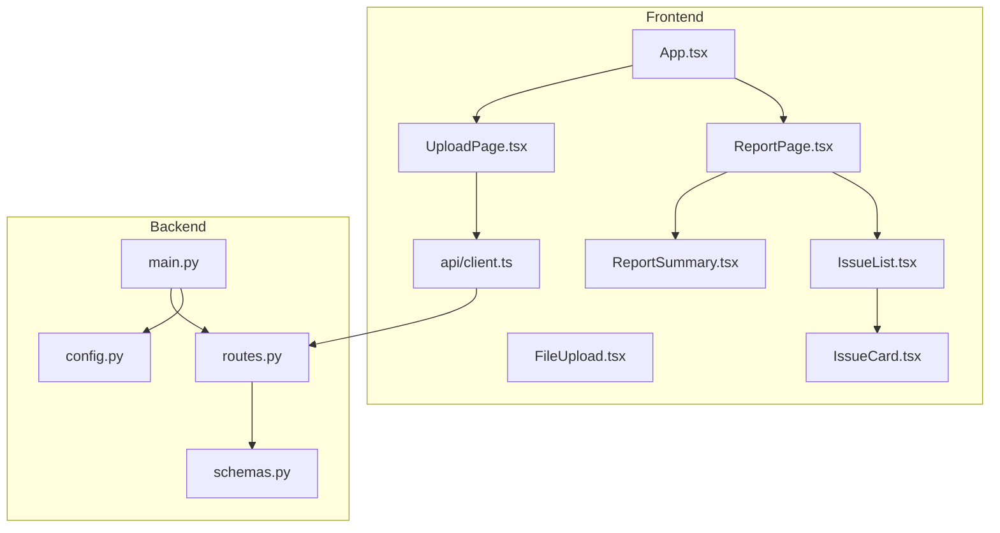
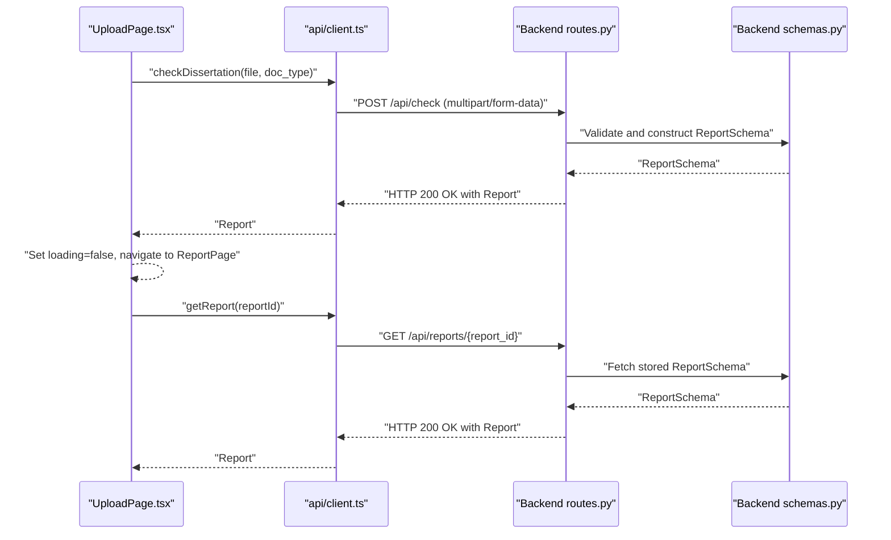
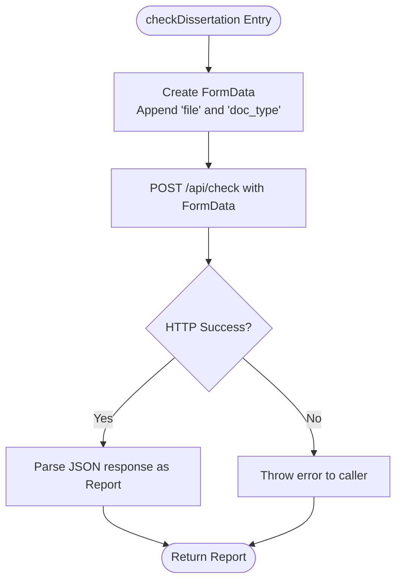
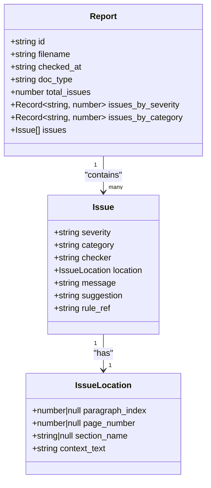
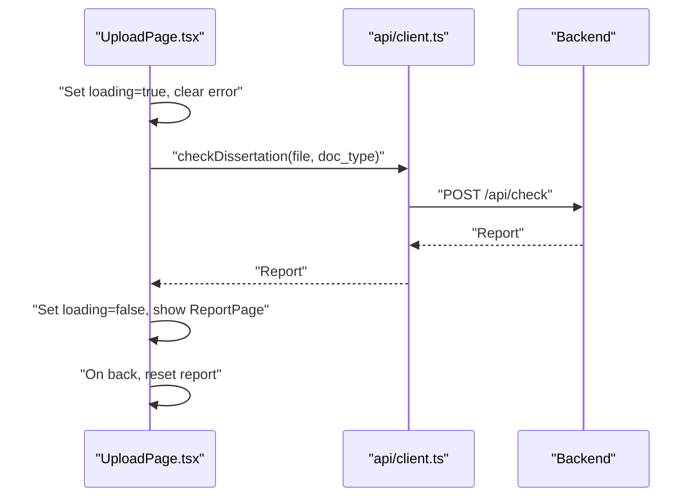
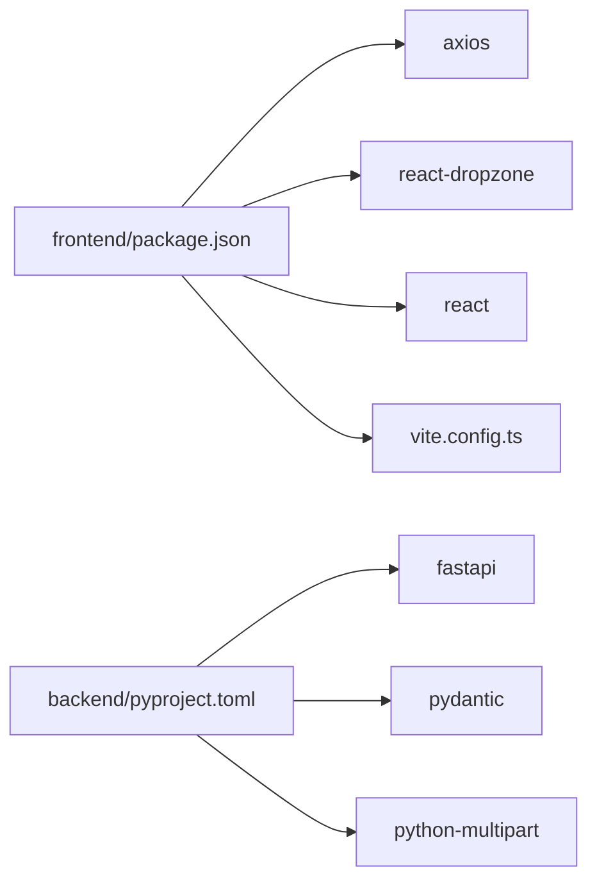

# API Integration and Client

<cite>
**Referenced Files in This Document**
- [client.ts](file://frontend/src/api/client.ts)
- [UploadPage.tsx](file://frontend/src/pages/UploadPage.tsx)
- [ReportPage.tsx](file://frontend/src/pages/ReportPage.tsx)
- [App.tsx](file://frontend/src/App.tsx)
- [FileUpload.tsx](file://frontend/src/components/FileUpload.tsx)
- [ReportSummary.tsx](file://frontend/src/components/ReportSummary.tsx)
- [IssueList.tsx](file://frontend/src/components/IssueList.tsx)
- [IssueCard.tsx](file://frontend/src/components/IssueCard.tsx)
- [routes.py](file://backend/app/api/routes.py)
- [schemas.py](file://backend/app/api/schemas.py)
- [main.py](file://backend/app/main.py)
- [config.py](file://backend/app/core/config.py)
- [package.json](file://frontend/package.json)
- [vite.config.ts](file://frontend/vite.config.ts)
</cite>

## Table of Contents
1. [Introduction](#introduction)
2. [Project Structure](#project-structure)
3. [Core Components](#core-components)
4. [Architecture Overview](#architecture-overview)
5. [Detailed Component Analysis](#detailed-component-analysis)
6. [Dependency Analysis](#dependency-analysis)
7. [Performance Considerations](#performance-considerations)
8. [Troubleshooting Guide](#troubleshooting-guide)
9. [Conclusion](#conclusion)
10. [Appendices](#appendices)

## Introduction
This document describes the frontend API integration layer responsible for communicating with the backend service. It focuses on the HTTP client configuration, request/response handling, error management, and the TypeScript interfaces used for type-safe interactions. It also explains the API endpoints, request payload structures, response data formats, authentication considerations, request headers, and timeout configurations. Practical guidance is provided for extending the client with new endpoints while maintaining type safety, along with examples of making API calls, handling async operations, and managing loading states.

## Project Structure
The frontend API integration resides under the frontend/src/api directory and is consumed by page and component modules. The backend exposes two primary endpoints: one for initiating checks and another for retrieving reports. Environment variables configure the API base URL, and Vite handles the development server and build pipeline.

**Diagram sources**
- [client.ts:1-50](file://frontend/src/api/client.ts#L1-L50)
- [UploadPage.tsx:1-62](file://frontend/src/pages/UploadPage.tsx#L1-L62)
- [ReportPage.tsx:1-37](file://frontend/src/pages/ReportPage.tsx#L1-L37)
- [routes.py:1-75](file://backend/app/api/routes.py#L1-L75)
- [schemas.py:1-38](file://backend/app/api/schemas.py#L1-L38)
- [main.py:1-20](file://backend/app/main.py#L1-L20)
- [config.py:1-17](file://backend/app/core/config.py#L1-L17)

**Section sources**
- [client.ts:1-50](file://frontend/src/api/client.ts#L1-L50)
- [routes.py:1-75](file://backend/app/api/routes.py#L1-L75)
- [main.py:1-20](file://backend/app/main.py#L1-L20)
- [config.py:1-17](file://backend/app/core/config.py#L1-L17)

## Core Components
- HTTP client and endpoints
  - The client defines two primary asynchronous functions:
    - checkDissertation(file: File, docType: string): Promise<Report>
    - getReport(id: string): Promise<Report>
  - Both functions return typed Report objects inferred from Axios responses.
- Request payloads and headers
  - checkDissertation uses multipart/form-data via FormData with fields "file" and "doc_type".
  - getReport performs a GET request with no body.
- Response data model
  - Report, Issue, and IssueLocation interfaces define the shape of API responses and are used across components for rendering and filtering.
- Authentication and CORS
  - The backend enables CORS for http://localhost:5173 and does not implement authentication in the current routes.
- Environment configuration
  - API base URL is resolved from VITE_API_URL with a fallback to http://localhost:8000/api.
- Frontend consumption
  - UploadPage orchestrates submission, loading, and error states and delegates to checkDissertation.
  - ReportPage displays summary and issue lists using typed props.

**Section sources**
- [client.ts:1-50](file://frontend/src/api/client.ts#L1-L50)
- [UploadPage.tsx:1-62](file://frontend/src/pages/UploadPage.tsx#L1-L62)
- [ReportPage.tsx:1-37](file://frontend/src/pages/ReportPage.tsx#L1-L37)
- [routes.py:36-75](file://backend/app/api/routes.py#L36-L75)
- [schemas.py:25-34](file://backend/app/api/schemas.py#L25-L34)

## Architecture Overview
The frontend invokes backend endpoints to upload documents and retrieve reports. The backend validates uploads, runs checks, and returns structured reports. The frontend renders summaries and issue lists with filtering capabilities.

**Diagram sources**
- [UploadPage.tsx:15-27](file://frontend/src/pages/UploadPage.tsx#L15-L27)
- [client.ts:33-49](file://frontend/src/api/client.ts#L33-L49)
- [routes.py:36-75](file://backend/app/api/routes.py#L36-L75)
- [schemas.py:25-34](file://backend/app/api/schemas.py#L25-L34)

## Detailed Component Analysis

### HTTP Client and Endpoints
- Endpoint definitions
  - POST /api/check: Accepts multipart/form-data with fields "file" and "doc_type". Returns a Report.
  - GET /api/reports/{report_id}: Returns a Report by ID.
- Request headers
  - checkDissertation sets Content-Type to multipart/form-data automatically via FormData.
  - No additional headers are set by the client.
- Timeout configuration
  - No explicit timeout is configured in the client.
- Error handling
  - The client does not wrap requests in try/catch; errors propagate as thrown exceptions.
  - The consuming component catches and displays user-friendly messages.

**Diagram sources**
- [client.ts:33-44](file://frontend/src/api/client.ts#L33-L44)

**Section sources**
- [client.ts:1-50](file://frontend/src/api/client.ts#L1-L50)
- [routes.py:36-75](file://backend/app/api/routes.py#L36-L75)

### TypeScript Interfaces and Type Safety
- Report
  - Fields include identifiers, metadata, counts, aggregations, and a list of issues.
- Issue
  - Includes severity, category, checker, location, message, suggestion, and rule reference.
- IssueLocation
  - Provides optional indices, page number, section name, and context text.
- Usage
  - Interfaces are imported and used across pages and components to ensure consistent shapes for rendering and filtering.

**Diagram sources**
- [client.ts:5-31](file://frontend/src/api/client.ts#L5-L31)

**Section sources**
- [client.ts:5-31](file://frontend/src/api/client.ts#L5-L31)

### Request Payload Structures
- POST /api/check
  - FormData fields:
    - file: Binary .docx content
    - doc_type: String indicating document type
- GET /api/reports/{report_id}
  - Path parameter: report_id (string)

**Section sources**
- [client.ts:33-49](file://frontend/src/api/client.ts#L33-L49)
- [routes.py:36-75](file://backend/app/api/routes.py#L36-L75)

### Response Data Formats
- Report
  - Aggregated counts and categorized breakdowns for issues.
  - List of Issue entries.
- Issue
  - Severity constrained to "error", "warning", or "info".
  - Location includes optional indices and context text.
- Backend schemas align with frontend interfaces.

**Section sources**
- [client.ts:22-31](file://frontend/src/api/client.ts#L22-L31)
- [schemas.py:25-34](file://backend/app/api/schemas.py#L25-L34)

### Authentication Mechanisms and Headers
- Authentication
  - Current backend routes do not require authentication.
- CORS
  - Backend allows origins ["http://localhost:5173"].
- Request headers
  - multipart/form-data header is applied by the client when using FormData.
  - No Authorization or custom headers are set by the client.

**Section sources**
- [main.py:11-17](file://backend/app/main.py#L11-L17)
- [config.py:6-10](file://backend/app/core/config.py#L6-L10)
- [client.ts:40-42](file://frontend/src/api/client.ts#L40-L42)

### Timeout Configuration
- No explicit timeout is configured in the client. Consider adding a timeout to prevent indefinite waits during long uploads or network issues.

**Section sources**
- [client.ts:1-50](file://frontend/src/api/client.ts#L1-L50)

### Example Usage and Async Operations
- Uploading and checking a document
  - UploadPage manages loading and error states, constructs FormData, and calls checkDissertation.
  - On success, it passes the Report to ReportPage.
- Retrieving a report
  - getReport is used to fetch an existing report by ID.

**Diagram sources**
- [UploadPage.tsx:15-27](file://frontend/src/pages/UploadPage.tsx#L15-L27)
- [client.ts:33-44](file://frontend/src/api/client.ts#L33-L44)

**Section sources**
- [UploadPage.tsx:1-62](file://frontend/src/pages/UploadPage.tsx#L1-L62)
- [ReportPage.tsx:1-37](file://frontend/src/pages/ReportPage.tsx#L1-L37)
- [client.ts:33-49](file://frontend/src/api/client.ts#L33-L49)

### Loading States and User Feedback
- Loading state
  - Disabled submit button and changed label while uploading.
- Error state
  - Displays user-friendly messages derived from response data or defaults.
- Success state
  - Navigates to ReportPage and renders summary and issues.

**Section sources**
- [UploadPage.tsx:12-27](file://frontend/src/pages/UploadPage.tsx#L12-L27)
- [ReportPage.tsx:10-19](file://frontend/src/pages/ReportPage.tsx#L10-L19)

### Error Handling Strategies
- Current approach
  - The client throws on HTTP errors; the caller catches and displays a message.
- Recommended improvements
  - Centralized Axios interceptor for consistent error handling.
  - Distinct error types per endpoint for granular handling.
  - Retry logic with exponential backoff for transient failures.
  - Offline behavior using service workers or local storage to queue requests.

**Section sources**
- [UploadPage.tsx:22-26](file://frontend/src/pages/UploadPage.tsx#L22-L26)

### Extending the Client with New Endpoints
- Steps to add a new endpoint
  - Define a new async function in client.ts returning a typed response.
  - Add a matching route in backend routes.py with appropriate request/response models in schemas.py.
  - Keep interfaces in client.ts aligned with backend schemas.
  - Consume the new function in pages/components with proper loading/error handling.
- Maintaining type safety
  - Reuse shared interfaces.
  - Avoid ad-hoc object creation; always map raw responses to typed models.

**Section sources**
- [client.ts:1-50](file://frontend/src/api/client.ts#L1-L50)
- [routes.py:36-75](file://backend/app/api/routes.py#L36-L75)
- [schemas.py:25-34](file://backend/app/api/schemas.py#L25-L34)

## Dependency Analysis
- Frontend dependencies
  - axios is used for HTTP requests.
  - react and react-dom for UI.
  - react-dropzone for drag-and-drop file selection.
- Backend dependencies
  - FastAPI, Pydantic, python-multipart, uvicorn.
- Environment and build
  - Vite dev server and React plugin.
  - Environment variable VITE_API_URL controls API base URL.

**Diagram sources**
- [package.json:12-17](file://frontend/package.json#L12-L17)
- [pyproject.toml:5-11](file://backend/pyproject.toml#L5-L11)
- [vite.config.ts:1-8](file://frontend/vite.config.ts#L1-L8)

**Section sources**
- [package.json:1-32](file://frontend/package.json#L1-L32)
- [pyproject.toml:1-29](file://backend/pyproject.toml#L1-L29)
- [vite.config.ts:1-8](file://frontend/vite.config.ts#L1-L8)

## Performance Considerations
- Network timeouts
  - Configure axios defaults with a sensible timeout to avoid hanging requests.
- Large file handling
  - Validate file size on the client before upload and enforce backend limits.
- Request deduplication
  - Debounce rapid submissions and avoid duplicate uploads.
- Caching
  - Cache recent reports by ID to reduce redundant fetches.
- Rendering optimization
  - Virtualize large issue lists and memoize computed summaries.

[No sources needed since this section provides general guidance]

## Troubleshooting Guide
- API base URL misconfiguration
  - Ensure VITE_API_URL matches the backend deployment address.
- CORS errors
  - Confirm backend allows the frontend origin and credentials are permitted.
- File type or size issues
  - Backend rejects non-.docx files and enforces a maximum upload size; adjust frontend validation accordingly.
- Empty or missing error details
  - The client relies on response data for error messages; ensure backend returns structured error payloads.

**Section sources**
- [config.py:6-10](file://backend/app/core/config.py#L6-L10)
- [routes.py:41-50](file://backend/app/api/routes.py#L41-L50)
- [UploadPage.tsx:22-26](file://frontend/src/pages/UploadPage.tsx#L22-L26)

## Conclusion
The frontend API integration layer provides a concise, typed interface to the backend. It supports document upload and report retrieval with straightforward request/response handling. By centralizing HTTP concerns, enforcing type safety, and implementing robust error handling and retries, the integration can evolve to support additional endpoints while maintaining reliability and developer productivity.

[No sources needed since this section summarizes without analyzing specific files]

## Appendices

### API Endpoints Reference
- POST /api/check
  - Purpose: Upload a .docx file and document type to generate a report.
  - Request: multipart/form-data with fields "file" and "doc_type".
  - Response: Report.
- GET /api/reports/{report_id}
  - Purpose: Retrieve a previously generated report by ID.
  - Response: Report.

**Section sources**
- [routes.py:36-75](file://backend/app/api/routes.py#L36-L75)
- [client.ts:33-49](file://frontend/src/api/client.ts#L33-L49)

### Environment Variables
- VITE_API_URL: Overrides the default API base URL (fallback: http://localhost:8000/api).

**Section sources**
- [client.ts:3-3](file://frontend/src/api/client.ts#L3-L3)
- [main.py:19-19](file://backend/app/main.py#L19-L19)