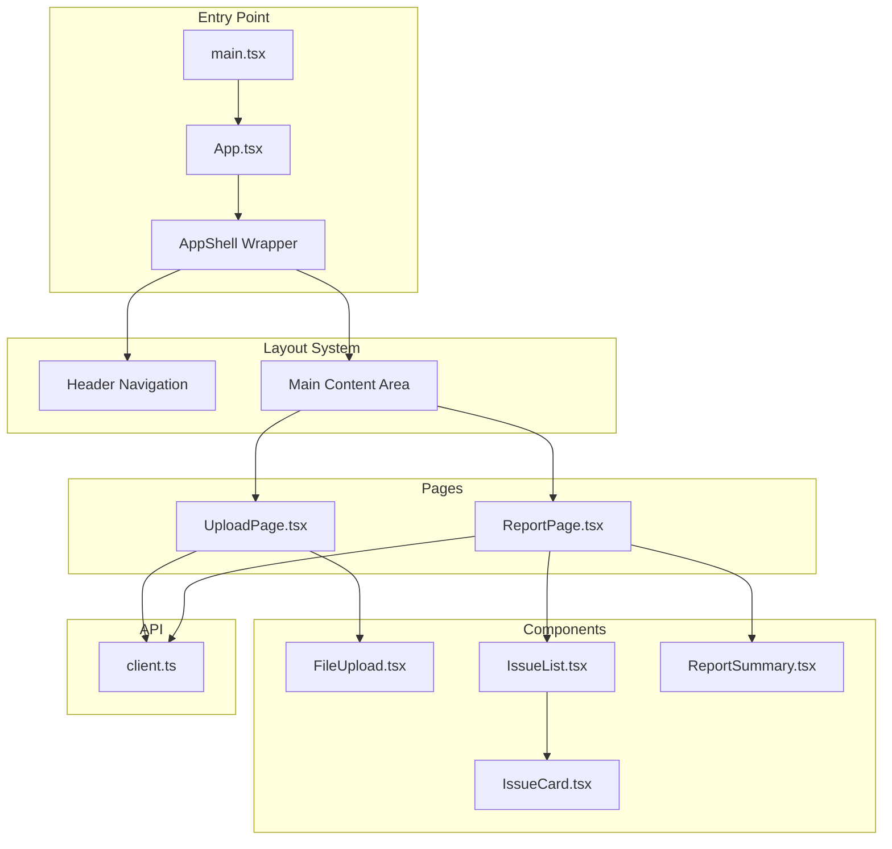
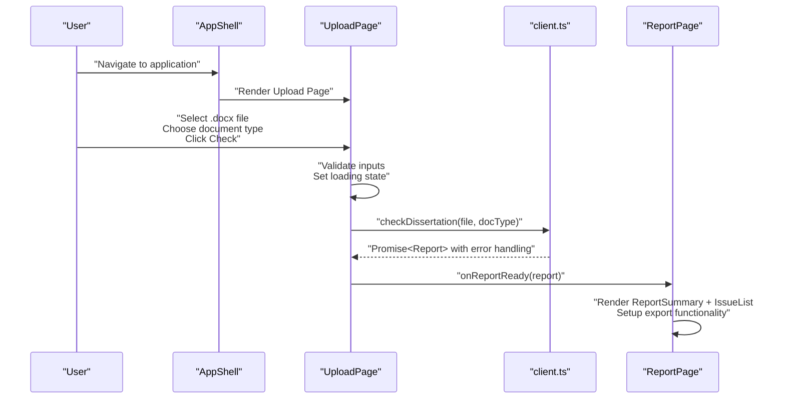
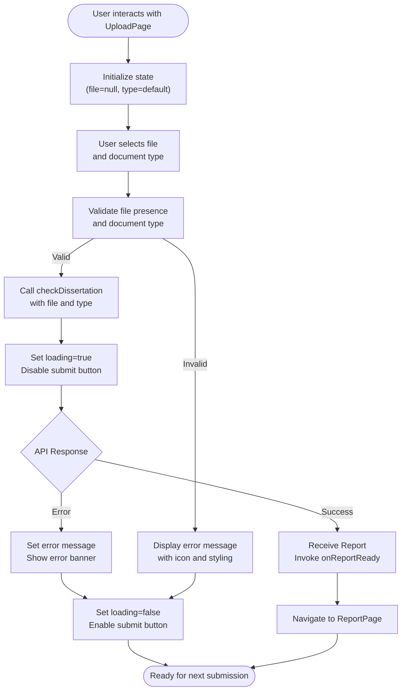
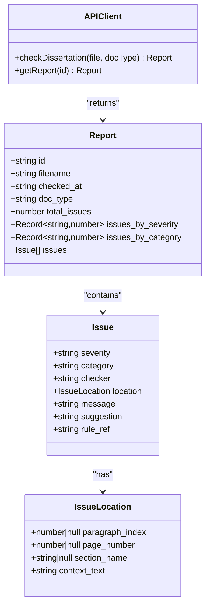
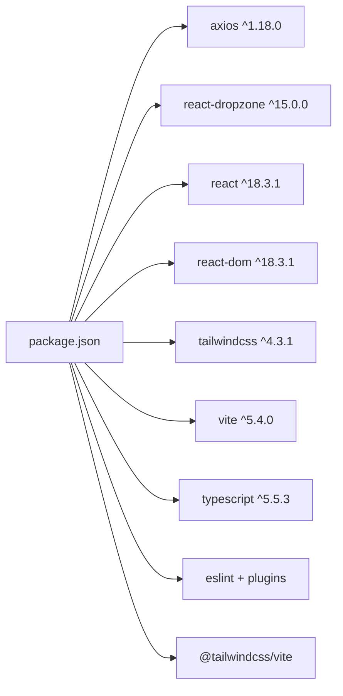

# Frontend Application Guide

<cite>
**Referenced Files in This Document**
- [App.tsx](file://frontend/src/App.tsx)
- [main.tsx](file://frontend/src/main.tsx)
- [client.ts](file://frontend/src/api/client.ts)
- [UploadPage.tsx](file://frontend/src/pages/UploadPage.tsx)
- [ReportPage.tsx](file://frontend/src/pages/ReportPage.tsx)
- [FileUpload.tsx](file://frontend/src/components/FileUpload.tsx)
- [IssueCard.tsx](file://frontend/src/components/IssueCard.tsx)
- [IssueList.tsx](file://frontend/src/components/IssueList.tsx)
- [ReportSummary.tsx](file://frontend/src/components/ReportSummary.tsx)
- [index.css](file://frontend/src/index.css)
- [package.json](file://frontend/package.json)
- [vite.config.ts](file://frontend/vite.config.ts)
- [tsconfig.json](file://frontend/tsconfig.json)
- [README.md](file://frontend/README.md)
- [README.md](file://README.md)
</cite>

## Update Summary
**Changes Made**
- Enhanced App component with new AppShell layout wrapper and improved header design
- Added comprehensive styling system using Tailwind CSS v4 with custom theme variables
- Improved accessibility with proper focus management and keyboard navigation
- Enhanced responsive design with mobile-first approach and flexible grid layouts
- Added comprehensive TypeScript type safety with strict interface definitions
- Implemented advanced filtering capabilities in IssueList component
- Enhanced error handling and user feedback mechanisms
- Added export functionality for JSON reports in ReportPage

## Table of Contents
1. [Introduction](#introduction)
2. [Project Structure](#project-structure)
3. [Core Components](#core-components)
4. [Architecture Overview](#architecture-overview)
5. [Detailed Component Analysis](#detailed-component-analysis)
6. [Dependency Analysis](#dependency-analysis)
7. [Performance Considerations](#performance-considerations)
8. [Accessibility and Responsive Design](#accessibility-and-responsive-design)
9. [Troubleshooting Guide](#troubleshooting-guide)
10. [Extensibility Guidelines](#extensibility-guidelines)
11. [Conclusion](#conclusion)

## Introduction
This guide documents the React frontend application for the Dissertation Checker. The application has been enhanced with a modern design system, comprehensive TypeScript integration, and improved user experience features. It explains the component architecture, state management, UI component library, and integration with the backend API. The application now features a professional layout with Tailwind CSS v4, advanced filtering capabilities, and responsive design patterns optimized for both desktop and mobile users.

## Project Structure
The frontend is organized into pages, components, and an API client module with enhanced modularity and type safety. The architecture follows modern React patterns with TypeScript interfaces and comprehensive styling through Tailwind CSS. Build and configuration are handled by Vite with integrated Tailwind CSS support.

**Diagram sources**
- [main.tsx:1-11](file://frontend/src/main.tsx#L1-L11)
- [App.tsx:7-58](file://frontend/src/App.tsx#L7-L58)
- [UploadPage.tsx:1-153](file://frontend/src/pages/UploadPage.tsx#L1-L153)
- [ReportPage.tsx:1-95](file://frontend/src/pages/ReportPage.tsx#L1-L95)
- [FileUpload.tsx:1-100](file://frontend/src/components/FileUpload.tsx#L1-L100)
- [IssueList.tsx:1-121](file://frontend/src/components/IssueList.tsx#L1-L121)
- [IssueCard.tsx:1-87](file://frontend/src/components/IssueCard.tsx#L1-L87)
- [ReportSummary.tsx:1-131](file://frontend/src/components/ReportSummary.tsx#L1-L131)
- [client.ts:1-50](file://frontend/src/api/client.ts#L1-L50)

**Section sources**
- [main.tsx:1-11](file://frontend/src/main.tsx#L1-L11)
- [App.tsx:1-58](file://frontend/src/App.tsx#L1-L58)
- [vite.config.ts:1-12](file://frontend/vite.config.ts#L1-L12)
- [tsconfig.json:1-8](file://frontend/tsconfig.json#L1-L8)
- [package.json:1-34](file://frontend/package.json#L1-L34)

## Core Components
- **App**: Root component featuring a new AppShell wrapper that provides consistent header navigation and layout structure. Manages global state and renders either UploadPage or ReportPage.
- **AppShell**: Layout wrapper component providing sticky header with logo, navigation, and main content area with proper spacing and responsive design.
- **UploadPage**: Enhanced document upload interface with improved form controls, validation feedback, loading states, and comprehensive error handling.
- **ReportPage**: Advanced report display with export functionality, back navigation, and detailed report information including timestamps and metadata.
- **UI Library**:
  - **FileUpload**: Enhanced drag-and-drop file selector with visual feedback, size formatting, and improved user guidance.
  - **IssueList**: Comprehensive filtering system with severity and category filters, dynamic option generation, and empty state handling.
  - **IssueCard**: Rich issue display with severity-based theming, rule references, location context, and suggestion information.
  - **ReportSummary**: Professional report overview with metrics display, category breakdowns, and status indicators.

**Section sources**
- [App.tsx:1-58](file://frontend/src/App.tsx#L1-L58)
- [UploadPage.tsx:1-153](file://frontend/src/pages/UploadPage.tsx#L1-L153)
- [ReportPage.tsx:1-95](file://frontend/src/pages/ReportPage.tsx#L1-L95)
- [FileUpload.tsx:1-100](file://frontend/src/components/FileUpload.tsx#L1-L100)
- [IssueList.tsx:1-121](file://frontend/src/components/IssueList.tsx#L1-L121)
- [IssueCard.tsx:1-87](file://frontend/src/components/IssueCard.tsx#L1-L87)
- [ReportSummary.tsx:1-131](file://frontend/src/components/ReportSummary.tsx#L1-L131)

## Architecture Overview
The frontend follows a modern React architecture with enhanced state management and comprehensive type safety:
- **AppShell** provides consistent layout and navigation across all pages.
- **UploadPage** handles complex user interactions with file selection, document type validation, and robust error handling.
- **ReportPage** orchestrates report display with export capabilities and navigation controls.
- **Enhanced API Client** with strict TypeScript interfaces and comprehensive error handling.
- **Component Composition** with reusable UI elements and consistent styling patterns.

**Diagram sources**
- [App.tsx:43-55](file://frontend/src/App.tsx#L43-L55)
- [UploadPage.tsx:21-35](file://frontend/src/pages/UploadPage.tsx#L21-L35)
- [client.ts:33-44](file://frontend/src/api/client.ts#L33-L44)
- [ReportPage.tsx:10-94](file://frontend/src/pages/ReportPage.tsx#L10-L94)

## Detailed Component Analysis

### AppShell Component
- **Responsibilities**:
  - Provides consistent header with logo and navigation
  - Manages main content area with proper spacing and responsive design
  - Implements sticky header positioning for better user experience
- **Layout Features**:
  - Sticky header with shadow and border styling
  - Max-width container with centered content
  - Responsive padding and spacing adjustments
- **Integration**:
  - Wraps all page components for consistent styling
  - Provides navigation context for the entire application

**Section sources**
- [App.tsx:7-41](file://frontend/src/App.tsx#L7-L41)

### Enhanced App Component
- **Responsibilities**:
  - Manages global report state with proper TypeScript typing
  - Conditionally renders UploadPage or ReportPage based on state
  - Integrates with AppShell for consistent layout
- **State Management**:
  - Uses useState with explicit Report type annotation
  - Type-safe callback functions for state updates
- **Composition**:
  - Delegates to AppShell for layout management
  - Handles navigation between different application states

**Section sources**
- [App.tsx:43-58](file://frontend/src/App.tsx#L43-L58)

### UploadPage Component
- **Enhanced Features**:
  - Comprehensive document type selection with predefined options
  - Improved form validation and user feedback
  - Enhanced loading states with spinner animations
  - Robust error handling with detailed error messages
- **State Management**:
  - File state with proper null handling
  - Document type selection with default values
  - Loading and error state management
- **User Experience**:
  - Clear visual feedback for all interactions
  - Accessible form controls with proper labeling
  - Responsive design for all screen sizes

**Diagram sources**
- [UploadPage.tsx:15-35](file://frontend/src/pages/UploadPage.tsx#L15-L35)
- [client.ts:33-44](file://frontend/src/api/client.ts#L33-L44)

**Section sources**
- [UploadPage.tsx:1-153](file://frontend/src/pages/UploadPage.tsx#L1-L153)

### ReportPage Component
- **Enhanced Features**:
  - Professional report header with timestamp display
  - Export functionality for JSON report download
  - Back navigation with proper styling and accessibility
  - Dynamic report metadata display
- **Functionality**:
  - JSON export using Blob API for seamless download
  - Formatted timestamp display with localization
  - Responsive layout with proper spacing and typography
- **User Experience**:
  - Clear navigation cues and visual hierarchy
  - Accessible button controls with proper ARIA attributes
  - Responsive design for optimal viewing on all devices

**Section sources**
- [ReportPage.tsx:1-95](file://frontend/src/pages/ReportPage.tsx#L1-L95)

### Enhanced UI Component Library

#### FileUpload Component
- **Enhanced Features**:
  - Improved drag-and-drop visualization with state-based styling
  - File size formatting with human-readable units
  - Clear visual feedback for different states (active, rejected, selected)
  - Comprehensive accessibility support with proper ARIA attributes
- **Visual States**:
  - Active state with blue highlighting and light blue background
  - Rejected state with red styling for invalid files
  - Selected state with green validation indicator
  - Default hover states for better user guidance
- **User Guidance**:
  - Clear instructions for drag-and-drop actions
  - File type and size limitations display
  - Visual confirmation of successful file selection

**Section sources**
- [FileUpload.tsx:1-100](file://frontend/src/components/FileUpload.tsx#L1-L100)

#### IssueList Component
- **Advanced Filtering System**:
  - Dynamic severity filtering with comprehensive options
  - Category-based filtering with auto-generated options
  - Real-time filtering with performance optimizations
  - Empty state handling with helpful messaging
- **Performance Optimizations**:
  - Memoized category extraction for large datasets
  - Efficient filtering algorithms with dependency arrays
  - Virtualized rendering considerations for future enhancements
- **User Interface**:
  - Custom Select component with consistent styling
  - Filter counter showing results vs total issues
  - Responsive layout for filter controls

**Section sources**
- [IssueList.tsx:1-121](file://frontend/src/components/IssueList.tsx#L1-L121)

#### IssueCard Component
- **Enhanced Visual Design**:
  - Severity-based theming with custom color schemes
  - Rule reference display with proper typography
  - Contextual information with expandable content
  - Location-based metadata with paragraph numbering
- **Information Architecture**:
  - Clear visual hierarchy with severity indicators
  - Category and rule reference for quick identification
  - Suggestion field for actionable improvements
  - Context text with monospace formatting for code-like readability
- **Accessibility Features**:
  - Proper semantic markup for screen readers
  - Color contrast compliant with accessibility standards
  - Keyboard navigable and focusable elements

**Section sources**
- [IssueCard.tsx:1-87](file://frontend/src/components/IssueCard.tsx#L1-L87)

#### ReportSummary Component
- **Professional Metrics Display**:
  - Three-column metric layout with severity-based coloring
  - Category breakdown with dot indicators and counts
  - Status indicators for zero-issues scenarios
  - Responsive grid layout for optimal space utilization
- **Design Elements**:
  - Clean card-based layout with subtle shadows
  - Professional typography with proper hierarchy
  - Consistent spacing and alignment throughout
  - Mobile-first responsive design approach
- **Data Visualization**:
  - Clear metric presentation with appropriate sizing
  - Category distribution with visual indicators
  - Status messaging for different report outcomes

**Section sources**
- [ReportSummary.tsx:1-131](file://frontend/src/components/ReportSummary.tsx#L1-L131)

### Enhanced API Integration (client.ts)
- **Comprehensive Type Safety**:
  - Strictly typed interfaces for all API responses
  - Enumerated severity types with compile-time safety
  - Optional properties with proper null handling
  - Generic response handling with error recovery
- **Enhanced Error Handling**:
  - Detailed error message extraction from API responses
  - Fallback error messages for network failures
  - Type-safe error handling with proper casting
- **API Functionality**:
  - Multipart form data handling for file uploads
  - JSON response parsing with type validation
  - Base URL configuration with environment variable support

**Diagram sources**
- [client.ts:5-31](file://frontend/src/api/client.ts#L5-L31)
- [client.ts:33-49](file://frontend/src/api/client.ts#L33-L49)

**Section sources**
- [client.ts:1-50](file://frontend/src/api/client.ts#L1-L50)

## Dependency Analysis
- **Runtime Dependencies**:
  - axios for robust HTTP request handling with TypeScript support
  - react and react-dom for modern React application framework
  - react-dropzone for enhanced drag-and-drop file handling
  - tailwindcss v4 for utility-first CSS framework with custom themes
- **Build and Development Tools**:
  - vite for fast development server and optimized builds
  - @tailwindcss/vite for seamless Tailwind CSS integration
  - typescript for comprehensive type safety and developer experience
  - eslint with React-specific configurations for code quality

**Diagram sources**
- [package.json:12-34](file://frontend/package.json#L12-L34)

**Section sources**
- [package.json:1-34](file://frontend/package.json#L1-L34)
- [vite.config.ts:1-12](file://frontend/vite.config.ts#L1-L12)
- [tsconfig.json:1-8](file://frontend/tsconfig.json#L1-L8)

## Performance Considerations
- **Rendering Optimizations**:
  - useMemo hooks for expensive computations in IssueList
  - Efficient filtering algorithms with proper dependency arrays
  - Lazy loading considerations for large report datasets
- **Network Performance**:
  - Optimized API calls with proper error handling
  - Efficient file upload handling with progress indication
  - Caching strategies for frequently accessed data
- **Bundle Optimization**:
  - Tree shaking for unused components and utilities
  - Code splitting for route-based lazy loading
  - Minification and compression for production builds

## Accessibility and Responsive Design
- **Accessibility Enhancements**:
  - Comprehensive focus management with visible focus indicators
  - Semantic HTML structure with proper ARIA attributes
  - Keyboard navigation support for all interactive elements
  - Screen reader friendly content with proper labeling
- **Responsive Design System**:
  - Mobile-first approach with progressive enhancement
  - Flexible grid layouts adapting to different screen sizes
  - Touch-friendly interface elements with appropriate sizing
  - Typography scaling for optimal readability across devices
- **Visual Design Standards**:
  - Consistent color scheme with proper contrast ratios
  - Clear visual hierarchy with consistent spacing
  - Accessible color choices for different severity levels
  - High-quality icons and visual indicators

**Section sources**
- [index.css:1-54](file://frontend/src/index.css#L1-L54)
- [App.tsx:33-41](file://frontend/src/App.tsx#L33-L41)
- [IssueCard.tsx:14-33](file://frontend/src/components/IssueCard.tsx#L14-L33)

## Troubleshooting Guide
- **Application Not Loading**:
  - Verify VITE_API_URL environment variable is properly configured
  - Check browser console for JavaScript errors and network issues
  - Ensure backend service is running and accessible
- **Upload Issues**:
  - Confirm file is .docx format and under 50MB limit
  - Verify document type selection is appropriate for the file
  - Check browser compatibility with drag-and-drop functionality
- **Report Display Problems**:
  - Ensure API endpoints are responding correctly
  - Verify report data structure matches expected format
  - Check for network connectivity issues during report retrieval
- **Styling Issues**:
  - Verify Tailwind CSS is properly configured and loaded
  - Check for CSS conflicts or custom style overrides
  - Ensure responsive breakpoints are working correctly

**Section sources**
- [client.ts:3-4](file://frontend/src/api/client.ts#L3-L4)
- [UploadPage.tsx:21-35](file://frontend/src/pages/UploadPage.tsx#L21-L35)
- [FileUpload.tsx:25-31](file://frontend/src/components/FileUpload.tsx#L25-L31)

## Extensibility Guidelines
- **Adding New Validation Features**:
  - Extend Report interface with new properties as needed
  - Create new UI components following established patterns
  - Implement proper TypeScript interfaces for new data structures
- **Component Enhancement**:
  - Follow existing prop interface patterns and naming conventions
  - Implement proper accessibility features for new components
  - Ensure responsive design compatibility with existing layout system
- **Filtering and Search Capabilities**:
  - Extend IssueList with additional filter criteria
  - Implement search functionality with debouncing for performance
  - Add sorting capabilities for different report aspects
- **API Integration Extensions**:
  - Update client.ts with new endpoints and request/response types
  - Implement proper error handling for new API interactions
  - Add caching mechanisms for frequently accessed data
- **Theme and Styling Extensions**:
  - Extend Tailwind CSS configuration for new color schemes
  - Add new component variants following existing design patterns
  - Implement dark mode support with proper contrast ratios

**Section sources**
- [client.ts:5-31](file://frontend/src/api/client.ts#L5-L31)
- [IssueList.tsx:15-28](file://frontend/src/components/IssueList.tsx#L15-L28)
- [ReportPage.tsx:11-21](file://frontend/src/pages/ReportPage.tsx#L11-L21)

## Conclusion
The enhanced frontend application demonstrates modern React development practices with comprehensive TypeScript integration, professional design systems, and robust user experience features. The architecture supports scalable development with clear component boundaries, efficient state management, and comprehensive type safety. The implementation showcases best practices in accessibility, responsive design, and performance optimization while maintaining excellent developer experience through proper tooling and configuration.