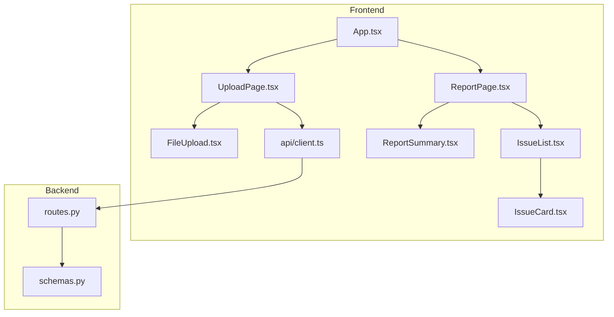
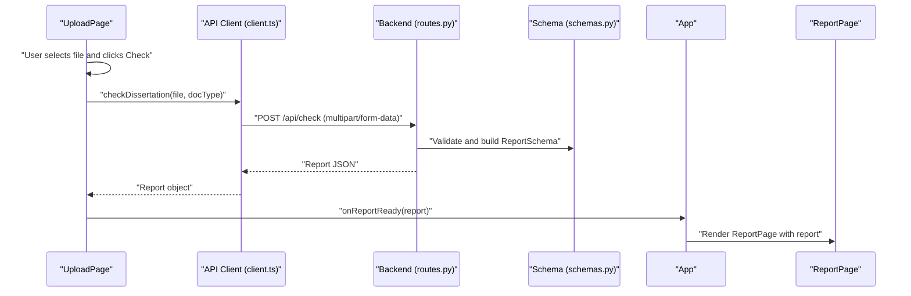
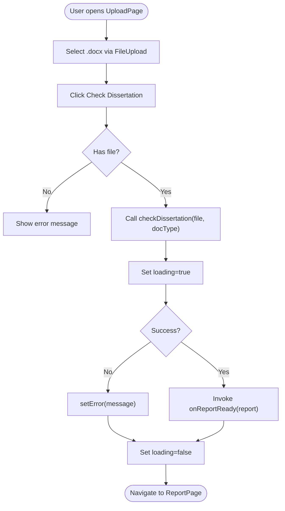
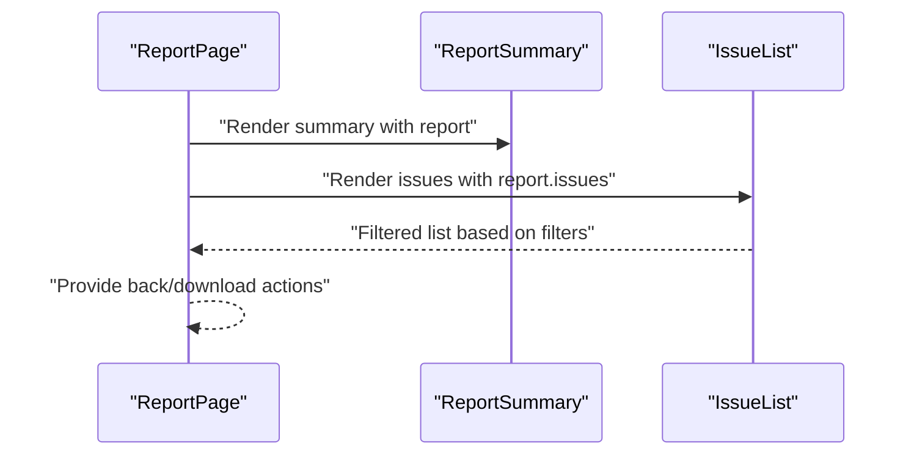
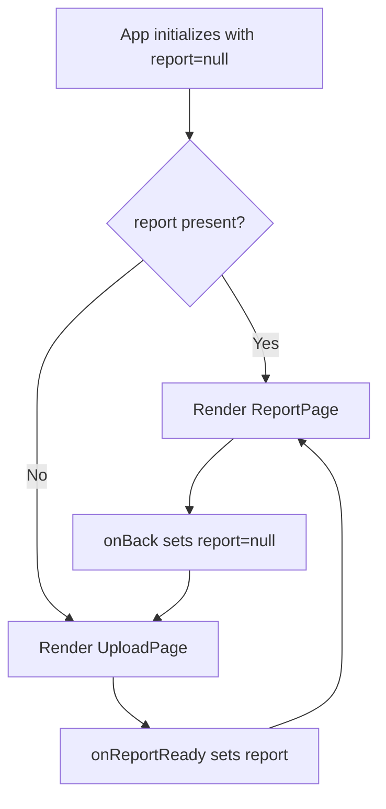
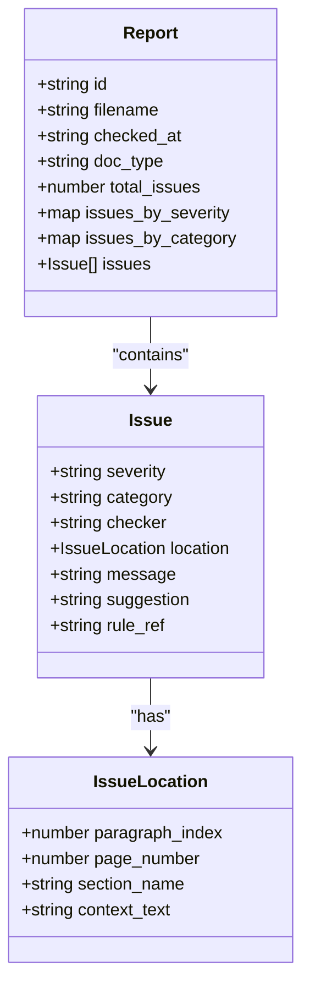
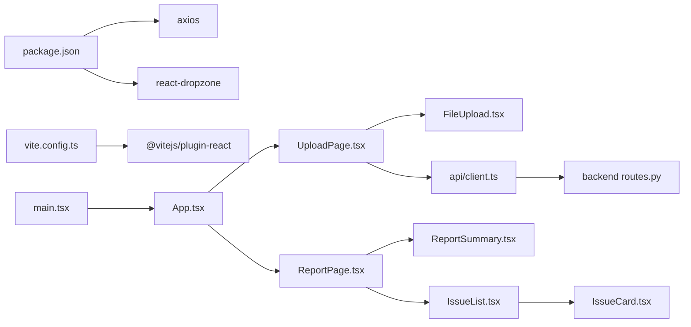

# Page Components

<cite>
**Referenced Files in This Document**
- [UploadPage.tsx](file://frontend/src/pages/UploadPage.tsx)
- [ReportPage.tsx](file://frontend/src/pages/ReportPage.tsx)
- [App.tsx](file://frontend/src/App.tsx)
- [FileUpload.tsx](file://frontend/src/components/FileUpload.tsx)
- [IssueList.tsx](file://frontend/src/components/IssueList.tsx)
- [IssueCard.tsx](file://frontend/src/components/IssueCard.tsx)
- [ReportSummary.tsx](file://frontend/src/components/ReportSummary.tsx)
- [client.ts](file://frontend/src/api/client.ts)
- [routes.py](file://backend/app/api/routes.py)
- [schemas.py](file://backend/app/api/schemas.py)
- [package.json](file://frontend/package.json)
- [vite.config.ts](file://frontend/vite.config.ts)
- [main.tsx](file://frontend/src/main.tsx)
- [index.html](file://frontend/index.html)
</cite>

## Table of Contents
1. [Introduction](#introduction)
2. [Project Structure](#project-structure)
3. [Core Components](#core-components)
4. [Architecture Overview](#architecture-overview)
5. [Detailed Component Analysis](#detailed-component-analysis)
6. [Dependency Analysis](#dependency-analysis)
7. [Performance Considerations](#performance-considerations)
8. [Troubleshooting Guide](#troubleshooting-guide)
9. [Conclusion](#conclusion)
10. [Appendices](#appendices)

## Introduction
This document explains the main page components of the React application that powers the Dissertation Checker. It focuses on:
- UploadPage: file selection, form validation, submission, and document processing workflow
- ReportPage: rendering validation results, navigation controls, and report interaction patterns
- App: routing between pages and state management for report data flow
- Supporting components: FileUpload, ReportSummary, IssueList, and IssueCard
- End-to-end user journey: upload → validation → report display
- Error handling, loading states, and user feedback mechanisms
- Props, event handlers, and integration patterns with the backend API

## Project Structure
The frontend is organized around pages and reusable components. Pages orchestrate state and coordinate with API clients and shared UI components.

**Diagram sources**
- [App.tsx:1-16](file://frontend/src/App.tsx#L1-L16)
- [UploadPage.tsx:1-62](file://frontend/src/pages/UploadPage.tsx#L1-L62)
- [ReportPage.tsx:1-37](file://frontend/src/pages/ReportPage.tsx#L1-L37)
- [FileUpload.tsx:1-48](file://frontend/src/components/FileUpload.tsx#L1-L48)
- [ReportSummary.tsx:1-46](file://frontend/src/components/ReportSummary.tsx#L1-L46)
- [IssueList.tsx:1-43](file://frontend/src/components/IssueList.tsx#L1-L43)
- [IssueCard.tsx:1-54](file://frontend/src/components/IssueCard.tsx#L1-L54)
- [client.ts:1-50](file://frontend/src/api/client.ts#L1-L50)
- [routes.py:1-75](file://backend/app/api/routes.py#L1-L75)
- [schemas.py:1-38](file://backend/app/api/schemas.py#L1-L38)

**Section sources**
- [main.tsx:1-11](file://frontend/src/main.tsx#L1-L11)
- [index.html:1-14](file://frontend/index.html#L1-L14)
- [vite.config.ts:1-8](file://frontend/vite.config.ts#L1-L8)
- [package.json:1-32](file://frontend/package.json#L1-L32)

## Core Components
- UploadPage: Manages document type selection, file selection via FileUpload, submission, loading, and error states. On successful submission, it invokes a callback to pass the report up to the parent App.
- ReportPage: Displays the report summary and a filtered list of issues. Provides navigation back to upload and a JSON download action.
- App: Single-page routing logic toggling between UploadPage and ReportPage based on presence of a report. Also manages report state.
- FileUpload: Implements drag-and-drop selection for .docx files using react-dropzone, enforcing single-file selection and accept filters.
- ReportSummary: Renders high-level metrics per severity and category.
- IssueList: Filters issues by severity and category, and renders IssueCard instances.
- IssueCard: Visual representation of a single issue with severity badges and contextual details.
- API client: Defines typed Report and Issue structures and exposes checkDissertation and getReport functions.

**Section sources**
- [UploadPage.tsx:1-62](file://frontend/src/pages/UploadPage.tsx#L1-L62)
- [ReportPage.tsx:1-37](file://frontend/src/pages/ReportPage.tsx#L1-L37)
- [App.tsx:1-16](file://frontend/src/App.tsx#L1-L16)
- [FileUpload.tsx:1-48](file://frontend/src/components/FileUpload.tsx#L1-L48)
- [ReportSummary.tsx:1-46](file://frontend/src/components/ReportSummary.tsx#L1-L46)
- [IssueList.tsx:1-43](file://frontend/src/components/IssueList.tsx#L1-L43)
- [IssueCard.tsx:1-54](file://frontend/src/components/IssueCard.tsx#L1-L54)
- [client.ts:1-50](file://frontend/src/api/client.ts#L1-L50)

## Architecture Overview
The application follows a unidirectional data flow:
- User interacts with UploadPage to select a .docx file and submit it.
- UploadPage calls the API client to start validation.
- Backend processes the document and returns a Report.
- UploadPage forwards the Report to App, which switches to ReportPage.
- ReportPage displays ReportSummary and IssueList.

**Diagram sources**
- [UploadPage.tsx:15-27](file://frontend/src/pages/UploadPage.tsx#L15-L27)
- [client.ts:33-44](file://frontend/src/api/client.ts#L33-L44)
- [routes.py:36-68](file://backend/app/api/routes.py#L36-L68)
- [schemas.py:25-34](file://backend/app/api/schemas.py#L25-L34)
- [App.tsx:6-13](file://frontend/src/App.tsx#L6-L13)
- [ReportPage.tsx:10-19](file://frontend/src/pages/ReportPage.tsx#L10-L19)

## Detailed Component Analysis

### UploadPage
- Purpose: Accepts a .docx file, validates selection, and triggers document checking.
- Key state:
  - file: currently selected File or null
  - docType: selected document type string
  - loading: submission progress indicator
  - error: last error message or null
- Event handlers:
  - onFileSelect (via FileUpload): updates selected file
  - onSubmit: performs validation and calls checkDissertation
- Validation and UX:
  - Button disabled when no file or during loading
  - Loading label changes to reflect progress
  - Error message displayed below the button
- Integration:
  - Uses checkDissertation from client.ts
  - Calls onReportReady(report) on success
- Props:
  - onReportReady: (report: Report) => void

**Diagram sources**
- [UploadPage.tsx:9-27](file://frontend/src/pages/UploadPage.tsx#L9-L27)
- [client.ts:33-44](file://frontend/src/api/client.ts#L33-L44)

**Section sources**
- [UploadPage.tsx:1-62](file://frontend/src/pages/UploadPage.tsx#L1-L62)
- [client.ts:33-44](file://frontend/src/api/client.ts#L33-L44)

### ReportPage
- Purpose: Render validation results and provide navigation and export actions.
- Controls:
  - Back button: triggers onBack to reset report state
  - Download JSON: serializes report to JSON and initiates browser download
- Rendering:
  - ReportSummary: shows filename, type, totals, and severity/category breakdown
  - IssueList: lists issues with filtering and pagination-friendly rendering
- Props:
  - report: Report
  - onBack: () => void

**Diagram sources**
- [ReportPage.tsx:10-36](file://frontend/src/pages/ReportPage.tsx#L10-L36)
- [ReportSummary.tsx:13-45](file://frontend/src/components/ReportSummary.tsx#L13-L45)
- [IssueList.tsx:9-42](file://frontend/src/components/IssueList.tsx#L9-L42)

**Section sources**
- [ReportPage.tsx:1-37](file://frontend/src/pages/ReportPage.tsx#L1-L37)
- [ReportSummary.tsx:1-46](file://frontend/src/components/ReportSummary.tsx#L1-L46)
- [IssueList.tsx:1-43](file://frontend/src/components/IssueList.tsx#L1-L43)

### App
- Purpose: Single-page router managing report state and switching views.
- Behavior:
  - If report exists, render ReportPage with onBack handler to clear state
  - Otherwise, render UploadPage with onReportReady to receive report
- State:
  - report: Report | null

**Diagram sources**
- [App.tsx:6-13](file://frontend/src/App.tsx#L6-L13)

**Section sources**
- [App.tsx:1-16](file://frontend/src/App.tsx#L1-L16)

### Supporting Components

#### FileUpload
- Purpose: Drag-and-drop file selector constrained to .docx.
- Integration:
  - Uses react-dropzone to capture drops and clicks
  - Enforces accept: application/vnd.openxmlformats-officedocument.wordprocessingml.document and maxFiles: 1
  - Invokes onFileSelect(File) when a file is chosen
- UX:
  - Visual feedback for drag-active state
  - Displays selected file name when available

**Section sources**
- [FileUpload.tsx:1-48](file://frontend/src/components/FileUpload.tsx#L1-L48)

#### ReportSummary
- Purpose: Summarize report metrics visually.
- Features:
  - Displays filename, document type, total issues
  - Severity cards with counts and colors
  - Category breakdown list

**Section sources**
- [ReportSummary.tsx:1-46](file://frontend/src/components/ReportSummary.tsx#L1-L46)

#### IssueList
- Purpose: Filterable list of issues.
- Filters:
  - Severity filter: all, error, warning, info
  - Category filter: derived from current issues
- Rendering:
  - Maps filtered issues to IssueCard components

**Section sources**
- [IssueList.tsx:1-43](file://frontend/src/components/IssueList.tsx#L1-L43)

#### IssueCard
- Purpose: Individual issue card with severity badge, category tag, rule reference, message, suggestion, and optional context.
- Styling:
  - Severity-specific background and text colors
  - Category and rule reference badges

**Section sources**
- [IssueCard.tsx:1-54](file://frontend/src/components/IssueCard.tsx#L1-L54)

### API Integration and Data Models
- API client:
  - checkDissertation(file, docType): posts multipart/form-data to /api/check and returns Report
  - getReport(id): fetches a previously generated report
- Data models:
  - IssueLocation: paragraph_index, page_number, section_name, context_text
  - Issue: severity, category, checker, location, message, suggestion, rule_ref
  - Report: id, filename, checked_at, doc_type, total_issues, issues_by_severity, issues_by_category, issues

**Diagram sources**
- [client.ts:5-31](file://frontend/src/api/client.ts#L5-L31)

**Section sources**
- [client.ts:1-50](file://frontend/src/api/client.ts#L1-L50)
- [routes.py:36-75](file://backend/app/api/routes.py#L36-L75)
- [schemas.py:8-34](file://backend/app/api/schemas.py#L8-L34)

## Dependency Analysis
- Frontend dependencies:
  - axios for HTTP requests
  - react-dropzone for drag-and-drop file handling
- Build and dev:
  - Vite with React plugin
  - TypeScript and ESLint configurations
- Runtime:
  - Single entry point mounts App into DOM

**Diagram sources**
- [package.json:12-16](file://frontend/package.json#L12-L16)
- [vite.config.ts:1-8](file://frontend/vite.config.ts#L1-L8)
- [main.tsx:1-11](file://frontend/src/main.tsx#L1-L11)
- [App.tsx:1-16](file://frontend/src/App.tsx#L1-L16)
- [UploadPage.tsx:1-62](file://frontend/src/pages/UploadPage.tsx#L1-L62)
- [ReportPage.tsx:1-37](file://frontend/src/pages/ReportPage.tsx#L1-L37)
- [FileUpload.tsx:1-48](file://frontend/src/components/FileUpload.tsx#L1-L48)
- [ReportSummary.tsx:1-46](file://frontend/src/components/ReportSummary.tsx#L1-L46)
- [IssueList.tsx:1-43](file://frontend/src/components/IssueList.tsx#L1-L43)
- [IssueCard.tsx:1-54](file://frontend/src/components/IssueCard.tsx#L1-L54)
- [client.ts:1-50](file://frontend/src/api/client.ts#L1-L50)
- [routes.py:1-75](file://backend/app/api/routes.py#L1-L75)

**Section sources**
- [package.json:1-32](file://frontend/package.json#L1-L32)
- [vite.config.ts:1-8](file://frontend/vite.config.ts#L1-L8)
- [main.tsx:1-11](file://frontend/src/main.tsx#L1-L11)

## Performance Considerations
- File size limits: Backend enforces maximum upload size; consider adding frontend size checks to avoid unnecessary uploads.
- Filtering performance: IssueList computes filters on the client; for very large reports, consider server-side filtering or pagination.
- Rendering: IssueList maps over issues; memoization or virtualized lists could improve responsiveness with thousands of issues.
- Network: Debounce or disable repeated submissions while loading to prevent redundant requests.

## Troubleshooting Guide
- Upload fails immediately:
  - Verify VITE_API_URL environment variable points to a reachable backend.
  - Confirm the backend is running and exposes /api/check.
- File not accepted:
  - Ensure the uploaded file is a .docx; the backend rejects non-matching files.
  - Check that the file size does not exceed the configured maximum.
- Empty or partial report:
  - Re-run the check after confirming the file is valid and not corrupted.
  - Inspect network tab for 422 errors indicating parsing failures.
- Report not found:
  - The backend stores reports in-memory keyed by ID; restart the backend to clear state if needed.
- UI not updating:
  - Ensure onReportReady is passed down correctly from App to UploadPage.
  - Confirm the report prop is received by ReportPage and Summary/List/Card components.

**Section sources**
- [routes.py:41-50](file://backend/app/api/routes.py#L41-L50)
- [routes.py:63-64](file://backend/app/api/routes.py#L63-L64)
- [client.ts:33-44](file://frontend/src/api/client.ts#L33-L44)

## Conclusion
The application’s page components implement a clean, state-driven flow from upload to report display. UploadPage handles validation and submission, App manages routing and state, and ReportPage presents structured results with filtering and export capabilities. The API client and backend schemas define a robust contract for report data, enabling reliable user feedback and actionable insights.

## Appendices

### Props and Event Handlers Reference
- UploadPage
  - Props: onReportReady: (report: Report) => void
  - Internal state: file, docType, loading, error
  - Events: onFileSelect (from FileUpload), onSubmit
- ReportPage
  - Props: report: Report, onBack: () => void
  - Events: handleDownloadJson
- FileUpload
  - Props: onFileSelect: (file: File) => void, selectedFile: File | null
- IssueList
  - Props: issues: Issue[]
  - Internal state: severityFilter, categoryFilter
- IssueCard
  - Props: issue: Issue
- App
  - State: report: Report | null
  - Events: onReportReady, onBack

### Example Usage and Customization
- Customize document types:
  - Extend the select options in UploadPage and align with backend doc_type expectations.
- Adjust UI styles:
  - Override inline styles in UploadPage, ReportPage, FileUpload, and ReportSummary for branding.
- Add server-side filtering:
  - Extend API client to support paginated or filtered queries for large reports.
- Enhance error messaging:
  - Surface backend-provided details from error.response.data.detail in UploadPage.