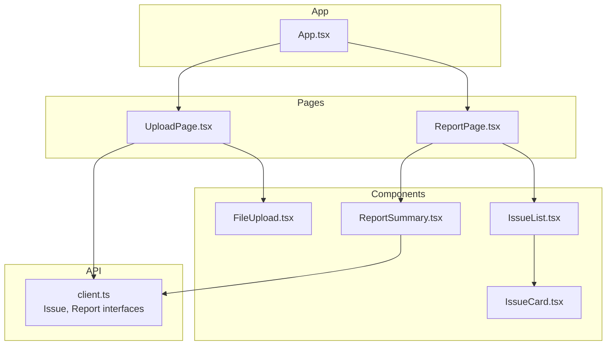
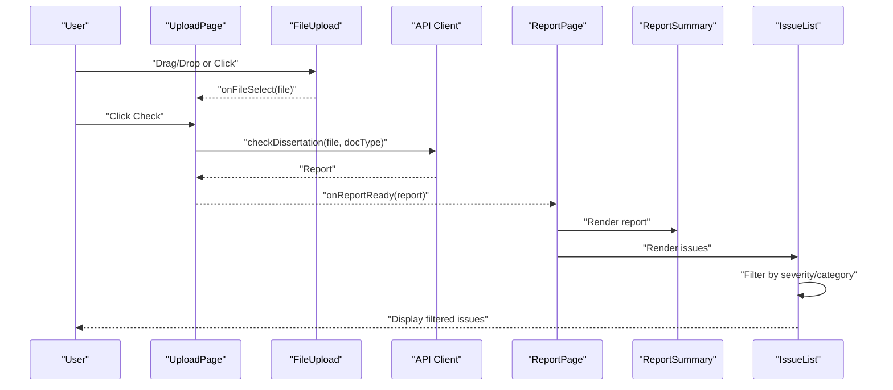
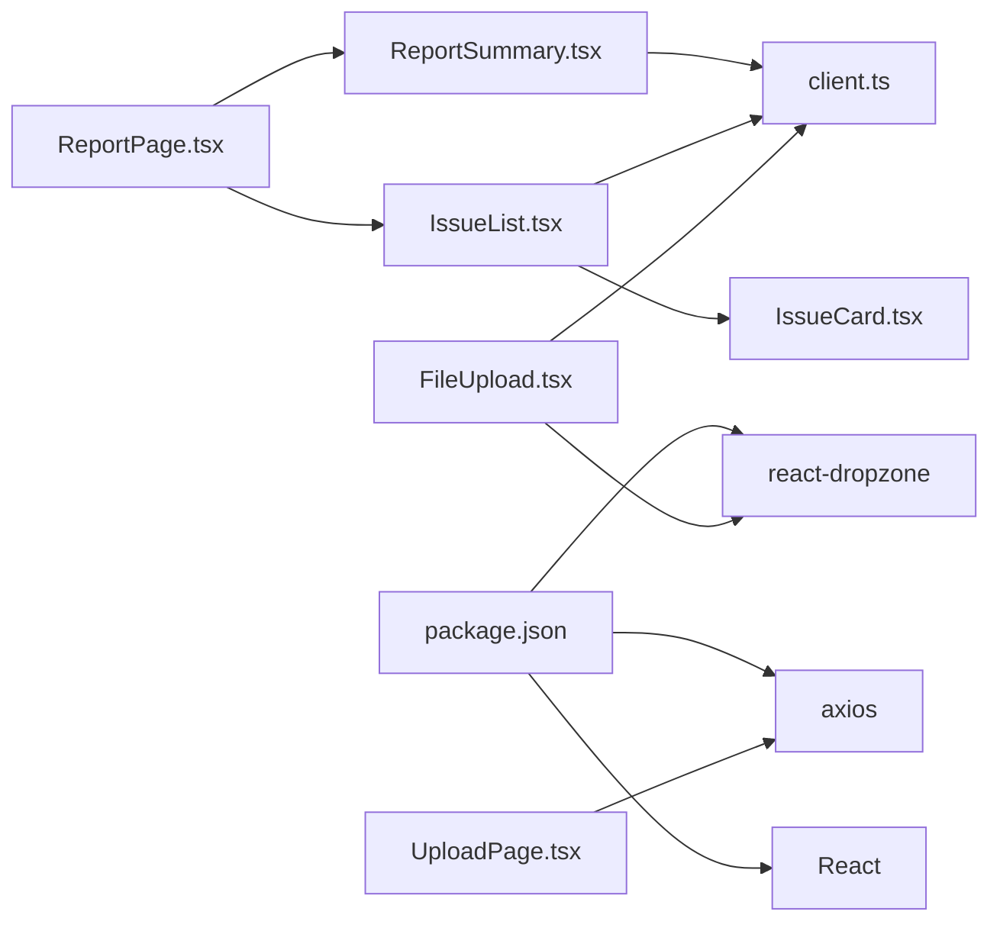

# UI Components Library

<cite>
**Referenced Files in This Document**
- [FileUpload.tsx](file://frontend/src/components/FileUpload.tsx)
- [IssueCard.tsx](file://frontend/src/components/IssueCard.tsx)
- [IssueList.tsx](file://frontend/src/components/IssueList.tsx)
- [ReportSummary.tsx](file://frontend/src/components/ReportSummary.tsx)
- [client.ts](file://frontend/src/api/client.ts)
- [UploadPage.tsx](file://frontend/src/pages/UploadPage.tsx)
- [ReportPage.tsx](file://frontend/src/pages/ReportPage.tsx)
- [App.tsx](file://frontend/src/App.tsx)
- [package.json](file://frontend/package.json)
</cite>

## Table of Contents
1. [Introduction](#introduction)
2. [Project Structure](#project-structure)
3. [Core Components](#core-components)
4. [Architecture Overview](#architecture-overview)
5. [Detailed Component Analysis](#detailed-component-analysis)
6. [Dependency Analysis](#dependency-analysis)
7. [Performance Considerations](#performance-considerations)
8. [Troubleshooting Guide](#troubleshooting-guide)
9. [Conclusion](#conclusion)
10. [Appendices](#appendices)

## Introduction
This document describes the reusable UI components library used by the Dissertation Checker application. It focuses on four primary components:
- FileUpload: drag-and-drop file selection with validation and visual feedback
- IssueCard: individual validation issue display with severity and rule references
- IssueList: filtering, sorting, and bulk operations over issues
- ReportSummary: statistics, category breakdown, and overall assessment metrics

The documentation covers component props, TypeScript interfaces, event handling, styling options, usage examples, customization guidelines, and integration patterns with the application state.

## Project Structure
The UI components are located under the frontend/src/components directory and integrate with page components under frontend/src/pages. The data model interfaces are defined in frontend/src/api/client.ts, consumed by both components and pages.

**Diagram sources**
- [FileUpload.tsx:1-48](file://frontend/src/components/FileUpload.tsx#L1-L48)
- [IssueCard.tsx:1-54](file://frontend/src/components/IssueCard.tsx#L1-L54)
- [IssueList.tsx:1-43](file://frontend/src/components/IssueList.tsx#L1-L43)
- [ReportSummary.tsx:1-46](file://frontend/src/components/ReportSummary.tsx#L1-L46)
- [client.ts:1-50](file://frontend/src/api/client.ts#L1-L50)
- [UploadPage.tsx:1-62](file://frontend/src/pages/UploadPage.tsx#L1-L62)
- [ReportPage.tsx:1-37](file://frontend/src/pages/ReportPage.tsx#L1-L37)
- [App.tsx:1-16](file://frontend/src/App.tsx#L1-L16)

**Section sources**
- [App.tsx:1-16](file://frontend/src/App.tsx#L1-L16)
- [UploadPage.tsx:1-62](file://frontend/src/pages/UploadPage.tsx#L1-L62)
- [ReportPage.tsx:1-37](file://frontend/src/pages/ReportPage.tsx#L1-L37)
- [client.ts:1-50](file://frontend/src/api/client.ts#L1-L50)

## Core Components
This section outlines the four reusable UI components, their responsibilities, and how they fit into the application.

- FileUpload: Provides a drag-and-drop area for selecting a .docx file, validates file type, and communicates selection to parent components.
- IssueCard: Renders a single validation issue with severity badges, category tags, rule references, messages, suggestions, and contextual excerpts.
- IssueList: Aggregates issues, applies filters by severity and category, and renders them via IssueCard.
- ReportSummary: Displays high-level report statistics, severity counts, and category breakdown.

**Section sources**
- [FileUpload.tsx:1-48](file://frontend/src/components/FileUpload.tsx#L1-L48)
- [IssueCard.tsx:1-54](file://frontend/src/components/IssueCard.tsx#L1-L54)
- [IssueList.tsx:1-43](file://frontend/src/components/IssueList.tsx#L1-L43)
- [ReportSummary.tsx:1-46](file://frontend/src/components/ReportSummary.tsx#L1-L46)

## Architecture Overview
The components integrate with page-level logic and the API client to form a cohesive workflow:
- UploadPage manages file selection, document type, submission, and error handling.
- ReportPage displays ReportSummary and IssueList derived from the report.
- IssueList composes IssueCard instances and applies local filtering.
- FileUpload integrates react-dropzone for drag-and-drop behavior.

**Diagram sources**
- [UploadPage.tsx:1-62](file://frontend/src/pages/UploadPage.tsx#L1-L62)
- [FileUpload.tsx:1-48](file://frontend/src/components/FileUpload.tsx#L1-L48)
- [client.ts:33-49](file://frontend/src/api/client.ts#L33-L49)
- [ReportPage.tsx:1-37](file://frontend/src/pages/ReportPage.tsx#L1-L37)
- [ReportSummary.tsx:1-46](file://frontend/src/components/ReportSummary.tsx#L1-L46)
- [IssueList.tsx:1-43](file://frontend/src/components/IssueList.tsx#L1-L43)

## Detailed Component Analysis

### FileUpload Component
Purpose:
- Enable drag-and-drop selection of a single .docx file.
- Provide visual feedback during drag operations.
- Communicate the selected file to the parent component.

Key behaviors:
- Uses react-dropzone to manage drag-and-drop events.
- Validates accepted file types and enforces a single-file limit.
- Updates styles based on drag state and selected file presence.
- Exposes a callback to notify the parent of the selected file.

Props:
- onFileSelect: Function receiving a File when a valid file is dropped or selected.
- selectedFile: Current selected File or null.

Styling and UX:
- Dashed border, rounded corners, centered text, and pointer cursor.
- Background color changes when dragging.
- Displays either a selected file name, drag instruction, or general instruction depending on state.

Integration:
- Consumed by UploadPage to capture user-selected files prior to submission.

Customization guidelines:
- Modify accept types and maxFiles in the dropzone configuration to support additional formats.
- Adjust inline styles for layout and branding alignment.
- Add aria attributes and accessibility enhancements as needed.

Usage example:
- Integrate with a state variable to track the selected file and pass it to the component.

**Section sources**
- [FileUpload.tsx:1-48](file://frontend/src/components/FileUpload.tsx#L1-L48)
- [UploadPage.tsx:1-62](file://frontend/src/pages/UploadPage.tsx#L1-L62)

### IssueCard Component
Purpose:
- Render a single validation issue with clear visual indicators and helpful metadata.

Key elements:
- Severity badge with color-coded background and text contrast.
- Category tag for quick categorization.
- Optional rule reference for GOST rule linkage.
- Message and suggestion for actionable feedback.
- Context excerpt when available.

Props:
- issue: Issue object containing severity, category, checker, location, message, suggestion, and rule_ref.

Styling and UX:
- Card-like container with borders and spacing.
- Flex layout for severity, category, and rule reference badges.
- Color contrast adjustments for readability (e.g., dark text for yellow backgrounds).

Integration:
- Used by IssueList to render each filtered item.

Customization guidelines:
- Extend severity badge mapping for additional severities.
- Add optional fields (e.g., checker) to the card layout.
- Apply theme-aware color tokens for consistent branding.

Usage example:
- Pass a single Issue object to render a compact, informative card.

**Section sources**
- [IssueCard.tsx:1-54](file://frontend/src/components/IssueCard.tsx#L1-L54)
- [client.ts:12-20](file://frontend/src/api/client.ts#L12-L20)

### IssueList Component
Purpose:
- Aggregate and present a collection of issues with filtering and summary information.

Key behaviors:
- Maintains local state for severity and category filters.
- Computes unique categories from the provided issues.
- Filters issues based on selected filters.
- Renders filtered issues using IssueCard.

Props:
- issues: Array of Issue objects.

Filters:
- Severity dropdown: All, Error, Warning, Info.
- Category dropdown: All plus computed unique categories.

Summary:
- Displays count of filtered vs total issues.

Sorting:
- No explicit sorting is applied; order follows input array.

Bulk operations:
- No built-in bulk actions; designed for display and navigation.

Styling and UX:
- Inline controls for filters and counters.
- Vertical stacking of cards with consistent spacing.

Integration:
- Consumed by ReportPage to display issues after report retrieval.

Customization guidelines:
- Add sorting options (e.g., by severity, category, or message length).
- Introduce bulk actions (e.g., mark all as resolved) if needed.
- Add pagination for large issue sets.

Usage example:
- Provide an array of Issue objects to render a filtered, summarized list.

**Section sources**
- [IssueList.tsx:1-43](file://frontend/src/components/IssueList.tsx#L1-L43)
- [IssueCard.tsx:1-54](file://frontend/src/components/IssueCard.tsx#L1-L54)
- [client.ts:12-20](file://frontend/src/api/client.ts#L12-L20)

### ReportSummary Component
Purpose:
- Present high-level report statistics and breakdowns.

Key metrics:
- File name and document type.
- Total issues count.
- Severity-based counts with color-coded blocks.
- Category-based breakdown.

Props:
- report: Report object containing metadata and aggregated counts.

Styling and UX:
- Clear typography hierarchy with headings and counts.
- Color-coded severity blocks with contrasting text for readability.
- List-based category breakdown.

Integration:
- Consumed by ReportPage to summarize the report before listing issues.

Customization guidelines:
- Add percentage calculations relative to total issues.
- Include trend indicators or historical comparisons if available.
- Expand severity blocks to show percentages or icons.

Usage example:
- Pass a Report object to render a concise summary dashboard.

**Section sources**
- [ReportSummary.tsx:1-46](file://frontend/src/components/ReportSummary.tsx#L1-L46)
- [client.ts:22-31](file://frontend/src/api/client.ts#L22-L31)

## Dependency Analysis
External libraries and internal dependencies:
- react-dropzone: Enables drag-and-drop file handling in FileUpload.
- axios: Used by the API client for HTTP requests.
- React: Base framework for component rendering.

Internal dependencies:
- Issue and Report interfaces define the shape of data passed to components.
- Page components orchestrate state and pass props to components.

**Diagram sources**
- [package.json:12-30](file://frontend/package.json#L12-L30)
- [FileUpload.tsx:1-2](file://frontend/src/components/FileUpload.tsx#L1-L2)
- [client.ts:1-1](file://frontend/src/api/client.ts#L1-L1)
- [UploadPage.tsx:1-3](file://frontend/src/pages/UploadPage.tsx#L1-L3)
- [ReportPage.tsx:1-3](file://frontend/src/pages/ReportPage.tsx#L1-L3)
- [IssueList.tsx:1-3](file://frontend/src/components/IssueList.tsx#L1-L3)
- [IssueCard.tsx:1-1](file://frontend/src/components/IssueCard.tsx#L1-L1)
- [ReportSummary.tsx:1-1](file://frontend/src/components/ReportSummary.tsx#L1-L1)

**Section sources**
- [package.json:12-30](file://frontend/package.json#L12-L30)
- [client.ts:1-50](file://frontend/src/api/client.ts#L1-L50)

## Performance Considerations
- Rendering cost: IssueList renders a card per issue; for large reports, consider virtualization or pagination.
- Filtering: Filtering is O(n) per change; acceptable for typical issue counts but could be optimized with memoization if needed.
- Drag-and-drop: react-dropzone handles event listeners efficiently; ensure minimal re-renders in parent components.
- Styling: Inline styles are convenient but can be replaced with CSS modules or styled-components for better caching and reuse.

## Troubleshooting Guide
Common issues and resolutions:
- File type errors: Ensure only .docx files are accepted; verify accept configuration in FileUpload.
- Missing rule references: Some issues may not include rule_ref; conditionally render the rule reference element in IssueCard.
- Empty categories: If categories are empty, ensure the issue array contains entries with category values.
- Network errors: UploadPage catches and displays errors from the API; confirm VITE_API_URL is configured correctly.

Validation and error handling:
- FileUpload does not expose explicit error callbacks; surface validation messages via parent components if needed.
- IssueList does not include explicit error boundaries; wrap it in an error boundary if rendering issues may fail.
- ReportSummary expects complete Report data; guard against missing keys if data shapes vary.

**Section sources**
- [FileUpload.tsx:17-23](file://frontend/src/components/FileUpload.tsx#L17-L23)
- [IssueCard.tsx:40-42](file://frontend/src/components/IssueCard.tsx#L40-L42)
- [IssueList.tsx:13-18](file://frontend/src/components/IssueList.tsx#L13-L18)
- [UploadPage.tsx:22-26](file://frontend/src/pages/UploadPage.tsx#L22-L26)

## Conclusion
The UI components library provides a focused set of reusable components tailored for document validation reporting:
- FileUpload offers a streamlined drag-and-drop experience with clear feedback.
- IssueCard presents actionable validation details with severity and rule context.
- IssueList enables efficient filtering and browsing of issues.
- ReportSummary delivers a concise overview of report metrics.

These components integrate cleanly with page-level logic and the API client, enabling a scalable and maintainable user interface.

## Appendices

### TypeScript Interfaces Reference
- Issue: Defines severity, category, checker, location, message, suggestion, and rule_ref.
- IssueLocation: Provides paragraph index, page number, section name, and context text.
- Report: Contains report metadata, totals, severity and category distributions, and the issues array.

**Section sources**
- [client.ts:5-31](file://frontend/src/api/client.ts#L5-L31)

### Component Props and Events Summary
- FileUpload
  - Props: onFileSelect(file), selectedFile
  - Event: None (callback-based)
- IssueCard
  - Props: issue
  - Event: None
- IssueList
  - Props: issues
  - Event: None
- ReportSummary
  - Props: report
  - Event: None

**Section sources**
- [FileUpload.tsx:4-7](file://frontend/src/components/FileUpload.tsx#L4-L7)
- [IssueCard.tsx:3-5](file://frontend/src/components/IssueCard.tsx#L3-L5)
- [IssueList.tsx:5-7](file://frontend/src/components/IssueList.tsx#L5-L7)
- [ReportSummary.tsx:3-5](file://frontend/src/components/ReportSummary.tsx#L3-L5)

### Integration Patterns
- UploadPage orchestrates file selection and submission, passing the resulting Report to ReportPage.
- ReportPage renders ReportSummary and IssueList, enabling users to navigate from summary to detailed issues.
- IssueList relies on IssueCard for rendering individual items and maintains local filter state.

**Section sources**
- [UploadPage.tsx:9-27](file://frontend/src/pages/UploadPage.tsx#L9-L27)
- [ReportPage.tsx:10-34](file://frontend/src/pages/ReportPage.tsx#L10-L34)
- [IssueList.tsx:9-18](file://frontend/src/components/IssueList.tsx#L9-L18)
- [IssueCard.tsx:13-52](file://frontend/src/components/IssueCard.tsx#L13-L52)