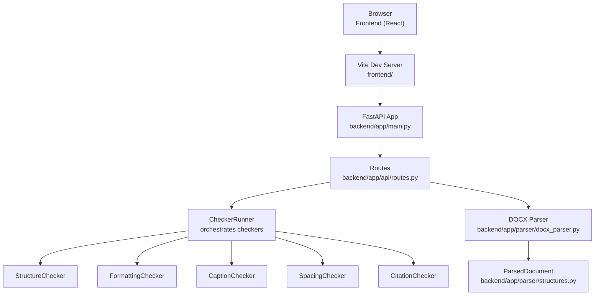

# Getting Started

<cite>
**Referenced Files in This Document**
- [README.md](file://README.md)
- [design.md](file://docs/design.md)
- [plan.md](file://docs/plan.md)
- [pyproject.toml](file://backend/pyproject.toml)
- [package.json](file://frontend/package.json)
- [config.py](file://backend/app/core/config.py)
- [routes.py](file://backend/app/api/routes.py)
- [main.py](file://backend/app/main.py)
- [client.ts](file://frontend/src/api/client.ts)
- [vite.config.ts](file://frontend/vite.config.ts)
- [UploadPage.tsx](file://frontend/src/pages/UploadPage.tsx)
- [App.tsx](file://frontend/src/App.tsx)
</cite>

## Table of Contents
1. [Introduction](#introduction)
2. [Prerequisites](#prerequisites)
3. [Installation](#installation)
4. [Quick Start](#quick-start)
5. [Development Workflow](#development-workflow)
6. [Architecture Overview](#architecture-overview)
7. [Component Walkthrough](#component-walkthrough)
8. [Troubleshooting](#troubleshooting)
9. [Next Steps](#next-steps)

## Introduction
This guide helps you set up and run the Dissertation Checker project locally. It covers prerequisites, installation for backend and frontend, local development workflow, and quick start steps to validate a document using the web interface.

## Prerequisites
- Python 3.11 or newer
- Node.js 18 or newer
- Git
- A modern browser

These versions are required by the project’s technology stack and configuration.

**Section sources**
- [README.md:25-28](file://README.md#L25-L28)
- [pyproject.toml:4](file://backend/pyproject.toml#L4)
- [package.json:12-17](file://frontend/package.json#L12-L17)

## Installation

### Backend Setup
1. Change into the backend directory and create a virtual environment:
   - Linux/macOS: python3 -m venv .venv
   - Windows: python -m venv .venv
2. Activate the virtual environment:
   - Linux/macOS: source .venv/bin/activate
   - Windows: .venv\Scripts\activate
3. Install the backend package in development mode:
   - pip install -e ".[dev]"

Verification:
- From the backend directory, run: python -c "from app.main import app; print('OK')"
- Expected output: OK

**Section sources**
- [README.md:29-34](file://README.md#L29-L34)
- [pyproject.toml:14-29](file://backend/pyproject.toml#L14-L29)

### Frontend Setup
1. Change into the frontend directory.
2. Install dependencies:
   - npm install

Verification:
- The frontend uses Vite and TypeScript. Running the dev server should succeed after dependencies install.

**Section sources**
- [README.md:35-37](file://README.md#L35-L37)
- [package.json:6-11](file://frontend/package.json#L6-L11)

## Quick Start

### Run Locally
1. Start the backend server:
   - From the backend directory, run uvicorn with the FastAPI app entrypoint.
   - The server listens on the port configured by the app (see backend main module).
2. Start the frontend:
   - From the frontend directory, run the Vite dev server.
   - The frontend expects the backend API at http://localhost:8000/api by default.

Access the web interface:
- Open your browser to the frontend URL shown by the Vite dev server (commonly http://localhost:5173).
- Select a document type, choose a .docx file, and click “Check Dissertation”.

Expected behavior:
- The backend validates the uploaded .docx against GOST 7.32-2017 rules and returns a report.
- The frontend displays a summary and detailed issues.

**Section sources**
- [main.py:1-20](file://backend/app/main.py#L1-L20)
- [routes.py:31-75](file://backend/app/api/routes.py#L31-L75)
- [client.ts:3](file://frontend/src/api/client.ts#L3)
- [vite.config.ts:1-8](file://frontend/vite.config.ts#L1-L8)
- [UploadPage.tsx:30-61](file://frontend/src/pages/UploadPage.tsx#L30-L61)

## Development Workflow

### Git Branching Strategy
- Create your own feature branch after Task 1 is merged.
- Commit frequently and push daily.
- Create a Pull Request when ready for review.

Branch naming examples:
- dev-a/structure-formatting
- dev-b/captions-spacing-frontend
- dev-c/citations-docker

**Section sources**
- [README.md:122-139](file://README.md#L122-L139)

### Daily Standup Template
Post this template in your team chat each day:
- Finished: [Task name]
- Working on: [Task name]
- Blocked: [Nothing / describe problem]

**Section sources**
- [README.md:141-150](file://README.md#L141-L150)

### Golden Rules
- Never edit another person’s files without permission.
- Push to GitHub every day.
- Run tests before committing.
- If stuck for 30+ minutes, ask the team or use Qoder for help.
- Focus on one task at a time.

**Section sources**
- [README.md:152-158](file://README.md#L152-L158)

## Architecture Overview

**Diagram sources**
- [main.py:1-20](file://backend/app/main.py#L1-L20)
- [routes.py:21-28](file://backend/app/api/routes.py#L21-L28)
- [routes.py:58-62](file://backend/app/api/routes.py#L58-L62)
- [config.py:6-16](file://backend/app/core/config.py#L6-L16)

## Component Walkthrough

### Backend Entry Point and CORS
- The FastAPI app sets up CORS origins and mounts the API router under /api.
- The default frontend origin is configured for local development.

**Section sources**
- [main.py:9-19](file://backend/app/main.py#L9-L19)
- [config.py:9](file://backend/app/core/config.py#L9)

### API Endpoints
- GET /api/health: Returns a simple health status.
- POST /api/check: Accepts a .docx file and optional doc_type, parses the document, runs all checkers, and returns a report.
- GET /api/reports/{id}: Retrieves a previously generated report.

Validation rules:
- Only .docx files are accepted.
- Enforces a maximum upload size via settings.

**Section sources**
- [routes.py:31-34](file://backend/app/api/routes.py#L31-L34)
- [routes.py:36-62](file://backend/app/api/routes.py#L36-L62)
- [routes.py:70-75](file://backend/app/api/routes.py#L70-L75)
- [config.py:8](file://backend/app/core/config.py#L8)

### Frontend Pages and API Client
- UploadPage collects a file and document type, then calls the API client to check the document.
- The API client posts to /api/check and fetches reports from /api/reports/{id}.
- The default API base URL is http://localhost:8000/api unless overridden by VITE_API_URL.

**Section sources**
- [UploadPage.tsx:9-27](file://frontend/src/pages/UploadPage.tsx#L9-L27)
- [client.ts:33-49](file://frontend/src/api/client.ts#L33-L49)
- [vite.config.ts:1-8](file://frontend/vite.config.ts#L1-L8)

## Troubleshooting

Common setup issues and fixes:
- Python version too low
  - Ensure Python 3.11+ is installed and selected by your shell.
  - Reinstall Python or use a version manager if needed.
- Node.js version too low
  - Ensure Node.js 18+ is installed.
  - Reinstall or use a version manager if needed.
- Virtual environment activation fails
  - Recreate the venv: python3 -m venv .venv
  - Activate again using the appropriate command for your OS.
- Backend import error
  - Confirm you are inside the backend directory and ran the editable install with dev extras.
  - Verify the import path: python -c "from app.main import app; print('OK')"
- Frontend dependency failures
  - Clear node_modules and reinstall: rm -rf node_modules && npm install
- Port conflicts
  - Backend default port is typically 8000; adjust if in use.
  - Frontend default port is typically 5173; adjust if in use.
- CORS errors in browser console
  - Ensure the frontend origin matches the configured CORS origins in settings.
- API URL mismatch
  - Set VITE_API_URL to match your backend host/port if different from localhost:8000.

**Section sources**
- [README.md:25-37](file://README.md#L25-L37)
- [config.py:9](file://backend/app/core/config.py#L9)
- [client.ts:3](file://frontend/src/api/client.ts#L3)

## Next Steps
- Explore the design specification to understand the plugin-based checker architecture and GOST rules.
- Review the implementation plan to see how tasks are split across developers.
- Run the existing tests to confirm your environment is working.

**Section sources**
- [design.md:1-324](file://docs/design.md#L1-L324)
- [plan.md:1-122](file://docs/plan.md#L1-L122)