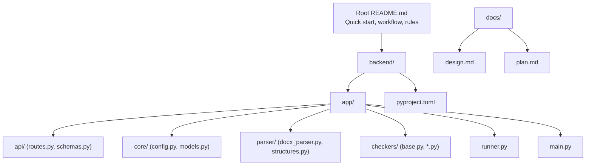
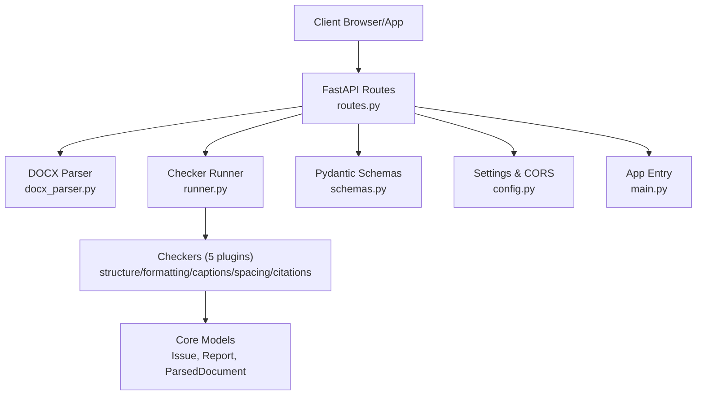
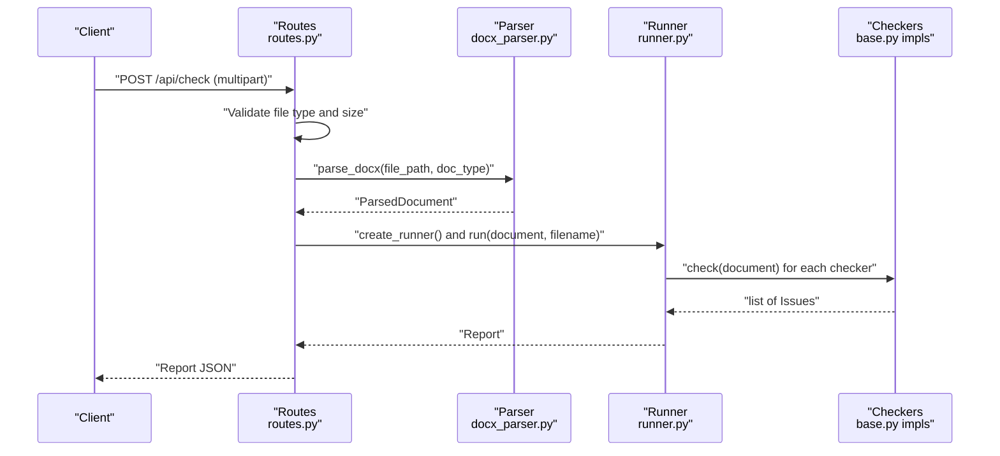
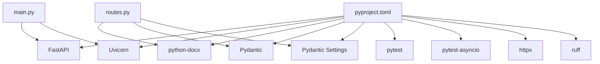

# Getting Started

<cite>
**Referenced Files in This Document**
- [README.md](file://README.md)
- [pyproject.toml](file://backend/pyproject.toml)
- [main.py](file://backend/app/main.py)
- [config.py](file://backend/app/core/config.py)
- [routes.py](file://backend/app/api/routes.py)
- [schemas.py](file://backend/app/api/schemas.py)
- [runner.py](file://backend/app/runner.py)
- [base.py](file://backend/app/checkers/base.py)
- [docx_parser.py](file://backend/app/parser/docx_parser.py)
- [design.md](file://docs/design.md)
- [plan.md](file://docs/plan.md)
</cite>

## Table of Contents
1. [Introduction](#introduction)
2. [Project Structure](#project-structure)
3. [Core Components](#core-components)
4. [Architecture Overview](#architecture-overview)
5. [Detailed Component Analysis](#detailed-component-analysis)
6. [Dependency Analysis](#dependency-analysis)
7. [Performance Considerations](#performance-considerations)
8. [Troubleshooting Guide](#troubleshooting-guide)
9. [Conclusion](#conclusion)
10. [Appendices](#appendices)

## Introduction
This guide helps you set up and run the Dissertation Checker project locally. It covers prerequisites, step-by-step installation for backend and frontend, environment setup with virtual environments, initial configuration, development workflow, running the application, accessing API endpoints, and troubleshooting.

## Project Structure
The project is organized into:
- backend: Python FastAPI application with API endpoints, core models, parsers, checkers, and tests
- docs: Design specification and implementation plan
- Root README with quick start, team assignments, Git workflow, daily standup, and golden rules

**Diagram sources**
- [README.md:169-195](file://README.md#L169-L195)
- [main.py:1-20](file://backend/app/main.py#L1-L20)
- [routes.py:1-66](file://backend/app/api/routes.py#L1-L66)
- [schemas.py:1-38](file://backend/app/api/schemas.py#L1-L38)
- [config.py:1-17](file://backend/app/core/config.py#L1-L17)
- [runner.py:1-25](file://backend/app/runner.py#L1-L25)
- [base.py:1-17](file://backend/app/checkers/base.py#L1-L17)
- [docx_parser.py:1-238](file://backend/app/parser/docx_parser.py#L1-L238)
- [pyproject.toml:1-29](file://backend/pyproject.toml#L1-L29)
- [design.md:28-79](file://docs/design.md#L28-L79)

**Section sources**
- [README.md:169-195](file://README.md#L169-L195)
- [design.md:28-79](file://docs/design.md#L28-L79)

## Core Components
- FastAPI application entry and CORS middleware
- API routes for health, upload, and report retrieval
- Pydantic schemas for request/response contracts
- Configuration settings (app name, CORS origins, upload size limits)
- Checker orchestration via a runner that aggregates issues
- Base checker interface for extensibility
- DOCX parser that extracts structured data from .docx

Key implementation references:
- Application entry and router inclusion: [main.py:1-20](file://backend/app/main.py#L1-L20)
- API routes and endpoint logic: [routes.py:1-66](file://backend/app/api/routes.py#L1-L66)
- API schemas: [schemas.py:1-38](file://backend/app/api/schemas.py#L1-L38)
- Settings and CORS: [config.py:1-17](file://backend/app/core/config.py#L1-L17)
- Checker runner: [runner.py:1-25](file://backend/app/runner.py#L1-L25)
- Base checker interface: [base.py:1-17](file://backend/app/checkers/base.py#L1-L17)
- DOCX parser: [docx_parser.py:1-238](file://backend/app/parser/docx_parser.py#L1-L238)

**Section sources**
- [main.py:1-20](file://backend/app/main.py#L1-L20)
- [routes.py:1-66](file://backend/app/api/routes.py#L1-L66)
- [schemas.py:1-38](file://backend/app/api/schemas.py#L1-L38)
- [config.py:1-17](file://backend/app/core/config.py#L1-L17)
- [runner.py:1-25](file://backend/app/runner.py#L1-L25)
- [base.py:1-17](file://backend/app/checkers/base.py#L1-L17)
- [docx_parser.py:1-238](file://backend/app/parser/docx_parser.py#L1-L238)

## Architecture Overview
The backend follows a plugin-based checker architecture:
- API receives a .docx upload
- Parser converts the document into a structured model
- Runner executes registered checkers
- Aggregated report is returned as JSON

**Diagram sources**
- [routes.py:1-66](file://backend/app/api/routes.py#L1-L66)
- [docx_parser.py:1-238](file://backend/app/parser/docx_parser.py#L1-L238)
- [runner.py:1-25](file://backend/app/runner.py#L1-L25)
- [base.py:1-17](file://backend/app/checkers/base.py#L1-L17)
- [schemas.py:1-38](file://backend/app/api/schemas.py#L1-L38)
- [config.py:1-17](file://backend/app/core/config.py#L1-L17)
- [main.py:1-20](file://backend/app/main.py#L1-L20)

## Detailed Component Analysis

### Backend Setup and Environment
- Prerequisites
  - Python 3.11+
  - Node.js 18+ (for frontend)
  - pip and npm
- Virtual environment
  - Create and activate a Python virtual environment in the backend directory
  - Install editable development dependencies
- Initial configuration
  - Settings include app name, CORS origins, and max upload size
  - Default frontend origin is configured for local development

Step-by-step:
1. Install Python 3.11+ and Node.js 18+
2. Navigate to backend and create a virtual environment
3. Activate the virtual environment
4. Install dependencies with development extras
5. Verify the application imports correctly

Verification steps:
- Confirm Python version meets requirement
- Confirm Node.js version meets requirement
- Confirm virtual environment activation
- Confirm editable install succeeds
- Run a basic import check

**Section sources**
- [README.md:25-38](file://README.md#L25-L38)
- [pyproject.toml:1-29](file://backend/pyproject.toml#L1-L29)
- [config.py:1-17](file://backend/app/core/config.py#L1-L17)

### Running the Application Locally
- Backend server
  - The FastAPI app defines CORS and mounts the API router under /api
- Frontend
  - The project includes a frontend directory and package manifest; run the frontend in a separate terminal as indicated in the quick start

Local execution references:
- Application entry and router mounting: [main.py:1-20](file://backend/app/main.py#L1-L20)
- API router and endpoints: [routes.py:1-66](file://backend/app/api/routes.py#L1-L66)
- Frontend setup command: [README.md:35-37](file://README.md#L35-L37)

**Section sources**
- [main.py:1-20](file://backend/app/main.py#L1-L20)
- [routes.py:1-66](file://backend/app/api/routes.py#L1-L66)
- [README.md:35-37](file://README.md#L35-L37)

### API Endpoints
- GET /api/health: Returns a simple health status
- POST /api/check: Accepts a .docx file and optional document type form field, validates file type and size, parses the document, runs all checkers, and returns a structured report

Endpoint behavior references:
- Health endpoint: [routes.py:30-32](file://backend/app/api/routes.py#L30-L32)
- Document check endpoint: [routes.py:35-66](file://backend/app/api/routes.py#L35-L66)
- Request/response schemas: [schemas.py:1-38](file://backend/app/api/schemas.py#L1-L38)
- Settings for upload size and CORS: [config.py:1-17](file://backend/app/core/config.py#L1-L17)

**Diagram sources**
- [routes.py:35-66](file://backend/app/api/routes.py#L35-L66)
- [docx_parser.py:161-238](file://backend/app/parser/docx_parser.py#L161-L238)
- [runner.py:15-25](file://backend/app/runner.py#L15-L25)
- [base.py:9-17](file://backend/app/checkers/base.py#L9-L17)

**Section sources**
- [routes.py:30-66](file://backend/app/api/routes.py#L30-L66)
- [schemas.py:1-38](file://backend/app/api/schemas.py#L1-L38)
- [config.py:1-17](file://backend/app/core/config.py#L1-L17)

### Development Workflow
- Git branching strategy
  - Create feature branches prefixed with dev-a/, dev-b/, dev-c/ per developer
  - Push branches and open pull requests after completing tasks
  - Rebase or pull main after merging
- Daily standup template
  - Use the provided daily update format
- Golden rules
  - Respect file ownership, push daily, run tests before committing, ask for help when stuck, focus on one task at a time

Workflow references:
- Branch creation commands: [README.md:124-139](file://README.md#L124-L139)
- Daily standup template: [README.md:141-150](file://README.md#L141-L150)
- Golden rules: [README.md:152-158](file://README.md#L152-L158)

**Section sources**
- [README.md:122-158](file://README.md#L122-L158)

### Understanding the Project Structure
- Backend modules
  - app/api: API endpoints and schemas
  - app/core: configuration and shared models
  - app/parser: DOCX parsing utilities
  - app/checkers: checker plugins and base interface
  - app/runner.py: orchestrates checkers
  - app/main.py: FastAPI application entry
- Docs
  - design.md: architecture, contracts, and checker specs
  - plan.md: step-by-step tasks and implementation guidance

Structure references:
- Backend directory layout: [README.md:169-195](file://README.md#L169-L195)
- Design spec structure: [design.md:28-79](file://docs/design.md#L28-L79)

**Section sources**
- [README.md:169-195](file://README.md#L169-L195)
- [design.md:28-79](file://docs/design.md#L28-L79)

## Dependency Analysis
- Python dependencies declared in pyproject.toml include FastAPI, Uvicorn, python-multipart, python-docx, Pydantic, and Pydantic Settings
- Optional development dependencies include pytest, pytest-asyncio, httpx, and ruff
- The backend app imports FastAPI, CORSMiddleware, routes, and settings

Dependency references:
- Dependencies and dev extras: [pyproject.toml:1-29](file://backend/pyproject.toml#L1-L29)
- Application imports: [main.py:1-20](file://backend/app/main.py#L1-L20)
- Route imports: [routes.py:1-17](file://backend/app/api/routes.py#L1-L17)

**Diagram sources**
- [pyproject.toml:1-29](file://backend/pyproject.toml#L1-L29)
- [main.py:1-20](file://backend/app/main.py#L1-L20)
- [routes.py:1-17](file://backend/app/api/routes.py#L1-L17)

**Section sources**
- [pyproject.toml:1-29](file://backend/pyproject.toml#L1-L29)
- [main.py:1-20](file://backend/app/main.py#L1-L20)
- [routes.py:1-17](file://backend/app/api/routes.py#L1-L17)

## Performance Considerations
- Max upload size is enforced to protect resources
- Temporary file cleanup occurs after processing
- Non-functional requirements specify processing time targets and privacy constraints

References:
- Upload size enforcement: [routes.py:44-49](file://backend/app/api/routes.py#L44-L49)
- Temporary file deletion: [routes.py:63-65](file://backend/app/api/routes.py#L63-L65)
- Non-functional requirements: [design.md:307-315](file://docs/design.md#L307-L315)

**Section sources**
- [routes.py:44-65](file://backend/app/api/routes.py#L44-L65)
- [design.md:307-315](file://docs/design.md#L307-L315)

## Troubleshooting Guide
Common setup issues and resolutions:
- Python version mismatch
  - Ensure Python 3.11+ is installed and selected
  - Verify by checking the Python version
- Node.js version mismatch
  - Ensure Node.js 18+ is installed and selected
  - Verify by checking the Node.js version
- Virtual environment activation
  - Create a virtual environment in the backend directory
  - Activate it before installing dependencies
- Dependency installation failures
  - Use editable install with development extras
  - Confirm pyproject.toml dependencies are satisfied
- CORS errors in browser
  - Default frontend origin is configured for localhost:5173
  - Adjust settings if using a different port
- Upload size errors
  - The API enforces a maximum upload size
  - Reduce file size or adjust settings if appropriate
- Parser errors
  - The DOCX parser relies on python-docx
  - Ensure the parser can read the .docx file and extract paragraphs, sections, figures, tables, and references

Verification steps:
- Confirm Python and Node.js versions meet requirements
- Confirm virtual environment activation and editable install
- Run a basic import check for the FastAPI app
- Test the health endpoint
- Upload a small .docx file and verify a report is returned

**Section sources**
- [README.md:25-38](file://README.md#L25-L38)
- [pyproject.toml:1-29](file://backend/pyproject.toml#L1-L29)
- [config.py:1-17](file://backend/app/core/config.py#L1-L17)
- [routes.py:44-65](file://backend/app/api/routes.py#L44-L65)
- [docx_parser.py:161-238](file://backend/app/parser/docx_parser.py#L161-L238)

## Conclusion
You now have the prerequisites, installation steps, environment setup, and development workflow to run the Dissertation Checker locally. Use the API endpoints to validate documents, adhere to the Git workflow and golden rules, and consult the troubleshooting guide for common issues.

## Appendices

### API Endpoint Definitions
- GET /api/health
  - Purpose: Health check
  - Response: Status object
- POST /api/check
  - Purpose: Analyze a .docx document
  - Request: multipart/form-data with file and doc_type
  - Response: Report JSON with issues and summary statistics

References:
- Health endpoint: [routes.py:30-32](file://backend/app/api/routes.py#L30-L32)
- Document check endpoint: [routes.py:35-66](file://backend/app/api/routes.py#L35-L66)
- Schemas: [schemas.py:1-38](file://backend/app/api/schemas.py#L1-L38)

**Section sources**
- [routes.py:30-66](file://backend/app/api/routes.py#L30-L66)
- [schemas.py:1-38](file://backend/app/api/schemas.py#L1-L38)