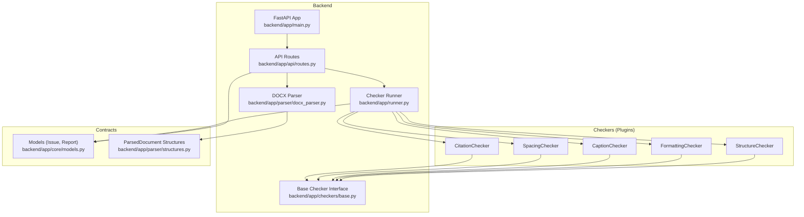
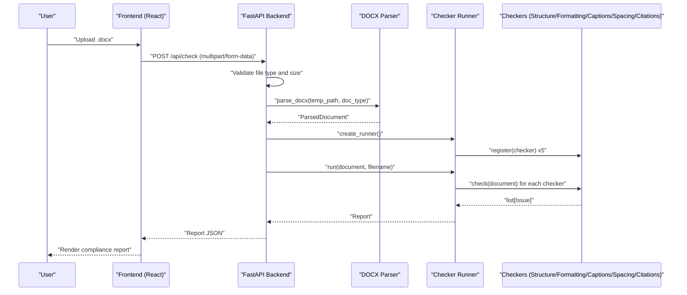
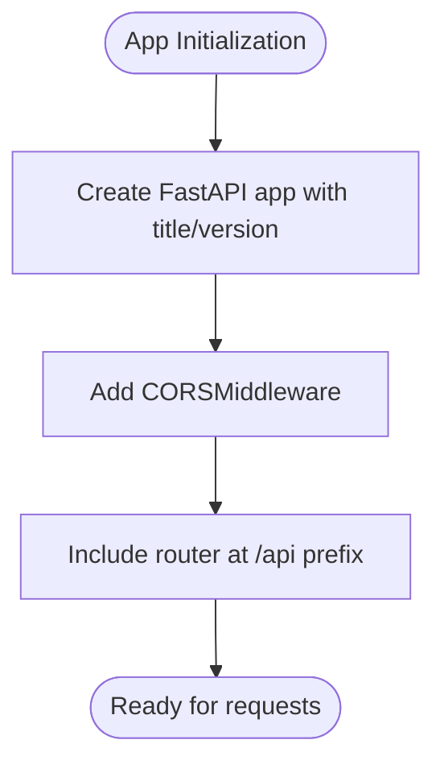
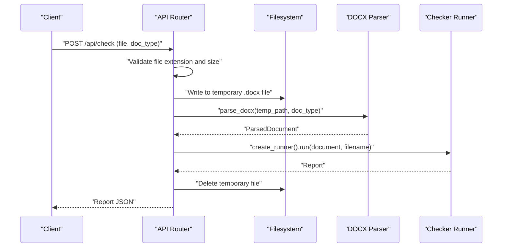
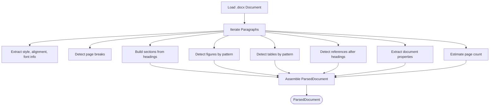
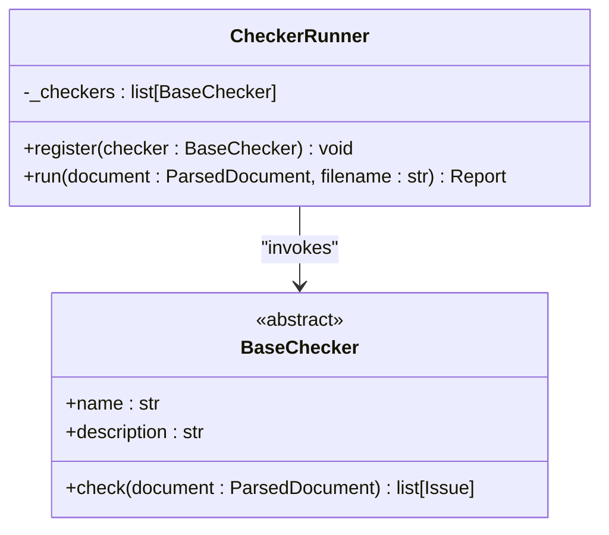
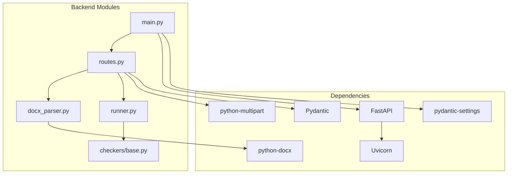

# Project Overview

<cite>
**Referenced Files in This Document**
- [README.md](file://README.md)
- [design.md](file://docs/design.md)
- [plan.md](file://docs/plan.md)
- [main.py](file://backend/app/main.py)
- [routes.py](file://backend/app/api/routes.py)
- [runner.py](file://backend/app/runner.py)
- [docx_parser.py](file://backend/app/parser/docx_parser.py)
- [base.py](file://backend/app/checkers/base.py)
- [pyproject.toml](file://backend/pyproject.toml)
</cite>

## Table of Contents
1. [Introduction](#introduction)
2. [Project Structure](#project-structure)
3. [Core Components](#core-components)
4. [Architecture Overview](#architecture-overview)
5. [Detailed Component Analysis](#detailed-component-analysis)
6. [Dependency Analysis](#dependency-analysis)
7. [Performance Considerations](#performance-considerations)
8. [Troubleshooting Guide](#troubleshooting-guide)
9. [Conclusion](#conclusion)

## Introduction
Dissertation Checker is a web service designed to validate academic dissertations (.docx) against the GOST 7.32-2017 Kazakhstani university formatting standard. Its primary goal is to help university students and academic institutions ensure compliance with official formatting requirements through automated, detailed validation reports. The service accepts a DOCX document, parses it into a structured representation, runs a suite of independent checkers that enforce specific GOST rules, and returns a comprehensive report highlighting issues with severity levels, categories, precise locations, suggested fixes, and references to applicable GOST sections.

Target audience:
- University students submitting dissertations who want to verify formatting compliance before submission
- Academic institutions seeking a standardized, repeatable validation process for thesis formatting
- Educational teams requiring an automated tool to reduce manual review effort

Key benefits:
- Automated compliance checking reduces manual verification workload
- Detailed reporting with severity levels and actionable suggestions improves learning outcomes
- Plugin-based checker architecture enables modular maintenance and future extensibility
- Web-based interface supports easy adoption by students and staff

Educational use case:
The service supports the academic workflow by catching formatting issues early, ensuring documents meet institutional standards, and providing clear guidance for corrections. This helps maintain academic quality and consistency across submissions while saving time for both students and faculty.

## Project Structure
The project follows a layered architecture with a Python FastAPI backend, a plugin-based checker system, and a shared parsing layer. The backend exposes REST endpoints for document upload and report retrieval, orchestrates validation via a runner, and returns structured reports. The design document outlines the complete structure and data contracts.

**Diagram sources**
- [main.py:1-20](file://backend/app/main.py#L1-L20)
- [routes.py:1-66](file://backend/app/api/routes.py#L1-L66)
- [runner.py:1-25](file://backend/app/runner.py#L1-L25)
- [docx_parser.py:1-238](file://backend/app/parser/docx_parser.py#L1-L238)
- [base.py:1-17](file://backend/app/checkers/base.py#L1-L17)

**Section sources**
- [README.md:160-195](file://README.md#L160-L195)
- [design.md:28-79](file://docs/design.md#L28-L79)

## Core Components
- FastAPI Application Entry: Initializes the backend server, applies CORS middleware, and mounts API routes under /api.
- API Routes: Provides health check, document upload endpoint, and report retrieval endpoints. Handles file validation, temporary file management, and orchestrates parsing and checking.
- DOCX Parser: Converts a .docx file into a structured ParsedDocument containing paragraphs, sections, figures, tables, references, metadata, and document properties.
- Checker Runner: Aggregates issues from all registered checkers and produces a unified Report.
- Base Checker Interface: Defines the contract that all individual checkers implement, enabling a plugin-based architecture.
- Shared Contracts: Define Issue, Report, ParsedDocument, and related structures used across the system.

These components work together to transform a raw DOCX upload into a detailed compliance report aligned with GOST 7.32-2017 requirements.

**Section sources**
- [main.py:1-20](file://backend/app/main.py#L1-L20)
- [routes.py:1-66](file://backend/app/api/routes.py#L1-L66)
- [runner.py:1-25](file://backend/app/runner.py#L1-L25)
- [docx_parser.py:1-238](file://backend/app/parser/docx_parser.py#L1-L238)
- [base.py:1-17](file://backend/app/checkers/base.py#L1-L17)
- [design.md:95-186](file://docs/design.md#L95-L186)

## Architecture Overview
The system employs a plugin-based checker architecture. The FastAPI backend exposes REST endpoints, the DOCX parser extracts a structured representation, and the runner coordinates multiple independent checkers. Each checker implements a common interface and returns a list of issues. The runner aggregates these issues into a single Report, which is returned to the client.

**Diagram sources**
- [routes.py:35-66](file://backend/app/api/routes.py#L35-L66)
- [docx_parser.py:161-238](file://backend/app/parser/docx_parser.py#L161-L238)
- [runner.py:15-25](file://backend/app/runner.py#L15-L25)
- [base.py:9-17](file://backend/app/checkers/base.py#L9-L17)

## Detailed Component Analysis

### FastAPI Backend
The backend initializes the FastAPI application, configures CORS for cross-origin requests, and includes the API router under /api. It serves as the central entry point for all HTTP interactions.

**Diagram sources**
- [main.py:9-19](file://backend/app/main.py#L9-L19)

**Section sources**
- [main.py:1-20](file://backend/app/main.py#L1-L20)

### API Routes
The routes module defines:
- Health check endpoint for service monitoring
- Document validation endpoint that accepts .docx uploads, validates size and type, writes to a temporary file, parses the document, runs all checkers, and returns a structured report
- Automatic cleanup of temporary files

**Diagram sources**
- [routes.py:35-66](file://backend/app/api/routes.py#L35-L66)

**Section sources**
- [routes.py:1-66](file://backend/app/api/routes.py#L1-L66)

### DOCX Parser
The parser converts a .docx file into a structured ParsedDocument, extracting:
- Paragraphs with style, alignment, font, spacing, and page break information
- Sections derived from top-level headings
- Figures and tables with numbering and caption positions
- References identified after recognized headings
- Document properties (margins, page dimensions, default font)
- Estimated page counts

**Diagram sources**
- [docx_parser.py:161-238](file://backend/app/parser/docx_parser.py#L161-L238)

**Section sources**
- [docx_parser.py:1-238](file://backend/app/parser/docx_parser.py#L1-L238)

### Checker Runner
The runner maintains a registry of checkers and executes them sequentially against the parsed document. It aggregates all issues into a single Report, computing totals and counts by severity and category.

**Diagram sources**
- [runner.py:8-25](file://backend/app/runner.py#L8-L25)
- [base.py:9-17](file://backend/app/checkers/base.py#L9-L17)

**Section sources**
- [runner.py:1-25](file://backend/app/runner.py#L1-L25)
- [base.py:1-17](file://backend/app/checkers/base.py#L1-L17)

### Shared Contracts
The system defines reusable data contracts:
- Issue: encapsulates severity, category, checker name, location, message, suggestion, and rule reference
- IssueLocation: identifies paragraph index, page number, section name, and context text
- Report: aggregates totals, counts, and the list of issues
- ParsedDocument and related structures: define the parsed representation of the document

These contracts ensure consistent data exchange between components and enable clear reporting.

**Section sources**
- [design.md:112-166](file://docs/design.md#L112-L166)

## Dependency Analysis
The backend leverages FastAPI for the web framework, python-docx for DOCX parsing, and Pydantic for request/response modeling. The project structure and design document outline the relationships among modules and the plugin-based checker system.

**Diagram sources**
- [pyproject.toml:5-12](file://backend/pyproject.toml#L5-L12)
- [main.py:3-19](file://backend/app/main.py#L3-L19)
- [routes.py:3-12](file://backend/app/api/routes.py#L3-L12)
- [runner.py:3-5](file://backend/app/runner.py#L3-L5)
- [docx_parser.py:3-10](file://backend/app/parser/docx_parser.py#L3-L10)
- [base.py:5-6](file://backend/app/checkers/base.py#L5-L6)

**Section sources**
- [pyproject.toml:1-29](file://backend/pyproject.toml#L1-L29)
- [design.md:18-27](file://docs/design.md#L18-L27)

## Performance Considerations
- File size limits and temporary file handling ensure safe processing and prevent resource exhaustion
- The runner executes checkers sequentially; future enhancements could explore parallelization for improved throughput
- Parsing and checking performance scales with document size; the design specifies processing time targets for typical document sizes

## Troubleshooting Guide
Common issues and their likely causes:
- Invalid file format errors occur when the uploaded file is not a .docx
- File too large errors indicate the uploaded file exceeds the configured maximum size
- Parsing errors during document processing suggest issues with the .docx content or structure
- CORS errors can arise from frontend origin mismatches; ensure origins are configured correctly

Operational tips:
- Verify the health endpoint to confirm service availability
- Confirm that the DOCX file meets basic structural expectations for headings, paragraphs, and sections
- Review the report for severity and category distributions to prioritize corrections

**Section sources**
- [routes.py:40-62](file://backend/app/api/routes.py#L40-L62)
- [main.py:11-17](file://backend/app/main.py#L11-L17)

## Conclusion
Dissertation Checker provides a focused, automated solution for validating academic documents against GOST 7.32-2017 formatting standards. Its plugin-based architecture, robust parsing layer, and clear reporting model make it suitable for educational environments where consistent, repeatable validation is essential. By integrating seamlessly with a web-based workflow, the service supports both individual student compliance and institutional quality assurance processes.