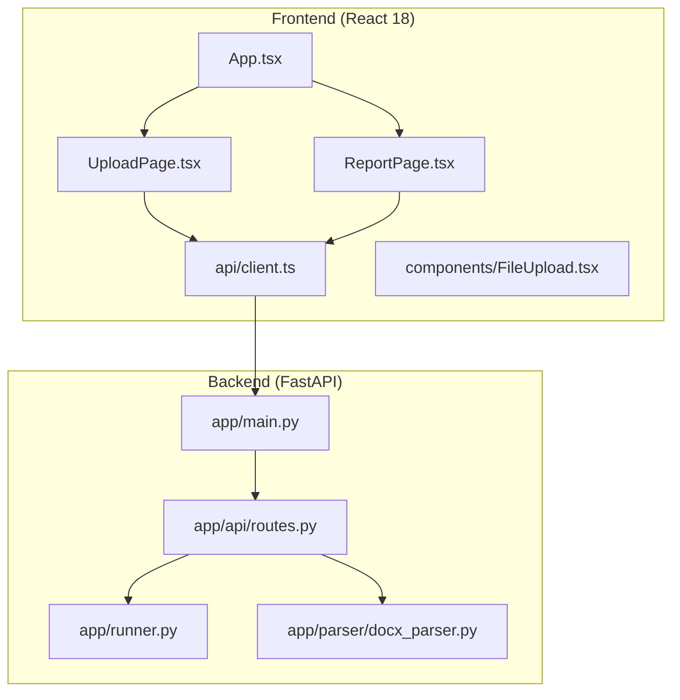
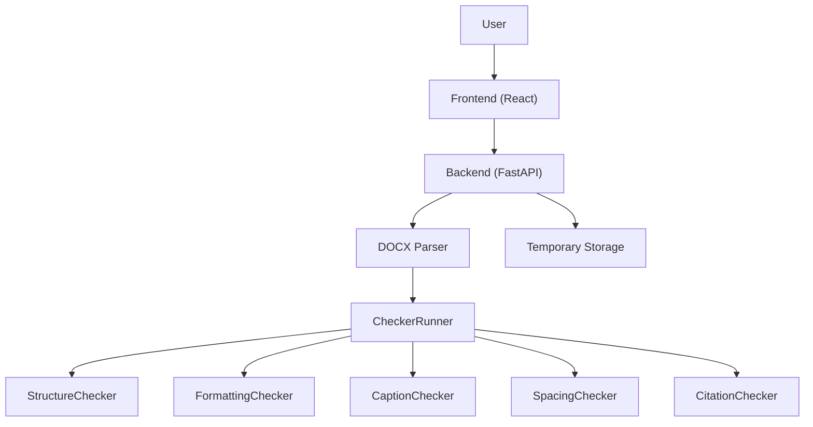
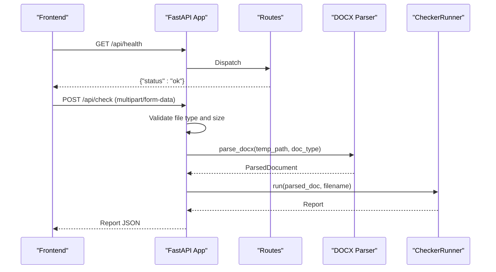
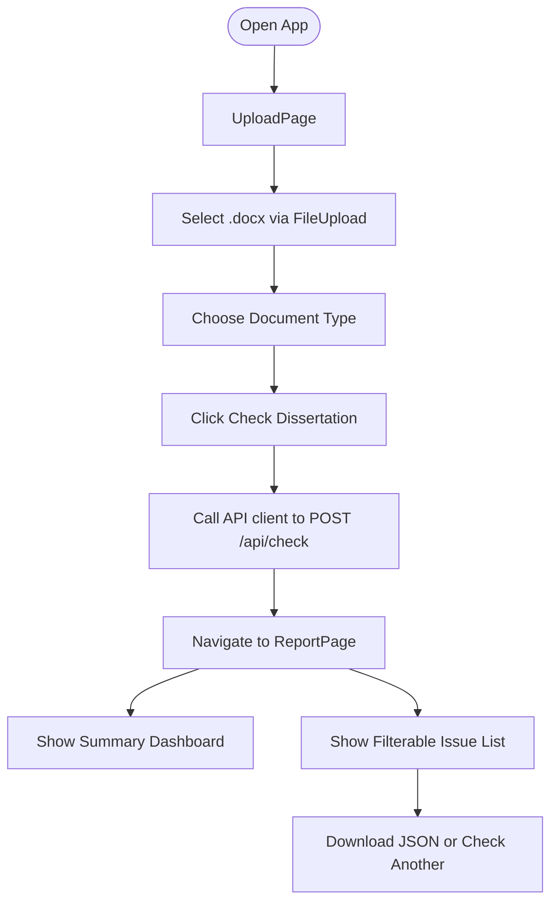
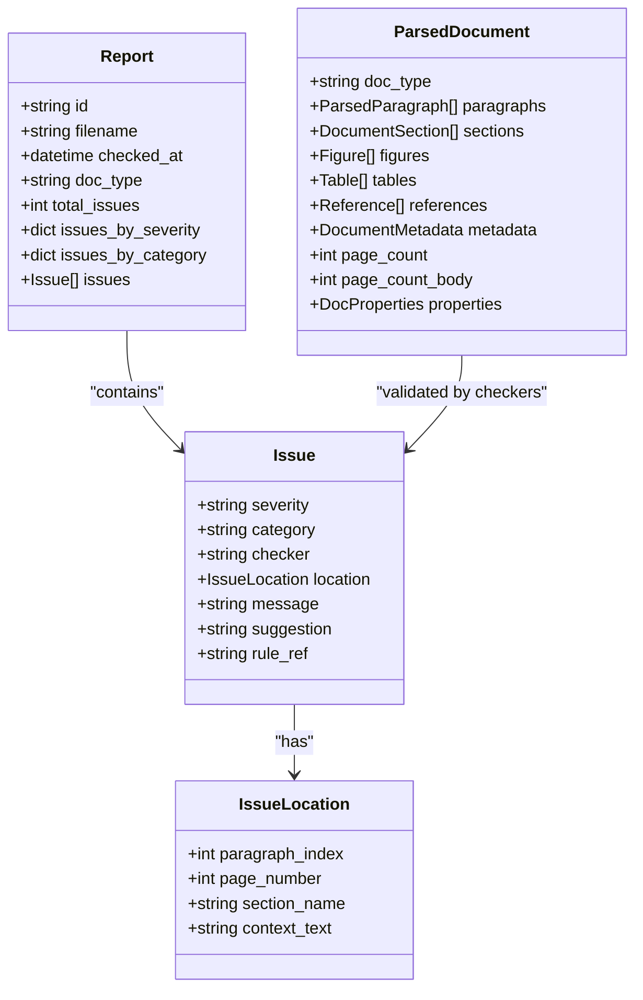
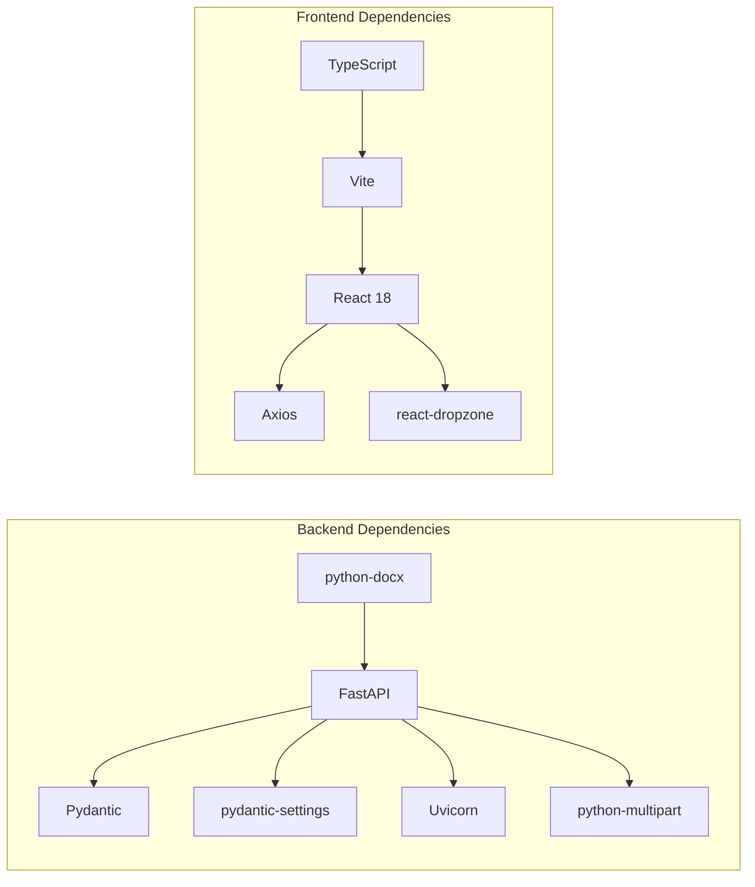

# Project Overview

<cite>
**Referenced Files in This Document**
- [README.md](file://README.md)
- [design.md](file://docs/design.md)
- [plan.md](file://docs/plan.md)
- [pyproject.toml](file://backend/pyproject.toml)
- [package.json](file://frontend/package.json)
- [main.py](file://backend/app/main.py)
- [routes.py](file://backend/app/api/routes.py)
- [runner.py](file://backend/app/runner.py)
- [docx_parser.py](file://backend/app/parser/docx_parser.py)
- [App.tsx](file://frontend/src/App.tsx)
- [UploadPage.tsx](file://frontend/src/pages/UploadPage.tsx)
- [ReportPage.tsx](file://frontend/src/pages/ReportPage.tsx)
- [client.ts](file://frontend/src/api/client.ts)
- [FileUpload.tsx](file://frontend/src/components/FileUpload.tsx)
</cite>

## Table of Contents
1. [Introduction](#introduction)
2. [Project Structure](#project-structure)
3. [Core Components](#core-components)
4. [Architecture Overview](#architecture-overview)
5. [Detailed Component Analysis](#detailed-component-analysis)
6. [Dependency Analysis](#dependency-analysis)
7. [Performance Considerations](#performance-considerations)
8. [Troubleshooting Guide](#troubleshooting-guide)
9. [Conclusion](#conclusion)

## Introduction
Dissertation Checker is a web service designed to validate academic dissertations (.docx) against GOST 7.32-2017, the Kazakhstani university formatting standard. Its mission is to help students ensure their documents meet institutional formatting requirements quickly and reliably. By automating compliance checks, the platform saves time, reduces manual review effort, and minimizes formatting-related delays in the submission process.

Target audience:
- Students: Submit their dissertations for instant, rule-based feedback.
- Universities: Institutions can integrate or recommend the service to support student submissions.

Core value proposition:
- Automated compliance checking aligned with GOST 7.32-2017.
- Fast turnaround for typical thesis volumes (< 30 seconds for ~100 pages).
- Transparent reporting with severity levels, actionable suggestions, and rule references.

## Project Structure
The project follows a full-stack architecture:
- Backend: Python/FastAPI with a plugin-based checker framework and DOCX parsing.
- Frontend: React 18 with TypeScript and Vite, providing a clean upload and report UI.
- Shared contracts: Pydantic models and data structures define the API and internal data flow.

**Diagram sources**
- [main.py:1-20](file://backend/app/main.py#L1-L20)
- [routes.py:1-75](file://backend/app/api/routes.py#L1-L75)
- [runner.py:1-25](file://backend/app/runner.py#L1-L25)
- [docx_parser.py:1-8](file://backend/app/parser/docx_parser.py#L1-L8)
- [App.tsx:1-16](file://frontend/src/App.tsx#L1-L16)
- [UploadPage.tsx:1-62](file://frontend/src/pages/UploadPage.tsx#L1-L62)
- [ReportPage.tsx:1-37](file://frontend/src/pages/ReportPage.tsx#L1-L37)
- [client.ts:1-50](file://frontend/src/api/client.ts#L1-L50)
- [FileUpload.tsx:1-48](file://frontend/src/components/FileUpload.tsx#L1-L48)

**Section sources**
- [README.md:160-195](file://README.md#L160-L195)
- [design.md:28-79](file://docs/design.md#L28-L79)

## Core Components
- Backend application entry and middleware configuration.
- API routes for health checks, document upload, and report retrieval.
- Checker orchestration that runs multiple independent checkers.
- DOCX parsing layer extracting structured data for validation.
- Frontend application routing between upload and report views.
- API client integrating with the backend REST endpoints.
- File upload component enabling drag-and-drop selection of .docx files.

Key implementation references:
- Backend app initialization and CORS: [main.py:1-20](file://backend/app/main.py#L1-L20)
- API endpoints and temporary file handling: [routes.py:1-75](file://backend/app/api/routes.py#L1-L75)
- Checker orchestration: [runner.py:1-25](file://backend/app/runner.py#L1-L25)
- DOCX parsing stub: [docx_parser.py:1-8](file://backend/app/parser/docx_parser.py#L1-L8)
- Frontend app routing: [App.tsx:1-16](file://frontend/src/App.tsx#L1-L16)
- Upload page and form handling: [UploadPage.tsx:1-62](file://frontend/src/pages/UploadPage.tsx#L1-L62)
- Report page and JSON download: [ReportPage.tsx:1-37](file://frontend/src/pages/ReportPage.tsx#L1-L37)
- API client and models: [client.ts:1-50](file://frontend/src/api/client.ts#L1-L50)
- File upload component: [FileUpload.tsx:1-48](file://frontend/src/components/FileUpload.tsx#L1-L48)

**Section sources**
- [main.py:1-20](file://backend/app/main.py#L1-L20)
- [routes.py:1-75](file://backend/app/api/routes.py#L1-L75)
- [runner.py:1-25](file://backend/app/runner.py#L1-L25)
- [docx_parser.py:1-8](file://backend/app/parser/docx_parser.py#L1-L8)
- [App.tsx:1-16](file://frontend/src/App.tsx#L1-L16)
- [UploadPage.tsx:1-62](file://frontend/src/pages/UploadPage.tsx#L1-L62)
- [ReportPage.tsx:1-37](file://frontend/src/pages/ReportPage.tsx#L1-L37)
- [client.ts:1-50](file://frontend/src/api/client.ts#L1-L50)
- [FileUpload.tsx:1-48](file://frontend/src/components/FileUpload.tsx#L1-L48)

## Architecture Overview
The system uses a plugin-based checker architecture:
- A runner aggregates multiple checkers (structure, formatting, captions, spacing, citations).
- The DOCX parser converts .docx content into a structured model consumed by checkers.
- The FastAPI backend exposes REST endpoints for health checks, document validation, and report retrieval.
- The React frontend provides a simple UI for uploading documents and viewing reports.

**Diagram sources**
- [routes.py:416-484](file://backend/app/api/routes.py#L416-L484)
- [runner.py:363-390](file://backend/app/runner.py#L363-L390)
- [docx_parser.py:5-7](file://backend/app/parser/docx_parser.py#L5-L7)
- [client.ts:33-49](file://frontend/src/api/client.ts#L33-L49)

**Section sources**
- [design.md:14-94](file://docs/design.md#L14-L94)
- [routes.py:416-484](file://backend/app/api/routes.py#L416-L484)
- [runner.py:363-390](file://backend/app/runner.py#L363-L390)

## Detailed Component Analysis

### Backend Application Entry
The FastAPI application initializes middleware and registers API routes under a /api prefix. It reads configuration for CORS origins and application name.

**Diagram sources**
- [main.py:1-20](file://backend/app/main.py#L1-L20)
- [routes.py:36-75](file://backend/app/api/routes.py#L36-L75)
- [runner.py:15-24](file://backend/app/runner.py#L15-L24)
- [docx_parser.py:5-7](file://backend/app/parser/docx_parser.py#L5-L7)

**Section sources**
- [main.py:1-20](file://backend/app/main.py#L1-L20)
- [routes.py:36-75](file://backend/app/api/routes.py#L36-L75)

### Frontend Application Flow
The React application toggles between upload and report views. Users select a .docx file via drag-and-drop, choose document type, and submit for validation. On success, the report is rendered with summary statistics and a filterable issue list.

**Diagram sources**
- [App.tsx:6-13](file://frontend/src/App.tsx#L6-L13)
- [UploadPage.tsx:9-27](file://frontend/src/pages/UploadPage.tsx#L9-L27)
- [ReportPage.tsx:10-33](file://frontend/src/pages/ReportPage.tsx#L10-L33)
- [client.ts:33-49](file://frontend/src/api/client.ts#L33-L49)
- [FileUpload.tsx:9-23](file://frontend/src/components/FileUpload.tsx#L9-L23)

**Section sources**
- [App.tsx:1-16](file://frontend/src/App.tsx#L1-L16)
- [UploadPage.tsx:1-62](file://frontend/src/pages/UploadPage.tsx#L1-L62)
- [ReportPage.tsx:1-37](file://frontend/src/pages/ReportPage.tsx#L1-L37)
- [client.ts:1-50](file://frontend/src/api/client.ts#L1-L50)
- [FileUpload.tsx:1-48](file://frontend/src/components/FileUpload.tsx#L1-L48)

### Data Models and Contracts
Shared models define the internal and API contracts for issues, reports, parsed documents, and locations. These enable consistent communication between frontend and backend.

**Diagram sources**
- [models.py:9-57](file://backend/app/core/models.py#L9-L57)
- [design.md:112-166](file://docs/design.md#L112-L166)

**Section sources**
- [models.py:1-58](file://backend/app/core/models.py#L1-L58)
- [design.md:112-166](file://docs/design.md#L112-L166)

## Dependency Analysis
Technology stack and runtime dependencies:
- Backend: Python 3.11+, FastAPI, python-docx, Pydantic, pydantic-settings, uvicorn.
- Frontend: React 18, Vite, TypeScript, Axios, react-dropzone.
- Development: pytest, ruff, ESLint, Docker and docker-compose for containerization.

**Diagram sources**
- [pyproject.toml:5-12](file://backend/pyproject.toml#L5-L12)
- [package.json:12-29](file://frontend/package.json#L12-L29)

**Section sources**
- [pyproject.toml:1-29](file://backend/pyproject.toml#L1-L29)
- [package.json:1-32](file://frontend/package.json#L1-L32)

## Performance Considerations
- File size limit: 50 MB to balance validation accuracy with processing speed.
- Target processing time: < 30 seconds for ~100 pages.
- Temporary file handling: Uploaded files are stored temporarily during processing and removed afterward.
- CORS configuration: Allows frontend origin to enable seamless cross-origin requests.
- Rate limiting: Recommended at 10 requests/minute per IP to prevent abuse.

[No sources needed since this section provides general guidance]

## Troubleshooting Guide
Common issues and resolutions:
- Invalid file format: Ensure the uploaded file is a .docx document; the backend rejects other formats.
- File too large: Keep files under the configured maximum size (default 50 MB).
- Parsing errors: Verify the .docx is not corrupted and contains readable content.
- Network/API errors: Confirm the backend is running and reachable at the configured API URL.
- CORS errors: Ensure the frontend origin matches the configured CORS origins.

**Section sources**
- [routes.py:41-50](file://backend/app/api/routes.py#L41-L50)
- [client.ts:3-4](file://frontend/src/api/client.ts#L3-L4)
- [config.py:6-16](file://backend/app/core/config.py#L6-L16)

## Conclusion
Dissertation Checker delivers a focused, automated solution for validating Kazakhstani university dissertations against GOST 7.32-2017. Its plugin-based architecture, robust DOCX parsing, and intuitive React frontend combine to provide a scalable and maintainable platform. The documented development methodology and team assignments establish a clear path for contributors to implement and extend the system effectively.