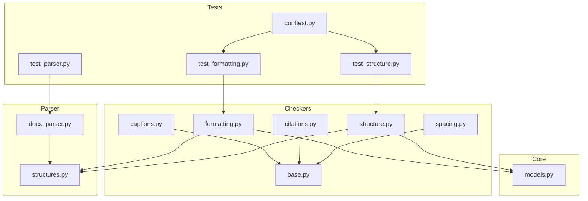
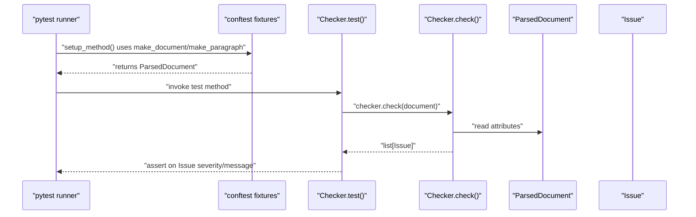
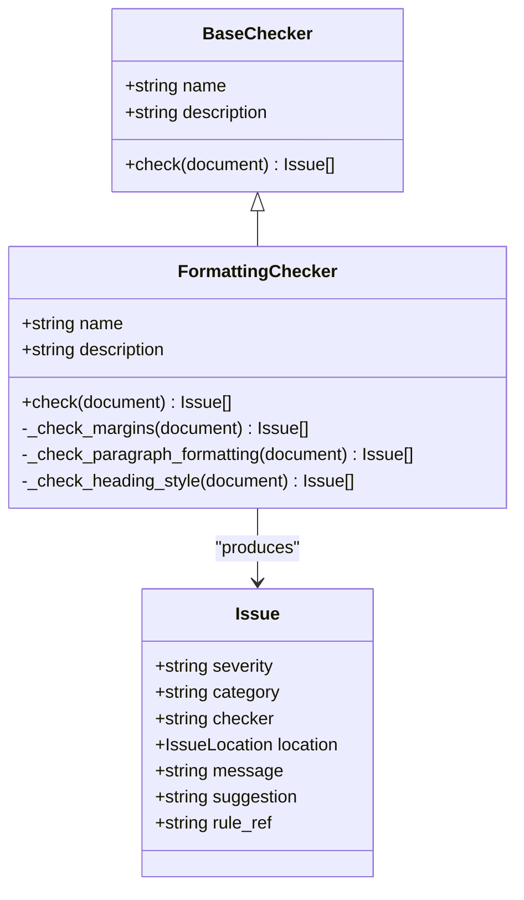
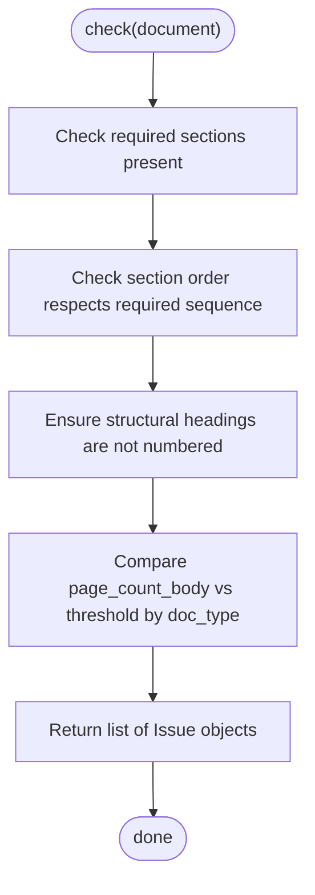
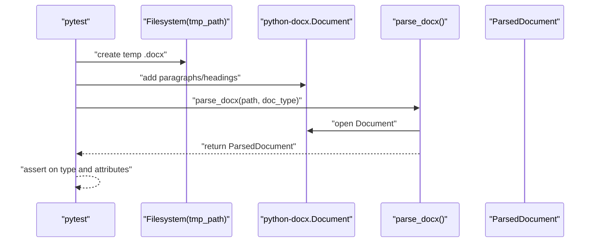
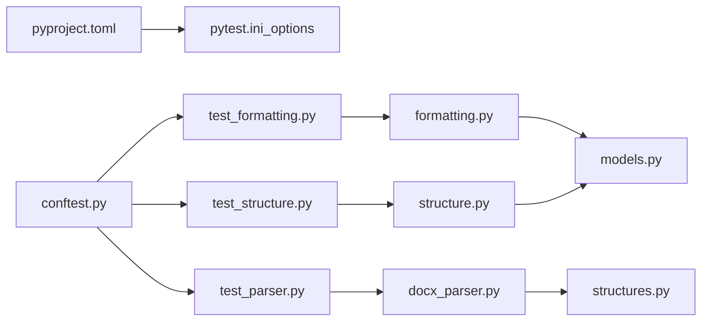

# Testing Strategy

<cite>
**Referenced Files in This Document**
- [pyproject.toml](file://backend/pyproject.toml)
- [conftest.py](file://backend/tests/conftest.py)
- [test_formatting.py](file://backend/tests/test_formatting.py)
- [test_parser.py](file://backend/tests/test_parser.py)
- [test_structure.py](file://backend/tests/test_structure.py)
- [base.py](file://backend/app/checkers/base.py)
- [formatting.py](file://backend/app/checkers/formatting.py)
- [structure.py](file://backend/app/checkers/structure.py)
- [captions.py](file://backend/app/checkers/captions.py)
- [citations.py](file://backend/app/checkers/citations.py)
- [spacing.py](file://backend/app/checkers/spacing.py)
- [docx_parser.py](file://backend/app/parser/docx_parser.py)
- [structures.py](file://backend/app/parser/structures.py)
- [models.py](file://backend/app/core/models.py)
- [main.py](file://backend/app/main.py)
</cite>

## Table of Contents
1. [Introduction](#introduction)
2. [Project Structure](#project-structure)
3. [Core Components](#core-components)
4. [Architecture Overview](#architecture-overview)
5. [Detailed Component Analysis](#detailed-component-analysis)
6. [Dependency Analysis](#dependency-analysis)
7. [Performance Considerations](#performance-considerations)
8. [Troubleshooting Guide](#troubleshooting-guide)
9. [Conclusion](#conclusion)
10. [Appendices](#appendices)

## Introduction
This document describes the testing strategy for the dissertation-checker project. It covers pytest configuration, test organization, shared fixtures, and the testing approach for each checker module. It also explains mock strategies for external dependencies, test data management, guidelines for writing new tests, continuous integration expectations, and end-to-end validation patterns. The goal is to ensure reliable unit and integration tests that validate correctness, maintainability, and performance of the checking pipeline.

## Project Structure
The testing setup is organized under the backend/tests directory with pytest as the test runner. The configuration is centralized in pyproject.toml, and reusable fixtures live in tests/conftest.py. Tests are grouped by functional area:
- Unit tests for individual checkers (formatting, structure, and stubs)
- Integration tests for the DOCX parser
- Shared data model fixtures for building test documents

**Diagram sources**
- [pyproject.toml:22-24](file://backend/pyproject.toml#L22-L24)
- [conftest.py:10-56](file://backend/tests/conftest.py#L10-L56)
- [test_formatting.py:1-92](file://backend/tests/test_formatting.py#L1-L92)
- [test_structure.py:1-74](file://backend/tests/test_structure.py#L1-L74)
- [test_parser.py:1-69](file://backend/tests/test_parser.py#L1-L69)
- [base.py:9-17](file://backend/app/checkers/base.py#L9-L17)
- [formatting.py:15-174](file://backend/app/checkers/formatting.py#L15-L174)
- [structure.py:47-148](file://backend/app/checkers/structure.py#L47-L148)
- [captions.py:8-14](file://backend/app/checkers/captions.py#L8-L14)
- [citations.py:8-14](file://backend/app/checkers/citations.py#L8-L14)
- [spacing.py:8-14](file://backend/app/checkers/spacing.py#L8-L14)
- [docx_parser.py:161-238](file://backend/app/parser/docx_parser.py#L161-L238)
- [structures.py:6-89](file://backend/app/parser/structures.py#L6-L89)
- [models.py:9-58](file://backend/app/core/models.py#L9-L58)

**Section sources**
- [pyproject.toml:22-24](file://backend/pyproject.toml#L22-L24)
- [conftest.py:10-56](file://backend/tests/conftest.py#L10-L56)

## Core Components
- Pytest configuration: test discovery via testpaths, asyncio mode auto, and dev dependencies for testing and linting.
- Shared fixtures: factory functions to construct ParsedDocument and ParsedParagraph instances for deterministic unit tests.
- Checker interface: BaseChecker defines the contract for all checkers, ensuring consistent check(document) behavior and Issue return types.
- Parser: DOCX parsing produces structured data used by checkers; tests validate extraction of paragraphs, sections, margins, and properties.
- Models: Issue and Report models define the shape of diagnostic outputs.

Key configuration and setup references:
- [pyproject.toml:22-24](file://backend/pyproject.toml#L22-L24)
- [conftest.py:10-56](file://backend/tests/conftest.py#L10-L56)
- [base.py:9-17](file://backend/app/checkers/base.py#L9-L17)
- [docx_parser.py:161-238](file://backend/app/parser/docx_parser.py#L161-L238)
- [models.py:9-58](file://backend/app/core/models.py#L9-L58)

**Section sources**
- [pyproject.toml:14-20](file://backend/pyproject.toml#L14-L20)
- [pyproject.toml:22-24](file://backend/pyproject.toml#L22-L24)
- [conftest.py:10-56](file://backend/tests/conftest.py#L10-L56)
- [base.py:9-17](file://backend/app/checkers/base.py#L9-L17)
- [docx_parser.py:161-238](file://backend/app/parser/docx_parser.py#L161-L238)
- [models.py:9-58](file://backend/app/core/models.py#L9-L58)

## Architecture Overview
The testing architecture separates concerns across unit and integration layers:
- Unit tests validate individual checkers against synthetic documents built with shared fixtures.
- Integration tests validate the parser’s ability to extract meaningful structures from real DOCX files.
- Fixtures encapsulate creation of ParsedDocument and ParsedParagraph to avoid duplication and ensure consistency.

**Diagram sources**
- [conftest.py:10-56](file://backend/tests/conftest.py#L10-L56)
- [formatting.py:19-24](file://backend/app/checkers/formatting.py#L19-L24)
- [structure.py:51-57](file://backend/app/checkers/structure.py#L51-L57)
- [models.py:18-26](file://backend/app/core/models.py#L18-L26)

## Detailed Component Analysis

### Formatting Checker Testing Strategy
The FormattingChecker validates page layout, typography, and heading styles. Tests focus on:
- Correct formatting yields zero errors
- Incorrect font, font size, margins, line spacing, alignment, and heading casing/numbering/punctuation produce expected issues

Mock and fixture usage:
- Use make_document and make_paragraph to build controlled inputs
- Override DocProperties to simulate incorrect margins and paragraph attributes

Representative test references:
- [test_formatting.py:13-25](file://backend/tests/test_formatting.py#L13-L25)
- [test_formatting.py:27-43](file://backend/tests/test_formatting.py#L27-L43)
- [test_formatting.py:45-62](file://backend/tests/test_formatting.py#L45-L62)
- [test_formatting.py:64-91](file://backend/tests/test_formatting.py#L64-L91)

Implementation and data model references:
- [formatting.py:15-174](file://backend/app/checkers/formatting.py#L15-L174)
- [structures.py:64-89](file://backend/app/parser/structures.py#L64-L89)
- [models.py:18-26](file://backend/app/core/models.py#L18-L26)

**Diagram sources**
- [base.py:9-17](file://backend/app/checkers/base.py#L9-L17)
- [formatting.py:15-174](file://backend/app/checkers/formatting.py#L15-L174)
- [models.py:18-26](file://backend/app/core/models.py#L18-L26)

**Section sources**
- [test_formatting.py:1-92](file://backend/tests/test_formatting.py#L1-L92)
- [formatting.py:15-174](file://backend/app/checkers/formatting.py#L15-L174)
- [structures.py:64-89](file://backend/app/parser/structures.py#L64-L89)
- [models.py:18-26](file://backend/app/core/models.py#L18-L26)

### Structure Checker Testing Strategy
The StructureChecker validates required sections, ordering, structural heading numbering, and minimum page volume thresholds. Tests verify:
- Missing required sections produce errors
- Out-of-order sections produce errors
- Structural headings should not be numbered
- Page volume below thresholds produces warnings

Representative test references:
- [test_structure.py:13-26](file://backend/tests/test_structure.py#L13-L26)
- [test_structure.py:28-36](file://backend/tests/test_structure.py#L28-L36)
- [test_structure.py:38-46](file://backend/tests/test_structure.py#L38-L46)
- [test_structure.py:48-55](file://backend/tests/test_structure.py#L48-L55)
- [test_structure.py:57-73](file://backend/tests/test_structure.py#L57-L73)

Implementation and data model references:
- [structure.py:47-148](file://backend/app/checkers/structure.py#L47-L148)
- [structures.py:22-89](file://backend/app/parser/structures.py#L22-L89)
- [models.py:18-26](file://backend/app/core/models.py#L18-L26)

**Diagram sources**
- [structure.py:51-148](file://backend/app/checkers/structure.py#L51-L148)
- [models.py:18-26](file://backend/app/core/models.py#L18-L26)

**Section sources**
- [test_structure.py:1-74](file://backend/tests/test_structure.py#L1-L74)
- [structure.py:47-148](file://backend/app/checkers/structure.py#L47-L148)
- [structures.py:22-89](file://backend/app/parser/structures.py#L22-L89)
- [models.py:18-26](file://backend/app/core/models.py#L18-L26)

### Parser Integration Testing Strategy
The parser integration tests validate extraction from real DOCX files:
- Creation of temporary .docx files
- Extraction of paragraphs, headings, sections, and document properties
- Validation of returned ParsedDocument type and attributes

Mock and fixture usage:
- Use tmp_path to create temporary .docx files
- Mock python-docx Document to avoid heavy IO during tests

Representative test references:
- [test_parser.py:10-20](file://backend/tests/test_parser.py#L10-L20)
- [test_parser.py:22-32](file://backend/tests/test_parser.py#L22-L32)
- [test_parser.py:34-45](file://backend/tests/test_parser.py#L34-L45)
- [test_parser.py:47-55](file://backend/tests/test_parser.py#L47-L55)
- [test_parser.py:57-69](file://backend/tests/test_parser.py#L57-L69)

Parser implementation references:
- [docx_parser.py:161-238](file://backend/app/parser/docx_parser.py#L161-L238)
- [structures.py:6-89](file://backend/app/parser/structures.py#L6-L89)

**Diagram sources**
- [test_parser.py:10-69](file://backend/tests/test_parser.py#L10-L69)
- [docx_parser.py:161-238](file://backend/app/parser/docx_parser.py#L161-L238)

**Section sources**
- [test_parser.py:1-69](file://backend/tests/test_parser.py#L1-L69)
- [docx_parser.py:161-238](file://backend/app/parser/docx_parser.py#L161-L238)
- [structures.py:6-89](file://backend/app/parser/structures.py#L6-L89)

### Stub Checkers and Future Coverage
Stub checkers (captions, citations, spacing) currently return empty issue lists. Tests should be added incrementally as implementations are completed. The BaseChecker contract ensures consistent behavior across all checkers.

References:
- [captions.py:8-14](file://backend/app/checkers/captions.py#L8-L14)
- [citations.py:8-14](file://backend/app/checkers/citations.py#L8-L14)
- [spacing.py:8-14](file://backend/app/checkers/spacing.py#L8-L14)
- [base.py:9-17](file://backend/app/checkers/base.py#L9-L17)

**Section sources**
- [captions.py:8-14](file://backend/app/checkers/captions.py#L8-L14)
- [citations.py:8-14](file://backend/app/checkers/citations.py#L8-L14)
- [spacing.py:8-14](file://backend/app/checkers/spacing.py#L8-L14)
- [base.py:9-17](file://backend/app/checkers/base.py#L9-L17)

## Dependency Analysis
The testing layer depends on:
- Pytest and asyncio for async-friendly tests
- Shared fixtures for constructing test documents
- Checker implementations and their data models
- Parser implementation for integration tests

**Diagram sources**
- [pyproject.toml:22-24](file://backend/pyproject.toml#L22-L24)
- [conftest.py:10-56](file://backend/tests/conftest.py#L10-L56)
- [test_formatting.py:1-92](file://backend/tests/test_formatting.py#L1-L92)
- [test_structure.py:1-74](file://backend/tests/test_structure.py#L1-L74)
- [test_parser.py:1-69](file://backend/tests/test_parser.py#L1-L69)
- [formatting.py:15-174](file://backend/app/checkers/formatting.py#L15-L174)
- [structure.py:47-148](file://backend/app/checkers/structure.py#L47-L148)
- [docx_parser.py:161-238](file://backend/app/parser/docx_parser.py#L161-L238)
- [models.py:9-58](file://backend/app/core/models.py#L9-L58)
- [structures.py:6-89](file://backend/app/parser/structures.py#L6-L89)

**Section sources**
- [pyproject.toml:14-20](file://backend/pyproject.toml#L14-L20)
- [pyproject.toml:22-24](file://backend/pyproject.toml#L22-L24)
- [conftest.py:10-56](file://backend/tests/conftest.py#L10-L56)
- [formatting.py:15-174](file://backend/app/checkers/formatting.py#L15-L174)
- [structure.py:47-148](file://backend/app/checkers/structure.py#L47-L148)
- [docx_parser.py:161-238](file://backend/app/parser/docx_parser.py#L161-L238)
- [models.py:9-58](file://backend/app/core/models.py#L9-L58)
- [structures.py:6-89](file://backend/app/parser/structures.py#L6-L89)

## Performance Considerations
- Prefer synthetic fixtures over real DOCX files for unit tests to reduce I/O overhead.
- Use small, focused assertions to keep tests fast and readable.
- Avoid repeated parsing in tests by caching parsed documents when appropriate.
- Keep assertion logic concise to minimize runtime and improve readability.

## Troubleshooting Guide
Common issues and resolutions:
- Fixture misuse: Ensure make_document and make_paragraph are used consistently to avoid flaky tests.
- Parser dependency failures: Verify python-docx is installed in the development environment.
- Async mode: Confirm asyncio_mode is enabled in pytest configuration for async-friendly tests.
- Assertion granularity: Use targeted filters on Issue severity and message keywords to isolate failing conditions.

Relevant references:
- [pyproject.toml:22-24](file://backend/pyproject.toml#L22-L24)
- [conftest.py:10-56](file://backend/tests/conftest.py#L10-L56)
- [test_formatting.py:23-25](file://backend/tests/test_formatting.py#L23-L25)
- [test_structure.py:24-26](file://backend/tests/test_structure.py#L24-L26)

**Section sources**
- [pyproject.toml:22-24](file://backend/pyproject.toml#L22-L24)
- [conftest.py:10-56](file://backend/tests/conftest.py#L10-L56)
- [test_formatting.py:23-25](file://backend/tests/test_formatting.py#L23-L25)
- [test_structure.py:24-26](file://backend/tests/test_structure.py#L24-L26)

## Conclusion
The testing strategy emphasizes clear separation between unit and integration tests, shared fixtures for deterministic inputs, and strict adherence to the BaseChecker contract. By focusing on representative scenarios and leveraging pytest’s capabilities, the suite ensures robust validation of formatting and structural rules while maintaining maintainability and performance.

## Appendices

### Writing New Tests: Guidelines
- Place unit tests alongside the checker under tests/ with descriptive filenames.
- Use setup_method to instantiate the checker per test class.
- Build inputs with make_document and make_paragraph to ensure repeatability.
- Assert on Issue severity and message content to validate rule compliance.
- Add integration tests for parser behavior using tmp_path and minimal .docx content.

References:
- [conftest.py:10-56](file://backend/tests/conftest.py#L10-L56)
- [test_formatting.py:9-12](file://backend/tests/test_formatting.py#L9-L12)
- [test_structure.py:9-11](file://backend/tests/test_structure.py#L9-L11)
- [test_parser.py:10-20](file://backend/tests/test_parser.py#L10-L20)

**Section sources**
- [conftest.py:10-56](file://backend/tests/conftest.py#L10-L56)
- [test_formatting.py:9-12](file://backend/tests/test_formatting.py#L9-L12)
- [test_structure.py:9-11](file://backend/tests/test_structure.py#L9-L11)
- [test_parser.py:10-20](file://backend/tests/test_parser.py#L10-L20)

### Continuous Integration and Coverage
- CI should run pytest with asyncio_mode enabled and test all modules under tests/.
- Recommended coverage targets: 80% line coverage for core modules (checkers, parser, models).
- Linting with ruff should be part of CI pre-commit checks.

References:
- [pyproject.toml:14-20](file://backend/pyproject.toml#L14-L20)
- [pyproject.toml:26-28](file://backend/pyproject.toml#L26-L28)

**Section sources**
- [pyproject.toml:14-20](file://backend/pyproject.toml#L14-L20)
- [pyproject.toml:26-28](file://backend/pyproject.toml#L26-L28)

### End-to-End Validation Procedures
- Parse a real .docx file using parse_docx and run all checkers against the resulting ParsedDocument.
- Aggregate Issue outputs into a Report and verify counts by severity and category.
- Validate that required sections appear and structural headings adhere to numbering rules.

References:
- [docx_parser.py:161-238](file://backend/app/parser/docx_parser.py#L161-L238)
- [models.py:29-58](file://backend/app/core/models.py#L29-L58)
- [structure.py:51-57](file://backend/app/checkers/structure.py#L51-L57)

**Section sources**
- [docx_parser.py:161-238](file://backend/app/parser/docx_parser.py#L161-L238)
- [models.py:29-58](file://backend/app/core/models.py#L29-L58)
- [structure.py:51-57](file://backend/app/checkers/structure.py#L51-L57)