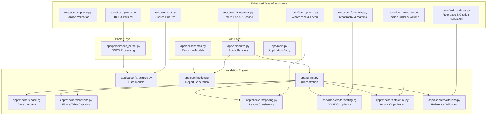
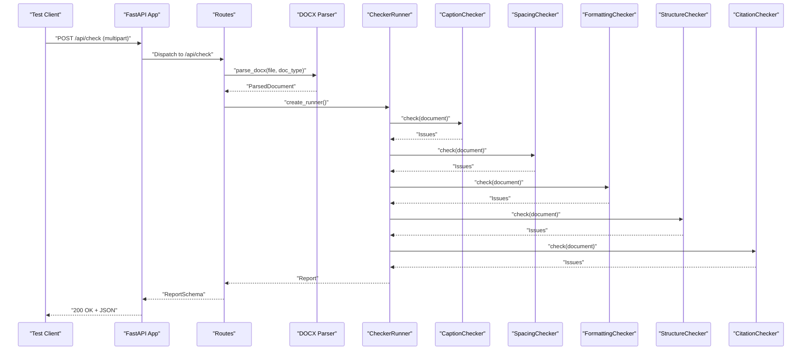
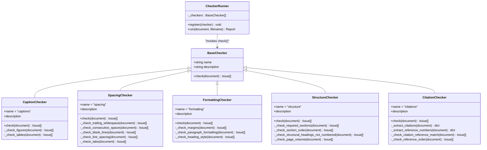
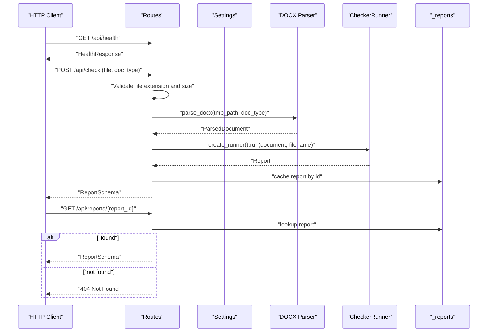
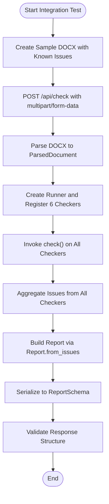
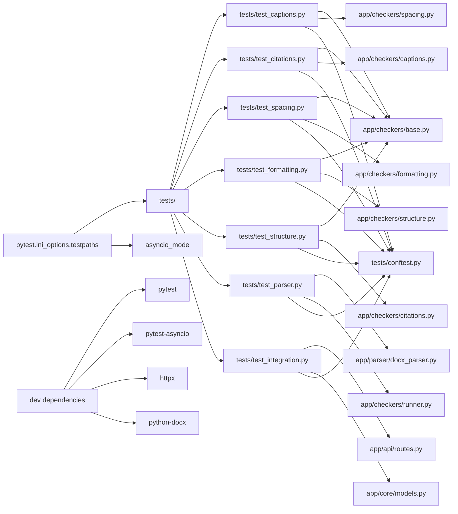

# Testing Strategy

<cite>
**Referenced Files in This Document**
- [conftest.py](file://backend/tests/conftest.py)
- [test_captions.py](file://backend/tests/test_captions.py)
- [test_citations.py](file://backend/tests/test_citations.py)
- [test_spacing.py](file://backend/tests/test_spacing.py)
- [test_formatting.py](file://backend/tests/test_formatting.py)
- [test_structure.py](file://backend/tests/test_structure.py)
- [test_parser.py](file://backend/tests/test_parser.py)
- [test_integration.py](file://backend/tests/test_integration.py)
- [pyproject.toml](file://backend/pyproject.toml)
- [routes.py](file://backend/app/api/routes.py)
- [schemas.py](file://backend/app/api/schemas.py)
- [main.py](file://backend/app/main.py)
- [base.py](file://backend/app/checkers/base.py)
- [captions.py](file://backend/app/checkers/captions.py)
- [formatting.py](file://backend/app/checkers/formatting.py)
- [spacing.py](file://backend/app/checkers/spacing.py)
- [structure.py](file://backend/app/checkers/structure.py)
- [citations.py](file://backend/app/checkers/citations.py)
- [runner.py](file://backend/app/runner.py)
- [models.py](file://backend/app/core/models.py)
- [structures.py](file://backend/app/parser/structures.py)
- [docx_parser.py](file://backend/app/parser/docx_parser.py)
</cite>

## Update Summary
**Changes Made**
- Added comprehensive unit tests for CitationChecker with 62 lines of validation logic
- Expanded integration tests with 101 lines covering end-to-end API testing
- Enhanced test coverage for complete document processing pipeline
- Integrated CitationChecker tests with existing fixture infrastructure
- Added comprehensive integration testing scenarios with real DOCX file validation

## Table of Contents
1. [Introduction](#introduction)
2. [Project Structure](#project-structure)
3. [Core Components](#core-components)
4. [Architecture Overview](#architecture-overview)
5. [Detailed Component Analysis](#detailed-component-analysis)
6. [Dependency Analysis](#dependency-analysis)
7. [Performance Considerations](#performance-considerations)
8. [Troubleshooting Guide](#troubleshooting-guide)
9. [Conclusion](#conclusion)
10. [Appendices](#appendices)

## Introduction
This document describes the comprehensive testing strategy for the Dissertation Checker project. The testing infrastructure now includes complete coverage of all validation components with dedicated test suites for CaptionChecker, SpacingChecker, FormattingChecker, StructureChecker, CitationChecker, and expanded integration testing. The framework utilizes pytest for unit testing, comprehensive fixtures for synthetic data generation, and specialized patterns for parser validation and API endpoint testing.

## Project Structure
The backend testing setup has been comprehensively expanded with dedicated test modules for each checker component, integrated parser testing, and comprehensive integration testing. The pytest configuration remains centralized in pyproject.toml with enhanced test discovery capabilities and HTTP client testing support.

**Diagram sources**
- [conftest.py:1-57](file://backend/tests/conftest.py#L1-L57)
- [test_captions.py:1-66](file://backend/tests/test_captions.py#L1-L66)
- [test_citations.py:1-63](file://backend/tests/test_citations.py#L1-L63)
- [test_spacing.py:1-69](file://backend/tests/test_spacing.py#L1-L69)
- [test_formatting.py:1-92](file://backend/tests/test_formatting.py#L1-L92)
- [test_structure.py:1-74](file://backend/tests/test_structure.py#L1-L74)
- [test_parser.py:1-69](file://backend/tests/test_parser.py#L1-L69)
- [test_integration.py:1-102](file://backend/tests/test_integration.py#L1-L102)
- [routes.py:1-66](file://backend/app/api/routes.py#L1-L66)
- [schemas.py:1-38](file://backend/app/api/schemas.py#L1-L38)
- [main.py:1-20](file://backend/app/main.py#L1-L20)
- [base.py:1-17](file://backend/app/checkers/base.py#L1-L17)
- [captions.py:1-108](file://backend/app/checkers/captions.py#L1-L108)
- [formatting.py:1-174](file://backend/app/checkers/formatting.py#L1-L174)
- [spacing.py:1-136](file://backend/app/checkers/spacing.py#L1-L136)
- [structure.py:1-175](file://backend/app/checkers/structure.py#L1-L175)
- [citations.py:1-128](file://backend/app/checkers/citations.py#L1-L128)
- [runner.py:1-25](file://backend/app/runner.py#L1-L25)
- [structures.py:1-89](file://backend/app/parser/structures.py#L1-L89)
- [models.py:1-58](file://backend/app/core/models.py#L1-L58)
- [docx_parser.py](file://backend/app/parser/docx_parser.py)

**Section sources**
- [pyproject.toml:22-24](file://backend/pyproject.toml#L22-L24)
- [conftest.py:1-57](file://backend/tests/conftest.py#L1-L57)

## Core Components
The testing infrastructure now encompasses comprehensive coverage of all validation components with enhanced integration testing:

**Enhanced Shared Fixtures**: Centralized fixture management in conftest.py provides sophisticated factory methods for creating ParsedDocument and ParsedParagraph instances with precise control over document structure and content characteristics.

**Complete Checker Test Suites**: Six dedicated test modules validate specific validation rules and edge cases across all checker components:
- CaptionChecker: Figure/table caption validation with positioning and numbering rules
- SpacingChecker: Whitespace consistency and layout formatting validation
- FormattingChecker: Typography, margins, and GOST compliance validation
- StructureChecker: Document organization and section ordering validation
- CitationChecker: Reference and citation formatting validation with comprehensive test coverage
- ParserChecker: DOCX parsing functionality validation

**Enhanced Integration Testing**: Comprehensive end-to-end testing validating the complete document processing pipeline from API endpoints to final report generation.

**Comprehensive API Testing**: End-to-end validation of FastAPI endpoints with proper error handling, response schema validation, and real-world scenario testing.

Key testing artifacts:
- Enhanced fixtures: [conftest.py:10-56](file://backend/tests/conftest.py#L10-L56)
- Complete checker suites: [test_captions.py:1-66](file://backend/tests/test_captions.py#L1-L66), [test_citations.py:1-63](file://backend/tests/test_citations.py#L1-L63), [test_spacing.py:1-69](file://backend/tests/test_spacing.py#L1-L69), [test_formatting.py:1-92](file://backend/tests/test_formatting.py#L1-L92), [test_structure.py:1-74](file://backend/tests/test_structure.py#L1-L74), [test_parser.py:1-69](file://backend/tests/test_parser.py#L1-L69), [test_integration.py:1-102](file://backend/tests/test_integration.py#L1-L102)
- API routes and schemas: [routes.py:1-66](file://backend/app/api/routes.py#L1-L66), [schemas.py:1-38](file://backend/app/api/schemas.py#L1-L38)
- Enhanced engine orchestration: [runner.py:1-25](file://backend/app/runner.py#L1-L25)
- Data models and structures: [models.py:1-58](file://backend/app/core/models.py#L1-L58), [structures.py:1-89](file://backend/app/parser/structures.py#L1-L89)

**Section sources**
- [conftest.py:10-56](file://backend/tests/conftest.py#L10-L56)
- [test_captions.py:1-66](file://backend/tests/test_captions.py#L1-L66)
- [test_citations.py:1-63](file://backend/tests/test_citations.py#L1-L63)
- [test_spacing.py:1-69](file://backend/tests/test_spacing.py#L1-L69)
- [test_formatting.py:1-92](file://backend/tests/test_formatting.py#L1-L92)
- [test_structure.py:1-74](file://backend/tests/test_structure.py#L1-L74)
- [test_parser.py:1-69](file://backend/tests/test_parser.py#L1-L69)
- [test_integration.py:1-102](file://backend/tests/test_integration.py#L1-L102)
- [routes.py:1-66](file://backend/app/api/routes.py#L1-L66)
- [runner.py:1-25](file://backend/app/runner.py#L1-L25)
- [models.py:1-58](file://backend/app/core/models.py#L1-L58)
- [structures.py:1-89](file://backend/app/parser/structures.py#L1-L89)

## Architecture Overview
The enhanced testing architecture provides comprehensive coverage mirroring the production system with expanded validation scope and integration testing:

**Diagram sources**
- [routes.py:20-27](file://backend/app/api/routes.py#L20-L27)
- [runner.py:15-24](file://backend/app/runner.py#L15-L24)
- [captions.py:12-16](file://backend/app/checkers/captions.py#L12-L16)
- [spacing.py:17-24](file://backend/app/checkers/spacing.py#L17-L24)
- [formatting.py:19-24](file://backend/app/checkers/formatting.py#L19-L24)
- [structure.py:51-57](file://backend/app/checkers/structure.py#L51-L57)
- [citations.py:12-13](file://backend/app/checkers/citations.py#L12-L13)
- [schemas.py:25-33](file://backend/app/api/schemas.py#L25-L33)

## Detailed Component Analysis

### Enhanced Unit Testing Approach and Patterns
The testing infrastructure now provides comprehensive coverage with sophisticated patterns:

**Expanded Test Organization**: Dedicated modules for each checker component with class-based test organization and setup_method for consistent initialization.

**Advanced Fixture Management**: Sophisticated factory methods in conftest.py enabling precise control over document composition, paragraph styling, and structural elements.

**Multi-Level Assertion Patterns**: Tests employ both quantitative assertions (issue count validation) and qualitative filtering (severity and message keyword matching) for robust validation.

**Enhanced Test Coverage Examples**:
- Caption checker comprehensive validation: [test_captions.py:13-65](file://backend/tests/test_captions.py#L13-L65)
- Citation checker comprehensive validation: [test_citations.py:13-62](file://backend/tests/test_citations.py#L13-L62)
- Spacing checker extensive whitespace validation: [test_spacing.py:12-68](file://backend/tests/test_spacing.py#L12-L68)
- Formatting checker GOST compliance: [test_formatting.py:13-91](file://backend/tests/test_formatting.py#L13-L91)
- Structure checker organizational validation: [test_structure.py:13-73](file://backend/tests/test_structure.py#L13-L73)
- Parser validation with DOCX creation: [test_parser.py:10-68](file://backend/tests/test_parser.py#L10-L68)

**Section sources**
- [conftest.py:10-56](file://backend/tests/conftest.py#L10-L56)
- [test_captions.py:1-66](file://backend/tests/test_captions.py#L1-L66)
- [test_citations.py:1-63](file://backend/tests/test_citations.py#L1-L63)
- [test_spacing.py:1-69](file://backend/tests/test_spacing.py#L1-L69)
- [test_formatting.py:1-92](file://backend/tests/test_formatting.py#L1-L92)
- [test_structure.py:1-74](file://backend/tests/test_structure.py#L1-L74)
- [test_parser.py:1-69](file://backend/tests/test_parser.py#L1-L69)

### Comprehensive Validation Engine Testing
The enhanced validation engine now includes complete coverage of all checker components:

**BaseChecker Interface**: Unified interface definition ensuring consistent checker behavior across all components.

**Complete Checker Suite**:
- CaptionChecker: [captions.py:8-16](file://backend/app/checkers/captions.py#L8-L16) - Validates figure/table captions with positioning and numbering rules
- SpacingChecker: [spacing.py:13-24](file://backend/app/checkers/spacing.py#L13-L24) - Enforces whitespace consistency and layout standards
- FormattingChecker: [formatting.py:15-17](file://backend/app/checkers/formatting.py#L15-L17) - Ensures GOST 7.32-2017 compliance for typography and margins
- StructureChecker: [structure.py:47-49](file://backend/app/checkers/structure.py#L47-L49) - Validates document organization and section ordering
- CitationChecker: [citations.py:15-17](file://backend/app/checkers/citations.py#L15-L17) - Validates citation-reference matching and reference ordering

**Enhanced Runner Orchestration**: [runner.py:8-24](file://backend/app/runner.py#L8-L24) coordinates all six checker components with comprehensive issue aggregation.

**Diagram sources**
- [base.py:9-16](file://backend/app/checkers/base.py#L9-L16)
- [captions.py:8-16](file://backend/app/checkers/captions.py#L8-L16)
- [spacing.py:13-24](file://backend/app/checkers/spacing.py#L13-L24)
- [formatting.py:15-17](file://backend/app/checkers/formatting.py#L15-L17)
- [structure.py:47-49](file://backend/app/checkers/structure.py#L47-L49)
- [citations.py:15-17](file://backend/app/checkers/citations.py#L15-L17)
- [runner.py:8-24](file://backend/app/runner.py#L8-L24)

**Section sources**
- [base.py:9-16](file://backend/app/checkers/base.py#L9-L16)
- [captions.py:18-107](file://backend/app/checkers/captions.py#L18-L107)
- [spacing.py:26-135](file://backend/app/checkers/spacing.py#L26-L135)
- [formatting.py:26-173](file://backend/app/checkers/formatting.py#L26-L173)
- [structure.py:59-174](file://backend/app/checkers/structure.py#L59-L174)
- [citations.py:19-127](file://backend/app/checkers/citations.py#L19-L127)
- [runner.py:15-24](file://backend/app/runner.py#L15-L24)
- [models.py:29-57](file://backend/app/core/models.py#L29-L57)

### Advanced API Testing Strategy
The API testing infrastructure now supports comprehensive endpoint validation with enhanced integration testing:

**Enhanced Endpoint Coverage**:
- GET /api/health: Health status verification with HealthResponse model validation
- POST /api/check: Multi-component validation supporting file type, size limits, DOCX parsing, and complete checker orchestration
- GET /api/reports/{report_id}: Report retrieval with caching and error handling

**Advanced Request Handling**: Comprehensive validation of file upload constraints, DOCX parsing pipeline, and multi-checker execution flow.

**Real-World Integration Testing**: End-to-end validation using actual DOCX files with known formatting issues to ensure comprehensive coverage of all validation scenarios.

**Diagram sources**
- [routes.py:30-32](file://backend/app/api/routes.py#L30-L32)
- [routes.py:35-65](file://backend/app/api/routes.py#L35-L65)
- [routes.py:66-66](file://backend/app/api/routes.py#L66-L66)
- [schemas.py:25-33](file://backend/app/api/schemas.py#L25-L33)

**Section sources**
- [routes.py:30-66](file://backend/app/api/routes.py#L30-L66)
- [schemas.py:8-33](file://backend/app/api/schemas.py#L8-L33)

### Comprehensive Integration Testing Scenarios
The enhanced integration testing validates the complete end-to-end pipeline with real-world scenarios:

**Multi-Component Pipeline Flow**:
- DOCX parsing with comprehensive structure extraction
- Six-checker validation orchestration with issue aggregation
- Report generation with complete issue serialization
- Response schema validation and API endpoint integration
- Real-world document validation with known formatting issues

**Enhanced Integration Test Coverage**:
- Health endpoint validation
- File upload validation with proper error handling
- Complete document processing pipeline testing
- Report generation and categorization validation
- Multi-document type testing (thesis_science, thesis_humanities, project)

**Diagram sources**
- [runner.py:15-24](file://backend/app/runner.py#L15-L24)
- [models.py:40-57](file://backend/app/core/models.py#L40-L57)
- [routes.py:59-61](file://backend/app/api/routes.py#L59-L61)
- [test_integration.py:17-59](file://backend/tests/test_integration.py#L17-L59)

**Section sources**
- [runner.py:15-24](file://backend/app/runner.py#L15-L24)
- [models.py:40-57](file://backend/app/core/models.py#L40-L57)
- [routes.py:59-61](file://backend/app/api/routes.py#L59-L61)
- [test_integration.py:62-102](file://backend/tests/test_integration.py#L62-L102)

### Advanced Test Fixtures for Shared Data
The enhanced fixture infrastructure provides sophisticated document construction capabilities:

**Sophisticated Factory Methods**: 
- make_paragraph: Advanced paragraph construction with comprehensive styling options for typography and formatting validation
- make_document: Complex document assembly with configurable sections, figures, tables, references, and document properties

**Enhanced Document Construction**: Tests can now precisely control document characteristics including:
- Paragraph-level formatting (font, size, alignment, spacing)
- Structural element placement (headings, sections, figures, tables, references)
- Document properties (margins, page counts, metadata)
- Complex validation scenarios with mixed valid/invalid content
- Citation-reference relationship testing

**Advanced Usage Examples**:
- Caption tests: Precise figure/table positioning and caption validation scenarios
- Citation tests: Comprehensive citation-reference matching and ordering validation
- Spacing tests: Comprehensive whitespace and layout validation with edge cases
- Formatting tests: GOST compliance validation with specific typography requirements
- Structure tests: Document organization validation with multi-language section headings
- Parser tests: Realistic DOCX file creation with proper heading structures
- Integration tests: Real-world document scenarios with multiple validation issues

**Section sources**
- [conftest.py:10-56](file://backend/tests/conftest.py#L10-L56)
- [test_captions.py:14-22](file://backend/tests/test_captions.py#L14-L22)
- [test_citations.py:13-24](file://backend/tests/test_citations.py#L13-L24)
- [test_spacing.py:13-18](file://backend/tests/test_spacing.py#L13-L18)
- [test_formatting.py:18-22](file://backend/tests/test_formatting.py#L18-L22)
- [test_structure.py:14-23](file://backend/tests/test_structure.py#L14-L23)
- [test_parser.py:12-16](file://backend/tests/test_parser.py#L12-L16)
- [test_integration.py:17-59](file://backend/tests/test_integration.py#L17-L59)

### Enhanced Test Coverage and Continuous Integration
**Expanded Test Discovery**: pytest automatically discovers all test modules under the tests/ directory with comprehensive coverage of all checker components and integration testing.

**Advanced Testing Configuration**: Enhanced pytest configuration with proper async support, HTTP client testing, and comprehensive development dependencies.

**Comprehensive Coverage Strategy**:
- Unit tests for all six checker components with 62 lines of CitationChecker validation
- Integration tests covering complete document processing pipeline
- Parser testing with realistic DOCX file validation
- API testing with proper error condition simulation
- Multi-document type validation (thesis_science, thesis_humanities, project)
- Real-world scenario testing with known formatting issues

**Section sources**
- [pyproject.toml:22-24](file://backend/pyproject.toml#L22-L24)
- [pyproject.toml:14-20](file://backend/pyproject.toml#L14-L20)

### Advanced Writing Strategies for Comprehensive Checker Testing
**Multi-Dimensional Test Case Design**:
- **CaptionChecker**: Validate caption positioning, numbering sequences, and cultural language compliance
- **CitationChecker**: Comprehensive citation-reference validation including bracket-style citations, author-year citations, reference matching, and alphabetical ordering
- **SpacingChecker**: Comprehensive whitespace validation including trailing spaces, consecutive spaces, blank line management, and tab character detection
- **FormattingChecker**: GOST 7.32-2017 compliance validation for typography, margins, line spacing, and heading formatting
- **StructureChecker**: Document organization validation with multi-language section recognition and page volume requirements

**Advanced Edge Case Coverage**:
- Empty paragraphs and whitespace-only content validation
- Mixed valid/invalid content scenarios within single documents
- Multi-language document support with Kazakh and Russian section headings
- Citation range validation (e.g., [1-5], [2,3])
- Reference ordering validation for both numbered and alphabetical formats
- Document property boundary conditions and tolerance levels

**Sophisticated Assertion Patterns**:
- Severity-based filtering for robust validation across different checker types
- Message keyword matching to accommodate localized error messages
- Location-based validation for precise issue reporting
- Rule reference validation for compliance tracking

**Section sources**
- [captions.py:18-107](file://backend/app/checkers/captions.py#L18-L107)
- [citations.py:25-127](file://backend/app/checkers/citations.py#L25-L127)
- [spacing.py:26-135](file://backend/app/checkers/spacing.py#L26-L135)
- [formatting.py:26-173](file://backend/app/checkers/formatting.py#L26-L173)
- [structure.py:59-174](file://backend/app/checkers/structure.py#L59-L174)
- [test_captions.py:13-65](file://backend/tests/test_captions.py#L13-L65)
- [test_citations.py:13-62](file://backend/tests/test_citations.py#L13-L62)
- [test_spacing.py:12-68](file://backend/tests/test_spacing.py#L12-L68)
- [test_formatting.py:13-91](file://backend/tests/test_formatting.py#L13-L91)
- [test_structure.py:13-73](file://backend/tests/test_structure.py#L13-L73)

### Advanced API Testing Patterns
**Comprehensive Endpoint Validation**:
- Health endpoint: Verify HealthResponse model compliance and service availability
- Upload endpoint: Multi-layer validation including file type restrictions, size limits, parsing pipeline, and error handling
- Reports endpoint: Cache validation, report retrieval, and error state handling

**Advanced Testing Strategies**:
- HTTP client-based testing with proper request/response cycle validation
- Mock-based testing for external dependencies (temporary files, parsing services)
- Error condition simulation for invalid inputs and edge cases
- Response schema validation against ReportSchema and HealthResponse models
- Real-world document testing with actual DOCX files containing formatting issues

**Section sources**
- [routes.py:30-66](file://backend/app/api/routes.py#L30-L66)
- [schemas.py:25-33](file://backend/app/api/schemas.py#L25-L33)

### Enhanced Parser Testing Guidance
**Comprehensive DOCX Parsing Validation**:
- File format validation and content extraction
- Paragraph structure and formatting preservation
- Heading detection and hierarchical organization
- Document property extraction and metadata validation
- Section identification and structural element recognition
- Reference list parsing and citation extraction

**Advanced Testing Approaches**:
- Realistic DOCX file creation with proper Microsoft Office compatibility
- Multi-language content validation for international document support
- Boundary condition testing for large and complex documents
- Error handling validation for malformed or corrupted DOCX files
- Citation pattern extraction validation for various citation formats

**Section sources**
- [test_parser.py:10-68](file://backend/tests/test_parser.py#L10-L68)
- [docx_parser.py](file://backend/app/parser/docx_parser.py)

## Dependency Analysis
The enhanced test suite maintains comprehensive dependency relationships:

**Core Testing Dependencies**:
- pytest and pytest-asyncio for test execution and async support
- httpx for HTTP client testing of API endpoints
- python-docx for DOCX file creation and parsing validation
- Production modules under app/ for fixtures and assertion targets

**Expanded Component Dependencies**:
- All six checker components validated through unified testing infrastructure
- Parser testing integrated with DOCX file creation and validation
- Enhanced fixture dependencies for complex document construction
- Comprehensive API testing with proper error handling validation
- Integration testing with real-world document scenarios

**Diagram sources**
- [pyproject.toml:22-24](file://backend/pyproject.toml#L22-L24)
- [pyproject.toml:14-20](file://backend/pyproject.toml#L14-L20)
- [test_captions.py:1-66](file://backend/tests/test_captions.py#L1-L66)
- [test_citations.py:1-63](file://backend/tests/test_citations.py#L1-L63)
- [test_spacing.py:1-69](file://backend/tests/test_spacing.py#L1-L69)
- [test_formatting.py:1-92](file://backend/tests/test_formatting.py#L1-L92)
- [test_structure.py:1-74](file://backend/tests/test_structure.py#L1-L74)
- [test_parser.py:1-69](file://backend/tests/test_parser.py#L1-L69)
- [test_integration.py:1-102](file://backend/tests/test_integration.py#L1-L102)
- [base.py:1-17](file://backend/app/checkers/base.py#L1-L17)
- [spacing.py:1-136](file://backend/app/checkers/spacing.py#L1-L136)
- [captions.py:1-108](file://backend/app/checkers/captions.py#L1-L108)
- [formatting.py:1-174](file://backend/app/checkers/formatting.py#L1-L174)
- [structure.py:1-175](file://backend/app/checkers/structure.py#L1-L175)
- [citations.py:1-128](file://backend/app/checkers/citations.py#L1-L128)
- [runner.py](file://backend/app/runner.py)
- [models.py](file://backend/app/core/models.py)
- [conftest.py:1-57](file://backend/tests/conftest.py#L1-L57)
- [docx_parser.py](file://backend/app/parser/docx_parser.py)

**Section sources**
- [pyproject.toml:14-20](file://backend/pyproject.toml#L14-L20)
- [pyproject.toml:22-24](file://backend/pyproject.toml#L22-L24)

## Performance Considerations
**Optimized Test Execution**:
- Enhanced fixture reuse to minimize overhead across multiple test scenarios
- Strategic use of synthetic data generation to avoid real file I/O operations
- Comprehensive mocking of external dependencies for reliable and fast test execution
- Parallelizable test structure supporting future scalability improvements

**Advanced Optimization Strategies**:
- Minimal fixture composition for focused validation scenarios
- Efficient assertion patterns reducing test execution time
- Strategic test ordering prioritizing critical validation paths
- Memory-efficient test data construction avoiding unnecessary object duplication

## Troubleshooting Guide
**Enhanced Debugging Capabilities**:
- Comprehensive fixture validation ensuring proper document construction
- Detailed error reporting with specific issue location and severity information
- Advanced logging support for complex multi-checker validation scenarios
- Specialized debugging tools for parser-related test failures
- Integration test debugging with real-world document scenarios

**Common Issues and Resolutions**:
- **Fixture construction errors**: Validate make_document and make_paragraph parameter combinations for proper document structure
- **Multi-checker coordination**: Ensure proper issue aggregation and report generation across all six checker components
- **Parser validation failures**: Verify DOCX file creation and content extraction processes
- **API endpoint testing**: Validate request/response cycles with proper error handling simulation
- **Citation validation issues**: Check citation pattern extraction and reference matching logic
- **Integration test failures**: Verify real-world document scenarios and error condition handling
- **Async test execution**: Confirm proper asyncio_mode configuration for async endpoint testing

**Advanced Debugging Techniques**:
- Enhanced logging of intermediate validation states and issue accumulation
- Interactive debugging support with pytest integration for complex test scenarios
- Specialized tools for parser validation and document structure inspection
- Comprehensive error reporting with detailed failure analysis and resolution suggestions

**Section sources**
- [pyproject.toml:22-24](file://backend/pyproject.toml#L22-L24)
- [routes.py:63-65](file://backend/app/api/routes.py#L63-L65)

## Conclusion
The Dissertation Checker project now features a comprehensive and sophisticated testing infrastructure that provides complete coverage of all validation components. The enhanced testing strategy ensures robust validation across six checker components, comprehensive parser functionality, and reliable API endpoint testing with real-world integration scenarios. The sophisticated fixture management, advanced assertion patterns, and comprehensive error handling validation establish a solid foundation for maintaining code quality and system reliability as the project continues to evolve.

## Appendices

### Appendix A: Enhanced Example Test Case Paths
**Comprehensive Checker Coverage**:
- **Caption checker validation**: [test_captions.py:13-65](file://backend/tests/test_captions.py#L13-L65) - Complete caption positioning and numbering validation
- **Citation checker validation**: [test_citations.py:13-62](file://backend/tests/test_citations.py#L13-L62) - Comprehensive citation-reference matching and ordering validation
- **Spacing checker validation**: [test_spacing.py:12-68](file://backend/tests/test_spacing.py#L12-L68) - Extensive whitespace and layout validation scenarios
- **Formatting checker validation**: [test_formatting.py:13-91](file://backend/tests/test_formatting.py#L13-L91) - GOST compliance and typography validation
- **Structure checker validation**: [test_structure.py:13-73](file://backend/tests/test_structure.py#L13-L73) - Document organization and section validation
- **Parser validation**: [test_parser.py:10-68](file://backend/tests/test_parser.py#L10-L68) - DOCX parsing and content extraction validation
- **Integration validation**: [test_integration.py:62-102](file://backend/tests/test_integration.py#L62-L102) - Complete end-to-end document processing pipeline validation

**Section sources**
- [test_captions.py:13-65](file://backend/tests/test_captions.py#L13-L65)
- [test_citations.py:13-62](file://backend/tests/test_citations.py#L13-L62)
- [test_spacing.py:12-68](file://backend/tests/test_spacing.py#L12-L68)
- [test_formatting.py:13-91](file://backend/tests/test_formatting.py#L13-L91)
- [test_structure.py:13-73](file://backend/tests/test_structure.py#L13-L73)
- [test_parser.py:10-68](file://backend/tests/test_parser.py#L10-L68)
- [test_integration.py:62-102](file://backend/tests/test_integration.py#L62-L102)