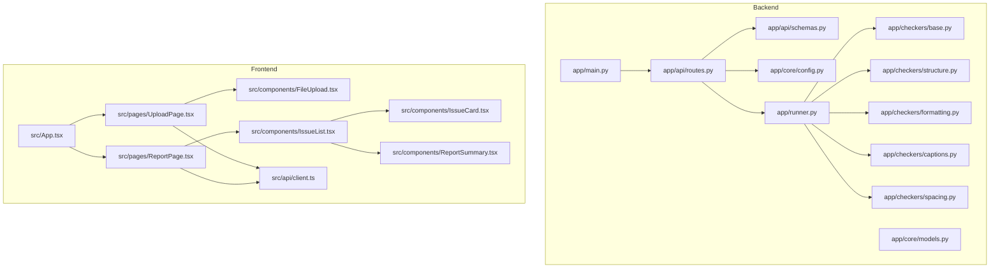
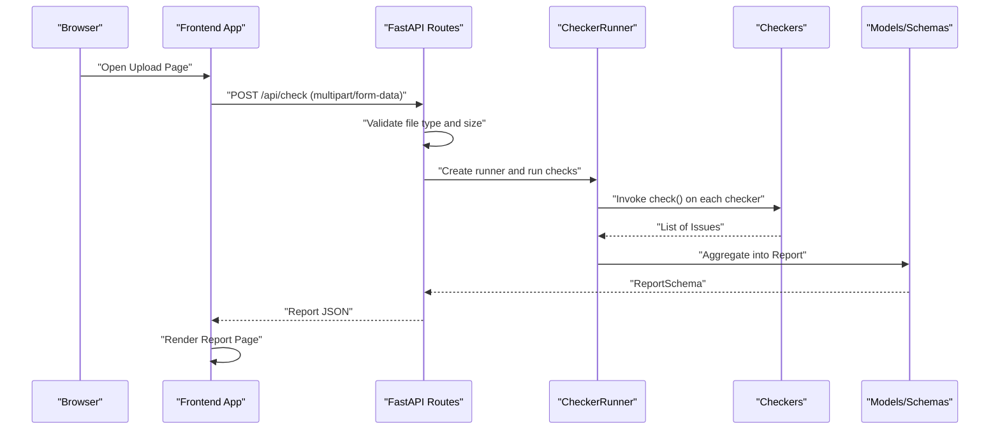
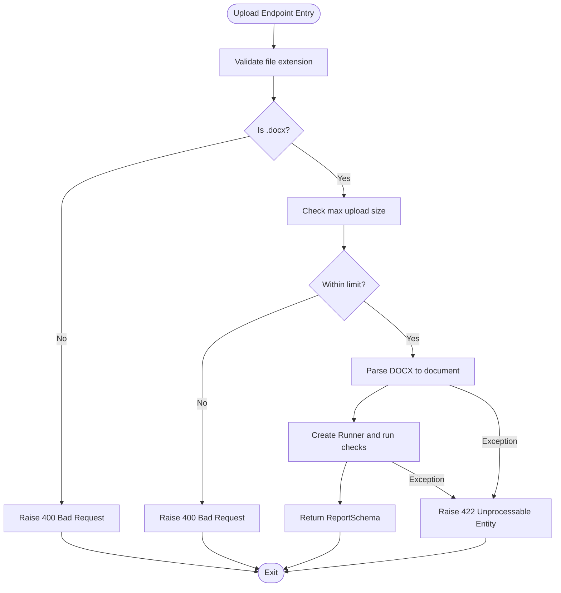
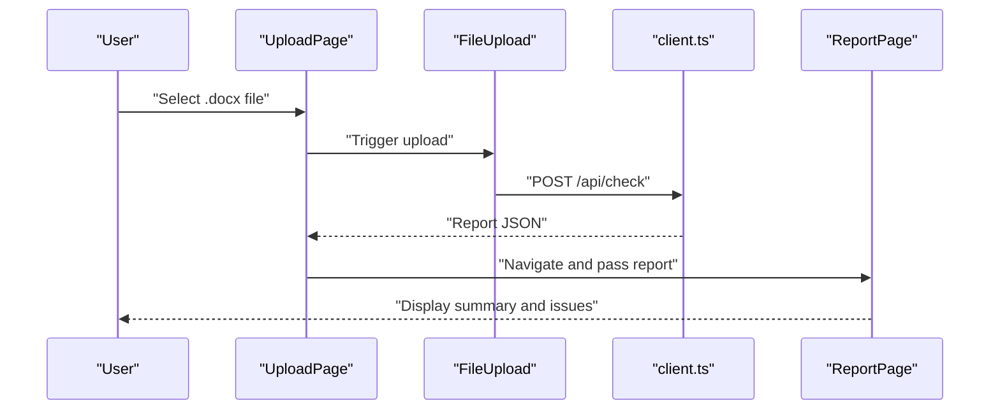
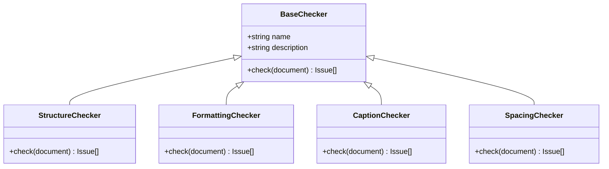
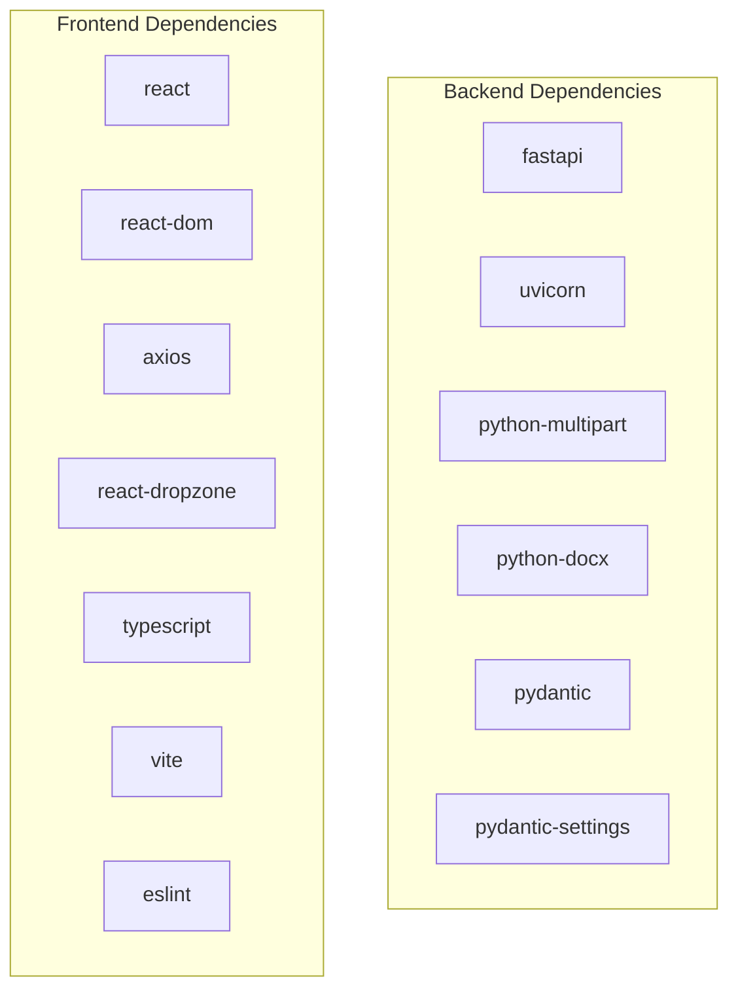

# Troubleshooting and FAQ

<cite>
**Referenced Files in This Document**
- [README.md](file://README.md)
- [backend/pyproject.toml](file://backend/pyproject.toml)
- [frontend/package.json](file://frontend/package.json)
- [backend/app/main.py](file://backend/app/main.py)
- [backend/app/api/routes.py](file://backend/app/api/routes.py)
- [backend/app/api/schemas.py](file://backend/app/api/schemas.py)
- [backend/app/core/config.py](file://backend/app/core/config.py)
- [backend/app/core/models.py](file://backend/app/core/models.py)
- [backend/app/runner.py](file://backend/app/runner.py)
- [backend/app/checkers/base.py](file://backend/app/checkers/base.py)
- [backend/app/checkers/structure.py](file://backend/app/checkers/structure.py)
- [backend/app/checkers/formatting.py](file://backend/app/checkers/formatting.py)
- [backend/app/checkers/captions.py](file://backend/app/checkers/captions.py)
- [backend/app/checkers/spacing.py](file://backend/app/checkers/spacing.py)
- [frontend/src/App.tsx](file://frontend/src/App.tsx)
- [frontend/src/pages/UploadPage.tsx](file://frontend/src/pages/UploadPage.tsx)
- [frontend/src/pages/ReportPage.tsx](file://frontend/src/pages/ReportPage.tsx)
- [frontend/src/components/FileUpload.tsx](file://frontend/src/components/FileUpload.tsx)
- [frontend/src/components/IssueList.tsx](file://frontend/src/components/IssueList.tsx)
- [frontend/src/components/IssueCard.tsx](file://frontend/src/components/IssueCard.tsx)
- [frontend/src/components/ReportSummary.tsx](file://frontend/src/components/ReportSummary.tsx)
- [frontend/src/api/client.ts](file://frontend/src/api/client.ts)
</cite>

## Table of Contents
1. [Introduction](#introduction)
2. [Project Structure](#project-structure)
3. [Core Components](#core-components)
4. [Architecture Overview](#architecture-overview)
5. [Detailed Component Analysis](#detailed-component-analysis)
6. [Dependency Analysis](#dependency-analysis)
7. [Performance Considerations](#performance-considerations)
8. [Troubleshooting Guide](#troubleshooting-guide)
9. [FAQ](#faq)
10. [Conclusion](#conclusion)
11. [Appendices](#appendices)

## Introduction
This document provides a comprehensive troubleshooting and FAQ guide for the Dissertation Checker project. It covers installation and environment setup issues, runtime exceptions, debugging techniques for both frontend and backend, performance and memory optimization for large documents, Docker deployment diagnostics, API connectivity issues, validation engine problems, error message meanings, and step-by-step diagnostic procedures. It also includes frequently asked questions about supported formats, system limitations, and customization possibilities.

## Project Structure
The project consists of:
- Backend: FastAPI application with API routes, Pydantic schemas, configuration, domain models, a checker orchestrator, and individual checkers for structure, formatting, captions, spacing, and citations.
- Frontend: React application with pages for upload and report display, components for rendering issues, and an API client.
- Documentation: Design and plan documents guiding the architecture and development tasks.

**Diagram sources**
- [backend/app/main.py:1-20](file://backend/app/main.py#L1-L20)
- [backend/app/api/routes.py:1-75](file://backend/app/api/routes.py#L1-L75)
- [backend/app/api/schemas.py:1-38](file://backend/app/api/schemas.py#L1-L38)
- [backend/app/core/config.py:1-17](file://backend/app/core/config.py#L1-L17)
- [backend/app/core/models.py:1-58](file://backend/app/core/models.py#L1-L58)
- [backend/app/runner.py:1-25](file://backend/app/runner.py#L1-L25)
- [backend/app/checkers/base.py:1-17](file://backend/app/checkers/base.py#L1-L17)
- [backend/app/checkers/structure.py:1-11](file://backend/app/checkers/structure.py#L1-L11)
- [backend/app/checkers/formatting.py:1-11](file://backend/app/checkers/formatting.py#L1-L11)
- [backend/app/checkers/captions.py:1-108](file://backend/app/checkers/captions.py#L1-L108)
- [backend/app/checkers/spacing.py:1-136](file://backend/app/checkers/spacing.py#L1-L136)
- [frontend/src/App.tsx:1-16](file://frontend/src/App.tsx#L1-L16)
- [frontend/src/pages/UploadPage.tsx](file://frontend/src/pages/UploadPage.tsx)
- [frontend/src/pages/ReportPage.tsx](file://frontend/src/pages/ReportPage.tsx)
- [frontend/src/components/FileUpload.tsx](file://frontend/src/components/FileUpload.tsx)
- [frontend/src/components/IssueList.tsx](file://frontend/src/components/IssueList.tsx)
- [frontend/src/components/IssueCard.tsx](file://frontend/src/components/IssueCard.tsx)
- [frontend/src/components/ReportSummary.tsx](file://frontend/src/components/ReportSummary.tsx)
- [frontend/src/api/client.ts](file://frontend/src/api/client.ts)

**Section sources**
- [README.md:160-195](file://README.md#L160-L195)
- [backend/app/main.py:1-20](file://backend/app/main.py#L1-L20)
- [frontend/src/App.tsx:1-16](file://frontend/src/App.tsx#L1-L16)

## Core Components
- Configuration: Centralized settings for application name, CORS origins, max upload size, and temporary directory.
- Domain Models: Data structures for issues, reports, and locations used across the system.
- API Schemas: Pydantic models for request/response validation and serialization.
- Runner: Orchestrates checker execution and aggregates results into a unified report.
- Checkers: Specialized validators for structure, formatting, captions, spacing, and citations.
- Frontend Pages and Components: Upload and report pages, file upload widget, and issue rendering components.
- API Client: Frontend HTTP client for interacting with backend endpoints.

Key implementation references:
- Configuration and defaults: [backend/app/core/config.py:6-16](file://backend/app/core/config.py#L6-L16)
- Domain models and report aggregation: [backend/app/core/models.py:9-58](file://backend/app/core/models.py#L9-L58)
- API schemas: [backend/app/api/schemas.py:8-38](file://backend/app/api/schemas.py#L8-L38)
- Runner orchestration: [backend/app/runner.py:8-25](file://backend/app/runner.py#L8-L25)
- Base checker interface: [backend/app/checkers/base.py:9-16](file://backend/app/checkers/base.py#L9-L16)
- Individual checkers: [backend/app/checkers/structure.py:5-10](file://backend/app/checkers/structure.py#L5-L10), [backend/app/checkers/formatting.py:5-10](file://backend/app/checkers/formatting.py#L5-L10), [backend/app/checkers/captions.py:8-16](file://backend/app/checkers/captions.py#L8-L16), [backend/app/checkers/spacing.py:13-24](file://backend/app/checkers/spacing.py#L13-L24)
- Frontend pages and components: [frontend/src/pages/UploadPage.tsx](file://frontend/src/pages/UploadPage.tsx), [frontend/src/pages/ReportPage.tsx](file://frontend/src/pages/ReportPage.tsx), [frontend/src/components/FileUpload.tsx](file://frontend/src/components/FileUpload.tsx), [frontend/src/components/IssueList.tsx](file://frontend/src/components/IssueList.tsx), [frontend/src/components/IssueCard.tsx](file://frontend/src/components/IssueCard.tsx), [frontend/src/components/ReportSummary.tsx](file://frontend/src/components/ReportSummary.tsx)
- API client: [frontend/src/api/client.ts](file://frontend/src/api/client.ts)

**Section sources**
- [backend/app/core/config.py:1-17](file://backend/app/core/config.py#L1-L17)
- [backend/app/core/models.py:1-58](file://backend/app/core/models.py#L1-L58)
- [backend/app/api/schemas.py:1-38](file://backend/app/api/schemas.py#L1-L38)
- [backend/app/runner.py:1-25](file://backend/app/runner.py#L1-L25)
- [backend/app/checkers/base.py:1-17](file://backend/app/checkers/base.py#L1-L17)
- [backend/app/checkers/structure.py:1-11](file://backend/app/checkers/structure.py#L1-L11)
- [backend/app/checkers/formatting.py:1-11](file://backend/app/checkers/formatting.py#L1-L11)
- [backend/app/checkers/captions.py:1-108](file://backend/app/checkers/captions.py#L1-L108)
- [backend/app/checkers/spacing.py:1-136](file://backend/app/checkers/spacing.py#L1-L136)
- [frontend/src/App.tsx:1-16](file://frontend/src/App.tsx#L1-L16)
- [frontend/src/pages/UploadPage.tsx](file://frontend/src/pages/UploadPage.tsx)
- [frontend/src/pages/ReportPage.tsx](file://frontend/src/pages/ReportPage.tsx)
- [frontend/src/components/FileUpload.tsx](file://frontend/src/components/FileUpload.tsx)
- [frontend/src/components/IssueList.tsx](file://frontend/src/components/IssueList.tsx)
- [frontend/src/components/IssueCard.tsx](file://frontend/src/components/IssueCard.tsx)
- [frontend/src/components/ReportSummary.tsx](file://frontend/src/components/ReportSummary.tsx)
- [frontend/src/api/client.ts](file://frontend/src/api/client.ts)

## Architecture Overview
The system follows a layered architecture:
- Frontend (React) communicates with the backend via HTTP requests.
- Backend FastAPI exposes endpoints for health checks, document checking, and report retrieval.
- The runner coordinates multiple checkers that validate the parsed document according to GOST rules.
- Results are aggregated into a structured report and returned to the frontend.

**Diagram sources**
- [backend/app/api/routes.py:36-68](file://backend/app/api/routes.py#L36-L68)
- [backend/app/runner.py:15-24](file://backend/app/runner.py#L15-L24)
- [backend/app/checkers/base.py:13-16](file://backend/app/checkers/base.py#L13-L16)
- [backend/app/api/schemas.py:25-37](file://backend/app/api/schemas.py#L25-L37)
- [frontend/src/pages/UploadPage.tsx](file://frontend/src/pages/UploadPage.tsx)
- [frontend/src/pages/ReportPage.tsx](file://frontend/src/pages/ReportPage.tsx)
- [frontend/src/api/client.ts](file://frontend/src/api/client.ts)

## Detailed Component Analysis

### Backend API and Error Handling
Common issues and resolutions:
- File type validation: Only .docx uploads are accepted; otherwise a 400 error is raised.
- File size limit: Controlled by configuration; exceeding the limit raises a 400 error.
- Parsing errors: Unhandled exceptions during parsing raise a 422 error with a descriptive message.
- Report retrieval: Nonexistent report IDs yield a 404 error.

**Diagram sources**
- [backend/app/api/routes.py:41-64](file://backend/app/api/routes.py#L41-L64)

**Section sources**
- [backend/app/api/routes.py:36-75](file://backend/app/api/routes.py#L36-L75)
- [backend/app/core/config.py:8-8](file://backend/app/core/config.py#L8-L8)

### Frontend Upload and Report Rendering
Common issues and resolutions:
- Upload page navigation: Ensure the upload page renders and transitions to the report page upon successful submission.
- Report page rendering: Verify that the report is received and displayed with summary and issue lists.
- File upload component: Confirm drag-and-drop and selection behavior.
- API client: Ensure requests are sent to the correct backend endpoint and handle responses appropriately.

**Diagram sources**
- [frontend/src/pages/UploadPage.tsx](file://frontend/src/pages/UploadPage.tsx)
- [frontend/src/components/FileUpload.tsx](file://frontend/src/components/FileUpload.tsx)
- [frontend/src/api/client.ts](file://frontend/src/api/client.ts)
- [frontend/src/pages/ReportPage.tsx](file://frontend/src/pages/ReportPage.tsx)

**Section sources**
- [frontend/src/App.tsx:6-13](file://frontend/src/App.tsx#L6-L13)
- [frontend/src/pages/UploadPage.tsx](file://frontend/src/pages/UploadPage.tsx)
- [frontend/src/pages/ReportPage.tsx](file://frontend/src/pages/ReportPage.tsx)
- [frontend/src/components/FileUpload.tsx](file://frontend/src/components/FileUpload.tsx)
- [frontend/src/components/IssueList.tsx](file://frontend/src/components/IssueList.tsx)
- [frontend/src/components/IssueCard.tsx](file://frontend/src/components/IssueCard.tsx)
- [frontend/src/components/ReportSummary.tsx](file://frontend/src/components/ReportSummary.tsx)
- [frontend/src/api/client.ts](file://frontend/src/api/client.ts)

### Validation Engine (Checkers)
Common issues and resolutions:
- Captions checker: Missing captions, incorrect positions, and non-sequential numbering produce issues with severity and suggestions.
- Spacing checker: Trailing whitespace, multiple spaces, excessive blank lines, incorrect line spacing, and tab characters are flagged with warnings or errors.

**Diagram sources**
- [backend/app/checkers/base.py:9-16](file://backend/app/checkers/base.py#L9-L16)
- [backend/app/checkers/structure.py:5-10](file://backend/app/checkers/structure.py#L5-L10)
- [backend/app/checkers/formatting.py:5-10](file://backend/app/checkers/formatting.py#L5-L10)
- [backend/app/checkers/captions.py:8-16](file://backend/app/checkers/captions.py#L8-L16)
- [backend/app/checkers/spacing.py:13-24](file://backend/app/checkers/spacing.py#L13-L24)

**Section sources**
- [backend/app/checkers/captions.py:18-73](file://backend/app/checkers/captions.py#L18-L73)
- [backend/app/checkers/spacing.py:26-135](file://backend/app/checkers/spacing.py#L26-L135)

## Dependency Analysis
External dependencies and their roles:
- Backend: FastAPI, Uvicorn, python-multipart, python-docx, Pydantic, Pydantic Settings.
- Frontend: React, React DOM, Axios, react-dropzone, TypeScript, Vite, ESLint.

**Diagram sources**
- [backend/pyproject.toml:5-12](file://backend/pyproject.toml#L5-L12)
- [frontend/package.json:12-30](file://frontend/package.json#L12-L30)

**Section sources**
- [backend/pyproject.toml:1-29](file://backend/pyproject.toml#L1-L29)
- [frontend/package.json:1-32](file://frontend/package.json#L1-L32)

## Performance Considerations
Guidance for handling large documents and optimizing performance:
- Upload size limits: Configure the maximum upload size to prevent resource exhaustion.
- Temporary file handling: Ensure temporary files are created securely and cleaned up after processing.
- Memory usage: For very large documents, consider streaming parsing and incremental processing to reduce peak memory.
- Concurrency: Tune the ASGI server (Uvicorn) workers and threads for production deployments.
- Frontend rendering: Paginate or virtualize long issue lists to avoid heavy DOM updates.
- Validation granularity: Enable/disable specific checkers based on priorities to reduce processing time.

[No sources needed since this section provides general guidance]

## Troubleshooting Guide

### Installation and Environment Setup
Symptoms and fixes:
- Python version mismatch: Ensure Python 3.11+ is installed; update if necessary.
- Node.js version mismatch: Ensure Node.js 18+ is installed; update if necessary.
- Virtual environment activation: Activate the Python virtual environment before installing dependencies.
- Dependency installation failures: Reinstall dependencies using the provided commands; verify network connectivity.

Step-by-step:
1. Verify Python and Node.js versions.
2. Create and activate the Python virtual environment.
3. Install backend development dependencies.
4. Install frontend dependencies in a separate terminal.
5. Confirm local server starts successfully.

**Section sources**
- [README.md:23-38](file://README.md#L23-L38)
- [backend/pyproject.toml:4-4](file://backend/pyproject.toml#L4-L4)
- [frontend/package.json:6-11](file://frontend/package.json#L6-L11)

### Backend Runtime Exceptions
Common HTTP errors and resolutions:
- 400 Bad Request: Occurs for invalid file type or exceeding upload size limit.
  - Fix: Ensure the uploaded file has a .docx extension and is within the configured size limit.
- 404 Not Found: Occurs when requesting a report ID that does not exist.
  - Fix: Trigger a new check to generate a report, then fetch it by the newly generated ID.
- 422 Unprocessable Entity: Occurs during document parsing or processing.
  - Fix: Inspect the backend logs for the exception traceback; verify the DOCX file integrity and structure.

Debugging steps:
1. Check backend logs for exceptions and stack traces.
2. Validate the uploaded file meets expectations (extension, size).
3. Reproduce with a minimal DOCX file to isolate issues.
4. Temporarily disable specific checkers to narrow down the failing component.

**Section sources**
- [backend/app/api/routes.py:41-50](file://backend/app/api/routes.py#L41-L50)
- [backend/app/api/routes.py:70-74](file://backend/app/api/routes.py#L70-L74)
- [backend/app/api/routes.py:63-64](file://backend/app/api/routes.py#L63-L64)

### Frontend Debugging Techniques
Common issues and resolutions:
- Upload button not responding: Verify event handlers and form submission logic.
- Report not displaying: Confirm the report object is passed correctly and rendered by the report page.
- Network errors: Check browser console for failed requests and verify backend health endpoint.

Debugging steps:
1. Open browser developer tools (Network tab) and monitor requests to /api/check and /api/reports/{id}.
2. Inspect response payloads and status codes.
3. Check for CORS-related errors and ensure frontend origin is allowed by backend settings.
4. Validate API client configuration and endpoint URLs.

**Section sources**
- [frontend/src/pages/UploadPage.tsx](file://frontend/src/pages/UploadPage.tsx)
- [frontend/src/pages/ReportPage.tsx](file://frontend/src/pages/ReportPage.tsx)
- [frontend/src/api/client.ts](file://frontend/src/api/client.ts)
- [backend/app/main.py:11-17](file://backend/app/main.py#L11-L17)

### API Connectivity Issues
Symptoms and fixes:
- CORS errors: Ensure the frontend origin is included in the allowed origins configuration.
- Health endpoint unreachable: Verify the backend is running and the /api/health endpoint responds.
- Slow responses: Investigate server resources, upload size, and concurrent requests.

Diagnostic steps:
1. Call /api/health to confirm backend availability.
2. Compare allowed origins with the frontend URL.
3. Monitor server metrics and adjust worker/thread counts if needed.

**Section sources**
- [backend/app/api/routes.py:31-33](file://backend/app/api/routes.py#L31-L33)
- [backend/app/main.py:11-17](file://backend/app/main.py#L11-L17)
- [backend/app/core/config.py:9-9](file://backend/app/core/config.py#L9-L9)

### Validation Engine Problems
Symptoms and fixes:
- Missing or misnumbered captions: Review suggestions and fix figure/table numbering and positions.
- Spacing violations: Replace tabs with indents, remove trailing spaces, and adjust line spacing.
- Empty or incomplete checkers: Implement missing validation logic in structure/formatting checkers.

Diagnostic steps:
1. Examine issue categories and severities in the report.
2. Use issue locations to pinpoint paragraphs and sections.
3. Apply suggested corrections and re-run validation.

**Section sources**
- [backend/app/checkers/captions.py:18-107](file://backend/app/checkers/captions.py#L18-L107)
- [backend/app/checkers/spacing.py:17-135](file://backend/app/checkers/spacing.py#L17-L135)
- [backend/app/checkers/structure.py:9-10](file://backend/app/checkers/structure.py#L9-L10)
- [backend/app/checkers/formatting.py:9-10](file://backend/app/checkers/formatting.py#L9-L10)

### Docker Deployment Diagnostics
Symptoms and fixes:
- Containers fail to start: Check Dockerfile syntax and image build logs.
- Port conflicts: Ensure ports are not occupied by other services.
- Volume permissions: Verify mount paths and permissions for temporary storage.

Diagnostic steps:
1. Build images using the provided Dockerfiles.
2. Run containers with appropriate port mappings.
3. Inspect container logs for startup errors.
4. Validate environment variables and .env file presence if applicable.

**Section sources**
- [README.md:108-115](file://README.md#L108-L115)

### Error Messages and Meanings
Interpreting common backend error messages:
- "Only .docx files are accepted": The uploaded file must have a .docx extension.
- "File too large. Max size is N MB": Reduce the file size or increase the configured limit.
- "Error parsing document": Indicates a failure during DOCX parsing; inspect backend logs for details.
- "Report not found": The requested report ID does not exist; trigger a new check.

**Section sources**
- [backend/app/api/routes.py:41-50](file://backend/app/api/routes.py#L41-L50)
- [backend/app/api/routes.py:63-64](file://backend/app/api/routes.py#L63-L64)
- [backend/app/api/routes.py:72-73](file://backend/app/api/routes.py#L72-L73)

### Step-by-Step Diagnostic Procedures
Procedure 1: Upload fails with 400
1. Confirm file extension is .docx.
2. Check file size against the configured maximum.
3. Retry with a smaller file to verify the pipeline.

Procedure 2: Upload succeeds but report retrieval returns 404
1. Verify the report ID exists in backend storage.
2. Re-run the check to regenerate the report.
3. Ensure the frontend passes the correct report ID.

Procedure 3: CORS errors in browser
1. Add the frontend origin to allowed origins.
2. Restart the backend server.
3. Clear browser cache and retry.

Procedure 4: Frontend shows network errors
1. Open browser Network tab and filter by XHR/fetch.
2. Check status codes and response bodies.
3. Verify backend health endpoint is reachable.

Procedure 5: Large document causes memory pressure
1. Reduce upload size or split the document.
2. Increase server memory or tune ASGI workers.
3. Optimize frontend rendering of long lists.

**Section sources**
- [backend/app/api/routes.py:41-50](file://backend/app/api/routes.py#L41-L50)
- [backend/app/api/routes.py:70-74](file://backend/app/api/routes.py#L70-L74)
- [backend/app/main.py:11-17](file://backend/app/main.py#L11-L17)
- [frontend/src/api/client.ts](file://frontend/src/api/client.ts)

## FAQ

Q1: What document formats are supported?
- Supported format: .docx (DOCX files only).

Q2: What are the system requirements?
- Backend: Python 3.11+, FastAPI, Uvicorn, python-docx.
- Frontend: Node.js 18+, React 18, Vite, TypeScript.

Q3: How do I change the maximum upload size?
- Adjust the max upload size setting in configuration.

Q4: How do I add a new checker?
- Implement a new class inheriting from the base checker interface and register it in the runner.

Q5: Why am I getting CORS errors?
- Ensure the frontend origin is included in allowed origins.

Q6: How do I run tests?
- Use the provided pytest command to execute backend tests.

Q7: How do I deploy with Docker?
- Use the provided Dockerfiles and compose configuration to build and run containers.

Q8: How are issues categorized and prioritized?
- Issues have severity (error, warning, info) and category (e.g., captions, spacing). Reports include totals and counts by severity and category.

Q9: Can I customize validation rules?
- Extend individual checkers to enforce additional rules aligned with your standards.

Q10: How do I optimize performance for large documents?
- Reduce file size, tune server concurrency, and paginate frontend rendering.

**Section sources**
- [README.md:26-27](file://README.md#L26-L27)
- [README.md:160-167](file://README.md#L160-L167)
- [backend/app/core/config.py:8-8](file://backend/app/core/config.py#L8-L8)
- [backend/app/checkers/base.py:9-16](file://backend/app/checkers/base.py#L9-L16)
- [backend/app/runner.py:21-28](file://backend/app/runner.py#L21-L28)
- [backend/app/api/routes.py:31-33](file://backend/app/api/routes.py#L31-L33)
- [README.md:156-156](file://README.md#L156-L156)
- [README.md:110-115](file://README.md#L110-L115)

## Conclusion
This guide consolidates troubleshooting procedures, debugging techniques, and FAQs for the Dissertation Checker project. By following the diagnostic steps and understanding error semantics, you can efficiently resolve installation, runtime, API, validation, and deployment issues. For performance and scalability, apply the recommended optimizations and maintain clean separation of concerns across the frontend and backend layers.

[No sources needed since this section summarizes without analyzing specific files]

## Appendices

### Appendix A: Backend Configuration Defaults
- Application name: From settings.
- Max upload size (MB): From settings.
- CORS origins: From settings.
- Temporary directory: From settings.

**Section sources**
- [backend/app/core/config.py:6-16](file://backend/app/core/config.py#L6-L16)

### Appendix B: Frontend Dependencies Overview
- React, React DOM, Axios, react-dropzone for UI and HTTP.
- TypeScript, Vite, ESLint for development tooling.

**Section sources**
- [frontend/package.json:12-30](file://frontend/package.json#L12-L30)