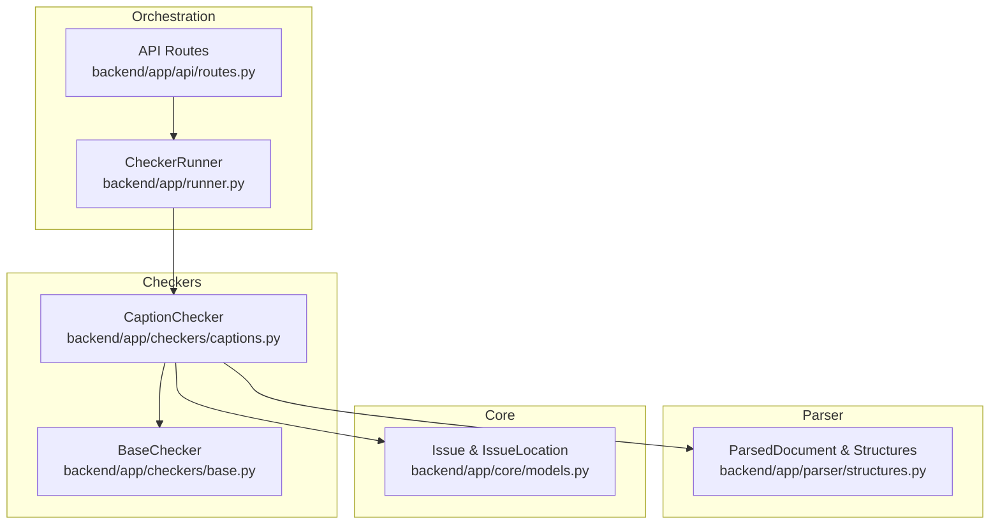
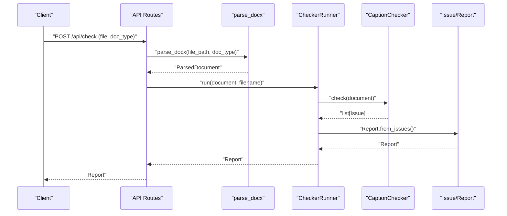
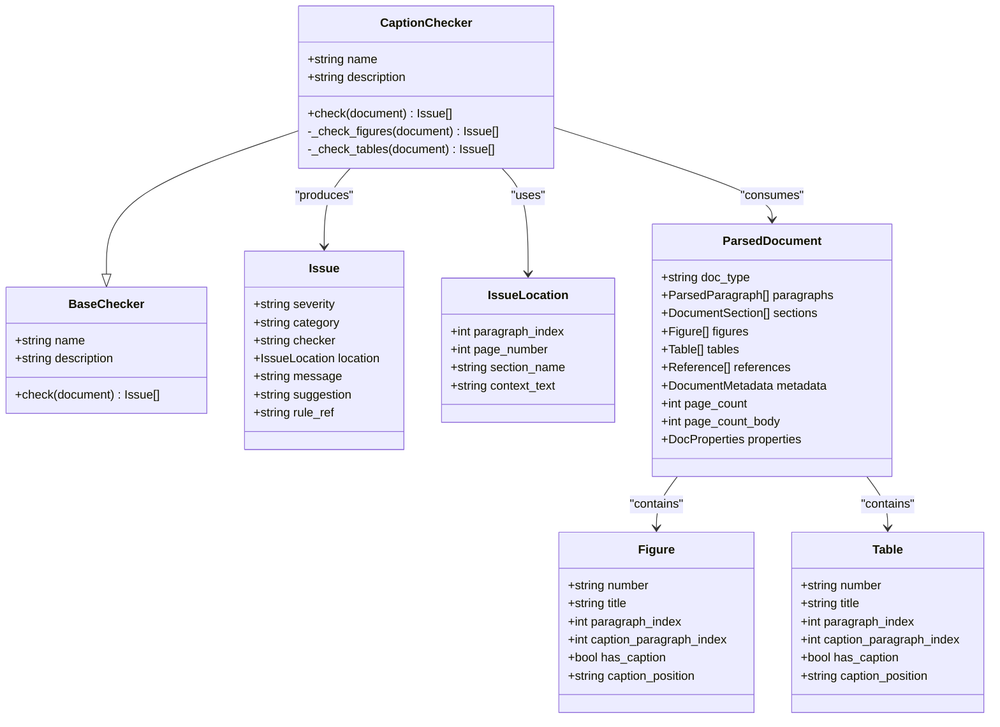
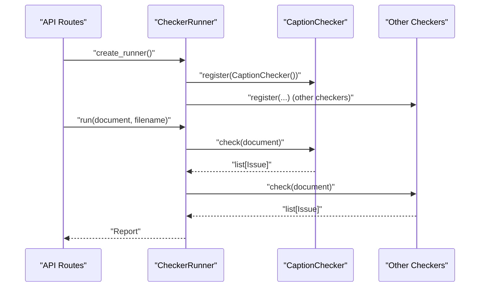
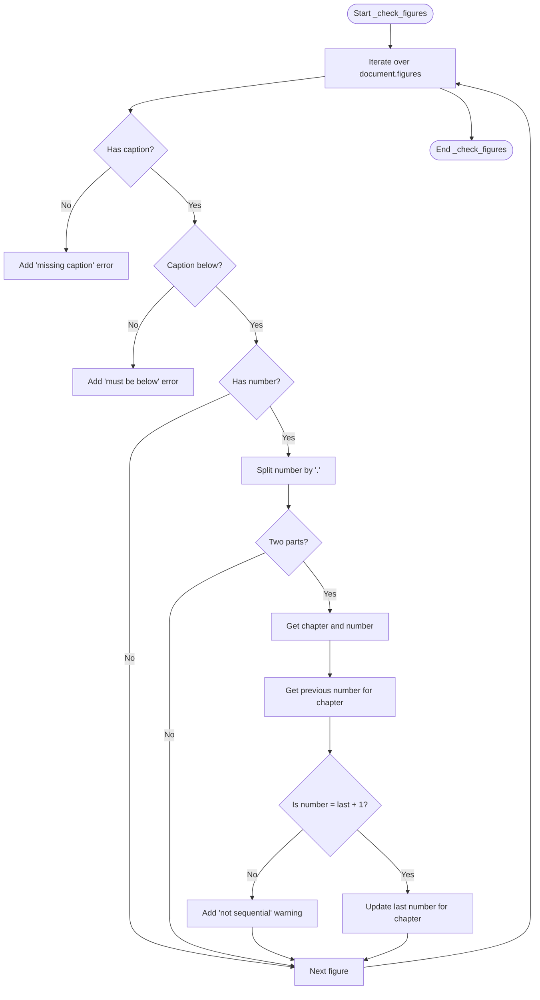
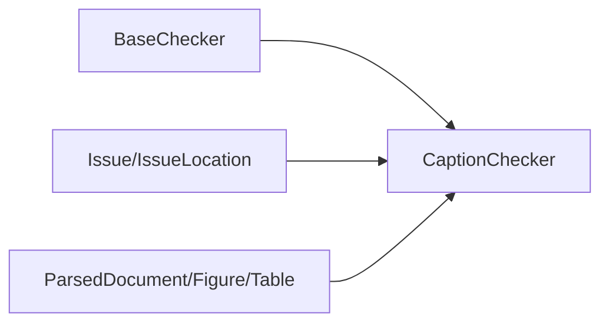

# Caption Checker

<cite>
**Referenced Files in This Document**
- [captions.py](file://backend/app/checkers/captions.py)
- [base.py](file://backend/app/checkers/base.py)
- [models.py](file://backend/app/core/models.py)
- [structures.py](file://backend/app/parser/structures.py)
- [routes.py](file://backend/app/api/routes.py)
- [runner.py](file://backend/app/runner.py)
- [test_captions.py](file://backend/tests/test_captions.py)
- [design.md](file://docs/design.md)
- [plan.md](file://docs/plan.md)
</cite>

## Table of Contents
1. [Introduction](#introduction)
2. [Project Structure](#project-structure)
3. [Core Components](#core-components)
4. [Architecture Overview](#architecture-overview)
5. [Detailed Component Analysis](#detailed-component-analysis)
6. [Dependency Analysis](#dependency-analysis)
7. [Performance Considerations](#performance-considerations)
8. [Troubleshooting Guide](#troubleshooting-guide)
9. [Conclusion](#conclusion)

## Introduction
This document describes the CaptionChecker implementation that validates figure and table captions according to GOST 7.32-2017 standards. It explains how the checker enforces caption numbering, placement, and cross-reference rules, and how it integrates with the parsed document structures. The documentation covers the checking algorithms for caption consistency, sequential numbering, and reference accuracy, and provides examples of common caption issues such as broken references, incorrect numbering, and formatting errors.

## Project Structure
The CaptionChecker resides in the backend application under the checkers module and interacts with the parsed document structures and the reporting framework. The key components are:
- CaptionChecker: Implements caption validation logic
- ParsedDocument and related structures: Provide parsed document data
- Issue and IssueLocation: Define the reporting model
- CheckerRunner: Orchestrates execution of all checkers
- API routes: Integrate the checker into the service pipeline

**Diagram sources**
- [captions.py:1-108](file://backend/app/checkers/captions.py#L1-L108)
- [base.py:1-17](file://backend/app/checkers/base.py#L1-L17)
- [structures.py:1-89](file://backend/app/parser/structures.py#L1-L89)
- [models.py:1-58](file://backend/app/core/models.py#L1-L58)
- [runner.py:1-25](file://backend/app/runner.py#L1-L25)
- [routes.py:1-75](file://backend/app/api/routes.py#L1-L75)

**Section sources**
- [captions.py:1-108](file://backend/app/checkers/captions.py#L1-L108)
- [structures.py:1-89](file://backend/app/parser/structures.py#L1-L89)
- [models.py:1-58](file://backend/app/core/models.py#L1-L58)
- [runner.py:1-25](file://backend/app/runner.py#L1-L25)
- [routes.py:1-75](file://backend/app/api/routes.py#L1-L75)

## Core Components
- CaptionChecker: Validates figure and table captions per GOST 7.32-2017, focusing on presence, placement, and numbering consistency.
- ParsedDocument and structures: Provide typed data about figures and tables, including numbering, positions, and presence of captions.
- Issue and IssueLocation: Standardized reporting model for captured issues with severity, category, and rule references.
- BaseChecker: Defines the checker interface contract for all validators.
- CheckerRunner: Executes all registered checkers and aggregates results into a Report.

Key validation areas:
- Presence: Missing captions for detected figures/tables
- Placement: Figure captions must be below; table captions must be above
- Numbering: Sequential numbering within chapters for figures

**Section sources**
- [captions.py:8-16](file://backend/app/checkers/captions.py#L8-L16)
- [structures.py:32-49](file://backend/app/parser/structures.py#L32-L49)
- [models.py:18-26](file://backend/app/core/models.py#L18-L26)
- [base.py:9-17](file://backend/app/checkers/base.py#L9-L17)

## Architecture Overview
The CaptionChecker participates in the checker orchestration pipeline. The API receives a DOCX file, parses it into a ParsedDocument, runs all registered checkers via CheckerRunner, and returns a Report containing all issues.

**Diagram sources**
- [routes.py:36-67](file://backend/app/api/routes.py#L36-L67)
- [runner.py:15-24](file://backend/app/runner.py#L15-L24)
- [captions.py:12-16](file://backend/app/checkers/captions.py#L12-L16)
- [models.py:29-57](file://backend/app/core/models.py#L29-L57)

## Detailed Component Analysis

### CaptionChecker Implementation
The CaptionChecker enforces GOST 7.32-2017 rules for captions:
- Figures: Must have a caption below the figure; numbering must be sequential within chapters
- Tables: Must have a caption above the table

**Diagram sources**
- [captions.py:8-108](file://backend/app/checkers/captions.py#L8-L108)
- [base.py:9-17](file://backend/app/checkers/base.py#L9-L17)
- [models.py:18-26](file://backend/app/core/models.py#L18-L26)
- [structures.py:32-89](file://backend/app/parser/structures.py#L32-L89)

Validation logic highlights:
- Missing captions: Emits an error with suggestions aligned to GOST 7.32-2017
- Incorrect placement: Enforces figure captions below and table captions above
- Sequential numbering: Tracks chapter-based numbering and warns on gaps

**Section sources**
- [captions.py:18-73](file://backend/app/checkers/captions.py#L18-L73)
- [captions.py:75-107](file://backend/app/checkers/captions.py#L75-L107)

### Data Structures for Captions
The parser provides typed structures that the CaptionChecker consumes:
- Figure: includes numbering, title, paragraph indices, caption presence, and caption position
- Table: mirrors Figure with caption presence and position
- ParsedDocument: aggregates figures and tables along with other document metadata

These structures enable precise issue reporting with locations and context.

**Section sources**
- [structures.py:32-49](file://backend/app/parser/structures.py#L32-L49)
- [structures.py:78-89](file://backend/app/parser/structures.py#L78-L89)

### Integration with Checker Orchestration
The CaptionChecker is registered with the CheckerRunner alongside other checkers. The API route handler creates a runner, registers all checkers, and executes them in order.

**Diagram sources**
- [routes.py:21-28](file://backend/app/api/routes.py#L21-L28)
- [runner.py:8-24](file://backend/app/runner.py#L8-L24)
- [captions.py:12-16](file://backend/app/checkers/captions.py#L12-L16)

**Section sources**
- [routes.py:21-28](file://backend/app/api/routes.py#L21-L28)
- [runner.py:8-24](file://backend/app/runner.py#L8-L24)

### Validation Rules and Cross-References
The CaptionChecker references GOST 7.32-2017 sections for figure and table captions:
- Figure captions: Section 6.5
- Table captions: Section 6.6

These references are included in reported issues to align enforcement with the standard.

**Section sources**
- [captions.py:34](file://backend/app/checkers/captions.py#L34)
- [captions.py:89](file://backend/app/checkers/captions.py#L89)

### Checking Algorithms
- Presence validation: Iterates over figures/tables and reports missing captions
- Placement validation: Checks caption_position and emits errors when misaligned with GOST requirements
- Sequential numbering: Maintains a map of last seen number per chapter and warns on non-sequential entries

**Diagram sources**
- [captions.py:18-73](file://backend/app/checkers/captions.py#L18-L73)

**Section sources**
- [captions.py:18-73](file://backend/app/checkers/captions.py#L18-L73)

### Common Caption Issues and Examples
Common issues validated by the CaptionChecker include:
- Missing captions for figures/tables
- Incorrect caption placement (figure caption above or table caption below)
- Non-sequential numbering within chapters for figures

The test suite demonstrates these scenarios and ensures the checker produces the expected issues.

**Section sources**
- [test_captions.py:13-26](file://backend/tests/test_captions.py#L13-L26)
- [test_captions.py:27-36](file://backend/tests/test_captions.py#L27-L36)
- [test_captions.py:37-46](file://backend/tests/test_captions.py#L37-L46)
- [test_captions.py:47-55](file://backend/tests/test_captions.py#L47-L55)
- [test_captions.py:57-66](file://backend/tests/test_captions.py#L57-L66)

## Dependency Analysis
The CaptionChecker depends on:
- BaseChecker for the checker interface
- Issue and IssueLocation for reporting
- ParsedDocument structures for input data
- No external libraries are imported, keeping dependencies minimal

**Diagram sources**
- [captions.py:3-5](file://backend/app/checkers/captions.py#L3-L5)
- [base.py:9-17](file://backend/app/checkers/base.py#L9-L17)
- [models.py:18-26](file://backend/app/core/models.py#L18-L26)
- [structures.py:32-89](file://backend/app/parser/structures.py#L32-L89)

**Section sources**
- [captions.py:3-5](file://backend/app/checkers/captions.py#L3-L5)
- [base.py:9-17](file://backend/app/checkers/base.py#L9-L17)
- [models.py:18-26](file://backend/app/core/models.py#L18-L26)
- [structures.py:32-89](file://backend/app/parser/structures.py#L32-L89)

## Performance Considerations
- Complexity: O(n) over the number of figures and tables, with constant-time operations per item
- Memory: Minimal, storing only a small dictionary for chapter-based numbering
- Scalability: The checker scales linearly with document size; no heavy computations are performed

## Troubleshooting Guide
- Missing captions: Ensure figures/tables have captions and that has_caption is set appropriately in the parsed structures
- Incorrect placement: Verify caption_position is set correctly ("below" for figures, "above" for tables)
- Non-sequential numbering: Ensure chapter-based numbering increments by 1 within each chapter

Integration tips:
- Confirm that the CaptionChecker is registered with the CheckerRunner
- Validate that the API route invokes the runner and returns a Report

**Section sources**
- [routes.py:21-28](file://backend/app/api/routes.py#L21-L28)
- [runner.py:8-24](file://backend/app/runner.py#L8-L24)
- [test_captions.py:13-26](file://backend/tests/test_captions.py#L13-L26)

## Conclusion
The CaptionChecker provides targeted validation of figure and table captions according to GOST 7.32-2017, focusing on presence, placement, and sequential numbering. It integrates seamlessly into the checker orchestration pipeline and produces standardized issues with rule references. The implementation is straightforward, efficient, and easily extensible for future enhancements.