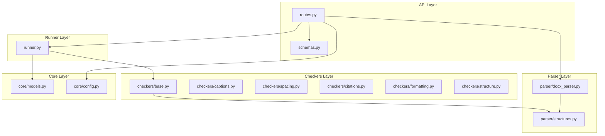
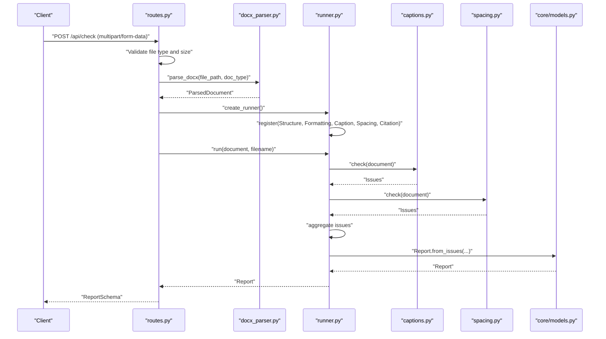
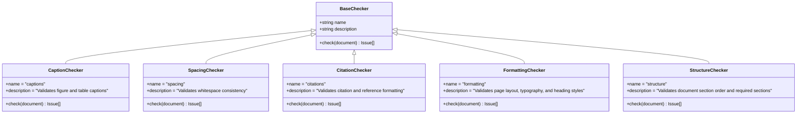
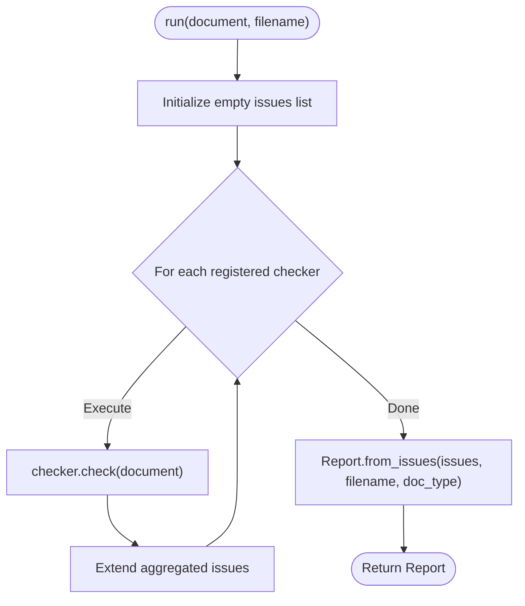
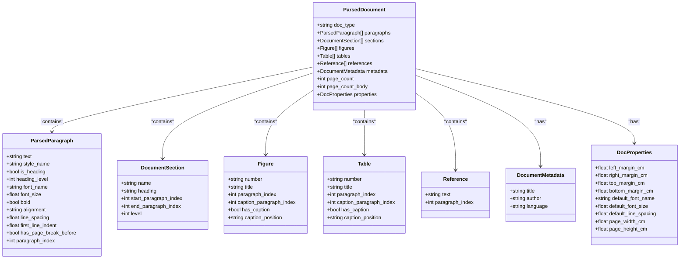
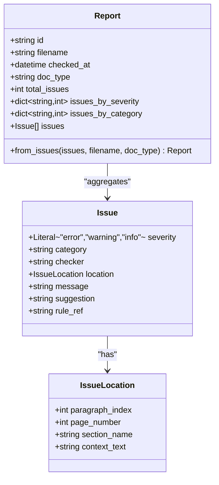
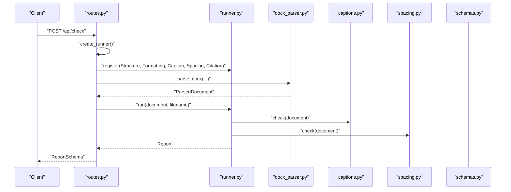
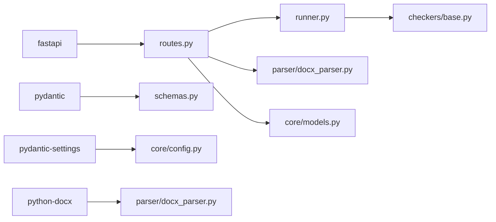

# Checker System Overview

<cite>
**Referenced Files in This Document**
- [backend/app/checkers/base.py](file://backend/app/checkers/base.py)
- [backend/app/runner.py](file://backend/app/runner.py)
- [backend/app/checkers/captions.py](file://backend/app/checkers/captions.py)
- [backend/app/checkers/spacing.py](file://backend/app/checkers/spacing.py)
- [backend/app/checkers/citations.py](file://backend/app/checkers/citations.py)
- [backend/app/checkers/formatting.py](file://backend/app/checkers/formatting.py)
- [backend/app/checkers/structure.py](file://backend/app/checkers/structure.py)
- [backend/app/core/models.py](file://backend/app/core/models.py)
- [backend/app/parser/structures.py](file://backend/app/parser/structures.py)
- [backend/app/parser/docx_parser.py](file://backend/app/parser/docx_parser.py)
- [backend/app/api/routes.py](file://backend/app/api/routes.py)
- [backend/app/api/schemas.py](file://backend/app/api/schemas.py)
- [backend/app/core/config.py](file://backend/app/core/config.py)
- [backend/app/main.py](file://backend/app/main.py)
- [backend/pyproject.toml](file://backend/pyproject.toml)
</cite>

## Table of Contents
1. [Introduction](#introduction)
2. [Project Structure](#project-structure)
3. [Core Components](#core-components)
4. [Architecture Overview](#architecture-overview)
5. [Detailed Component Analysis](#detailed-component-analysis)
6. [Dependency Analysis](#dependency-analysis)
7. [Performance Considerations](#performance-considerations)
8. [Troubleshooting Guide](#troubleshooting-guide)
9. [Conclusion](#conclusion)
10. [Appendices](#appendices)

## Introduction
This document describes the Dissertation Checker system architecture with a focus on the plugin-based checker framework. The system is designed around an abstract BaseChecker interface and a strategy pattern that enables modular, extensible validation logic. A central CheckerRunner orchestrates the registration and execution of individual checkers, aggregates results into a unified Report, and integrates with the parsing layer to transform raw DOCX content into a structured ParsedDocument. The API layer exposes endpoints to upload documents, trigger checks, and retrieve reports. This document also covers the checker contract (input/output formats, error handling), factory-like instantiation via registration, and extensibility mechanisms for adding new checker types.

## Project Structure
The backend is organized into distinct layers:
- API: FastAPI endpoints and request/response schemas
- Runner: Central orchestration of checkers
- Checkers: Pluggable validator implementations
- Parser: DOCX parsing and structured data representation
- Core: Domain models and configuration

**Diagram sources**
- [backend/app/api/routes.py:1-75](file://backend/app/api/routes.py#L1-L75)
- [backend/app/api/schemas.py:1-38](file://backend/app/api/schemas.py#L1-L38)
- [backend/app/runner.py:1-25](file://backend/app/runner.py#L1-L25)
- [backend/app/checkers/base.py:1-17](file://backend/app/checkers/base.py#L1-L17)
- [backend/app/checkers/captions.py:1-108](file://backend/app/checkers/captions.py#L1-L108)
- [backend/app/checkers/spacing.py:1-136](file://backend/app/checkers/spacing.py#L1-L136)
- [backend/app/checkers/citations.py:1-11](file://backend/app/checkers/citations.py#L1-L11)
- [backend/app/checkers/formatting.py:1-11](file://backend/app/checkers/formatting.py#L1-L11)
- [backend/app/checkers/structure.py:1-11](file://backend/app/checkers/structure.py#L1-L11)
- [backend/app/parser/docx_parser.py:1-8](file://backend/app/parser/docx_parser.py#L1-L8)
- [backend/app/parser/structures.py:1-89](file://backend/app/parser/structures.py#L1-L89)
- [backend/app/core/models.py:1-58](file://backend/app/core/models.py#L1-L58)
- [backend/app/core/config.py:1-17](file://backend/app/core/config.py#L1-L17)

**Section sources**
- [backend/app/api/routes.py:1-75](file://backend/app/api/routes.py#L1-L75)
- [backend/app/runner.py:1-25](file://backend/app/runner.py#L1-L25)
- [backend/app/checkers/base.py:1-17](file://backend/app/checkers/base.py#L1-L17)
- [backend/app/parser/structures.py:1-89](file://backend/app/parser/structures.py#L1-L89)
- [backend/app/core/models.py:1-58](file://backend/app/core/models.py#L1-L58)
- [backend/app/core/config.py:1-17](file://backend/app/core/config.py#L1-L17)

## Core Components
- BaseChecker: Defines the checker contract with a name, description, and a check method that accepts a ParsedDocument and returns a list of Issue objects.
- CheckerRunner: Manages a registry of BaseChecker instances, executes them in sequence, and produces a Report aggregating all issues.
- ParsedDocument and related structures: Provide the typed input data model consumed by checkers.
- Issue and Report: Define the output contract and summary statistics.
- API routes: Orchestrate parsing, checker instantiation, execution, and response serialization.

Key responsibilities:
- BaseChecker enforces a uniform interface for all validators.
- CheckerRunner ensures deterministic execution order and result consolidation.
- Parser transforms uploaded DOCX files into a structured representation.
- API layer handles uploads, validation, temporary file management, and error propagation.

**Section sources**
- [backend/app/checkers/base.py:9-17](file://backend/app/checkers/base.py#L9-L17)
- [backend/app/runner.py:8-25](file://backend/app/runner.py#L8-L25)
- [backend/app/parser/structures.py:77-89](file://backend/app/parser/structures.py#L77-L89)
- [backend/app/core/models.py:9-58](file://backend/app/core/models.py#L9-L58)
- [backend/app/api/routes.py:21-68](file://backend/app/api/routes.py#L21-L68)

## Architecture Overview
The system follows a layered architecture:
- Presentation: FastAPI routes expose endpoints for health checks, document checking, and report retrieval.
- Application: CheckerRunner coordinates checker execution.
- Domain: BaseChecker defines the contract; Issue and Report define outputs.
- Infrastructure: Parser converts DOCX to ParsedDocument; configuration controls runtime behavior.

**Diagram sources**
- [backend/app/api/routes.py:36-68](file://backend/app/api/routes.py#L36-L68)
- [backend/app/parser/docx_parser.py:5-8](file://backend/app/parser/docx_parser.py#L5-L8)
- [backend/app/runner.py:15-25](file://backend/app/runner.py#L15-L25)
- [backend/app/checkers/captions.py:12-16](file://backend/app/checkers/captions.py#L12-L16)
- [backend/app/checkers/spacing.py:17-24](file://backend/app/checkers/spacing.py#L17-L24)
- [backend/app/core/models.py:39-58](file://backend/app/core/models.py#L39-L58)

## Detailed Component Analysis

### BaseChecker and Strategy Pattern
The BaseChecker abstract interface establishes a uniform contract for all checkers. Each concrete checker implements the check method to scan a ParsedDocument and produce a list of Issue objects. This design realizes the strategy pattern, enabling interchangeable validation logic while maintaining a consistent execution model.

**Diagram sources**
- [backend/app/checkers/base.py:9-17](file://backend/app/checkers/base.py#L9-L17)
- [backend/app/checkers/captions.py:8-16](file://backend/app/checkers/captions.py#L8-L16)
- [backend/app/checkers/spacing.py:13-24](file://backend/app/checkers/spacing.py#L13-L24)
- [backend/app/checkers/citations.py:5-11](file://backend/app/checkers/citations.py#L5-L11)
- [backend/app/checkers/formatting.py:5-11](file://backend/app/checkers/formatting.py#L5-L11)
- [backend/app/checkers/structure.py:5-11](file://backend/app/checkers/structure.py#L5-L11)

**Section sources**
- [backend/app/checkers/base.py:9-17](file://backend/app/checkers/base.py#L9-L17)
- [backend/app/checkers/captions.py:8-16](file://backend/app/checkers/captions.py#L8-L16)
- [backend/app/checkers/spacing.py:13-24](file://backend/app/checkers/spacing.py#L13-L24)
- [backend/app/checkers/citations.py:5-11](file://backend/app/checkers/citations.py#L5-L11)
- [backend/app/checkers/formatting.py:5-11](file://backend/app/checkers/formatting.py#L5-L11)
- [backend/app/checkers/structure.py:5-11](file://backend/app/checkers/structure.py#L5-L11)

### CheckerRunner: Registration, Execution, Aggregation
The CheckerRunner maintains a registry of BaseChecker instances and executes them sequentially against a ParsedDocument. It aggregates all issues into a single list and constructs a Report using a static factory method that computes severity and category counts.

**Diagram sources**
- [backend/app/runner.py:15-25](file://backend/app/runner.py#L15-L25)
- [backend/app/core/models.py:39-58](file://backend/app/core/models.py#L39-L58)

**Section sources**
- [backend/app/runner.py:8-25](file://backend/app/runner.py#L8-L25)
- [backend/app/core/models.py:28-58](file://backend/app/core/models.py#L28-L58)

### Parser and Data Model Contract
The parser produces a ParsedDocument containing typed collections for paragraphs, sections, figures, tables, references, metadata, and page properties. Checkers consume this structure to locate and validate content according to domain rules.

**Diagram sources**
- [backend/app/parser/structures.py:6-89](file://backend/app/parser/structures.py#L6-L89)

**Section sources**
- [backend/app/parser/structures.py:77-89](file://backend/app/parser/structures.py#L77-L89)

### Issue and Report Contracts
Issue captures validation outcomes with severity, category, checker identity, precise location, message, suggestion, and optional rule reference. Report aggregates issues with computed totals and counts by severity and category, and includes metadata such as filename and document type.

**Diagram sources**
- [backend/app/core/models.py:9-58](file://backend/app/core/models.py#L9-L58)

**Section sources**
- [backend/app/core/models.py:17-58](file://backend/app/core/models.py#L17-L58)

### API Integration and Factory-like Instantiation
The API layer registers concrete checker instances with the Runner during endpoint execution. This serves as a factory-like mechanism to assemble the desired set of validations for each request. The endpoint parses the DOCX, runs the checkers, and returns a serialized Report.

**Diagram sources**
- [backend/app/api/routes.py:21-68](file://backend/app/api/routes.py#L21-L68)
- [backend/app/runner.py:15-25](file://backend/app/runner.py#L15-L25)
- [backend/app/parser/docx_parser.py:5-8](file://backend/app/parser/docx_parser.py#L5-L8)
- [backend/app/api/schemas.py:25-38](file://backend/app/api/schemas.py#L25-L38)

**Section sources**
- [backend/app/api/routes.py:21-68](file://backend/app/api/routes.py#L21-L68)
- [backend/app/api/schemas.py:25-38](file://backend/app/api/schemas.py#L25-L38)

### Extensibility Mechanisms
Adding a new checker involves:
- Creating a new subclass of BaseChecker with a unique name and description.
- Implementing the check method to scan ParsedDocument and return Issue objects.
- Registering the new checker instance in the Runner factory within the API layer.

This approach leverages the strategy pattern and centralized registration to maintain loose coupling and high cohesion.

**Section sources**
- [backend/app/checkers/base.py:9-17](file://backend/app/checkers/base.py#L9-L17)
- [backend/app/api/routes.py:21-28](file://backend/app/api/routes.py#L21-L28)

## Dependency Analysis
External dependencies include FastAPI for routing, python-docx for DOCX processing, Pydantic for schemas, and pydantic-settings for configuration. Internal dependencies form a clean separation of concerns across layers.

**Diagram sources**
- [backend/pyproject.toml:5-12](file://backend/pyproject.toml#L5-L12)
- [backend/app/api/routes.py:3-12](file://backend/app/api/routes.py#L3-L12)
- [backend/app/parser/docx_parser.py:1-8](file://backend/app/parser/docx_parser.py#L1-L8)
- [backend/app/core/config.py:1-17](file://backend/app/core/config.py#L1-L17)
- [backend/app/api/schemas.py:1-38](file://backend/app/api/schemas.py#L1-L38)
- [backend/app/runner.py:1-25](file://backend/app/runner.py#L1-L25)
- [backend/app/checkers/base.py:1-17](file://backend/app/checkers/base.py#L1-L17)
- [backend/app/core/models.py:1-58](file://backend/app/core/models.py#L1-L58)

**Section sources**
- [backend/pyproject.toml:1-29](file://backend/pyproject.toml#L1-L29)

## Performance Considerations
- Execution order: CheckerRunner iterates through registered checkers sequentially. Keep the number of checkers reasonable to avoid linear overhead.
- Memory management: Temporary files are created for uploads; ensure cleanup occurs after processing to prevent disk accumulation.
- Parsing cost: DOCX parsing is delegated to the parser module; optimize by limiting unnecessary transformations and reusing parsed structures.
- Scalability: The current design is synchronous. For concurrency, consider asynchronous execution per checker or batched processing with worker pools.
- Caching: Introduce caching for repeated reports or expensive computations where applicable.
- Streaming: For very large documents, consider streaming or chunked processing to reduce peak memory usage.

[No sources needed since this section provides general guidance]

## Troubleshooting Guide
Common issues and resolutions:
- File type errors: Only .docx uploads are accepted; ensure clients send the correct format.
- File size limits: Exceeding configured maximum upload size triggers an error; adjust settings if needed.
- Parsing failures: Exceptions during parsing are caught and surfaced as HTTP 422; verify DOCX integrity and parser implementation.
- Temporary file cleanup: Ensure temporary files are removed after processing to avoid disk pressure.
- Report retrieval: Reports are stored in-memory; implement persistence for production deployments.

**Section sources**
- [backend/app/api/routes.py:41-50](file://backend/app/api/routes.py#L41-L50)
- [backend/app/api/routes.py:63-67](file://backend/app/api/routes.py#L63-L67)
- [backend/app/api/routes.py:71-74](file://backend/app/api/routes.py#L71-L74)

## Conclusion
The Dissertation Checker system employs a clean, extensible architecture centered on the BaseChecker interface and the strategy pattern. The CheckerRunner provides deterministic execution and unified reporting, while the parser supplies a robust, typed data model for validators. The API layer offers a straightforward integration point for clients and supports easy addition of new checkers through registration. With careful attention to performance, memory management, and scalability, the system can evolve to support broader validation domains and higher throughput workloads.

## Appendices
- Configuration: Tune CORS origins, upload size limits, and temporary directory via settings.
- Testing: Unit tests for individual checkers and integration tests for the full pipeline are recommended.

**Section sources**
- [backend/app/core/config.py:6-17](file://backend/app/core/config.py#L6-L17)
- [backend/app/main.py:1-20](file://backend/app/main.py#L1-L20)