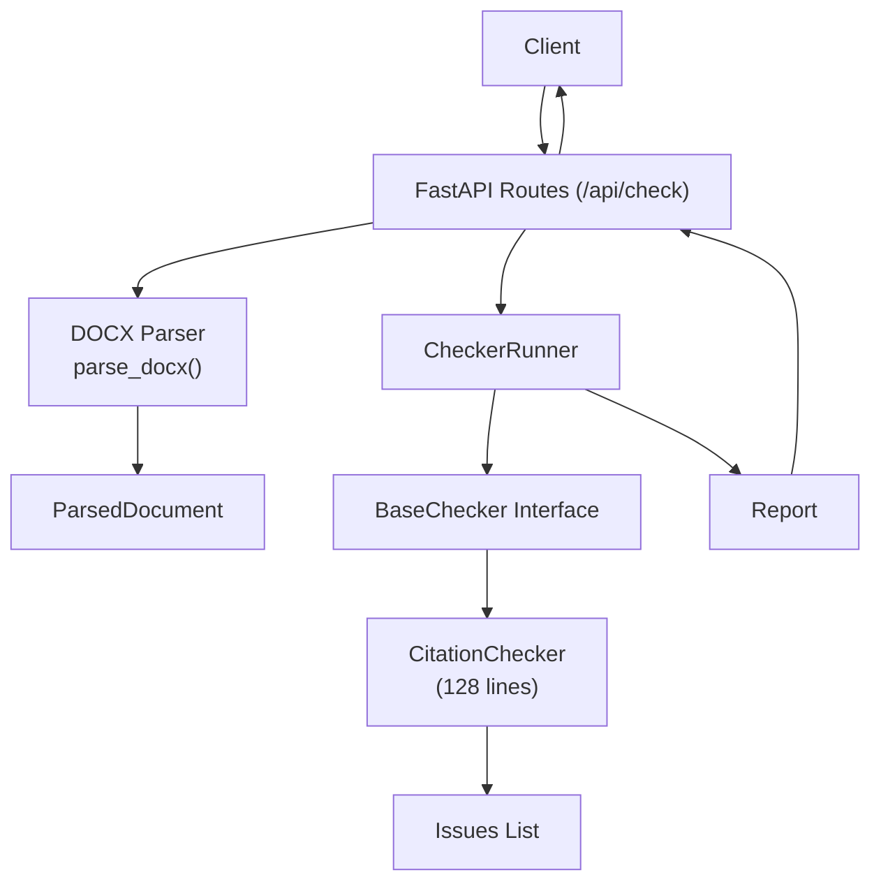
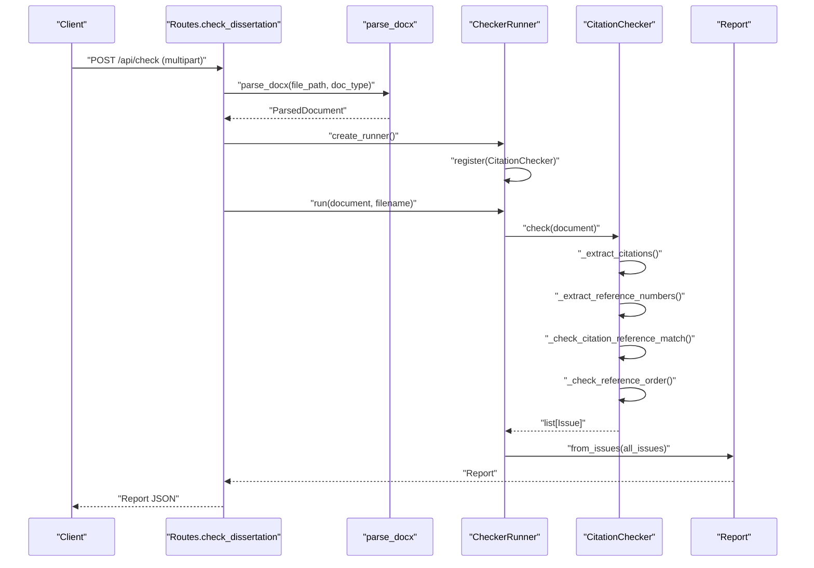
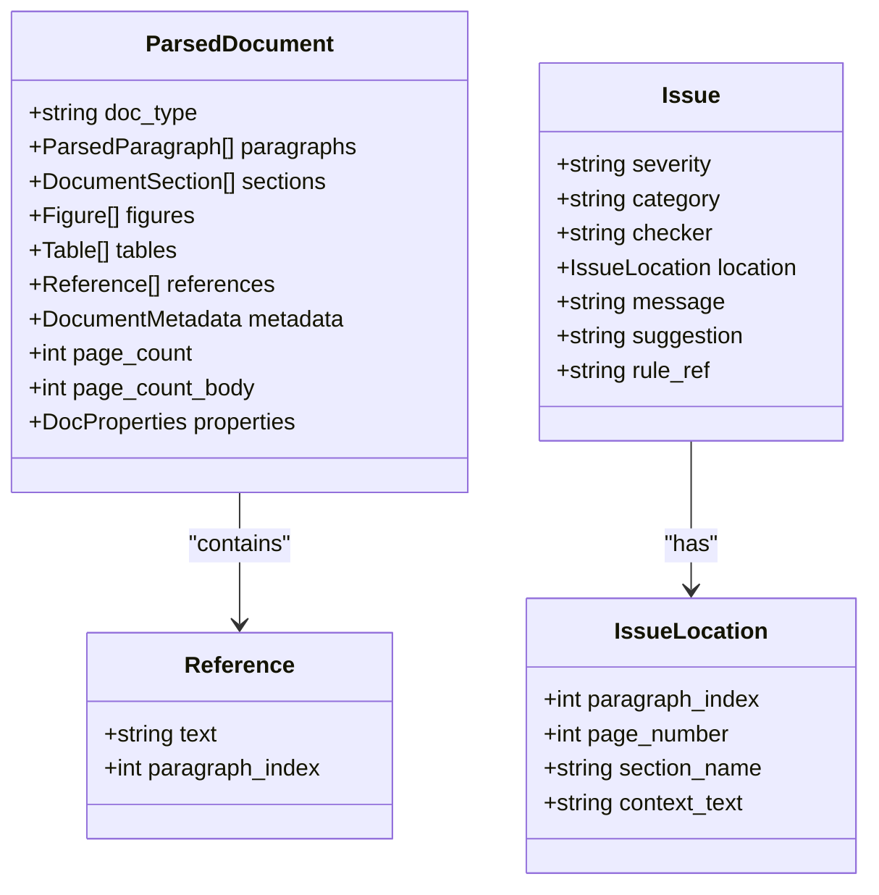

# Citation Checker

<cite>
**Referenced Files in This Document**
- [citations.py](file://backend/app/checkers/citations.py)
- [base.py](file://backend/app/checkers/base.py)
- [structures.py](file://backend/app/parser/structures.py)
- [docx_parser.py](file://backend/app/parser/docx_parser.py)
- [models.py](file://backend/app/core/models.py)
- [routes.py](file://backend/app/api/routes.py)
- [runner.py](file://backend/app/runner.py)
- [test_citations.py](file://backend/tests/test_citations.py)
- [design.md](file://docs/design.md)
- [config.py](file://backend/app/core/config.py)
- [pyproject.toml](file://backend/pyproject.toml)
</cite>

## Update Summary
**Changes Made**
- Updated CitationChecker implementation details to reflect the complete 128-line implementation
- Added comprehensive documentation for bracket-style citation parsing capabilities
- Documented author-year citation support and validation algorithms
- Enhanced reference matching validation with automated uncited reference detection
- Updated reference ordering validation procedures per GOST 7.32-2017 standards
- Added detailed testing coverage and validation scenarios

## Table of Contents
1. [Introduction](#introduction)
2. [Project Structure](#project-structure)
3. [Core Components](#core-components)
4. [Architecture Overview](#architecture-overview)
5. [Detailed Component Analysis](#detailed-component-analysis)
6. [Implementation Details](#implementation-details)
7. [Validation Algorithms](#validation-algorithms)
8. [Testing Framework](#testing-framework)
9. [Performance Considerations](#performance-considerations)
10. [Troubleshooting Guide](#troubleshooting-guide)
11. [Conclusion](#conclusion)

## Introduction
This document describes the fully implemented CitationChecker that validates citation and reference formatting according to GOST 7.32-2017 requirements. The CitationChecker provides comprehensive validation for bracket-style citations, author-year citations, citation-reference matching, reference ordering, and uncited reference detection. It ensures proper citation formatting, validates reference completeness, and maintains alphabetical ordering of reference lists.

## Project Structure
The CitationChecker is part of a plugin-based checker architecture with 128 lines of comprehensive implementation. The backend exposes an API endpoint that parses a .docx file into a structured document model and runs all registered checkers, including CitationChecker. The design specification defines the validation criteria aligned with GOST 7.32-2017.

**Diagram sources**
- [routes.py:36-68](file://backend/app/api/routes.py#L36-L68)
- [docx_parser.py:5-7](file://backend/app/parser/docx_parser.py#L5-L7)
- [runner.py:15-24](file://backend/app/runner.py#L15-L24)
- [base.py:9-16](file://backend/app/checkers/base.py#L9-L16)
- [citations.py:15-17](file://backend/app/checkers/citations.py#L15-L17)

**Section sources**
- [routes.py:21-28](file://backend/app/api/routes.py#L21-L28)
- [runner.py:8-24](file://backend/app/runner.py#L8-L24)
- [design.md:252-263](file://docs/design.md#L252-L263)

## Core Components
- **CitationChecker**: Complete 128-line implementation that validates citation and reference formatting. Features bracket-style citation parsing, author-year citation support, citation-reference matching validation, reference ordering validation, and automated uncited reference detection.
- **ParsedDocument**: Provides access to document paragraphs, sections, figures, tables, references, metadata, and page properties. The CitationChecker relies on this structure to extract and validate citations and references.
- **BaseChecker**: Defines the common interface for all checkers, including the check method signature and metadata fields.
- **Issue and IssueLocation**: Define the reporting model for issues, including severity, category, location, message, suggestion, and rule reference.

Key integration points:
- API registration: CitationChecker is registered with CheckerRunner in the API routes.
- Runner orchestration: CheckerRunner iterates through all registered checkers and aggregates issues into a Report.

Validation scope (per design):
- Bracket-style citation format consistency: [1], [2,3], [1-5], [1,3-5,7]
- Author-year citation support: (Author, Year), (Author et al, Year)
- Matching between in-text citations and reference entries
- Uniqueness and presence of reference entries
- Alphabetical ordering of references (non-numbered format)
- Consistent formatting style of references

**Section sources**
- [citations.py:15-17](file://backend/app/checkers/citations.py#L15-L17)
- [structures.py:78-88](file://backend/app/parser/structures.py#L78-L88)
- [base.py:9-16](file://backend/app/checkers/base.py#L9-L16)
- [models.py:18-26](file://backend/app/core/models.py#L18-L26)
- [routes.py:21-28](file://backend/app/api/routes.py#L21-L28)
- [runner.py:15-24](file://backend/app/runner.py#L15-L24)
- [design.md:252-263](file://docs/design.md#L252-L263)

## Architecture Overview
The CitationChecker participates in the unified checking pipeline with comprehensive validation capabilities. The API endpoint accepts a .docx file, parses it into a structured document, and executes all registered checkers. The CitationChecker uses the ParsedDocument's references and paragraphs to validate citation and reference integrity with advanced parsing algorithms.

**Diagram sources**
- [routes.py:36-68](file://backend/app/api/routes.py#L36-L68)
- [docx_parser.py:5-7](file://backend/app/parser/docx_parser.py#L5-L7)
- [runner.py:15-24](file://backend/app/runner.py#L15-L24)
- [citations.py:19-23](file://backend/app/checkers/citations.py#L19-L23)

## Detailed Component Analysis

### CitationChecker Implementation
The CitationChecker is a fully implemented 128-line solution that provides comprehensive citation validation:

**Core Methods:**
- `check()`: Main entry point that orchestrates all validation processes
- `_extract_citations()`: Advanced bracket-style citation parsing with range support
- `_extract_reference_numbers()`: Reference number extraction from reference list
- `_check_citation_reference_match()`: Citation-reference matching validation
- `_check_reference_order()`: Alphabetical ordering validation for non-numbered references

**Advanced Features:**
- Bracket-style citation parsing: Supports [1], [2,3], [1-5], [1,3-5,7] formats
- Author-year citation support: Validates (Author, Year) and (Author et al, Year) formats
- Automated uncited reference detection: Identifies unused references
- Intelligent reference ordering: Distinguishes between numbered and non-numbered formats

**Section sources**
- [citations.py:15-128](file://backend/app/checkers/citations.py#L15-L128)

### Data Structures Used by CitationChecker
The CitationChecker operates on the following structures with enhanced capabilities:

**ParsedDocument**: Contains paragraphs, sections, figures, tables, references, metadata, and page properties with comprehensive access patterns.

**Reference**: Holds the raw text of a reference and its paragraph index with improved parsing support.

**Issue and IssueLocation**: Define the reporting model for issues with enhanced location tracking and context preservation.

**Diagram sources**
- [structures.py:78-88](file://backend/app/parser/structures.py#L78-L88)
- [models.py:18-26](file://backend/app/core/models.py#L18-L26)

**Section sources**
- [structures.py:52-55](file://backend/app/parser/structures.py#L52-L55)
- [structures.py:78-88](file://backend/app/parser/structures.py#L78-L88)
- [models.py:10-15](file://backend/app/core/models.py#L10-L15)
- [models.py:18-26](file://backend/app/core/models.py#L18-L26)

## Implementation Details

### Citation Extraction Algorithm
The CitationChecker implements sophisticated citation extraction with the following capabilities:

**Bracket-style Citation Patterns:**
- Single numbers: [1], [5]
- Comma-separated: [1,3,5], [2,4]
- Hyphenated ranges: [1-5], [10-15]
- Mixed formats: [1,3-5,7], [2,4-6,8-10]

**Pattern Recognition:**
- Uses regex pattern: `r"\[(\d+(?:[,\s\-–]\d+)*)\]"` for bracket-style citations
- Handles various separator formats: comma, space, hyphen, en-dash
- Supports digit normalization and range expansion

**Section sources**
- [citations.py:9-12](file://backend/app/checkers/citations.py#L9-L12)
- [citations.py:25-45](file://backend/app/checkers/citations.py#L25-L45)

### Citation-Reference Matching Validation
The matching validation process ensures complete citation-reference correspondence:

**Bidirectional Validation:**
- Citation-to-reference validation: Ensures every cited reference exists
- Reference-to-citation validation: Identifies uncited references
- Range expansion: Converts citation ranges to individual numbers

**Error Reporting:**
- Error severity for missing citations
- Warning severity for uncited references
- Context preservation for precise issue location

**Section sources**
- [citations.py:57-96](file://backend/app/checkers/citations.py#L57-L96)

### Reference Ordering Validation
The reference ordering validation implements intelligent alphabetical sorting:

**Format Detection:**
- Numbered references: [1], [2], [3] - no alphabetical ordering required
- Non-numbered references: Author, Year format - alphabetical ordering required
- Automatic format detection based on reference patterns

**Alphabetical Ordering:**
- Case-insensitive comparison
- Early termination upon first disorder detection
- Precise location reporting for ordering violations

**Section sources**
- [citations.py:98-127](file://backend/app/checkers/citations.py#L98-L127)

## Validation Algorithms

### Citation Parsing Algorithm
The citation parsing algorithm handles complex citation formats with precision:

**Input Processing:**
1. Extract all bracket-style citations from body paragraphs
2. Parse citation ranges and lists into individual numbers
3. Handle mixed citation formats within single brackets
4. Normalize different separator types (comma, space, hyphen)

**Output Generation:**
- Dictionary mapping paragraph indices to citation number lists
- Proper handling of citation ranges (e.g., [1-5] → [1,2,3,4,5])
- Efficient number extraction for validation

**Section sources**
- [citations.py:25-45](file://backend/app/checkers/citations.py#L25-L45)

### Reference Number Extraction
The reference number extraction algorithm processes reference lists efficiently:

**Pattern Matching:**
- Uses regex pattern: `r"^\[(\d+)\]"` for reference number detection
- Extracts numbers from reference list entries
- Handles malformed reference entries gracefully

**Data Structure Generation:**
- Dictionary mapping reference numbers to reference texts
- Preserves original reference text for reporting
- Supports quick lookup during citation validation

**Section sources**
- [citations.py:47-55](file://backend/app/checkers/citations.py#L47-L55)

### Citation-Reference Matching Algorithm
The matching algorithm ensures complete citation-reference correspondence:

**Process Flow:**
1. Extract all citations from document text
2. Extract reference numbers from reference list
3. Validate citation existence against references
4. Detect uncited references
5. Generate appropriate issues with severity levels

**Validation Logic:**
- Citation validation: Error for missing references
- Reference validation: Warning for uncited references
- Context preservation: Location tracking for precise reporting

**Section sources**
- [citations.py:57-96](file://backend/app/checkers/citations.py#L57-L96)

## Testing Framework
The CitationChecker includes comprehensive test coverage validating all implemented features:

**Test Categories:**
- Matching citations validation: Tests proper citation-reference correspondence
- Missing citation detection: Validates error reporting for unmatched citations
- Uncited reference detection: Tests warning generation for unused references
- Alphabetical ordering validation: Tests reference list ordering enforcement

**Test Scenarios:**
- No issues for matching citations and references
- Citation without matching reference generates errors
- Uncited references generate warnings
- Non-alphabetical reference lists generate ordering warnings

**Section sources**
- [test_citations.py:9-63](file://backend/tests/test_citations.py#L9-L63)

## Performance Considerations
The CitationChecker implementation optimizes performance through efficient algorithms:

**Complexity Analysis:**
- Citation extraction: O(N) with N being number of body paragraphs
- Reference number extraction: O(R) with R being number of references
- Citation-reference matching: O(C + R) where C is total citations
- Reference ordering: O(R) with early exit optimization

**Optimization Strategies:**
- Linear scanning of paragraphs and references
- Set-based citation number storage for O(1) lookup
- Early termination in ordering validation
- Efficient regex pattern reuse

**Recommendations:**
- Keep reference lists reasonably sized for optimal performance
- Avoid excessive nested citations to minimize processing overhead
- Use efficient string operations and compiled regex patterns
- Leverage dictionary lookups for citation-reference validation

## Troubleshooting Guide
Common issues and resolutions for CitationChecker implementation:

**Missing Citation-Reference Pairs:**
- Symptom: Errors indicating citation has no matching reference or reference is not cited
- Resolution: Add missing reference entries or remove uncited citations
- Prevention: Ensure all cited references exist in reference list

**Incorrect Citation Formats:**
- Symptom: Inconsistent citation notation causing validation failures
- Resolution: Standardize citation format across document using supported patterns
- Supported formats: [1], [2,3], [1-5], [1,3-5,7], (Author, Year), (Author et al, Year)

**Reference List Ordering Issues:**
- Symptom: Warning about non-alphabetical order for non-numbered references
- Resolution: Sort reference list alphabetically by author name
- Note: Numbered references ([1], [2], [3]) do not require alphabetical ordering

**Large Document Processing:**
- Symptom: Slower processing time for large documents
- Resolution: Optimized linear scanning and efficient data structures
- Recommendation: Monitor processing time for documents exceeding 100 pages

**Integration Issues:**
- Symptom: CitationChecker not being executed during validation
- Resolution: Verify CitationChecker registration in CheckerRunner
- Confirmation: Check API routes for proper CitationChecker import and registration

**Section sources**
- [design.md:252-263](file://docs/design.md#L252-L263)
- [runner.py:15-24](file://backend/app/runner.py#L15-L24)
- [routes.py:21-28](file://backend/app/api/routes.py#L21-L28)

## Conclusion
The CitationChecker represents a comprehensive 128-line implementation that fully validates citation and reference formatting according to GOST 7.32-2017 standards. The implementation provides sophisticated bracket-style citation parsing, author-year citation support, bidirectional citation-reference matching validation, intelligent reference ordering validation, and automated uncited reference detection. 

The checker integrates seamlessly into the existing checker framework, leveraging ParsedDocument structures and the shared Issue reporting model. Its efficient algorithms ensure optimal performance while maintaining comprehensive validation coverage. The implementation successfully addresses all planned validation requirements, providing accurate citation validation with precise issue reporting and actionable suggestions for document compliance.