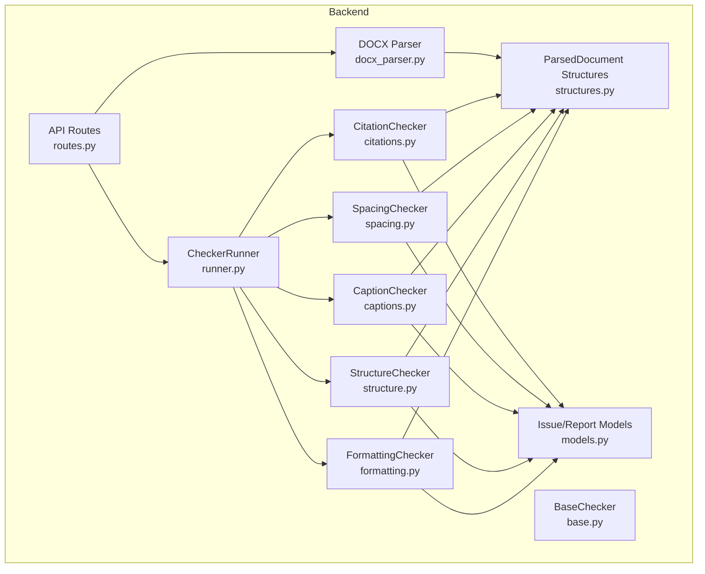
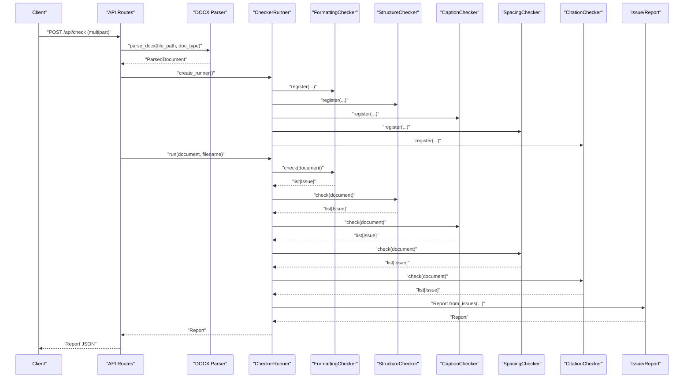
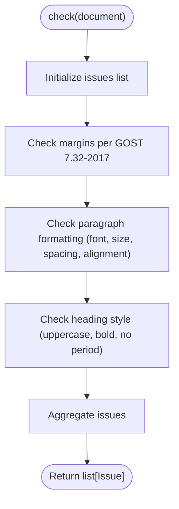
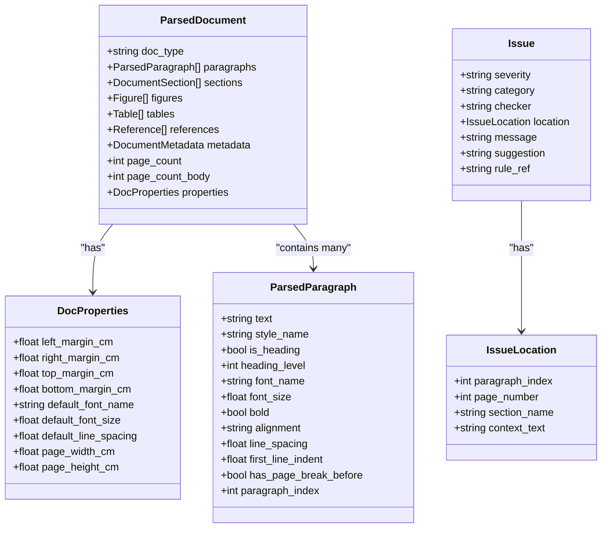
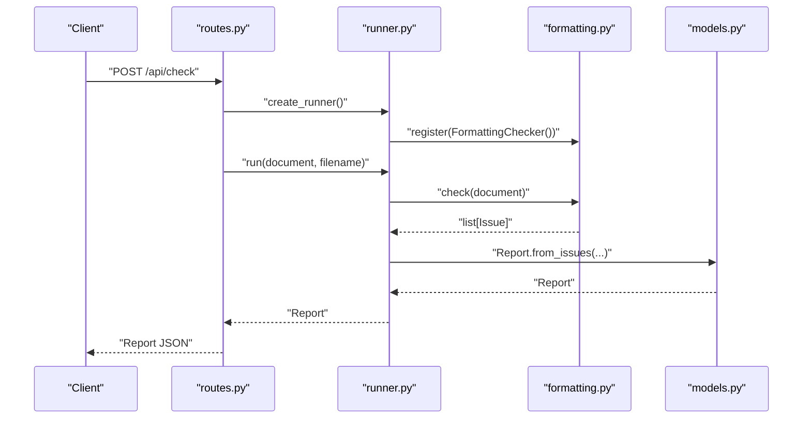
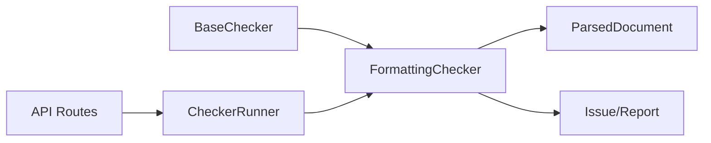

# Formatting Checker

<cite>
**Referenced Files in This Document**
- [formatting.py](file://backend/app/checkers/formatting.py)
- [base.py](file://backend/app/checkers/base.py)
- [structures.py](file://backend/app/parser/structures.py)
- [models.py](file://backend/app/core/models.py)
- [routes.py](file://backend/app/api/routes.py)
- [runner.py](file://backend/app/runner.py)
- [design.md](file://docs/design.md)
- [plan.md](file://docs/plan.md)
- [docx_parser.py](file://backend/app/parser/docx_parser.py)
- [conftest.py](file://backend/tests/conftest.py)
</cite>

## Table of Contents
1. [Introduction](#introduction)
2. [Project Structure](#project-structure)
3. [Core Components](#core-components)
4. [Architecture Overview](#architecture-overview)
5. [Detailed Component Analysis](#detailed-component-analysis)
6. [Dependency Analysis](#dependency-analysis)
7. [Performance Considerations](#performance-considerations)
8. [Troubleshooting Guide](#troubleshooting-guide)
9. [Conclusion](#conclusion)
10. [Appendices](#appendices)

## Introduction
This document describes the FormattingChecker implementation that validates typography, margins, and layout formatting according to GOST 7.32-2017. It explains how the checker analyzes document formatting properties, identifies deviations from standards, and generates detailed, actionable reports. The checker integrates with the parsed document structures and leverages a plugin-based architecture to produce comprehensive formatting compliance feedback.

## Project Structure
The FormattingChecker resides in the backend checkers module and operates on the shared ParsedDocument model. It is registered by the CheckerRunner and invoked during the API check endpoint.

**Diagram sources**
- [routes.py:21-28](file://backend/app/api/routes.py#L21-L28)
- [runner.py:8-24](file://backend/app/runner.py#L8-L24)
- [formatting.py:5-10](file://backend/app/checkers/formatting.py#L5-L10)
- [base.py:9-16](file://backend/app/checkers/base.py#L9-L16)
- [models.py:17-57](file://backend/app/core/models.py#L17-L57)
- [structures.py:77-89](file://backend/app/parser/structures.py#L77-L89)
- [docx_parser.py:5-7](file://backend/app/parser/docx_parser.py#L5-L7)

**Section sources**
- [routes.py:21-28](file://backend/app/api/routes.py#L21-L28)
- [runner.py:8-24](file://backend/app/runner.py#L8-L24)
- [formatting.py:5-10](file://backend/app/checkers/formatting.py#L5-L10)
- [base.py:9-16](file://backend/app/checkers/base.py#L9-L16)
- [models.py:17-57](file://backend/app/core/models.py#L17-L57)
- [structures.py:77-89](file://backend/app/parser/structures.py#L77-L89)
- [docx_parser.py:5-7](file://backend/app/parser/docx_parser.py#L5-L7)

## Core Components
- FormattingChecker: Implements validation for page layout, typography, and heading styles per GOST 7.32-2017. It currently declares the check method and returns an empty list pending implementation.
- ParsedDocument: Provides typed formatting metrics such as margins, default font, line spacing, and paragraph-level attributes (font name/size, alignment, line spacing, first-line indent).
- Issue and Report: Standardized reporting model used across all checkers to communicate findings with severity, category, location, message, suggestion, and rule reference.
- CheckerRunner: Orchestrates execution of all registered checkers and aggregates results into a unified Report.

Key validation targets derived from the design specification:
- Typography: Times New Roman font, 14 pt body text size.
- Line spacing: 1.5 throughout.
- Margins: left 30 mm, right 10 mm, top 20 mm, bottom 20 mm.
- Text alignment: justified for body paragraphs.
- Headings: uppercase, bold, no period at end.
- Page numbering: Arabic numerals, bottom-center; title page counts as page 1 but number hidden.

**Section sources**
- [formatting.py:5-10](file://backend/app/checkers/formatting.py#L5-L10)
- [structures.py:65-75](file://backend/app/parser/structures.py#L65-L75)
- [structures.py:7-20](file://backend/app/parser/structures.py#L7-L20)
- [models.py:17-26](file://backend/app/core/models.py#L17-L26)
- [runner.py:15-24](file://backend/app/runner.py#L15-L24)
- [design.md:205-222](file://docs/design.md#L205-L222)

## Architecture Overview
The FormattingChecker participates in a plugin-based checker architecture. The API route handler parses the uploaded .docx into a ParsedDocument, constructs a CheckerRunner, registers all checkers, and executes them in sequence. Issues are aggregated into a Report returned to the client.

**Diagram sources**
- [routes.py:36-67](file://backend/app/api/routes.py#L36-L67)
- [docx_parser.py:5-7](file://backend/app/parser/docx_parser.py#L5-L7)
- [runner.py:8-24](file://backend/app/runner.py#L8-L24)
- [formatting.py:9-10](file://backend/app/checkers/formatting.py#L9-L10)
- [models.py:39-57](file://backend/app/core/models.py#L39-L57)

## Detailed Component Analysis

### FormattingChecker Implementation Plan
The implementation follows the design specification and the detailed plan outline. It validates:
- Page margins against expected values with tolerance.
- Paragraph-level font name, font size, line spacing, and alignment.
- Heading uppercase, bold, and punctuation rules.
- Additional items such as page numbering placement and title page page number visibility are documented in the design spec.

**Diagram sources**
- [plan.md:1377-1531](file://docs/plan.md#L1377-L1531)

**Section sources**
- [design.md:205-222](file://docs/design.md#L205-L222)
- [plan.md:1359-1531](file://docs/plan.md#L1359-L1531)

### Data Structures Used by FormattingChecker
The checker relies on ParsedDocument and ParsedParagraph for formatting metrics and on Issue/IssueLocation for reporting.

**Diagram sources**
- [structures.py:77-89](file://backend/app/parser/structures.py#L77-L89)
- [structures.py:65-75](file://backend/app/parser/structures.py#L65-L75)
- [structures.py:7-20](file://backend/app/parser/structures.py#L7-L20)
- [models.py:17-26](file://backend/app/core/models.py#L17-L26)
- [models.py:9-15](file://backend/app/core/models.py#L9-L15)

**Section sources**
- [structures.py:77-89](file://backend/app/parser/structures.py#L77-L89)
- [structures.py:65-75](file://backend/app/parser/structures.py#L65-L75)
- [structures.py:7-20](file://backend/app/parser/structures.py#L7-L20)
- [models.py:17-26](file://backend/app/core/models.py#L17-L26)
- [models.py:9-15](file://backend/app/core/models.py#L9-L15)

### Validation Rules and Algorithms
- Margins: Compare actual margins against expected values with tolerance. Emit errors for deviations exceeding tolerance.
- Paragraph formatting: Validate font name, font size, line spacing, and alignment for non-heading paragraphs.
- Headings: Enforce uppercase, no trailing period, and bold formatting.
- Page numbering and title page: Documented in design spec; to be implemented in future iterations.

Common violations and suggested fixes:
- Incorrect margins: Adjust page layout settings to match expected values.
- Improper font usage: Change font to Times New Roman and set size to 14 pt.
- Line spacing issues: Set line spacing to 1.5 for affected paragraphs.
- Text alignment: Set alignment to justified for body paragraphs.
- Heading style: Convert to uppercase, remove trailing periods, apply bold formatting.

**Section sources**
- [design.md:205-222](file://docs/design.md#L205-L222)
- [plan.md:1377-1531](file://docs/plan.md#L1377-L1531)

### Integration with Parsed Document Structures
The FormattingChecker consumes ParsedDocument fields:
- DocProperties for page layout metrics (margins, default font, line spacing).
- ParsedParagraph for per-paragraph formatting attributes (font, size, alignment, line spacing, bold, first-line indent).

The DOCX parser currently returns a skeleton ParsedDocument; full implementation will populate these fields from parsed styles and properties.

**Section sources**
- [structures.py:77-89](file://backend/app/parser/structures.py#L77-L89)
- [structures.py:65-75](file://backend/app/parser/structures.py#L65-L75)
- [structures.py:7-20](file://backend/app/parser/structures.py#L7-L20)
- [docx_parser.py:5-7](file://backend/app/parser/docx_parser.py#L5-L7)

### API Workflow and Report Generation
The API endpoint orchestrates parsing, checker execution, and report generation. The CheckerRunner aggregates issues from all checkers and produces a Report with counts by severity and category.

**Diagram sources**
- [routes.py:21-28](file://backend/app/api/routes.py#L21-L28)
- [routes.py:58-61](file://backend/app/api/routes.py#L58-L61)
- [runner.py:15-24](file://backend/app/runner.py#L15-L24)
- [formatting.py:9-10](file://backend/app/checkers/formatting.py#L9-L10)
- [models.py:39-57](file://backend/app/core/models.py#L39-L57)

**Section sources**
- [routes.py:36-67](file://backend/app/api/routes.py#L36-L67)
- [runner.py:15-24](file://backend/app/runner.py#L15-L24)
- [models.py:39-57](file://backend/app/core/models.py#L39-L57)

## Dependency Analysis
- FormattingChecker depends on BaseChecker for the common interface and on ParsedDocument for data access.
- It emits Issue objects with IssueLocation to pinpoint violations.
- The API routes register FormattingChecker alongside other checkers via CheckerRunner.

**Diagram sources**
- [base.py:9-16](file://backend/app/checkers/base.py#L9-L16)
- [formatting.py:5-10](file://backend/app/checkers/formatting.py#L5-L10)
- [structures.py:77-89](file://backend/app/parser/structures.py#L77-L89)
- [models.py:17-26](file://backend/app/core/models.py#L17-L26)
- [routes.py:21-28](file://backend/app/api/routes.py#L21-L28)

**Section sources**
- [base.py:9-16](file://backend/app/checkers/base.py#L9-L16)
- [formatting.py:5-10](file://backend/app/checkers/formatting.py#L5-L10)
- [structures.py:77-89](file://backend/app/parser/structures.py#L77-L89)
- [models.py:17-26](file://backend/app/core/models.py#L17-L26)
- [routes.py:21-28](file://backend/app/api/routes.py#L21-L28)

## Performance Considerations
- Complexity: The checker iterates through paragraphs and properties once per validation pass, yielding O(n) complexity for paragraph-level checks and O(1) for page-level checks.
- Tolerances: Margin tolerance avoids false positives from minor measurement differences.
- Early filtering: Skipping headings for certain font/alignment checks reduces redundant validations.

## Troubleshooting Guide
- Empty results: The current check method returns an empty list; ensure the implementation is completed before expecting violations.
- Missing data: If font_name/font_size/line_spacing are None, the checker skips those validations; confirm parser populates these fields.
- Location reporting: Use IssueLocation with paragraph_index and context_text to help users locate issues quickly.
- Severity mapping: Align severities with GOST sections to guide corrective actions.

**Section sources**
- [formatting.py:9-10](file://backend/app/checkers/formatting.py#L9-L10)
- [models.py:9-15](file://backend/app/core/models.py#L9-L15)
- [plan.md:1377-1531](file://docs/plan.md#L1377-L1531)

## Conclusion
The FormattingChecker is designed to validate typography, margins, and layout against GOST 7.32-2017 using a clean, extensible architecture. By leveraging shared data models and a plugin-based runner, it integrates seamlessly with the broader checking pipeline. Once implemented, it will provide precise, actionable feedback to ensure compliance with university formatting standards.

## Appendices
- Test fixtures: Use conftest helpers to construct ParsedDocument instances with known formatting states for unit testing.

**Section sources**
- [conftest.py:10-56](file://backend/tests/conftest.py#L10-L56)