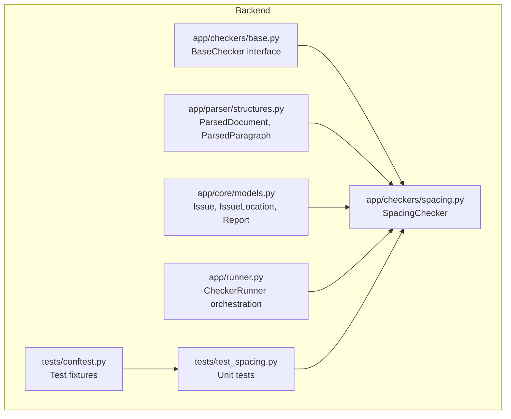
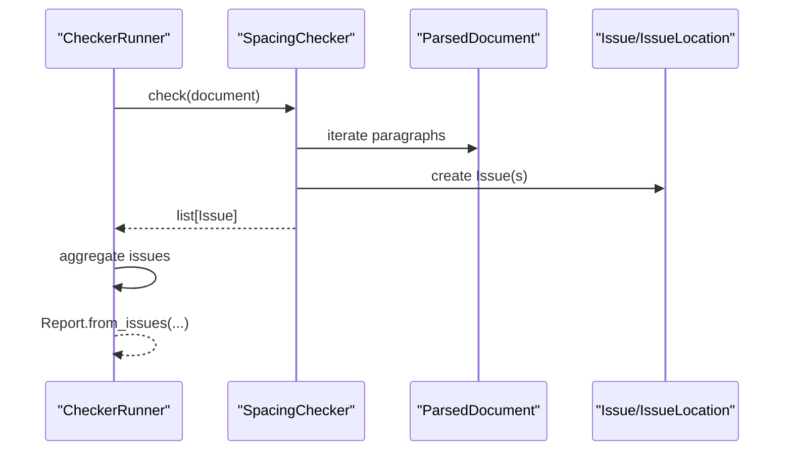
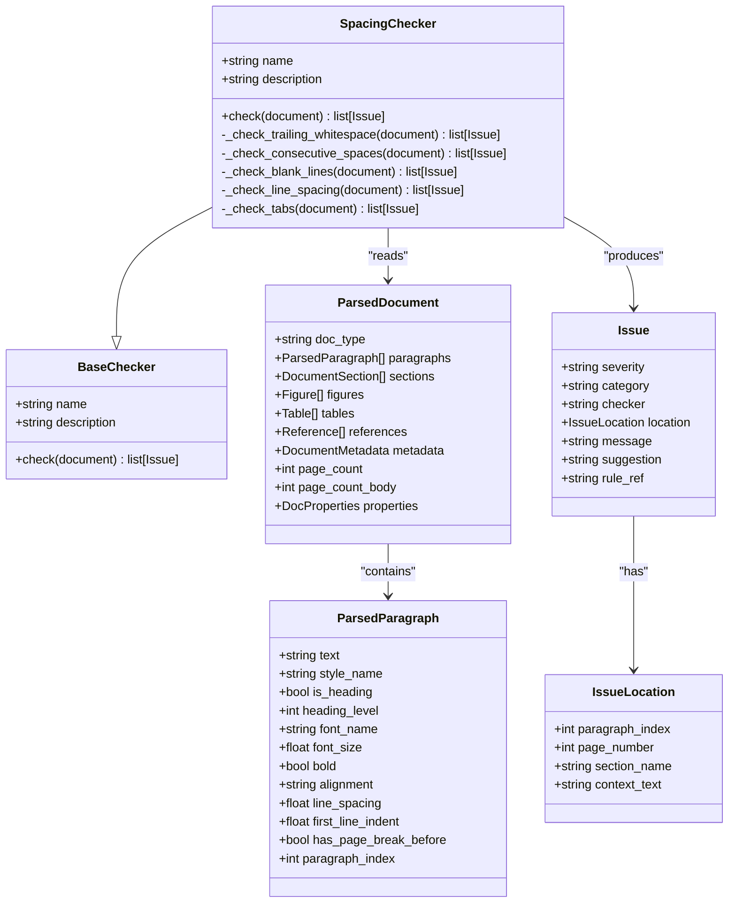
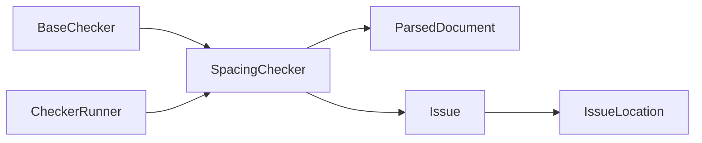

# Spacing Checker

<cite>
**Referenced Files in This Document**
- [spacing.py](file://backend/app/checkers/spacing.py)
- [base.py](file://backend/app/checkers/base.py)
- [structures.py](file://backend/app/parser/structures.py)
- [models.py](file://backend/app/core/models.py)
- [runner.py](file://backend/app/runner.py)
- [test_spacing.py](file://backend/tests/test_spacing.py)
- [conftest.py](file://backend/tests/conftest.py)
- [design.md](file://docs/design.md)
- [README.md](file://README.md)
</cite>

## Table of Contents
1. [Introduction](#introduction)
2. [Project Structure](#project-structure)
3. [Core Components](#core-components)
4. [Architecture Overview](#architecture-overview)
5. [Detailed Component Analysis](#detailed-component-analysis)
6. [Dependency Analysis](#dependency-analysis)
7. [Performance Considerations](#performance-considerations)
8. [Troubleshooting Guide](#troubleshooting-guide)
9. [Conclusion](#conclusion)

## Introduction
This document describes the SpacingChecker implementation that validates whitespace consistency and document layout according to GOST 7.32-2017 standards. It focuses on paragraph spacing, line spacing, indentation, and whitespace distribution. The checker analyzes parsed document structures and reports issues with severity levels and actionable suggestions.

The SpacingChecker is part of a plugin-based checker architecture that runs alongside other validators (Structure, Formatting, Captions, Citations). It operates on a ParsedDocument model containing paragraphs with spacing-related attributes such as line spacing and first-line indent.

## Project Structure
The SpacingChecker resides under the backend application’s checkers module and integrates with shared models and the checker runner.

**Diagram sources**
- [base.py:9-17](file://backend/app/checkers/base.py#L9-L17)
- [spacing.py:13-24](file://backend/app/checkers/spacing.py#L13-L24)
- [structures.py:6-89](file://backend/app/parser/structures.py#L6-L89)
- [models.py:9-58](file://backend/app/core/models.py#L9-L58)
- [runner.py:8-25](file://backend/app/runner.py#L8-L25)
- [test_spacing.py:1-69](file://backend/tests/test_spacing.py#L1-L69)
- [conftest.py:10-57](file://backend/tests/conftest.py#L10-L57)

**Section sources**
- [README.md:169-195](file://README.md#L169-L195)
- [design.md:14-110](file://docs/design.md#L14-L110)

## Core Components
- SpacingChecker: Implements whitespace validation across paragraphs and line spacing.
- ParsedDocument and ParsedParagraph: Provide parsed document structure and paragraph-level spacing attributes.
- Issue and IssueLocation: Define the reporting model for detected issues.
- CheckerRunner: Executes all registered checkers and aggregates results.

Key spacing metrics used for validation:
- Expected line spacing: 1.5
- Maximum consecutive blank lines: 2
- Paragraph line spacing: float (e.g., 1.5)
- First-line indent: float in centimeters

Validation rules documented in the design spec:
- Trailing whitespace in paragraphs: warning
- Leading whitespace in paragraphs (unintended indentation): warning
- Multiple consecutive spaces: warning
- Extra blank lines between sections: warning
- Line spacing inconsistency (must be 1.5 throughout): error
- Tab vs space inconsistencies: warning

**Section sources**
- [spacing.py:9-11](file://backend/app/checkers/spacing.py#L9-L11)
- [structures.py:6-20](file://backend/app/parser/structures.py#L6-L20)
- [design.md:239-251](file://docs/design.md#L239-L251)

## Architecture Overview
The SpacingChecker participates in the checker orchestration pipeline. It receives a ParsedDocument, iterates through paragraphs, and produces a list of Issues. The Runner aggregates issues from all checkers into a Report.

**Diagram sources**
- [runner.py:15-24](file://backend/app/runner.py#L15-L24)
- [spacing.py:17-24](file://backend/app/checkers/spacing.py#L17-L24)
- [models.py:18-26](file://backend/app/core/models.py#L18-L26)

## Detailed Component Analysis

### SpacingChecker Implementation
The SpacingChecker implements a set of whitespace and spacing validations:
- Trailing whitespace detection
- Consecutive spaces detection
- Blank line grouping and limits
- Line spacing validation against a fixed expected value
- Tab character detection and suggestion to use paragraph indentation

**Diagram sources**
- [base.py:9-17](file://backend/app/checkers/base.py#L9-L17)
- [spacing.py:13-136](file://backend/app/checkers/spacing.py#L13-L136)
- [structures.py:6-89](file://backend/app/parser/structures.py#L6-L89)
- [models.py:9-26](file://backend/app/core/models.py#L9-L26)

Validation algorithms and logic:
- Trailing whitespace: Compares original text with stripped version to detect trailing spaces.
- Consecutive spaces: Uses a regular expression to detect sequences of two or more spaces.
- Blank lines: Iterates through paragraphs, tracks consecutive blank lines, and flags when exceeding the limit.
- Line spacing: Validates numeric line spacing against an expected value with a small tolerance.
- Tabs: Detects tab characters and suggests replacing with paragraph first-line indent.

Common spacing issues identified:
- Inconsistent paragraph breaks (excessive blank lines)
- Improper indentation (leading whitespace or tabs)
- Whitespace misuse (multiple spaces, trailing spaces)
- Line spacing deviations from the required 1.5 ratio

Corrective recommendations:
- Remove trailing spaces
- Replace multiple spaces with single spaces
- Reduce blank lines to the allowed maximum
- Set line spacing to 1.5
- Replace tabs with paragraph first-line indent (1.0 cm)

Integration with parsed document structures:
- Uses paragraph_index for precise issue location
- Leverages line_spacing and first_line_indent attributes for validation
- Operates on the paragraphs collection of ParsedDocument

**Section sources**
- [spacing.py:17-136](file://backend/app/checkers/spacing.py#L17-L136)
- [structures.py:6-20](file://backend/app/parser/structures.py#L6-L20)
- [models.py:18-26](file://backend/app/core/models.py#L18-L26)

### Validation Rules and GOST Alignment
The SpacingChecker aligns with GOST 7.32-2017 Section 6.2 for line spacing requirements and general whitespace consistency. The design specification enumerates the specific checks performed by the SpacingChecker, including line spacing enforcement and whitespace normalization.

Rule references:
- Line spacing requirement: Sec. 6.2
- General whitespace checks: unspecified rule references in the design spec

Severity mapping:
- Line spacing errors: error
- Other whitespace warnings: warning

**Section sources**
- [design.md:239-251](file://docs/design.md#L239-L251)
- [design.md:213](file://docs/design.md#L213)

### Testing Strategy
The SpacingChecker includes unit tests covering:
- Clean text with no issues
- Trailing whitespace detection
- Multiple consecutive spaces detection
- Incorrect line spacing detection
- Excessive blank lines between sections
- Tab character detection

Test fixtures construct ParsedParagraph and ParsedDocument instances with controlled attributes to simulate real-world scenarios.

**Section sources**
- [test_spacing.py:8-69](file://backend/tests/test_spacing.py#L8-L69)
- [conftest.py:10-57](file://backend/tests/conftest.py#L10-L57)

## Dependency Analysis
The SpacingChecker depends on:
- BaseChecker interface for consistent checker behavior
- ParsedDocument and ParsedParagraph for document structure and spacing attributes
- Issue and IssueLocation for reporting
- CheckerRunner for orchestration

**Diagram sources**
- [base.py:9-17](file://backend/app/checkers/base.py#L9-L17)
- [spacing.py:13-24](file://backend/app/checkers/spacing.py#L13-L24)
- [structures.py:78-89](file://backend/app/parser/structures.py#L78-L89)
- [models.py:18-26](file://backend/app/core/models.py#L18-L26)
- [runner.py:8-25](file://backend/app/runner.py#L8-L25)

Coupling and cohesion:
- Low coupling: SpacingChecker relies on shared interfaces and data models
- High cohesion: All spacing-related validations are encapsulated in a single class

Potential circular dependencies:
- None observed; SpacingChecker reads from parsed structures and writes to issues

External dependencies:
- Regular expressions for whitespace pattern matching
- Standard library modules for string operations

**Section sources**
- [spacing.py:3-6](file://backend/app/checkers/spacing.py#L3-L6)
- [runner.py:3-6](file://backend/app/runner.py#L3-L6)

## Performance Considerations
- Linear iteration over paragraphs: O(n) time complexity
- Regex-based consecutive space detection: linear scan with constant-time pattern matching
- Blank line counting: single pass with O(n) complexity
- Line spacing comparison: constant-time per paragraph
- Memory footprint: proportional to number of issues generated

Optimization opportunities:
- Early exit when no issues are found (already implicit in returning concatenated lists)
- Consider caching regex patterns if reused frequently
- Batch issue creation could reduce overhead if many issues are generated

[No sources needed since this section provides general guidance]

## Troubleshooting Guide
Common issues and resolutions:
- Trailing whitespace: Remove trailing spaces from paragraph text
- Multiple consecutive spaces: Replace with single spaces
- Excessive blank lines: Reduce to at most the allowed maximum
- Line spacing errors: Adjust line spacing to the expected value
- Tab characters: Replace tabs with paragraph first-line indent

Diagnostic tips:
- Use paragraph_index to locate the exact position of issues
- Inspect context_text for quick identification of problematic areas
- Verify that line_spacing is numeric and within acceptable tolerance

Integration points:
- Ensure ParsedDocument is populated with paragraph spacing attributes
- Confirm that CheckerRunner registers the SpacingChecker during initialization

**Section sources**
- [spacing.py:26-136](file://backend/app/checkers/spacing.py#L26-L136)
- [models.py:18-26](file://backend/app/core/models.py#L18-L26)

## Conclusion
The SpacingChecker provides essential whitespace and line spacing validation aligned with GOST 7.32-2017 requirements. It integrates seamlessly into the checker framework, leveraging shared data models and reporting structures. The implementation is straightforward, efficient, and focused on common formatting issues that impact readability and compliance. Future enhancements could include configurable thresholds and expanded rule sets while maintaining the current low coupling and high cohesion design.