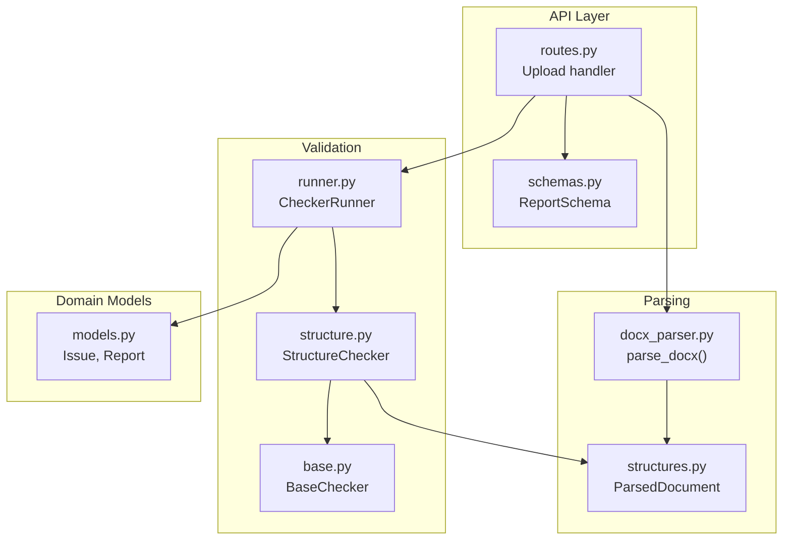
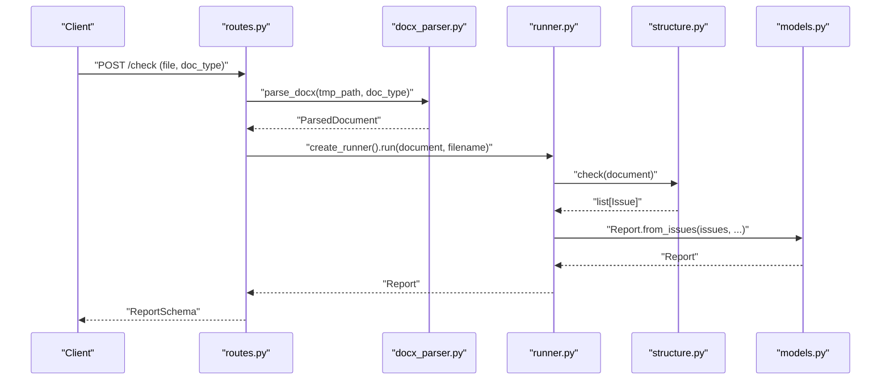
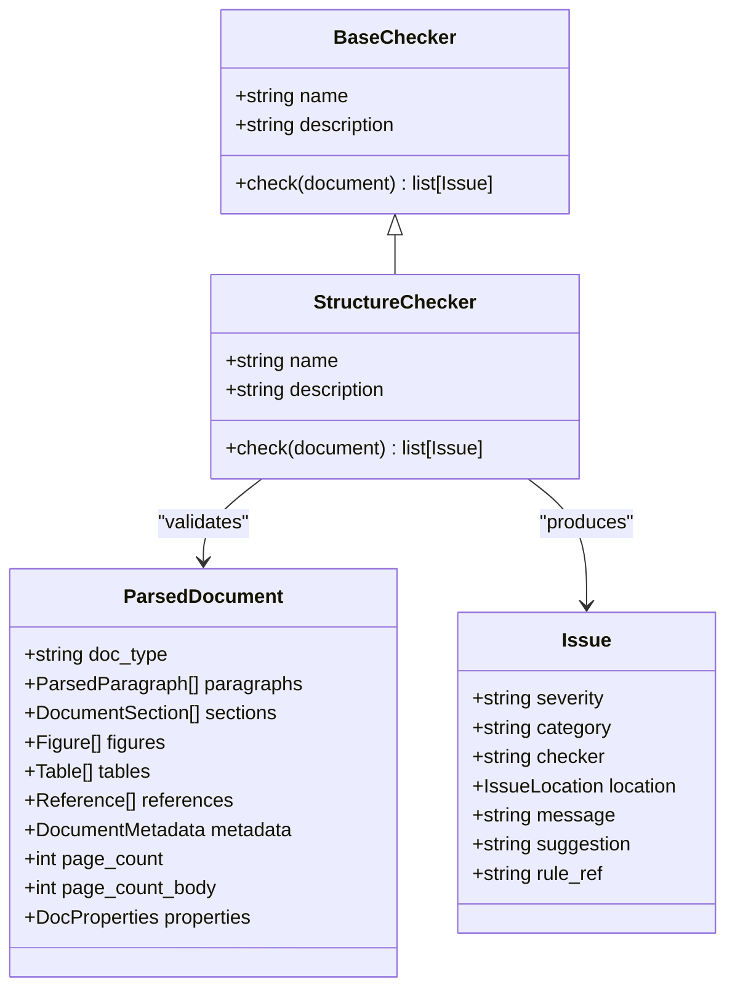
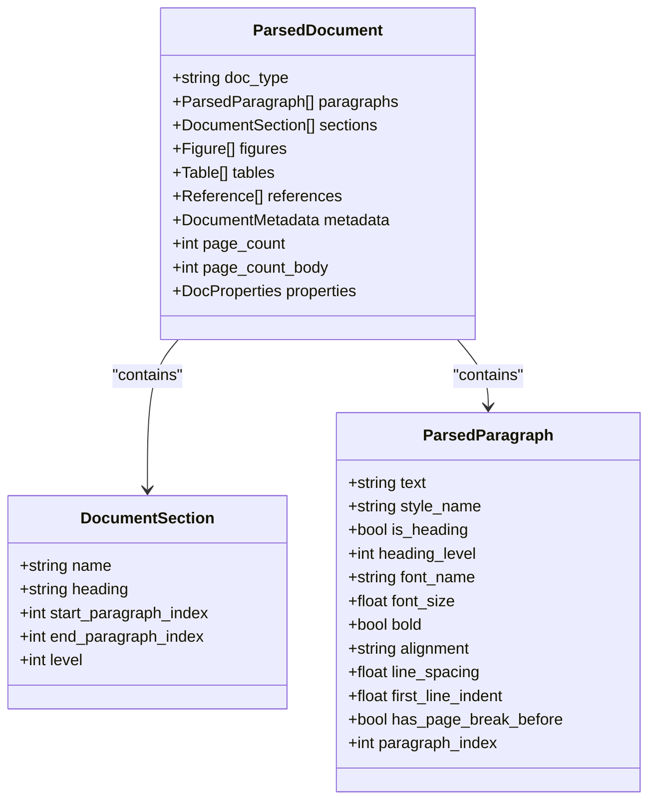
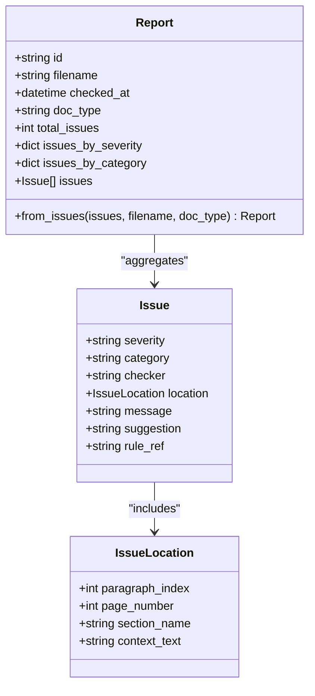
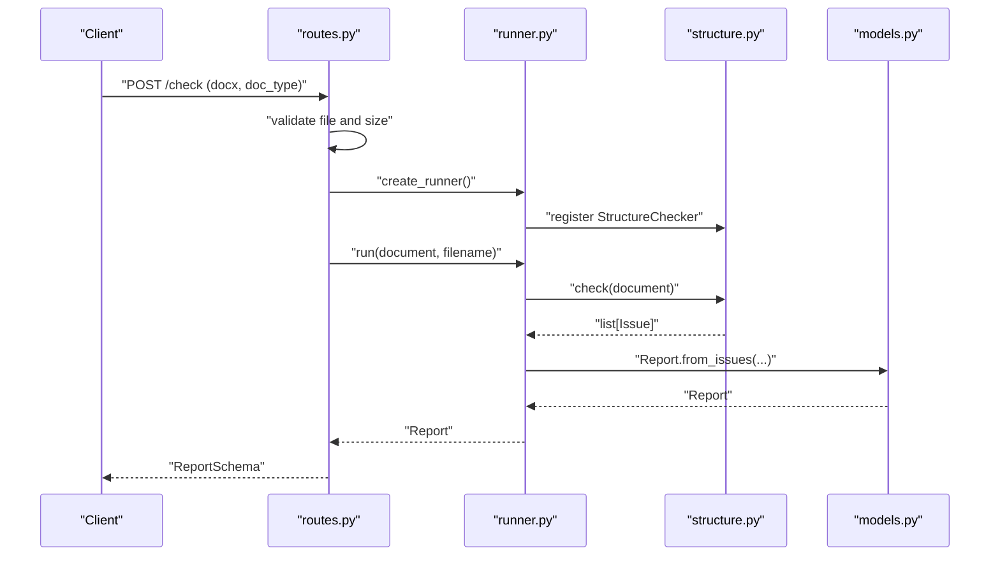
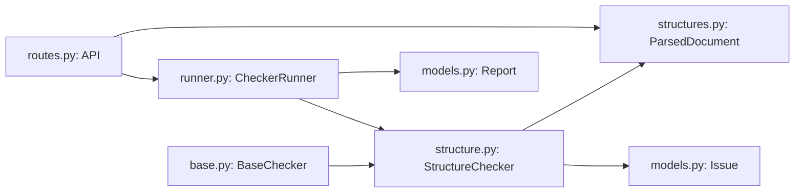

# Structure Checker

<cite>
**Referenced Files in This Document**
- [structure.py](file://backend/app/checkers/structure.py)
- [base.py](file://backend/app/checkers/base.py)
- [models.py](file://backend/app/core/models.py)
- [structures.py](file://backend/app/parser/structures.py)
- [docx_parser.py](file://backend/app/parser/docx_parser.py)
- [runner.py](file://backend/app/runner.py)
- [routes.py](file://backend/app/api/routes.py)
- [schemas.py](file://backend/app/api/schemas.py)
- [README.md](file://README.md)
- [conftest.py](file://backend/tests/conftest.py)
</cite>

## Table of Contents
1. [Introduction](#introduction)
2. [Project Structure](#project-structure)
3. [Core Components](#core-components)
4. [Architecture Overview](#architecture-overview)
5. [Detailed Component Analysis](#detailed-component-analysis)
6. [Dependency Analysis](#dependency-analysis)
7. [Performance Considerations](#performance-considerations)
8. [Troubleshooting Guide](#troubleshooting-guide)
9. [Conclusion](#conclusion)
10. [Appendices](#appendices)

## Introduction
This document describes the StructureChecker implementation responsible for validating dissertation document structure according to GOST 7.32-2017 standards. It explains how the checker integrates with the parsed document model, analyzes section ordering and required elements, and produces structured reports via the shared Issue and Report models. The document also outlines the data formats used during validation, common structural violations, resolution strategies, performance considerations, and error handling approaches for malformed inputs.

## Project Structure
The StructureChecker resides in the checkers module and follows a plugin-like architecture. It consumes a ParsedDocument produced by the DOCX parser and emits Issues collected by the CheckerRunner into a Report. The API layer orchestrates parsing, checker registration, and report generation.

**Diagram sources**
- [routes.py:36-68](file://backend/app/api/routes.py#L36-L68)
- [docx_parser.py:5-7](file://backend/app/parser/docx_parser.py#L5-L7)
- [structures.py:77-89](file://backend/app/parser/structures.py#L77-L89)
- [base.py:9-16](file://backend/app/checkers/base.py#L9-L16)
- [structure.py:5-10](file://backend/app/checkers/structure.py#L5-L10)
- [runner.py:8-24](file://backend/app/runner.py#L8-L24)
- [models.py:18-57](file://backend/app/core/models.py#L18-L57)
- [schemas.py:25-33](file://backend/app/api/schemas.py#L25-L33)

**Section sources**
- [README.md:3](file://README.md#L3)
- [routes.py:36-68](file://backend/app/api/routes.py#L36-L68)
- [runner.py:8-24](file://backend/app/runner.py#L8-L24)
- [structure.py:5-10](file://backend/app/checkers/structure.py#L5-L10)
- [structures.py:77-89](file://backend/app/parser/structures.py#L77-L89)
- [models.py:18-57](file://backend/app/core/models.py#L18-L57)

## Core Components
- StructureChecker: Implements the check method to validate section order and required sections. It inherits from BaseChecker and operates on ParsedDocument instances.
- ParsedDocument: The canonical representation of a parsed DOCX, including paragraphs, sections, figures, tables, references, metadata, and document properties.
- Issue and Report: Standardized domain models for capturing validation outcomes and generating reports.
- CheckerRunner: Orchestrates checker execution and aggregates results into a single Report.
- API Routes: Parse uploaded DOCX files, instantiate StructureChecker, and produce ReportSchema responses.

Key integration points:
- StructureChecker.check receives a ParsedDocument and returns a list of Issue objects.
- CheckerRunner.run iterates registered checkers, collects issues, and constructs a Report.
- API routes parse the DOCX, run all checkers, and return a JSON-compatible ReportSchema.

**Section sources**
- [structure.py:5-10](file://backend/app/checkers/structure.py#L5-L10)
- [structures.py:77-89](file://backend/app/parser/structures.py#L77-L89)
- [models.py:18-57](file://backend/app/core/models.py#L18-L57)
- [runner.py:15-24](file://backend/app/runner.py#L15-L24)
- [routes.py:36-68](file://backend/app/api/routes.py#L36-L68)

## Architecture Overview
The validation pipeline transforms a DOCX file into a structured document model, runs StructureChecker alongside other checkers, and consolidates findings into a standardized report.

**Diagram sources**
- [routes.py:36-68](file://backend/app/api/routes.py#L36-L68)
- [docx_parser.py:5-7](file://backend/app/parser/docx_parser.py#L5-L7)
- [runner.py:15-24](file://backend/app/runner.py#L15-L24)
- [structure.py:9-10](file://backend/app/checkers/structure.py#L9-L10)
- [models.py:39-57](file://backend/app/core/models.py#L39-L57)

## Detailed Component Analysis

### StructureChecker Implementation
Responsibilities:
- Validate section ordering and presence of required sections per GOST 7.32-2017.
- Identify missing or misplaced sections relative to the document type (e.g., thesis type influences expected front matter and main content).
- Emit Issues with severity, category, location, message, suggestion, and rule reference.

Current state:
- The class declares its name and description and inherits the abstract check method contract.
- The check method currently returns an empty list and awaits implementation in Task 3.

Integration points:
- Receives ParsedDocument with populated sections, paragraphs, and metadata.
- Emits Issue objects with IssueLocation referencing paragraph indices and optional section names.

**Diagram sources**
- [base.py:9-16](file://backend/app/checkers/base.py#L9-L16)
- [structure.py:5-10](file://backend/app/checkers/structure.py#L5-L10)
- [structures.py:77-89](file://backend/app/parser/structures.py#L77-L89)
- [models.py:18-25](file://backend/app/core/models.py#L18-L25)

**Section sources**
- [structure.py:5-10](file://backend/app/checkers/structure.py#L5-L10)
- [base.py:9-16](file://backend/app/checkers/base.py#L9-L16)
- [structures.py:77-89](file://backend/app/parser/structures.py#L77-L89)
- [models.py:18-25](file://backend/app/core/models.py#L18-L25)

### ParsedDocument Model and Validation Data Formats
The ParsedDocument carries all structural and content information needed for validation:
- Sections: ordered DocumentSection entries define named regions with heading boundaries and hierarchical levels.
- Paragraphs: ParsedParagraph entries carry style, alignment, spacing, and positional metadata.
- Figures and Tables: metadata for media with optional captions and positions.
- References: raw reference entries for cross-checking.
- Metadata and Properties: document-level attributes influencing layout and structure.

Validation data formats:
- Section names and levels are used to enforce ordering and completeness.
- Paragraph indices enable precise IssueLocation reporting.
- Doc type informs which sections are required for a given thesis category.

**Diagram sources**
- [structures.py:22-29](file://backend/app/parser/structures.py#L22-L29)
- [structures.py:6-20](file://backend/app/parser/structures.py#L6-L20)
- [structures.py:77-89](file://backend/app/parser/structures.py#L77-L89)

**Section sources**
- [structures.py:6-20](file://backend/app/parser/structures.py#L6-L20)
- [structures.py:22-29](file://backend/app/parser/structures.py#L22-L29)
- [structures.py:77-89](file://backend/app/parser/structures.py#L77-L89)

### Issue Reporting and Report Generation
StructureChecker emits Issue objects with:
- Severity: error, warning, or info.
- Category: structural, content, or formatting.
- Location: paragraph_index, page_number, section_name, and context_text.
- Message and suggestion: human-readable guidance.
- Rule reference: optional citation to GOST rule.

The Runner aggregates issues from all checkers and builds a Report, which is serialized to ReportSchema for the API response.

**Diagram sources**
- [models.py:10-25](file://backend/app/core/models.py#L10-L25)
- [models.py:18-38](file://backend/app/core/models.py#L18-L38)
- [models.py:39-57](file://backend/app/core/models.py#L39-L57)

**Section sources**
- [models.py:10-25](file://backend/app/core/models.py#L10-L25)
- [models.py:18-38](file://backend/app/core/models.py#L18-L38)
- [models.py:39-57](file://backend/app/core/models.py#L39-L57)

### API Integration and Execution Flow
The API endpoint:
- Validates file type and size.
- Writes uploaded content to a temporary file.
- Parses DOCX to ParsedDocument.
- Registers StructureChecker and other checkers via CheckerRunner.
- Produces a Report and returns ReportSchema.

**Diagram sources**
- [routes.py:36-68](file://backend/app/api/routes.py#L36-L68)
- [runner.py:21-24](file://backend/app/runner.py#L21-L24)
- [structure.py:9-10](file://backend/app/checkers/structure.py#L9-L10)
- [models.py:39-57](file://backend/app/core/models.py#L39-L57)

**Section sources**
- [routes.py:36-68](file://backend/app/api/routes.py#L36-L68)
- [runner.py:21-24](file://backend/app/runner.py#L21-L24)
- [structure.py:9-10](file://backend/app/checkers/structure.py#L9-L10)
- [models.py:39-57](file://backend/app/core/models.py#L39-L57)

## Dependency Analysis
StructureChecker depends on:
- BaseChecker for the checker interface contract.
- ParsedDocument for structural context.
- Issue and Report for output modeling.

The Runner composes all checkers and aggregates results. The API registers StructureChecker along with other checkers and delegates execution.

**Diagram sources**
- [base.py:9-16](file://backend/app/checkers/base.py#L9-L16)
- [structure.py:5-10](file://backend/app/checkers/structure.py#L5-L10)
- [structures.py:77-89](file://backend/app/parser/structures.py#L77-L89)
- [models.py:18-57](file://backend/app/core/models.py#L18-L57)
- [runner.py:8-24](file://backend/app/runner.py#L8-L24)
- [routes.py:21-28](file://backend/app/api/routes.py#L21-L28)

**Section sources**
- [base.py:9-16](file://backend/app/checkers/base.py#L9-L16)
- [structure.py:5-10](file://backend/app/checkers/structure.py#L5-L10)
- [structures.py:77-89](file://backend/app/parser/structures.py#L77-L89)
- [models.py:18-57](file://backend/app/core/models.py#L18-L57)
- [runner.py:8-24](file://backend/app/runner.py#L8-L24)
- [routes.py:21-28](file://backend/app/api/routes.py#L21-L28)

## Performance Considerations
- Early exit on invalid or empty ParsedDocument to avoid unnecessary computation.
- Single-pass scanning of sections and paragraphs for O(n) complexity relative to document length.
- Minimize repeated property reads by caching frequently accessed fields (e.g., section names, levels).
- Batch aggregation of issues in Runner to reduce overhead.
- Avoid heavy allocations inside tight loops; reuse lists and avoid deep copies where possible.
- For large documents, consider streaming or chunked processing if extending the parser later.

## Troubleshooting Guide
Common issues and resolutions:
- Empty or malformed ParsedDocument:
  - Symptom: No sections detected or missing metadata.
  - Resolution: Ensure the DOCX parser populates sections and paragraphs; validate input file integrity.
- Missing required sections:
  - Symptom: Issues indicating missing front matter or main content sections.
  - Resolution: Add missing sections with correct headings and numbering per GOST 7.32-2017.
- Incorrect section ordering:
  - Symptom: Issues indicating out-of-order sections.
  - Resolution: Reorder sections so that front matter precedes main content and back matter follows.
- Ambiguous section boundaries:
  - Symptom: Overlapping or adjacent sections with unclear start/end indices.
  - Resolution: Adjust heading levels and paragraph indices to clearly delimit sections.
- Excessive whitespace between sections:
  - Symptom: Warnings about blank lines between sections.
  - Resolution: Reduce blank lines to meet GOST spacing requirements.

Error handling:
- API routes catch parsing errors and return HTTP 422 with a descriptive message.
- Runner aggregates issues from all checkers; malformed inputs should still produce actionable Reports.
- StructureChecker should guard against None or unexpected values from ParsedDocument and emit explicit Issues with suggestions.

**Section sources**
- [routes.py:63-67](file://backend/app/api/routes.py#L63-L67)
- [runner.py:15-24](file://backend/app/runner.py#L15-L24)
- [models.py:18-25](file://backend/app/core/models.py#L18-L25)

## Conclusion
StructureChecker provides the foundation for enforcing GOST 7.32-2017 structural compliance by validating section ordering and required elements against a standardized ParsedDocument model. Its integration with the Runner and API ensures scalable, repeatable validation and clear reporting. As implementation progresses, focus on robust boundary detection, precise IssueLocation reporting, and consistent adherence to GOST requirements across document types.

## Appendices

### Appendix A: Data Model Reference
- ParsedDocument: doc_type, paragraphs, sections, figures, tables, references, metadata, page_count, page_count_body, properties.
- DocumentSection: name, heading, start_paragraph_index, end_paragraph_index, level.
- ParsedParagraph: style metadata, alignment, spacing, positional indices.
- Issue and IssueLocation: severity, category, location, message, suggestion, rule_ref.
- Report: aggregated counts and list of issues.

**Section sources**
- [structures.py:77-89](file://backend/app/parser/structures.py#L77-L89)
- [structures.py:22-29](file://backend/app/parser/structures.py#L22-L29)
- [structures.py:6-20](file://backend/app/parser/structures.py#L6-L20)
- [models.py:18-57](file://backend/app/core/models.py#L18-L57)

### Appendix B: Test Fixture Utilities
Test helpers demonstrate how to construct ParsedDocument and related structures for unit tests, aiding in validating StructureChecker behavior under controlled scenarios.

**Section sources**
- [conftest.py:34-56](file://backend/tests/conftest.py#L34-L56)