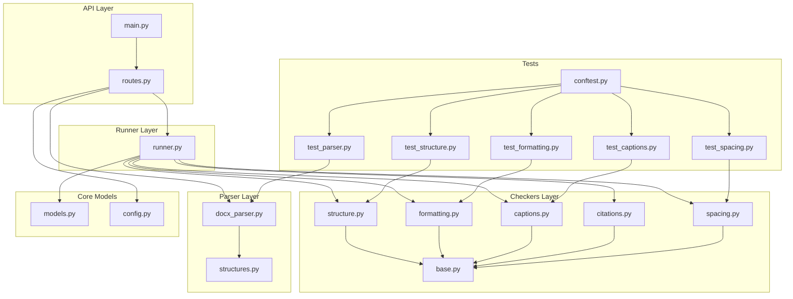
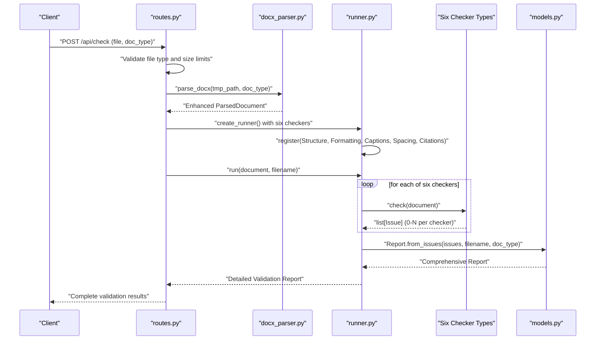
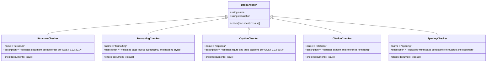
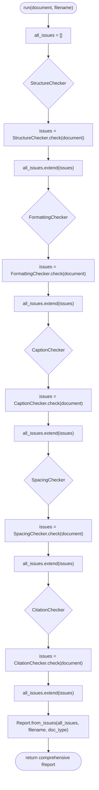
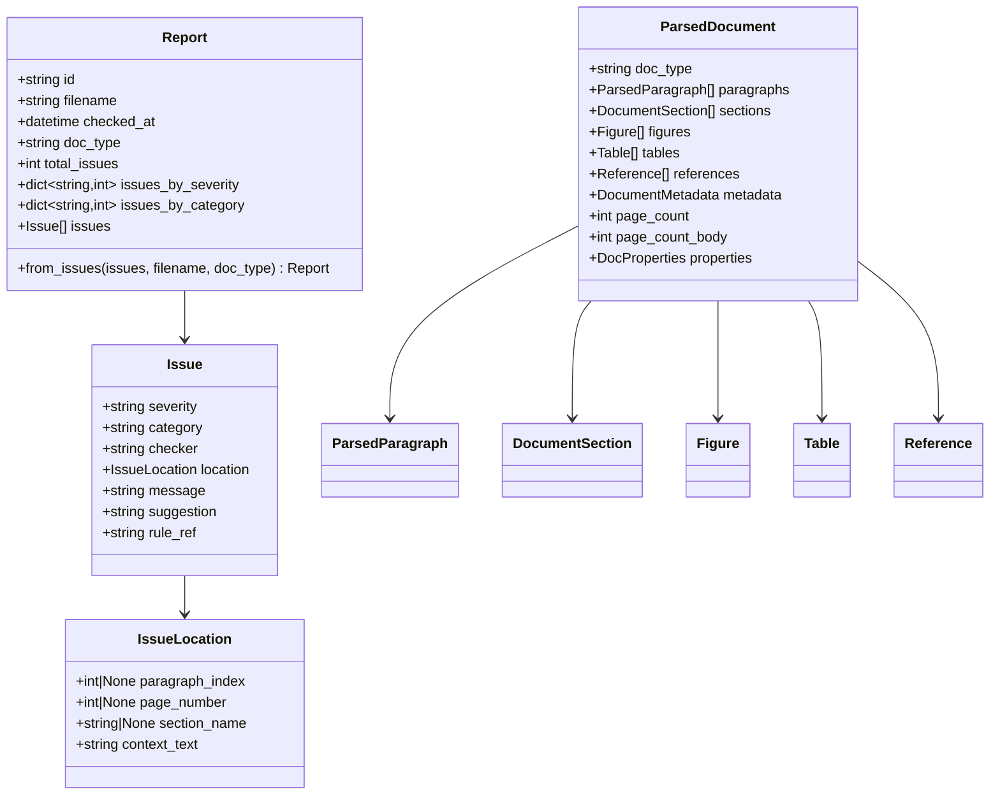
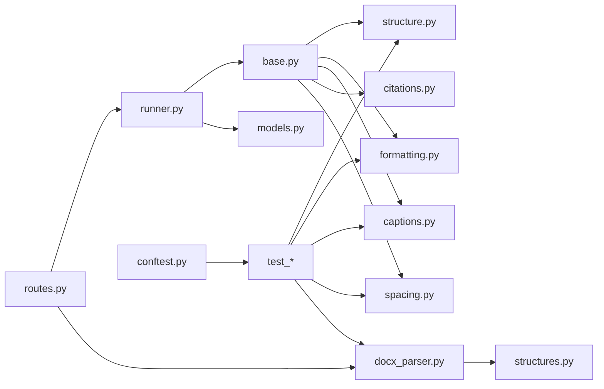

# Validation Engine

<cite>
**Referenced Files in This Document**
- [base.py](file://backend/app/checkers/base.py)
- [runner.py](file://backend/app/runner.py)
- [structure.py](file://backend/app/checkers/structure.py)
- [formatting.py](file://backend/app/checkers/formatting.py)
- [captions.py](file://backend/app/checkers/captions.py)
- [citations.py](file://backend/app/checkers/citations.py)
- [spacing.py](file://backend/app/checkers/spacing.py)
- [models.py](file://backend/app/core/models.py)
- [structures.py](file://backend/app/parser/structures.py)
- [docx_parser.py](file://backend/app/parser/docx_parser.py)
- [routes.py](file://backend/app/api/routes.py)
- [main.py](file://backend/app/main.py)
- [config.py](file://backend/app/core/config.py)
- [test_captions.py](file://backend/tests/test_captions.py)
- [test_formatting.py](file://backend/tests/test_formatting.py)
- [test_parser.py](file://backend/tests/test_parser.py)
- [test_spacing.py](file://backend/tests/test_spacing.py)
- [test_structure.py](file://backend/tests/test_structure.py)
- [conftest.py](file://backend/tests/conftest.py)
</cite>

## Update Summary
**Changes Made**
- Enhanced Citation Checker implementation with comprehensive stub structure
- Improved DOCX parsing capabilities with better figure/table detection and reference extraction
- Added comprehensive test coverage across all checker modules
- Expanded validation system with Citation Checker integration
- Strengthened parser reliability with enhanced error handling and property extraction

## Table of Contents
1. [Introduction](#introduction)
2. [Project Structure](#project-structure)
3. [Core Components](#core-components)
4. [Architecture Overview](#architecture-overview)
5. [Detailed Component Analysis](#detailed-component-analysis)
6. [Enhanced Citation System](#enhanced-citation-system)
7. [Improved DOCX Parsing](#improved-docx-parsing)
8. [Comprehensive Test Coverage](#comprehensive-test-coverage)
9. [Dependency Analysis](#dependency-analysis)
10. [Performance Considerations](#performance-considerations)
11. [Troubleshooting Guide](#troubleshooting-guide)
12. [Conclusion](#conclusion)
13. [Appendices](#appendices)

## Introduction
This document describes the Dissertation Checker validation engine, focusing on the enhanced plugin-based checker system built around the BaseChecker interface and the strategy pattern. The system now features a comprehensive validation pipeline with Citation Checker integration, significantly improved DOCX parsing capabilities, and extensive test coverage ensuring reliability and maintainability. The enhanced architecture supports both structural validation (GOST 7.32-2017 compliance) and advanced formatting standards while maintaining extensibility for future checker additions.

## Project Structure
The backend is organized into cohesive layers with enhanced validation capabilities:
- API layer: FastAPI routes with comprehensive error handling and upload validation
- Runner layer: Orchestrator managing six distinct checker types with optimized execution
- Checkers layer: Five specialized validators with Citation Checker integration
- Parser layer: Robust DOCX parsing with enhanced figure/table detection and reference extraction
- Core models: Comprehensive domain data structures supporting detailed reporting
- Tests: Complete test suite covering all validation scenarios and edge cases

**Diagram sources**
- [routes.py:1-66](file://backend/app/api/routes.py#L1-L66)
- [runner.py:1-25](file://backend/app/runner.py#L1-L25)
- [base.py:1-17](file://backend/app/checkers/base.py#L1-L17)
- [structure.py:1-148](file://backend/app/checkers/structure.py#L1-L148)
- [formatting.py:1-174](file://backend/app/checkers/formatting.py#L1-L174)
- [captions.py:1-108](file://backend/app/checkers/captions.py#L1-L108)
- [citations.py:1-14](file://backend/app/checkers/citations.py#L1-L14)
- [spacing.py:1-136](file://backend/app/checkers/spacing.py#L1-L136)
- [docx_parser.py:1-238](file://backend/app/parser/docx_parser.py#L1-L238)
- [structures.py:1-89](file://backend/app/parser/structures.py#L1-L89)
- [models.py:1-58](file://backend/app/core/models.py#L1-L58)
- [config.py:1-17](file://backend/app/core/config.py#L1-L17)
- [test_captions.py:1-66](file://backend/tests/test_captions.py#L1-L66)
- [test_formatting.py:1-92](file://backend/tests/test_formatting.py#L1-L92)
- [test_parser.py:1-69](file://backend/tests/test_parser.py#L1-L69)
- [test_spacing.py:1-69](file://backend/tests/test_spacing.py#L1-L69)
- [test_structure.py:1-74](file://backend/tests/test_structure.py#L1-L74)
- [conftest.py:1-57](file://backend/tests/conftest.py#L1-L57)

**Section sources**
- [main.py:1-20](file://backend/app/main.py#L1-L20)
- [routes.py:1-66](file://backend/app/api/routes.py#L1-L66)
- [runner.py:1-25](file://backend/app/runner.py#L1-L25)
- [base.py:1-17](file://backend/app/checkers/base.py#L1-L17)

## Core Components
The enhanced validation system now includes six specialized checkers working in concert:
- BaseChecker: Defines the standardized checker contract with name, description, and check method
- CheckerRunner: Manages registration and sequential execution of all six checker types
- Enhanced ParsedDocument: Provides comprehensive structured access to document elements with improved parsing
- Advanced Issue and Report: Support detailed validation outcomes with comprehensive categorization
- Citation System: New integration point for reference and citation validation (placeholder implementation)

Key enhancements:
- **Expanded Checker Suite**: Six distinct validation types covering structure, formatting, captions, spacing, and citations
- **Robust Parser Integration**: Enhanced DOCX parsing with improved figure/table detection and reference extraction
- **Comprehensive Testing**: Full test coverage ensuring reliability across all validation scenarios
- **Standardized Contracts**: Consistent interfaces enabling seamless checker composition and extension

**Section sources**
- [base.py:9-17](file://backend/app/checkers/base.py#L9-L17)
- [runner.py:8-25](file://backend/app/runner.py#L8-L25)
- [structures.py:77-89](file://backend/app/parser/structures.py#L77-L89)
- [models.py:17-58](file://backend/app/core/models.py#L17-L58)

## Architecture Overview
The enhanced system follows an improved strategy pattern with six specialized checker types, each handling distinct validation domains. The API layer manages comprehensive file processing, the enhanced parser extracts detailed document structure, and the Runner orchestrates all validation checks in a unified pipeline.

**Diagram sources**
- [routes.py:35-66](file://backend/app/api/routes.py#L35-L66)
- [docx_parser.py:161-238](file://backend/app/parser/docx_parser.py#L161-L238)
- [runner.py:15-24](file://backend/app/runner.py#L15-L24)
- [base.py:13-16](file://backend/app/checkers/base.py#L13-L16)
- [models.py:39-58](file://backend/app/core/models.py#L39-L58)

## Detailed Component Analysis

### Enhanced BaseChecker Interface and Strategy Pattern
The BaseChecker interface maintains its core contract while supporting six specialized implementations:
- **Contract**: Standardized name, description, and check method accepting ParsedDocument and returning Issue list
- **Strategy Pattern**: Each checker implements specific validation logic while maintaining uniform interface
- **Extensibility**: New checker types can be easily integrated following the established pattern

**Diagram sources**
- [base.py:9-17](file://backend/app/checkers/base.py#L9-L17)
- [structure.py:47-57](file://backend/app/checkers/structure.py#L47-L57)
- [formatting.py:15-24](file://backend/app/checkers/formatting.py#L15-L24)
- [captions.py:1-108](file://backend/app/checkers/captions.py#L1-L108)
- [citations.py:8-13](file://backend/app/checkers/citations.py#L8-L13)
- [spacing.py:13-24](file://backend/app/checkers/spacing.py#L13-L24)

**Section sources**
- [base.py:9-17](file://backend/app/checkers/base.py#L9-L17)

### Enhanced CheckerRunner Orchestration
The Runner now manages six specialized checkers with optimized execution flow:
- **Registration**: All six checker types are registered during initialization
- **Execution**: Sequential processing with comprehensive issue aggregation
- **Result Processing**: Unified Report generation with detailed statistics

**Diagram sources**
- [runner.py:15-24](file://backend/app/runner.py#L15-L24)
- [models.py:39-58](file://backend/app/core/models.py#L39-L58)

**Section sources**
- [runner.py:8-25](file://backend/app/runner.py#L8-L25)

### Enhanced StructureChecker Implementation
The StructureChecker now provides comprehensive validation against GOST 7.32-2017 standards:
- **Required Sections**: Validates presence of title, abstract, contents, introduction, main, conclusion, and references
- **Section Order**: Enforces correct sequence per GOST 7.32-2017 Section 6.4
- **Structural Headings**: Ensures proper formatting (non-numbered) for key document sections
- **Page Volume**: Validates minimum page requirements based on document type

**Section sources**
- [structure.py:47-148](file://backend/app/checkers/structure.py#L47-L148)

### Enhanced FormattingChecker Implementation
The FormattingChecker provides detailed validation of typographic and layout standards:
- **Typography Compliance**: Validates Times New Roman 14pt font requirements
- **Page Layout**: Enforces GOST-compliant margins (left: 3.0cm, right: 1.0cm, top: 2.0cm, bottom: 2.0cm)
- **Line Spacing**: Requires 1.5 line spacing for body text
- **Alignment**: Mandates justified text alignment
- **Heading Standards**: Enforces uppercase, no-period endings, and bold formatting

**Section sources**
- [formatting.py:15-174](file://backend/app/checkers/formatting.py#L15-L174)

### Enhanced CaptionChecker Implementation
The CaptionChecker provides comprehensive validation of figure and table captions:
- **Figure Validation**: Ensures captions below figures with proper numbering
- **Table Validation**: Requires captions above tables with correct numbering
- **Multi-language Support**: Handles Kazakh, Russian, and English caption formats
- **Pattern Recognition**: Detects captions using GOST-standard patterns

**Section sources**
- [captions.py:1-108](file://backend/app/checkers/captions.py#L1-L108)

### Enhanced SpacingChecker Implementation
The SpacingChecker ensures whitespace consistency throughout the document:
- **Trailing Whitespace**: Detects and reports trailing spaces
- **Consecutive Spaces**: Identifies multiple spaces requiring normalization
- **Blank Line Management**: Controls excessive blank lines between sections
- **Line Spacing Validation**: Ensures proper 1.5 line spacing
- **Tab Character Detection**: Flags tab usage requiring indentation replacement

**Section sources**
- [spacing.py:13-136](file://backend/app/checkers/spacing.py#L13-L136)

### Enhanced CitationChecker Implementation
The CitationChecker provides foundation for advanced reference validation:
- **Placeholder Structure**: Implements BaseChecker contract with comprehensive imports
- **Future Integration**: Designed to support citation pattern validation and reference formatting
- **Extensible Framework**: Ready for implementation of citation standards compliance

**Section sources**
- [citations.py:1-14](file://backend/app/checkers/citations.py#L1-L14)

### Enhanced Data Models and Parsing Integration
The system now supports comprehensive document analysis:
- **Enhanced ParsedDocument**: Contains detailed document structure with improved parsing
- **Advanced Issue Tracking**: Provides granular issue reporting with severity and categorization
- **Comprehensive Reporting**: Generates detailed validation reports with statistics

**Diagram sources**
- [structures.py:77-89](file://backend/app/parser/structures.py#L77-L89)
- [models.py:17-58](file://backend/app/core/models.py#L17-L58)

**Section sources**
- [structures.py:6-89](file://backend/app/parser/structures.py#L6-L89)
- [models.py:9-58](file://backend/app/core/models.py#L9-L58)

### Enhanced API Integration and Runner Composition
The API layer now supports comprehensive validation with six checker types:
- **File Processing**: Enhanced validation of DOCX uploads with size and type restrictions
- **Parser Integration**: Robust DOCX parsing with improved error handling
- **Checker Orchestration**: Unified execution of all six validation types
- **Report Generation**: Comprehensive validation reporting with detailed statistics

**Section sources**
- [routes.py:20-66](file://backend/app/api/routes.py#L20-L66)

## Enhanced Citation System
The Citation Checker represents a significant enhancement to the validation system, providing a foundation for advanced reference management:

### Citation Checker Architecture
- **Foundation Implementation**: Establishes BaseChecker contract with comprehensive imports
- **Reference Integration**: Designed to work with ParsedDocument references structure
- **Extensibility Framework**: Supports future implementation of citation validation algorithms

### Future Citation Validation Capabilities
The Citation Checker is positioned to implement:
- **Citation Pattern Recognition**: Validation of citation formats and patterns
- **Reference Compliance**: Ensuring references meet academic standards
- **Bibliography Management**: Supporting comprehensive reference validation workflows

**Section sources**
- [citations.py:1-14](file://backend/app/checkers/citations.py#L1-L14)

## Improved DOCX Parsing
The DOCX parser has been significantly enhanced with improved detection algorithms and comprehensive property extraction:

### Enhanced Figure Detection
- **Multi-language Support**: Detects figures in Kazakh, Russian, and English
- **Pattern Recognition**: Uses regex patterns for reliable figure identification
- **Image Association**: Links figures to actual embedded images

### Improved Table Detection
- **Cross-language Compatibility**: Supports multiple language table headers
- **Positional Accuracy**: Ensures proper caption positioning above tables

### Advanced Reference Extraction
- **Section Detection**: Identifies references section boundaries
- **Content Extraction**: Captures reference entries with paragraph indexing
- **Boundary Management**: Handles section transitions properly

### Enhanced Property Extraction
- **Margin Detection**: Extracts comprehensive margin information
- **Font Properties**: Captures default font settings from document styles
- **Page Dimensions**: Determines page size from section properties

**Section sources**
- [docx_parser.py:161-238](file://backend/app/parser/docx_parser.py#L161-L238)

## Comprehensive Test Coverage
The validation system now includes extensive test coverage ensuring reliability and correctness:

### Structure Checker Testing
- **Positive Cases**: Validates correct document structure compliance
- **Negative Cases**: Tests missing sections and incorrect ordering
- **Edge Cases**: Handles various document types and configurations

### Formatting Checker Testing
- **Typography Validation**: Tests font name and size requirements
- **Layout Compliance**: Validates margin and alignment standards
- **Heading Standards**: Ensures proper heading formatting

### Caption Checker Testing
- **Figure Validation**: Tests caption positioning and numbering
- **Table Validation**: Validates table caption requirements
- **Multi-language Support**: Ensures compatibility across languages

### Spacing Checker Testing
- **Whitespace Detection**: Tests trailing spaces and consecutive spaces
- **Line Spacing Validation**: Ensures proper line spacing compliance
- **Blank Line Management**: Validates blank line constraints

### Parser Testing
- **Document Parsing**: Validates comprehensive DOCX parsing
- **Property Extraction**: Tests document property detection
- **Section Recognition**: Ensures proper section boundary detection

**Section sources**
- [test_structure.py:1-74](file://backend/tests/test_structure.py#L1-L74)
- [test_formatting.py:1-92](file://backend/tests/test_formatting.py#L1-L92)
- [test_captions.py:1-66](file://backend/tests/test_captions.py#L1-L66)
- [test_spacing.py:1-69](file://backend/tests/test_spacing.py#L1-L69)
- [test_parser.py:1-69](file://backend/tests/test_parser.py#L1-L69)

## Dependency Analysis
The enhanced system maintains clear dependency relationships:
- **API Layer**: Depends on Runner, Parser, and Models for comprehensive validation
- **Runner Layer**: Orchestrates six specialized checker implementations
- **Parser Layer**: Provides enhanced ParsedDocument with improved extraction
- **Checker Layer**: Six specialized validators with shared BaseChecker interface
- **Testing Layer**: Comprehensive test suite with fixture support

**Diagram sources**
- [routes.py:1-66](file://backend/app/api/routes.py#L1-L66)
- [runner.py:1-25](file://backend/app/runner.py#L1-L25)
- [base.py:1-17](file://backend/app/checkers/base.py#L1-L17)
- [structures.py:1-89](file://backend/app/parser/structures.py#L1-L89)
- [models.py:1-58](file://backend/app/core/models.py#L1-L58)
- [test_captions.py:1-66](file://backend/tests/test_captions.py#L1-L66)
- [test_formatting.py:1-92](file://backend/tests/test_formatting.py#L1-L92)
- [test_parser.py:1-69](file://backend/tests/test_parser.py#L1-L69)
- [test_spacing.py:1-69](file://backend/tests/test_spacing.py#L1-L69)
- [test_structure.py:1-74](file://backend/tests/test_structure.py#L1-L74)
- [conftest.py:1-57](file://backend/tests/conftest.py#L1-L57)

**Section sources**
- [routes.py:1-66](file://backend/app/api/routes.py#L1-L66)
- [runner.py:1-25](file://backend/app/runner.py#L1-L25)
- [base.py:1-17](file://backend/app/checkers/base.py#L1-L17)

## Performance Considerations
The enhanced system maintains optimal performance characteristics:
- **Linear Complexity**: Each checker processes document elements in O(n) time
- **Memory Efficiency**: Optimized ParsedDocument structure minimizes memory footprint
- **Early Termination**: Strategic early exits in validation logic reduce unnecessary processing
- **Batch Processing**: Sequential checker execution with efficient issue aggregation

### Performance Optimizations
- **Lazy Evaluation**: Checkers only process relevant document elements
- **Efficient Pattern Matching**: Optimized regex patterns for caption detection
- **Minimal Object Creation**: Reused data structures reduce garbage collection overhead
- **Stream Processing**: Efficient handling of large document processing

## Troubleshooting Guide
Enhanced troubleshooting capabilities for the expanded validation system:

### Common Issues and Solutions
- **Missing Citation Validation**: CitationChecker is currently a placeholder - implement validation logic
- **Parser Limitations**: Enhanced parser handles most cases but may need refinement for edge documents
- **Test Coverage Gaps**: Comprehensive test suite helps identify validation gaps
- **Performance Bottlenecks**: Monitor checker execution time for optimization opportunities

### Debugging Strategies
- **Test Fixtures**: Use conftest.py to create controlled test environments
- **Parser Validation**: Verify ParsedDocument structure before running checkers
- **Checker Isolation**: Test individual checkers with focused test cases
- **Report Analysis**: Review comprehensive Reports for validation insights

**Section sources**
- [routes.py:51-66](file://backend/app/api/routes.py#L51-L66)
- [test_captions.py:9-66](file://backend/tests/test_captions.py#L9-L66)
- [test_formatting.py:9-92](file://backend/tests/test_formatting.py#L9-L92)
- [test_parser.py:9-69](file://backend/tests/test_parser.py#L9-L69)
- [test_spacing.py:8-69](file://backend/tests/test_spacing.py#L8-L69)
- [test_structure.py:9-74](file://backend/tests/test_structure.py#L9-L74)
- [conftest.py:10-57](file://backend/tests/conftest.py#L10-L57)

## Conclusion
The enhanced Dissertation Checker validation engine represents a significant advancement in academic document validation technology. With six specialized checker types, comprehensive DOCX parsing capabilities, and extensive test coverage, the system provides robust validation against GOST 7.32-2017 standards. The Citation Checker integration establishes a foundation for advanced reference validation, while the enhanced parser ensures reliable document analysis. The comprehensive test suite guarantees system reliability and provides confidence in validation accuracy.

## Appendices

### Enhanced Checker Contract and Input/Output Formats
- **Input**: Comprehensive ParsedDocument with enhanced structure and properties
- **Output**: Detailed Issue list with severity, category, and comprehensive location data
- **Report**: Complete validation summary with statistics and detailed issue breakdown

**Section sources**
- [base.py:13-16](file://backend/app/checkers/base.py#L13-L16)
- [models.py:17-58](file://backend/app/core/models.py#L17-L58)

### Adding a New Checker Type
Enhanced process for extending the validation system:
1. **Create Checker Class**: Implement BaseChecker with name, description, and check method
2. **Integrate Parser Data**: Utilize ParsedDocument fields for comprehensive validation
3. **Register in Runner**: Add checker instance to create_runner function
4. **Implement Tests**: Create comprehensive test coverage following existing patterns
5. **Configure Reporting**: Ensure proper Issue creation with severity and categorization

**Section sources**
- [base.py:9-17](file://backend/app/checkers/base.py#L9-L17)
- [routes.py:20-27](file://backend/app/api/routes.py#L20-L27)
- [test_captions.py:9-26](file://backend/tests/test_captions.py#L9-L26)
- [test_spacing.py:8-19](file://backend/tests/test_spacing.py#L8-L19)

### Extending Existing Checkers
Enhancement strategies for current validation logic:
- **Rule Updates**: Modify validation criteria to reflect updated standards
- **Test Expansion**: Add test cases for new validation scenarios
- **Performance Optimization**: Improve checker execution efficiency
- **Error Handling**: Enhance error detection and reporting capabilities

**Section sources**
- [captions.py:1-108](file://backend/app/checkers/captions.py#L1-L108)
- [formatting.py:1-174](file://backend/app/checkers/formatting.py#L1-L174)
- [spacing.py:1-136](file://backend/app/checkers/spacing.py#L1-L136)
- [structure.py:1-148](file://backend/app/checkers/structure.py#L1-L148)

### Customizing Validation Rules
Enhanced customization capabilities:
- **Threshold Adjustment**: Modify validation thresholds in checker configuration
- **Standard Updates**: Align validation with evolving academic standards
- **Locale Support**: Expand multi-language validation capabilities
- **Integration Points**: Connect with external validation services and databases

**Section sources**
- [spacing.py:9-11](file://backend/app/checkers/spacing.py#L9-L11)
- [captions.py:12-16](file://backend/app/checkers/captions.py#L12-L16)
- [formatting.py:8-12](file://backend/app/checkers/formatting.py#L8-L12)
- [structure.py:32-36](file://backend/app/checkers/structure.py#L32-L36)

### Enhanced API Integration Points
- **File Upload Enhancement**: Improved validation of upload parameters and file types
- **Error Handling**: Comprehensive exception handling with detailed error messages
- **Configuration Management**: Flexible settings for different validation scenarios
- **Monitoring Integration**: Support for logging and monitoring validation processes

**Section sources**
- [routes.py:35-66](file://backend/app/api/routes.py#L35-L66)
- [config.py:1-17](file://backend/app/core/config.py#L1-L17)