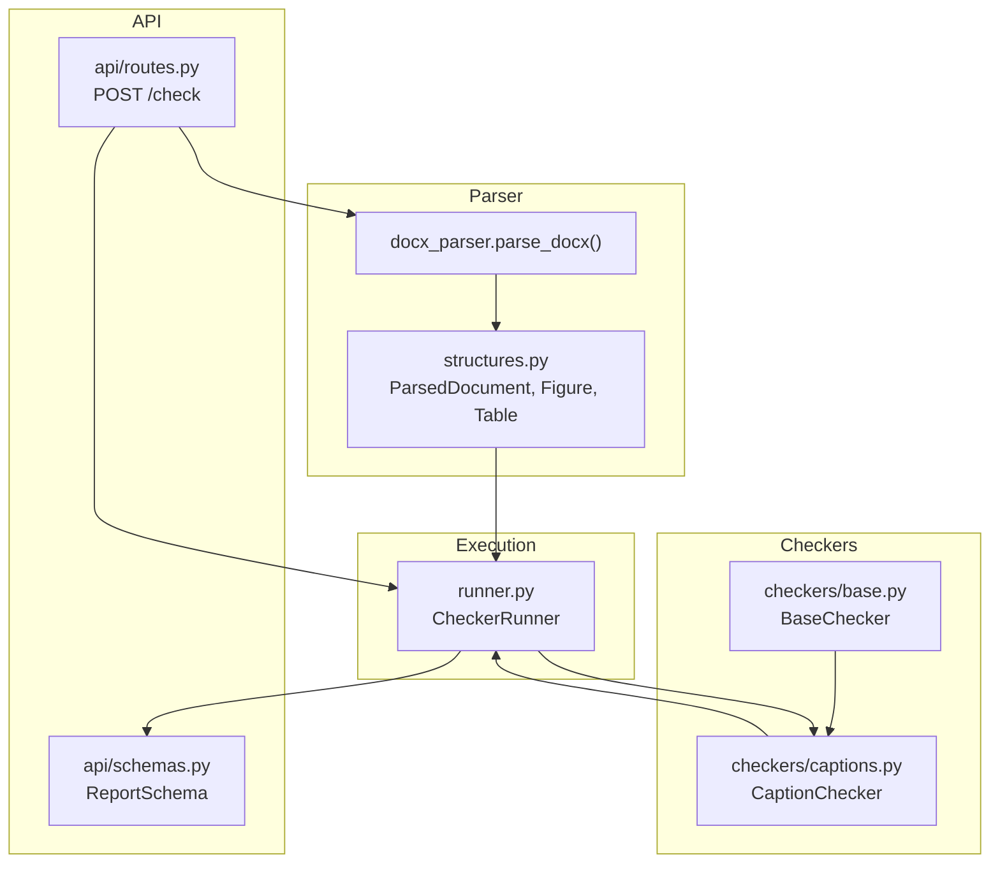
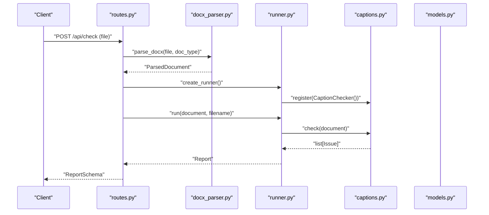
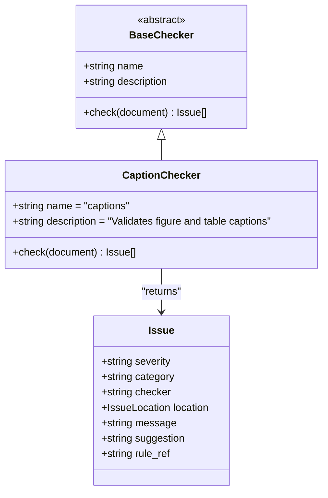
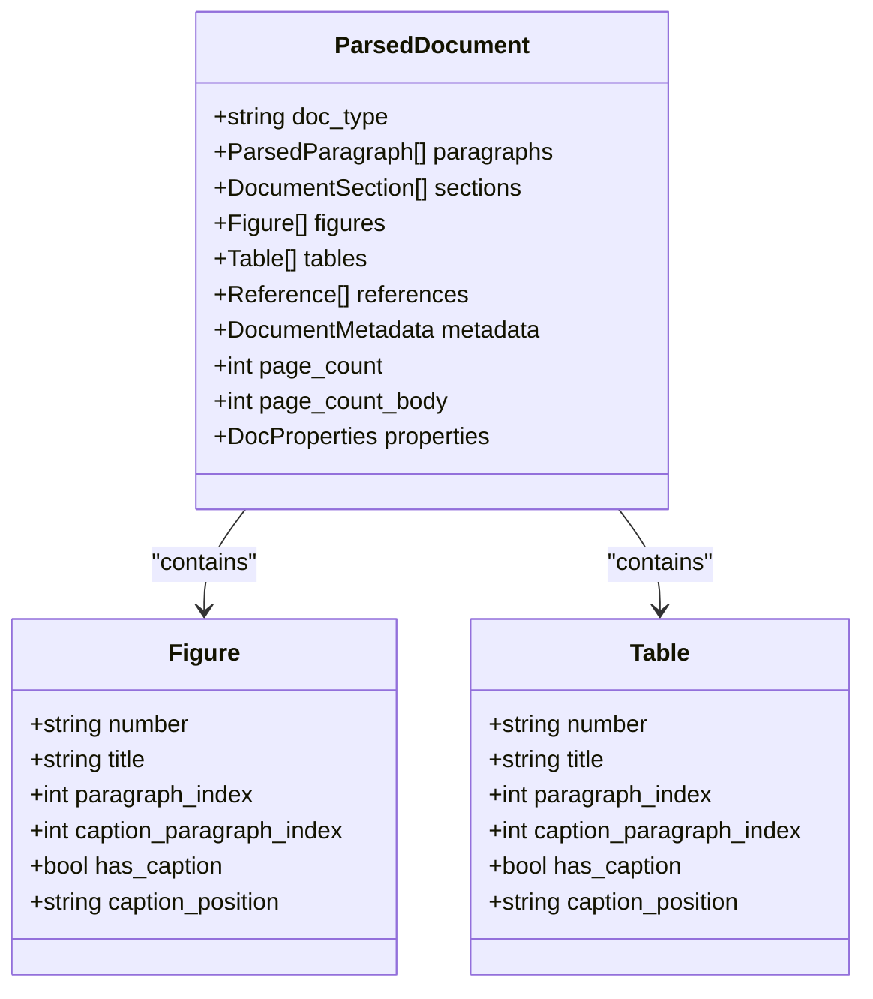
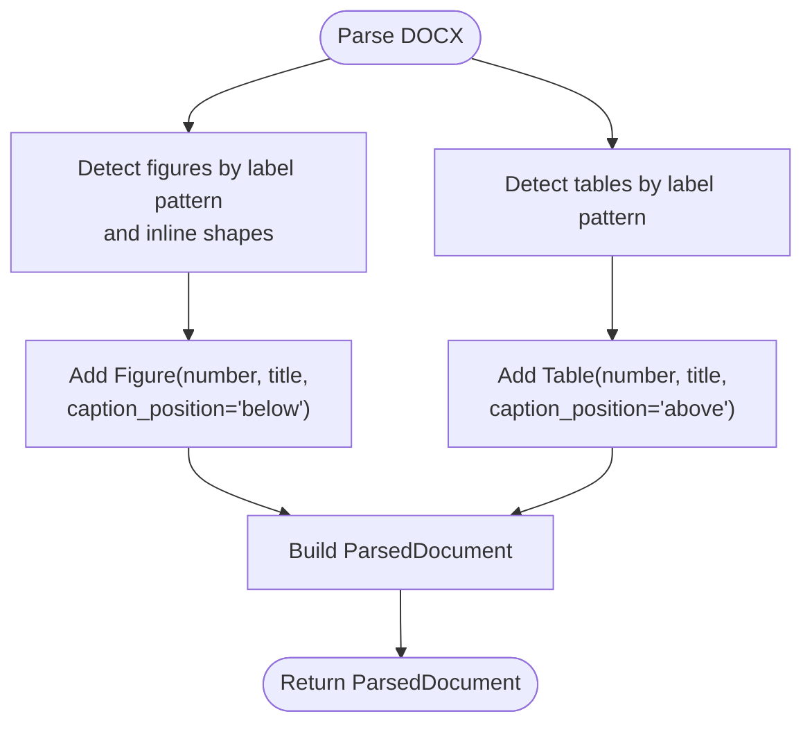
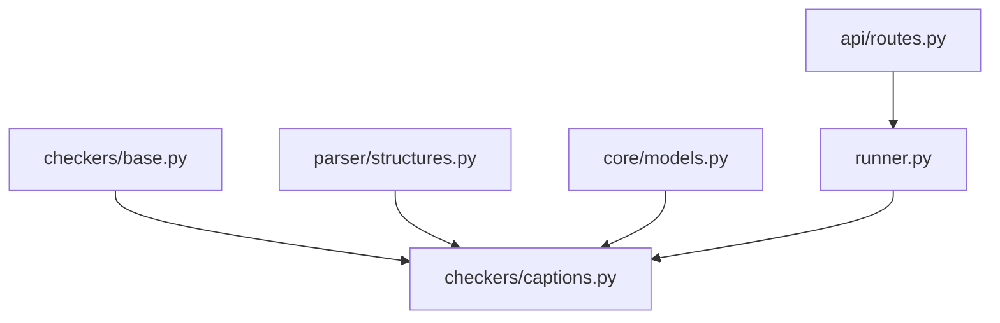

# Caption Validation

<cite>
**Referenced Files in This Document**
- [captions.py](file://backend/app/checkers/captions.py)
- [base.py](file://backend/app/checkers/base.py)
- [docx_parser.py](file://backend/app/parser/docx_parser.py)
- [structures.py](file://backend/app/parser/structures.py)
- [models.py](file://backend/app/core/models.py)
- [runner.py](file://backend/app/runner.py)
- [routes.py](file://backend/app/api/routes.py)
- [schemas.py](file://backend/app/api/schemas.py)
- [config.py](file://backend/app/core/config.py)
</cite>

## Table of Contents
1. [Introduction](#introduction)
2. [Project Structure](#project-structure)
3. [Core Components](#core-components)
4. [Architecture Overview](#architecture-overview)
5. [Detailed Component Analysis](#detailed-component-analysis)
6. [Dependency Analysis](#dependency-analysis)
7. [Performance Considerations](#performance-considerations)
8. [Troubleshooting Guide](#troubleshooting-guide)
9. [Conclusion](#conclusion)

## Introduction
This document describes the caption validation checker designed to enforce academic formatting standards for figures and tables. It focuses on validating caption placement, numbering consistency, title formatting, and cross-referencing accuracy. The checker integrates with the document parsing pipeline to systematically verify visual element labeling compliance and produce actionable reports.

## Project Structure
The caption validation checker is part of a modular checking framework. The relevant components are organized as follows:
- Parser: Extracts document content and visual elements (figures and tables) into structured data.
- Checkers: Implement validation logic for specific categories (e.g., captions).
- Runner: Orchestrates checker execution and aggregates results.
- API: Exposes endpoints to upload documents, trigger validation, and receive reports.

**Diagram sources**
- [docx_parser.py:161-237](file://backend/app/parser/docx_parser.py#L161-L237)
- [structures.py:31-89](file://backend/app/parser/structures.py#L31-L89)
- [base.py:9-16](file://backend/app/checkers/base.py#L9-L16)
- [captions.py:8-13](file://backend/app/checkers/captions.py#L8-L13)
- [runner.py:8-24](file://backend/app/runner.py#L8-L24)
- [routes.py:35-65](file://backend/app/api/routes.py#L35-L65)
- [schemas.py:25-33](file://backend/app/api/schemas.py#L25-L33)

**Section sources**
- [docx_parser.py:161-237](file://backend/app/parser/docx_parser.py#L161-L237)
- [structures.py:31-89](file://backend/app/parser/structures.py#L31-L89)
- [base.py:9-16](file://backend/app/checkers/base.py#L9-L16)
- [captions.py:8-13](file://backend/app/checkers/captions.py#L8-L13)
- [runner.py:8-24](file://backend/app/runner.py#L8-L24)
- [routes.py:35-65](file://backend/app/api/routes.py#L35-L65)
- [schemas.py:25-33](file://backend/app/api/schemas.py#L25-L33)

## Core Components
- CaptionChecker: Implements the abstract BaseChecker interface and defines the checker’s identity and placeholder validation logic. It currently returns no issues and awaits implementation.
- ParsedDocument and element models: Provide structured representation of figures and tables, including numbering, positions, and caption metadata.
- Issue model: Defines the standardized reporting format for validation outcomes.
- CheckerRunner: Executes all registered checkers and aggregates issues into a unified report.
- API routes: Integrate parsing, validation, and reporting into a single endpoint.

Key responsibilities:
- CaptionChecker.check(): Validates captions and returns a list of Issue objects.
- ParsedDocument.figures and ParsedDocument.tables: Supply parsed visual elements for validation.
- Issue: Encapsulates severity, category, location, message, and suggestions.

**Section sources**
- [captions.py:8-13](file://backend/app/checkers/captions.py#L8-L13)
- [base.py:9-16](file://backend/app/checkers/base.py#L9-L16)
- [structures.py:31-89](file://backend/app/parser/structures.py#L31-L89)
- [models.py:18-26](file://backend/app/core/models.py#L18-L26)
- [runner.py:8-24](file://backend/app/runner.py#L8-L24)
- [routes.py:20-27](file://backend/app/api/routes.py#L20-L27)

## Architecture Overview
The caption validation pipeline operates as follows:
1. The API receives a .docx file and delegates to the parser.
2. The parser extracts figures and tables, populating ParsedDocument with numbered elements and caption metadata.
3. The runner invokes CaptionChecker.check() with the parsed document.
4. The checker validates captions and returns issues.
5. The runner aggregates issues and produces a ReportSchema-compatible report.

**Diagram sources**
- [routes.py:35-65](file://backend/app/api/routes.py#L35-L65)
- [docx_parser.py:161-237](file://backend/app/parser/docx_parser.py#L161-L237)
- [runner.py:8-24](file://backend/app/runner.py#L8-L24)
- [captions.py:12-13](file://backend/app/checkers/captions.py#L12-L13)
- [models.py:28-57](file://backend/app/core/models.py#L28-L57)

## Detailed Component Analysis

### CaptionChecker Implementation
CaptionChecker extends BaseChecker and defines:
- name: "captions"
- description: "Validates figure and table captions"
- check(document): Placeholder returning empty list; awaiting implementation.

Validation scope (to be implemented):
- Caption placement: Ensure captions appear immediately adjacent to their respective figures or tables (above/below).
- Numbering consistency: Verify that figure/table numbers match internal references and numbering sequences.
- Title formatting: Enforce consistent capitalization, punctuation, and style for captions.
- Cross-referencing accuracy: Confirm that in-text references correspond to existing captions and numbering.

**Diagram sources**
- [base.py:9-16](file://backend/app/checkers/base.py#L9-L16)
- [captions.py:8-13](file://backend/app/checkers/captions.py#L8-L13)
- [models.py:18-26](file://backend/app/core/models.py#L18-L26)

**Section sources**
- [captions.py:8-13](file://backend/app/checkers/captions.py#L8-L13)
- [base.py:9-16](file://backend/app/checkers/base.py#L9-L16)
- [models.py:18-26](file://backend/app/core/models.py#L18-L26)

### ParsedDocument and Element Models
The parser constructs ParsedDocument with lists of figures and tables. Each element carries:
- number: Numeric identifier (e.g., "1.1")
- title: Caption text
- paragraph_index: Location of the element reference
- caption_paragraph_index: Paragraph index of the caption
- has_caption: Boolean indicating presence of a caption
- caption_position: "above" or "below"

These fields enable the caption checker to:
- Identify captions and their proximity to figures/tables
- Validate numbering consistency across the document
- Verify caption-text relationships

**Diagram sources**
- [structures.py:31-89](file://backend/app/parser/structures.py#L31-L89)

**Section sources**
- [structures.py:31-89](file://backend/app/parser/structures.py#L31-L89)

### Parser Integration for Captions
The parser detects figures and tables and attaches caption metadata:
- Figures: Identified by localized figure labels and inline shape detection; captions are assumed below the figure.
- Tables: Identified by localized table labels; captions are assumed above the table.

**Diagram sources**
- [docx_parser.py:37-65](file://backend/app/parser/docx_parser.py#L37-L65)
- [docx_parser.py:68-84](file://backend/app/parser/docx_parser.py#L68-L84)

**Section sources**
- [docx_parser.py:37-65](file://backend/app/parser/docx_parser.py#L37-L65)
- [docx_parser.py:68-84](file://backend/app/parser/docx_parser.py#L68-L84)

### Validation Rules and Patterns
The following rules define caption validation behavior. These rules are intended to guide the implementation of CaptionChecker.check().

- Caption placement
  - Figures: Caption must be positioned immediately below the figure.
  - Tables: Caption must be positioned immediately above the table.
  - Violations: Misplaced captions produce warnings or errors depending on severity.

- Numbering consistency
  - Numbers must be numeric and follow a hierarchical scheme (e.g., "1", "1.1", "2").
  - Discontinuities or duplicates invalidate references and captions.
  - Cross-section numbering resets should be handled consistently.

- Title formatting
  - Capitalization: First word capitalized; subsequent words lowercase unless proper nouns.
  - Punctuation: Ends with a period; no trailing spaces.
  - Style: Consistent font, size, and alignment with document standards.

- Cross-referencing accuracy
  - In-text references must match existing captions’ numbers.
  - References must not be duplicated or orphaned.
  - Section-local references should be disambiguated when necessary.

Examples of caption formatting errors:
- Misplaced caption: A table caption placed below the table.
- Incorrect numbering: "1.2" appears without "1.1".
- Formatting issues: Missing period, inconsistent capitalization, or incorrect alignment.
- Cross-reference mismatch: "Table 2.1" referenced where "Table 2.2" exists.

Proper caption construction patterns:
- Figure caption: "Figure 1.1. Description of the figure."
- Table caption: "Table 1.1. Description of the table."
- Consistent style: Same font, size, and alignment as other captions.

Resolution strategies:
- Auto-correctable: Fix punctuation and capitalization; adjust caption position.
- Manual correction: Resolve numbering gaps; update cross-references to match existing captions.

[No sources needed since this section provides conceptual guidance]

## Dependency Analysis
The caption validation checker depends on:
- BaseChecker: Provides the interface contract for all checkers.
- ParsedDocument and element models: Supply parsed data for validation.
- Issue model: Standardizes reporting across checkers.
- Runner: Aggregates issues from all checkers.
- API routes: Orchestrate parsing, validation, and reporting.

**Diagram sources**
- [base.py:9-16](file://backend/app/checkers/base.py#L9-L16)
- [captions.py:8-13](file://backend/app/checkers/captions.py#L8-L13)
- [structures.py:31-89](file://backend/app/parser/structures.py#L31-L89)
- [models.py:18-26](file://backend/app/core/models.py#L18-L26)
- [runner.py:8-24](file://backend/app/runner.py#L8-L24)
- [routes.py:20-27](file://backend/app/api/routes.py#L20-L27)

**Section sources**
- [base.py:9-16](file://backend/app/checkers/base.py#L9-L16)
- [captions.py:8-13](file://backend/app/checkers/captions.py#L8-L13)
- [structures.py:31-89](file://backend/app/parser/structures.py#L31-L89)
- [models.py:18-26](file://backend/app/core/models.py#L18-L26)
- [runner.py:8-24](file://backend/app/runner.py#L8-L24)
- [routes.py:20-27](file://backend/app/api/routes.py#L20-L27)

## Performance Considerations
- Parsing cost: The parser scans all paragraphs and inline shapes; keep caption detection efficient by limiting regex scope and avoiding redundant checks.
- Validation cost: The caption checker should iterate through figures and tables once, using precomputed indices and metadata.
- Memory footprint: Avoid storing unnecessary intermediate data; reuse parsed structures.
- Scalability: For large documents, batch processing and early exits on critical failures can improve responsiveness.

[No sources needed since this section provides general guidance]

## Troubleshooting Guide
Common issues and resolutions:
- No issues reported: Ensure CaptionChecker.check() is invoked by the runner and returns a non-empty list when violations are found.
- Incorrect numbering: Verify that figure and table numbering sequences are consistent across sections and that cross-references align with actual captions.
- Misplaced captions: Confirm caption positions ("above"/"below") match detected placements and that captions are adjacent to their elements.
- Formatting inconsistencies: Apply uniform formatting rules and validate punctuation and capitalization.
- API errors: Check file type validation and upload size limits; ensure temporary file cleanup succeeds.

**Section sources**
- [routes.py:40-49](file://backend/app/api/routes.py#L40-L49)
- [routes.py:61-65](file://backend/app/api/routes.py#L61-L65)
- [config.py:6-16](file://backend/app/core/config.py#L6-L16)

## Conclusion
The caption validation checker is a foundational component for enforcing academic formatting standards for figures and tables. While the current implementation is a placeholder, the established architecture and data models provide a robust foundation for implementing comprehensive caption validation, including placement, numbering, formatting, and cross-referencing checks. Integrating these validations into the broader checking pipeline ensures consistent, automated quality assurance for dissertations and research documents.