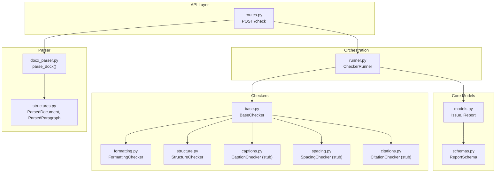
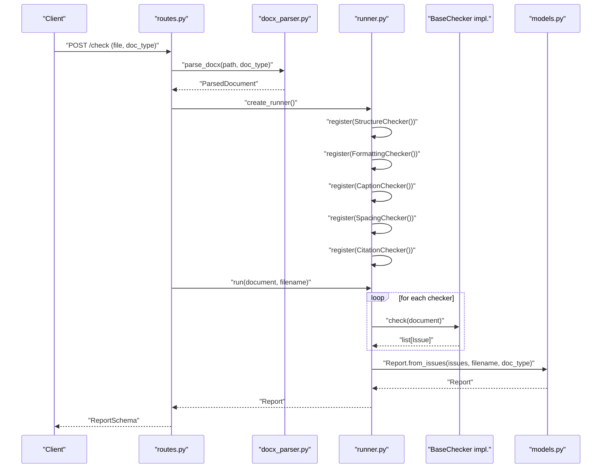
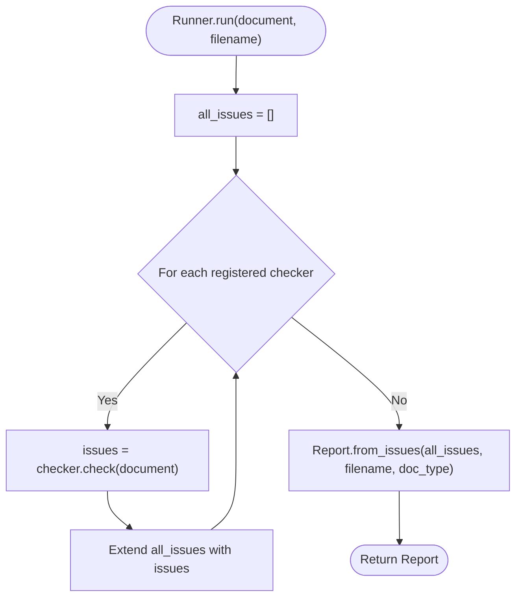
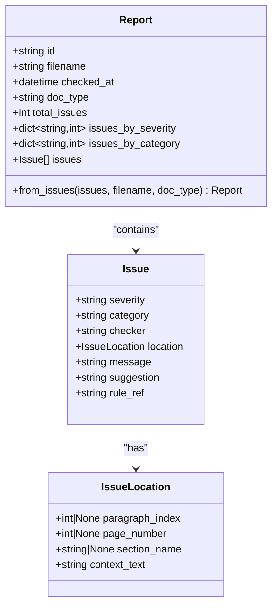
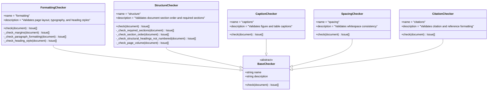
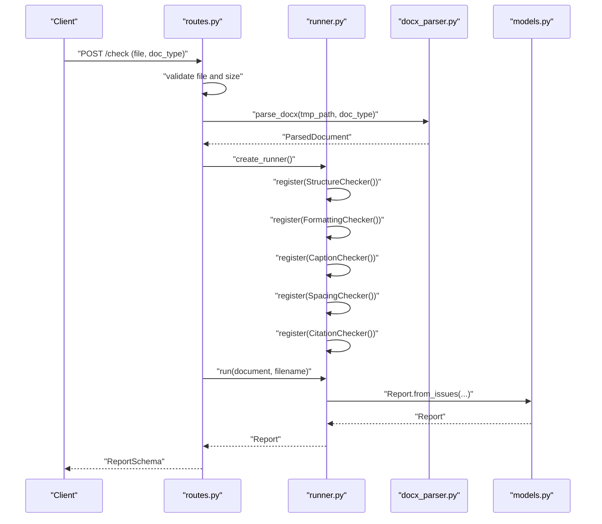
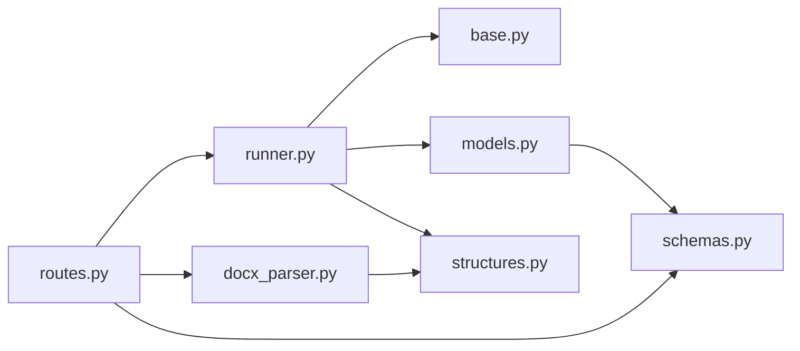

# Checker Architecture

<cite>
**Referenced Files in This Document**
- [base.py](file://backend/app/checkers/base.py)
- [runner.py](file://backend/app/runner.py)
- [routes.py](file://backend/app/api/routes.py)
- [models.py](file://backend/app/core/models.py)
- [structures.py](file://backend/app/parser/structures.py)
- [docx_parser.py](file://backend/app/parser/docx_parser.py)
- [formatting.py](file://backend/app/checkers/formatting.py)
- [structure.py](file://backend/app/checkers/structure.py)
- [captions.py](file://backend/app/checkers/captions.py)
- [spacing.py](file://backend/app/checkers/spacing.py)
- [citations.py](file://backend/app/checkers/citations.py)
- [schemas.py](file://backend/app/api/schemas.py)
- [config.py](file://backend/app/core/config.py)
</cite>

## Table of Contents
1. [Introduction](#introduction)
2. [Project Structure](#project-structure)
3. [Core Components](#core-components)
4. [Architecture Overview](#architecture-overview)
5. [Detailed Component Analysis](#detailed-component-analysis)
6. [Dependency Analysis](#dependency-analysis)
7. [Performance Considerations](#performance-considerations)
8. [Troubleshooting Guide](#troubleshooting-guide)
9. [Conclusion](#conclusion)
10. [Appendices](#appendices)

## Introduction
This document explains the checker architecture used to validate academic dissertations. It focuses on the BaseChecker abstract interface, the plugin-based design pattern, the Runner orchestration, and the standardized Issue reporting format. It also describes how checkers are registered and executed, how ParsedDocument objects carry validation data, and how to implement new checkers that integrate seamlessly with the system.

## Project Structure
The checker system is organized around a small set of cohesive modules:
- Checkers define validation logic and implement a shared BaseChecker interface.
- The Runner orchestrates checker registration and execution.
- The Parser constructs a ParsedDocument from uploaded DOCX files.
- The API layer wires everything together via FastAPI routes.
- Core models define the Issue and Report data contracts.
- Schemas define the API response model.

**Diagram sources**
- [routes.py:35-66](file://backend/app/api/routes.py#L35-L66)
- [runner.py:8-25](file://backend/app/runner.py#L8-L25)
- [docx_parser.py:161-238](file://backend/app/parser/docx_parser.py#L161-L238)
- [structures.py:77-89](file://backend/app/parser/structures.py#L77-L89)
- [base.py:9-17](file://backend/app/checkers/base.py#L9-L17)
- [formatting.py:15-174](file://backend/app/checkers/formatting.py#L15-L174)
- [structure.py:47-148](file://backend/app/checkers/structure.py#L47-L148)
- [captions.py:8-14](file://backend/app/checkers/captions.py#L8-L14)
- [spacing.py:8-14](file://backend/app/checkers/spacing.py#L8-L14)
- [citations.py:8-14](file://backend/app/checkers/citations.py#L8-L14)
- [models.py:17-58](file://backend/app/core/models.py#L17-L58)
- [schemas.py:25-38](file://backend/app/api/schemas.py#L25-L38)

**Section sources**
- [routes.py:1-66](file://backend/app/api/routes.py#L1-L66)
- [runner.py:1-25](file://backend/app/runner.py#L1-L25)
- [docx_parser.py:1-238](file://backend/app/parser/docx_parser.py#L1-L238)
- [structures.py:1-89](file://backend/app/parser/structures.py#L1-L89)
- [base.py:1-17](file://backend/app/checkers/base.py#L1-L17)
- [models.py:1-58](file://backend/app/core/models.py#L1-L58)
- [schemas.py:1-38](file://backend/app/api/schemas.py#L1-L38)

## Core Components
- BaseChecker: Defines the contract for all checkers with a name, description, and a check method that accepts a ParsedDocument and returns a list of Issues.
- CheckerRunner: Holds a registry of BaseChecker instances and executes them in sequence against a ParsedDocument, aggregating results into a Report.
- ParsedDocument: The canonical validation input, containing typed lists of paragraphs, sections, figures, tables, references, metadata, counts, and document properties.
- Issue and Report: Standardized domain models for validation outcomes and aggregated reports, with convenience constructors for building reports from collected issues.
- API routes: Parse uploaded DOCX files, construct a ParsedDocument, instantiate and register checkers in the Runner, and return a Report serialized via ReportSchema.

Key behaviors:
- Parameter passing: All checkers receive a single ParsedDocument argument.
- Standardized output: Each checker returns a list of Issue objects; Runner aggregates and converts to Report.
- Extensibility: Adding a new checker requires subclassing BaseChecker and registering it in the Runner factory.

**Section sources**
- [base.py:9-17](file://backend/app/checkers/base.py#L9-L17)
- [runner.py:8-25](file://backend/app/runner.py#L8-L25)
- [structures.py:77-89](file://backend/app/parser/structures.py#L77-L89)
- [models.py:17-58](file://backend/app/core/models.py#L17-L58)
- [routes.py:20-27](file://backend/app/api/routes.py#L20-L27)

## Architecture Overview
The system follows a plugin-based architecture:
- The API receives a DOCX file and delegates to the parser to produce a ParsedDocument.
- A Runner instance is created and populated with checker instances.
- Each checker performs validations against the ParsedDocument and returns Issue objects.
- The Runner aggregates all issues into a Report and returns it to the client.

**Diagram sources**
- [routes.py:35-66](file://backend/app/api/routes.py#L35-L66)
- [docx_parser.py:161-238](file://backend/app/parser/docx_parser.py#L161-L238)
- [runner.py:8-25](file://backend/app/runner.py#L8-L25)
- [base.py:13-16](file://backend/app/checkers/base.py#L13-L16)
- [models.py:28-58](file://backend/app/core/models.py#L28-L58)

## Detailed Component Analysis

### BaseChecker Interface
- Purpose: Define a uniform contract for all validators.
- Members:
  - name: Human-readable checker identifier.
  - description: Short explanation of the checker’s purpose.
  - check(document): Accepts a ParsedDocument and returns a list of Issue objects.

Implementation pattern:
- Subclasses override check to traverse document.paragraphs, document.sections, and other typed collections.
- Each violation yields a single Issue with severity, category, checker name, location, message, suggestion, and optional rule reference.

**Section sources**
- [base.py:9-17](file://backend/app/checkers/base.py#L9-L17)

### Runner Orchestration
- Responsibilities:
  - Maintain a registry of BaseChecker instances.
  - Execute all registered checkers in order.
  - Aggregate returned issues into a unified Report.
- Execution flow:
  - Iterate registered checkers.
  - Call check(document) on each.
  - Extend the global issues list with each result.
  - Build Report via Report.from_issues with filename and doc_type.

**Diagram sources**
- [runner.py:15-25](file://backend/app/runner.py#L15-L25)
- [models.py:39-58](file://backend/app/core/models.py#L39-L58)

**Section sources**
- [runner.py:8-25](file://backend/app/runner.py#L8-L25)

### ParsedDocument and Validation Inputs
- Purpose: Provide a strongly-typed, structured representation of the parsed DOCX for checkers.
- Key fields:
  - doc_type: Type of document being checked.
  - paragraphs: List of ParsedParagraph with text, style, font, alignment, spacing, and indices.
  - sections: Document sections derived from top-level headings.
  - figures, tables: Detected figures and tables with captions and positions.
  - references: References extracted after a recognized references section.
  - metadata: Title, author, language.
  - page_count, page_count_body: Page estimates.
  - properties: Margins, default fonts, line spacing, page dimensions.

Validation inputs:
- Checkers inspect paragraph attributes (font, size, bold, alignment, line spacing).
- Section ordering and presence are validated using sections and headings.
- Structural constraints (numbering, minimum page volume) leverage metadata and counts.

**Section sources**
- [structures.py:6-89](file://backend/app/parser/structures.py#L6-L89)
- [docx_parser.py:161-238](file://backend/app/parser/docx_parser.py#L161-L238)

### Issue and Report Contracts
- Issue: Severity, category, checker name, location, message, suggestion, optional rule reference.
- IssueLocation: Paragraph index, page number, section name, and context text.
- Report: Unique id, filename, timestamp, doc_type, totals, severity/category counts, and the issues list.
- Report.from_issues: Computes counts and timestamps, returning a normalized Report.

**Diagram sources**
- [models.py:9-58](file://backend/app/core/models.py#L9-L58)

**Section sources**
- [models.py:9-58](file://backend/app/core/models.py#L9-L58)

### Example Checkers and Their Patterns
- FormattingChecker: Validates margins, paragraph formatting, headings, and typography according to standards. Demonstrates:
  - Using ParsedDocument.properties and ParsedDocument.paragraphs.
  - Creating Issue objects with IssueLocation populated from paragraph_index and context_text.
  - Returning a combined list of issues from multiple private validators.
- StructureChecker: Validates required sections, ordering, structural heading numbering, and minimum page volume. Demonstrates:
  - Classification of headings via keyword matching.
  - Ordering validation by mapping headings to required order indices.
  - Threshold-based warnings using doc_type-specific limits.

Stub checkers (placeholders):
- CaptionChecker, SpacingChecker, CitationChecker: Implement BaseChecker but return empty lists for now. They illustrate how to extend the system with minimal effort.

**Diagram sources**
- [base.py:9-17](file://backend/app/checkers/base.py#L9-L17)
- [formatting.py:15-174](file://backend/app/checkers/formatting.py#L15-L174)
- [structure.py:47-148](file://backend/app/checkers/structure.py#L47-L148)
- [captions.py:8-14](file://backend/app/checkers/captions.py#L8-L14)
- [spacing.py:8-14](file://backend/app/checkers/spacing.py#L8-L14)
- [citations.py:8-14](file://backend/app/checkers/citations.py#L8-L14)

**Section sources**
- [formatting.py:15-174](file://backend/app/checkers/formatting.py#L15-L174)
- [structure.py:47-148](file://backend/app/checkers/structure.py#L47-L148)
- [captions.py:8-14](file://backend/app/checkers/captions.py#L8-L14)
- [spacing.py:8-14](file://backend/app/checkers/spacing.py#L8-L14)
- [citations.py:8-14](file://backend/app/checkers/citations.py#L8-L14)

### API Integration and Runner Registration
- The routes module defines a factory that creates a Runner and registers all concrete checkers.
- The POST /check endpoint:
  - Validates file type and size.
  - Writes the uploaded file to a temporary path.
  - Parses the DOCX to a ParsedDocument.
  - Creates and runs the Runner.
  - Returns a Report serialized via ReportSchema.

**Diagram sources**
- [routes.py:35-66](file://backend/app/api/routes.py#L35-L66)
- [runner.py:8-25](file://backend/app/runner.py#L8-L25)
- [docx_parser.py:161-238](file://backend/app/parser/docx_parser.py#L161-L238)
- [models.py:28-58](file://backend/app/core/models.py#L28-L58)

**Section sources**
- [routes.py:20-27](file://backend/app/api/routes.py#L20-L27)
- [routes.py:35-66](file://backend/app/api/routes.py#L35-L66)

## Dependency Analysis
- Runner depends on BaseChecker, Issue, Report, and ParsedDocument.
- Checkers depend on BaseChecker, Issue, IssueLocation, and ParsedDocument.
- API routes depend on Runner, Parser, and Schemas.
- Parser depends on structures and external docx library.
- Report.from_issues depends on Issue and datetime.

**Diagram sources**
- [routes.py:1-66](file://backend/app/api/routes.py#L1-L66)
- [runner.py:1-25](file://backend/app/runner.py#L1-L25)
- [base.py:1-17](file://backend/app/checkers/base.py#L1-L17)
- [models.py:1-58](file://backend/app/core/models.py#L1-L58)
- [structures.py:1-89](file://backend/app/parser/structures.py#L1-L89)
- [docx_parser.py:1-238](file://backend/app/parser/docx_parser.py#L1-L238)
- [schemas.py:1-38](file://backend/app/api/schemas.py#L1-L38)

**Section sources**
- [routes.py:1-66](file://backend/app/api/routes.py#L1-L66)
- [runner.py:1-25](file://backend/app/runner.py#L1-L25)
- [base.py:1-17](file://backend/app/checkers/base.py#L1-L17)
- [models.py:1-58](file://backend/app/core/models.py#L1-L58)
- [structures.py:1-89](file://backend/app/parser/structures.py#L1-L89)
- [docx_parser.py:1-238](file://backend/app/parser/docx_parser.py#L1-L238)
- [schemas.py:1-38](file://backend/app/api/schemas.py#L1-L38)

## Performance Considerations
- Parsing cost: The DOCX parser traverses all paragraphs and sections; keep doc_type accurate to avoid unnecessary work.
- Checker execution: Each checker iterates over document.paragraphs and document.sections. Keep validation logic efficient and short-circuit where appropriate.
- Aggregation: Runner concatenates issues linearly; ensure each checker returns only relevant issues to minimize downstream filtering.
- Memory: Large documents increase memory usage during parsing and validation; enforce upload size limits via configuration.

[No sources needed since this section provides general guidance]

## Troubleshooting Guide
Common issues and resolutions:
- File type errors: Only .docx uploads are accepted; ensure clients send the correct format.
- File size errors: Exceeding the configured maximum triggers a 400 error; adjust settings if needed.
- Parsing failures: Exceptions during parsing surface as 422 errors; verify DOCX integrity and supported styles.
- Empty reports: If all checkers return no issues, the report will be valid but empty; confirm that checkers are registered and that the document contains expected content.
- Location precision: IssueLocation supports paragraph_index and context_text; use these to help users locate violations quickly.

Operational configuration:
- Maximum upload size and CORS origins are configurable via settings.

**Section sources**
- [routes.py:40-66](file://backend/app/api/routes.py#L40-L66)
- [config.py:6-17](file://backend/app/core/config.py#L6-L17)

## Conclusion
The checker architecture centers on a clean BaseChecker interface and a flexible Runner that orchestrates plugin-style checkers. By passing a single ParsedDocument and returning standardized Issue objects, the system enables modular, extensible validation logic. The API layer integrates parsing, orchestration, and reporting into a cohesive workflow suitable for automated dissertation checking.

[No sources needed since this section summarizes without analyzing specific files]

## Appendices

### How to Implement a New Checker
Steps:
1. Create a new class that inherits from BaseChecker.
2. Set name and description.
3. Implement check(document) to traverse ParsedDocument and collect Issue objects.
4. Register the checker instance in the Runner factory within the API routes.
5. Optionally, add a dedicated schema or extend ReportSchema if the checker introduces new categories or severities.

Integration points:
- Add imports in routes.py for the new checker class.
- Instantiate and register the checker in the create_runner factory.
- Ensure the new checker handles None values gracefully when accessing optional fields in ParsedDocument.

**Section sources**
- [base.py:9-17](file://backend/app/checkers/base.py#L9-L17)
- [routes.py:20-27](file://backend/app/api/routes.py#L20-L27)