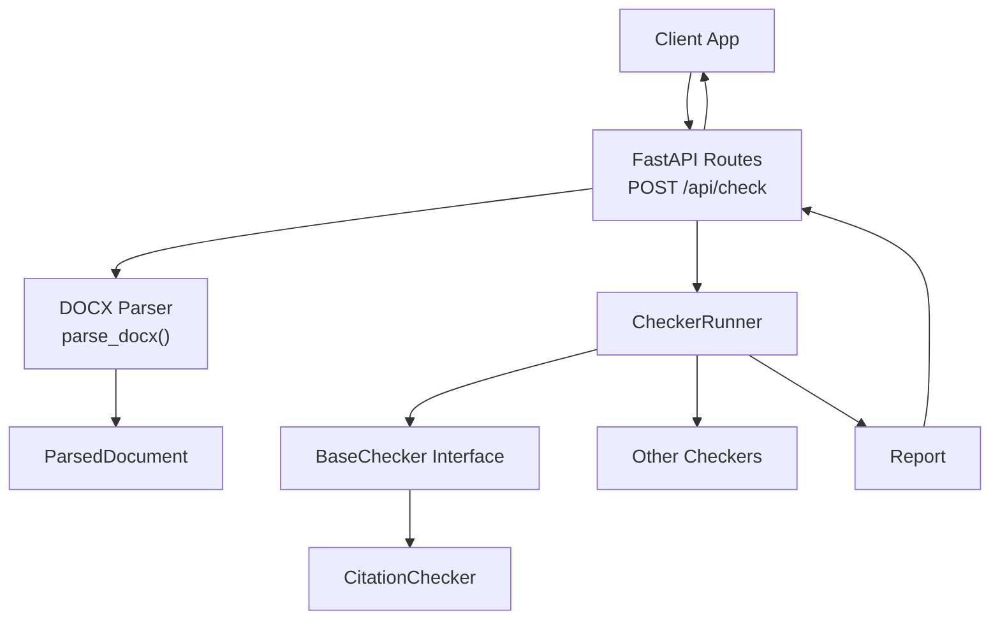
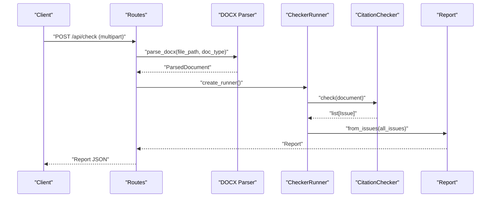
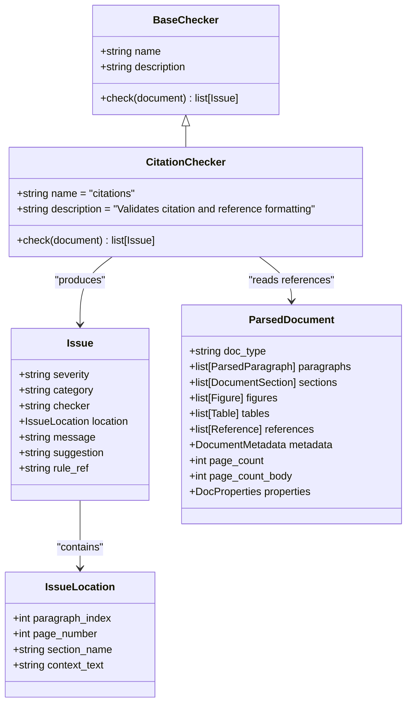
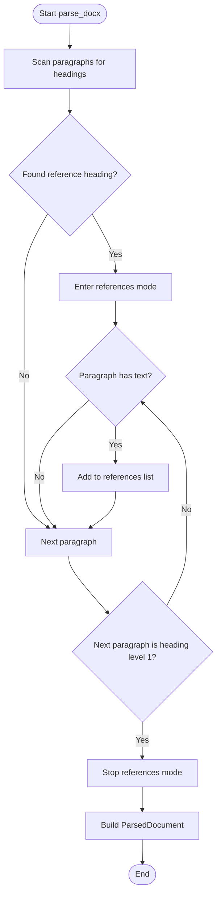
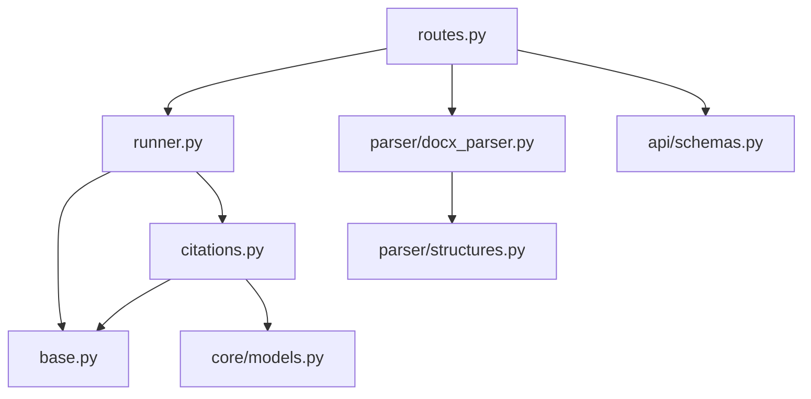

# Citation Validation

<cite>
**Referenced Files in This Document**
- [citations.py](file://backend/app/checkers/citations.py)
- [base.py](file://backend/app/checkers/base.py)
- [docx_parser.py](file://backend/app/parser/docx_parser.py)
- [structures.py](file://backend/app/parser/structures.py)
- [routes.py](file://backend/app/api/routes.py)
- [runner.py](file://backend/app/runner.py)
- [models.py](file://backend/app/core/models.py)
- [schemas.py](file://backend/app/api/schemas.py)
- [design.md](file://docs/design.md)
- [plan.md](file://docs/plan.md)
- [README.md](file://README.md)
</cite>

## Table of Contents
1. [Introduction](#introduction)
2. [Project Structure](#project-structure)
3. [Core Components](#core-components)
4. [Architecture Overview](#architecture-overview)
5. [Detailed Component Analysis](#detailed-component-analysis)
6. [Dependency Analysis](#dependency-analysis)
7. [Performance Considerations](#performance-considerations)
8. [Troubleshooting Guide](#troubleshooting-guide)
9. [Conclusion](#conclusion)

## Introduction
This document describes the citation validation checker that enforces reference management and bibliography compliance according to GOST 7.32-2017. It explains how the checker analyzes citation patterns, identifies reference gaps, and ensures proper citation formatting throughout the document. The checker integrates with the document parsing pipeline and participates in the systematic approach to citation quality assurance.

## Project Structure
The citation validation checker is part of a plugin-based architecture where each checker implements a common interface and is orchestrated by a central runner. The citation checker consumes a parsed document model containing extracted paragraphs, sections, figures, tables, and references. The API endpoint parses the uploaded .docx, constructs a ParsedDocument, and runs all registered checkers to produce a unified report.

**Diagram sources**
- [routes.py:35-66](file://backend/app/api/routes.py#L35-L66)
- [docx_parser.py:161-238](file://backend/app/parser/docx_parser.py#L161-L238)
- [runner.py:8-25](file://backend/app/runner.py#L8-L25)
- [base.py:9-17](file://backend/app/checkers/base.py#L9-L17)
- [citations.py:8-14](file://backend/app/checkers/citations.py#L8-L14)

**Section sources**
- [README.md:1-195](file://README.md#L1-L195)
- [design.md:188-263](file://docs/design.md#L188-L263)
- [plan.md:486-558](file://docs/plan.md#L486-L558)

## Core Components
- CitationChecker: Implements the BaseChecker interface and is responsible for validating citation and reference formatting. Currently a stub awaiting implementation.
- BaseChecker: Defines the contract for all checkers, requiring a name, description, and a check method that accepts a ParsedDocument and returns a list of Issues.
- DOCX Parser: Extracts structured data from .docx files, including paragraphs, sections, figures, tables, and references. References are identified after recognized reference headings.
- ParsedDocument: Aggregates all parsed elements, including a references list used by the citation checker.
- CheckerRunner: Orchestrates checker execution and aggregates results into a Report.
- Issue and Report models: Define the structure for reporting findings with severity, category, location, message, suggestion, and rule reference.

Key integration points:
- The API registers CitationChecker alongside other checkers.
- The parser populates the references list used by the citation checker.
- The runner collects issues from all checkers and builds a standardized report.

**Section sources**
- [citations.py:8-14](file://backend/app/checkers/citations.py#L8-L14)
- [base.py:9-17](file://backend/app/checkers/base.py#L9-L17)
- [docx_parser.py:87-105](file://backend/app/parser/docx_parser.py#L87-L105)
- [structures.py:77-89](file://backend/app/parser/structures.py#L77-L89)
- [runner.py:8-25](file://backend/app/runner.py#L8-L25)
- [models.py:9-58](file://backend/app/core/models.py#L9-L58)
- [routes.py:20-27](file://backend/app/api/routes.py#L20-L27)

## Architecture Overview
The citation validation operates within the established plugin architecture. The API endpoint triggers parsing, then sequentially invokes each checker via the runner. The citation checker accesses the references list and performs validations defined by GOST 7.32-2017.

**Diagram sources**
- [routes.py:35-66](file://backend/app/api/routes.py#L35-L66)
- [docx_parser.py:161-238](file://backend/app/parser/docx_parser.py#L161-L238)
- [runner.py:15-25](file://backend/app/runner.py#L15-L25)
- [citations.py:12-13](file://backend/app/checkers/citations.py#L12-L13)

## Detailed Component Analysis

### CitationChecker Implementation Plan
The CitationChecker currently implements the BaseChecker interface and returns an empty list pending full implementation. The design specification outlines the validation rules aligned with GOST 7.32-2017.

Validation rules (as defined in the design):
- In-text citation format consistency
- Every in-text citation has a matching reference entry
- Every reference entry is cited at least once
- Reference list: alphabetical order
- Reference list: consistent formatting style

Integration points:
- Consumes ParsedDocument.references for reference list validation.
- Uses the shared Issue model for reporting findings with severity, category, location, message, suggestion, and rule reference.

**Diagram sources**
- [base.py:9-17](file://backend/app/checkers/base.py#L9-L17)
- [citations.py:8-14](file://backend/app/checkers/citations.py#L8-L14)
- [models.py:10-26](file://backend/app/core/models.py#L10-L26)
- [structures.py:77-89](file://backend/app/parser/structures.py#L77-L89)

**Section sources**
- [citations.py:8-14](file://backend/app/checkers/citations.py#L8-L14)
- [design.md:252-263](file://docs/design.md#L252-L263)
- [plan.md:486-558](file://docs/plan.md#L486-L558)

### Reference Detection and Extraction
The DOCX parser identifies reference entries after recognized reference headings and stores them in the references list. This provides the citation checker with the necessary data to validate reference completeness and formatting.

Reference detection logic:
- Scans paragraphs for headings indicating the start of the reference list.
- Continues collecting non-empty paragraphs until encountering another top-level heading.
- Stores each collected reference as a Reference item with text and paragraph index.

**Diagram sources**
- [docx_parser.py:87-105](file://backend/app/parser/docx_parser.py#L87-L105)

**Section sources**
- [docx_parser.py:87-105](file://backend/app/parser/docx_parser.py#L87-L105)
- [structures.py:51-55](file://backend/app/parser/structures.py#L51-L55)

### Citation Matching and Gap Detection
The citation checker will analyze citation patterns and identify gaps by comparing in-text citations with the reference list. The design specifies that every in-text citation must have a matching reference entry, and every reference entry must be cited at least once.

Processing approach:
- Extract in-text citations from document paragraphs.
- Match citations to the references list.
- Flag unmatched citations and uncited references as issues.

Note: The current CitationChecker stub returns an empty list. The implementation will populate issues using the shared Issue model with appropriate severity, category, location, message, suggestion, and rule reference.

**Section sources**
- [design.md:258-262](file://docs/design.md#L258-L262)
- [citations.py:12-13](file://backend/app/checkers/citations.py#L12-L13)
- [models.py:18-26](file://backend/app/core/models.py#L18-L26)

### Bibliography Compliance and Formatting
The citation checker will enforce reference list compliance including alphabetical ordering and consistent formatting style. The parser already collects references after the reference heading, enabling the checker to validate list structure and formatting consistency.

Best practices for reference management:
- Maintain a single, alphabetically ordered reference list after the dedicated reference heading.
- Ensure consistent formatting style across all references.
- Avoid orphaned references (uncited) and missing citations.

**Section sources**
- [design.md:261-262](file://docs/design.md#L261-L262)
- [docx_parser.py:87-105](file://backend/app/parser/docx_parser.py#L87-L105)

## Dependency Analysis
The citation checker depends on the shared contracts and models, and integrates with the parser and runner. The API endpoint registers the CitationChecker among other checkers.

**Diagram sources**
- [routes.py:20-27](file://backend/app/api/routes.py#L20-L27)
- [runner.py:8-25](file://backend/app/runner.py#L8-L25)
- [base.py:3-6](file://backend/app/checkers/base.py#L3-L6)
- [citations.py:3-5](file://backend/app/checkers/citations.py#L3-L5)
- [models.py:3-6](file://backend/app/core/models.py#L3-L6)
- [docx_parser.py:6-9](file://backend/app/parser/docx_parser.py#L6-L9)
- [structures.py:3-9](file://backend/app/parser/structures.py#L3-L9)
- [schemas.py:3-6](file://backend/app/api/schemas.py#L3-L6)

**Section sources**
- [routes.py:20-27](file://backend/app/api/routes.py#L20-L27)
- [runner.py:8-25](file://backend/app/runner.py#L8-L25)
- [citations.py:3-5](file://backend/app/checkers/citations.py#L3-L5)
- [docx_parser.py:6-9](file://backend/app/parser/docx_parser.py#L6-L9)
- [structures.py:3-9](file://backend/app/parser/structures.py#L3-L9)
- [models.py:3-6](file://backend/app/core/models.py#L3-L6)
- [schemas.py:3-6](file://backend/app/api/schemas.py#L3-L6)

## Performance Considerations
- Citation matching complexity: The citation checker will iterate over paragraphs to extract citations and compare against the references list. To maintain performance, avoid redundant scans and leverage efficient lookup structures for citations and references.
- Reference list size: Large reference lists increase processing time. Consider batching or indexing strategies if performance becomes a concern.
- Memory usage: The ParsedDocument holds all extracted elements. Keep only necessary data during checks to minimize memory footprint.
- Scalability: The runner executes checkers sequentially. For future enhancements, consider parallelizing independent checks while preserving deterministic reporting.

## Troubleshooting Guide
Common issues and resolutions:
- Empty citation checker output: The CitationChecker stub returns an empty list. Implement the check method to analyze citations and references.
- Missing references: Ensure the parser detects the reference heading and collects subsequent paragraphs. Verify that the reference list is populated in the ParsedDocument.
- Incorrect issue reporting: Use the shared Issue model with accurate severity, category, location, message, suggestion, and rule reference to ensure meaningful reports.
- API registration: Confirm that CitationChecker is registered in the runner within the API routes.

**Section sources**
- [citations.py:12-13](file://backend/app/checkers/citations.py#L12-L13)
- [docx_parser.py:87-105](file://backend/app/parser/docx_parser.py#L87-L105)
- [runner.py:15-25](file://backend/app/runner.py#L15-L25)
- [routes.py:20-27](file://backend/app/api/routes.py#L20-L27)
- [models.py:18-26](file://backend/app/core/models.py#L18-L26)

## Conclusion
The citation validation checker is a planned component designed to enforce GOST 7.32-2017 compliance for citation and reference formatting. It will integrate seamlessly with the existing plugin architecture, leveraging the shared models and parser to detect reference gaps, validate citation accuracy, and ensure bibliography consistency. Once implemented, it will contribute to a robust, systematic approach to citation quality assurance within the dissertation checking service.