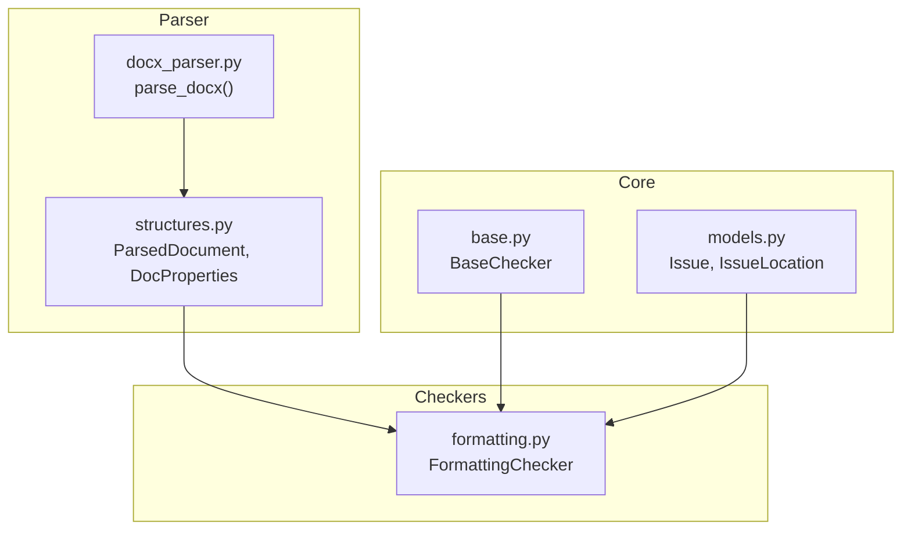
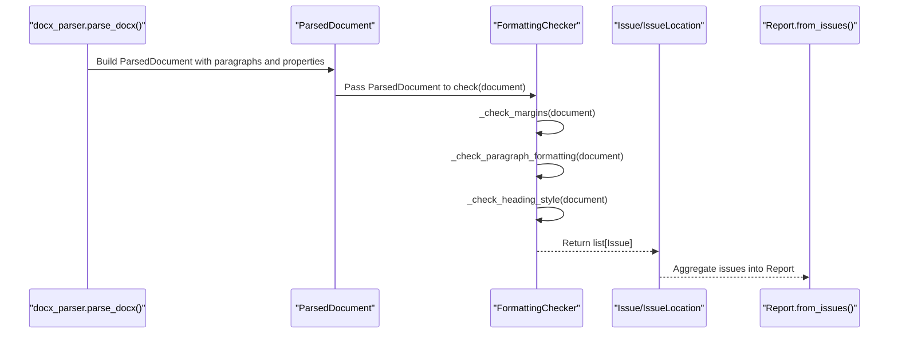
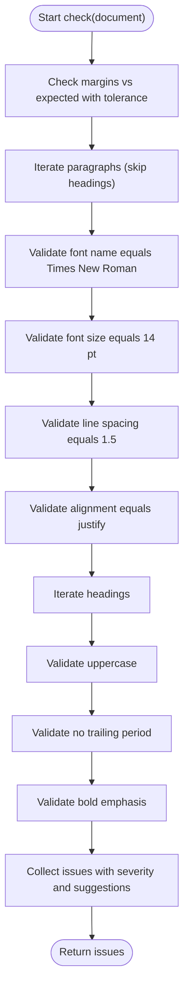
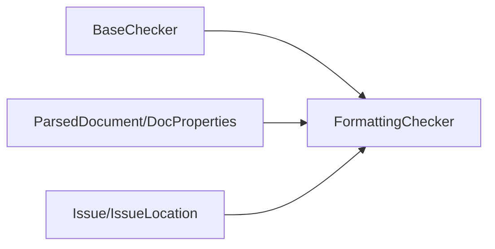

# Formatting Validation

<cite>
**Referenced Files in This Document**
- [formatting.py](file://backend/app/checkers/formatting.py)
- [structures.py](file://backend/app/parser/structures.py)
- [docx_parser.py](file://backend/app/parser/docx_parser.py)
- [models.py](file://backend/app/core/models.py)
- [base.py](file://backend/app/checkers/base.py)
- [test_formatting.py](file://backend/tests/test_formatting.py)
- [conftest.py](file://backend/tests/conftest.py)
- [design.md](file://docs/design.md)
- [README.md](file://README.md)
</cite>

## Table of Contents
1. [Introduction](#introduction)
2. [Project Structure](#project-structure)
3. [Core Components](#core-components)
4. [Architecture Overview](#architecture-overview)
5. [Detailed Component Analysis](#detailed-component-analysis)
6. [Dependency Analysis](#dependency-analysis)
7. [Performance Considerations](#performance-considerations)
8. [Troubleshooting Guide](#troubleshooting-guide)
9. [Conclusion](#conclusion)
10. [Appendices](#appendices)

## Introduction
This document describes the formatting validation checker that enforces typography, margins, line spacing, and text formatting according to GOST 7.32-2017 requirements. It explains how the checker analyzes parsed document structures, detects deviations from standards, and categorizes formatting issues. It also outlines proper formatting guidelines, common violations, and automated correction suggestions, along with the integration approach across the system.

## Project Structure
The formatting checker is part of a modular checker framework. It consumes a parsed document model produced by the DOCX parser and emits standardized issues for reporting.

**Diagram sources**
- [docx_parser.py:161-238](file://backend/app/parser/docx_parser.py#L161-L238)
- [structures.py:77-89](file://backend/app/parser/structures.py#L77-L89)
- [base.py:9-17](file://backend/app/checkers/base.py#L9-L17)
- [models.py:17-26](file://backend/app/core/models.py#L17-L26)
- [formatting.py:15-24](file://backend/app/checkers/formatting.py#L15-L24)

**Section sources**
- [README.md:169-195](file://README.md#L169-L195)
- [design.md:205-222](file://docs/design.md#L205-L222)

## Core Components
- FormattingChecker: Implements validation rules for margins, typography, line spacing, alignment, and heading style per GOST 7.32-2017.
- ParsedDocument and DocProperties: Data structures representing parsed document metadata and paragraph-level formatting attributes.
- Issue and IssueLocation: Standardized reporting model for captured issues.

Key responsibilities:
- Validate page margins against expected values with tolerance.
- Validate body text font family, size, line spacing, and alignment.
- Validate headings for case, punctuation, and emphasis.
- Emit categorized issues with severity, location, and suggestions.

**Section sources**
- [formatting.py:15-24](file://backend/app/checkers/formatting.py#L15-L24)
- [structures.py:77-89](file://backend/app/parser/structures.py#L77-L89)
- [models.py:17-26](file://backend/app/core/models.py#L17-L26)

## Architecture Overview
The checker integrates with the parsed document pipeline and produces issues consumed by the reporting system.

**Diagram sources**
- [docx_parser.py:161-238](file://backend/app/parser/docx_parser.py#L161-L238)
- [formatting.py:19-24](file://backend/app/checkers/formatting.py#L19-L24)
- [models.py:28-58](file://backend/app/core/models.py#L28-L58)

## Detailed Component Analysis

### FormattingChecker
Implements validation logic across three areas:
- Margins: Compares parsed margins to expected values with tolerance.
- Paragraph formatting: Validates font, size, line spacing, and alignment for non-heading paragraphs.
- Heading style: Validates casing, punctuation, and emphasis for headings.

Validation thresholds and expectations:
- Expected font: Times New Roman
- Expected font size: 14 pt
- Expected line spacing: 1.5
- Margins: left 3.0 cm, right 1.0 cm, top 2.0 cm, bottom 2.0 cm; tolerance ±0.2 cm
- Alignment: justified for body text
- Headings: uppercase, no trailing period, bold emphasis

Severity and categorization:
- Errors: typography, spacing, margins, heading punctuation/emphasis
- Warnings: alignment, heading case

Issue reporting:
- Uses IssueLocation with paragraph_index and context_text for precise localization.
- Provides actionable suggestions and rule references.

Common violations and corrections:
- Wrong font family or size: change to Times New Roman 14 pt.
- Non-justified alignment: set alignment to justify.
- Incorrect line spacing: set to 1.5.
- Incorrect margins: adjust page layout to expected values within tolerance.
- Headings not uppercase: convert to uppercase.
- Headings ending with a period: remove the trailing period.
- Headings not bold: apply bold formatting.

Integration with parsed structures:
- Reads DocProperties for margins.
- Iterates ParsedParagraph for font, size, line spacing, alignment, and heading flags.

**Section sources**
- [formatting.py:8-12](file://backend/app/checkers/formatting.py#L8-L12)
- [formatting.py:26-46](file://backend/app/checkers/formatting.py#L26-L46)
- [formatting.py:48-118](file://backend/app/checkers/formatting.py#L48-L118)
- [formatting.py:120-173](file://backend/app/checkers/formatting.py#L120-L173)

### ParsedDocument and DocProperties
ParsedDocument aggregates:
- doc_type, metadata, page counts
- paragraphs: list of ParsedParagraph
- sections, figures, tables, references
- properties: DocProperties

DocProperties captures:
- Margins in cm
- Default font name and size
- Page dimensions

ParsedParagraph fields validated by the checker:
- font_name, font_size, bold
- alignment, line_spacing
- is_heading, heading_level
- paragraph_index for location

**Section sources**
- [structures.py:77-89](file://backend/app/parser/structures.py#L77-L89)
- [structures.py:6-20](file://backend/app/parser/structures.py#L6-L20)
- [structures.py:65-75](file://backend/app/parser/structures.py#L65-L75)

### DOCX Parser Integration
The parser extracts:
- Margins from section settings and converts to cm
- Paragraph-level font, size, bold, alignment, line spacing, first-line indent, and page break markers
- Headings by style detection
- Sections, figures, tables, and references

These parsed attributes feed the FormattingChecker’s validations.

**Section sources**
- [docx_parser.py:126-151](file://backend/app/parser/docx_parser.py#L126-L151)
- [docx_parser.py:161-238](file://backend/app/parser/docx_parser.py#L161-L238)

### Issue Reporting Model
Issues include:
- severity, category, checker name
- location with paragraph_index and context_text
- message and suggestion
- optional rule reference

Reports aggregate issues by severity and category.

**Section sources**
- [models.py:17-26](file://backend/app/core/models.py#L17-L26)
- [models.py:28-58](file://backend/app/core/models.py#L28-L58)

### Base Checker Interface
All checkers inherit from BaseChecker and implement a unified check method returning a list of issues.

**Section sources**
- [base.py:9-17](file://backend/app/checkers/base.py#L9-L17)

### Validation Flow and Decision Logic

**Diagram sources**
- [formatting.py:19-24](file://backend/app/checkers/formatting.py#L19-L24)
- [formatting.py:26-46](file://backend/app/checkers/formatting.py#L26-L46)
- [formatting.py:48-118](file://backend/app/checkers/formatting.py#L48-L118)
- [formatting.py:120-173](file://backend/app/checkers/formatting.py#L120-L173)

## Dependency Analysis
The checker depends on:
- ParsedDocument and DocProperties for document metadata and paragraph attributes
- Issue and IssueLocation for reporting
- BaseChecker for the checker contract

**Diagram sources**
- [base.py:9-17](file://backend/app/checkers/base.py#L9-L17)
- [formatting.py:3-5](file://backend/app/checkers/formatting.py#L3-L5)
- [models.py:17-26](file://backend/app/core/models.py#L17-L26)

**Section sources**
- [formatting.py:3-5](file://backend/app/checkers/formatting.py#L3-L5)
- [base.py:9-17](file://backend/app/checkers/base.py#L9-L17)
- [models.py:17-26](file://backend/app/core/models.py#L17-L26)

## Performance Considerations
- Single-pass validation: The checker iterates through paragraphs and properties once per validation group, resulting in O(n) complexity relative to the number of paragraphs.
- Early filtering: Headings are skipped during body text validations to reduce redundant checks.
- Numeric tolerances: Margin and spacing comparisons use small tolerances to avoid false positives from minor differences.

[No sources needed since this section provides general guidance]

## Troubleshooting Guide
Common issues and resolutions:
- Margins off by small amounts: Adjust page layout settings to meet expected values within tolerance.
- Font or size mismatches: Change to Times New Roman 14 pt.
- Line spacing not 1.5: Set line spacing consistently across paragraphs.
- Alignment not justified: Apply justify alignment to body text.
- Headings not uppercase: Convert to uppercase.
- Headings ending with periods: Remove trailing periods.
- Headings not bold: Apply bold formatting.

Automated correction suggestions:
- Use the suggestion fields in issues to guide formatting adjustments.
- For margins, update page layout settings.
- For typography, select the expected font and size.
- For headings, apply uppercase conversion and bold formatting.

Verification:
- Unit tests confirm that correct formatting yields no errors and incorrect formatting triggers warnings or errors as appropriate.

**Section sources**
- [test_formatting.py:13-26](file://backend/tests/test_formatting.py#L13-L26)
- [test_formatting.py:27-44](file://backend/tests/test_formatting.py#L27-L44)
- [test_formatting.py:45-54](file://backend/tests/test_formatting.py#L45-L54)
- [test_formatting.py:55-63](file://backend/tests/test_formatting.py#L55-L63)
- [test_formatting.py:64-73](file://backend/tests/test_formatting.py#L64-L73)
- [test_formatting.py:74-83](file://backend/tests/test_formatting.py#L74-L83)
- [test_formatting.py:84-92](file://backend/tests/test_formatting.py#L84-L92)

## Conclusion
The formatting validation checker systematically enforces GOST 7.32-2017 typography and layout requirements by validating margins, font specifications, line spacing, alignment, and heading styles. It integrates seamlessly with the parsed document model and produces standardized, actionable issues for remediation. The modular design allows future extensions to additional formatting rules while maintaining consistency with the broader checker framework.

[No sources needed since this section summarizes without analyzing specific files]

## Appendices

### GOST 7.32-2017 References
- Typography and layout rules are documented in the design document and referenced by rule sections in issues.

**Section sources**
- [design.md:205-222](file://docs/design.md#L205-L222)

### Test Fixtures and Helpers
- Test fixtures provide convenient constructors for ParsedParagraph and ParsedDocument to simulate various formatting scenarios.

**Section sources**
- [conftest.py:10-31](file://backend/tests/conftest.py#L10-L31)
- [conftest.py:34-57](file://backend/tests/conftest.py#L34-L57)