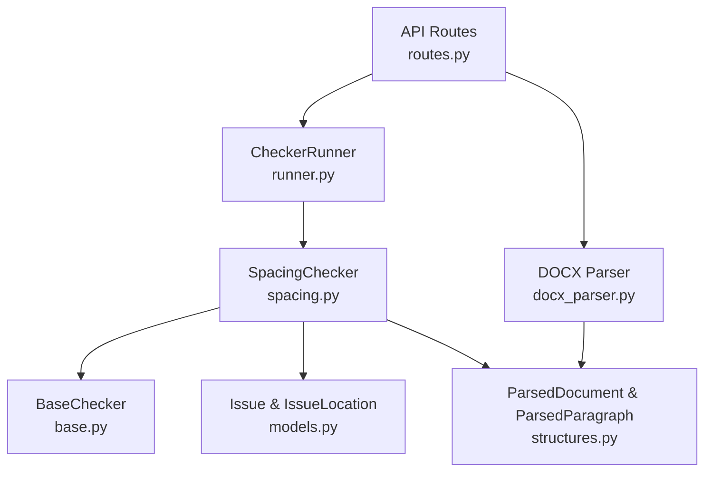
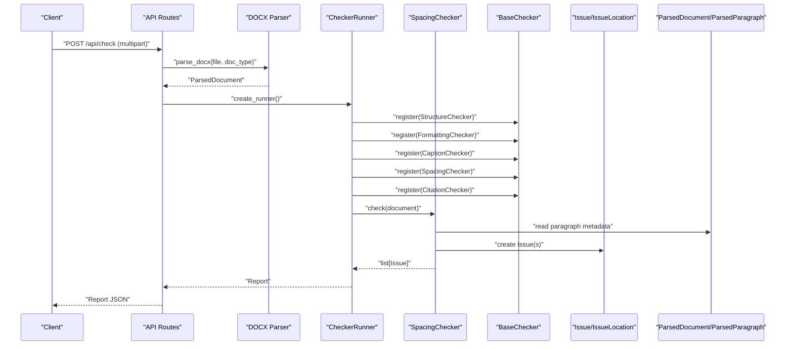
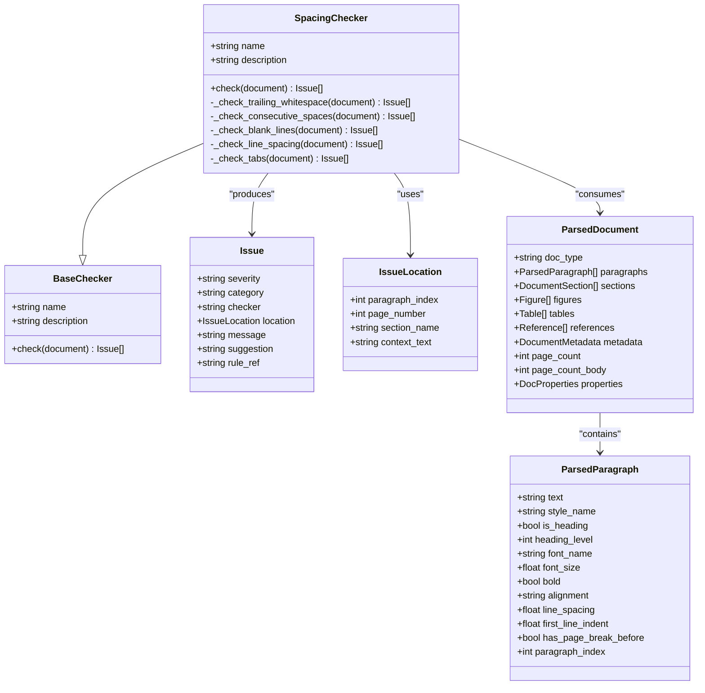
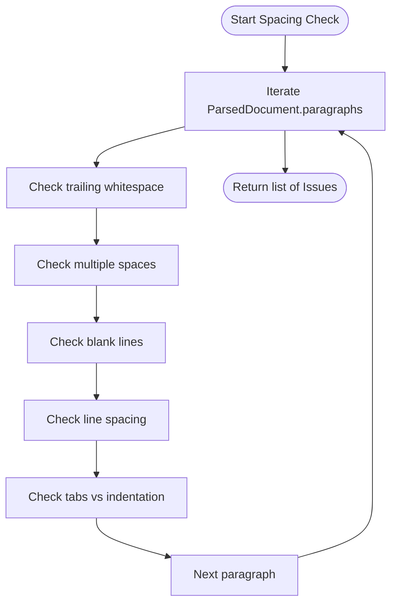
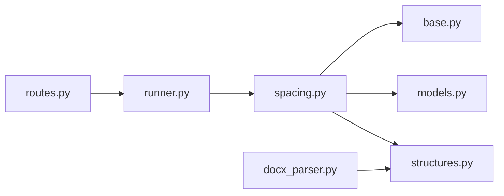

# Spacing Validation

<cite>
**Referenced Files in This Document**
- [spacing.py](file://backend/app/checkers/spacing.py)
- [base.py](file://backend/app/checkers/base.py)
- [models.py](file://backend/app/core/models.py)
- [structures.py](file://backend/app/parser/structures.py)
- [docx_parser.py](file://backend/app/parser/docx_parser.py)
- [routes.py](file://backend/app/api/routes.py)
- [runner.py](file://backend/app/runner.py)
- [design.md](file://docs/design.md)
- [plan.md](file://docs/plan.md)
</cite>

## Table of Contents
1. [Introduction](#introduction)
2. [Project Structure](#project-structure)
3. [Core Components](#core-components)
4. [Architecture Overview](#architecture-overview)
5. [Detailed Component Analysis](#detailed-component-analysis)
6. [Dependency Analysis](#dependency-analysis)
7. [Performance Considerations](#performance-considerations)
8. [Troubleshooting Guide](#troubleshooting-guide)
9. [Conclusion](#conclusion)

## Introduction
This document describes the spacing validation checker that ensures whitespace consistency, paragraph spacing, and layout coherence across a dissertation document. It defines validation rules for trailing whitespace, consecutive spaces, blank lines, line spacing, and tab usage, and explains how the checker integrates with the parsed document structure to produce actionable issues.

## Project Structure
The spacing checker is part of a plugin-based checker architecture. The main components involved in spacing validation are:
- The SpacingChecker class that implements the validation logic
- The BaseChecker interface that defines the contract for all checkers
- The ParsedDocument model that carries parsed paragraph metadata
- The Issue model that standardizes reporting of findings
- The API routes that orchestrate parsing and checker execution

**Diagram sources**
- [routes.py:20-27](file://backend/app/api/routes.py#L20-L27)
- [runner.py:8-24](file://backend/app/runner.py#L8-L24)
- [spacing.py:8-13](file://backend/app/checkers/spacing.py#L8-L13)
- [base.py:9-16](file://backend/app/checkers/base.py#L9-L16)
- [models.py:18-26](file://backend/app/core/models.py#L18-L26)
- [structures.py:77-89](file://backend/app/parser/structures.py#L77-L89)
- [docx_parser.py:161-237](file://backend/app/parser/docx_parser.py#L161-L237)

**Section sources**
- [routes.py:20-27](file://backend/app/api/routes.py#L20-L27)
- [runner.py:8-24](file://backend/app/runner.py#L8-L24)
- [spacing.py:8-13](file://backend/app/checkers/spacing.py#L8-L13)
- [base.py:9-16](file://backend/app/checkers/base.py#L9-L16)
- [models.py:18-26](file://backend/app/core/models.py#L18-L26)
- [structures.py:77-89](file://backend/app/parser/structures.py#L77-L89)
- [docx_parser.py:161-237](file://backend/app/parser/docx_parser.py#L161-L237)

## Core Components
- SpacingChecker: Implements whitespace and spacing validations against the parsed document.
- BaseChecker: Defines the common interface for all checkers.
- ParsedDocument and ParsedParagraph: Provide paragraph-level metadata including line spacing, indentation, and page break indicators.
- Issue and IssueLocation: Standardized reporting model for issues with severity, category, location, and suggestions.

Key integration points:
- The SpacingChecker consumes ParsedDocument.paragraphs and validates each paragraph’s spacing attributes.
- Issues are reported with IssueLocation containing paragraph_index and context_text for precise localization.

**Section sources**
- [spacing.py:8-13](file://backend/app/checkers/spacing.py#L8-L13)
- [base.py:9-16](file://backend/app/checkers/base.py#L9-L16)
- [structures.py:77-89](file://backend/app/parser/structures.py#L77-L89)
- [models.py:18-26](file://backend/app/core/models.py#L18-L26)

## Architecture Overview
The spacing validation operates within the checker pipeline:
1. The API endpoint parses the .docx into a ParsedDocument.
2. The CheckerRunner registers and invokes all checkers in sequence.
3. The SpacingChecker inspects paragraph metadata and emits issues.

**Diagram sources**
- [routes.py:35-65](file://backend/app/api/routes.py#L35-L65)
- [docx_parser.py:161-237](file://backend/app/parser/docx_parser.py#L161-L237)
- [runner.py:8-24](file://backend/app/runner.py#L8-L24)
- [spacing.py:12](file://backend/app/checkers/spacing.py#L12)
- [base.py:13-16](file://backend/app/checkers/base.py#L13-L16)
- [models.py:18-26](file://backend/app/core/models.py#L18-L26)
- [structures.py:77-89](file://backend/app/parser/structures.py#L77-L89)

## Detailed Component Analysis

### SpacingChecker Implementation
The SpacingChecker validates:
- Trailing whitespace in paragraphs
- Consecutive spaces within paragraphs
- Excessive blank lines between sections
- Line spacing consistency (expected 1.5)
- Tab usage versus paragraph indentation

Validation rules and behavior:
- Trailing whitespace: Warns when a paragraph ends with whitespace.
- Consecutive spaces: Warns when multiple spaces appear in a paragraph.
- Blank lines: Warns when more than a threshold of blank lines occur between sections.
- Line spacing: Errors when line spacing deviates from the expected value.
- Tabs: Warns when tab characters are used instead of paragraph indentation.

Integration with parsed document:
- Uses ParsedParagraph.line_spacing, ParsedParagraph.first_line_indent, and ParsedParagraph.has_page_break_before.
- Uses ParsedDocument.properties for document-level defaults.

**Diagram sources**
- [spacing.py:8-13](file://backend/app/checkers/spacing.py#L8-L13)
- [base.py:9-16](file://backend/app/checkers/base.py#L9-L16)
- [models.py:18-26](file://backend/app/core/models.py#L18-L26)
- [structures.py:77-89](file://backend/app/parser/structures.py#L77-L89)

**Section sources**
- [spacing.py:8-13](file://backend/app/checkers/spacing.py#L8-L13)
- [base.py:9-16](file://backend/app/checkers/base.py#L9-L16)
- [models.py:18-26](file://backend/app/core/models.py#L18-L26)
- [structures.py:77-89](file://backend/app/parser/structures.py#L77-L89)

### Validation Rules and Compliance Evaluation
- Inter-paragraph spacing: Enforced by consistent line spacing (1.5) and absence of excessive blank lines.
- Page breaks: Detected via paragraph-level page break flags; spacing checker focuses on whitespace consistency around page breaks.
- Indentation patterns: Uses first_line_indent metadata; warns about tabs instead of paragraph indentation.
- Visual layout coherence: Achieved by uniform line spacing, justified alignment (validated by formatting checker), and consistent margins (validated by formatting checker).

Evaluation process:
- Iterates through ParsedDocument.paragraphs.
- Applies regex and numeric comparisons to detect spacing violations.
- Emits Issue objects with severity, category, and actionable suggestions.

Examples of spacing violations:
- Paragraph ending with trailing whitespace
- Multiple consecutive spaces within a paragraph
- More than two blank lines between sections
- Line spacing not equal to 1.5
- Use of tab characters instead of paragraph indentation

Proper spacing guidelines:
- Remove trailing and leading whitespace
- Replace multiple spaces with single spaces
- Limit blank lines between sections to a defined threshold
- Set line spacing to 1.5
- Replace tabs with paragraph first-line indentation (e.g., 1.0 cm)

Formatting recommendations:
- Prefer paragraph indentation over tabs for alignment
- Maintain consistent line spacing across the document body
- Avoid excessive blank lines to preserve visual density

**Section sources**
- [spacing.py:1850-1963](file://backend/app/checkers/spacing.py#L1850-L1963)
- [docx_parser.py:179-214](file://backend/app/parser/docx_parser.py#L179-L214)
- [structures.py:6-20](file://backend/app/parser/structures.py#L6-L20)

### Integration with Parsed Document Structures
The SpacingChecker relies on:
- ParsedParagraph.line_spacing for line spacing checks
- ParsedParagraph.first_line_indent for indentation checks
- ParsedParagraph.has_page_break_before for page break awareness
- ParsedDocument.properties for document-level defaults

**Diagram sources**
- [spacing.py:1858-1865](file://backend/app/checkers/spacing.py#L1858-L1865)
- [docx_parser.py:179-214](file://backend/app/parser/docx_parser.py#L179-L214)
- [structures.py:6-20](file://backend/app/parser/structures.py#L6-L20)

**Section sources**
- [spacing.py:1858-1865](file://backend/app/checkers/spacing.py#L1858-L1865)
- [docx_parser.py:179-214](file://backend/app/parser/docx_parser.py#L179-L214)
- [structures.py:6-20](file://backend/app/parser/structures.py#L6-L20)

## Dependency Analysis
- SpacingChecker depends on BaseChecker for the interface contract.
- SpacingChecker produces Issue and IssueLocation instances.
- SpacingChecker consumes ParsedDocument and ParsedParagraph metadata.
- API routes register SpacingChecker alongside other checkers.
- DOCX parser populates ParsedDocument with spacing-related metadata.

**Diagram sources**
- [routes.py:20-27](file://backend/app/api/routes.py#L20-L27)
- [runner.py:8-24](file://backend/app/runner.py#L8-L24)
- [spacing.py:8-13](file://backend/app/checkers/spacing.py#L8-L13)
- [base.py:9-16](file://backend/app/checkers/base.py#L9-L16)
- [models.py:18-26](file://backend/app/core/models.py#L18-L26)
- [structures.py:77-89](file://backend/app/parser/structures.py#L77-L89)
- [docx_parser.py:161-237](file://backend/app/parser/docx_parser.py#L161-L237)

**Section sources**
- [routes.py:20-27](file://backend/app/api/routes.py#L20-L27)
- [runner.py:8-24](file://backend/app/runner.py#L8-L24)
- [spacing.py:8-13](file://backend/app/checkers/spacing.py#L8-L13)
- [base.py:9-16](file://backend/app/checkers/base.py#L9-L16)
- [models.py:18-26](file://backend/app/core/models.py#L18-L26)
- [structures.py:77-89](file://backend/app/parser/structures.py#L77-L89)
- [docx_parser.py:161-237](file://backend/app/parser/docx_parser.py#L161-L237)

## Performance Considerations
- Linear scan of paragraphs: O(n) per checker; acceptable for typical dissertation sizes.
- Regex-based checks: Minimal overhead; tuned to common patterns.
- Numeric comparisons: Constant-time per paragraph.
- Memory footprint: Issues are accumulated and returned; consider batching for very large documents.

## Troubleshooting Guide
Common issues and resolutions:
- Trailing whitespace warnings: Trim whitespace from paragraph ends.
- Multiple spaces warnings: Replace sequences of spaces with single spaces.
- Excessive blank lines: Reduce blank lines between sections to the allowed threshold.
- Line spacing errors: Adjust line spacing to 1.5 throughout the document.
- Tab usage warnings: Replace tabs with paragraph first-line indentation.

Integration tips:
- Ensure the DOCX parser is invoked before running checkers to populate ParsedDocument metadata.
- Verify that SpacingChecker is registered in the CheckerRunner.

**Section sources**
- [spacing.py:1867-1963](file://backend/app/checkers/spacing.py#L1867-L1963)
- [routes.py:20-27](file://backend/app/api/routes.py#L20-L27)
- [runner.py:8-24](file://backend/app/runner.py#L8-L24)

## Conclusion
The SpacingChecker provides essential whitespace and layout validation by leveraging parsed paragraph metadata. It enforces consistent line spacing, detects spacing anomalies, and flags layout irregularities to improve document readability and adherence to formatting standards. Its integration into the checker pipeline ensures comprehensive layout quality assessment alongside structural and typographic validations.