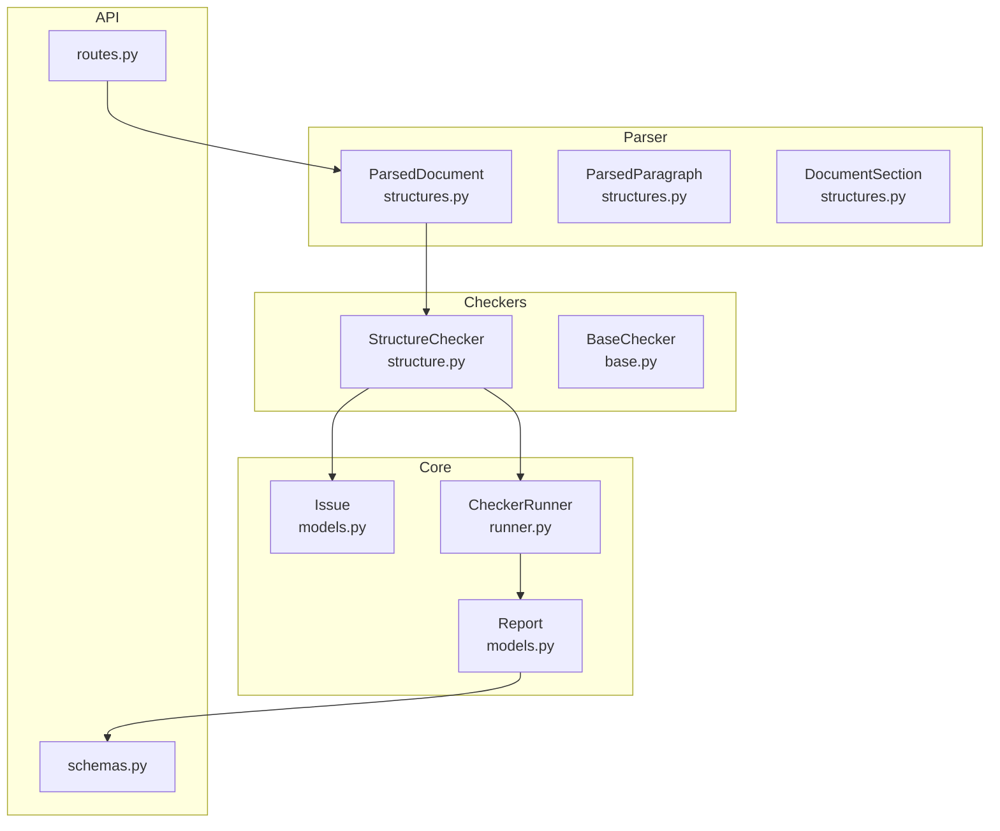
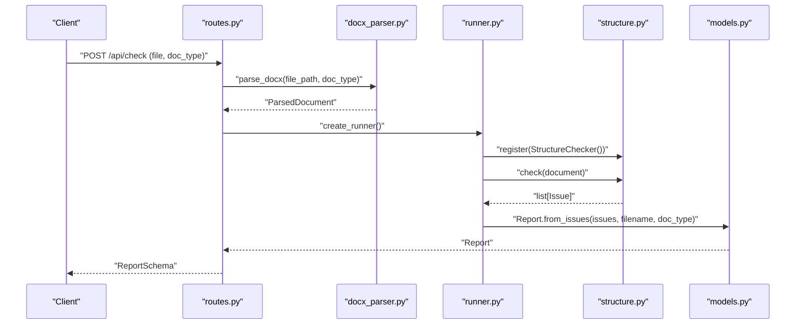
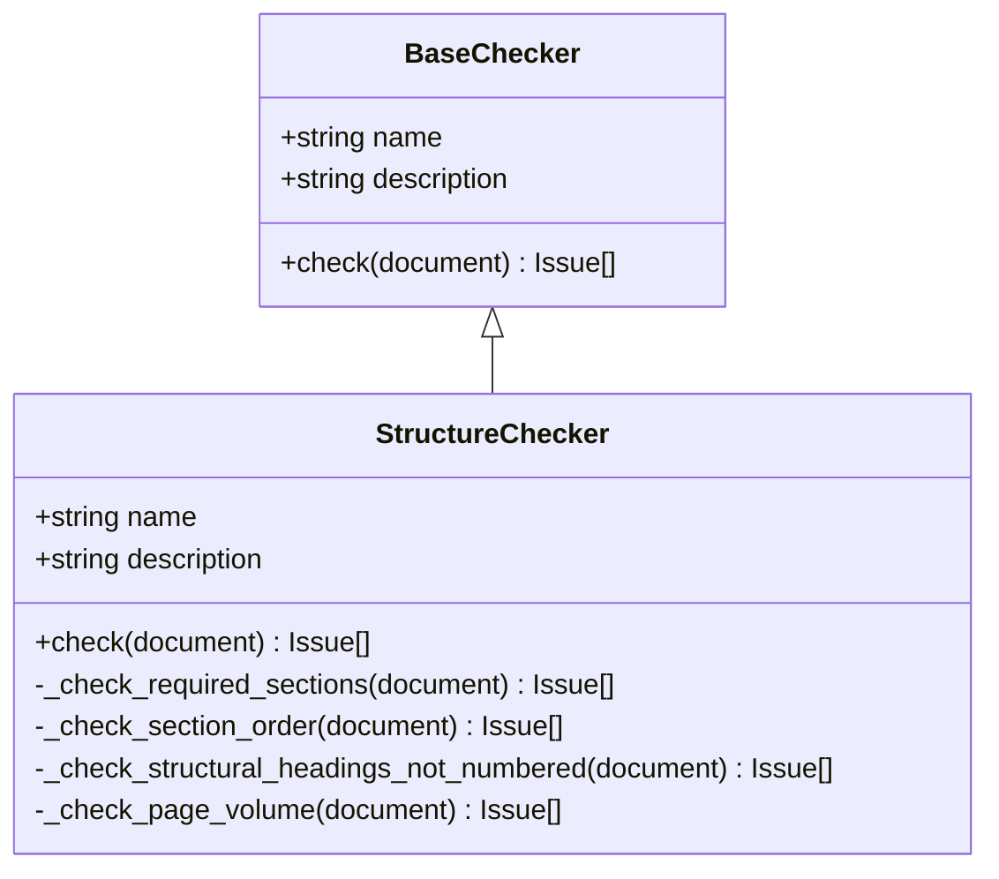
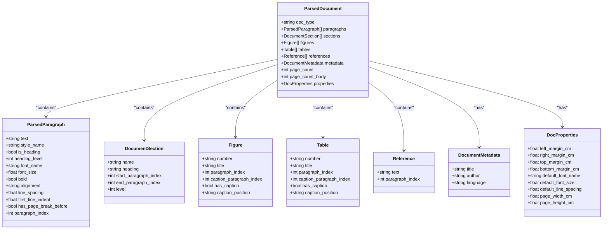
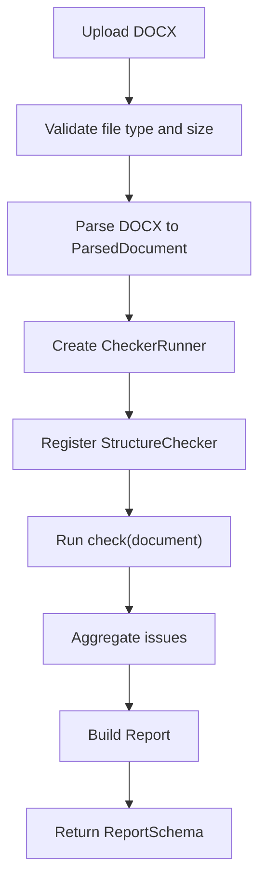

# Structure Validation

<cite>
**Referenced Files in This Document**
- [structure.py](file://backend/app/checkers/structure.py)
- [docx_parser.py](file://backend/app/parser/docx_parser.py)
- [structures.py](file://backend/app/parser/structures.py)
- [base.py](file://backend/app/checkers/base.py)
- [models.py](file://backend/app/core/models.py)
- [runner.py](file://backend/app/runner.py)
- [routes.py](file://backend/app/api/routes.py)
- [schemas.py](file://backend/app/api/schemas.py)
- [test_structure.py](file://backend/tests/test_structure.py)
- [conftest.py](file://backend/tests/conftest.py)
</cite>

## Table of Contents
1. [Introduction](#introduction)
2. [Project Structure](#project-structure)
3. [Core Components](#core-components)
4. [Architecture Overview](#architecture-overview)
5. [Detailed Component Analysis](#detailed-component-analysis)
6. [Dependency Analysis](#dependency-analysis)
7. [Performance Considerations](#performance-considerations)
8. [Troubleshooting Guide](#troubleshooting-guide)
9. [Conclusion](#conclusion)
10. [Appendices](#appendices)

## Introduction
This document describes the structure validation checker that enforces academic document structural requirements aligned with GOST 7.32-2017 Section 6.4. It explains how the checker analyzes document structure, identifies missing or misplaced sections, and generates issues with severity levels. It also details integration with the DOCX parser for extracting structural elements and the reporting mechanism for structural compliance issues.

## Project Structure
The structure validation lives in the backend under the checkers module and integrates with the parser and runner to produce a structured report.

**Diagram sources**
- [structure.py:47-148](file://backend/app/checkers/structure.py#L47-L148)
- [docx_parser.py:161-238](file://backend/app/parser/docx_parser.py#L161-L238)
- [structures.py:77-89](file://backend/app/parser/structures.py#L77-L89)
- [runner.py:8-25](file://backend/app/runner.py#L8-L25)
- [models.py:17-58](file://backend/app/core/models.py#L17-L58)
- [routes.py:35-66](file://backend/app/api/routes.py#L35-L66)
- [schemas.py:25-38](file://backend/app/api/schemas.py#L25-L38)

**Section sources**
- [structure.py:1-148](file://backend/app/checkers/structure.py#L1-L148)
- [docx_parser.py:1-238](file://backend/app/parser/docx_parser.py#L1-L238)
- [structures.py:1-89](file://backend/app/parser/structures.py#L1-L89)
- [runner.py:1-25](file://backend/app/runner.py#L1-L25)
- [models.py:1-58](file://backend/app/core/models.py#L1-L58)
- [routes.py:1-66](file://backend/app/api/routes.py#L1-L66)
- [schemas.py:1-38](file://backend/app/api/schemas.py#L1-L38)

## Core Components
- StructureChecker: Implements structural validation per GOST 7.32-2017 Section 6.4, including required sections, ordering, structural heading numbering, and page volume thresholds.
- DOCX Parser: Extracts paragraphs, sections, figures, tables, references, and document properties from DOCX files into ParsedDocument.
- Data Structures: Define the parsed document model and related entities.
- Runner: Orchestrates checker execution and aggregates issues into a report.
- API Routes: Expose upload and validation endpoints, integrating parser and runner.

Key responsibilities:
- Validate presence of required sections: title, abstract, contents, introduction, main, conclusion, references.
- Enforce strict ordering of structural sections.
- Ensure structural headings (e.g., contents, introduction, conclusion) are not numbered.
- Enforce minimum page volume thresholds per document type.
- Produce standardized issues with severity, category, location, message, suggestion, and rule reference.

**Section sources**
- [structure.py:47-148](file://backend/app/checkers/structure.py#L47-L148)
- [docx_parser.py:161-238](file://backend/app/parser/docx_parser.py#L161-L238)
- [structures.py:6-89](file://backend/app/parser/structures.py#L6-L89)
- [runner.py:8-25](file://backend/app/runner.py#L8-L25)
- [models.py:17-58](file://backend/app/core/models.py#L17-L58)

## Architecture Overview
End-to-end flow from DOCX upload to structured report:

**Diagram sources**
- [routes.py:35-66](file://backend/app/api/routes.py#L35-L66)
- [docx_parser.py:161-238](file://backend/app/parser/docx_parser.py#L161-L238)
- [runner.py:8-25](file://backend/app/runner.py#L8-L25)
- [structure.py:51-57](file://backend/app/checkers/structure.py#L51-L57)
- [models.py:28-58](file://backend/app/core/models.py#L28-L58)

## Detailed Component Analysis

### StructureChecker
Implements structural validation logic:
- Required sections detection: Compares found section types against a fixed set and reports missing ones as errors.
- Section ordering: Builds a classification order from headings and verifies monotonicity against the required order.
- Structural headings numbering: Detects headings that are structural but incorrectly numbered and warns.
- Page volume: Checks body page count against thresholds per document type and warns if below minimum.

Validation rules and severity:
- Missing required sections: error
- Out-of-order sections: error
- Numbered structural headings: warning
- Low page volume: warning

Integration points:
- Uses ParsedDocument sections and paragraphs.
- Emits Issue with IssueLocation for precise reporting.

Common violations and corrections:
- Missing: Add the missing section with correct heading text and content.
- Wrong order: Reorder sections so they follow the required sequence.
- Numbered structural headings: Remove numeric prefixes from headings like “1 Contents”.
- Low page volume: Expand main content to meet the minimum threshold for the document type.

**Section sources**
- [structure.py:47-148](file://backend/app/checkers/structure.py#L47-L148)
- [models.py:17-26](file://backend/app/core/models.py#L17-L26)

#### Class Diagram

**Diagram sources**
- [base.py:9-17](file://backend/app/checkers/base.py#L9-L17)
- [structure.py:47-57](file://backend/app/checkers/structure.py#L47-L57)

### DOCX Parser and ParsedDocument
The parser extracts:
- Paragraphs with style, heading status, heading level, font, alignment, spacing, indentation, and page break markers.
- Sections derived from first-level headings.
- Figures and tables detected by captions.
- References identified after a references heading until the next first-level heading.
- Document properties (margins, page size, default font).
- Estimated page counts.

These parsed elements feed the StructureChecker’s validations.

**Section sources**
- [docx_parser.py:161-238](file://backend/app/parser/docx_parser.py#L161-L238)
- [structures.py:6-89](file://backend/app/parser/structures.py#L6-L89)

#### Data Model Diagram

**Diagram sources**
- [structures.py:6-89](file://backend/app/parser/structures.py#L6-L89)

### API Integration and Reporting
- The API endpoint accepts a DOCX file and document type, parses the file, runs all registered checkers, and returns a structured report.
- Issues are aggregated into a Report with counts by severity and category.

**Section sources**
- [routes.py:35-66](file://backend/app/api/routes.py#L35-L66)
- [runner.py:15-25](file://backend/app/runner.py#L15-L25)
- [models.py:28-58](file://backend/app/core/models.py#L28-L58)
- [schemas.py:25-38](file://backend/app/api/schemas.py#L25-L38)

#### API Flow

**Diagram sources**
- [routes.py:35-66](file://backend/app/api/routes.py#L35-L66)
- [runner.py:15-25](file://backend/app/runner.py#L15-L25)
- [models.py:28-58](file://backend/app/core/models.py#L28-L58)

## Dependency Analysis
- StructureChecker depends on:
  - ParsedDocument for structural elements (sections, paragraphs).
  - Issue and IssueLocation for reporting.
  - Regular expressions for detecting numbered headings.
- DOCX Parser produces ParsedDocument consumed by StructureChecker.
- Runner composes multiple checkers and aggregates issues into Report.
- API routes integrate parser, runner, and schemas.

Potential coupling and cohesion:
- Strong cohesion within StructureChecker for structural validation.
- Loose coupling via ParsedDocument contract.
- Centralized registration in routes ensures extensibility.

**Section sources**
- [structure.py:47-148](file://backend/app/checkers/structure.py#L47-L148)
- [docx_parser.py:161-238](file://backend/app/parser/docx_parser.py#L161-L238)
- [runner.py:8-25](file://backend/app/runner.py#L8-L25)
- [routes.py:20-27](file://backend/app/api/routes.py#L20-L27)

## Performance Considerations
- Section classification scans all sections and uses a simple keyword matching approach; complexity is O(N*M) where N is sections and M is keywords per type.
- Ordering validation compares indices along the classified order; complexity is O(K) where K is the number of recognized structural sections.
- Structural heading numbering uses a regex match per heading; complexity is O(H) where H is the number of first-level headings.
- Page volume check is constant-time.
- Recommendations:
  - Precompile regex patterns once at module load.
  - Cache keyword lookups in a trie-like structure if keyword sets grow.
  - Consider early exits when thresholds are exceeded.

[No sources needed since this section provides general guidance]

## Troubleshooting Guide
Common structural violations and corrective actions:
- Missing required section: Add the missing section with the correct heading text and content.
- Out-of-order sections: Reorder sections so they follow the required sequence.
- Numbered structural headings: Remove numeric prefixes from headings like “1 Contents”.
- Low page volume: Expand main content to meet the minimum threshold for the document type.

Verification via tests:
- Correct structure yields zero errors.
- Missing required headings trigger missing-section issues.
- Wrong order triggers order-related issues.
- Numbered structural headings trigger warnings.
- Page volume below thresholds triggers warnings.

**Section sources**
- [test_structure.py:13-74](file://backend/tests/test_structure.py#L13-L74)
- [conftest.py:10-57](file://backend/tests/conftest.py#L10-L57)

## Conclusion
The structure validation checker enforces GOST 7.32-2017 Section 6.4 requirements by validating required sections, enforcing strict ordering, preventing numbering of structural headings, and checking minimum page volumes. It integrates seamlessly with the DOCX parser and the checker runner to produce a comprehensive report suitable for API consumption.

[No sources needed since this section summarizes without analyzing specific files]

## Appendices

### Validation Rules Summary
- Required sections: title, abstract, contents, introduction, main, conclusion, references.
- Ordering: Must appear in the specified order; any inversion is flagged as an error.
- Structural headings: Must not be numbered; numbered structural headings are warned.
- Page volume: Must meet minimum thresholds per document type; below-threshold warnings are issued.

**Section sources**
- [structure.py:9-36](file://backend/app/checkers/structure.py#L9-L36)
- [structure.py:81-109](file://backend/app/checkers/structure.py#L81-L109)
- [structure.py:111-132](file://backend/app/checkers/structure.py#L111-L132)
- [structure.py:134-147](file://backend/app/checkers/structure.py#L134-L147)